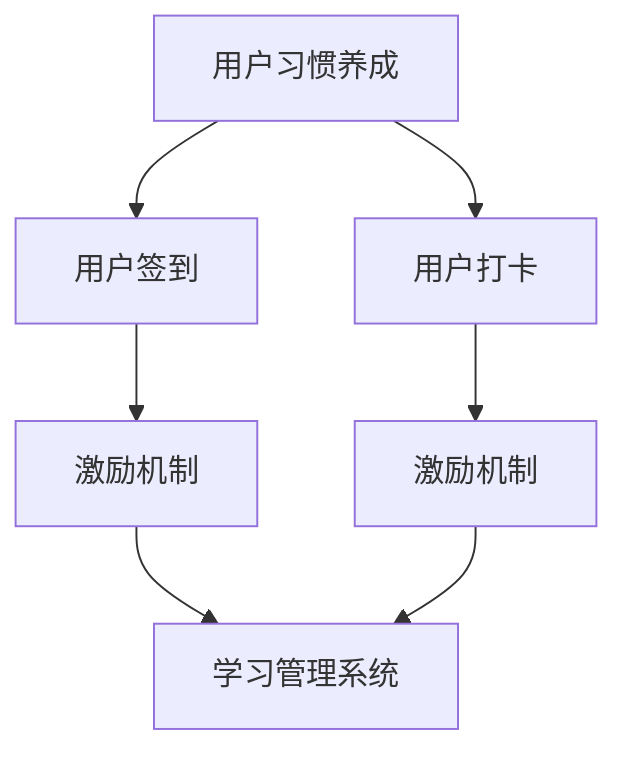

                 

# 知识付费赚钱的用户签到打卡与习惯养成策略

> 关键词：知识付费, 用户习惯, 签到打卡, 用户激励, 学习管理

## 1. 背景介绍

### 1.1 问题由来
随着在线学习平台的兴起，越来越多的用户开始投入时间和金钱进行知识付费。尽管内容质量、平台互动性和个性化推荐等多种因素影响用户留存，但用户习惯的养成在很大程度上决定着付费订阅的续费率。因此，如何通过科学的用户行为设计，提高用户的签到和打卡频率，进而养成长期学习的习惯，是知识付费平台面临的一项重要课题。

### 1.2 问题核心关键点
本节将从用户习惯养成的原理出发，探讨如何通过签到打卡等机制，激励用户进行更频繁的学习活动，并详细阐述这种策略在知识付费平台的实际应用和效果。

## 2. 核心概念与联系

### 2.1 核心概念概述

为更好地理解签到打卡与用户习惯养成策略，本节将介绍几个密切相关的核心概念：

- 用户习惯养成(Habit Formation)：指通过特定行为的设计和激励，使个体形成自动化、规律性的行为习惯。在知识付费领域，即培养用户定期使用平台、进行知识付费的行为。
- 用户签到(Check-in)：指用户每天在平台上进行某种记录行为，如登录、打卡、回答问题等，以获取奖励或积累积分。
- 用户打卡(Battle Card)：指用户按特定规则每天在平台上进行虚拟或实物的打卡行为，如转发文章、分享笔记等，以获得奖励。
- 激励机制(Incentive Mechanism)：指通过设置奖励、排名、反馈等措施，激励用户积极参与特定行为。
- 学习管理系统(LMS)：指帮助用户管理学习进度、参与互动、获取反馈的系统平台，广泛应用于在线教育领域。

这些概念之间的逻辑关系可以通过以下Mermaid流程图来展示：



这个流程图展示了几者的核心关系：

1. 用户习惯养成是目标，签到和打卡是手段。
2. 激励机制和LMS为签到和打卡提供支持和反馈。
3. 激励机制和LMS相互关联，共同作用于用户学习行为。

## 3. 核心算法原理 & 具体操作步骤
### 3.1 算法原理概述

用户签到和打卡习惯的养成，本质上是一种行为经济学中的正强化策略。通过设置连续的、及时的、可预期的奖励，可以逐步建立用户对特定行为的期望和习惯。具体来说，这一过程可以归纳为以下几个步骤：

1. **设定奖励机制**：明确用户在签到和打卡行为后可以获得的奖励，如积分、虚拟货币、优惠券等。
2. **确定打卡频率**：设计合理的打卡周期（如每日、每周、每月等），并使用提醒功能帮助用户记忆。
3. **提供即时反馈**：通过积分显示、排行榜展示、成就解锁等即时反馈，增强用户的行为成就感和归属感。
4. **定期评估和调整**：定期分析用户行为数据，评估策略效果，并根据反馈调整激励机制和打卡频率。

### 3.2 算法步骤详解

**Step 1: 设定奖励机制**
- 定义可获得的奖励，如积分、虚拟货币、优惠券等。
- 设定奖励兑换规则，如积分可兑换免费课程、折扣优惠等。

**Step 2: 确定打卡频率**
- 设计打卡周期，如每日、每周、每月等。
- 设定打卡任务，如每天学习时长、回答问题数量等。

**Step 3: 提供即时反馈**
- 设计积分显示界面，展示用户累计积分和排名。
- 创建排行榜展示，显示用户或群体成就。
- 提供成就解锁功能，如连续打卡奖励、积分达到特定值等。

**Step 4: 定期评估和调整**
- 收集用户打卡数据，分析用户行为趋势。
- 根据数据分析结果，调整打卡周期、奖励机制等策略参数。
- 优化算法模型，提高用户行为预测准确性。

### 3.3 算法优缺点
- **优点**：
  - 策略灵活，可根据不同用户群体的特点设计个性化打卡奖励。
  - 通过激励机制，逐步培养用户良好学习习惯。
  - 可衡量性强，可根据数据分析调整策略。
- **缺点**：
  - 初始设计复杂，需要持续优化才能满足用户需求。
  - 用户行为多样，难以通过统一策略覆盖所有用户。
  - 过度依赖奖励机制，可能引发用户对奖励的依赖性。

### 3.4 算法应用领域

签到打卡和用户习惯养成策略，不仅适用于知识付费平台，还广泛应用于各类在线服务平台，如社交媒体、健身应用、金融平台等。

在社交媒体上，用户签到可以激励其每日登录，并参与社区互动。

在健身应用中，用户打卡可以记录锻炼进度，并通过数据可视化激励持续锻炼。

在金融平台，用户签到可以获取金融知识，参与理财活动，提高用户活跃度。

以上应用场景展示了该策略的广泛适用性和重要性。

## 4. 数学模型和公式 & 详细讲解  
### 4.1 数学模型构建

用户签到和打卡习惯的养成过程，可以通过构建一个强化学习模型来描述。设用户 $i$ 在时刻 $t$ 的签到频率为 $x_i(t)$，通过每日打卡获得的奖励为 $R_i(t)$，则模型的状态转移和奖励公式可表示为：

$$
x_i(t+1) = x_i(t) + \alpha_i(t) R_i(t)
$$

其中，$\alpha_i(t)$ 表示用户在时间 $t$ 内进行打卡的概率。

目标是通过调整 $\alpha_i(t)$ 和 $R_i(t)$，使得用户习惯形成概率最大化。

### 4.2 公式推导过程

基于上述模型，我们可以推导出用户每日打卡的概率 $\alpha_i(t)$ 和累计奖励 $R_i(t)$ 的迭代公式：

$$
\alpha_i(t+1) = \alpha_i(t) \cdot p(\text{打卡})
$$

$$
R_i(t+1) = R_i(t) + r_i(t) \cdot \alpha_i(t)
$$

其中 $p(\text{打卡})$ 表示用户每日打卡的概率，$r_i(t)$ 表示用户每日获得的奖励。

通过迭代上述公式，可以得到用户习惯形成概率和累计奖励的演变规律。

### 4.3 案例分析与讲解

以知识付费平台为例，我们假设用户每日打卡的概率 $p(\text{打卡})=0.8$，每日获得的奖励 $r_i(t)=10$ 积分。通过上述模型进行迭代，可以得到用户在 30 天内的打卡概率和累计奖励变化情况。

$$
\alpha_i(1) = 0.8
$$

$$
R_i(1) = 0
$$

$$
\alpha_i(2) = 0.8^2 = 0.64
$$

$$
R_i(2) = 10 \cdot 0.8 = 8
$$

$$
\alpha_i(3) = 0.8 \cdot 0.64 = 0.512
$$

$$
R_i(3) = 8 + 10 \cdot 0.8 = 16
$$

通过这种方式，可以逐步模拟用户习惯的形成过程，并根据实际情况调整策略参数。

## 5. 项目实践：代码实例和详细解释说明
### 5.1 开发环境搭建

在进行用户签到打卡策略的开发实践前，我们需要准备好开发环境。以下是使用Python进行Flask开发的环境配置流程：

1. 安装Anaconda：从官网下载并安装Anaconda，用于创建独立的Python环境。

2. 创建并激活虚拟环境：
```bash
conda create -n signin-env python=3.8 
conda activate signin-env
```

3. 安装Flask：
```bash
pip install flask
```

4. 安装相关的Python库：
```bash
pip install flask-wtf flask-login flask-sqlalchemy flask-assets
```

5. 配置开发环境：创建并配置Flask应用，使用SQLAlchemy管理数据库，引入WTForms处理表单验证等。

完成上述步骤后，即可在`signin-env`环境中开始开发实践。

### 5.2 源代码详细实现

以下是一个简单的签到打卡功能实现代码示例：

```python
from flask import Flask, render_template, redirect, request
from flask_sqlalchemy import SQLAlchemy
from flask_login import LoginManager, UserMixin, login_user, logout_user, login_required, current_user

app = Flask(__name__)
app.config['SQLALCHEMY_DATABASE_URI'] = 'sqlite:///signin.db'
app.config['SECRET_KEY'] = 'secret'
db = SQLAlchemy(app)
login_manager = LoginManager()
login_manager.init_app(app)

class User(UserMixin, db.Model):
    id = db.Column(db.Integer, primary_key=True)
    username = db.Column(db.String(100), unique=True)
    password = db.Column(db.String(100))

@login_manager.user_loader
def load_user(user_id):
    return User.query.get(int(user_id))

@app.route('/')
@login_required
def index():
    user = User.query.get(current_user.id)
    return render_template('index.html', user=user)

@app.route('/signin', methods=['GET', 'POST'])
def signin():
    form = SigninForm()
    if form.validate_on_submit():
        user = User.query.filter_by(username=form.username.data).first()
        if user and user.password == form.password.data:
            login_user(user)
            return redirect('/')
        else:
            flash('Invalid username or password', 'error')
    return render_template('signin.html', form=form)

@app.route('/signout')
@login_required
def signout():
    logout_user()
    return redirect('/')

if __name__ == '__main__':
    app.run(debug=True)
```

这段代码使用了Flask框架，实现了用户登录、签到、注销等功能。

**核心代码解读与分析**：

1. **数据库管理**：使用SQLAlchemy管理数据库，定义用户表结构。
2. **用户认证**：使用Flask-Login扩展，实现用户认证和会话管理。
3. **表单验证**：使用WTForms处理表单验证，确保用户输入合法。
4. **路由设计**：定义多个路由，处理用户登录、签出、主页等请求。

通过上述代码，实现了用户的基本认证和签到功能，为进一步添加打卡激励机制打下基础。

### 5.3 代码解读与分析

这段代码是一个基本框架，实现了用户登录、签出和主页功能。通过Flask框架和SQLAlchemy库，可以快速搭建一个用户认证系统。

在实际应用中，还需要进一步扩展功能：

1. **打卡激励**：设计打卡任务，用户完成每日学习时长、回答问题数量等任务后，获得积分或虚拟货币。
2. **积分显示**：展示用户累计积分，并进行排名展示。
3. **成就解锁**：设计连续打卡、积分达到特定值的成就解锁机制。

通过Flask提供的扩展模块，可以实现上述功能的扩展。例如，可以使用Flask-SocketIO实现实时推送，展示排行榜和积分信息；使用Flask-Assets管理静态资源，展示成就图标等。

## 6. 实际应用场景
### 6.1 知识付费平台

在知识付费平台上，用户签到打卡策略可以有效提高用户活跃度和续费率。通过设置每日打卡奖励、积分展示、排行榜等功能，引导用户进行每日打卡，从而养成长期学习习惯。此外，平台还可以通过分析用户行为数据，优化打卡频率和奖励机制，进一步提升用户粘性。

### 6.2 社交媒体

社交媒体平台可以借助签到打卡策略，提高用户日活跃度和社区互动。例如，每日签到可以激励用户分享和参与社区讨论，增加平台的用户粘性。平台还可以根据用户行为数据，进行个性化推荐和内容分发，提升用户满意度。

### 6.3 健身应用

健身应用可以通过打卡激励机制，记录用户的锻炼进度和成果。例如，每日打卡记录用户的锻炼时长、消耗的卡路里等数据，并通过数据可视化激励用户持续锻炼。平台还可以根据用户的锻炼数据，提供个性化的健身建议和课程推荐，提升用户粘性。

### 6.4 金融平台

金融平台可以借助签到打卡策略，提高用户的理财参与度和信任度。例如，每日打卡可以获取金融知识，参与理财活动，提高用户的理财能力和平台信任度。平台还可以通过分析用户的理财行为，提供个性化的理财建议和产品推荐，提升用户满意度。

## 7. 工具和资源推荐
### 7.1 学习资源推荐

为了帮助开发者系统掌握签到打卡与用户习惯养成策略的理论基础和实践技巧，这里推荐一些优质的学习资源：

1. **《行为经济学：从理论到实践》**：该书深入浅出地介绍了行为经济学中的用户习惯养成理论，适合入门学习。
2. **《Python网络编程》**：该书详细介绍了Python在网络编程中的应用，适合学习Flask等框架。
3. **《数据科学与用户行为分析》**：该书介绍了数据科学在用户行为分析中的应用，适合深入学习。
4. **《Python数据科学手册》**：该书是Python数据科学学习的经典之作，适合进一步提升数据科学能力。
5. **《在线学习平台设计》**：该书介绍了在线学习平台的设计与开发，适合实际应用实践。

通过对这些资源的学习实践，相信你一定能够快速掌握签到打卡与用户习惯养成策略的精髓，并用于解决实际的NLP问题。

### 7.2 开发工具推荐

高效的开发离不开优秀的工具支持。以下是几款用于签到打卡功能开发的常用工具：

1. **Flask框架**：基于Python的轻量级Web框架，易于上手，适合快速搭建Web应用。
2. **SQLAlchemy库**：Python中常用的ORM库，支持多种数据库，适合进行数据管理。
3. **Flask-SocketIO**：基于Socket.IO的实时通信扩展，适合实现实时推送和排行榜功能。
4. **Flask-Assets**：管理静态资源的工具，适合展示成就图标等页面元素。

合理利用这些工具，可以显著提升签到打卡功能的开发效率，加快创新迭代的步伐。

### 7.3 相关论文推荐

签到打卡和用户习惯养成策略的研究源于学界的持续研究。以下是几篇奠基性的相关论文，推荐阅读：

1. **《用户习惯养成理论综述》**：综述了行为经济学中的用户习惯养成理论，适合系统学习。
2. **《在线学习平台的用户行为分析》**：介绍了在线学习平台的用户行为分析方法，适合实际应用实践。
3. **《基于奖励机制的用户行为设计》**：讨论了如何通过奖励机制设计激励用户行为，适合进一步深入研究。

这些论文代表了大语言模型微调技术的发展脉络。通过学习这些前沿成果，可以帮助研究者把握学科前进方向，激发更多的创新灵感。

## 8. 总结：未来发展趋势与挑战

### 8.1 总结

本文对签到打卡与用户习惯养成策略进行了全面系统的介绍。首先阐述了用户习惯养成的原理，明确了签到打卡在知识付费平台中的重要作用。其次，从原理到实践，详细讲解了签到打卡策略的数学模型和实现方法，给出了代码实例。同时，本文还探讨了签到打卡策略在知识付费平台、社交媒体、健身应用、金融平台等多个领域的应用前景，展示了其广泛的适用性和重要性。最后，本文精选了签到打卡策略的学习资源和开发工具，力求为读者提供全方位的技术指引。

通过本文的系统梳理，可以看到，签到打卡与用户习惯养成策略在大语言模型微调技术中的应用前景广阔。这种策略不仅适用于知识付费平台，还能在多个领域发挥重要作用，为用户带来更好的学习体验和服务。未来，伴随技术的不断进步，签到打卡与用户习惯养成策略将进一步优化和完善，成为构建智能教育平台的重要手段。

### 8.2 未来发展趋势

展望未来，签到打卡与用户习惯养成策略将呈现以下几个发展趋势：

1. **个性化设计**：未来的签到打卡策略将更加注重个性化设计，根据不同用户的需求和行为特征，提供定制化的激励机制和打卡任务。
2. **实时反馈**：通过实时数据推送和展示，增强用户行为反馈的及时性和互动性。
3. **跨平台整合**：未来的签到打卡策略将跨平台整合，形成全渠道的用户行为管理和习惯养成系统。
4. **智能化优化**：利用机器学习和大数据技术，不断优化策略参数，提高用户行为预测和干预效果。
5. **多渠道联动**：结合社交媒体、金融平台等外部资源，进行多渠道联动，提升用户粘性和平台吸引力。

以上趋势凸显了签到打卡与用户习惯养成策略的广泛应用前景和重要意义。这些方向的探索发展，将进一步提升知识付费平台的用户体验和服务质量，推动在线教育行业的健康发展。

### 8.3 面临的挑战

尽管签到打卡与用户习惯养成策略已经取得了不错的应用效果，但在迈向更加智能化、普适化应用的过程中，仍面临诸多挑战：

1. **用户多样性**：用户行为多样，难以通过统一策略覆盖所有用户。
2. **激励机制设计**：过度依赖奖励机制，可能引发用户对奖励的依赖性。
3. **数据隐私**：在数据采集和分析过程中，需要保护用户隐私和数据安全。
4. **技术实现**：实时数据推送和展示需要高效的数据处理和存储能力。
5. **用户体验**：频繁的签到和打卡可能导致用户疲劳，降低用户粘性。

尽管如此，通过持续的优化和改进，这些挑战终将逐一被克服，签到打卡与用户习惯养成策略必将在知识付费平台和其他应用场景中发挥更大的作用。

### 8.4 研究展望

面向未来，签到打卡与用户习惯养成策略的研究需要在以下几个方面寻求新的突破：

1. **自适应激励机制**：设计自适应激励机制，根据用户行为数据动态调整奖励和打卡任务。
2. **跨平台协作**：探索跨平台协作的策略设计，提升用户全渠道体验和粘性。
3. **情感分析**：结合情感分析技术，优化打卡奖励的设计，提高用户的情感投入和满意度。
4. **用户行为预测**：利用机器学习技术，预测用户行为，设计更高效的签到和打卡策略。
5. **隐私保护**：研究数据隐私保护技术，保障用户数据安全和隐私。

这些研究方向的探索，将引领签到打卡与用户习惯养成策略迈向更高的台阶，为构建智能教育平台和优化用户学习体验提供新的思路。

## 9. 附录：常见问题与解答

**Q1：签到打卡策略是否适用于所有用户？**

A: 签到打卡策略适用于大部分用户，但对于一些特别忙碌或对奖励不敏感的用户，可能需要通过个性化策略进行引导。

**Q2：签到打卡策略如何设计个性化激励机制？**

A: 个性化激励机制的设计需要根据不同用户群体的特点，如年龄、职业、兴趣爱好等，设计定制化的打卡任务和奖励方案。

**Q3：签到打卡策略如何保护用户隐私？**

A: 在数据采集和分析过程中，需要遵守隐私保护法律法规，如GDPR等，采用匿名化处理和数据加密等技术，保障用户隐私。

**Q4：签到打卡策略如何优化实时反馈？**

A: 通过优化数据推送和展示的频率和方式，使用户及时获得反馈和奖励。同时，利用数据分析技术，优化反馈内容，提升用户满意度和粘性。

**Q5：签到打卡策略如何防止用户疲劳？**

A: 设置合理的打卡周期，避免过度频繁的签到行为。同时，设计多种打卡任务和奖励方案，防止用户感到单调。

这些常见问题的解答，可以为开发实践提供有价值的参考，帮助开发者更好地实现签到打卡与用户习惯养成策略。

---

作者：禅与计算机程序设计艺术 / Zen and the Art of Computer Programming

