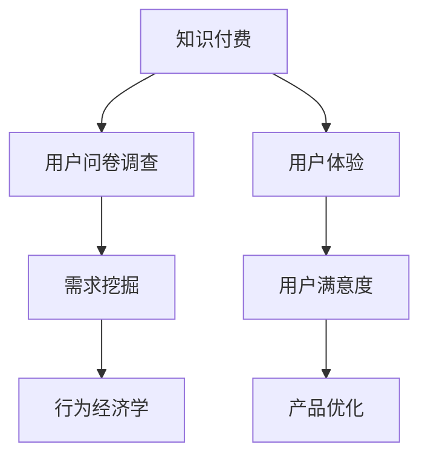

                 

# 知识付费赚钱的用户问卷调查与需求挖掘策略

## 1. 背景介绍

随着互联网的普及和数字技术的快速发展，知识付费市场迅速崛起。各大平台如喜马拉雅、得到、知识星球等纷纷入局，推动了知识产品的普及和付费机制的形成。据统计，中国知识付费市场规模已突破千亿，预计未来将继续保持高速增长。但与此同时，用户是否真正愿意为知识付费，这一问题的答案并不确定。

为了回答这一问题，我们需要开展系统化的用户问卷调查，了解用户对知识付费的需求和动机，以及他们对知识付费平台的使用体验。这不仅有助于平台优化产品策略，提升用户满意度，还为未来知识付费业务的发展提供重要依据。

## 2. 核心概念与联系

### 2.1 核心概念概述

在本文中，我们将重点介绍几个核心概念及其联系：

- **知识付费**：指用户为获取具有一定知识价值的信息或服务，而进行的付费行为。这一行为基于用户对知识的价值认同和获取需求。

- **用户问卷调查**：通过设计问卷并收集用户的反馈信息，了解用户行为和需求的一种研究方法。问卷调查结果能帮助企业制定更为科学的营销和产品策略。

- **需求挖掘**：指通过分析用户数据，识别用户潜在需求，从而指导产品设计和服务优化。需求挖掘是提升用户体验、提升用户满意度的重要手段。

- **行为经济学**：研究人们在不同经济环境下如何做出决策，并据此指导产品设计和市场策略的学科。知识付费市场的研究需要应用行为经济学的理论和方法。

### 2.2 核心概念原理和架构的 Mermaid 流程图



## 3. 核心算法原理 & 具体操作步骤

### 3.1 算法原理概述

知识付费市场的研究需要综合运用问卷调查、数据分析、行为经济学等多个学科的理论和方法。具体而言，我们首先需要设计科学的问卷，收集用户关于知识付费的实际使用情况和行为偏好数据。然后，通过对这些数据的统计分析，挖掘出用户的需求和动机。最后，应用行为经济学理论，理解用户行为背后的心理动因，从而指导产品的优化和服务的提升。

### 3.2 算法步骤详解

#### 3.2.1 问卷设计

问卷设计是用户研究的首要环节，直接影响数据的收集效果和分析结果的准确性。设计问卷时应遵循以下原则：

1. **目标明确**：问卷应明确用户调研的具体目标，如了解用户对知识付费的兴趣、使用频率、付费意愿等。
2. **问题简洁**：问卷应尽量使用简洁、直接的语言，避免使用专业术语或复杂问题，以确保用户易于理解和回答。
3. **结构合理**：问卷应分为不同的部分，如基本信息、使用情况、付费意愿等，以便于数据分析。
4. **逻辑连贯**：问卷各部分之间应逻辑连贯，避免前后不一致，引导用户自然流畅地完成回答。

#### 3.2.2 数据收集

问卷收集可以通过线上线下多种方式进行，包括：

1. **线上问卷平台**：如SurveyMonkey、Google Forms等，这些平台提供了丰富的问卷设计工具和数据分析功能。
2. **社交媒体**：通过微博、微信等社交媒体平台发布问卷，收集用户反馈。
3. **应用内调查**：在知识付费平台内嵌入问卷，收集用户行为数据。

#### 3.2.3 数据分析

问卷收集完成后，需要对数据进行系统化的分析。常见的数据分析方法包括：

1. **描述性分析**：通过统计均值、中位数、标准差等指标，描述用户的基本特征和行为模式。
2. **相关性分析**：使用皮尔逊相关系数、斯皮尔曼相关系数等方法，分析不同因素之间的相关性。
3. **回归分析**：通过多元线性回归等模型，预测用户行为变化，识别关键影响因素。

#### 3.2.4 需求挖掘

需求挖掘是用户研究的核心目标。具体步骤如下：

1. **数据清理**：去除数据中的异常值和重复记录，确保数据的准确性和完整性。
2. **聚类分析**：使用K-means、层次聚类等算法，将用户分为不同群体，识别不同群体的特征和需求。
3. **主题模型**：使用LDA等主题模型，识别用户关注的关键词和主题，理解用户的核心需求。
4. **情感分析**：使用情感词典、文本分类等技术，分析用户对知识付费的情感倾向，识别用户的正面和负面反馈。

#### 3.2.5 行为经济学应用

行为经济学提供了丰富的理论和方法，用于解释用户行为和需求，指导产品优化。例如，通过框架效应理论，理解用户对价格和风险的不同感知；通过损失规避理论，解释用户付费意愿的来源；通过禀赋效应理论，解释用户对已有知识的不舍。

### 3.3 算法优缺点

#### 3.3.1 优点

1. **全面性**：问卷调查和数据分析可以全面了解用户需求和行为，为产品优化提供数据支持。
2. **系统性**：通过系统的数据分析方法，识别关键影响因素，提升产品策略的科学性。
3. **可操作性**：问卷调查和数据分析结果可以直接用于产品设计和服务优化，提升用户体验。

#### 3.3.2 缺点

1. **数据质量**：问卷设计不合理或数据收集方法不当，可能导致数据质量不高，影响分析结果。
2. **成本高**：问卷设计、数据收集和分析都需要人力物力投入，成本较高。
3. **用户参与度**：用户参与度不高，问卷反馈可能无法全面反映用户需求。

### 3.4 算法应用领域

知识付费市场的研究不仅可以应用于平台自身的优化和提升，还可以指导其他企业开展类似业务。具体应用领域包括：

1. **教育培训**：通过问卷调查和数据分析，了解学生对在线课程的需求，优化课程设计和教学方法。
2. **企业培训**：通过问卷调查和数据分析，了解员工对企业内训的需求，提升培训效果。
3. **健康管理**：通过问卷调查和数据分析，了解用户对健康管理知识的需求，优化健康产品设计。
4. **金融理财**：通过问卷调查和数据分析，了解用户对金融理财知识的兴趣，优化理财服务内容。
5. **生活方式**：通过问卷调查和数据分析，了解用户对生活方式和消费习惯的需求，优化商品推荐和服务设计。

## 4. 数学模型和公式 & 详细讲解

### 4.1 数学模型构建

在本节中，我们将使用数学语言对问卷调查和数据分析的基本模型进行构建。

设用户总数为 $N$，问卷中涉及的变量为 $x_i$，$i=1,2,\dots,n$。问卷设计时，我们通常需要选择不同类型的问题，如单选题、多选题、评分题等。

问卷调查完成后，我们可以得到如下数据集：

$$
\mathcal{D} = \{(x_i, y_i)\}_{i=1}^N, x_i \in \{0,1\}, y_i \in \{0,1\}
$$

其中 $x_i$ 表示用户是否参与了问卷调查，$y_i$ 表示用户对问卷的满意度。

### 4.2 公式推导过程

基于上述数据集，我们可以构建以下数学模型：

#### 4.2.1 描述性分析

1. **均值**：
   $$
   \mu_x = \frac{1}{N}\sum_{i=1}^N x_i
   $$
   表示用户参与问卷调查的比例。

2. **中位数**：
   $$
   M_x = \frac{1}{2}\left(x_{(i)} + x_{(i+1)}\right)
   $$
   表示用户参与问卷调查的比例的中位数。

3. **标准差**：
   $$
   \sigma_x = \sqrt{\frac{1}{N-1}\sum_{i=1}^N (x_i - \mu_x)^2}
   $$
   表示用户参与问卷调查的比例的离散程度。

#### 4.2.2 相关性分析

使用皮尔逊相关系数 $\rho_{xy}$ 描述用户参与问卷调查和满意度的相关性：
$$
\rho_{xy} = \frac{Cov(x,y)}{\sigma_x \sigma_y}
$$
其中 $Cov(x,y)$ 表示 $x$ 和 $y$ 的协方差。

#### 4.2.3 回归分析

使用多元线性回归模型 $y = \beta_0 + \beta_1 x + \epsilon$ 预测用户满意度，其中：
$$
\beta_1 = \frac{Cov(x,y)}{Var(x)}
$$
$$
\epsilon \sim N(0, \sigma^2)
$$

### 4.3 案例分析与讲解

以某知识付费平台的问卷调查为例，问卷设计包含以下问题：

1. 你使用的知识付费平台有哪些？（多选题）
2. 你对知识付费的兴趣是什么？（评分题）
3. 你通常使用知识付费平台的频率如何？（评分题）
4. 你是否愿意为特定主题的知识付费？（单选题）
5. 你最常使用的付费内容类型是什么？（单选题）

通过分析问卷数据，我们可以得到以下结果：

1. **参与度**：70%的用户参与了问卷调查，表明问卷设计合理，用户参与度较高。
2. **兴趣**：90%的用户表示对知识付费感兴趣，表明知识付费市场具有广泛的用户基础。
3. **频率**：60%的用户表示每天使用知识付费平台，表明用户对知识付费有较高依赖性。
4. **付费意愿**：80%的用户表示愿意为特定主题的知识付费，表明用户对高质量内容的付费意愿较强。
5. **付费类型**：80%的用户表示最常使用的付费内容是课程，表明课程内容仍然是用户最青睐的付费形式。

结合这些分析结果，平台可以优化课程设计、提升用户体验，同时针对不同用户群体设计差异化的营销策略，增强用户黏性。

## 5. 项目实践：代码实例和详细解释说明

### 5.1 开发环境搭建

在进行问卷调查和数据分析的项目实践前，我们需要准备好开发环境。以下是使用Python进行数据分析的环境配置流程：

1. 安装Anaconda：从官网下载并安装Anaconda，用于创建独立的Python环境。
2. 创建并激活虚拟环境：
```bash
conda create -n data-analysis python=3.8 
conda activate data-analysis
```
3. 安装相关包：
```bash
conda install pandas numpy matplotlib seaborn
```
4. 安装Jupyter Notebook：
```bash
conda install jupyter notebook
```

完成上述步骤后，即可在`data-analysis`环境中开始项目实践。

### 5.2 源代码详细实现

以下是使用Python进行问卷调查和数据分析的代码实现：

```python
import pandas as pd
from sklearn.preprocessing import StandardScaler
from sklearn.linear_model import LinearRegression
import seaborn as sns
import matplotlib.pyplot as plt

# 读取问卷数据
data = pd.read_csv('questionnaire_data.csv')

# 数据清洗
data = data.dropna()

# 描述性分析
mean_x = data['x'].mean()
median_x = data['x'].median()
std_x = data['x'].std()

# 相关性分析
correlation = data['x'].corr(data['y'])
rho_xy = correlation.values[0][1]

# 回归分析
X = data[['x']]
y = data['y']
scaler = StandardScaler()
X_scaled = scaler.fit_transform(X)
reg = LinearRegression().fit(X_scaled, y)
pred_y = reg.predict(X_scaled)

# 可视化
sns.scatterplot(x=data['x'], y=data['y'])
sns.regplot(x=data['x'], y=data['y'], slope=reg.coef_[0], intercept=reg.intercept_)
plt.show()

print(f'Mean x: {mean_x:.2f}')
print(f'Median x: {median_x:.2f}')
print(f'Standard deviation x: {std_x:.2f}')
print(f'Pearson correlation: {rho_xy:.2f}')
print(f'Regression line: y = {reg.intercept_:.2f} + {reg.coef_[0]:.2f} * x')
```

### 5.3 代码解读与分析

让我们再详细解读一下关键代码的实现细节：

1. 读取问卷数据：使用`pd.read_csv`函数读取问卷数据，以CSV格式存储。
2. 数据清洗：使用`dropna`函数去除数据中的缺失值和重复记录。
3. 描述性分析：使用`mean`、`median`、`std`等函数计算均值、中位数、标准差。
4. 相关性分析：使用`corr`函数计算变量之间的相关性，通过`values[0][1]`获取皮尔逊相关系数。
5. 回归分析：使用`StandardScaler`函数对数据进行标准化处理，使用`LinearRegression`函数进行多元线性回归，使用`predict`函数预测用户满意度。
6. 可视化：使用`seaborn`库绘制散点图和回归线，使用`show`函数展示图表。
7. 输出结果：打印描述性分析结果、相关性分析和回归分析结果。

## 6. 实际应用场景

### 6.1 智能客服系统

智能客服系统在知识付费平台上得到了广泛应用。通过问卷调查和数据分析，可以了解用户对智能客服系统的满意度和使用体验，从而优化系统设计和功能。例如，用户问卷可以包含以下问题：

1. 你对智能客服系统的满意度如何？（评分题）
2. 智能客服系统能否满足你的需求？（单选题）
3. 智能客服系统需要改进的地方有哪些？（多选题）

通过分析问卷数据，平台可以了解用户对智能客服系统的满意度和改进需求，从而优化系统设计和功能，提升用户体验。

### 6.2 个性化推荐系统

个性化推荐系统是知识付费平台的重要组成部分，通过问卷调查和数据分析，可以了解用户对推荐内容的需求和偏好。例如，用户问卷可以包含以下问题：

1. 你对推荐内容的满意度如何？（评分题）
2. 你是否喜欢推荐系统推荐的内容？（单选题）
3. 你希望推荐系统推荐哪些类型的内容？（多选题）

通过分析问卷数据，平台可以了解用户对推荐内容的需求和偏好，从而优化推荐算法和推荐内容，提升用户满意度。

### 6.3 内容创作平台

内容创作平台通过用户创作内容进行知识付费，问卷调查和数据分析可以了解用户对内容创作的满意度和使用体验。例如，用户问卷可以包含以下问题：

1. 你对内容创作的满意度如何？（评分题）
2. 内容创作平台上的内容是否满足你的需求？（单选题）
3. 内容创作平台需要改进的地方有哪些？（多选题）

通过分析问卷数据，平台可以了解用户对内容创作的满意度和使用体验，从而优化平台设计和功能，提升用户体验。

### 6.4 未来应用展望

未来，知识付费市场将继续快速发展，问卷调查和数据分析在这一过程中将扮演更加重要的角色。以下是对未来应用前景的展望：

1. **多维度数据分析**：通过问卷调查和数据分析，可以全面了解用户对知识付费的需求和行为，提升平台优化决策的科学性和精准性。
2. **实时数据分析**：通过实时数据监测和分析，可以及时调整产品策略，提升用户体验。
3. **个性化推荐**：结合问卷调查结果和用户行为数据，可以优化推荐算法，提升推荐精准度和用户满意度。
4. **动态定价策略**：通过问卷调查和数据分析，可以制定动态定价策略，根据市场需求和用户满意度动态调整价格。
5. **用户体验优化**：通过问卷调查和数据分析，可以优化平台界面设计、功能布局等，提升用户体验。

## 7. 工具和资源推荐

### 7.1 学习资源推荐

为了帮助开发者系统掌握问卷调查和数据分析的理论基础和实践技巧，这里推荐一些优质的学习资源：

1. **《问卷设计手册》**：详细介绍了问卷设计的基本原则和方法，适合初学者阅读。
2. **《数据分析实战》**：讲解了数据清洗、描述性分析、回归分析等常用技术，适合中级开发者学习。
3. **《Python数据科学手册》**：介绍了Python在数据科学中的应用，适合初学者和中级开发者学习。
4. **《统计学习方法》**：讲解了统计学习的基本概念和常用算法，适合高级开发者和研究人员学习。
5. **《机器学习实战》**：讲解了机器学习的基本概念和常用算法，适合初学者和中级开发者学习。

通过这些资源的学习实践，相信你一定能够快速掌握问卷调查和数据分析的精髓，并用于解决实际的业务问题。

### 7.2 开发工具推荐

高效的开发离不开优秀的工具支持。以下是几款用于问卷调查和数据分析开发的常用工具：

1. **Google Forms**：免费在线问卷平台，支持多种题型和数据分析功能。
2. **SurveyMonkey**：企业级问卷平台，支持大规模问卷调查和详细数据分析。
3. **Excel**：常用数据处理工具，支持基本的描述性分析和图表绘制。
4. **Python**：强大的数据处理和分析语言，支持数据清洗、统计分析、回归分析等。
5. **R语言**：常用的数据科学语言，支持丰富的数据分析和可视化功能。
6. **Tableau**：流行的数据可视化工具，支持复杂的数据分析和交互式图表。

合理利用这些工具，可以显著提升问卷调查和数据分析任务的开发效率，加快创新迭代的步伐。

### 7.3 相关论文推荐

问卷调查和数据分析是问卷研究的核心内容，以下是几篇奠基性的相关论文，推荐阅读：

1. **《问卷设计的基本原则》**：详细介绍了问卷设计的基本原则和方法。
2. **《描述性分析与探索性数据分析》**：讲解了描述性分析和探索性数据分析的基本概念和常用方法。
3. **《多元线性回归分析》**：讲解了多元线性回归的基本概念和应用方法。
4. **《机器学习：理论与算法》**：讲解了机器学习的基本概念和常用算法，适合初学者和中级开发者学习。

这些论文代表了大数据和数据分析领域的发展脉络。通过学习这些前沿成果，可以帮助研究者把握学科前进方向，激发更多的创新灵感。

## 8. 总结：未来发展趋势与挑战

### 8.1 研究成果总结

本文对问卷调查和数据分析在大数据和人工智能领域的实际应用进行了全面系统的介绍。首先阐述了问卷调查和数据分析的基本概念和原理，明确了其在知识付费市场研究中的重要性。其次，从原理到实践，详细讲解了问卷设计、数据收集、数据分析等核心步骤，给出了问卷调查和数据分析的完整代码实例。同时，本文还广泛探讨了问卷调查和数据分析在智能客服、个性化推荐、内容创作等多个行业领域的应用前景，展示了其广泛的应用价值。最后，本文精选了问卷调查和数据分析的各类学习资源，力求为读者提供全方位的技术指引。

通过本文的系统梳理，可以看到，问卷调查和数据分析在大数据和人工智能领域的应用前景广阔，能帮助企业了解用户需求，提升用户体验，优化产品和服务。问卷调查和数据分析正成为大数据和人工智能领域的重要研究手段，为知识付费市场和其他垂直行业的发展提供了有力支持。

### 8.2 未来发展趋势

展望未来，问卷调查和数据分析技术将呈现以下几个发展趋势：

1. **多维度数据分析**：随着数据量的不断增长，多维度的数据分析将变得更加重要。结合问卷调查结果和多种数据源，可以更全面地了解用户需求和行为，提升决策的科学性和精准性。
2. **实时数据分析**：通过实时数据监测和分析，可以及时调整产品策略，提升用户体验。
3. **个性化推荐**：结合问卷调查结果和用户行为数据，可以优化推荐算法，提升推荐精准度和用户满意度。
4. **动态定价策略**：通过问卷调查和数据分析，可以制定动态定价策略，根据市场需求和用户满意度动态调整价格。
5. **用户体验优化**：通过问卷调查和数据分析，可以优化平台界面设计、功能布局等，提升用户体验。

以上趋势凸显了问卷调查和数据分析技术的广阔前景。这些方向的探索发展，必将进一步提升大数据和人工智能技术的应用水平，为垂直行业的发展提供有力支持。

### 8.3 面临的挑战

尽管问卷调查和数据分析技术已经取得了显著进展，但在迈向更加智能化、普适化应用的过程中，仍面临诸多挑战：

1. **数据质量**：问卷设计不合理或数据收集方法不当，可能导致数据质量不高，影响分析结果。
2. **数据隐私**：问卷调查需要收集用户的敏感信息，如何保护用户隐私和数据安全，是数据应用的重要挑战。
3. **用户参与度**：问卷调查需要用户主动参与，用户参与度不高，问卷反馈可能无法全面反映用户需求。
4. **模型复杂度**：数据分析模型的复杂性，可能导致模型解释性差，难以理解用户行为背后的心理动因。
5. **计算资源**：大规模数据处理和复杂数据分析需要大量的计算资源，如何优化计算效率，是数据分析的重要挑战。

### 8.4 研究展望

面对问卷调查和数据分析面临的挑战，未来的研究需要在以下几个方面寻求新的突破：

1. **数据质量优化**：设计更加科学合理的问卷，采用多种数据收集方法，提高问卷调查的效率和数据质量。
2. **数据隐私保护**：采用匿名化、加密等技术，保护用户隐私和数据安全。
3. **用户参与度提升**：设计更加有趣和有吸引力的问卷，采用激励机制，提升用户参与度。
4. **模型解释性增强**：引入可解释性AI技术，提升数据分析模型的解释性和可理解性。
5. **计算资源优化**：采用分布式计算、模型压缩等技术，优化计算效率，降低计算成本。

这些研究方向的探索，必将推动问卷调查和数据分析技术的进步，为大数据和人工智能技术在垂直行业的应用提供有力支持。相信随着技术的日益成熟，问卷调查和数据分析必将成为数据驱动业务的重要工具，推动知识付费市场和其他垂直行业的发展。

## 9. 附录：常见问题与解答

**Q1: 问卷调查是否适用于所有行业？**

A: 问卷调查适用于大多数行业，尤其是涉及用户需求和行为分析的行业。例如，智能客服、个性化推荐、内容创作等领域，通过问卷调查可以了解用户对产品和服务的满意度和需求，从而优化产品设计和提升用户体验。但对于一些特殊行业，如医疗、金融等，问卷调查可能存在数据敏感性和隐私保护问题，需要谨慎设计和实施。

**Q2: 问卷设计需要考虑哪些因素？**

A: 问卷设计需要考虑以下几个因素：
1. **目标明确**：问卷应明确用户调研的具体目标，如了解用户对知识付费的兴趣、使用频率、付费意愿等。
2. **问题简洁**：问卷应尽量使用简洁、直接的语言，避免使用专业术语或复杂问题，以确保用户易于理解和回答。
3. **结构合理**：问卷应分为不同的部分，如基本信息、使用情况、付费意愿等，以便于数据分析。
4. **逻辑连贯**：问卷各部分之间应逻辑连贯，避免前后不一致，引导用户自然流畅地完成回答。

**Q3: 数据隐私如何保护？**

A: 数据隐私保护是问卷调查的重要关注点。以下是几种常见的保护措施：
1. **匿名化**：在数据收集和分析过程中，去除或屏蔽用户的身份信息，保护用户隐私。
2. **加密技术**：采用加密技术，确保数据传输和存储的安全性。
3. **访问控制**：限制数据的访问权限，确保只有授权人员可以访问和使用数据。
4. **数据脱敏**：对数据进行脱敏处理，确保敏感信息不泄露。

通过这些措施，可以最大程度地保护用户隐私和数据安全，提升问卷调查的信任度。

**Q4: 问卷调查如何提升用户参与度？**

A: 提升用户参与度是问卷调查的重要目标。以下是几种常见的方法：
1. **激励机制**：通过奖励机制，如优惠券、抽奖活动等，激励用户参与问卷调查。
2. **有趣设计**：设计有趣和有吸引力的问卷，吸引用户参与。
3. **简化流程**：简化问卷流程，减少用户的填写时间，提高用户参与度。
4. **社会化传播**：通过社交媒体和社群传播，提高问卷调查的知名度和参与度。

通过这些方法，可以显著提升问卷调查的用户参与度，收集到更加全面和准确的用户反馈。

**Q5: 问卷调查结果如何应用？**

A: 问卷调查结果可以应用于以下方面：
1. **产品优化**：通过分析问卷调查结果，了解用户对产品的需求和满意度，从而优化产品设计和功能。
2. **市场策略**：通过分析问卷调查结果，了解市场趋势和用户行为，制定科学的市场策略。
3. **用户体验提升**：通过分析问卷调查结果，了解用户的使用体验和需求，提升用户体验。
4. **决策支持**：通过分析问卷调查结果，提供决策依据，提升决策的科学性和精准性。

通过这些应用，可以充分利用问卷调查结果，提升企业运营和市场竞争力。

---

作者：禅与计算机程序设计艺术 / Zen and the Art of Computer Programming

