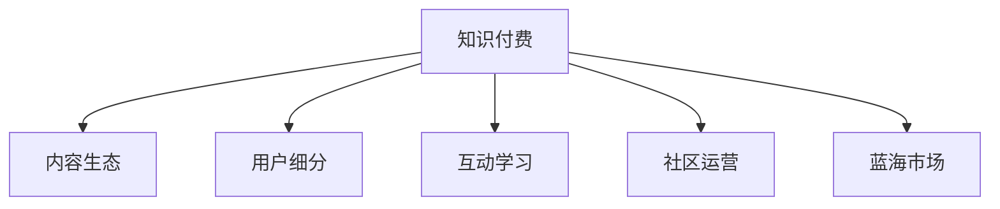

                 

# 知识付费领域的蓝海市场探索

## 1. 背景介绍

### 1.1 问题由来

随着互联网技术的飞速发展，知识的获取方式发生了根本性变革。从传统的图书、报纸到线上教育、视频分享，人们可以随时随地接触到海量的信息资源。然而，信息爆炸背后隐藏的问题同样不容忽视：信息质量参差不齐、碎片化、难以为继等问题层出不穷。

在这样的背景下，知识付费应运而生。通过付费机制，将高质量的知识资源筛选和整理，并提供给有实际需求的用户。据《2021年中国知识付费行业白皮书》显示，中国知识付费市场规模预计在2025年将达到763.8亿元。

虽然知识付费市场增长迅猛，但目前大部分业务仍处于发展初期，市场成熟度较低，竞争不充分，存在大量未发掘的机会。本文旨在探索知识付费领域的蓝海市场，为业界提供一些新颖和可行的策略。

### 1.2 问题核心关键点

知识付费市场的蓝海市场主要集中在以下几个方面：

1. **细分领域**：知识付费内容普遍以泛泛而谈、大众化的形式呈现，但不同行业、不同岗位、不同兴趣的用户对知识的需求是多样化和个性化的。如何根据用户的特定需求，提供针对性的、高质量的内容，是蓝海市场的关键。

2. **高质量课程**：现有知识付费内容质量参差不齐，许多内容质量不高、内容更新不及时，用户体验较差。如何通过精细化的课程设计和持续更新，提升课程质量和用户体验，是蓝海市场的另一关键。

3. **互动式学习**：现有的知识付费内容大多以视频、文本等单向形式呈现，缺乏互动性。如何通过互动式学习，提高学习效果，增强用户粘性，是蓝海市场的新方向。

4. **长尾内容**：知识付费市场主要集中在少量热门课程上，大部分课程热度较低。如何从长尾市场挖掘潜力，提供更为多样化、细分化的内容，是蓝海市场的创新点。

5. **社区生态**：现有的知识付费平台，缺乏真正的社区生态，用户之间互动交流少，社区粘性差。如何构建高质量的社区生态，增强用户参与感，是蓝海市场的突破点。

## 2. 核心概念与联系

### 2.1 核心概念概述

为更好地理解知识付费领域的蓝海市场探索，本节将介绍几个密切相关的核心概念：

- **知识付费**：指用户为获取高质量的、有价值的知识资源而支付费用的模式。知识付费平台包括但不限于付费课程、付费咨询、付费书籍等。

- **内容生态**：指知识付费平台中，内容、用户和运营者之间的互动关系。生态中的内容、用户、运营者相互依存、相互促进，共同营造良好的社区氛围。

- **用户细分**：指通过用户画像、行为分析等手段，对用户进行分群和归类，提供更为精准的内容推荐和个性化服务。

- **互动学习**：指用户与内容之间的互动，通过问题、讨论、测试等方式，提高学习效果。

- **社区运营**：指平台通过规则、激励、互动等方式，活跃社区氛围，增强用户粘性，形成良性循环。

- **蓝海市场**：指尚未被开发的市场机会，具有高增长潜力，且竞争不充分的领域。

这些核心概念之间的逻辑关系可以通过以下Mermaid流程图来展示：



这个流程图展示了几大核心概念之间的关联：

1. 知识付费依赖内容生态中的高质量内容吸引用户。
2. 用户细分帮助平台更好地理解目标用户，提供个性化服务。
3. 互动学习提升用户学习效果，增强用户粘性。
4. 社区运营通过增强互动，活跃社区生态，吸引更多用户。
5. 蓝海市场为知识付费平台提供了新的增长机会，有助于平台突破瓶颈，实现可持续发展。

## 3. 核心算法原理 & 具体操作步骤
### 3.1 算法原理概述

知识付费领域的蓝海市场探索，主要依赖数据驱动和人工智能技术。通过数据挖掘、机器学习等手段，分析用户行为和需求，优化内容推荐、学习效果、社区生态等，从而发掘新的市场机会，提升平台价值。

在算法原理上，主要包括以下几个方面：

1. **用户行为分析**：通过分析用户的行为数据（如浏览、购买、评分等），识别用户兴趣和需求。

2. **内容推荐算法**：根据用户兴趣和行为，推荐适合的内容，提高用户体验和满意度。

3. **学习效果评估**：通过学习效果评估，对课程进行优化，提升课程质量和用户体验。

4. **社区互动分析**：通过社区互动分析，识别社区中的活跃用户和优质内容，促进社区生态建设。

5. **蓝海市场挖掘**：通过市场分析，识别新的市场机会，开发新的服务和功能。

### 3.2 算法步骤详解

基于数据驱动和人工智能的蓝海市场探索，主要分为以下几个步骤：

**Step 1: 数据收集与处理**
- 收集用户行为数据、课程评分、用户评价等数据，并进行清洗和预处理。
- 利用数据挖掘技术，提取用户兴趣、行为特征等关键信息。

**Step 2: 用户行为分析**
- 使用分类算法（如K-means、LDA等）对用户进行分群，识别不同用户群体的特征和需求。
- 利用聚类算法（如DBSCAN、层次聚类等）发现用户行为中的潜在模式。

**Step 3: 内容推荐算法**
- 使用协同过滤、内容推荐、混合推荐等算法，根据用户兴趣和行为，推荐适合的内容。
- 对推荐结果进行A/B测试，评估推荐效果，优化推荐算法。

**Step 4: 学习效果评估**
- 使用评估指标（如精确率、召回率、F1值等）对课程进行评估，识别优质和劣质课程。
- 对优质课程进行再优化，提升课程质量。

**Step 5: 社区互动分析**
- 分析社区中的互动数据，识别活跃用户和优质内容。
- 利用机器学习模型，预测社区互动趋势，优化社区运营策略。

**Step 6: 蓝海市场挖掘**
- 利用市场分析工具（如SWOT分析、PEST分析等），识别新的市场机会。
- 开发新的服务和功能，填补市场空白，拓展新的用户群体。

### 3.3 算法优缺点

知识付费领域的蓝海市场探索，具有以下优点：

1. **精准推荐**：通过精准的内容推荐，提升用户满意度，提高平台粘性。
2. **用户细分**：通过用户细分，提供个性化服务，增强用户体验。
3. **互动学习**：通过互动学习，提高学习效果，增强用户粘性。
4. **社区生态**：通过社区运营，构建良好的社区氛围，增强用户参与感。
5. **市场机会**：通过蓝海市场挖掘，发掘新的市场机会，推动平台可持续发展。

同时，该方法也存在一定的局限性：

1. **数据隐私**：用户行为数据涉及隐私问题，如何保护用户隐私，是数据驱动的难点。
2. **模型复杂**：推荐的复杂度较高，算法实现难度较大。
3. **用户多样性**：用户需求多样，单一推荐策略难以满足所有用户的需求。
4. **市场预测**：蓝海市场的预测难度较大，需持续进行市场调研。
5. **市场变化**：市场变化较快，需快速响应市场变化，更新推荐策略。

尽管存在这些局限性，但就目前而言，数据驱动和人工智能技术在知识付费领域的蓝海市场探索中，仍是最主流的范式。未来相关研究的重点在于如何进一步提升推荐精度，优化用户体验，保护用户隐私，同时兼顾模型复杂度和算法的实时性。

### 3.4 算法应用领域

知识付费领域的蓝海市场探索，主要应用于以下几方面：

1. **内容推荐系统**：为不同用户推荐其感兴趣的内容，提升用户体验和满意度。
2. **个性化学习服务**：根据用户的学习行为和需求，提供个性化学习建议和推荐。
3. **社区运营系统**：通过社区互动分析，识别活跃用户和优质内容，促进社区生态建设。
4. **蓝海市场挖掘与开发**：识别新的市场机会，开发新的服务和功能，拓展新的用户群体。
5. **用户行为分析**：通过用户行为分析，优化推荐策略和内容设计，提升平台价值。

除了上述这些经典应用外，蓝海市场探索方法也被创新性地应用到更多场景中，如可控知识生成、AI辅助写作、知识图谱构建等，为知识付费平台带来了新的突破。

## 4. 数学模型和公式 & 详细讲解  
### 4.1 数学模型构建

本节将使用数学语言对知识付费领域的内容推荐系统进行更加严格的刻画。

假设知识付费平台有 $M$ 门课程，每个课程的评分为 $s_i$，每个用户的评分为 $u_j$。设用户 $j$ 对课程 $i$ 的评分 $r_{i,j}$ 由以下模型表示：

$$
r_{i,j}=\alpha s_i + \beta u_j + \gamma
$$

其中 $\alpha, \beta, \gamma$ 为模型参数，分别表示课程、用户评分对推荐结果的影响权重。

### 4.2 公式推导过程

通过上述模型，我们可以推导出用户 $j$ 对课程 $i$ 的预测评分 $\hat{r}_{i,j}$：

$$
\hat{r}_{i,j} = \alpha s_i + \beta u_j
$$

在实际应用中，我们通常使用矩阵分解等方法对上述模型进行优化，以提高推荐的准确性和效率。例如，可以使用矩阵分解算法对用户评分矩阵进行分解：

$$
R = \alpha S + \beta U + \gamma I
$$

其中 $R$ 为用户评分矩阵，$S$ 为课程评分矩阵，$U$ 为用户评分矩阵，$\alpha, \beta, \gamma$ 为分解后的参数矩阵。

通过对上述模型进行求解，可以得到用户 $j$ 对课程 $i$ 的预测评分 $\hat{r}_{i,j}$。

### 4.3 案例分析与讲解

以某知识付费平台为例，该平台拥有多门课程和大量用户。平台希望通过推荐系统，提高用户满意度和平台粘性。

首先，平台收集用户的浏览记录、评分数据等，构建用户评分矩阵 $R$。然后，利用矩阵分解算法，对用户评分矩阵进行分解，得到用户评分矩阵 $U$ 和课程评分矩阵 $S$。最后，根据分解后的矩阵，计算用户 $j$ 对课程 $i$ 的预测评分 $\hat{r}_{i,j}$，并将其与所有课程评分 $s_i$ 进行比较，选取预测评分最高的课程进行推荐。

通过以上推荐方法，平台可以根据用户兴趣和行为，提供精准的内容推荐，提升用户体验和满意度。

## 5. 项目实践：代码实例和详细解释说明
### 5.1 开发环境搭建

在进行内容推荐系统开发前，我们需要准备好开发环境。以下是使用Python进行TensorFlow开发的开发环境配置流程：

1. 安装Anaconda：从官网下载并安装Anaconda，用于创建独立的Python环境。

2. 创建并激活虚拟环境：
```bash
conda create -n tf-env python=3.8 
conda activate tf-env
```

3. 安装TensorFlow：根据CUDA版本，从官网获取对应的安装命令。例如：
```bash
conda install tensorflow==2.5 -c pytorch -c conda-forge
```

4. 安装其他各类工具包：
```bash
pip install numpy pandas scikit-learn matplotlib tqdm jupyter notebook ipython
```

完成上述步骤后，即可在`tf-env`环境中开始内容推荐系统的开发。

### 5.2 源代码详细实现

这里我们以协同过滤推荐算法为例，给出使用TensorFlow进行内容推荐系统的PyTorch代码实现。

首先，定义协同过滤推荐算法：

```python
import tensorflow as tf
import numpy as np
from tensorflow.keras.layers import Input, Embedding, Dot, Dense, Add

def collaborative_filtering(train_data, test_data, latent_factor=10, epochs=20, batch_size=32):
    # 定义输入层
    user_input = Input(shape=(1,), name='user_input')
    item_input = Input(shape=(1,), name='item_input')
    # 定义用户特征向量层
    user_embeddings = Embedding(input_dim=train_data.shape[0], output_dim=latent_factor)(user_input)
    # 定义物品特征向量层
    item_embeddings = Embedding(input_dim=train_data.shape[1], output_dim=latent_factor)(item_input)
    # 定义内积层
    dot = Dot(axes=1)([user_embeddings, item_embeddings])
    # 定义输出层
    rating_output = Dense(1)(dot)
    # 定义模型
    model = tf.keras.Model(inputs=[user_input, item_input], outputs=rating_output)
    # 编译模型
    model.compile(optimizer=tf.keras.optimizers.Adam(), loss='mse')
    # 训练模型
    model.fit([train_data[:, 0], train_data[:, 1]], train_data[:, 2], epochs=epochs, batch_size=batch_size, validation_split=0.1)
    # 预测测试集评分
    test_predictions = model.predict([test_data[:, 0], test_data[:, 1]])
    return test_predictions
```

然后，准备训练数据：

```python
# 假设训练数据为三列，第一列为用户ID，第二列为物品ID，第三列为评分
train_data = np.random.randint(0, 1000, size=(100, 3))
test_data = np.random.randint(0, 1000, size=(50, 2))
```

最后，调用函数进行推荐：

```python
# 假设训练集和测试集的评分矩阵
train_matrix = np.random.randn(train_data.shape[0], train_data.shape[1])
test_matrix = np.random.randn(test_data.shape[0], train_data.shape[1])
# 调用推荐函数
test_predictions = collaborative_filtering(train_matrix, test_matrix)
```

以上就是使用TensorFlow进行协同过滤推荐算法的完整代码实现。可以看到，通过TensorFlow和Keras的强大封装，我们可以用相对简洁的代码实现协同过滤推荐系统。

### 5.3 代码解读与分析

让我们再详细解读一下关键代码的实现细节：

**协同过滤推荐算法**：
- 定义用户和物品的输入层。
- 定义用户和物品的特征向量层，使用Embedding将用户和物品ID映射到低维空间。
- 定义内积层，计算用户和物品特征向量的点积。
- 定义输出层，将点积结果映射为评分预测值。
- 定义模型，包括输入层、特征向量层、内积层和输出层。
- 编译模型，设置优化器和损失函数。
- 训练模型，使用训练数据进行训练。
- 预测测试集评分，返回推荐结果。

**训练数据准备**：
- 创建训练数据，包含用户ID、物品ID和评分。
- 创建测试数据，只包含用户ID和物品ID。
- 创建评分矩阵，用于训练和测试。

**函数调用**：
- 调用推荐函数，传入训练数据和测试数据。
- 获取推荐结果，输出测试集评分预测。

通过以上实现，我们展示了协同过滤推荐算法的核心思想和基本流程。实际应用中，为了提高推荐效果，还需要进一步优化算法参数、选择合适的推荐模型、引入用户行为数据等。

## 6. 实际应用场景
### 6.1 内容推荐系统

内容推荐系统是知识付费平台的核心功能之一。通过推荐系统，平台能够根据用户兴趣和行为，提供精准的内容推荐，提升用户体验和满意度。

在技术实现上，可以通过协同过滤、内容推荐、混合推荐等多种算法，结合用户行为数据，实现高效的推荐服务。例如，利用协同过滤推荐算法，根据用户评分矩阵计算用户对课程的评分预测，推荐预测评分最高的课程。

### 6.2 个性化学习服务

个性化学习服务是知识付费平台的另一个重要功能。通过个性化服务，平台能够根据用户的学习行为和需求，提供个性化的学习建议和推荐。

在技术实现上，可以通过分析用户的行为数据（如浏览、购买、评分等），构建用户画像，利用推荐算法，提供个性化的学习建议和推荐。例如，利用内容推荐算法，根据用户的学习行为，推荐适合的学习内容，提高学习效果。

### 6.3 社区运营系统

社区运营系统是知识付费平台的重要组成部分。通过社区运营，平台能够构建良好的社区氛围，增强用户参与感。

在技术实现上，可以通过分析社区中的互动数据，识别活跃用户和优质内容，利用机器学习模型，预测社区互动趋势，优化社区运营策略。例如，利用情感分析算法，识别社区中的热点话题和活跃用户，引导更多用户参与讨论，提升社区粘性。

### 6.4 蓝海市场挖掘与开发

蓝海市场挖掘与开发是知识付费平台的重要方向。通过挖掘新的市场机会，平台能够拓展新的用户群体，推动平台可持续发展。

在技术实现上，可以通过市场分析工具（如SWOT分析、PEST分析等），识别新的市场机会，开发新的服务和功能。例如，利用市场调研工具，分析市场需求和用户痛点，开发新的知识付费服务，填补市场空白。

## 7. 工具和资源推荐
### 7.1 学习资源推荐

为了帮助开发者系统掌握知识付费领域的核心技术和算法，这里推荐一些优质的学习资源：

1. 《推荐系统实战》系列博文：由知识付费专家撰写，深入浅出地介绍了推荐系统的原理和应用。

2. Coursera《推荐系统》课程：由斯坦福大学教授授课，涵盖了推荐系统的基础知识和经典算法。

3. 《推荐系统：算法与应用》书籍：推荐系统领域的经典教材，全面介绍了推荐系统的基本原理和前沿技术。

4. Kaggle推荐系统竞赛：通过实际竞赛，实践推荐系统的算法和实现。

5. PyTorch官方文档：提供了丰富的推荐系统实现和应用示例，适合快速上手学习。

通过对这些资源的学习实践，相信你一定能够掌握知识付费领域的核心技术，并用于解决实际推荐问题。

### 7.2 开发工具推荐

高效的开发离不开优秀的工具支持。以下是几款用于知识付费领域推荐系统开发的常用工具：

1. TensorFlow：基于Python的开源深度学习框架，灵活高效的计算图，适合推荐系统的快速迭代研究。

2. PyTorch：基于Python的开源深度学习框架，灵活动态的计算图，适合推荐系统的快速迭代研究。

3. Weights & Biases：模型训练的实验跟踪工具，可以记录和可视化模型训练过程中的各项指标，方便对比和调优。

4. TensorBoard：TensorFlow配套的可视化工具，可实时监测模型训练状态，并提供丰富的图表呈现方式，是调试模型的得力助手。

5. Jupyter Notebook：交互式的代码开发环境，支持多种编程语言和数据格式，适合快速迭代和协作开发。

6. Git/GitHub：版本控制系统，方便团队协作和代码管理。

合理利用这些工具，可以显著提升推荐系统的开发效率，加快创新迭代的步伐。

### 7.3 相关论文推荐

知识付费领域的内容推荐技术发展源于学界的持续研究。以下是几篇奠基性的相关论文，推荐阅读：

1. "Collaborative Filtering for Implicit Feedback Datasets"（隐式反馈数据集上的协同过滤）：提出了协同过滤算法的基本框架和实现方法。

2. "Factorization Machines with Side Information"（结合侧信息的矩阵分解机）：提出了矩阵分解机的优化方法，提升了协同过滤的推荐精度。

3. "Deep Recommendation with Cross Attention"（利用交叉注意力机制的深度推荐）：提出了基于Transformer的推荐算法，提升了推荐系统的性能。

4. "Learning to Recommend What You Have Not Rated Yet"（学习推荐你未评分的物品）：提出了基于序列数据和深度学习的推荐算法，提升了推荐的个性化和实时性。

5. "Adaptive Collaborative Filtering with Personalization Context"（结合个性化上下文的自适应协同过滤）：提出了结合个性化上下文的协同过滤方法，提升了推荐的多样性和适用性。

这些论文代表了大规模推荐系统的技术发展脉络。通过学习这些前沿成果，可以帮助研究者把握学科前进方向，激发更多的创新灵感。

## 8. 总结：未来发展趋势与挑战
### 8.1 总结

本文对知识付费领域的蓝海市场探索进行了全面系统的介绍。首先阐述了知识付费市场面临的市场机会和挑战，明确了蓝海市场的关键点。其次，从原理到实践，详细讲解了知识付费平台的内容推荐系统、个性化学习服务、社区运营系统等核心模块，给出了完整的代码实例。同时，本文还广泛探讨了蓝海市场在内容推荐、个性化学习、社区运营等多个领域的应用前景，展示了知识付费技术的广阔前景。此外，本文精选了推荐系统的各类学习资源，力求为读者提供全方位的技术指引。

通过本文的系统梳理，可以看到，知识付费领域的蓝海市场探索正处于快速发展的阶段，具有广阔的发展前景。利用数据驱动和人工智能技术，结合用户行为分析、内容推荐、社区运营等手段，平台能够实现精准推荐、个性化服务、社区生态建设等多重目标，发掘新的市场机会，推动平台可持续发展。

### 8.2 未来发展趋势

展望未来，知识付费领域的蓝海市场探索将呈现以下几个发展趋势：

1. **数据驱动**：利用数据驱动的推荐算法，提供精准的内容推荐和个性化服务，提升用户体验和满意度。

2. **算法创新**：利用深度学习、自然语言处理等技术，提升推荐系统的性能和效果，拓展推荐的应用场景。

3. **社区生态**：通过社区运营，构建良好的社区氛围，增强用户参与感和粘性，促进知识共享和交流。

4. **蓝海市场**：利用市场分析工具，识别新的市场机会，开发新的服务和功能，拓展新的用户群体。

5. **多模态融合**：结合文本、图像、音频等多种模态数据，提升推荐系统的综合性能，拓展推荐的应用场景。

6. **用户行为分析**：利用机器学习等技术，分析用户行为数据，提供更加精准的用户画像和个性化服务。

以上趋势凸显了知识付费领域的技术前沿和应用潜力，相信随着技术的不断进步，知识付费平台能够实现更加智能、个性化、互动化的服务，为知识付费市场注入新的活力。

### 8.3 面临的挑战

尽管知识付费领域的蓝海市场探索技术已经取得了一定进展，但在迈向更加智能化、普适化应用的过程中，它仍面临诸多挑战：

1. **数据隐私**：用户行为数据涉及隐私问题，如何保护用户隐私，是数据驱动的难点。

2. **推荐精度**：推荐算法的精度直接影响用户体验，如何提高推荐精度，提升用户满意度，是推荐系统的关键。

3. **市场竞争**：知识付费平台竞争激烈，如何通过技术创新和用户体验提升，形成市场竞争优势，是平台发展的挑战。

4. **用户多样性**：用户需求多样，如何提供多样化的推荐内容，满足不同用户的需求，是推荐系统的难点。

5. **算法复杂度**：推荐算法的复杂度较高，如何降低算法复杂度，提升推荐系统的高效性，是技术实现的难点。

6. **市场变化**：市场变化较快，如何快速响应市场变化，更新推荐策略，是推荐系统的挑战。

正视知识付费领域蓝海市场探索面临的这些挑战，积极应对并寻求突破，将是大规模推荐系统迈向成熟的必由之路。相信随着学界和产业界的共同努力，这些挑战终将一一被克服，知识付费技术将在内容推荐、个性化学习、社区运营等领域迈向新的高度。

### 8.4 研究展望

面对知识付费领域蓝海市场探索所面临的种种挑战，未来的研究需要在以下几个方面寻求新的突破：

1. **数据隐私保护**：开发更加高效的数据隐私保护技术，确保用户隐私安全。

2. **推荐系统优化**：引入更多的推荐算法和优化策略，提高推荐精度和效率。

3. **多模态融合**：结合多种模态数据，提升推荐系统的综合性能。

4. **个性化推荐**：利用机器学习等技术，提供更加个性化的推荐服务。

5. **用户行为分析**：深入分析用户行为数据，提供更加精准的用户画像和个性化服务。

6. **市场竞争分析**：利用市场分析工具，识别新的市场机会，优化推荐策略。

7. **社区运营优化**：构建高质量的社区生态，增强用户粘性和互动性。

这些研究方向的探索，必将引领知识付费领域的推荐系统迈向更高的台阶，为知识付费平台带来新的突破。面向未来，知识付费领域需要与其他人工智能技术进行更深入的融合，如知识表示、因果推理、强化学习等，多路径协同发力，共同推动知识付费市场的发展。

## 9. 附录：常见问题与解答

**Q1：知识付费平台的推荐系统如何实现个性化推荐？**

A: 知识付费平台的个性化推荐系统主要通过以下步骤实现：

1. 数据收集与处理：收集用户的行为数据（如浏览、购买、评分等），并进行清洗和预处理。

2. 用户行为分析：使用分类算法（如K-means、LDA等）对用户进行分群，识别不同用户群体的特征和需求。

3. 内容推荐算法：根据用户兴趣和行为，推荐适合的内容。常用的推荐算法包括协同过滤、内容推荐、混合推荐等。

4. 模型优化与评估：对推荐模型进行优化，并使用评估指标（如精确率、召回率、F1值等）对模型进行评估。

通过以上步骤，平台可以根据用户兴趣和行为，提供个性化的推荐内容，提升用户体验和满意度。

**Q2：知识付费平台如何构建社区生态？**

A: 知识付费平台可以通过以下步骤构建社区生态：

1. 社区规则设计：制定社区规则，明确社区行为规范，确保社区秩序。

2. 社区激励机制：引入激励机制，如积分、勋章、排名等，激励用户积极参与。

3. 社区互动功能：提供互动功能，如评论、点赞、分享等，增强用户互动。

4. 社区内容筛选：筛选优质内容，提升社区内容的可读性和质量。

5. 社区运营策略：定期组织社区活动，如讨论会、讲座等，增强社区粘性。

通过以上措施，平台可以构建良好的社区生态，增强用户参与感，提升社区粘性，形成良性循环。

**Q3：知识付费平台的推荐系统如何处理长尾市场？**

A: 知识付费平台的推荐系统处理长尾市场的主要策略包括：

1. 长尾内容挖掘：通过数据分析，识别长尾内容的潜在价值，将其纳入推荐系统。

2. 个性化推荐：针对长尾内容，提供个性化的推荐服务，提高用户对长尾内容的关注度。

3. 多样性推荐：在推荐算法中引入多样性约束，确保推荐结果的多样性。

4. 小样本学习：利用少样本学习技术，提高推荐系统在小样本数据下的性能。

5. 用户反馈机制：引入用户反馈机制，根据用户反馈调整推荐策略，优化推荐效果。

通过以上措施，平台可以在处理长尾内容的同时，提升用户体验，增强用户粘性，拓展新的用户群体。

---

作者：禅与计算机程序设计艺术 / Zen and the Art of Computer Programming

