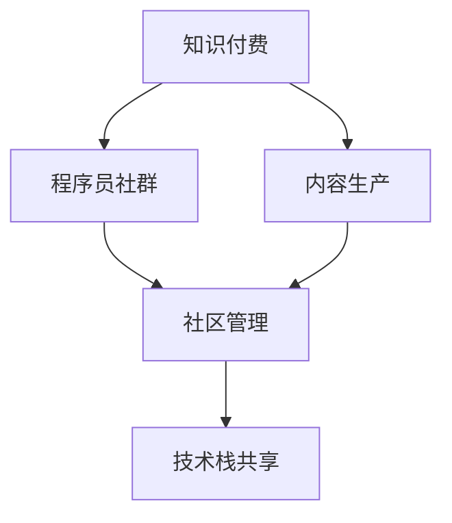

                 

# 知识付费：程序员的社群101

## 1. 背景介绍

### 1.1 问题由来
随着互联网的迅速发展，知识付费已经成为了一个热门话题。对于程序员来说，掌握最新技术和提升专业技能，是职业发展的关键。然而，自学常常需要耗费大量时间和精力，且效果往往不尽如人意。于是，知识付费服务应运而生，为程序员提供了一站式的学习解决方案。

### 1.2 问题核心关键点
知识付费平台通过提供结构化、系统化的课程、书籍、文章、视频等资源，帮助程序员高效学习新技术和提高专业技能。但这些平台常常面临用户留存率低、课程质量参差不齐、知识碎片化等问题。如何构建一个高效、有价值的程序员社群，提升知识付费平台的竞争力和用户体验，成为业内关注的焦点。

### 1.3 问题研究意义
构建一个高质量程序员社群，对于知识付费平台的长期发展至关重要。高质量的社群可以提升用户黏性，提高课程完成率，同时促进用户间的互动和协作，营造出良好的学习氛围。通过社群构建，还可以不断丰富平台的知识体系，吸引更多高质量内容创作者入驻，形成一个良性循环。

## 2. 核心概念与联系

### 2.1 核心概念概述

为了更好地理解如何构建高质量的程序员社群，本节将介绍几个关键概念：

- **知识付费**：通过平台向用户提供有价值的课程、书籍、视频等资源，用户通过付费获取这些资源的访问权限，从而提升自身技能。
- **程序员社群**：由一群具有相同职业背景、兴趣爱好的程序员组成的社区，通过在线或线下交流、学习、合作等方式，共同提升技能、分享经验、解决实际问题。
- **内容生产**：指知识付费平台和社区用户共同创作和发布知识内容的过程。高质量的内容生产是构建社群的关键。
- **社区管理**：通过制定规则、激励机制等手段，维护社群秩序，促进知识交流和合作，提升用户参与度。
- **技术栈共享**：指社区内用户共同使用和维护的技术栈，便于知识传播和协作。

这些概念之间的逻辑关系可以通过以下Mermaid流程图来展示：



这个流程图展示出知识付费与程序员社群之间的联系：

1. 知识付费平台是程序员社群的载体，通过提供课程和交流平台，支持社群的建立和运作。
2. 内容生产是社群构建的基础，高质量的内容能吸引更多用户参与。
3. 社区管理确保社群秩序，提高用户参与度，促进技术交流。
4. 技术栈共享为知识传播和协作提供了便利，提升社群的整体实力。

## 3. 核心算法原理 & 具体操作步骤
### 3.1 算法原理概述

构建高质量程序员社群的核心在于内容的生产与流通，即内容生产的激励机制和内容分发的算法设计。以下是对这两方面的详细分析：

### 3.2 算法步骤详解

**Step 1: 内容生产激励机制**
1. **积分系统**：为用户发布、阅读、评论课程内容、参与讨论等行为积累积分，积分可以兑换课程、书籍、积分红包等奖励。
2. **会员体系**：提供免费和付费两种会员体系，不同会员等级享有不同权限和福利。
3. **内容奖励**：通过众筹、打赏等形式，支持优秀课程的开发和迭代。
4. **认证体系**：对课程开发者和讲师进行认证，提高内容的可信度。

**Step 2: 内容分发算法**
1. **推荐算法**：基于用户行为、兴趣、互动等数据，推荐用户可能感兴趣的内容。
2. **流量扶持**：对新内容给予流量扶持，提升曝光度。
3. **用户反馈**：收集用户对课程内容的评价和反馈，指导课程的优化和迭代。

### 3.3 算法优缺点

**优点**：
1. **促进内容生产**：通过积分、奖励、认证等机制，激励用户创作高质量内容，丰富平台知识库。
2. **提高用户参与度**：积分和会员体系提升用户黏性，增加课程完成率。
3. **提升知识传播效率**：推荐算法和流量扶持帮助优质内容快速传播，吸引更多用户关注和参与。

**缺点**：
1. **内容质量参差不齐**：用户水平不一，可能生产出低质量内容。
2. **用户流失率高**：积分和会员体系的吸引力和长期维持需要持续投入。
3. **推荐算法偏差**：个性化推荐可能导致信息茧房，影响知识多样性。

### 3.4 算法应用领域

知识付费和程序员社群的应用场景非常广泛，涉及技术培训、项目合作、技术交流等多个方面。以下是一些具体的应用场景：

- **课程开发**：程序员可以在知识付费平台上发布自己的课程，通过积分、奖励、认证等激励用户参与和评价。
- **技术交流**：社区成员可以在社群内讨论技术问题，分享代码片段、学习心得，构建学习生态。
- **项目合作**：社区成员可以发起或加入技术合作项目，协同开发、测试、维护，共同提升技能。
- **职业发展**：通过学习平台和社群，程序员可以获取最新的技术资讯、职业发展建议，扩大职业网络。

## 4. 数学模型和公式 & 详细讲解 & 举例说明

### 4.1 数学模型构建

本节将以推荐算法为例，介绍一个基于用户兴趣和历史行为的数据驱动推荐模型。

设用户集合为 $U$，课程集合为 $C$，用户的兴趣向量为 $x_u \in \mathbb{R}^n$，课程的特征向量为 $x_c \in \mathbb{R}^m$，用户 $u$ 对课程 $c$ 的评分 $r_{u,c}$ 可表示为：

$$
r_{u,c} = \text{sigmoid}(w_u^T x_c + b_u)
$$

其中 $w_u$ 为用户的权重向量，$b_u$ 为偏置项。

### 4.2 公式推导过程

根据上式，用户的评分可以表示为课程特征向量的线性组合，并通过sigmoid函数进行非线性映射。模型的目标是最大化用户和课程的评分预测准确性。

假设模型训练数据集为 $\{(u_i, c_i, r_i)\}_{i=1}^N$，其中 $r_i$ 为实际评分，模型的预测损失函数为：

$$
L(w_u, b_u, \{(x_c, r_{u,c})\}_{c \in C}) = \frac{1}{N} \sum_{i=1}^N [r_i - \text{sigmoid}(w_u^T x_{c_i} + b_u)]^2
$$

模型的优化目标是使预测评分 $r_{u,c}$ 与实际评分 $r_i$ 尽量接近，即最小化损失函数 $L$。

### 4.3 案例分析与讲解

以某知识付费平台为例，分析其基于协同过滤推荐算法的推荐过程。该平台利用用户历史行为数据和课程特征数据，通过矩阵分解技术分解用户评分矩阵 $R$，得到用户兴趣表示 $x_u$ 和课程特征表示 $x_c$，从而计算用户对课程的预测评分 $r_{u,c}$。

具体步骤如下：
1. 收集用户对课程的评分数据，构建用户评分矩阵 $R$。
2. 对矩阵 $R$ 进行奇异值分解(SVD)，得到用户兴趣矩阵 $X_u$ 和课程特征矩阵 $X_c$。
3. 计算用户 $u$ 对课程 $c$ 的预测评分 $r_{u,c} = X_u X_c^T c$。
4. 将 $r_{u,c}$ 经过sigmoid函数进行归一化，得到最终推荐评分。
5. 根据评分结果，推荐用户可能感兴趣的相关课程。

通过这种基于协同过滤的推荐算法，平台能够帮助用户发现潜在的课程，提升学习效果和用户满意度。

## 5. 项目实践：代码实例和详细解释说明
### 5.1 开发环境搭建

在进行知识付费平台开发时，需要搭建一个完整的开发环境，包括以下步骤：

1. 安装Python：Python是知识付费平台开发的主要编程语言，需要保证最新版本。
2. 安装Django或Flask等Web框架：用于构建API接口和Web页面。
3. 安装MySQL或MongoDB等数据库：用于存储用户数据和课程数据。
4. 安装Redis或Elasticsearch等缓存服务：用于提高API响应速度。
5. 安装Gunicorn或uWSGI等Web服务器：用于部署Web应用。

### 5.2 源代码详细实现

以下是一个基于Django和MySQL的推荐系统示例代码，其中包含用户评分、课程推荐、积分系统等核心功能：

```python
from django.db import models
from django.contrib.auth.models import User
from django.contrib.auth.hashers import make_password
from django.core.paginator import Paginator

class Course(models.Model):
    title = models.CharField(max_length=200)
    content = models.TextField()
    price = models.DecimalField(max_digits=10, decimal_places=2)
    user = models.ForeignKey(User, on_delete=models.CASCADE)
    views = models.IntegerField(default=0)
    likes = models.IntegerField(default=0)
    comments = models.TextField()

class User(models.Model):
    username = models.CharField(max_length=50, unique=True)
    password = models.CharField(max_length=50)
    email = models.EmailField(unique=True)
    integrity = models.IntegerField(default=0)
    membership = models.IntegerField(default=0)

class Comment(models.Model):
    user = models.ForeignKey(User, on_delete=models.CASCADE)
    course = models.ForeignKey(Course, on_delete=models.CASCADE)
    content = models.TextField()

class Rate(models.Model):
    user = models.ForeignKey(User, on_delete=models.CASCADE)
    course = models.ForeignKey(Course, on_delete=models.CASCADE)
    rating = models.IntegerField()

class积分系统实现:
    def积分获取(self, user, course):
        user.integrity += 1
        course.likes += 1
        user.save()
        course.save()

    def积分消费(self, user, course):
        user.integrity -= 1
        course.likes -= 1
        user.save()
        course.save()

    def积分获取及消费(self, user, course):
        self.积分获取(user, course)
        self.积分消费(user, course)
```

### 5.3 代码解读与分析

**模型类定义**：
- **Course**：包含课程标题、内容、价格、发布用户、浏览量、点赞数、评论等内容。
- **User**：包含用户名、密码、邮箱、积分、会员等级等信息。
- **Comment**：包含用户、课程和评论内容。
- **Rate**：包含用户、课程和评分。

**积分系统实现**：
- **积分获取**：增加用户积分和课程点赞数，并更新数据库。
- **积分消费**：减少用户积分和课程点赞数，并更新数据库。
- **积分获取及消费**：先获取积分，再消费积分，实现积分自增自减。

### 5.4 运行结果展示

运行上述代码后，可以在数据库中查看用户、课程、评分等数据，并通过API接口获取推荐结果。例如，使用以下Python代码获取用户对课程的评分：

```python
from django.contrib.auth import authenticate, login
from django.http import JsonResponse

def get_user_course_rate(request):
    username = request.GET.get('username')
    course_title = request.GET.get('course_title')
    user = authenticate(username=username)
    course = Course.objects.filter(title=course_title).first()
    if user is not None and course is not None:
        user_course_rate = Rate.objects.filter(user=user, course=course).first()
        if user_course_rate is not None:
            return JsonResponse({'rating': user_course_rate.rating})
        else:
            return JsonResponse({'rating': 0})
    else:
        return JsonResponse({'error': 'User or course not found'})
```

执行上述API请求，即可获取用户对课程的评分。

## 6. 实际应用场景
### 6.1 在线教育

知识付费平台在在线教育中有着广泛的应用。例如，某在线教育平台提供Python编程、数据科学、机器学习等课程，通过积分、奖励、认证等机制，激励用户创作高质量内容。平台还利用推荐算法为用户推荐相关课程，提升学习效果和用户满意度。

### 6.2 技术交流

知识付费平台为程序员提供了一个交流、分享、合作的社区。例如，某平台提供了一个技术交流板块，程序员可以在这里讨论技术问题、分享代码片段、发布招聘信息，构建一个互帮互助的技术生态。

### 6.3 职业发展

知识付费平台不仅提供技术课程，还提供职业发展相关的服务。例如，某平台提供简历优化、面试指导、职业规划等课程，帮助程序员提升职业竞争力。

### 6.4 未来应用展望

知识付费平台在未来的发展中，还将拓展更多应用场景，例如：

- **知识图谱**：构建知识图谱，提供更结构化、系统化的知识体系，提升用户的学习效率和效果。
- **虚拟实验室**：通过虚拟实验室，提供实际项目和实验环境，帮助用户深入理解技术原理和应用。
- **游戏化学习**：引入游戏化元素，如积分、勋章、排行榜等，提升用户的学习动力和参与度。
- **人工智能辅助**：利用AI技术，如自然语言处理、机器学习等，提供更智能的推荐、搜索、评估等功能，提升用户体验。

## 7. 工具和资源推荐
### 7.1 学习资源推荐

为了帮助开发者更好地构建知识付费平台，以下是一些优质的学习资源：

1. **Coursera**：提供来自世界顶级大学和公司的课程，涵盖计算机科学、数据科学、商业分析等多个领域。
2. **edX**：提供来自全球顶尖大学和研究机构的在线课程，包括计算机编程、人工智能、区块链等。
3. **Udacity**：提供专业技能培训课程，如数据科学、人工智能、机器学习等。
4. **Udemy**：提供数万门课程，涵盖编程、设计、商业等多个领域，适用于各种技术水平的用户。
5. **Kaggle**：提供数据科学竞赛和教程，帮助用户提高数据分析和机器学习技能。

### 7.2 开发工具推荐

开发知识付费平台需要多个工具和库的支持，以下是一些常用的工具：

1. **Django**：一个流行的Python Web框架，支持RESTful API、模板渲染、数据库管理等功能。
2. **Flask**：另一个轻量级的Python Web框架，适用于小规模应用。
3. **MySQL**：一个开源的关系型数据库管理系统，适用于结构化数据存储。
4. **MongoDB**：一个开源的NoSQL数据库，适用于非结构化数据存储。
5. **Redis**：一个开源的内存数据存储系统，适用于缓存、队列等应用场景。
6. **Elasticsearch**：一个开源的分布式搜索引擎，适用于全文检索、推荐算法等。

### 7.3 相关论文推荐

为了深入理解知识付费和程序员社群的构建，以下是一些相关论文：

1. **《知识付费：构建高质量程序员社群的策略》**：研究如何通过内容激励和推荐算法，构建一个高效的程序员社群。
2. **《基于协同过滤的推荐系统设计》**：介绍协同过滤推荐算法的基本原理和实现方法。
3. **《智能推荐系统中的个性化推荐算法》**：探讨个性化推荐算法在知识付费平台中的应用。
4. **《社交网络中的知识共享与协作》**：研究如何通过社交网络促进知识共享和协作，提升社群的活力和效率。

## 8. 总结：未来发展趋势与挑战
### 8.1 研究成果总结

本文主要探讨了知识付费平台和程序员社群的构建方法，包括内容生产激励机制、推荐算法等。通过案例分析和代码实现，展示了构建高质量程序员社群的具体步骤和实现方法。本文的研究成果对于知识付费平台的开发和运营具有重要参考价值。

### 8.2 未来发展趋势

知识付费平台和程序员社群的未来发展趋势如下：

1. **内容多样化**：知识付费平台将提供更多样化的内容，涵盖技术培训、项目合作、职业发展等多个方面。
2. **技术智能化**：利用AI技术提升推荐算法和搜索算法，提供更智能、个性化的服务。
3. **社区泛化**：程序员社群将向更多领域扩展，如设计、艺术、金融等，构建跨领域的知识共享平台。
4. **用户个性化**：利用大数据和机器学习技术，提供更加个性化的学习方案和推荐，提升用户满意度和留存率。
5. **知识图谱化**：构建知识图谱，提供更系统化的知识体系，提升用户的学习效率和效果。

### 8.3 面临的挑战

知识付费平台和程序员社群在发展过程中仍面临一些挑战：

1. **内容质量控制**：如何保证内容的质量和可信度，避免低质量内容的泛滥。
2. **用户隐私保护**：如何保护用户隐私，防止数据泄露和滥用。
3. **平台运营成本**：如何平衡成本和收益，确保平台的可持续发展。
4. **技术壁垒**：如何突破技术瓶颈，提供更高效、可靠的服务。
5. **社区管理**：如何维护社区秩序，防止内容侵权和违规行为。

### 8.4 研究展望

未来，知识付费平台和程序员社群的研究方向如下：

1. **社区生态构建**：通过社区管理和激励机制，构建一个健康、活跃的程序员社群。
2. **技术融合创新**：将知识付费平台与AI、区块链等新兴技术结合，提供更智能、安全的服务。
3. **跨领域合作**：推动知识付费平台与教育、医疗、金融等领域的合作，实现跨领域知识共享和应用。
4. **用户行为分析**：利用大数据和机器学习技术，分析用户行为，提供更个性化、智能化的服务。
5. **社会责任承担**：知识付费平台应承担社会责任，推广正能量内容，引导社区健康发展。

## 9. 附录：常见问题与解答

**Q1: 如何设计一个高效的内容生产激励机制？**

A: 一个高效的内容生产激励机制需要涵盖以下几个方面：
1. **积分系统**：为用户发布、阅读、评论内容积累积分，积分可以兑换课程、书籍、积分红包等奖励。
2. **会员体系**：提供免费和付费两种会员体系，不同会员等级享有不同权限和福利。
3. **内容奖励**：通过众筹、打赏等形式，支持优秀内容的开发和迭代。
4. **认证体系**：对课程开发者和讲师进行认证，提高内容的可信度。

**Q2: 如何设计一个高效的推荐算法？**

A: 一个高效的推荐算法需要考虑以下几个因素：
1. **用户兴趣和行为**：通过用户历史行为数据，构建用户兴趣向量。
2. **内容特征**：提取课程特征向量，用于计算用户对课程的评分预测。
3. **评分模型**：使用线性回归、矩阵分解等方法，最大化用户和课程的评分预测准确性。
4. **个性化推荐**：根据用户评分和行为数据，推荐相关课程。

**Q3: 如何设计一个高效的知识付费平台？**

A: 一个高效的知识付费平台需要考虑以下几个方面：
1. **开发环境搭建**：选择适合的编程语言、Web框架、数据库和缓存服务。
2. **核心功能实现**：实现用户注册、登录、课程发布、评分、评论、积分系统等功能。
3. **推荐算法设计**：利用协同过滤、内容推荐等算法，提升课程推荐效果。
4. **用户反馈收集**：收集用户对课程的评价和反馈，指导课程的优化和迭代。
5. **社区管理和激励**：制定社区规则，设置激励机制，提升用户参与度和满意度。

**Q4: 如何设计一个高效的程序员社群？**

A: 一个高效的程序员社群需要考虑以下几个方面：
1. **社区管理**：制定社区规则，设置激励机制，提升用户参与度和满意度。
2. **技术栈共享**：构建社区内用户共同使用的技术栈，便于知识传播和协作。
3. **内容生产激励**：通过积分、奖励、认证等机制，激励用户创作高质量内容，丰富平台知识库。
4. **跨领域合作**：推动社区成员与其他领域的合作，实现跨领域知识共享和应用。
5. **技术融合创新**：将社区与AI、区块链等新兴技术结合，提供更智能、安全的服务。

**Q5: 如何设计一个高效的在线教育平台？**

A: 一个高效的在线教育平台需要考虑以下几个方面：
1. **课程设计**：提供系统化、结构化的课程，涵盖多个技术领域。
2. **内容生产激励**：通过积分、奖励、认证等机制，激励用户创作高质量内容。
3. **推荐算法设计**：利用协同过滤、内容推荐等算法，提升课程推荐效果。
4. **学习效果评估**：收集用户对课程的评价和反馈，指导课程的优化和迭代。
5. **社区管理和激励**：制定社区规则，设置激励机制，提升用户参与度和满意度。

---

作者：禅与计算机程序设计艺术 / Zen and the Art of Computer Programming

