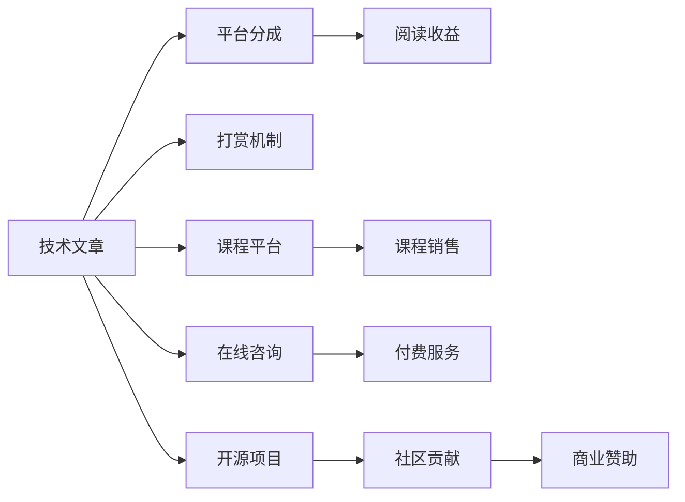

                 

# 知识付费：程序员的社群变现

在数字经济的浪潮中，知识付费成为一种新的商业模式，为众多领域提供了一种新的变现方式。特别是在科技行业，程序员因其专业的技术知识和丰富的实践经验，成为知识付费市场的一支重要力量。本文将从背景介绍、核心概念、算法原理、具体实践、应用场景、未来展望等多个维度，全面解析程序员社群变现的策略和实践，以期为技术从业者提供有益的参考。

## 1. 背景介绍

### 1.1 知识付费的兴起

知识付费的概念最早可追溯至2016年，随着互联网的发展和技术的进步，知识付费市场快速增长。尤其在知识付费平台如得到、知乎live、分答等崛起后，知识付费逐渐成为一种被大众接受和认可的商业模式。其背后的驱动力来自于以下几方面：

1. **知识信息不对称**：随着知识的积累和沉淀，个体之间的知识差距越来越大，拥有特定知识的人才开始向普通用户提供付费知识。
2. **时间成本**：人们越来越倾向于花费更多时间在自己喜欢的领域进行学习和研究，而非自己去获取和整理知识。
3. **效率提升**：通过付费获取高质量知识，用户可以更快地提升自身技能，缩短职业成长时间。

### 1.2 程序员社群的变现方式

程序员社群的变现方式多种多样，包括但不限于：

1. **技术博客**：通过撰写技术博客文章，获取平台广告分成或读者打赏。
2. **线上课程**：制作和销售编程课程，从视频教程到实战项目，覆盖全栈技术。
3. **社区问答**：在知识付费平台或技术论坛上提供专业解答，获取打赏和付费订阅。
4. **技术咨询**：为企业提供技术咨询服务，解决实际问题，收取费用。
5. **开源项目**：发布高质量的开源项目，吸引社区贡献和商业赞助。

## 2. 核心概念与联系

### 2.1 核心概念概述

为深入理解程序员社群的变现方式，首先需要介绍几个关键概念：

- **知识付费**：用户通过付费获取专业知识和技能，如在线课程、咨询服务、技术文章等。
- **社群变现**：通过建立社群，提供专业知识和经验分享，实现社群成员的集体变现。
- **技术文章**：程序员撰写与技术相关的内容，如编程技巧、项目实战、代码分析等，获取打赏和阅读收益。
- **课程平台**：知识付费平台如Udemy、Coursera等，提供多种课程和认证，收取课程费用。
- **在线咨询**：通过付费咨询服务，解答技术问题，提高工作效率。
- **开源项目**：发布和维护高质量的开源软件，获取社区贡献和商业赞助。

### 2.2 核心概念原理和架构的 Mermaid 流程图



此流程图展示了程序员社群变现的主要渠道和方式，每个渠道的运作原理如下：

1. **技术文章**：通过撰写高质量的技术文章，获取平台的阅读分成和读者的打赏。
2. **课程平台**：制作和销售在线编程课程，用户付费获取学习资源。
3. **在线咨询**：提供专业的技术咨询服务，用户支付咨询费。
4. **开源项目**：维护高质量的开源软件，吸引社区的贡献和商业赞助。

## 3. 核心算法原理 & 具体操作步骤

### 3.1 算法原理概述

知识付费和程序员社群变现的核心在于通过知识和经验的高效传递，实现内容和货币的转换。其核心算法原理如下：

1. **用户需求分析**：通过用户画像和行为数据，分析用户的技术需求和兴趣点，匹配适合的课程和文章。
2. **内容推荐系统**：利用推荐算法，如协同过滤、基于内容的推荐等，将高质量内容推荐给用户。
3. **定价策略**：制定合理的课程和文章价格，根据用户需求和市场竞争情况进行调整。
4. **用户支付与收益**：实现支付系统的对接，并及时将收益分配给内容创作者。

### 3.2 算法步骤详解

以下详细介绍实现程序员社群变现的算法步骤：

1. **用户画像构建**：
   - **数据收集**：收集用户在平台上的行为数据，如浏览历史、评论、点赞等。
   - **特征提取**：提取用户的技术背景、兴趣领域、学习速度等特征。
   - **画像建模**：使用机器学习模型，如K-means、PCA等，构建用户画像。

2. **内容推荐系统构建**：
   - **特征提取**：对技术文章和课程进行特征提取，如关键词、标签、难度等。
   - **模型训练**：使用协同过滤、基于内容的推荐算法，如ALS、SVD等，训练推荐模型。
   - **结果输出**：根据用户画像，输出推荐结果，并显示在用户界面。

3. **定价策略制定**：
   - **市场调研**：了解行业内的课程和文章定价情况。
   - **成本分析**：计算内容制作、维护和营销的成本。
   - **定价模型**：结合市场调研和成本分析，制定合理的定价策略。

4. **支付与收益分配**：
   - **支付接口**：集成支付接口，支持多种支付方式，如信用卡、支付宝、微信支付等。
   - **收益分配**：根据内容贡献度、阅读量、评论质量等因素，分配收益给创作者。

### 3.3 算法优缺点

程序员社群变现的算法具有以下优点：

1. **高效知识传递**：通过精准的推荐系统，将高质量的内容传递给有需求的用户。
2. **灵活变现模式**：结合技术文章、在线课程、咨询服务等多种变现方式，提高收益多元化。
3. **用户留存率高**：高质量的内容和良好的用户体验，有助于提高用户粘性和留存率。

但同时，该算法也存在一些缺点：

1. **内容质量控制**：需要严格的内容审查机制，保证内容的真实性和质量。
2. **收益分配公平**：需要合理的收益分配策略，避免部分创作者收益过高，影响公平性。
3. **市场竞争激烈**：随着越来越多的创作者进入市场，价格竞争激烈，需要不断创新和优化。

### 3.4 算法应用领域

程序员社群变现的算法应用广泛，涵盖多个领域：

1. **编程教育**：通过在线课程和文章，传授编程知识和技能，实现职业教育。
2. **技术咨询**：提供专业的技术咨询服务，帮助企业解决实际问题。
3. **开源项目**：通过开源项目，吸引社区贡献和商业赞助。
4. **技术社区**：构建技术交流平台，促进技术分享和协作。
5. **产品推广**：通过技术文章和课程，推广自家产品和服务。

## 4. 数学模型和公式 & 详细讲解 & 举例说明

### 4.1 数学模型构建

程序员社群变现的数学模型主要包括以下几个部分：

- **用户画像模型**：使用聚类算法，如K-means，构建用户画像。
- **推荐系统模型**：使用协同过滤、基于内容的推荐算法，如ALS、SVD等。
- **定价模型**：使用线性回归、神经网络等，根据成本和市场情况制定定价策略。
- **收益分配模型**：使用博弈论等，设计合理的收益分配策略。

### 4.2 公式推导过程

以下详细介绍各模型的推导过程：

**用户画像模型**：
- **K-means算法**：
  $$
  \min_{\mu_k, \sigma_k} \sum_{i=1}^N \sum_{k=1}^K d(x_i,\mu_k)^2
  $$
  其中，$\mu_k$ 和 $\sigma_k$ 为第 $k$ 个聚类的中心和方差，$d(x_i,\mu_k)$ 为样本 $x_i$ 到第 $k$ 个聚类的距离。

**推荐系统模型**：
- **ALS算法**：
  $$
  \min_{P,Q} \frac{1}{2} ||P\times Q - T||_F^2
  $$
  其中，$P$ 和 $Q$ 分别为用户和物品的隐向量，$T$ 为训练样本的评分矩阵。

**定价模型**：
- **线性回归**：
  $$
  y = \beta_0 + \beta_1x_1 + \beta_2x_2 + ... + \beta_nx_n
  $$
  其中，$y$ 为课程价格，$x_i$ 为影响课程价格的因素，$\beta_i$ 为系数。

**收益分配模型**：
- **博弈论**：
  - **纳什均衡**：
    $$
    u_i = \max_{x_i} f_i(x_i, x_j)
    $$
    其中，$u_i$ 为玩家 $i$ 的效用函数，$f_i$ 为游戏规则函数，$x_i$ 为玩家 $i$ 的策略，$x_j$ 为其他玩家策略。

### 4.3 案例分析与讲解

**技术文章变现案例**：
- **内容创作**：一名程序员开发者，撰写关于Python编程的文章。
- **平台打赏**：用户阅读其文章后，根据满意度进行打赏，平台根据打赏金额分成。
- **广告收入**：文章发布在技术博客上，通过广告联盟获取收益。

**在线课程案例**：
- **课程制作**：一名前端开发者，制作关于Web开发的在线课程。
- **平台销售**：课程发布在Coursera等平台，用户购买后获取学习资源。
- **版权收益**：课程收入的分成，由平台和开发者共享。

## 5. 项目实践：代码实例和详细解释说明

### 5.1 开发环境搭建

以下是使用Python进行知识付费平台开发的开发环境搭建流程：

1. **安装Python**：从官网下载并安装Python，推荐使用Anaconda。
2. **创建虚拟环境**：
   ```bash
   conda create -n pykg python=3.8
   conda activate pykg
   ```
3. **安装依赖包**：
   ```bash
   pip install pandas numpy scikit-learn torch torchvision transformers
   ```

### 5.2 源代码详细实现

以下是一个简单的在线课程推荐系统的代码实现：

```python
import pandas as pd
from sklearn.cluster import KMeans
from sklearn.metrics.pairwise import cosine_similarity

# 用户行为数据
user_behavior = pd.read_csv('user_behavior.csv')

# 特征提取
user_features = user_behavior[['age', 'gender', 'profession']]
user_features = user_features.fillna(0)

# 用户聚类
kmeans = KMeans(n_clusters=3, random_state=42)
user_clusters = kmeans.fit_predict(user_features)

# 内容特征提取
content_features = pd.read_csv('content_features.csv')
content_features = content_features.fillna(0)

# 内容聚类
kmeans = KMeans(n_clusters=3, random_state=42)
content_clusters = kmeans.fit_predict(content_features)

# 计算相似度矩阵
similarity_matrix = cosine_similarity(content_features, content_features)

# 构建推荐系统
def recommend_content(content_id, similarity_matrix):
    content_index = pd.Series(content_clusters).get_indexer(content_id)
    recommended_contents = content_clusters[content_index]
    recommended_index = pd.Series(similarity_matrix[content_index]).argmax()
    return recommended_index

# 测试推荐系统
recommended_content = recommend_content(1, similarity_matrix)
print(recommended_content)
```

### 5.3 代码解读与分析

**用户画像构建**：
- 首先从用户行为数据中提取特征，如年龄、性别、职业等，然后使用K-means算法进行聚类，构建用户画像。

**内容推荐系统**：
- 从内容特征中提取关键特征，如关键词、难度、评价等，并计算内容之间的相似度矩阵。
- 根据相似度矩阵，推荐与目标内容相似的其他内容。

**定价策略制定**：
- 使用线性回归等模型，根据课程制作成本、市场需求等因素，制定合理的定价策略。

**收益分配模型**：
- 使用博弈论模型，设计合理的收益分配策略，确保各创作者获得公平的收益。

### 5.4 运行结果展示

通过上述代码，我们构建了一个简单的在线课程推荐系统。系统根据用户画像和内容特征，推荐相关的在线课程。用户可以根据推荐结果选择购买，平台则根据用户购买行为和付费金额进行收益分配。

## 6. 实际应用场景

程序员社群变现在多个领域有广泛应用：

### 6.1 在线教育平台

在线教育平台如Coursera、Udacity等，提供丰富的编程课程和资源。通过知识付费模式，平台和创作者共同分享收益，形成良性循环。

### 6.2 技术咨询服务

技术咨询服务是程序员社群变现的另一重要方式。如GitHub等平台，提供技术咨询、问题解答等服务，收取费用。

### 6.3 技术社区和博客

技术社区如Stack Overflow、知乎等，通过提供技术文章、问答、评论等服务，吸引社区成员打赏和付费订阅。

### 6.4 开源项目和产品推广

开源项目如TensorFlow、PyTorch等，通过吸引社区贡献和商业赞助，实现社群变现。

## 7. 工具和资源推荐

### 7.1 学习资源推荐

为了帮助开发者掌握程序员社群变现的理论和实践，推荐以下学习资源：

1. **《知识付费经济学》**：系统讲解知识付费的商业模式，涵盖内容变现、用户需求分析、收益分配等。
2. **《程序员社区管理》**：详细介绍技术社区的运营策略，包括内容管理、用户互动、社区文化建设等。
3. **Coursera《数据科学导论》课程**：涵盖数据科学和编程课程的市场策略，讲解如何通过知识付费变现。
4. **Kaggle《机器学习竞赛》**：通过参加机器学习竞赛，实践推荐系统、定价策略等核心算法。
5. **GitHub《开源项目管理》教程**：讲解如何通过开源项目实现社群变现，吸引社区贡献和商业赞助。

### 7.2 开发工具推荐

以下是几款用于知识付费平台开发的常用工具：

1. **Jupyter Notebook**：开源的交互式编程环境，适合数据分析和模型调试。
2. **Anaconda**：Python和R语言的数据科学平台，提供完整的包管理功能。
3. **TensorFlow**：深度学习框架，支持多种模型和算法。
4. **Kaggle**：数据科学竞赛平台，提供丰富的数据集和模型库。
5. **Coursera**：在线教育平台，提供多种编程课程和认证。

### 7.3 相关论文推荐

以下是几篇关于知识付费和程序员社群变现的奠基性论文：

1. **《知识付费经济学的原理与实践》**：系统讲解知识付费的经济原理，提出多种变现策略。
2. **《在线教育平台的商业模式创新》**：探讨在线教育平台的商业模式，提出课程定价和收益分配策略。
3. **《程序员社区的生态建设与管理》**：详细介绍技术社区的运营策略，包括内容管理、用户互动等。
4. **《开源项目的商业化之路》**：探讨开源项目的商业化路径，提出社区贡献和商业赞助的策略。

## 8. 总结：未来发展趋势与挑战

### 8.1 总结

本文系统介绍了程序员社群变现的策略和实践，从技术文章、在线课程、技术咨询、开源项目等多个角度，全面解析了知识付费的实现方式。通过理论讲解和代码实践，帮助读者更好地理解和掌握程序员社群变现的技术手段。

### 8.2 未来发展趋势

知识付费和程序员社群变现的未来发展趋势如下：

1. **个性化推荐**：通过大数据和机器学习技术，提供个性化的课程和文章推荐，提高用户体验和满意度。
2. **社区多样化**：构建多样化的技术社区，涵盖编程、数据科学、人工智能等多个领域。
3. **内容多元化**：除了技术文章和课程，还可以引入视频、音频等多种形式的内容，丰富用户的学习体验。
4. **国际化扩展**：拓展到全球市场，提供多语言支持，吸引国际用户。
5. **新兴技术应用**：引入AI、区块链等新兴技术，优化知识付费的流程和体验。

### 8.3 面临的挑战

程序员社群变现也面临诸多挑战：

1. **内容质量控制**：需要严格的内容审查机制，保证内容的真实性和质量。
2. **用户留存率**：需不断优化用户体验和课程内容，提高用户粘性和留存率。
3. **市场竞争**：面对越来越多的内容创作者，需要制定合理的定价策略和收益分配机制。
4. **技术实现**：推荐系统、定价模型等核心技术的实现，需要高水平的技术团队。
5. **法规合规**：确保知识付费平台的合规性，避免版权纠纷和法律风险。

### 8.4 研究展望

未来知识付费和程序员社群变现的研究方向包括：

1. **推荐算法优化**：优化推荐算法，提高推荐效果，减少内容推荐的误判率。
2. **定价策略改进**：根据市场需求和成本，制定更加合理的定价策略，优化收益分配。
3. **社区文化建设**：通过社区文化建设，提升用户粘性和社区活跃度。
4. **新兴技术应用**：引入AI、区块链等新兴技术，提高知识付费平台的智能化和安全性。

## 9. 附录：常见问题与解答

**Q1：如何构建高质量的程序员社群？**

A: 构建高质量的程序员社群需要以下步骤：
1. **明确社区定位**：确定社区的主题和目标用户，制定相应的规则和标准。
2. **吸引高质量内容创作者**：通过激励机制和社区氛围，吸引具有专业知识和经验的内容创作者。
3. **用户互动和参与**：设计良好的用户互动机制，如问答、讨论、代码评审等，促进社区成员的交流和合作。
4. **社区文化建设**：制定社区规范和行为准则，营造健康、积极的社区氛围。

**Q2：如何设计合理的知识付费定价策略？**

A: 设计合理的知识付费定价策略需要考虑以下因素：
1. **成本分析**：计算内容制作、维护和营销的成本，确保定价能够覆盖成本。
2. **市场需求**：了解目标用户的需求和支付意愿，根据市场需求制定定价策略。
3. **竞争对比**：对比同领域其他知识付费平台和内容创作者的价格，确保定价具有竞争力。
4. **收益分配**：设计合理的收益分配机制，确保创作者和平台都能获得合理的收益。

**Q3：如何提高程序员社群的变现效率？**

A: 提高程序员社群的变现效率需要以下策略：
1. **优化推荐系统**：通过大数据和机器学习技术，提高推荐系统的准确性和效率。
2. **内容多样化**：引入多种形式的内容，如视频、音频、PPT等，丰富用户的学习体验。
3. **市场推广**：通过社交媒体、广告投放等手段，推广知识付费平台和内容。
4. **用户体验优化**：优化用户体验，提高用户粘性和留存率，增加付费率。
5. **合作共赢**：与其他企业和技术社区合作，引入外部流量和资源，提高社群的变现能力。

**Q4：如何应对知识付费市场中的价格竞争？**

A: 应对知识付费市场中的价格竞争需要以下策略：
1. **差异化策略**：通过内容质量、服务质量、用户体验等差异化因素，提升自身竞争力。
2. **多样化变现**：除了知识付费，还可以引入广告、电商、社交等多种变现方式，降低对知识付费的依赖。
3. **用户忠诚计划**：设计用户忠诚计划，通过积分、会员等级等方式，增加用户粘性和复购率。
4. **市场细分**：针对不同用户群体，制定不同的定价策略，满足不同用户需求。
5. **技术创新**：通过引入新技术，优化知识付费平台的流程和体验，提高市场竞争力。

**Q5：如何确保知识付费平台的安全性和合规性？**

A: 确保知识付费平台的安全性和合规性需要以下措施：
1. **数据安全**：采用加密、访问控制等技术，保护用户数据和隐私。
2. **合规审查**：遵守相关法律法规，如数据保护法、网络安全法等，确保平台的合法合规。
3. **知识产权保护**：加强知识产权保护，确保内容创作者的作品版权。
4. **内容审核**：建立完善的内容审核机制，避免违规内容的发布。
5. **用户投诉处理**：建立用户投诉机制，及时处理用户投诉，维护用户权益。

通过上述分析和策略，可以构建一个健康、高效的程序员社群变现体系，实现技术和商业价值的双重提升。未来，随着技术的发展和市场的成熟，知识付费和程序员社群变现必将在更多领域发挥重要作用，推动科技行业的持续创新和进步。

---

作者：禅与计算机程序设计艺术 / Zen and the Art of Computer Programming

