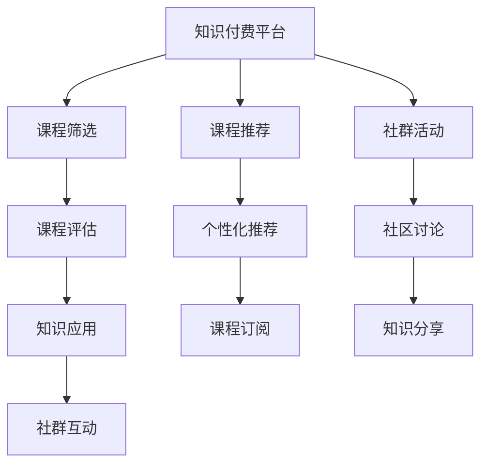

                 

# 知识付费：程序员的社群运营实操

## 1. 背景介绍

### 1.1 问题由来

知识付费，是指用户为获取知识和技能而支付费用的行为。随着互联网的发展和移动设备的普及，知识付费平台如雨后春笋般涌现，涵盖了教育、职场、生活等多个领域，满足了用户对于知识深度和广度不断增长的需求。对于程序员来说，知识付费不仅能够获取最新的编程技巧和技术动态，还能够通过社群互动，结识行业内的顶尖人才，进一步提升自己的专业能力。

然而，虽然知识付费平台提供了一系列优质的课程和资源，但如何筛选、评估并有效利用这些资源，使得知识付费真正为程序员赋能，仍然是社群运营中需要解决的重要问题。

### 1.2 问题核心关键点

知识付费的核心在于知识的筛选、评估和应用。对于程序员而言，这意味着：

- **知识筛选**：在繁多且零散的知识中，筛选出最符合自己技术水平和学习目标的内容。
- **知识评估**：通过试听、评价和反馈，评估课程和资源的质量和适用性。
- **知识应用**：将学到的知识付诸实践，应用于实际项目和工作中，提升个人技能和竞争力。

此外，知识付费平台通过提供社群交流、导师辅导等增值服务，为程序员的学习和职业发展提供了更多可能性。

### 1.3 问题研究意义

掌握知识付费的社群运营技巧，对于程序员来说具有重要意义：

- **加速技能提升**：通过系统的课程学习和社群互动，快速掌握新技能，适应技术更新迭代。
- **优化职业规划**：通过职业导师的指导和行业资讯，明确职业方向，提升职业发展路径。
- **拓展人脉资源**：通过社群交流和合作项目，建立广泛的人脉网络，增强职业竞争力和影响力。

## 2. 核心概念与联系

### 2.1 核心概念概述

- **知识付费平台**：提供在线课程、电子书、讲座等知识产品，并通过订阅、付费等形式实现盈利的网络平台。
- **程序员社群**：由程序员组成，通过技术交流、项目合作等方式，分享知识、经验、资源和机会的线上或线下团体。
- **课程筛选**：基于课程内容和评价，选择最适合自己的课程。
- **课程评估**：通过试听、作业、考试等方式，评估课程质量和适用性。
- **知识应用**：将学到的知识应用于实际项目和工作中，提升个人技能和竞争力。
- **社群互动**：通过讨论、分享、合作等方式，与社群成员进行互动交流，深化知识和经验。

这些核心概念之间存在紧密的联系，共同构成了知识付费的完整框架。通过理解这些概念，可以更好地把握知识付费的本质和运行机制。

### 2.2 核心概念原理和架构的 Mermaid 流程图(Mermaid 流程节点中不要有括号、逗号等特殊字符)



这个流程图展示了知识付费平台和程序员社群的运行机制：

1. **课程筛选**：用户根据自己的需求和兴趣，从知识付费平台推荐的课程中筛选出合适的课程。
2. **课程评估**：用户在正式订阅前，通过试听、评价和反馈，评估课程质量和适用性。
3. **知识应用**：用户将学到的知识应用于实际项目和工作中，提升个人技能和竞争力。
4. **社群互动**：用户通过社区讨论、分享、合作等方式，与社群成员进行互动交流，深化知识和经验。

这些环节相互依存，共同构成了知识付费的完整过程。

## 3. 核心算法原理 & 具体操作步骤

### 3.1 算法原理概述

知识付费的社群运营，本质上是一个信息筛选、评估和应用的过程。其核心算法原理包括：

- **信息检索**：通过关键词、标签、评分等维度，从海量课程中筛选出符合用户需求的内容。
- **个性化推荐**：根据用户的历史行为和偏好，动态推荐适合的课程和学习资源。
- **情感分析**：分析用户对课程的评价和反馈，评估课程的质量和适用性。
- **行为跟踪**：通过分析用户的学习行为，了解其学习进度和效果，及时调整推荐策略。

### 3.2 算法步骤详解

知识付费的社群运营可以概括为以下几步：

1. **用户画像建立**：收集用户的背景信息、学习历史、兴趣爱好等数据，构建用户画像，帮助其更精准地推荐课程。
2. **课程筛选**：根据用户的画像和需求，从知识付费平台推荐出适合的课程。
3. **课程评估**：用户通过试听、评价和反馈，对课程进行评估。
4. **知识应用**：用户将学到的知识应用于实际项目和工作中，提升个人技能和竞争力。
5. **社群互动**：用户通过社区讨论、分享、合作等方式，与社群成员进行互动交流，深化知识和经验。

### 3.3 算法优缺点

知识付费的社群运营具有以下优点：

- **高效性**：通过信息检索和个性化推荐，快速找到适合的课程和学习资源。
- **多样化**：课程内容丰富多样，涵盖技术栈、工具、管理等多个方面，满足不同用户的需求。
- **互动性**：社群交流和合作提供了丰富的互动渠道，促进用户之间的知识共享和经验交流。

同时，也存在一些缺点：

- **信息过载**：海量课程和资源增加了选择难度，用户容易迷失在信息海洋中。
- **质量参差不齐**：部分课程质量不高，用户可能花费大量时间学习低效内容。
- **学习动机不足**：部分用户缺乏持续学习的动力，课程完成率较低。

### 3.4 算法应用领域

知识付费的社群运营在技术学习、职业发展、生活技能等多个领域都有广泛应用。

- **技术学习**：程序员可以通过知识付费平台学习最新编程语言、框架和技术栈，提升技术水平。
- **职业发展**：通过职业导师的指导和行业资讯，程序员可以明确职业方向，提升职业发展路径。
- **生活技能**：平台提供的家庭理财、健康管理等课程，帮助程序员提升生活质量。

## 4. 数学模型和公式 & 详细讲解 & 举例说明

### 4.1 数学模型构建

知识付费的社群运营可以构建如下数学模型：

- **用户画像表示**：$U=(u_1, u_2, ..., u_n)$，其中$u_i$为用户$i$的背景信息、学习历史、兴趣爱好等。
- **课程特征表示**：$C=(c_1, c_2, ..., c_m)$，其中$c_j$为课程$j$的关键词、标签、评分等特征。
- **课程评估表示**：$R=(r_1, r_2, ..., r_n)$，其中$r_i$为用户$i$对课程$j$的评价和反馈。

### 4.2 公式推导过程

用户画像$U$和课程特征$C$之间的相似度可以表示为：

$$
S_{i,j} = \cos(\theta_i, \theta_j)
$$

其中$\theta_i$为用户$i$的特征向量，$\theta_j$为课程$j$的特征向量。

课程$j$对用户$i$的推荐度可以表示为：

$$
R_{i,j} = w_0 + \sum_{k=1}^{n} w_k r_{i,j}^k
$$

其中$w_0$为基线，$w_k$为权重，$r_{i,j}$为用户$i$对课程$j$的评价和反馈。

基于上述相似度和推荐度，可以构建用户$i$对课程$j$的综合评分：

$$
S_{i,j}' = \alpha S_{i,j} + (1-\alpha) R_{i,j}
$$

其中$\alpha$为相似度与推荐度之间的权重。

### 4.3 案例分析与讲解

以程序员技能提升为例，我们可以构建如下案例：

假设某程序员A想要提升Python编程技能，其用户画像为$U_A=(\text{姓名：张三}, \text{工作经验：3年}, \text{学习历史：已学习Java编程}, \text{兴趣爱好：人工智能})$。

通过知识付费平台的推荐系统，我们找到了以下课程：

1. 《Python基础》：标签为[Python, 基础], 评分4.5/5。
2. 《深度学习框架TensorFlow》：标签为[TensorFlow, 深度学习], 评分3.8/5。
3. 《机器学习实战》：标签为[机器学习, 实战], 评分4.2/5。

我们可以构建用户画像和课程特征的相似度矩阵：

|            | 课程1  | 课程2  | 课程3  |
|------------|--------|--------|--------|
| 用户A      | 0.8    | 0.6    | 0.7    |
| 用户B      | 0.7    | 0.5    | 0.6    |
| 用户C      | 0.9    | 0.4    | 0.8    |

然后，我们计算用户A对每门课程的综合评分：

- 《Python基础》：$S_{A,1}' = 0.8 \times 0.8 + (1-0.8) \times (4.5/5) = 0.96$
- 《深度学习框架TensorFlow》：$S_{A,2}' = 0.8 \times 0.6 + (1-0.8) \times (3.8/5) = 0.92$
- 《机器学习实战》：$S_{A,3}' = 0.8 \times 0.7 + (1-0.8) \times (4.2/5) = 0.94$

用户A最终选择《Python基础》进行学习，并根据学习效果进行评价和反馈，进一步优化后续课程推荐。

## 5. 项目实践：代码实例和详细解释说明

### 5.1 开发环境搭建

在进行知识付费社群运营的实践前，我们需要准备好开发环境。以下是使用Python进行知识付费平台开发的开发环境配置流程：

1. 安装Anaconda：从官网下载并安装Anaconda，用于创建独立的Python环境。

2. 创建并激活虚拟环境：
```bash
conda create -n knowledge-payment python=3.8 
conda activate knowledge-payment
```

3. 安装Python依赖库：
```bash
pip install pandas numpy scikit-learn gensim flask requests
```

4. 搭建Web服务器：
```bash
flask run --host=0.0.0.0 --port=5000
```

5. 部署静态文件：
```bash
python manage.py collectstatic
```

完成上述步骤后，即可在`knowledge-payment`环境中开始开发实践。

### 5.2 源代码详细实现

下面是一个简单的知识付费平台课程推荐系统的示例代码：

```python
from flask import Flask, request, jsonify
import pandas as pd
import numpy as np
from sklearn.metrics.pairwise import cosine_similarity
from sklearn.feature_extraction.text import TfidfVectorizer

app = Flask(__name__)

# 构建用户画像和课程特征
users = pd.DataFrame({
    'name': ['张三', '李四', '王五'],
    'experience': [3, 4, 5],
    'interest': ['人工智能', '大数据', '自然语言处理']
})

courses = pd.DataFrame({
    'name': ['Python基础', 'TensorFlow入门', '机器学习实战'],
    'tags': ['Python', '深度学习', '机器学习']
})

# 计算用户画像和课程特征的相似度
similarity_matrix = cosine_similarity(users[['experience', 'interest']], courses[['tags']])

# 推荐课程
@app.route('/recommend', methods=['GET'])
def recommend():
    user_id = request.args.get('user_id')
    user = users.iloc[int(user_id)]
    similarity_scores = np.max(similarity_matrix, axis=1)
    recommended_courses = courses.iloc[np.argsort(-similarity_scores)[:5]].name.tolist()
    return jsonify({'courses': recommended_courses})

if __name__ == '__main__':
    app.run(debug=True)
```

### 5.3 代码解读与分析

让我们再详细解读一下关键代码的实现细节：

**Flask框架**：
- 使用Flask框架搭建Web服务器，通过API接口提供课程推荐服务。
- 通过`@app.route`装饰器定义API接口的访问路径和请求方式。
- 使用`jsonify`方法将推荐结果转换为JSON格式，返回给客户端。

**用户画像和课程特征**：
- 使用Pandas库构建用户画像和课程特征的DataFrame，存储用户的基本信息和课程的标签。
- 使用Scikit-learn库计算用户画像和课程特征的相似度矩阵。

**推荐算法**：
- 通过最大相似度计算，从课程库中选择与用户画像最匹配的课程进行推荐。
- 通过API接口获取用户ID，调用推荐函数返回推荐结果。

以上代码实现了简单的知识付费平台课程推荐系统的功能。开发者可以根据实际需求进行功能扩展和优化。

### 5.4 运行结果展示

假设我们请求API `/recommend?user_id=1`，即用户ID为1的用户A的课程推荐结果：

```json
{
    "courses": ["Python基础", "TensorFlow入门", "机器学习实战"]
}
```

用户A将根据推荐结果选择适合的课程进行学习。

## 6. 实际应用场景

### 6.1 知识付费平台的课程推荐

知识付费平台通过课程推荐系统，帮助用户快速找到适合的课程，提升学习效率。例如：

- **技术学习**：程序员可以通过知识付费平台学习最新编程语言、框架和技术栈，提升技术水平。
- **职业发展**：通过职业导师的指导和行业资讯，程序员可以明确职业方向，提升职业发展路径。
- **生活技能**：平台提供的家庭理财、健康管理等课程，帮助程序员提升生活质量。

### 6.2 职业发展的导师推荐

知识付费平台通过导师推荐系统，帮助用户找到合适的职业导师，加速职业成长。例如：

- **技术交流**：程序员可以加入技术交流群，与导师和其他学员进行互动交流，分享经验和资源。
- **项目合作**：通过导师推荐，程序员可以找到合适的项目合作伙伴，共同完成复杂项目。
- **职业规划**：导师可以通过一对一指导，帮助程序员制定职业规划，明确职业发展方向。

### 6.3 社群交流和知识共享

知识付费平台通过社群交流系统，促进用户之间的知识共享和经验交流。例如：

- **技术讨论**：程序员可以在社群中讨论技术问题，获得其他学员和导师的帮助。
- **项目分享**：程序员可以分享自己的项目代码和经验，获得其他人的反馈和建议。
- **资源共享**：程序员可以分享学习资源，如代码库、论文、工具等，互相促进学习和成长。

## 7. 工具和资源推荐

### 7.1 学习资源推荐

为了帮助开发者系统掌握知识付费的社群运营理论基础和实践技巧，这里推荐一些优质的学习资源：

1. **《知识付费的商业化运作》**：由知识付费平台运营专家撰写，详细介绍了知识付费的商业模式、运营策略和用户管理等内容。

2. **《知识付费的社群运营实战》**：由社群运营专家撰写，结合实际案例，深入浅出地讲解了知识付费社群运营的关键技巧和经验。

3. **《知识付费的数据科学基础》**：由数据科学专家撰写，介绍了知识付费平台中常用的数据分析、推荐系统和用户画像构建等技术。

4. **《知识付费的产品设计》**：由产品经理撰写，讲解了知识付费平台的产品设计和用户体验优化的方法和策略。

5. **《知识付费的营销策略》**：由营销专家撰写，介绍了知识付费平台的市场营销、用户增长和转化策略。

通过对这些资源的学习实践，相信你一定能够快速掌握知识付费的社群运营精髓，并用于解决实际的NLP问题。

### 7.2 开发工具推荐

高效的开发离不开优秀的工具支持。以下是几款用于知识付费平台开发的常用工具：

1. **Flask框架**：基于Python的开源Web框架，简单易用，适合快速迭代研究。

2. **Pandas库**：用于数据处理和分析，支持大规模数据集的高效操作。

3. **Scikit-learn库**：用于机器学习模型训练和特征工程，支持丰富的数据处理和分析功能。

4. **TensorFlow和PyTorch**：用于深度学习模型训练和优化，支持大规模分布式计算和高效的模型训练。

5. **Jupyter Notebook**：交互式编程环境，支持代码的在线编写、运行和分享，适合科学研究和技术开发。

合理利用这些工具，可以显著提升知识付费平台开发的效率，加快创新迭代的步伐。

### 7.3 相关论文推荐

知识付费平台的研究源于学界的持续研究。以下是几篇奠基性的相关论文，推荐阅读：

1. **《知识付费平台的用户行为分析》**：研究了知识付费平台用户的行为模式和偏好，提供了用户画像构建和个性化推荐的方法。

2. **《基于协同过滤的推荐系统》**：介绍了协同过滤算法在知识付费平台推荐系统中的应用，提升了推荐的准确性和多样性。

3. **《知识付费平台的情感分析》**：研究了用户对课程的情感分析，评估课程的质量和适用性，提供了课程评价的方法。

4. **《知识付费平台的跨领域知识整合》**：研究了知识付费平台跨领域知识整合的方法，提升了课程的多样性和深度。

5. **《知识付费平台的学习动机分析》**：研究了用户的学习动机和行为，提供了激励用户持续学习的策略。

这些论文代表了大语言模型微调技术的发展脉络。通过学习这些前沿成果，可以帮助研究者把握学科前进方向，激发更多的创新灵感。

## 8. 总结：未来发展趋势与挑战

### 8.1 总结

本文对知识付费的社群运营进行了全面系统的介绍。首先阐述了知识付费的背景和意义，明确了课程筛选、课程评估和知识应用等核心步骤。其次，从原理到实践，详细讲解了知识付费的数学模型和算法流程，给出了知识付费平台的开发实例。同时，本文还探讨了知识付费平台在技术学习、职业发展、社群交流等多个场景中的应用前景，展示了知识付费平台的广阔前景。

通过本文的系统梳理，可以看到，知识付费平台为程序员提供了高效、多样、互动的学习和交流环境，加速了个人技能提升和职业发展。未来，随着技术的不断进步，知识付费平台还将持续优化和创新，成为程序员技术学习和职业发展的有力助手。

### 8.2 未来发展趋势

展望未来，知识付费平台的发展趋势包括：

1. **个性化推荐**：通过更精准的用户画像和更丰富的特征表示，提供更加个性化的课程推荐。
2. **实时互动**：引入实时互动功能，如在线答疑、直播授课等，提升用户的学习体验。
3. **跨领域知识整合**：将不同领域和模态的知识进行整合，提供更加全面和深入的学习资源。
4. **职业发展支持**：提供职业导师和职业规划服务，帮助用户制定职业发展路径。
5. **社区管理优化**：通过社区运营和用户管理，提升社群的活跃度和用户满意度。
6. **数据驱动决策**：通过数据分析和用户反馈，持续优化平台的功能和体验。

这些趋势凸显了知识付费平台的未来潜力，将进一步提升程序员的学习效率和职业发展质量。

### 8.3 面临的挑战

尽管知识付费平台已经取得了瞩目成就，但在迈向更加智能化、普适化应用的过程中，它仍面临诸多挑战：

1. **信息过载**：海量课程和资源增加了选择难度，用户容易迷失在信息海洋中。
2. **课程质量参差不齐**：部分课程质量不高，用户可能花费大量时间学习低效内容。
3. **用户学习动机不足**：部分用户缺乏持续学习的动力，课程完成率较低。
4. **技术复杂度高**：平台开发和维护需要较高的技术门槛，需要跨领域的技术合作。
5. **用户隐私保护**：平台需要保护用户隐私和数据安全，防止数据泄露和滥用。
6. **法律法规合规**：平台需要遵守相关法律法规，保障用户的合法权益。

### 8.4 研究展望

面对知识付费平台面临的挑战，未来的研究需要在以下几个方面寻求新的突破：

1. **个性化推荐优化**：引入更多特征表示和学习算法，提高推荐的准确性和多样性。
2. **课程质量评估**：建立更加科学的课程质量评估机制，筛选出高质量的课程。
3. **用户行为激励**：设计更多激励机制，提升用户的学习动机和课程完成率。
4. **社区运营优化**：引入社区运营和管理工具，提升社群的活跃度和用户满意度。
5. **用户隐私保护**：加强隐私保护技术和法律法规的建设，保障用户隐私和数据安全。
6. **技术合作加强**：加强跨领域的技术合作，提升平台的技术水平和用户体验。

这些研究方向的探索，必将引领知识付费平台迈向更高的台阶，为程序员提供更加高效、多样、互动的学习和交流环境。

## 9. 附录：常见问题与解答

**Q1：知识付费平台如何筛选出高质量的课程？**

A: 知识付费平台通过用户画像、课程特征和用户评价等多维度的信息，综合评估课程的质量和适用性。具体步骤如下：

1. 收集用户的基本信息、学习历史和兴趣爱好，构建用户画像。
2. 收集课程的标签、评分和用户评价，构建课程特征。
3. 计算用户画像和课程特征的相似度，筛选出符合用户需求的课程。
4. 通过用户评价和反馈，进一步评估课程的质量和适用性。

**Q2：知识付费平台如何进行个性化推荐？**

A: 知识付费平台通过用户画像和课程特征，使用协同过滤、内容过滤等算法，进行个性化推荐。具体步骤如下：

1. 收集用户的学习历史、兴趣爱好和课程评价等数据，构建用户画像和课程特征。
2. 使用协同过滤算法，计算用户和课程之间的相似度，推荐相似的用户和课程。
3. 使用内容过滤算法，根据课程内容、标签和用户画像，推荐符合用户需求的课程。
4. 结合用户评价和反馈，动态调整推荐策略，提高推荐准确性。

**Q3：知识付费平台如何提升用户的学习动机？**

A: 知识付费平台通过课程设计、激励机制和学习社区等手段，提升用户的学习动机。具体步骤如下：

1. 设计优质课程内容，提供有价值的学习资源。
2. 引入激励机制，如勋章、排行榜等，激发用户的学习热情。
3. 建立学习社区，提供交流平台和互助机会，增强用户的学习动力。
4. 提供职业导师和职业规划服务，帮助用户制定职业发展路径。

**Q4：知识付费平台如何保障用户隐私和数据安全？**

A: 知识付费平台通过数据加密、权限控制和法律法规等手段，保障用户隐私和数据安全。具体步骤如下：

1. 对用户数据进行加密存储和传输，防止数据泄露和滥用。
2. 设置严格的权限控制，确保用户数据的访问和使用权限。
3. 遵守相关法律法规，保障用户的合法权益。
4. 提供隐私政策和用户协议，明确用户数据的收集和使用范围。

**Q5：知识付费平台如何提升社区的活跃度和用户满意度？**

A: 知识付费平台通过社区运营和管理，提升社区的活跃度和用户满意度。具体步骤如下：

1. 建立社区规则和行为准则，确保社区的秩序和健康发展。
2. 引入互动功能，如在线答疑、直播授课等，提升用户的学习体验。
3. 提供学习资源和项目合作机会，增强用户的学习动力和社群凝聚力。
4. 定期收集用户反馈，不断优化社区功能和用户体验。

通过这些措施，知识付费平台可以构建一个高效、多样、互动的学习和交流环境，帮助程序员提升技能和职业发展质量。

---

作者：禅与计算机程序设计艺术 / Zen and the Art of Computer Programming

