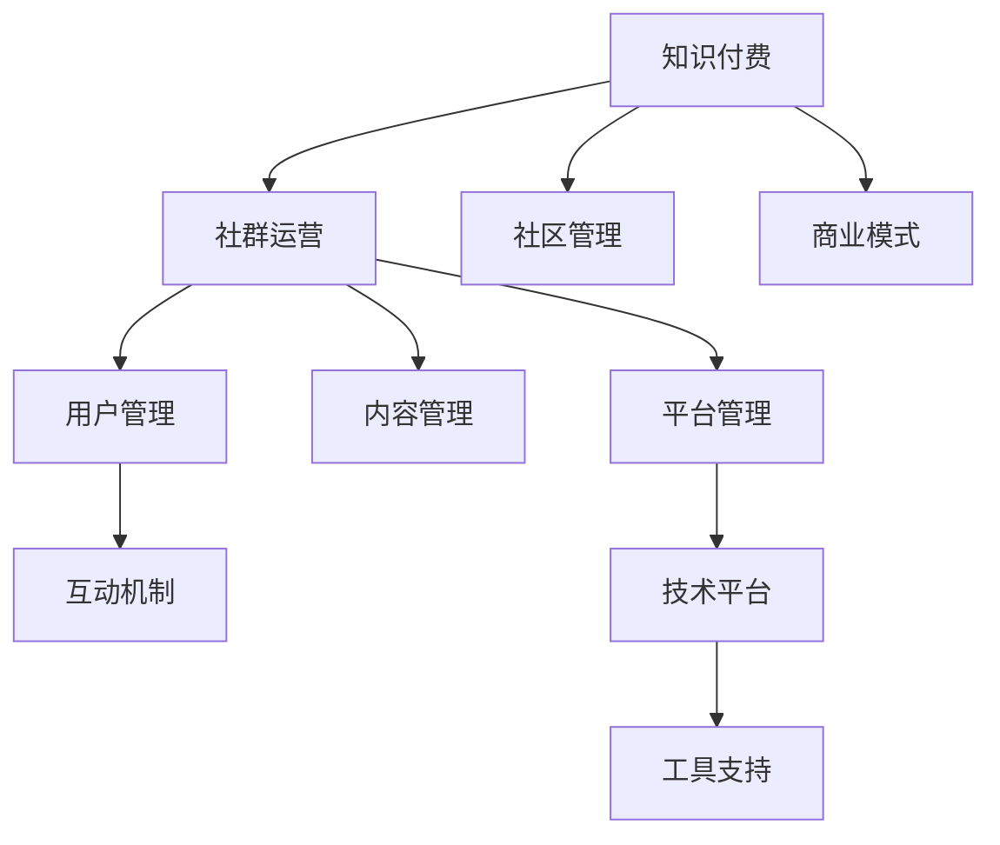

                 

# 知识付费：程序员的社群运营秘籍

> 关键词：知识付费, 程序员社群, 运营秘籍, 社区管理, 商业模式

## 1. 背景介绍

### 1.1 问题由来

在互联网和信息技术迅猛发展的今天，知识付费成为了一个蓬勃兴起的新兴领域。特别是针对程序员这一庞大群体，由于其高度专业化和快速迭代的特性，传统的在线教育平台往往难以满足其知识更新和技能提升的需求。此时，基于知识付费的社群运营模式应运而生，为程序员提供了更为直接、精准的知识获取途径。

### 1.2 问题核心关键点

1. **社区定位与目标人群**：确定社群的主要服务对象，以及他们对知识的需求和兴趣点。
2. **内容质量与专业性**：提供高质量、有针对性的技术内容和项目实战经验，确保知识的专业性和实用性。
3. **互动机制与参与度**：建立高效的互动机制，提高用户参与度和社群粘性。
4. **商业模式的可持续性**：探索多样化的盈利模式，确保社群的长期稳定发展。
5. **技术平台与工具支持**：构建高性能、易用的技术平台，提供全面的工具支持，提升运营效率。

### 1.3 问题研究意义

1. **高效知识传播**：通过知识付费模式，实现知识的高效传播和精准匹配，提升学习效率。
2. **社区良性循环**：在付费用户与知识提供者之间建立良性互动，形成社区生态。
3. **商业价值变现**：基于社群的商业化探索，挖掘更多盈利机会，实现商业模式的多元化。
4. **人才集聚与培养**：吸引和培养技术精英，为行业发展注入新动力。

## 2. 核心概念与联系

### 2.1 核心概念概述

为更好地理解程序员知识付费社群的运营模式，本节将介绍几个密切相关的核心概念：

- **知识付费**：指通过购买知识内容，获取相应技术知识与技能提升的学习途径。
- **程序员社群**：指基于共同的技术兴趣和职业目标，聚集在一起的程序员群体。
- **知识付费社群**：结合知识付费和社群运营两种模式，为程序员提供高效的知识获取渠道和互动平台。
- **社群运营**：指通过规划、执行、评估等环节，维护社群的正常运行，提升社群价值的过程。
- **社区管理**：包括用户管理、内容管理、平台管理等方面，旨在维护社群秩序，优化用户体验。
- **商业模式**：涉及知识付费、广告、赞助、技术支持等多方面，旨在实现社群的商业化运作。

这些核心概念之间的逻辑关系可以通过以下Mermaid流程图来展示：



这个流程图展示的知识付费社群运营模式的核心概念及其之间的关系：

1. 知识付费是社群运营的基础，确保知识的高效传播。
2. 社区管理涉及用户和内容等多个方面，维护社群秩序和提升用户体验。
3. 商业模式的探索，为社群的长期发展提供经济支持。
4. 用户管理、内容管理、平台管理、技术平台、工具支持等环节，都是支持社群运营的重要组成部分。

## 3. 核心算法原理 & 具体操作步骤
### 3.1 算法原理概述

知识付费社群的运营，本质上是通过有偿服务，提供知识内容的获取、分享和互动。其核心在于高效地匹配知识提供者和需求者，建立用户之间的互动机制，并通过合理的商业模式实现社群的可持续发展。

### 3.2 算法步骤详解

基于知识付费的社群运营，一般包括以下几个关键步骤：

**Step 1: 确定社区定位与目标人群**

- 调研程序员社群的主要需求和痛点。
- 根据需求和兴趣，明确社区的服务范围和目标用户群体。

**Step 2: 设计知识内容和互动机制**

- 组织技术专家、从业者，制定社群的知识体系和内容计划。
- 设计多样化的互动机制，如问答、项目讨论、代码审查等，鼓励用户积极参与。

**Step 3: 构建技术平台与工具支持**

- 选择合适的技术栈和框架，搭建社群平台，支持知识内容的管理和分发。
- 引入性能监控、用户行为分析等工具，辅助运营决策。

**Step 4: 探索与优化商业模式**

- 初步设定知识付费的定价策略，制定激励机制。
- 根据运营数据和用户反馈，不断调整和优化商业模式。

**Step 5: 社区管理与用户反馈**

- 设立社区管理团队，负责用户管理、内容管理、平台维护等。
- 定期收集用户反馈，优化社群体验和互动机制。

### 3.3 算法优缺点

基于知识付费的社群运营，具有以下优点：

1. **精准匹配**：能够实现知识提供者和需求者的高效匹配，避免信息过载。
2. **知识权威**：知识提供者一般为行业内的技术专家或从业者，确保内容的权威性和实用性。
3. **互动性强**：通过互动机制，促进用户之间的交流和合作，提升社群活跃度。
4. **商业化途径**：多种盈利模式并存，确保社群的可持续发展。

同时，该方法也存在以下局限性：

1. **内容依赖高质量专家**：依赖专业领域专家的参与，可能影响内容的持续性和多样性。
2. **高门槛用户**：知识付费模式可能对部分用户造成经济压力，影响参与度。
3. **用户粘性管理**：社群的活跃度和用户粘性需要持续投入和管理。
4. **平台维护成本**：技术平台的搭建和维护需要高额的投入，可能影响运营效率。

尽管存在这些局限性，但就目前而言，基于知识付费的社群运营方法仍然是程序员社区的重要实践方向。未来相关研究的重点在于如何进一步优化内容供给、降低参与门槛、提高用户粘性，同时兼顾商业模式的可持续性。

### 3.4 算法应用领域

基于知识付费的社群运营，在程序员社区已经得到了广泛的应用，覆盖了几乎所有常见领域，例如：

- **技术学习与交流**：提供针对特定技术领域的学习资源和交流平台，如Java、Python、人工智能等。
- **项目开发与合作**：围绕特定的项目需求，组织开发者进行协作开发和技术交流，提升项目质量。
- **行业动态与趋势**：分享行业最新的技术动态和趋势，帮助程序员了解行业前沿。
- **职业发展与招聘**：提供职业发展规划指导和招聘信息，帮助程序员提升就业竞争力。
- **产品设计与评估**：围绕产品设计、原型开发、用户反馈等环节，提供综合性的技术支持和服务。

除了上述这些经典领域外，知识付费的社群运营还被创新性地应用到更多场景中，如技术培训、职业转型、创业指导等，为程序员社区带来了新的发展动力。

## 4. 数学模型和公式 & 详细讲解 & 举例说明

### 4.1 数学模型构建

知识付费社群的运营，涉及用户行为分析、内容推荐、互动机制等多个方面。以下是一个简化的用户行为分析模型：

记用户数为 $U$，知识内容数为 $C$，参与互动次数为 $I$，知识支付金额为 $P$。用户行为分析的目标是最大化社区的总价值 $V$：

$$
V = U \times C \times I - P
$$

其中，$U \times C \times I$ 表示用户获取知识带来的收益，$P$ 表示知识付费的成本。模型目标是最大化总价值 $V$。

### 4.2 公式推导过程

假设用户 $i$ 在内容 $j$ 上的收益为 $R_{ij}$，付费金额为 $P_{ij}$。则用户 $i$ 的总收益 $U_i$ 可以表示为：

$$
U_i = \sum_{j \in C_i} R_{ij} - \sum_{j \in C_i} P_{ij}
$$

其中 $C_i$ 表示用户 $i$ 订阅的知识内容。

对于社群的总价值 $V$，可以进一步分解为：

$$
V = \sum_{i \in U} \left( \sum_{j \in C_i} R_{ij} - \sum_{j \in C_i} P_{ij} \right)
$$

为了最大化社群的总价值 $V$，需要最大化每个用户的收益 $U_i$。这可以通过优化互动次数 $I$ 和知识付费金额 $P$ 来实现。

### 4.3 案例分析与讲解

以下是一个具体的案例分析：

某程序员社群共有用户 $U=1000$，内容 $C=100$，每个用户每次互动 $I=5$，每次支付金额 $P=50$。假设用户 $i$ 在内容 $j$ 上的收益 $R_{ij}=1$。则：

- 用户 $i$ 的总收益 $U_i = 1 \times 5 - 1 \times 50 = -45$。
- 社群的总价值 $V = 1000 \times 100 \times 5 - 1000 \times 50 = 45000$。

通过优化互动次数 $I$ 和知识付费金额 $P$，可以调整用户收益和社群总价值的关系，从而实现最优运营效果。

## 5. 项目实践：代码实例和详细解释说明
### 5.1 开发环境搭建

在进行知识付费社群的运营实践前，我们需要准备好开发环境。以下是使用Python进行Flask开发的环境配置流程：

1. 安装Anaconda：从官网下载并安装Anaconda，用于创建独立的Python环境。

2. 创建并激活虚拟环境：
```bash
conda create -n flask-env python=3.8 
conda activate flask-env
```

3. 安装Flask：
```bash
pip install Flask
```

4. 安装必要的第三方库：
```bash
pip install flask_sqlalchemy flask_marshmallow flask_login flask_wtf flask_apispec
```

5. 安装Jinja2和SQLAlchemy：
```bash
pip install Jinja2 SQLAlchemy
```

完成上述步骤后，即可在`flask-env`环境中开始知识付费社群的开发实践。

### 5.2 源代码详细实现

下面以一个简单的知识付费社群为例，给出使用Flask进行知识付费社群开发的PyTorch代码实现。

首先，定义模型和数据库：

```python
from flask import Flask, render_template, request
from flask_sqlalchemy import SQLAlchemy
from flask_marshmallow import Marshmallow
from flask_login import LoginManager
from flask_wtf import CSRFProtect
from flask_apispec import APISpec

app = Flask(__name__)
app.config['SQLALCHEMY_DATABASE_URI'] = 'sqlite:////tmp/test.db'
app.config['SECRET_KEY'] = 'some_secret_key'
app.config['CSRF_ENABLED'] = True
app.config['WTF_CSRF_SECRET_KEY'] = 'some_secret_key'

db = SQLAlchemy(app)
ma = Marshmallow(app)
login_manager = LoginManager(app)
csrf = CSRFProtect(app)
api_spec = APISpec(app)

@login_manager.user_loader
def load_user(user_id):
    return User.get(user_id)

# 用户模型
class User(db.Model):
    id = db.Column(db.Integer, primary_key=True)
    username = db.Column(db.String(80), unique=True, nullable=False)
    password = db.Column(db.String(120), nullable=False)

    def __init__(self, username, password):
        self.username = username
        self.password = password

# 用户序列化器
class UserSchema(ma.SQLAlchemyAutoSchema):
    class Meta:
        model = User
        fields = ('id', 'username', 'password')

# 知识内容模型
class Content(db.Model):
    id = db.Column(db.Integer, primary_key=True)
    title = db.Column(db.String(120), nullable=False)
    content = db.Column(db.Text, nullable=False)
    user_id = db.Column(db.Integer, db.ForeignKey('user.id'), nullable=False)

    def __init__(self, title, content, user_id):
        self.title = title
        self.content = content
        self.user_id = user_id

# 知识内容序列化器
class ContentSchema(ma.SQLAlchemyAutoSchema):
    class Meta:
        model = Content
        fields = ('id', 'title', 'content', 'user_id')

# 用户与内容关联关系
user = db.relationship('User', backref=db.backref('content', lazy='dynamic'))
```

然后，定义用户注册、登录、知识内容提交等接口：

```python
from flask_login import login_user, logout_user, login_required
from werkzeug.security import generate_password_hash, check_password_hash

@app.route('/register', methods=['GET', 'POST'])
def register():
    if request.method == 'POST':
        username = request.form['username']
        password = generate_password_hash(request.form['password'])
        user = User(username=username, password=password)
        db.session.add(user)
        db.session.commit()
        return redirect(url_for('login'))
    return render_template('register.html')

@app.route('/login', methods=['GET', 'POST'])
def login():
    if request.method == 'POST':
        username = request.form['username']
        password = request.form['password']
        user = User.query.filter_by(username=username).first()
        if check_password_hash(user.password, password):
            login_user(user)
            return redirect(url_for('home'))
    return render_template('login.html')

@app.route('/logout')
@login_required
def logout():
    logout_user()
    return redirect(url_for('home'))

@app.route('/content', methods=['GET', 'POST'])
@login_required
def submit_content():
    if request.method == 'POST':
        title = request.form['title']
        content = request.form['content']
        user_id = current_user.id
        content = Content(title=title, content=content, user_id=user_id)
        db.session.add(content)
        db.session.commit()
        return redirect(url_for('home'))
    return render_template('submit_content.html')

@app.route('/content/<int:id>')
def view_content(id):
    content = Content.query.get(id)
    return render_template('view_content.html', content=content)
```

最后，定义API接口和文档：

```python
from flask_restful import Resource, Api

api = Api(app)

# 用户API
class UserAPI(Resource):
    def get(self, id):
        user = User.query.get(id)
        user_schema = UserSchema.dump(user)
        return {'user': user_schema}, 200

    def put(self, id):
        user = User.query.get(id)
        user_schema = UserSchema()
        data = user_schema.load(request.json)
        user.update(data)
        db.session.commit()
        user_schema = UserSchema.dump(user)
        return {'user': user_schema}, 200

# 知识内容API
class ContentAPI(Resource):
    def get(self, id):
        content = Content.query.get(id)
        content_schema = ContentSchema.dump(content)
        return {'content': content_schema}, 200

    def post(self):
        content = Content(title=request.json['title'], content=request.json['content'], user_id=current_user.id)
        db.session.add(content)
        db.session.commit()
        content_schema = ContentSchema.dump(content)
        return {'content': content_schema}, 200

api.add_resource(UserAPI, '/user/<int:id>')
api.add_resource(ContentAPI, '/content/<int:id>')
```

### 5.3 代码解读与分析

让我们再详细解读一下关键代码的实现细节：

**Flask应用与环境配置**：
- `app` 对象为Flask应用的核心对象，通过配置 SQLAlchemy 数据库连接和 CSRF 防护机制，确保应用的安全性和稳定性。

**用户模型与序列化器**：
- 定义用户模型 `User`，包含用户名和密码，并定义了与数据库的关联关系。
- 定义用户序列化器 `UserSchema`，用于序列化和反序列化用户对象。

**内容模型与关联关系**：
- 定义内容模型 `Content`，包含标题、内容、用户 ID，并定义了与用户的关联关系。
- 使用 SQLAlchemy 的关联关系，实现了用户和内容的一对多关系。

**用户注册、登录、知识内容提交等接口**：
- 定义 `/register` 接口，接收用户名和密码，进行用户注册并返回注册成功后的重定向。
- 定义 `/login` 接口，接收用户名和密码，验证登录信息后返回登录成功或登录失败。
- 定义 `/logout` 接口，用于用户注销。
- 定义 `/content` 接口，用户提交内容，并返回内容提交成功后的重定向。
- 定义 `/content/<int:id>` 接口，展示指定 ID 的内容。

**API接口和文档**：
- 定义用户 API `UserAPI`，包括 `get` 和 `put` 方法，用于获取和更新用户信息。
- 定义内容 API `ContentAPI`，包括 `get` 和 `post` 方法，用于获取和提交内容。
- 使用 Flask-Restful 框架，创建 `UserAPI` 和 `ContentAPI` 的资源，并定义 RESTful API 的路由。

完成上述代码后，知识付费社群的Flask应用即可运行。在运行时，用户可以通过注册、登录、内容提交等功能，实现知识的获取和互动。

## 6. 实际应用场景
### 6.1 智能客服系统

知识付费社群的模式，同样适用于智能客服系统的构建。通过构建基于知识付费的智能客服社群，为用户提供实时的技术支持和服务，可以在很大程度上提升客服效率和用户满意度。

在技术实现上，可以收集企业内部的客服对话记录，将常见问题和最佳答复构建成知识库，在此基础上对社群用户进行微调，使智能客服系统能够自动理解用户意图，匹配最合适的答案模板进行回复。对于用户提出的新问题，还可以接入检索系统实时搜索相关内容，动态组织生成回答。如此构建的智能客服系统，能大幅提升客户咨询体验和问题解决效率。

### 6.2 金融舆情监测

金融领域的知识付费社群，可以实时监测市场舆论动向，以便及时应对负面信息传播，规避金融风险。

具体而言，可以收集金融领域相关的新闻、报道、评论等文本数据，并对其进行主题标注和情感标注。在此基础上对社群用户进行微调，使其能够自动判断文本属于何种主题，情感倾向是正面、中性还是负面。将微调后的社群用户应用到实时抓取的网络文本数据，就能够自动监测不同主题下的情感变化趋势，一旦发现负面信息激增等异常情况，系统便会自动预警，帮助金融机构快速应对潜在风险。

### 6.3 个性化推荐系统

当前的推荐系统往往只依赖用户的历史行为数据进行物品推荐，无法深入理解用户的真实兴趣偏好。基于知识付费的社群推荐系统，可以更好地挖掘用户行为背后的语义信息，从而提供更精准、多样的推荐内容。

在实践中，可以收集用户浏览、点击、评论、分享等行为数据，提取和用户交互的物品标题、描述、标签等文本内容。将文本内容作为社群用户输入，用户的后续行为（如是否点击、购买等）作为监督信号，在此基础上微调社群用户，使其能够从文本内容中准确把握用户的兴趣点。在生成推荐列表时，先用候选物品的文本描述作为输入，由社群用户预测用户的兴趣匹配度，再结合其他特征综合排序，便可以得到个性化程度更高的推荐结果。

### 6.4 未来应用展望

随着知识付费社群的不断发展，其应用场景将更加广泛。

在智慧医疗领域，基于知识付费的社群医疗问答、病历分析、药物研发等应用将提升医疗服务的智能化水平，辅助医生诊疗，加速新药开发进程。

在智能教育领域，微调后的知识付费社群可以用于作业批改、学情分析、知识推荐等方面，因材施教，促进教育公平，提高教学质量。

在智慧城市治理中，微调后的知识付费社群可应用于城市事件监测、舆情分析、应急指挥等环节，提高城市管理的自动化和智能化水平，构建更安全、高效的未来城市。

此外，在企业生产、社会治理、文娱传媒等众多领域，基于知识付费的社群知识付费将不断涌现，为NLP技术带来了新的发展方向。相信随着技术的日益成熟，知识付费社群必将在构建人机协同的智能时代中扮演越来越重要的角色。

## 7. 工具和资源推荐
### 7.1 学习资源推荐

为了帮助开发者系统掌握知识付费社群的运营理论基础和实践技巧，这里推荐一些优质的学习资源：

1. **《知识付费：新经济时代的社群运营》**：一本系统介绍知识付费商业模式和社群运营的书籍，涵盖知识付费的定位、内容运营、用户管理、技术平台等方面。
2. **Coursera《社区管理与运营》课程**：由知名高校教授开设的在线课程，涵盖社区管理的基础理论和实际应用。
3. **Udacity《知识付费模式》课程**：由行业专家讲授的实战课程，涵盖知识付费的商业模型、运营策略和市场分析。
4. **Medium《知识付费社群的运营实践》系列文章**：由一线从业者撰写的一系列实战文章，分享知识付费社群的运营经验和教训。
5. **LinkedIn《社群运营最佳实践》白皮书**：由LinkedIn发布的白皮书，总结了社群运营的最佳实践和案例分析。

通过对这些资源的学习实践，相信你一定能够快速掌握知识付费社群的运营精髓，并用于解决实际的社群问题。
### 7.2 开发工具推荐

高效的开发离不开优秀的工具支持。以下是几款用于知识付费社群运营开发的常用工具：

1. **Flask**：基于Python的开源Web框架，适合快速开发原型和中小型应用。
2. **SQLAlchemy**：Python SQL工具包和对象关系映射器，方便与数据库进行交互。
3. **Marshmallow**：Python 对象映射库，支持将复杂数据类型转换为序列化和反序列化。
4. **Flask-Login**：Flask的身份验证扩展，方便用户登录和认证。
5. **Flask-WTF**：Flask的表单验证扩展，支持CSRF防护和表单验证。
6. **Flask-Apispec**：生成API文档的工具，方便开发者了解和使用API。

合理利用这些工具，可以显著提升知识付费社群的开发效率，加快创新迭代的步伐。

### 7.3 相关论文推荐

知识付费社群的运营技术，依赖于多学科的交叉研究。以下是几篇奠基性的相关论文，推荐阅读：

1. **《知识付费：新经济时代的商业模式》**：一篇探讨知识付费模式及其商业价值的学术论文。
2. **《社群运营与用户参与度的影响因素分析》**：研究社群运营中用户参与度的关键因素和提升策略。
3. **《基于社区推荐的个性化推荐系统》**：探索社区推荐在个性化推荐中的应用和效果。
4. **《知识付费社群的知识发现与社区构建》**：研究知识付费社群中的知识发现和社区构建方法。
5. **《社交网络分析在社群运营中的应用》**：探讨社交网络分析在社群运营中的实际应用和效果。

这些论文代表了大语言模型微调技术的发展脉络。通过学习这些前沿成果，可以帮助研究者把握学科前进方向，激发更多的创新灵感。

## 8. 总结：未来发展趋势与挑战

### 8.1 总结

本文对知识付费社群的运营模式进行了全面系统的介绍。首先阐述了知识付费社群的背景和意义，明确了社群运营的核心概念和关键环节。其次，从理论到实践，详细讲解了知识付费社群的算法原理和具体操作步骤，给出了社群运营的完整代码实例。同时，本文还广泛探讨了知识付费社群在多个行业领域的应用前景，展示了其广阔的发展潜力。此外，本文精选了社群运营的学习资源，力求为读者提供全方位的技术指引。

通过本文的系统梳理，可以看到，知识付费社群的运营模式正在成为知识经济时代的重要实践方向，极大地拓展了知识传播的渠道和形式，提升了用户的参与度和满意度。未来，随着技术的发展和应用的深入，知识付费社群必将在更多领域得到应用，为知识传播和用户互动带来新的变革。

### 8.2 未来发展趋势

展望未来，知识付费社群的发展将呈现以下几个趋势：

1. **技术平台化**：知识付费社群的运营将越来越依赖于技术平台，如社区管理系统、推荐算法、数据分析工具等，提高运营效率和用户体验。
2. **内容精准化**：通过机器学习和推荐算法，实现内容精准匹配，提升用户获取知识的效率和效果。
3. **交互互动化**：知识付费社群将更加注重用户之间的互动和交流，形成更为紧密的社区关系。
4. **多渠道融合**：知识付费社群将与其他线上线下渠道进行深度融合，形成更为全面的知识传播生态。
5. **智能化升级**：借助AI和大数据技术，知识付费社群将实现自动化管理和服务，提升运营效率。

以上趋势凸显了知识付费社群的未来发展方向。这些方向的探索发展，必将进一步提升知识付费社群的运营水平，为知识传播和用户互动带来新的突破。

### 8.3 面临的挑战

尽管知识付费社群的运营技术已经取得了一定进展，但在迈向更加智能化、普适化应用的过程中，仍面临诸多挑战：

1. **内容质量控制**：如何保证社群内内容的真实性和权威性，避免误导用户。
2. **用户参与度提升**：如何激发用户参与度，保持社群的活跃性和稳定性。
3. **商业模式的可持续性**：如何探索多样化的盈利模式，确保社群的长期稳定发展。
4. **平台安全性**：如何保障用户数据和内容的安全性，避免信息泄露和侵权问题。
5. **用户体验优化**：如何优化社群的用户体验，提升用户的满意度。

这些挑战需要开发者和运营者共同应对，持续优化社群运营策略，提升运营效果。

### 8.4 研究展望

面对知识付费社群所面临的种种挑战，未来的研究需要在以下几个方面寻求新的突破：

1. **内容质量和来源监管**：引入专家审核机制，保证内容的真实性和权威性。
2. **用户参与激励机制**：设计合适的激励机制，提升用户参与度和社群粘性。
3. **多渠道融合策略**：探索多种内容传播渠道，提升社群的覆盖范围和影响力。
4. **智能化管理技术**：引入AI和大数据技术，提升社群的自动化管理水平。
5. **社区安全保障**：建立社区安全保障机制，保护用户数据和内容的安全。

这些研究方向的探索，必将引领知识付费社群技术迈向更高的台阶，为知识传播和用户互动带来新的发展动力。面向未来，知识付费社群技术还需要与其他人工智能技术进行更深入的融合，如知识表示、因果推理、强化学习等，多路径协同发力，共同推动知识传播和用户互动系统的进步。只有勇于创新、敢于突破，才能不断拓展知识付费社群的边界，让知识传播和用户互动更加高效、精准和智能化。

## 9. 附录：常见问题与解答

**Q1：知识付费社群的运营成本主要来自哪些方面？**

A: 知识付费社群的运营成本主要包括以下几个方面：
1. **平台搭建与维护**：构建社区平台、购买服务器、进行技术维护等。
2. **内容制作与审核**：组织内容生产团队、进行内容审核和校对等。
3. **用户管理与激励**：进行用户身份认证、设计激励机制等。
4. **市场推广与用户获取**：进行市场推广活动、吸引新用户等。
5. **技术支持与优化**：进行技术支持、优化平台体验等。

**Q2：如何设计合适的用户激励机制？**

A: 设计合适的用户激励机制，可以提升用户参与度和社群粘性。具体措施包括：
1. **积分系统**：根据用户参与度、贡献度等，给予积分奖励，积分可用于兑换其他奖励。
2. **特权服务**：给予用户高级权限、优先反馈等特权服务。
3. **专家认证**：通过专家认证机制，提升用户信任度和社群权威性。
4. **奖励机制**：设计多样化的奖励措施，如现金奖励、实物奖励等。
5. **社区荣誉**：设立社区荣誉体系，如优秀贡献者、资深会员等，给予表彰和奖励。

**Q3：知识付费社群在技术上需要哪些支持？**

A: 知识付费社群在技术上需要以下支持：
1. **高性能平台**：构建高性能、易用的技术平台，支持大规模用户和内容管理。
2. **推荐算法**：引入推荐算法，实现内容精准匹配和个性化推荐。
3. **数据安全**：保障用户数据和内容的安全性，避免信息泄露和侵权问题。
4. **自动化管理**：引入AI和大数据技术，提升社群的自动化管理水平。
5. **用户体验优化**：优化社群的用户体验，提升用户的满意度。

**Q4：知识付费社群如何实现商业化？**

A: 知识付费社群的商业化主要通过以下途径实现：
1. **订阅制**：用户付费订阅内容，获取知识和服务。
2. **打赏机制**：用户可以自由打赏优质内容，作者获得经济回报。
3. **广告收入**：引入广告商，通过广告变现。
4. **知识付费平台**：构建知识付费平台，与其他平台进行合作。
5. **企业合作**：与企业合作，提供定制化知识服务。

**Q5：知识付费社群在内容管理上需要注意哪些问题？**

A: 知识付费社群在内容管理上需要注意以下问题：
1. **内容真实性**：保证内容的真实性和权威性，避免误导用户。
2. **内容多样性**：确保内容的多样性和丰富性，满足不同用户的需求。
3. **内容更新**：及时更新内容，保持内容的最新性和时效性。
4. **内容审核**：引入专家审核机制，保证内容的质量和合规性。
5. **内容版权**：保护内容的版权，避免侵权问题。

---

作者：禅与计算机程序设计艺术 / Zen and the Art of Computer Programming

