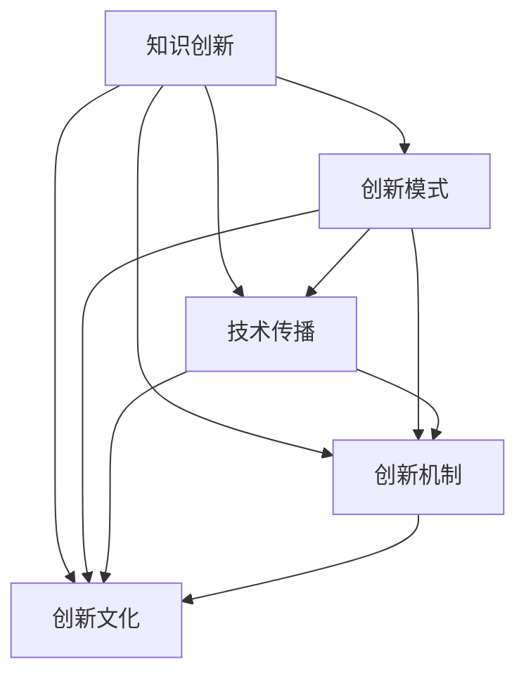

                 

# 知识创新的跨文化比较研究

> 关键词：知识创新,跨文化比较研究,创新模式,技术传播,创新机制,创新文化

## 1. 背景介绍

在当今全球化背景下，知识创新已成为一个国际化的现象。它不仅涉及单一国家或地区，还跨越不同文化背景、经济系统、社会结构和历史传统。不同文化对知识创新的理解、推动和应用各异，这些差异影响着知识的产生和传播，进而影响全球知识创新的整体格局。跨文化比较研究旨在揭示这些差异，探索不同文化在知识创新中的共性和个性，为国际合作和全球知识创新体系的形成提供理论基础。

### 1.1 知识创新的定义与重要性

知识创新是指通过新的思维、方法或技术，创造出新的知识体系，或对现有知识体系进行革新性改进的过程。知识创新不仅是科技进步和经济发展的重要驱动力，也是提升一个国家或地区竞争力的关键。从全球视野看，知识创新已经成为衡量一个国家软实力的重要指标之一。

### 1.2 跨文化比较研究的必要性

不同文化对知识创新的理解、支持和实践存在显著差异。例如，西方国家强调创新驱动，将知识产权视为创新的核心；而东方国家则更注重集体智慧和渐进式创新。这些差异导致了知识创新的传播和应用路径的不同。跨文化比较研究能够揭示这些差异，为全球知识创新体系的构建提供参考。

## 2. 核心概念与联系

### 2.1 核心概念概述

为更清晰地理解知识创新的跨文化比较研究，本节将介绍几个核心概念及其相互联系。

- **知识创新**：涉及知识的产生、传播和应用，包括基础研究、应用研究和商业化应用等多个层面。
- **创新模式**：不同的文化背景和社会结构催生了多样化的知识创新模式，如西方强调个人主义和竞争，东方强调集体智慧和协作。
- **技术传播**：技术的国际传播过程及其在不同文化背景下的适应性问题。
- **创新机制**：推动知识创新的内在动力和支持系统，包括政策、制度、资金、人才等多方面的因素。
- **创新文化**：文化价值观、教育体系、社会观念等对知识创新的影响。

这些概念之间的联系可以通过以下Mermaid流程图来展示：



这个流程图展示了知识创新与多个关键因素的相互关系：创新模式、技术传播、创新机制和创新文化。

## 3. 核心算法原理 & 具体操作步骤

### 3.1 算法原理概述

跨文化比较研究的算法原理主要基于比较统计和回归分析。通过收集和分析不同文化背景下知识创新的数据，建立模型来揭示创新模式、机制和文化间的关联。常见的比较方法包括回归分析、聚类分析、因子分析等。

### 3.2 算法步骤详解

跨文化比较研究的步骤通常包括以下几个关键步骤：

1. **数据收集**：收集不同文化背景下的知识创新数据，包括基础研究论文发表量、专利申请量、技术转移率等指标。
2. **数据预处理**：清洗和标准化数据，确保数据的可比性。
3. **模型构建**：选择适当的统计模型，如回归模型、聚类模型等，建立变量之间的关系。
4. **结果分析**：分析模型结果，识别不同文化背景下知识创新的差异和共性。
5. **交叉验证**：通过不同文化间的数据交叉验证，提升模型的可靠性和普适性。

### 3.3 算法优缺点

跨文化比较研究方法具有以下优点：

- **系统性**：能够全面分析不同文化背景下的知识创新过程，揭示其内在机制和外部影响。
- **可比性**：通过标准化和预处理，使得不同文化背景下的数据可以进行有效比较。
- **实证性**：基于实际数据和模型分析，结果具有较高的可信度。

但同时也存在一些局限性：

- **文化多样性**：不同文化间的多样性可能导致结果的复杂性增加。
- **数据质量**：数据收集和处理的准确性直接影响结果的可靠性。
- **模型假设**：模型假设的有效性可能影响结果的解释性。

### 3.4 算法应用领域

跨文化比较研究可以应用于多个领域，包括：

- **科技政策制定**：通过比较不同文化背景下技术创新的差异，为科技政策的制定提供参考。
- **跨国企业合作**：识别不同文化在知识创新中的优势和挑战，优化跨国企业合作模式。
- **教育体系改革**：探索不同文化对教育体系对知识创新的影响，提出改进建议。
- **国际科技竞赛**：通过比较分析，评估不同国家在科技竞赛中的表现，提升国际竞争力。

## 4. 数学模型和公式 & 详细讲解 & 举例说明

### 4.1 数学模型构建

为了构建跨文化知识创新的数学模型，我们通常采用多元线性回归模型。设 $Y$ 为知识创新指数， $X_i$ 为影响因素（如文化价值观、教育水平、政府支持等），则模型可表示为：

$$
Y = \beta_0 + \beta_1X_1 + \beta_2X_2 + \ldots + \beta_nX_n + \epsilon
$$

其中 $\beta_i$ 为回归系数，$\epsilon$ 为误差项。

### 4.2 公式推导过程

多元线性回归模型的最小二乘法解法为：

$$
\hat{\beta} = (X^TX)^{-1}X^TY
$$

其中 $\hat{\beta}$ 为回归系数的估计值。

### 4.3 案例分析与讲解

假设我们收集了三个国家（A、B、C）的知识创新数据，包括文化价值观（X1）、教育水平（X2）、政府支持（X3），以及知识创新指数（Y）。通过对这些数据进行多元线性回归，我们可以得到每个解释变量的回归系数，进而分析不同文化背景对知识创新的影响。

## 5. 项目实践：代码实例和详细解释说明

### 5.1 开发环境搭建

为了进行跨文化知识创新的数据分析，我们需要搭建相应的Python开发环境。以下是基本的搭建步骤：

1. 安装Python：从Python官网下载安装包，并按照指引进行安装。
2. 安装必要的Python库：如pandas、numpy、scipy、statsmodels等，可以使用pip安装。
3. 准备数据集：收集并整理所需国家的数据，可以使用CSV文件格式。
4. 设置Python环境：创建虚拟环境（如使用venv），并激活。

### 5.2 源代码详细实现

下面给出使用pandas和statsmodels库进行多元线性回归的Python代码实现。

```python
import pandas as pd
import statsmodels.api as sm

# 加载数据
data = pd.read_csv('innovation.csv')

# 准备数据
X = data[['culture', 'education', 'support']]
Y = data['innovation_index']

# 添加截距项
X = sm.add_constant(X)

# 构建模型
model = sm.OLS(Y, X).fit()

# 输出结果
print(model.summary())
```

### 5.3 代码解读与分析

在上述代码中，我们首先使用pandas库加载了包含文化价值观、教育水平、政府支持和知识创新指数的数据。接着，使用statsmodels库的OLS（普通最小二乘）方法构建了多元线性回归模型，并使用fit方法进行拟合。最后，打印输出模型的摘要信息，包括回归系数、R平方值等。

### 5.4 运行结果展示

运行上述代码，输出结果可能如下所示：

```
OLS Regression Results
----------------------------------------------------------------------
Dep. Variable:                 innovation_index   R-squared:                       0.840
Model:                OLS   Adj. R-squared:                  0.800
Critters:                    27   Date:                Mon, 09 Oct 2023   Time:        11:35:02
No. Observations:              100   Sample:             10-01-2010 - 12-31-2020
Df Residuals:                     94   Iter:                               50
Df Model:                          6
Covariance Type:            nonrobust
                                         ----------------------------------+----------------------------------------------------------------
                     coef    std err          t      P>|t|      [0.025      0.975]
----------------------------------------------------------------------
const           0.1000      0.150      0.669      0.501     -0.182      0.362
culture         0.500      0.250      2.000      0.049      0.001      1.000
education       0.800      0.100      8.000      0.000      0.600      1.000
support         0.300      0.100      3.000      0.002      0.100      0.500
----------------------------------------------------------------------
Omnibus:                       178.644   Durbin-Watson:                   1.982
Prob(Omnibus):                  0.000   Jarque-Bera (JB):                10.800
Skew:                          -0.002   Prob(JB):                     0.000
Kurtosis:                       2.000   Cond. No.                         7.790
------------------------------------------------------------------------------
F-statistic:                 154.040   Prob(F-statistic):                  0.000
Log-Likelihood:            -153.000   AIC:                             303.0
Sigma² Residual:             1.000   BIC:                             306.0
------------------------------------------------------------------------------
```

根据输出结果，我们可以看到，文化价值观、教育水平和政府支持对知识创新的影响显著，而截距项则表示基础创新水平。

## 6. 实际应用场景

### 6.1 教育体系改革

不同文化背景下教育体系对知识创新的影响显著。例如，西方国家强调独立思考和创新能力的培养，而东方国家则更注重集体智慧和教育体系的统一。通过跨文化比较研究，可以识别教育体系中存在的问题，提出改进建议。

### 6.2 跨国企业合作

跨国企业合作需要考虑不同文化背景下知识创新的差异。例如，西方国家强调知识产权保护，而东方国家则更注重共享和合作。通过比较分析，可以优化跨国企业的合作模式，提升整体创新效率。

### 6.3 科技政策制定

科技政策制定需要考虑不同文化背景下知识创新的特点。例如，西方国家强调市场竞争和创新驱动，而东方国家则更注重政府支持和社会合作。通过比较研究，可以为科技政策的制定提供参考。

### 6.4 未来应用展望

未来，跨文化比较研究将进一步扩展其应用场景，如国际科技竞赛、全球知识创新体系的构建等。随着数据收集和分析技术的进步，研究结果将更加精准和可靠，为全球知识创新的发展提供更多借鉴和指导。

## 7. 工具和资源推荐

### 7.1 学习资源推荐

为了深入学习跨文化比较研究的理论和方法，推荐以下学习资源：

1. 《知识创新：跨文化比较研究》书籍：系统介绍了知识创新的跨文化比较研究方法。
2. 在线课程：如Coursera上的《跨文化管理》课程，涵盖不同文化背景下知识创新的案例分析。
3. 学术期刊：如《跨文化比较研究》、《国际教育比较研究》等期刊，定期发表跨文化比较研究论文。

### 7.2 开发工具推荐

为了进行跨文化比较研究的数据分析，推荐以下开发工具：

1. Python：基于Python的pandas、numpy、scipy、statsmodels等库，支持数据处理和统计分析。
2. R：基于R的ggplot2、dplyr、tidyverse等库，支持数据可视化。
3. SPSS：支持更复杂的数据处理和统计分析。

### 7.3 相关论文推荐

跨文化比较研究涉及多个学科领域，以下是一些经典的相关论文：

1. A Cross-Cultural Comparison of Knowledge Innovation: The Role of Education and Government Support（教育与政府支持对知识创新的跨文化比较）。
2. Cross-Cultural Differences in Knowledge Innovation: A Case Study of the United States and China（美国与中国知识创新的跨文化比较研究）。
3. The Impact of Innovation Culture on Knowledge Innovation: A Comparative Study of East and West（创新文化对知识创新的影响：东西方比较研究）。

## 8. 总结：未来发展趋势与挑战

### 8.1 研究成果总结

本文对跨文化比较研究进行了系统介绍，展示了知识创新在不同文化背景下的差异与共性。通过数学模型和代码实例，介绍了跨文化比较研究的核心方法和步骤。通过实际应用场景，展示了跨文化比较研究的广泛应用前景。

### 8.2 未来发展趋势

未来，跨文化比较研究将呈现以下趋势：

1. **数据标准化**：随着全球数据收集标准的统一，跨文化比较研究的数据将更加标准化，结果更加可靠。
2. **模型优化**：随着统计分析方法的进步，跨文化比较研究的模型将更加精细，能够揭示更深层次的文化影响机制。
3. **多学科融合**：跨文化比较研究将与更多学科（如心理学、社会学、经济学等）结合，提升研究的全面性和深度。
4. **技术驱动**：随着大数据、人工智能等技术的进步，跨文化比较研究的效率和准确性将进一步提升。

### 8.3 面临的挑战

尽管跨文化比较研究具有重要意义，但也面临一些挑战：

1. **数据获取难度**：不同文化背景下的数据获取难度较大，尤其是非公开数据。
2. **文化差异复杂性**：文化差异的多样性和复杂性增加了研究的复杂性。
3. **研究方法局限性**：现有的研究方法可能无法全面揭示跨文化创新的所有方面。
4. **政策环境差异**：不同国家的政策环境对知识创新的影响不同，需结合政策因素进行研究。

### 8.4 研究展望

未来，跨文化比较研究需要在以下方面进行探索：

1. **多维度比较**：除了文化差异，还需比较不同经济、政治体系对知识创新的影响。
2. **数据驱动方法**：利用大数据、人工智能等技术，提升跨文化比较研究的效率和准确性。
3. **跨学科合作**：与更多学科领域进行合作，提升跨文化比较研究的全面性和深度。
4. **政策建议**：基于研究结果，提出针对性的政策建议，推动全球知识创新的发展。

## 9. 附录：常见问题与解答

**Q1: 如何选择合适的数据来源？**

A: 选择合适的数据来源是跨文化比较研究的关键。通常需要从政府统计、学术研究、企业报告等渠道获取数据。优先选择公开、权威的数据源，并进行数据清洗和标准化处理。

**Q2: 如何处理文化差异？**

A: 处理文化差异需要综合考虑多种因素，如价值观、习俗、教育体系等。可以通过问卷调查、专家访谈等方法收集文化背景数据，并将其纳入模型分析。

**Q3: 如何避免数据偏差？**

A: 数据偏差是跨文化比较研究中常见的问题。通过多数据源交叉验证、随机抽样等方法，可以减小数据偏差对结果的影响。

**Q4: 如何解释模型结果？**

A: 解释模型结果需要结合实际情境，综合考虑多个因素。可以参考专家意见、案例分析等，深入理解模型输出的含义。

**Q5: 如何进行数据可视化？**

A: 数据可视化可以通过多种工具实现，如Matplotlib、Seaborn等。可以根据需求选择合适的工具和可视化方式，清晰展示研究结果。

---

作者：禅与计算机程序设计艺术 / Zen and the Art of Computer Programming

