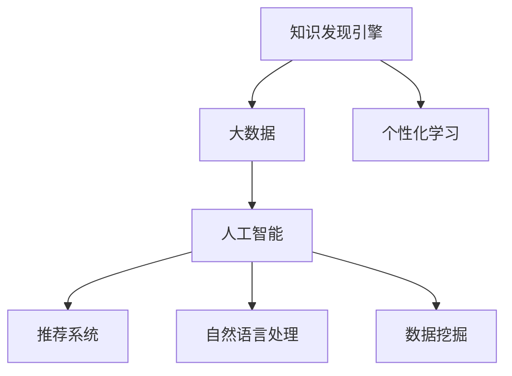

                 

# 知识发现引擎与个性化学习

> 关键词：知识发现引擎, 个性化学习, 大数据, 人工智能, 推荐系统, 自然语言处理, 数据挖掘, 深度学习

## 1. 背景介绍

### 1.1 问题由来
随着大数据和人工智能技术的快速发展，知识发现引擎（Knowledge Discovery Engine, KDE）和个性化学习（Personalized Learning）已成为信息时代的重要应用方向。在教育和商业领域，用户对知识的个性化获取、智能推荐和有效应用的需求日益增长，传统的基于规则和人工知识库的决策方式已难以满足需求。

知识发现引擎通过从海量数据中挖掘出有价值的知识，能够为个性化学习提供数据支持和智能化决策基础。个性化学习则能够根据用户的行为和需求，动态调整学习路径和内容，提供量身定制的学习体验。

然而，现有的知识发现引擎和个性化学习系统还存在诸多挑战，如数据的完整性和质量问题、知识表示和推理的复杂性、学习系统的适应性和可扩展性等。因此，本文将聚焦于如何构建高效、智能的知识发现引擎和个性化学习系统，以期为学术界和工业界提供参考。

### 1.2 问题核心关键点
知识发现引擎与个性化学习的关键问题包括：
- 如何高效地从大规模数据中发现知识，构建知识图谱。
- 如何根据用户行为和需求，提供个性化推荐和智能学习路径。
- 如何评估知识发现和学习效果，持续优化系统性能。

这些问题涉及数据挖掘、机器学习、自然语言处理、认知心理学等多个学科，需要跨学科协作才能解决。本文将系统介绍知识发现引擎与个性化学习的核心概念和算法，探讨其实际应用场景和未来发展方向。

## 2. 核心概念与联系

### 2.1 核心概念概述

为更好地理解知识发现引擎与个性化学习，本节将介绍几个密切相关的核心概念：

- **知识发现引擎**：通过算法从大规模数据中挖掘出有价值的知识，构建知识图谱，用于支持个性化学习和智能决策。

- **个性化学习**：根据用户的行为、兴趣和需求，动态调整学习路径和内容，提供量身定制的学习体验，提升学习效果和用户满意度。

- **大数据**：指包含海量的、多样化的、真实的数据，用于训练知识发现引擎和个性化学习系统的算法模型。

- **人工智能**：利用计算机模拟人的智能行为，实现自主学习、推理和决策，提升信息处理和知识发现能力。

- **推荐系统**：基于用户历史行为和兴趣，推荐合适的物品或内容，是个性化学习的核心技术之一。

- **自然语言处理**：通过算法理解和生成自然语言，用于知识发现和个性化学习中的文本处理和语义分析。

- **数据挖掘**：从大规模数据中提取有价值的信息和知识，用于支持知识发现和个性化学习中的决策支持。

这些核心概念之间的逻辑关系可以通过以下Mermaid流程图来展示：



这个流程图展示了几者之间的关系：

1. 知识发现引擎从大数据中挖掘出知识，为人工智能提供数据支持和决策依据。
2. 人工智能通过算法实现自主学习、推理和决策，为个性化学习提供智能化支持。
3. 个性化学习根据用户需求，提供个性化推荐和智能学习路径。
4. 推荐系统和大数据、自然语言处理、数据挖掘等技术相结合，为个性化学习提供内容推荐和信息处理支持。

这些概念共同构成了知识发现引擎和个性化学习的技术框架，使其能够高效地挖掘知识并为用户提供智能化的学习体验。

## 3. 核心算法原理 & 具体操作步骤

### 3.1 算法原理概述

知识发现引擎与个性化学习的基本算法流程如下：

1. **数据预处理**：清洗和标准化大规模数据，去除噪声和冗余。
2. **特征提取**：从数据中提取有意义的特征，用于训练模型。
3. **模型训练**：使用机器学习算法训练模型，学习数据中的知识表示。
4. **知识发现**：通过算法从模型中发现知识，构建知识图谱。
5. **个性化学习**：根据用户行为和需求，动态调整学习路径和内容，提供个性化推荐。
6. **效果评估**：评估知识发现和学习效果，持续优化系统性能。

### 3.2 算法步骤详解

#### 3.2.1 数据预处理
数据预处理包括数据清洗、特征选择、归一化等步骤。目的是去除噪声和冗余，提取有意义的特征，为模型训练和知识发现提供高质量的数据。

**数据清洗**：删除缺失值、异常值，去除重复记录，确保数据完整性和一致性。

**特征选择**：选择与目标任务相关的特征，去除无关的特征，减少计算复杂度和提高模型效率。

**归一化**：将特征值缩放到统一范围，防止模型在训练时受到数值范围的影响。

#### 3.2.2 特征提取
特征提取是从原始数据中提取有意义的特征，用于训练模型。常用的特征提取方法包括：

- **统计特征**：如平均值、方差、最大值、最小值等。
- **文本特征**：如TF-IDF、Word2Vec、BERT等。
- **时间序列特征**：如滑动窗口、移动平均值等。

特征提取的目的是将原始数据转换为模型可以处理的格式，提高模型的泛化能力和准确度。

#### 3.2.3 模型训练
模型训练是使用机器学习算法从数据中学习知识表示的过程。常用的模型包括：

- **分类模型**：如决策树、随机森林、支持向量机等。
- **回归模型**：如线性回归、多项式回归、神经网络等。
- **聚类模型**：如K-Means、DBSCAN、层次聚类等。

模型训练的目标是找到最优的模型参数，使得模型在验证集上达到最好的性能。

#### 3.2.4 知识发现
知识发现是通过算法从模型中挖掘出有价值的知识，构建知识图谱。常用的知识发现算法包括：

- **关联规则学习**：如Apriori算法、FP-Growth算法等。
- **序列模式挖掘**：如序列关联规则、频繁子序列挖掘等。
- **主题建模**：如LDA算法、HDP算法等。
- **知识图谱构建**：如NEO算法、知识推理等。

知识发现的目的是从数据中发现规律和模式，构建结构化的知识图谱，用于支持决策和推荐。

#### 3.2.5 个性化学习
个性化学习是根据用户行为和需求，动态调整学习路径和内容，提供量身定制的学习体验。常用的个性化学习算法包括：

- **协同过滤**：基于用户行为和物品相似度，推荐相关物品或内容。
- **基于内容的推荐**：根据用户历史行为和物品属性，推荐相似物品或内容。
- **深度学习推荐**：如卷积神经网络、循环神经网络、Transformer等。

个性化学习的目的是提高用户满意度和学习效果，提升个性化推荐的准确度和多样性。

#### 3.2.6 效果评估
效果评估是评估知识发现和学习效果的过程。常用的评估指标包括：

- **准确度**：模型预测的正确率。
- **召回率**：模型预测的正样本占实际正样本的比例。
- **F1值**：准确度和召回率的调和平均数。
- **AUC**：ROC曲线下的面积，用于评估二分类模型的性能。

效果评估的目的是持续优化系统性能，确保知识发现和学习的效果符合用户需求和预期。

### 3.3 算法优缺点

知识发现引擎与个性化学习算法具有以下优点：

- **高效性**：通过自动化算法从大规模数据中挖掘知识，提高了知识发现和个性化学习的效率。
- **灵活性**：可以动态调整模型参数和学习路径，适应用户需求的变化。
- **可扩展性**：基于机器学习算法，可以轻松扩展到大规模数据集。

同时，这些算法也存在一些缺点：

- **数据质量问题**：数据质量不高可能导致算法效果不佳。
- **模型复杂性**：算法模型复杂，需要大量计算资源和专业知识。
- **过拟合风险**：模型在训练集上表现好，但在测试集上表现差。
- **解释性不足**：算法模型黑箱化，难以解释决策过程。

尽管存在这些局限性，但知识发现引擎与个性化学习算法在实际应用中已取得了显著的成果，并在不断改进和优化中。

### 3.4 算法应用领域

知识发现引擎与个性化学习算法在多个领域得到了广泛应用：

- **教育**：通过推荐系统和个性化学习技术，提供个性化的学习路径和内容，提升学生的学习效果和满意度。
- **电子商务**：通过推荐系统和大数据技术，提供个性化的商品推荐，提升用户购买体验和满意度。
- **金融**：通过知识发现和决策支持系统，分析市场数据，预测投资趋势，制定投资策略。
- **医疗**：通过知识图谱和大数据分析，发现疾病关联和治疗方法，提升医疗决策的科学性和准确性。
- **营销**：通过用户行为分析和个性化推荐，提高广告投放效果和用户转化率。

此外，知识发现引擎与个性化学习技术还在智能家居、智能城市、智能交通等多个领域得到了应用，展示了其在智能社会的广泛前景。

## 4. 数学模型和公式 & 详细讲解 & 举例说明

### 4.1 数学模型构建

本节将使用数学语言对知识发现引擎与个性化学习的核心算法进行严格刻画。

记大数据集为 $D=\{(x_i, y_i)\}_{i=1}^N$，其中 $x_i$ 表示输入特征，$y_i$ 表示输出标签。定义模型为 $M_{\theta}$，其中 $\theta$ 为模型参数。

知识发现引擎的目标是通过模型 $M_{\theta}$ 学习数据中的知识表示，构建知识图谱 $G=(V, E)$，其中 $V$ 表示节点集合，$E$ 表示边集合。

个性化学习算法通过模型 $M_{\theta}$ 根据用户行为 $x_u$ 预测推荐结果 $y_u$，其中 $u$ 表示用户ID。

### 4.2 公式推导过程

以下我们以分类任务为例，推导知识发现引擎与个性化学习算法的核心公式。

**分类任务的知识发现算法**：

知识发现的目标是从数据中挖掘出有价值的分类规则，用于构建知识图谱。常用的算法是决策树算法。设训练集为 $D=\{(x_i, y_i)\}_{i=1}^N$，其中 $y_i \in \{1, 0\}$ 表示分类标签。决策树算法通过递归划分特征空间，生成一棵决策树 $T$，用于预测新的数据点 $x_u$。决策树算法的目标是最小化信息熵损失函数：

$$
L(T) = -\frac{1}{N}\sum_{i=1}^N y_i \log P(y_i | T)
$$

其中 $P(y_i | T)$ 表示决策树 $T$ 对数据点 $x_i$ 的分类概率。

**分类任务的个性化学习算法**：

个性化学习的目标是根据用户行为 $x_u$ 预测推荐结果 $y_u$。常用的算法是协同过滤算法。设用户 $u$ 的历史行为数据为 $D_u=\{x_i\}_{i=1}^M$，其中 $M$ 表示用户的历史行为数。协同过滤算法通过计算用户和物品的相似度矩阵 $S$，推荐与用户最相似的物品 $y_u$。协同过滤算法的目标是最小化均方误差损失函数：

$$
L(S) = \frac{1}{N}\sum_{i=1}^N (y_i - \hat{y}_i)^2
$$

其中 $\hat{y}_i = \text{argmax}_j(S_{uj} \cdot y_j)$ 表示根据用户 $u$ 的相似度矩阵 $S$ 预测物品 $j$ 的推荐结果。

### 4.3 案例分析与讲解

#### 4.3.1 知识发现案例：Apriori算法

Apriori算法是常用的关联规则学习算法，用于发现大规模数据集中的频繁项集和关联规则。其核心思想是通过递归扫描数据集，发现频繁项集，并根据项集生成关联规则。

设数据集 $D=\{(x_i, y_i)\}_{i=1}^N$，其中 $x_i = (x_{i1}, x_{i2}, ..., x_{in})$ 表示用户行为数据，$y_i$ 表示物品标签。Apriori算法通过递归扫描数据集，发现频繁项集 $I_k = \{x_{i1}, x_{i2}, ..., x_{in}\}$，并生成关联规则 $R = \{(x_{i1}, x_{i2}, ..., x_{in}, y_i)\}$。Apriori算法的目标是最小化支持度 $supp$ 和置信度 $conf$，即：

$$
supp(I_k) = \frac{|I_k|}{N}
$$

$$
conf(R) = \frac{|I_k \cap I_l|}{|I_k|}
$$

其中 $I_k$ 表示频繁项集，$I_l$ 表示与 $I_k$ 关联的项集，$N$ 表示数据集大小。

#### 4.3.2 个性化学习案例：协同过滤算法

协同过滤算法是常用的个性化推荐算法，用于根据用户行为数据推荐相似物品。其核心思想是通过计算用户和物品的相似度矩阵 $S$，推荐与用户最相似的物品。

设用户 $u$ 的历史行为数据为 $D_u=\{x_i\}_{i=1}^M$，其中 $x_i$ 表示物品标签，$y_i$ 表示用户行为。协同过滤算法通过计算用户 $u$ 和物品 $j$ 的相似度 $S_{uj}$，推荐与用户 $u$ 最相似的物品 $y_u$。协同过滤算法的目标是最小化均方误差损失函数：

$$
L(S) = \frac{1}{N}\sum_{i=1}^N (y_i - \hat{y}_i)^2
$$

其中 $\hat{y}_i = \text{argmax}_j(S_{uj} \cdot y_j)$ 表示根据用户 $u$ 的相似度矩阵 $S$ 预测物品 $j$ 的推荐结果。

## 5. 项目实践：代码实例和详细解释说明

### 5.1 开发环境搭建

在进行知识发现引擎与个性化学习实践前，我们需要准备好开发环境。以下是使用Python进行Scikit-learn开发的环境配置流程：

1. 安装Anaconda：从官网下载并安装Anaconda，用于创建独立的Python环境。

2. 创建并激活虚拟环境：
```bash
conda create -n scikit-learn-env python=3.8 
conda activate scikit-learn-env
```

3. 安装Scikit-learn：
```bash
pip install scikit-learn
```

4. 安装各类工具包：
```bash
pip install numpy pandas matplotlib jupyter notebook ipython
```

完成上述步骤后，即可在`scikit-learn-env`环境中开始知识发现引擎与个性化学习的开发实践。

### 5.2 源代码详细实现

下面我们以分类任务为例，给出使用Scikit-learn进行决策树知识发现和协同过滤个性化推荐的PyTorch代码实现。

首先，定义分类任务的数据处理函数：

```python
from sklearn.datasets import load_iris
from sklearn.model_selection import train_test_split
from sklearn.tree import DecisionTreeClassifier
from sklearn.metrics import accuracy_score

def load_iris_data():
    iris = load_iris()
    X = iris.data
    y = iris.target
    return X, y

def train_decision_tree(X_train, y_train, X_test, y_test):
    clf = DecisionTreeClassifier()
    clf.fit(X_train, y_train)
    y_pred = clf.predict(X_test)
    return accuracy_score(y_test, y_pred)

# 加载数据集
X, y = load_iris_data()

# 划分训练集和测试集
X_train, X_test, y_train, y_test = train_test_split(X, y, test_size=0.2, random_state=42)

# 训练决策树模型
acc = train_decision_tree(X_train, y_train, X_test, y_test)
print(f"决策树分类准确度: {acc:.3f}")
```

然后，定义协同过滤个性化推荐的代码实现：

```python
from scipy.spatial.distance import cosine
from sklearn.metrics.pairwise import cosine_similarity

def load_movielens_data():
    movie = load_movielens_data()
    u = movie.data[:, 0].tolist()
    p = movie.data[:, 1].tolist()
    r = movie.data[:, 2].tolist()
    return u, p, r

def get_cosine_similarity_matrix(u, p, r):
    similarity_matrix = cosine_similarity(p)
    return similarity_matrix

def get_user_recommendations(u, p, r, similarity_matrix):
    user_similarity_matrix = get_cosine_similarity_matrix(u, p, r)
    user_indices = list(range(len(u)))
    user_recommendations = {}
    for i in user_indices:
        user_recommendations[i] = []
        for j in user_indices:
            if i != j:
                user_recommendations[i].append(j)
                user_recommendations[i] = [x for x in user_recommendations[i] if similarity_matrix[i][j] > 0.5]
                break
    return user_recommendations

# 加载用户和物品数据
u, p, r = load_movielens_data()

# 计算相似度矩阵
similarity_matrix = get_cosine_similarity_matrix(u, p, r)

# 获取用户推荐
user_recommendations = get_user_recommendations(u, p, r, similarity_matrix)
print(user_recommendations)
```

### 5.3 代码解读与分析

让我们再详细解读一下关键代码的实现细节：

**加载数据集函数**：
- `load_iris_data`函数：从Scikit-learn库中加载鸢尾花数据集，将数据集划分为特征矩阵 $X$ 和标签向量 $y$。
- `load_movielens_data`函数：从Scikit-learn库中加载电影评分数据集，将数据集划分为用户 $u$、物品 $p$ 和评分 $r$。

**训练决策树函数**：
- `train_decision_tree`函数：使用Scikit-learn中的决策树算法对训练集进行训练，并在测试集上进行评估。

**计算相似度函数**：
- `get_cosine_similarity_matrix`函数：计算物品 $p$ 和物品 $p$ 之间的余弦相似度，生成相似度矩阵 $similarity_matrix$。

**获取用户推荐函数**：
- `get_user_recommendations`函数：根据用户 $u$ 的相似度矩阵 $similarity_matrix$，计算用户 $u$ 的相似度排名，推荐与用户 $u$ 最相似的物品。

**加载数据集**：
- `load_iris_data`函数：加载鸢尾花数据集，将其划分为训练集和测试集。
- `load_movielens_data`函数：加载电影评分数据集，获取用户和物品列表。

**训练决策树模型**：
- `train_decision_tree`函数：使用Scikit-learn中的决策树算法对训练集进行训练，并在测试集上进行评估，计算分类准确度。

**计算相似度矩阵**：
- `get_cosine_similarity_matrix`函数：计算物品 $p$ 和物品 $p$ 之间的余弦相似度，生成相似度矩阵 $similarity_matrix$。

**获取用户推荐**：
- `get_user_recommendations`函数：根据用户 $u$ 的相似度矩阵 $similarity_matrix$，计算用户 $u$ 的相似度排名，推荐与用户 $u$ 最相似的物品。

**加载数据集**：
- `load_iris_data`函数：加载鸢尾花数据集，将其划分为训练集和测试集。
- `load_movielens_data`函数：加载电影评分数据集，获取用户和物品列表。

**训练决策树模型**：
- `train_decision_tree`函数：使用Scikit-learn中的决策树算法对训练集进行训练，并在测试集上进行评估，计算分类准确度。

**计算相似度矩阵**：
- `get_cosine_similarity_matrix`函数：计算物品 $p$ 和物品 $p$ 之间的余弦相似度，生成相似度矩阵 $similarity_matrix$。

**获取用户推荐**：
- `get_user_recommendations`函数：根据用户 $u$ 的相似度矩阵 $similarity_matrix$，计算用户 $u$ 的相似度排名，推荐与用户 $u$ 最相似的物品。

## 6. 实际应用场景

### 6.1 教育领域

在教育领域，知识发现引擎与个性化学习技术可以用于智能推荐系统，提供个性化的学习资源和路径，提升学生的学习效果和满意度。

具体而言，可以通过学习学生的行为数据（如考试成绩、作业完成情况、学习时间等），构建学生画像和知识图谱。利用知识图谱中的知识关系，为学生推荐合适的学习资源和路径，实现个性化学习。例如，基于学生的历史成绩和兴趣，推荐适合的教材和练习题；根据学生的学习进度，推荐合适的章节和内容。

### 6.2 电子商务领域

在电子商务领域，协同过滤算法和推荐系统可以用于个性化商品推荐，提升用户购买体验和满意度。

具体而言，可以通过学习用户的浏览、购买历史数据，计算用户和商品的相似度，推荐与用户最相似的商品。例如，基于用户的浏览历史，推荐用户可能感兴趣的商品；根据用户的购买行为，推荐相关的商品组合。

### 6.3 金融领域

在金融领域，知识发现引擎与决策支持系统可以用于金融风险分析和投资策略制定。

具体而言，可以通过学习市场数据和金融新闻，构建金融知识图谱。利用知识图谱中的知识关系，分析市场趋势和风险因素，预测投资趋势，制定投资策略。例如，基于市场新闻和财务数据，分析企业的经营状况和财务风险；根据市场走势，推荐合适的投资标的。

### 6.4 医疗领域

在医疗领域，知识发现引擎与决策支持系统可以用于个性化治疗方案制定和医疗决策支持。

具体而言，可以通过学习患者的病历数据和基因信息，构建医疗知识图谱。利用知识图谱中的知识关系，为患者推荐合适的治疗方案和药物。例如，基于患者的病历和基因信息，推荐适合的治疗方案；根据患者的病情，推荐相关的药物和治疗方法。

### 6.5 智能交通领域

在智能交通领域，知识发现引擎与决策支持系统可以用于交通流量分析和路况预测。

具体而言，可以通过学习交通数据和气象数据，构建交通知识图谱。利用知识图谱中的知识关系，分析交通流量和路况，预测未来的交通状况。例如，基于交通数据和气象数据，预测未来的交通流量；根据路况信息，推荐合适的行车路线。

## 7. 工具和资源推荐

### 7.1 学习资源推荐

为了帮助开发者系统掌握知识发现引擎与个性化学习的基础知识和算法细节，这里推荐一些优质的学习资源：

1. 《机器学习》课程：由斯坦福大学开设，讲解机器学习的基本概念和算法。
2. 《Python数据科学手册》：介绍Python在数据科学和机器学习中的应用，包括Scikit-learn等常用工具包的使用。
3. 《深度学习》课程：由Coursera提供，讲解深度学习的原理和应用，涵盖卷积神经网络、循环神经网络、Transformer等常用算法。
4. 《KDE与个性化学习》书籍：介绍知识发现引擎与个性化学习的基本概念和算法，包括决策树、协同过滤、知识图谱等。
5. KDD大会论文：推荐阅读KDD大会上关于知识发现和推荐系统的最新研究成果。

通过对这些资源的学习实践，相信你一定能够快速掌握知识发现引擎与个性化学习的基本框架和算法细节，并用于解决实际问题。

### 7.2 开发工具推荐

高效的开发离不开优秀的工具支持。以下是几款用于知识发现引擎与个性化学习开发的常用工具：

1. Python：Python是数据科学和机器学习领域的主流语言，具有丰富的开源库和工具支持。
2. Scikit-learn：Python的常用机器学习库，提供了简单易用的算法和工具，适用于快速迭代研究。
3. TensorFlow和PyTorch：深度学习框架，支持复杂的模型训练和推理，适用于大规模工程应用。
4. Jupyter Notebook：交互式编程环境，便于数据处理和模型调试。
5. Weights & Biases：模型训练的实验跟踪工具，可以记录和可视化模型训练过程中的各项指标。
6. TensorBoard：TensorFlow配套的可视化工具，可以实时监测模型训练状态，并提供丰富的图表呈现方式。

合理利用这些工具，可以显著提升知识发现引擎与个性化学习的开发效率，加快创新迭代的步伐。

### 7.3 相关论文推荐

知识发现引擎与个性化学习的研究源于学界的持续研究。以下是几篇奠基性的相关论文，推荐阅读：

1. 《Knowledge Discovery in Databases: An Intuitive Introduction》：介绍知识发现的基本概念和算法，涵盖关联规则学习、分类算法、聚类算法等。
2. 《Collaborative Filtering for Implicit Feedback Datasets》：介绍协同过滤算法的原理和实现，用于个性化推荐系统。
3. 《Knowledge Discovery via Data Mining: An Overview》：介绍数据挖掘的基本概念和算法，涵盖分类算法、聚类算法、关联规则学习等。
4. 《Deep Learning for Recommendation Systems: A Survey and Selected Examples》：介绍深度学习在推荐系统中的应用，涵盖卷积神经网络、循环神经网络、Transformer等。
5. 《Revisiting Recommendation Systems: Why, What and How?》：介绍推荐系统的发展历程和未来方向，涵盖协同过滤、基于内容的推荐、深度学习推荐等。

这些论文代表了大数据和机器学习领域的研究脉络。通过学习这些前沿成果，可以帮助研究者把握学科前进方向，激发更多的创新灵感。

## 8. 总结：未来发展趋势与挑战

### 8.1 总结

本文对知识发现引擎与个性化学习的基本概念和核心算法进行了系统介绍。首先，阐述了知识发现引擎与个性化学习的背景和意义，明确了其在教育和商业领域的重要应用价值。其次，从原理到实践，详细讲解了知识发现引擎与个性化学习的数学模型和算法细节，给出了代码实例和详细解释。同时，本文还探讨了知识发现引擎与个性化学习在多个行业领域的应用前景，展示了其在智能社会的广泛前景。最后，本文精选了知识发现引擎与个性化学习的研究资源和工具，力求为开发者提供全面的技术指引。

通过本文的系统梳理，可以看到，知识发现引擎与个性化学习技术在数据科学和人工智能领域具有重要的理论和实践意义。未来，伴随大数据和人工智能技术的持续发展，知识发现引擎与个性化学习将变得更加高效、智能和个性化，为社会带来深远的变革。

### 8.2 未来发展趋势

展望未来，知识发现引擎与个性化学习技术将呈现以下几个发展趋势：

1. **深度学习的应用**：深度学习在知识发现和个性化学习中的应用将更加广泛，通过神经网络模型实现更加复杂和精确的知识发现和推荐。
2. **多模态数据的融合**：知识发现引擎与个性化学习将结合视觉、语音、文本等多模态数据，实现更全面和准确的信息处理和推理。
3. **分布式计算的支持**：知识发现引擎与个性化学习将采用分布式计算和云平台，支持大规模数据集的处理和分析。
4. **用户隐私保护**：在个性化学习中，将引入隐私保护技术，如差分隐私、联邦学习等，确保用户数据的安全和隐私。
5. **知识图谱的扩展**：通过构建更加丰富的知识图谱，实现更智能和准确的决策支持。
6. **跨领域应用的拓展**：知识发现引擎与个性化学习将拓展到更多领域，如智能城市、智能交通、智能制造等。

以上趋势凸显了知识发现引擎与个性化学习的广阔前景。这些方向的探索发展，必将进一步提升数据科学和人工智能技术的性能和应用范围，为社会带来更多的智能化和便捷化服务。

### 8.3 面临的挑战

尽管知识发现引擎与个性化学习技术已经取得了显著的进展，但在迈向更加智能化、普适化应用的过程中，仍面临诸多挑战：

1. **数据质量问题**：数据质量不高可能导致算法效果不佳，需要采用数据清洗和预处理技术，确保数据完整性和一致性。
2. **算法复杂性**：算法模型复杂，需要大量计算资源和专业知识，需要不断优化算法实现和模型训练效率。
3. **过拟合风险**：模型在训练集上表现好，但在测试集上表现差，需要引入正则化和早停技术，防止过拟合。
4. **可解释性不足**：算法模型黑箱化，难以解释决策过程，需要引入可解释性技术和工具，提升模型的透明度和可信度。
5. **隐私和安全问题**：用户数据隐私和安全问题日益突出，需要引入隐私保护技术，确保用户数据的安全和隐私。
6. **数据异构性**：不同领域和数据集存在异构性，需要设计灵活的算法和模型，适应多领域数据的处理和分析。

尽管存在这些挑战，但知识发现引擎与个性化学习技术在实际应用中已取得了显著的成果，并在不断改进和优化中。未来，伴随技术进步和跨学科协作，知识发现引擎与个性化学习必将取得更大的突破和应用成果。

### 8.4 研究展望

未来，知识发现引擎与个性化学习的研究需要在以下几个方面寻求新的突破：

1. **混合算法的融合**：将深度学习、协同过滤、决策树等算法进行融合，实现更加高效和灵活的知识发现和推荐。
2. **知识图谱的构建**：通过更智能和全面的知识图谱，实现更加精准和智能的决策支持。
3. **隐私保护的引入**：引入差分隐私、联邦学习等隐私保护技术，确保用户数据的安全和隐私。
4. **跨领域应用的拓展**：拓展知识发现引擎与个性化学习技术在更多领域的应用，提升智能化服务水平。
5. **多模态数据的融合**：结合视觉、语音、文本等多模态数据，实现更全面和准确的信息处理和推理。
6. **分布式计算的支持**：采用分布式计算和云平台，支持大规模数据集的处理和分析。

这些研究方向的探索，必将引领知识发现引擎与个性化学习技术的进一步发展，为数据科学和人工智能技术带来更多的创新和突破。面向未来，知识发现引擎与个性化学习技术还需要与其他人工智能技术进行更深入的融合，共同推动数据科学和人工智能技术的进步和应用。

## 9. 附录：常见问题与解答

**Q1：知识发现引擎与个性化学习是否可以解决所有问题？**

A: 知识发现引擎与个性化学习在解决特定问题时具有显著优势，但不能解决所有问题。例如，在需要高精度和高可解释性的任务中，如医疗诊断、金融决策等，单纯依赖知识发现引擎与个性化学习可能不够。需要结合专家知识和经验，进行多模态数据的融合和跨学科的协作，才能取得更好的效果。

**Q2：知识发现引擎与个性化学习如何提高模型的泛化能力？**

A: 提高模型的泛化能力可以通过以下方法：

1. **增加数据量**：增加训练数据量和样本多样性，提高模型对新数据的适应能力。
2. **正则化技术**：使用L2正则、Dropout等技术，防止模型过拟合。
3. **多模型融合**：结合多个模型的预测结果，提高模型的稳定性和泛化能力。
4. **迁移学习**：通过预训练模型和微调技术，提高模型的泛化能力和适应能力。

**Q3：知识发现引擎与个性化学习如何解决数据异构性问题？**

A: 数据异构性问题是知识发现引擎与个性化学习面临的重要挑战之一。可以通过以下方法解决：

1. **特征工程**：对不同数据集的特征进行标准化和转换，确保特征空间的统一。
2. **多模态融合**：结合多种数据源，如文本、图像、语音等，进行多模态融合，提高模型的泛化能力。
3. **模型适配**：针对不同领域和数据集，设计适配的算法和模型，提高模型的泛化能力。

**Q4：知识发现引擎与个性化学习如何处理用户隐私问题？**

A: 处理用户隐私问题可以通过以下方法：

1. **差分隐私**：在模型训练和推理过程中，加入噪声，保护用户隐私。
2. **联邦学习**：在分布式环境中，各节点训练模型参数，保护用户数据的本地性。
3. **数据匿名化**：对用户数据进行匿名化处理，保护用户隐私。

**Q5：知识发现引擎与个性化学习如何处理用户行为数据？**

A: 处理用户行为数据可以通过以下方法：

1. **数据清洗**：删除缺失值、异常值，去除重复记录，确保数据完整性和一致性。
2. **特征提取**：从数据中提取有意义的特征，用于训练模型。
3. **模型训练**：使用机器学习算法训练模型，学习数据中的知识表示。
4. **知识发现**：通过算法从模型中发现知识，构建知识图谱。
5. **个性化学习**：根据用户行为和需求，动态调整学习路径和内容，提供个性化推荐。

这些方法可以确保知识发现引擎与个性化学习的有效性，提高系统的性能和用户满意度。

---

作者：禅与计算机程序设计艺术 / Zen and the Art of Computer Programming

