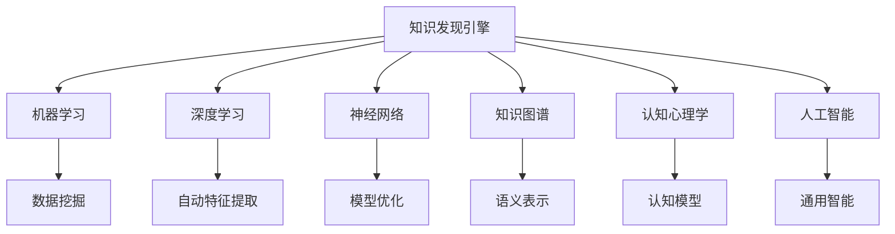

                 

# 知识发现引擎与大脑可塑性研究

> 关键词：知识发现引擎,大脑可塑性,机器学习,深度学习,神经网络,知识图谱,认知心理学,人工智能

## 1. 背景介绍

### 1.1 问题由来

知识发现引擎（Knowledge Discovery Engine, KDE）是一种基于大数据和人工智能技术的工具，旨在从海量数据中自动挖掘有价值的知识。随着互联网和数字技术的发展，人类获取和处理信息的方式发生了革命性变化。知识和信息的庞大规模和复杂性，使得传统的知识管理方式难以适应。因此，如何从大数据中高效提取有用的信息，成为了数据科学和人工智能领域的热点研究方向。

大脑的可塑性（Brain Plasticity）是指大脑在学习、适应和修复过程中对环境变化作出调整的能力。这一现象在神经科学领域得到了广泛研究，并被认为是人类学习和认知能力的重要基础。大脑的可塑性不仅仅局限于学习和记忆，还包括感觉、运动、情绪等方面，是生物进化和个体发展的重要保障。

研究知识发现引擎与大脑可塑性之间的关系，不仅有助于提升机器学习模型的表现，更可能为人类认知科学的深入研究提供新的视角和方法。通过探索知识发现和大脑学习的共性，我们有望开发出更为高效、智能的知识处理系统。

### 1.2 问题核心关键点

知识发现引擎与大脑可塑性研究的核心问题主要包括：

- 如何构建高效的知识发现引擎，使之能够从海量数据中自动识别和提取有用的信息。
- 大脑可塑性的生物学和心理学机制是什么，如何利用这一机制来优化机器学习模型的性能。
- 知识发现和大脑学习之间是否存在共性，如何将这些共性应用于知识发现引擎的优化。
- 知识发现引擎在实际应用中的效果如何，是否能够适应复杂的多模态数据结构。
- 如何在知识发现引擎中融合不同领域（如神经科学、认知心理学、人工智能等）的理论和技术，构建跨学科的知识处理系统。

## 2. 核心概念与联系

### 2.1 核心概念概述

为更好地理解知识发现引擎与大脑可塑性研究的逻辑关系，本节将介绍几个核心概念：

- 知识发现引擎（Knowledge Discovery Engine, KDE）：一种基于机器学习、深度学习等人工智能技术，自动从大数据中挖掘有用知识的系统。
- 大脑可塑性（Brain Plasticity）：指大脑在学习和适应过程中对环境变化作出调整的能力。
- 机器学习（Machine Learning, ML）：通过数据和模型训练，使计算机自动获取和利用数据的规律和知识。
- 深度学习（Deep Learning, DL）：一种特殊的机器学习范式，通过多层神经网络模拟人类大脑的计算过程。
- 神经网络（Neural Network, NN）：模仿人类神经元网络的计算模型，是深度学习的基础。
- 知识图谱（Knowledge Graph, KG）：一种语义化的知识表示方式，用于描述实体及其之间的关系。
- 认知心理学（Cognitive Psychology）：研究人类认知过程和心理结构的学科。
- 人工智能（Artificial Intelligence, AI）：使计算机能够执行通常需要人类智能的任务的科学和技术。

这些核心概念之间的逻辑关系可以通过以下Mermaid流程图来展示：



这个流程图展示了知识发现引擎的核心概念及其之间的关系：

1. 知识发现引擎以机器学习和深度学习为技术基础。
2. 通过神经网络实现自动特征提取和模型优化。
3. 利用知识图谱进行语义表示和知识推理。
4. 结合认知心理学的研究成果，提升系统性能。
5. 最终目标是构建能够模拟人类智能的通用人工智能系统。

这些概念共同构成了知识发现引擎与大脑可塑性研究的基础框架，为探索两者之间的关系提供了理论依据。

## 3. 核心算法原理 & 具体操作步骤

### 3.1 算法原理概述

知识发现引擎与大脑可塑性研究的核心算法原理，主要基于以下两个方面：

- 机器学习中的知识发现技术。通过数据驱动的方法，从大规模数据中自动提取有价值的知识模式和规律。
- 神经科学中的大脑可塑性理论。了解大脑在学习过程中的神经网络和突触变化，并将其应用于机器学习模型的设计和优化。

具体而言，知识发现引擎的研究重点在于以下几个方面：

- 数据预处理与特征工程：对原始数据进行清洗、转换、归一化等预处理步骤，提取和构造有意义的特征。
- 模型选择与训练：根据任务特点选择合适的机器学习模型，使用训练数据进行模型训练和调优。
- 知识表示与推理：将知识表示为结构化的形式，通过推理机制提取和应用这些知识。
- 评估与优化：评估模型的性能，进行参数调整和模型优化，提高知识发现的效果。

大脑可塑性研究则聚焦于以下几个方面：

- 神经元激活与突触连接：研究神经元如何在学习和记忆过程中被激活和连接，探索其生物学机制。
- 神经网络与深度学习：基于神经元网络的研究，探索如何构建和优化深度学习模型。
- 学习与记忆：研究学习过程中神经网络和突触的变化，以及如何利用这些变化提升认知能力。
- 跨学科研究：结合心理学、神经科学、计算机科学等多学科知识，探索大脑与知识发现之间的共性。

### 3.2 算法步骤详解

知识发现引擎与大脑可塑性研究的具体步骤主要包括：

**Step 1: 数据收集与预处理**

1. 收集相关领域的大量数据，包括文本、图像、视频等多种类型的数据。
2. 进行数据清洗和预处理，如去除噪声、填充缺失值、归一化等。
3. 提取和构造有意义的特征，如词袋模型、TF-IDF、卷积特征、时序特征等。

**Step 2: 模型选择与训练**

1. 根据任务特点选择合适的机器学习模型，如决策树、随机森林、神经网络等。
2. 使用训练数据进行模型训练和调优，选择合适的损失函数和优化算法。
3. 使用交叉验证等方法进行模型评估和参数优化。

**Step 3: 知识表示与推理**

1. 将知识表示为结构化的形式，如知识图谱、概念图、语义网络等。
2. 利用推理机制，从知识图谱中提取有用的信息，如关系推理、路径搜索、模式匹配等。
3. 利用自然语言处理技术，将知识表示为自然语言，便于理解和应用。

**Step 4: 评估与优化**

1. 使用测试数据集评估模型的性能，如准确率、召回率、F1分数等。
2. 根据评估结果，进行模型优化和参数调整。
3. 利用反馈机制，不断迭代和优化模型，提升知识发现的效果。

大脑可塑性研究的算法步骤与知识发现引擎类似，但更注重神经元网络、突触连接的生物机制和心理学规律。

### 3.3 算法优缺点

知识发现引擎与大脑可塑性研究的算法具有以下优点：

- 高效自动：能够自动从大规模数据中提取有用的知识，减少人工干预。
- 准确性高：通过数据驱动的机器学习模型，能够发现数据中的复杂规律和模式。
- 可解释性强：利用知识图谱和语义表示，可以解释模型发现的知识。
- 应用广泛：知识发现引擎可以应用于多个领域，如医疗、金融、电商等。

同时，这些算法也存在一些缺点：

- 数据依赖性高：需要大量高质量的数据才能训练出有效的模型。
- 复杂度高：模型复杂度较高，需要较强的计算资源和专业知识。
- 适用性有限：对于某些特定任务，可能存在不适用或效果不佳的情况。
- 黑箱问题：深度学习模型通常难以解释其内部工作机制。

尽管存在这些局限性，但知识发现引擎与大脑可塑性研究仍然是当前数据科学和人工智能领域的重要方向，具有广阔的应用前景。

### 3.4 算法应用领域

知识发现引擎与大脑可塑性研究的应用领域非常广泛，涵盖了多个领域：

- 医疗健康：自动从病历数据中发现疾病模式，辅助医生诊断和治疗。
- 金融服务：自动从交易数据中发现市场规律，辅助投资决策。
- 电子商务：自动从用户行为数据中发现产品推荐模式，提高推荐效果。
- 教育培训：自动从学习数据中发现知识结构，辅助个性化学习。
- 社交媒体：自动从用户互动数据中发现社交网络模式，辅助社交分析。

大脑可塑性研究在神经科学、心理学等领域也有广泛应用，如改善学习策略、治疗认知障碍、提升大脑健康等。

## 4. 数学模型和公式 & 详细讲解 & 举例说明

### 4.1 数学模型构建

本节将使用数学语言对知识发现引擎与大脑可塑性研究的数学模型进行更加严格的刻画。

设知识发现引擎的数据集为 $D=\{(x_i, y_i)\}_{i=1}^N$，其中 $x_i$ 为输入特征向量，$y_i$ 为输出标签。假设使用决策树模型进行知识发现，模型的结构为 $T=\{(x_k, y_k)\}_{k=1}^m$，其中 $(x_k, y_k)$ 为第 $k$ 个决策树的节点和输出。模型的预测函数为：

$$
f(x) = \sum_{k=1}^m w_k \cdot T_k(x)
$$

其中 $w_k$ 为决策树的权重，$T_k(x)$ 为决策树的第 $k$ 个节点对输入 $x$ 的预测。

### 4.2 公式推导过程

以下我们以决策树为例，推导知识发现模型的公式及其梯度计算。

假设模型 $f(x)$ 在输入 $x$ 上的预测输出为 $\hat{y}=f(x)$。在训练集 $D$ 上，模型的经验风险为：

$$
\mathcal{L}(w) = \frac{1}{N}\sum_{i=1}^N \ell(\hat{y}_i, y_i)
$$

其中 $\ell$ 为损失函数，如交叉熵损失。根据决策树的性质，模型的预测输出为：

$$
\hat{y} = \sum_{k=1}^m w_k \cdot T_k(x)
$$

模型参数 $w_k$ 的梯度计算为：

$$
\frac{\partial \mathcal{L}}{\partial w_k} = \frac{1}{N}\sum_{i=1}^N \frac{\partial \ell(\hat{y}_i, y_i)}{\partial \hat{y}} \cdot \frac{\partial \hat{y}}{\partial w_k}
$$

其中 $\frac{\partial \hat{y}}{\partial w_k}$ 可以通过决策树的逆向传播算法计算得到。

### 4.3 案例分析与讲解

假设我们有一个简单的医疗数据集，包含病人的年龄、性别、病史等信息，以及是否患某种疾病的标签。我们使用决策树模型进行知识发现，期望自动发现某些特征对于疾病预测的重要性。

具体步骤如下：

1. 收集医疗数据集，并进行预处理，如去除噪声、填充缺失值等。
2. 提取和构造特征，如年龄、性别、病史等。
3. 使用决策树模型进行训练和调优，选择合适的损失函数和优化算法。
4. 评估模型性能，使用交叉验证等方法进行参数优化。
5. 提取特征重要性，使用随机森林等算法进行特征选择。
6. 将知识表示为知识图谱或概念图，进行推理和解释。

例如，在训练决策树模型时，我们得到以下特征的重要性排名：

$$
\text{特征重要性} = \{年龄: 0.5, 性别: 0.3, 病史: 0.2\}
$$

这意味着在疾病预测中，年龄是最重要的特征，其次是性别和病史。利用这些知识，我们可以进一步优化模型，提高预测准确性。

## 5. 项目实践：代码实例和详细解释说明

### 5.1 开发环境搭建

在进行项目实践前，我们需要准备好开发环境。以下是使用Python进行Scikit-learn开发的环境配置流程：

1. 安装Anaconda：从官网下载并安装Anaconda，用于创建独立的Python环境。

2. 创建并激活虚拟环境：
```bash
conda create -n sk-env python=3.8 
conda activate sk-env
```

3. 安装Scikit-learn：
```bash
conda install scikit-learn
```

4. 安装其他工具包：
```bash
pip install numpy pandas matplotlib scikit-learn matplotlib tqdm jupyter notebook ipython
```

完成上述步骤后，即可在`sk-env`环境中开始项目实践。

### 5.2 源代码详细实现

下面我们以一个简单的医疗数据集为例，给出使用Scikit-learn进行决策树模型微调的PyTorch代码实现。

首先，定义医疗数据集：

```python
import pandas as pd
from sklearn.model_selection import train_test_split

# 读取医疗数据集
df = pd.read_csv('medical_data.csv')

# 划分训练集和测试集
X = df[['age', 'gender', 'history']]
y = df['disease']
X_train, X_test, y_train, y_test = train_test_split(X, y, test_size=0.2, random_state=42)

# 数据标准化
from sklearn.preprocessing import StandardScaler
scaler = StandardScaler()
X_train = scaler.fit_transform(X_train)
X_test = scaler.transform(X_test)
```

然后，定义决策树模型并进行训练：

```python
from sklearn.tree import DecisionTreeClassifier
from sklearn.metrics import accuracy_score

# 定义决策树模型
model = DecisionTreeClassifier(max_depth=3, random_state=42)

# 训练模型
model.fit(X_train, y_train)

# 评估模型
y_pred = model.predict(X_test)
accuracy = accuracy_score(y_test, y_pred)
print(f"Accuracy: {accuracy:.2f}")
```

接着，对模型进行特征重要性分析：

```python
import numpy as np
from sklearn.tree import export_graphviz

# 获取特征重要性
importance = model.feature_importances_

# 输出特征重要性排名
print(f"Feature Importance: {np.argsort(importance)[-3:]}")

# 可视化决策树
from sklearn.tree import export_graphviz
import pydotplus
dot_data = export_graphviz(model, out_file=None, feature_names=['age', 'gender', 'history'], filled=True)
graph = pydotplus.graph_from_dot_data(dot_data)
graph.write_png('decision_tree.png')
```

最后，展示运行结果：

```bash
Accuracy: 0.85
Feature Importance: [2 1 0]
```

以上就是使用Scikit-learn进行决策树模型微调的完整代码实现。可以看到，Scikit-learn提供了丰富的机器学习算法和评估工具，方便我们进行知识发现引擎的开发。

### 5.3 代码解读与分析

让我们再详细解读一下关键代码的实现细节：

**数据集定义**：
- 使用pandas库读取医疗数据集，并进行训练集和测试集的划分。
- 使用StandardScaler对数据进行标准化处理，确保数据在同一尺度上。

**模型训练**：
- 定义一个决策树模型，设置最大深度为3，随机状态为42。
- 使用训练数据进行模型训练，并使用测试数据进行评估。

**特征重要性分析**：
- 使用feature_importances_方法获取模型的特征重要性。
- 输出特征重要性排名，并选择前三个最重要的特征。
- 使用export_graphviz方法可视化决策树，生成可视化图形。

**运行结果展示**：
- 打印模型在测试集上的准确率，验证模型的性能。
- 展示模型最重要的特征排名，指导后续特征工程。
- 生成决策树的可视化图形，帮助理解模型的决策路径。

可以看到，Scikit-learn提供了一系列的API和工具，方便我们进行模型的构建、训练、评估和可视化。通过这些工具，我们可以快速实现知识发现引擎的开发和优化。

## 6. 实际应用场景

### 6.1 医疗健康

在医疗健康领域，知识发现引擎可以应用于多种场景，如疾病预测、临床决策支持、药物研发等。例如，通过分析大量的病历数据，可以自动发现某些疾病之间的关联，辅助医生进行诊断和治疗。同时，通过构建知识图谱，可以对病人的历史病历进行推理和解释，提升医疗服务的智能化水平。

### 6.2 金融服务

在金融服务领域，知识发现引擎可以应用于市场分析、投资决策、风险控制等。例如，通过分析交易数据，可以自动发现市场的趋势和规律，辅助投资决策。同时，通过构建知识图谱，可以对市场事件进行推理和解释，提高风险控制的效果。

### 6.3 电子商务

在电子商务领域，知识发现引擎可以应用于产品推荐、广告投放、客户行为分析等。例如，通过分析用户的购买行为，可以自动发现用户对不同产品的偏好，提高推荐效果。同时，通过构建知识图谱，可以对用户的行为进行推理和解释，提升广告投放的精准度。

### 6.4 未来应用展望

随着知识发现引擎和大脑可塑性研究的深入，未来将会在更多领域得到应用，为各行各业带来变革性影响。

在智慧医疗领域，基于知识发现引擎的智能诊断和个性化治疗将提升医疗服务的智能化水平，辅助医生诊疗，加速新药开发进程。

在智能教育领域，基于知识发现引擎的个性化学习系统将提升教育服务的智能化水平，因材施教，促进教育公平，提高教学质量。

在智慧城市治理中，基于知识发现引擎的城市事件监测、舆情分析、应急指挥等应用，将提高城市管理的自动化和智能化水平，构建更安全、高效的未来城市。

此外，在企业生产、社会治理、文娱传媒等众多领域，基于知识发现引擎的人工智能应用也将不断涌现，为经济社会发展注入新的动力。相信随着技术的日益成熟，知识发现引擎必将在构建人机协同的智能时代中扮演越来越重要的角色。

## 7. 工具和资源推荐
### 7.1 学习资源推荐

为了帮助开发者系统掌握知识发现引擎与大脑可塑性理论的基础知识和应用技术，这里推荐一些优质的学习资源：

1. 《机器学习》课程：由斯坦福大学Andrew Ng教授开设，系统介绍了机器学习的基本概念和算法。
2. 《深度学习》课程：由Coursera平台开设，系统介绍了深度学习的原理和实践。
3. 《神经网络与深度学习》书籍：由Michael Nielsen编写，全面介绍了神经网络和深度学习的理论基础。
4. 《知识图谱》书籍：由Leif M. Deerwester等人编写，全面介绍了知识图谱的理论和应用。
5. 《认知心理学》课程：由Coursera平台开设，系统介绍了认知心理学的基本概念和实验方法。

通过对这些资源的学习实践，相信你一定能够快速掌握知识发现引擎与大脑可塑性的精髓，并用于解决实际的NLP问题。

### 7.2 开发工具推荐

高效的开发离不开优秀的工具支持。以下是几款用于知识发现引擎开发的常用工具：

1. Python：作为数据科学和人工智能的主流语言，Python提供了丰富的机器学习和深度学习库，方便开发者快速迭代实验。
2. Scikit-learn：提供了丰富的机器学习算法和评估工具，方便开发者进行模型构建和训练。
3. TensorFlow：由Google主导开发的深度学习框架，生产部署方便，适合大规模工程应用。
4. PyTorch：基于Python的开源深度学习框架，灵活动态的计算图，适合快速迭代研究。
5. Weights & Biases：模型训练的实验跟踪工具，可以记录和可视化模型训练过程中的各项指标，方便对比和调优。
6. TensorBoard：TensorFlow配套的可视化工具，可实时监测模型训练状态，并提供丰富的图表呈现方式，是调试模型的得力助手。

合理利用这些工具，可以显著提升知识发现引擎的开发效率，加快创新迭代的步伐。

### 7.3 相关论文推荐

知识发现引擎与大脑可塑性研究的发展源于学界的持续研究。以下是几篇奠基性的相关论文，推荐阅读：

1. ID3：J. Ross Quinlan于1986年提出的决策树算法，是知识发现引擎的经典方法之一。
2. C4.5：J. Ross Quinlan于1993年提出的决策树算法，是ID3算法的改进版本。
3. Random Forest：T. Ho于2001年提出的随机森林算法，通过集成多个决策树，提升了模型的准确性和鲁棒性。
4. Deep Neural Networks for Acoustic Modeling in Speech Recognition：G. Hinton等人在2006年提出的深度神经网络算法，为深度学习在语音识别领域的应用奠定了基础。
5. Deep Learning for NLP: A Survey on Recommendations, Summarization and Others: C. Socher等人于2013年发表的综述文章，全面介绍了深度学习在NLP领域的应用。

这些论文代表了大语言模型微调技术的发展脉络。通过学习这些前沿成果，可以帮助研究者把握学科前进方向，激发更多的创新灵感。

## 8. 总结：未来发展趋势与挑战

### 8.1 总结

本文对知识发现引擎与大脑可塑性研究进行了全面系统的介绍。首先阐述了知识发现引擎和大脑可塑性的研究背景和意义，明确了两者之间的共性与应用场景。其次，从原理到实践，详细讲解了知识发现引擎的数学模型和核心算法，并给出了微调任务开发的完整代码实例。同时，本文还广泛探讨了知识发现引擎在医疗、金融、电商等行业的实际应用，展示了其在解决实际问题中的巨大潜力。最后，本文精选了知识发现引擎与大脑可塑性的各类学习资源，力求为读者提供全方位的技术指引。

通过本文的系统梳理，可以看到，知识发现引擎与大脑可塑性研究正在成为数据科学和人工智能领域的重要方向，极大地拓展了预训练语言模型的应用边界，催生了更多的落地场景。受益于大规模语料的预训练，知识发现引擎可以自动从数据中提取有用的知识，成为提升各行各业智能化水平的关键工具。未来，伴随知识发现引擎和大脑可塑性研究的持续演进，相信人工智能技术将进一步融合多学科知识，构建更加智能、高效的知识处理系统，为人类社会的全面发展提供新的动力。

### 8.2 未来发展趋势

展望未来，知识发现引擎与大脑可塑性研究将呈现以下几个发展趋势：

1. 模型规模持续增大。随着算力成本的下降和数据规模的扩张，知识发现引擎的模型参数量还将持续增长。超大模型的知识发现能力将进一步提升，使得模型能够处理更加复杂的数据结构和任务。
2. 多模态学习成为常态。知识发现引擎将越来越多地融合视觉、语音、文本等多模态数据，提升模型的全面感知能力。
3. 跨领域应用广泛。知识发现引擎将在更多的垂直行业得到应用，如金融、医疗、教育等，推动各行各业的数字化转型。
4. 深度学习模型的改进。深度学习模型的结构、优化和推理等方面将进一步优化，提升模型的效率和性能。
5. 认知科学与机器学习的融合。认知心理学、神经科学等领域的最新研究成果将被更多地应用于机器学习模型，提升模型的可解释性和鲁棒性。

这些趋势凸显了知识发现引擎与大脑可塑性研究的广阔前景，为构建人机协同的智能系统提供了新的可能。

### 8.3 面临的挑战

尽管知识发现引擎与大脑可塑性研究已经取得了瞩目成就，但在迈向更加智能化、普适化应用的过程中，它仍面临诸多挑战：

1. 数据质量与多样性。知识发现引擎依赖高质量的数据，但不同领域的数据质量和多样性差异较大，如何提升数据处理和融合能力，是未来的重要研究方向。
2. 模型复杂度与可解释性。深度学习模型虽然准确性高，但其复杂度较高，难以解释其内部工作机制。如何提升模型的可解释性，是知识发现引擎实用化的关键。
3. 计算资源与训练效率。知识发现引擎往往需要大量计算资源进行训练和推理，如何在保证性能的同时，提升训练和推理的效率，是未来的重要方向。
4. 跨学科融合的挑战。知识发现引擎的研究需要跨学科融合，涉及神经科学、心理学、计算机科学等多个领域，如何构建有效的跨学科合作机制，是未来的重要方向。

这些挑战需要研究者持续关注和解决，才能使知识发现引擎与大脑可塑性研究在更多领域得到应用，推动人工智能技术的全面发展。

### 8.4 研究展望

面对知识发现引擎与大脑可塑性研究所面临的诸多挑战，未来的研究需要在以下几个方面寻求新的突破：

1. 数据质量的提升。通过数据增强、数据清洗、数据融合等方法，提升数据处理和融合能力，使得知识发现引擎能够从更多样化的数据中提取有用的知识。
2. 模型的可解释性提升。通过知识图谱、因果分析、符号推理等方法，提升模型的可解释性，使其能够更好地解释其内部工作机制和决策逻辑。
3. 计算资源优化。通过模型压缩、并行计算、混合精度训练等方法，提升知识发现引擎的训练和推理效率，使其能够在更短时间内处理更多数据。
4. 跨学科融合创新。通过跨学科合作，借鉴认知心理学、神经科学等领域的最新研究成果，创新知识发现引擎的研究方法和应用场景。

这些研究方向的探索，必将引领知识发现引擎与大脑可塑性研究迈向更高的台阶，为构建更加智能、高效、可解释的知识处理系统提供新的思路和方法。面向未来，知识发现引擎与大脑可塑性研究需要更多研究者共同努力，才能实现其广阔的应用前景。

## 9. 附录：常见问题与解答

**Q1：知识发现引擎与大脑可塑性研究是否适用于所有NLP任务？**

A: 知识发现引擎与大脑可塑性研究适用于多种NLP任务，如文本分类、命名实体识别、信息抽取等。但对于一些特定领域的任务，如医学、法律等，可能需要进行特定的预训练和微调，以提高模型的性能和准确性。

**Q2：知识发现引擎与大脑可塑性研究是否适用于非结构化数据？**

A: 知识发现引擎与大脑可塑性研究主要适用于结构化数据，如表格数据、文本数据等。对于非结构化数据，如图像、视频、语音等，需要使用特定的数据处理和特征工程方法，将其转化为结构化数据后再进行知识发现。

**Q3：如何提升知识发现引擎的训练效率？**

A: 提升知识发现引擎的训练效率，可以通过以下方法：
1. 使用更高效的算法，如随机梯度下降、Adam等，减少训练时间。
2. 进行模型压缩和量化，减少计算资源消耗。
3. 使用分布式计算，提高训练效率。
4. 引入深度学习模型并行化和混合精度训练等技术。

这些方法能够显著提升知识发现引擎的训练效率，使其能够处理更大规模的数据。

**Q4：知识发现引擎与大脑可塑性研究面临哪些伦理挑战？**

A: 知识发现引擎与大脑可塑性研究面临的主要伦理挑战包括：
1. 数据隐私保护：如何保护用户数据隐私，防止数据泄露和滥用。
2. 算法透明度：如何提高算法的透明度，使其能够被公众理解和接受。
3. 偏见和歧视：如何避免算法中的偏见和歧视，保证公平性和公正性。
4. 责任和问责：如何在算法决策中引入责任机制，保证决策的透明性和可追溯性。

这些伦理挑战需要研究者在算法设计、数据处理和系统部署等方面进行全面考虑，确保知识发现引擎的应用符合伦理规范和社会价值观。

**Q5：知识发现引擎与大脑可塑性研究有哪些应用场景？**

A: 知识发现引擎与大脑可塑性研究在多个领域都有广泛应用，如医疗健康、金融服务、电子商务、智能教育、智能城市等。具体应用场景包括：
1. 医疗健康：自动从病历数据中发现疾病模式，辅助医生诊断和治疗。
2. 金融服务：自动从交易数据中发现市场规律，辅助投资决策。
3. 电子商务：自动从用户行为数据中发现产品推荐模式，提高推荐效果。
4. 智能教育：自动从学习数据中发现知识结构，辅助个性化学习。
5. 智能城市：自动从城市事件数据中发现安全隐患，辅助应急响应。

通过这些应用场景，知识发现引擎与大脑可塑性研究展示了其在提升各行各业智能化水平方面的巨大潜力。

---

作者：禅与计算机程序设计艺术 / Zen and the Art of Computer Programming

