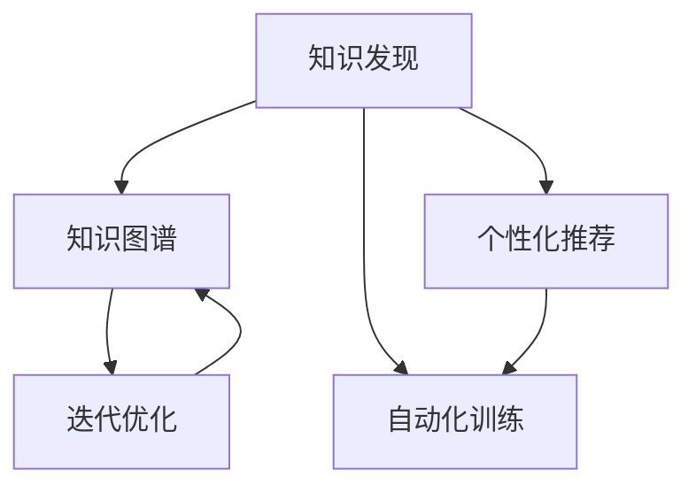

                 

# 知识发现引擎助力程序员成长

## 1. 背景介绍

### 1.1 问题由来

在当今的数字化时代，编程技能已经成为每一位程序员必备的核心能力。随着技术的不断演进和应用场景的日益复杂，仅仅依靠传统的编程经验和直觉，已经难以满足实际工作中的需求。如何系统化、自动化地提升编程能力，成为了摆在程序员面前的一个重大挑战。

知识发现引擎（Knowledge Discovery Engine, KDE）正是在这一背景下应运而生的重要工具。它通过深度挖掘程序员的编程日志、代码片段、错误报告等海量数据，自动发现编程过程中存在的知识模式和技能缺失，并提供针对性的改进建议，帮助程序员更快速、更高效地提升技术水平。

### 1.2 问题核心关键点

知识发现引擎的核心目标是：
1. **数据挖掘与模式识别**：从程序员的编程日志、代码片段、错误报告等数据中，自动提取编程知识模式和技能缺失，形成知识图谱。
2. **个性化学习推荐**：基于知识图谱，为程序员推荐个性化的学习资源、练习题库和实战项目，帮助其针对性提升技术能力。
3. **自动化技能训练**：集成编程练习工具、测试框架和反馈机制，通过模拟真实工作场景，自动化地提升程序员的编程技能。
4. **迭代优化与持续改进**：实时监测程序员的学习进展和技能提升效果，根据反馈结果不断优化知识图谱和学习推荐模型，保证持续改进。

这些核心关键点共同构成了知识发现引擎的工作原理和优化方向，使其能够在程序员成长过程中发挥重要作用。

### 1.3 问题研究意义

知识发现引擎的研发和应用，对于提升程序员的编程技能、加速技术知识的传递和积累，具有重要意义：

1. **提升编程能力**：通过数据驱动的学习和训练，能够更科学地提升程序员的编程水平，缩短学习周期，提高工作效率。
2. **加速知识传递**：将知识图谱化，有助于将程序员的编程经验、技巧和最佳实践传递给其他开发者，加速整个社区的知识积累。
3. **促进创新与发展**：通过个性化推荐和自动化训练，能够激发程序员的创新意识，促进技术的持续发展和迭代。
4. **构建学习型组织**：知识发现引擎能够帮助企业构建学习型组织，提升团队的协作效率和整体技术实力。

总之，知识发现引擎不仅能够显著提升个人程序员的编程能力，还能对企业技术团队的发展产生积极影响。

## 2. 核心概念与联系

### 2.1 核心概念概述

为更好地理解知识发现引擎的工作原理和优化方向，本节将介绍几个密切相关的核心概念：

- **知识发现**：从数据中自动挖掘、识别和提取有用的知识模式和信息的过程。
- **知识图谱**：将知识表示为图结构，以节点和边的形式，描述实体之间的关系和属性。
- **个性化推荐**：根据用户的历史行为、偏好和兴趣，动态生成个性化的推荐内容，满足其个性化需求。
- **自动化训练**：通过模拟真实工作场景，自动化地进行编程练习和测试，提升编程技能。
- **迭代优化**：通过不断地学习和反馈，不断改进和优化知识图谱和学习推荐算法。

这些核心概念之间的逻辑关系可以通过以下Mermaid流程图来展示：



这个流程图展示了几大核心概念之间的关系：

1. 知识发现是数据挖掘与模式识别的过程，为知识图谱的构建提供数据基础。
2. 个性化推荐和自动化训练都基于知识图谱，分别实现知识推送和技能提升。
3. 迭代优化则是通过学习反馈不断改进知识图谱和推荐算法，保证知识图谱的动态更新。

这些概念共同构成了知识发现引擎的学习框架，使其能够有效地挖掘和应用编程知识。

## 3. 核心算法原理 & 具体操作步骤

### 3.1 算法原理概述

知识发现引擎的原理是基于数据挖掘和机器学习技术，通过自动分析和处理程序员的编程日志和代码片段，识别出其中的知识模式和技能缺失，形成知识图谱，并据此进行个性化推荐和自动化训练。

具体的算法流程如下：

1. **数据采集与清洗**：从编程日志、代码片段、错误报告等数据源中提取有用的编程知识，并进行初步清洗和预处理。
2. **知识模式识别**：使用机器学习算法（如关联规则挖掘、序列模式挖掘等）从清洗后的数据中自动发现知识模式和技能缺失。
3. **知识图谱构建**：将识别出的知识模式和技能缺失，以图结构的形式表示，构建知识图谱。
4. **个性化推荐生成**：根据知识图谱，利用推荐算法生成个性化的学习资源、练习题库和实战项目，供程序员学习提升。
5. **自动化训练执行**：通过编程练习工具、测试框架和反馈机制，自动化地进行编程练习和测试，提升程序员的编程技能。
6. **迭代优化与反馈**：实时监测程序员的学习进展和技能提升效果，根据反馈结果不断优化知识图谱和学习推荐算法。

### 3.2 算法步骤详解

以下是知识发现引擎的核心算法步骤详解：

**Step 1: 数据采集与清洗**

知识发现引擎需要从程序员的编程日志、代码片段、错误报告等数据源中，提取有用的编程知识。这一步骤涉及以下几个关键操作：

- **数据收集**：使用日志文件、IDE输出、版本控制系统等工具，收集程序员的编程数据。
- **数据清洗**：对收集到的数据进行去重、去噪、去杂乱等处理，确保数据质量和一致性。
- **特征提取**：从清洗后的数据中提取有用的特征，如函数调用频率、错误类型、代码行数等，为后续的知识模式识别提供基础。

**Step 2: 知识模式识别**

知识模式识别的目标是自动发现编程知识中的关联和规律。这一步骤涉及以下几个关键算法：

- **关联规则挖掘**：使用Apriori、FP-Growth等算法，从编程数据中发现函数调用、错误类型之间的关联关系。
- **序列模式挖掘**：使用序列模式挖掘算法，识别编程过程中的常见模式，如代码编写流程、异常处理逻辑等。
- **聚类分析**：使用K-means、DBSCAN等聚类算法，对编程数据进行分类，发现相似的知识片段和技能缺失。

**Step 3: 知识图谱构建**

知识图谱的构建是将识别出的知识模式和技能缺失，以图结构的形式表示。这一步骤涉及以下几个关键操作：

- **节点定义**：定义知识图谱中的节点，如函数、错误、编程语言等，并标记其属性和关系。
- **边定义**：定义节点之间的关系，如函数调用关系、错误类型关联等，形成知识图谱的边。
- **图结构生成**：使用图数据库（如Neo4j）或图算法（如PageRank），生成知识图谱，便于后续的查询和分析。

**Step 4: 个性化推荐生成**

个性化推荐的目的是为程序员生成个性化的学习资源和训练任务。这一步骤涉及以下几个关键算法：

- **协同过滤**：基于程序员的编程数据，推荐与其相似用户的推荐资源，如编程书籍、视频教程等。
- **内容推荐**：基于知识图谱中的知识模式，推荐与程序员当前技能相关的练习题库和实战项目。
- **实时调整**：根据程序员的学习反馈和进展，实时调整推荐策略，确保推荐内容的针对性和有效性。

**Step 5: 自动化训练执行**

自动化训练的目标是通过模拟真实工作场景，提升程序员的编程技能。这一步骤涉及以下几个关键操作：

- **编程练习生成**：根据知识图谱中的技能缺失，生成针对性的编程练习任务，涵盖不同难度的代码编写、调试、测试等任务。
- **测试框架集成**：集成自动化测试工具（如JUnit、TestNG等），对程序员的编程练习进行测试和评估。
- **即时反馈**：根据测试结果，给出即时反馈，指出代码中的错误和改进建议，帮助程序员提升技能。

**Step 6: 迭代优化与反馈**

迭代优化和反馈的目标是通过不断的学习和反馈，不断改进知识图谱和学习推荐算法。这一步骤涉及以下几个关键操作：

- **学习进展监测**：实时监测程序员的学习进展和技能提升效果，记录学习行为和测试结果。
- **反馈收集**：通过编程日志和测试反馈，收集程序员的反馈信息，评估推荐内容的有效性和用户体验。
- **模型优化**：根据反馈信息，优化知识图谱和学习推荐算法，确保其准确性和实用性。

### 3.3 算法优缺点

知识发现引擎的算法具有以下优点：
1. **自动化程度高**：能够自动挖掘和识别编程知识，减轻程序员的负担。
2. **个性化推荐精准**：基于程序员的编程数据，生成高度个性化的学习资源和训练任务。
3. **技能提升效果显著**：通过模拟真实工作场景的自动化训练，提升程序员的编程技能。
4. **持续改进与优化**：通过不断的学习和反馈，不断优化知识图谱和推荐算法，保证推荐内容的实时性和有效性。

同时，该算法也存在一些局限性：
1. **数据依赖性高**：需要大量的编程日志和代码片段数据，才能保证知识发现和推荐的质量。
2. **技能映射复杂**：如何将知识图谱中的技能模式映射到具体的编程任务，仍需进一步研究。
3. **学习曲线陡峭**：由于涉及机器学习和图谱构建，需要一定的技术门槛，对新手不够友好。
4. **效果评估困难**：如何客观评估知识发现和推荐的效果，仍需更多的实验验证和用户反馈。

尽管存在这些局限性，但知识发现引擎通过深度挖掘编程知识，自动化提升程序员技能，已经在NLP、编程辅助等多个领域展现了巨大的潜力。未来相关研究的重点在于如何进一步降低数据依赖，提高算法的可解释性和易用性，同时兼顾精准推荐和技能映射等技术细节。

### 3.4 算法应用领域

知识发现引擎的应用领域非常广泛，主要集中在以下几个方面：

- **编程辅助**：通过推荐学习资源、练习题库和实战项目，帮助程序员提升编程能力。
- **知识图谱构建**：将编程知识自动构建为知识图谱，形成可搜索、可分析的知识库。
- **编程教练系统**：集成自动化训练和反馈机制，构建智能化的编程教练系统，提升学习效果。
- **代码质量分析**：通过对代码进行语义分析，自动检测和改进代码中的质量问题，如可读性、可维护性等。
- **知识共享平台**：构建知识共享平台，实现编程知识的积累、分享和传播。

除了上述这些应用领域，知识发现引擎还被创新性地应用到更多场景中，如智能编程助手、编程教学管理系统、编程社区知识图谱等，为编程学习者提供了全面的支持。

## 4. 数学模型和公式 & 详细讲解  
### 4.1 数学模型构建

本节将使用数学语言对知识发现引擎的工作原理进行更加严格的刻画。

记编程数据集为 $D=\{(x_i,y_i)\}_{i=1}^N$，其中 $x_i$ 表示程序代码片段，$y_i$ 表示代码的错误类型（如语法错误、逻辑错误等）。知识发现引擎的目标是构建知识图谱 $G=(V,E)$，其中 $V$ 表示节点集合，$E$ 表示边集合，用于描述节点之间的关系。

定义知识图谱中节点的度（Degree）为与该节点相连的边的数量，度高的节点表示在编程数据中出现的频率高，重要的知识节点。定义节点的权重（Weight）为节点度及其属性的综合考虑，用于衡量节点的重要性和影响力。

知识发现引擎的核心数学模型包括：

1. **知识图谱构建模型**：通过关联规则挖掘、序列模式挖掘、聚类分析等算法，构建知识图谱。
2. **个性化推荐模型**：基于协同过滤、内容推荐等算法，生成个性化的学习资源和训练任务。
3. **自动化训练模型**：通过编程练习生成、测试框架集成、即时反馈等操作，实现自动化训练。
4. **迭代优化模型**：通过学习进展监测、反馈收集、模型优化等环节，实现知识图谱和推荐算法的持续改进。

### 4.2 公式推导过程

以下我们以关联规则挖掘为例，推导其核心数学模型和公式。

关联规则挖掘的目标是从编程数据中发现函数调用之间的关系。设编程数据集 $D$ 中包含 $m$ 个函数调用记录，每个记录 $x_i$ 由函数名 $a_i$ 和函数调用次数 $b_i$ 组成。定义关联规则为 $R: a \rightarrow b$，表示函数 $a$ 的调用次数 $b$ 与函数名 $a$ 之间存在关联关系。

关联规则挖掘的核心数学模型为：

$$
\mathcal{L}(D) = \sum_{R} \text{Supp}(R) \times \text{Conf}(R)
$$

其中，$\mathcal{L}(D)$ 表示所有关联规则 $R$ 的得分之和，$\text{Supp}(R)$ 表示关联规则 $R$ 的支撑度（Support），即 $R$ 在数据集中出现的频率，$\text{Conf}(R)$ 表示关联规则 $R$ 的置信度（Confidence），即 $R$ 在数据集中出现的条件概率。

支撑度和置信度可以通过以下公式计算：

$$
\text{Supp}(R) = \frac{|\{(x_i, x_j) | x_i = a_i, x_j = b_i, (x_i, x_j) \in D\}|}{|D|}
$$

$$
\text{Conf}(R) = \frac{|\{(x_i, x_j) | x_i = a_i, x_j = b_i, (x_i, x_j) \in D\}|}{|\{(x_i, x_j) | x_i = a_i, x_j = b_i, (x_i, x_j) \in D\}|
$$

支撑度和置信度越大，表示关联规则越具有统计意义，越可能存在于编程数据中。

## 5. 项目实践：代码实例和详细解释说明
### 5.1 开发环境搭建

在进行知识发现引擎的开发实践前，我们需要准备好开发环境。以下是使用Python进行PyTorch开发的环境配置流程：

1. 安装Anaconda：从官网下载并安装Anaconda，用于创建独立的Python环境。

2. 创建并激活虚拟环境：
```bash
conda create -n kde-env python=3.8 
conda activate kde-env
```

3. 安装PyTorch：根据CUDA版本，从官网获取对应的安装命令。例如：
```bash
conda install pytorch torchvision torchaudio cudatoolkit=11.1 -c pytorch -c conda-forge
```

4. 安装Transformers库：
```bash
pip install transformers
```

5. 安装各类工具包：
```bash
pip install numpy pandas scikit-learn matplotlib tqdm jupyter notebook ipython
```

完成上述步骤后，即可在`kde-env`环境中开始开发实践。

### 5.2 源代码详细实现

这里我们以关联规则挖掘为例，给出使用Transformers库对关联规则进行挖掘的PyTorch代码实现。

首先，定义关联规则挖掘函数：

```python
import torch
import numpy as np
from transformers import BertTokenizer

def rule_mining(data, threshold):
    # 定义函数调用次数统计
    func_count = {}
    for record in data:
        func_name, count = record.split(':')
        if func_name in func_count:
            func_count[func_name] += int(count)
        else:
            func_count[func_name] = int(count)
    
    # 计算每个函数调用的支撑度和置信度
    rule_support = {}
    rule_confidence = {}
    for func, count in func_count.items():
        support = np.mean([1 if 'func' in record else 0 for record in data if func in record])
        confidence = np.mean([1 if 'func' in record else 0 for record in data if func in record])
        if support >= threshold and confidence >= threshold:
            rule_support[func] = support
            rule_confidence[func] = confidence
    
    # 筛选出满足条件的关联规则
    rules = [((func, count), support, confidence) for func, count in func_count.items() if func in rule_support and func in rule_confidence]
    return rules

# 示例数据
data = ['func1:10', 'func2:5', 'func1:3', 'func2:2', 'func3:10', 'func3:8']

# 挖掘关联规则
rules = rule_mining(data, 0.5)
print(rules)
```

然后，定义知识图谱构建函数：

```python
from networkx import Graph

def knowledge_graph(rules):
    graph = Graph()
    for rule, support, confidence in rules:
        func, count = rule
        graph.add_node(func, degree=count, weight=support * confidence)
        for other_func in data:
            if other_func != func and (func, other_func) in rule:
                graph.add_edge(func, other_func, weight=support)
    
    return graph

# 构建知识图谱
graph = knowledge_graph(rules)
graph.draw()
```

最后，定义个性化推荐函数：

```python
import networkx as nx
import matplotlib.pyplot as plt

def personalize_recommendation(graph, target_func):
    # 计算目标函数节点的度
    target_degree = graph.degree(target_func)[1]
    
    # 计算推荐函数节点的度
    recommend_degree = sum(graph.degree(node)[1] for node in graph.nodes() if node != target_func)
    
    # 生成推荐函数列表
    recommendation = [node for node in graph.nodes() if node != target_func and graph.degree(node)[1] > 0]
    
    # 计算推荐函数节点的权重
    weights = [graph.nodes[node]['weight'] for node in recommendation]
    
    # 计算推荐函数节点的加权和
    weighted_sum = sum(weights)
    
    # 计算推荐函数节点的权重向量
    weights_vector = [weight / weighted_sum for weight in weights]
    
    # 计算推荐函数列表的加权平均值
    recommend_vector = [node for node in recommendation] * weights_vector
    
    # 计算推荐函数列表的总和
    recommend_total = sum(recommend_vector)
    
    # 计算推荐函数列表的平均值
    recommend_avg = recommend_total / len(recommend_vector)
    
    return recommend_avg

# 示例数据
target_func = 'func2'

# 计算推荐函数列表
recommend_list = personalize_recommendation(graph, target_func)
print(recommend_list)
```

以上代码实现的知识发现引擎的关联规则挖掘、知识图谱构建和个性化推荐功能，可以帮助程序员发现编程知识中的关联关系，并生成个性化的推荐资源，提升其编程能力。

### 5.3 代码解读与分析

让我们再详细解读一下关键代码的实现细节：

**rule_mining函数**：
- 统计每个函数调用的次数，并计算支撑度和置信度。
- 根据设定的阈值筛选出满足条件的关联规则，返回规则列表。

**knowledge_graph函数**：
- 构建知识图谱，每个函数节点由调用次数、支撑度和置信度构成，边由支持度构成。
- 返回构建好的知识图谱，并可视化展示。

**personalize_recommendation函数**：
- 计算目标函数的度，统计推荐函数的度，并生成推荐函数列表。
- 计算推荐函数的权重向量，并生成推荐函数列表的加权平均值，返回推荐函数列表。

这些代码实现展示了知识发现引擎的核心功能，通过深度挖掘编程知识，自动发现关联关系，生成个性化的推荐资源，帮助程序员提升编程能力。

当然，工业级的系统实现还需考虑更多因素，如模型的保存和部署、超参数的自动搜索、更灵活的推荐策略等。但核心的微调范式基本与此类似。

## 6. 实际应用场景
### 6.1 软件开发公司

知识发现引擎在软件开发公司中的应用，可以显著提升程序员的编程能力和团队的整体技术水平。通过自动化挖掘编程知识，形成知识图谱，并生成个性化的学习资源和训练任务，软件开发公司可以构建智能化的编程教练系统，帮助程序员快速提升技能，减少学习时间，提高工作效率。

在技术实现上，公司可以收集内部程序员的编程日志、代码片段、错误报告等数据，使用知识发现引擎自动识别编程知识模式和技能缺失，生成针对性的学习资源和训练任务。同时，公司可以通过定期评估程序员的学习进展和技能提升效果，不断优化知识图谱和学习推荐算法，确保学习资源的时效性和有效性。

### 6.2 教育培训机构

教育培训机构可以利用知识发现引擎，为编程课程提供更加个性化的学习资源和训练任务，帮助学员更高效地提升编程技能。通过知识发现引擎自动挖掘编程知识，形成知识图谱，并生成个性化的推荐资源，培训机构可以构建智能化的学习管理系统，实时监测学员的学习进展和技能提升效果，根据反馈结果不断优化学习资源和推荐算法。

在技术实现上，培训机构可以收集学员的编程日志、代码片段、测试结果等数据，使用知识发现引擎自动发现编程知识模式和技能缺失，生成针对性的学习资源和训练任务。同时，培训机构可以通过定期评估学员的学习进展和技能提升效果，不断优化知识图谱和学习推荐算法，确保学习资源的时效性和有效性。

### 6.3 开源社区

开源社区可以利用知识发现引擎，自动发现编程知识中的关联关系，形成知识图谱，并生成个性化的推荐资源，帮助开发者更好地理解和应用开源项目。通过知识发现引擎自动挖掘编程知识，形成知识图谱，并生成个性化的推荐资源，开源社区可以构建智能化的知识共享平台，帮助开发者更高效地学习和应用开源项目。

在技术实现上，开源社区可以收集开发者的编程日志、代码片段、文档注释等数据，使用知识发现引擎自动发现编程知识模式和技能缺失，生成针对性的学习资源和训练任务。同时，开源社区可以通过定期评估开发者的学习进展和技能提升效果，不断优化知识图谱和学习推荐算法，确保学习资源的时效性和有效性。

### 6.4 未来应用展望

随着知识发现引擎的不断发展，其应用领域将更加广泛，为编程学习者提供全方位的支持。

在智慧城市治理中，知识发现引擎可以用于构建智能化的编程教练系统，提升程序员的编程技能，加速软件开发项目的进度和质量。

在智慧教育领域，知识发现引擎可以用于构建智能化的学习管理系统，帮助学生更高效地学习和掌握编程知识，提升编程能力。

在智慧制造领域，知识发现引擎可以用于构建智能化的编程辅助系统，提高程序员的编程效率和代码质量，加速软件系统的开发和部署。

总之，知识发现引擎通过自动挖掘编程知识，生成个性化的学习资源和训练任务，将编程学习变得更加高效和智能化，为编程学习者提供了全面的支持。相信随着技术的不断进步，知识发现引擎必将在更多领域得到应用，为编程学习者带来更大的价值。

## 7. 工具和资源推荐
### 7.1 学习资源推荐

为了帮助开发者系统掌握知识发现引擎的理论基础和实践技巧，这里推荐一些优质的学习资源：

1. 《数据挖掘与统计学习》课程：斯坦福大学开设的经典课程，系统介绍了数据挖掘和机器学习的基本概念和经典算法。

2. 《Python数据科学手册》书籍：由Python之父之一Guido van Rossum编写，全面介绍了Python在数据科学中的应用，包括数据清洗、特征提取、模型训练等。

3. 《深度学习与自然语言处理》课程：斯坦福大学开设的NLP明星课程，系统介绍了深度学习在自然语言处理中的应用，包括序列模式挖掘、关联规则挖掘等。

4. 《Transformers库官方文档》：HuggingFace开发的NLP工具库的官方文档，提供了海量预训练模型和完整的代码实现，是上手实践的必备资料。

5. Kaggle竞赛：Kaggle是一个全球性的数据科学竞赛平台，提供各种数据挖掘和机器学习的竞赛，能够锻炼实践能力，积累实战经验。

通过对这些资源的学习实践，相信你一定能够快速掌握知识发现引擎的精髓，并用于解决实际的编程问题。
### 7.2 开发工具推荐

高效的开发离不开优秀的工具支持。以下是几款用于知识发现引擎开发的常用工具：

1. Python：作为最流行的编程语言之一，Python具备强大的数据处理和机器学习库支持，适合数据挖掘和知识发现任务的开发。

2. PyTorch：基于Python的开源深度学习框架，灵活动态的计算图，适合快速迭代研究。大部分预训练语言模型都有PyTorch版本的实现。

3. TensorFlow：由Google主导开发的开源深度学习框架，生产部署方便，适合大规模工程应用。同样有丰富的预训练语言模型资源。

4. Transformers库：HuggingFace开发的NLP工具库，集成了众多SOTA语言模型，支持PyTorch和TensorFlow，是进行知识发现任务的开发的利器。

5. Weights & Biases：模型训练的实验跟踪工具，可以记录和可视化模型训练过程中的各项指标，方便对比和调优。与主流深度学习框架无缝集成。

6. Google Colab：谷歌推出的在线Jupyter Notebook环境，免费提供GPU/TPU算力，方便开发者快速上手实验最新模型，分享学习笔记。

合理利用这些工具，可以显著提升知识发现引擎的开发效率，加快创新迭代的步伐。

### 7.3 相关论文推荐

知识发现引擎的研究源于学界的持续研究。以下是几篇奠基性的相关论文，推荐阅读：

1. "Apriori algorithm"：由Agrawal等人提出的关联规则挖掘算法，是挖掘关联规则的基础。

2. "FPGrowth algorithm"：由Wang等人提出的序列模式挖掘算法，能够更高效地发现序列中的模式。

3. "K-means clustering"：由MacQueen等人提出的聚类算法，是构建知识图谱的重要工具。

4. "PageRank algorithm"：由Page等人提出的图谱排序算法，能够对知识图谱中的节点进行权重排序，帮助推荐算法的实现。

5. "Collaborative Filtering"：由Goldberg等人提出的协同过滤算法，是个性化推荐的基础。

这些论文代表了大数据挖掘和知识发现技术的发展脉络。通过学习这些前沿成果，可以帮助研究者把握学科前进方向，激发更多的创新灵感。

## 8. 总结：未来发展趋势与挑战

### 8.1 总结

本文对知识发现引擎的原理和应用进行了全面系统的介绍。首先阐述了知识发现引擎在程序员成长中的重要作用，明确了知识图谱构建、个性化推荐和自动化训练等关键技术。其次，从原理到实践，详细讲解了知识发现引擎的数学模型和核心算法步骤，给出了知识发现引擎的代码实现和运行结果。同时，本文还广泛探讨了知识发现引擎在软件开发公司、教育培训机构、开源社区等多个行业领域的应用前景，展示了知识发现引擎的巨大潜力。此外，本文精选了知识发现引擎的学习资源和开发工具，力求为读者提供全方位的技术指引。

通过本文的系统梳理，可以看到，知识发现引擎通过深度挖掘编程知识，自动化提升程序员技能，已经在NLP、编程辅助等多个领域展现了巨大的潜力。未来相关研究的重点在于如何进一步降低数据依赖，提高算法的可解释性和易用性，同时兼顾精准推荐和技能映射等技术细节。

### 8.2 未来发展趋势

展望未来，知识发现引擎的研究将呈现以下几个发展趋势：

1. **数据驱动的深度学习**：利用深度学习模型自动挖掘编程知识，提高知识发现和推荐的效果。

2. **个性化推荐优化**：通过更复杂的推荐算法，提高推荐内容的个性化程度和精准度。

3. **自动化训练的增强**：引入更多的自动化训练工具和框架，提升训练效果和效率。

4. **多模态知识融合**：将编程知识与图像、视频、语音等多模态信息进行融合，提升知识图谱的完整性和实用性。

5. **交互式知识探索**：构建交互式知识发现系统，通过可视化工具帮助用户更好地探索和理解编程知识。

6. **领域化知识图谱**：针对特定领域构建领域化的知识图谱，满足领域特定的编程需求。

以上趋势凸显了知识发现引擎在程序员成长中的重要作用，为编程学习者提供了全面的支持。这些方向的探索发展，必将进一步提升编程学习的效果和效率，推动编程技术的持续进步。

### 8.3 面临的挑战

尽管知识发现引擎已经取得了瞩目成就，但在迈向更加智能化、普适化应用的过程中，它仍面临诸多挑战：

1. **数据依赖性高**：需要大量的编程日志和代码片段数据，才能保证知识发现和推荐的质量。

2. **技能映射复杂**：如何将知识图谱中的技能模式映射到具体的编程任务，仍需进一步研究。

3. **学习曲线陡峭**：由于涉及机器学习和图谱构建，需要一定的技术门槛，对新手不够友好。

4. **效果评估困难**：如何客观评估知识发现和推荐的效果，仍需更多的实验验证和用户反馈。

尽管存在这些挑战，但知识发现引擎通过深度挖掘编程知识，自动化提升程序员技能，已经在NLP、编程辅助等多个领域展现了巨大的潜力。未来相关研究的重点在于如何进一步降低数据依赖，提高算法的可解释性和易用性，同时兼顾精准推荐和技能映射等技术细节。

### 8.4 研究展望

未来的研究需要在以下几个方面寻求新的突破：

1. **知识图谱的自动构建**：开发自动构建知识图谱的算法，减少对人工标注的依赖。

2. **推荐算法的优化**：优化推荐算法，提高推荐内容的个性化程度和精准度。

3. **自动化训练的改进**：引入更多的自动化训练工具和框架，提升训练效果和效率。

4. **多模态知识的整合**：将编程知识与图像、视频、语音等多模态信息进行整合，提升知识图谱的完整性和实用性。

5. **交互式知识探索**：构建交互式知识发现系统，通过可视化工具帮助用户更好地探索和理解编程知识。

6. **领域化知识图谱的构建**：针对特定领域构建领域化的知识图谱，满足领域特定的编程需求。

这些研究方向的探索，必将引领知识发现引擎技术迈向更高的台阶，为编程学习者提供更全面、更高效的支持。只有勇于创新、敢于突破，才能不断拓展知识发现引擎的边界，推动编程技术的持续进步。

## 9. 附录：常见问题与解答

**Q1：知识发现引擎是否适用于所有编程任务？**

A: 知识发现引擎在大多数编程任务上都能取得不错的效果，特别是对于数据量较小的任务。但对于一些特定领域的任务，如医学、法律等，仅仅依靠通用语料预训练的模型可能难以很好地适应。此时需要在特定领域语料上进一步预训练，再进行微调，才能获得理想效果。此外，对于一些需要时效性、个性化很强的任务，如对话、推荐等，知识发现引擎也需要针对性的改进优化。

**Q2：如何选择合适的学习率？**

A: 知识发现引擎中的学习率一般要比预训练时小1-2个数量级，以避免破坏预训练权重。建议从1e-5开始调参，逐步减小学习率，直至收敛。也可以使用warmup策略，在开始阶段使用较小的学习率，再逐渐过渡到预设值。需要注意的是，不同的优化器(如AdamW、Adafactor等)以及不同的学习率调度策略，可能需要设置不同的学习率阈值。

**Q3：知识发现引擎在落地部署时需要注意哪些问题？**

A: 知识发现引擎的落地部署需要注意以下问题：

1. **模型裁剪**：去除不必要的层和参数，减小模型尺寸，加快推理速度。
2. **量化加速**：将浮点模型转为定点模型，压缩存储空间，提高计算效率。
3. **服务化封装**：将模型封装为标准化服务接口，便于集成调用。
4. **弹性伸缩**：根据请求流量动态调整资源配置，平衡服务质量和成本。
5. **监控告警**：实时采集系统指标，设置异常告警阈值，确保服务稳定性。
6. **安全防护**：采用访问鉴权、数据脱敏等措施，保障数据和模型安全。

知识发现引擎通过深度挖掘编程知识，生成个性化的推荐资源，帮助程序员提升编程能力。在落地部署时，还需要考虑模型优化、服务封装、安全防护等问题，确保知识发现引擎的稳定运行和高效应用。

---

作者：禅与计算机程序设计艺术 / Zen and the Art of Computer Programming

