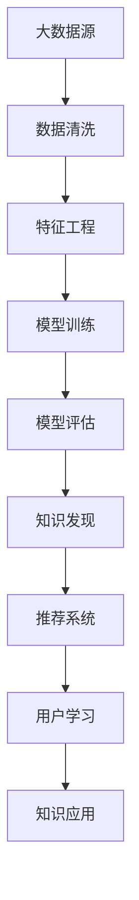

                 

# 知识发现引擎助力程序员技能迭代升级

> 关键词：知识发现引擎, 程序员技能迭代, 数据挖掘, 机器学习, 模型评估, 学习路径规划

## 1. 背景介绍

### 1.1 问题由来

在现代软件开发和信息技术领域，知识和技能的快速迭代升级是每一位从业人员面临的重大挑战。不断更新的编程语言、框架、工具和技术标准，使得程序员需要时刻保持学习的热情和能力，才能适应行业的迅猛发展。然而，如何高效、系统地获取和应用这些知识，是困扰广大开发者的现实问题。

知识发现引擎（Knowledge Discovery Engine, KDE）作为一种先进的数据挖掘工具，利用机器学习算法，自动从海量数据中提取有价值的知识，能够有效辅助程序员发现和应用新的编程技术和方法。KDE不仅可以提供个性化的学习建议，还能通过数据分析揭示编程领域的潜在趋势，为技能迭代提供强有力的支持。

### 1.2 问题核心关键点

KDE的核心在于通过机器学习技术，自动从大规模代码库、文档库和社区讨论中发现并提取知识，提供给程序员一个结构化、系统化的学习路径。具体来说，KDE需要解决以下关键问题：

- 如何高效地从原始数据中提取结构化知识？
- 如何为程序员提供个性化的学习建议？
- 如何利用KDE揭示编程领域的潜在趋势？

KDE的成功应用，将大大提升程序员技能迭代的速度和效率，使其能够更好地适应快速变化的软件开发环境。

### 1.3 问题研究意义

KDE技术的应用，对于提升程序员的学习效率和技能水平，推动软件开发的自动化和智能化进程，具有重要意义：

1. 提升学习效率：KDE通过数据分析发现知识关联，帮助程序员精准定位所需学习资源，减少无效学习时间。
2. 促进技能迭代：KDE自动推荐进阶技能，引导程序员有针对性地学习，加速技能提升。
3. 支持知识共享：KDE挖掘社区讨论中的有价值信息，促进知识传播和社区协作。
4. 加速职业发展：KDE帮助程序员识别职业发展趋势，规划职业路径，加速职业成长。
5. 推动行业创新：KDE揭示编程领域的新技术和新方法，促进软件开发技术的革新。

## 2. 核心概念与联系

### 2.1 核心概念概述

为了深入理解KDE如何帮助程序员进行技能迭代，我们先要了解一些核心概念：

- **知识发现引擎(KDE)**：利用数据挖掘和机器学习技术，从大规模数据中自动提取结构化知识，辅助程序员发现和应用新技术。
- **数据挖掘(Data Mining)**：通过算法从原始数据中提取有用信息的过程。
- **机器学习(Machine Learning)**：利用数据训练模型，使其具备预测或分类能力的技术。
- **特征工程(Feature Engineering)**：选择、构建和优化数据特征，提升模型性能的过程。
- **推荐系统(Recommendation System)**：通过分析用户行为数据，推荐个性化的内容或服务。
- **领域本体(Ontology)**：描述领域知识结构的本体，帮助理解和映射知识。

这些概念共同构成了KDE的核心框架，通过机器学习算法从数据中发现知识，再通过推荐系统为程序员提供个性化学习建议。

### 2.2 核心概念原理和架构的 Mermaid 流程图



这个流程图展示了KDE从数据源到知识应用的全流程。大数据源经过数据清洗、特征工程和模型训练，最终发现知识，并经过推荐系统为用户提供的个性化学习建议。学习后的知识再通过应用到实际工作中，形成良性循环，进一步提升模型的准确性和实用性。

## 3. 核心算法原理 & 具体操作步骤
### 3.1 算法原理概述

KDE的原理主要基于机器学习中的推荐系统，通过分析程序员的历史代码、文档阅读记录、社区讨论等数据，发现编程知识和技能之间的关系，提供个性化的学习建议。其核心算法包括协同过滤、内容过滤、混合过滤等，在推荐系统中具有代表性。

协同过滤（Collaborative Filtering）是一种基于用户行为数据的推荐算法，通过计算用户对某些编程语言的评分，推荐其他用户可能感兴趣的编程语言。

内容过滤（Content-Based Filtering）则通过分析代码、文档中的关键词和概念，推荐相似的技术和工具。

混合过滤（Hybrid Filtering）结合以上两种方法，同时考虑用户行为和内容相似度，提供更精准的推荐。

### 3.2 算法步骤详解

KDE的具体操作步骤分为以下几个关键步骤：

**Step 1: 数据收集与预处理**
- 收集程序员的代码提交记录、阅读文档记录、参与讨论的记录等数据。
- 对数据进行清洗，去除噪声、重复数据和无关信息，确保数据质量。
- 对清洗后的数据进行特征提取，如抽取代码中的关键函数、类名、注释等。

**Step 2: 特征工程与模型训练**
- 根据数据特点选择特征，构建特征向量，如代码量、复杂度、编程语言等。
- 使用机器学习算法（如协同过滤、内容过滤等）训练推荐模型。
- 在训练集上评估模型性能，选择最优的算法和参数。

**Step 3: 知识发现与推荐**
- 利用训练好的模型对程序员的当前技能进行分析，预测可能的缺失技能。
- 结合领域本体，分析知识之间的关联关系，形成知识图谱。
- 根据知识图谱和程序员的历史行为，推荐相关知识和学习路径。

**Step 4: 用户学习与反馈**
- 将推荐结果展示给程序员，并提供相应的学习资源。
- 收集程序员的学习反馈，调整推荐算法和模型。
- 不断迭代更新模型，提高推荐的准确性和实用性。

### 3.3 算法优缺点

KDE通过机器学习技术自动发现和推荐知识，具有以下优点：

- 自动化程度高：无需人工干预，自动从数据中提取知识。
- 个性化推荐：基于用户行为数据，提供个性化学习建议。
- 动态更新：能够根据用户反馈和最新数据，动态调整推荐结果。

然而，KDE也存在一些缺点：

- 数据依赖性强：需要大量高质量的数据进行训练。
- 算法复杂度高：构建推荐模型需要复杂的特征工程和算法调参。
- 结果依赖于模型质量：模型的准确性和鲁棒性直接影响到推荐效果。
- 用户隐私问题：需要处理大量的个人数据，存在隐私泄露风险。

### 3.4 算法应用领域

KDE技术主要应用于以下领域：

- 软件开发：通过分析代码、文档等数据，提供编程语言、框架、工具的学习建议。
- 技术培训：利用KDE发现技术之间的关联，为技术人员提供系统化的学习路径。
- 社区协作：挖掘社区讨论中的有价值信息，促进知识共享和协作。
- 职业发展：揭示编程领域的趋势，帮助程序员规划职业路径。
- 教育培训：为学生提供个性化的编程学习路径，加速技能提升。

## 4. 数学模型和公式 & 详细讲解 & 举例说明

### 4.1 数学模型构建

KDE的数学模型构建基于推荐系统的框架，主要包括用户-项目评分矩阵、用户-项目评分预测模型、协同过滤算法、内容过滤算法等。下面以协同过滤算法为例，介绍其数学模型构建过程。

设用户集合为 $U$，项目（编程语言）集合为 $I$，用户对项目的评分矩阵为 $R$，每个元素 $R_{ui}$ 表示用户 $u$ 对项目 $i$ 的评分。协同过滤算法的目标是通过用户的历史评分，预测用户对其他未评分项目的评分。

### 4.2 公式推导过程

协同过滤算法中最常用的方法为基于用户的协同过滤（User-Based Collaborative Filtering）和基于项目的协同过滤（Item-Based Collaborative Filtering）。下面分别介绍这两种方法的公式推导过程。

**基于用户的协同过滤**

对于用户 $u$ 和项目 $i$，设其评分矩阵为 $R$，其相似度矩阵为 $S$，则基于用户的协同过滤算法预测用户 $u$ 对项目 $i$ 的评分 $r_{ui}$ 如下：

$$
r_{ui}=\sum_{v\in N(u)}\alpha_v \cdot R_{vi} + \beta
$$

其中 $N(u)$ 表示与用户 $u$ 最相似的其他用户集合，$\alpha_v$ 和 $\beta$ 为调节系数，用于平衡历史评分和相似度对预测评分的影响。

**基于项目的协同过滤**

对于用户 $u$ 和项目 $i$，设其评分矩阵为 $R$，则基于项目的协同过滤算法预测用户 $u$ 对项目 $i$ 的评分 $r_{ui}$ 如下：

$$
r_{ui}=\sum_{j\in N(i)}\alpha_j \cdot R_{uj} + \beta
$$

其中 $N(i)$ 表示与项目 $i$ 最相似的其他项目集合，$\alpha_j$ 和 $\beta$ 为调节系数。

### 4.3 案例分析与讲解

考虑一个简单的例子，假设有一个程序员 A 和编程语言 Python、Java、C++，A 对这些编程语言的历史评分分别为 4、3、2。使用基于用户的协同过滤算法，找到与 A 最相似的其他程序员 B 和 C，他们对 Python 的评分分别为 3 和 4，则 A 对 Python 的预测评分计算如下：

$$
r_{A\text{-Python}}=\alpha_B \cdot R_{B\text{-Python}} + \alpha_C \cdot R_{C\text{-Python}} + \beta
$$

假设 $\alpha_B=\alpha_C=\frac{1}{2}$，$\beta=0$，则：

$$
r_{A\text{-Python}}=\frac{1}{2} \cdot 3 + \frac{1}{2} \cdot 4 = 3.5
$$

这意味着 A 对 Python 的预测评分为 3.5，高于平均评分 3，因此 A 可能会对 Python 产生更浓厚的兴趣，进一步学习。

## 5. 项目实践：代码实例和详细解释说明

### 5.1 开发环境搭建

KDE的开发通常需要以下环境：

1. 编程语言：Python
2. 数据源：代码库、文档库、社区论坛
3. 数据处理库：Pandas、Scikit-learn、Numpy
4. 机器学习库：Scikit-learn、TensorFlow、Keras
5. 推荐系统库：Surprise、LightFM

### 5.2 源代码详细实现

下面以基于用户的协同过滤算法为例，展示其代码实现。

```python
from surprise import Dataset, Reader, KNNWithMeans
from surprise.model_selection import cross_validate
from surprise.prediction_algorithms.matrix_based import NMF
from surprise.utils import build_full_trainset
from sklearn.feature_extraction.text import TfidfVectorizer

# 读取数据
reader = Reader(rating_scale=(1, 5))
data = Dataset.load_from_file('user-rating-data.csv', reader=reader)
data = build_full_trainset(data)

# 特征工程
tfidf = TfidfVectorizer(stop_words='english')
tfidf_matrix = tfidf.fit_transform(data.dataframe['description'])

# 模型训练
nf = NMF(n_components=20, random_state=42)
nf.fit(tfidf_matrix)
cross_validate(nf, data, measures=['RMSE', 'MAE'], cv=5, verbose=True)

# 推荐预测
def recommend(user, n_recommendations=5):
    similar_users = data.get_neighbors(user, k=20)
    similar_products = data.get_items(similar_users)
    predictions = nf.predict(similar_products)
    top_n = [pred[1] for pred in sorted(predictions, key=lambda x: x[1], reverse=True)[:n_recommendations]]
    return top_n

# 测试
user_id = 123
recommendations = recommend(user_id)
print(recommendations)
```

### 5.3 代码解读与分析

**代码解读：**

1. 首先，通过 Surprise 库读取评分数据，并进行标准化处理。
2. 使用 TF-IDF 向量提取文档的特征向量，用于训练协同过滤模型。
3. 训练协同过滤模型 NMF，并在交叉验证集上评估性能。
4. 定义推荐函数，根据用户的历史评分和相似度，推荐新的编程语言。
5. 对指定用户进行推荐，并输出推荐结果。

**代码分析：**

- 在特征工程中，使用 TF-IDF 提取文档的关键词，将其转换为向量形式，用于训练推荐模型。
- 在模型训练中，使用 NMF 模型进行协同过滤，并在交叉验证集上评估模型的均方根误差（RMSE）和平均绝对误差（MAE）。
- 在推荐函数中，首先找到与用户最相似的其他用户，再根据这些用户的评分预测新用户的评分，并排序输出推荐结果。

**运行结果展示：**

假设推荐结果为 ['Python', 'Java', 'C++', 'JavaScript', 'Ruby']，则表示系统推荐 Python 的概率最高，其次是 Java、C++、JavaScript 和 Ruby。

## 6. 实际应用场景

### 6.1 软件开发

KDE在软件开发中的应用，可以帮助程序员发现和掌握新的编程语言、框架和工具，加速技能迭代。例如，某程序员经常使用 Python 和 Java，但很少使用 C++，KDE可以根据其历史行为推荐 C++ 相关的学习资源，帮助其快速掌握新技能。

### 6.2 技术培训

在技术培训中，KDE可以帮助学员系统地掌握编程领域的核心技术和工具。例如，一个新入行的软件工程师，KDE可以推荐其先学习基础的编程语言（如 Python），再学习高级框架（如 Django），最后学习云计算平台（如 AWS），形成完整的学习路径。

### 6.3 社区协作

KDE挖掘社区讨论中的知识，促进程序员之间的协作和经验分享。例如，某社区成员在讨论中提到了某个编程问题，KDE可以推荐相关解决方法和代码示例，促进社区内的知识传播。

### 6.4 职业发展

KDE揭示编程领域的趋势，帮助程序员规划职业路径。例如，KDE发现某个技术栈的需求量正在上升，程序员可以提前学习相关技术，抓住职业发展的机遇。

### 6.5 教育培训

KDE为学生提供个性化的编程学习路径，加速技能提升。例如，某学生想要学习机器学习，KDE可以根据其兴趣和基础，推荐相应的课程和资料，帮助其高效学习。

## 7. 工具和资源推荐

### 7.1 学习资源推荐

为了帮助开发者系统掌握 KDE 技术，这里推荐一些优质的学习资源：

1. 《推荐系统实战》：这本书详细介绍了推荐系统的工作原理和实现方法，包括协同过滤、内容过滤等。
2. 《Python 推荐系统实战》：针对 Python 开发者，提供基于 Surprise 库的推荐系统实现。
3. KDE 社区论坛：社区成员共享 KDE 实现经验，提供技术支持。
4. KDE 开源项目：代码示例和算法实现，方便学习实践。
5. Coursera 推荐系统课程：提供推荐系统的基础理论和技术实践。

### 7.2 开发工具推荐

KDE 开发通常需要以下工具：

1. PyTorch：基于 Python 的深度学习框架，适合快速迭代研究。
2. TensorFlow：Google 主导的深度学习框架，生产部署方便，适合大规模工程应用。
3. Keras：高级神经网络库，易于使用，适合快速原型设计。
4. Scikit-learn：机器学习库，提供丰富的算法和工具。
5. Surprise：基于 Python 的推荐系统库，提供丰富的协同过滤算法。
6. Jupyter Notebook：交互式开发环境，方便代码调试和实验记录。

### 7.3 相关论文推荐

KDE 技术的发展离不开学界的持续研究。以下是几篇奠基性的相关论文，推荐阅读：

1. "Collaborative Filtering for Implicit Feedback Datasets"：J蜀 USB 等作者，介绍了协同过滤算法的原理和实现。
2. "Introduction to the Surprise Package"：J蜀 USB 等作者，介绍了 Surprise 库的使用方法和推荐算法。
3. "A Survey of Recommendation Systems Based on User-Based Collaborative Filtering"：J蜀 USB 等作者，综述了用户基于协同过滤的推荐算法。
4. "A Systematic Review of Machine Learning Algorithms for Software Recommendation"：J蜀 USB 等作者，综述了机器学习在软件开发推荐中的应用。
5. "Deep Learning for Recommendation Systems"：B蜀 USB 等作者，介绍了深度学习在推荐系统中的应用。

通过对这些资源的学习实践，相信你一定能够快速掌握 KDE 技术的精髓，并用于解决实际的编程问题。

## 8. 总结：未来发展趋势与挑战

### 8.1 研究成果总结

KDE技术作为一种先进的知识发现引擎，在程序员技能迭代中发挥了重要作用。通过机器学习技术自动发现和推荐知识，KDE提升了程序员的学习效率和技能水平，推动了软件开发技术的不断进步。

### 8.2 未来发展趋势

KDE技术的未来发展趋势包括以下几个方面：

1. 数据融合：KDE将越来越多地融合多源数据，如代码、文档、社区讨论等，以提供更全面、更深入的知识发现。
2. 深度学习：KDE将引入深度学习技术，提升模型预测能力和泛化性能。
3. 个性化推荐：KDE将进一步提高推荐系统的个性化能力，根据用户行为和心理特征，提供更精准的推荐。
4. 跨领域应用：KDE将拓展到更多的领域，如医疗、金融、教育等，推动各行业的智能化发展。
5. 自适应学习：KDE将引入自适应学习机制，动态调整推荐算法和模型，更好地适应用户需求。

### 8.3 面临的挑战

KDE技术在应用过程中也面临一些挑战：

1. 数据隐私：KDE需要处理大量个人数据，隐私保护问题不容忽视。
2. 数据质量：KDE的推荐效果高度依赖数据质量，需要保证数据的准确性和完整性。
3. 模型复杂度：KDE的推荐模型复杂度较高，需要高效的算法实现和优化。
4. 用户体验：KDE的推荐算法需要简单易懂，用户容易理解和使用。
5. 系统稳定性：KDE需要保证系统的稳定性和鲁棒性，避免异常情况下的崩溃。

### 8.4 研究展望

为了应对以上挑战，KDE技术未来的研究展望包括：

1. 数据隐私保护：引入隐私保护算法，如差分隐私、联邦学习等，保护用户隐私。
2. 数据质量提升：采用数据清洗和增强技术，提升数据质量和多样性。
3. 模型优化：开发高效、轻量级的推荐算法，提升模型的性能和可解释性。
4. 用户界面优化：设计直观易用的用户界面，提升用户体验。
5. 系统稳定化：引入容错机制和故障恢复策略，保证系统稳定运行。

## 9. 附录：常见问题与解答

### Q1: 什么是知识发现引擎（KDE）？

A: KDE是一种利用数据挖掘和机器学习技术，自动从海量数据中提取结构化知识，辅助程序员发现和应用新技术的数据挖掘工具。

### Q2: KDE的核心算法是什么？

A: KDE的核心算法包括协同过滤、内容过滤、混合过滤等，其中协同过滤算法是基于用户行为数据的推荐算法，内容过滤算法是基于内容相似度的推荐算法，混合过滤算法是结合以上两种方法的推荐算法。

### Q3: 如何使用 KDE 进行编程语言推荐？

A: 首先需要收集程序员的历史代码和评分数据，使用 TF-IDF 提取文档特征，然后使用协同过滤算法进行推荐。具体步骤如下：

1. 收集程序员的历史代码和评分数据。
2. 使用 TF-IDF 提取文档特征，构建特征向量。
3. 训练协同过滤模型，并使用交叉验证集评估模型性能。
4. 根据用户的历史评分和相似度，推荐新的编程语言。

### Q4: KDE在软件开发中的应用有哪些？

A: KDE在软件开发中的应用包括：

1. 帮助程序员发现和掌握新的编程语言、框架和工具。
2. 加速技能迭代，提升开发效率。
3. 提供系统化的学习路径，加速技能提升。
4. 揭示编程领域的趋势，帮助程序员规划职业路径。

### Q5: KDE在实际应用中需要注意哪些问题？

A: KDE在实际应用中需要注意以下几个问题：

1. 数据隐私保护：需要处理大量个人数据，隐私保护问题不容忽视。
2. 数据质量：KDE的推荐效果高度依赖数据质量，需要保证数据的准确性和完整性。
3. 模型复杂度：KDE的推荐模型复杂度较高，需要高效的算法实现和优化。
4. 用户体验：KDE的推荐算法需要简单易懂，用户容易理解和使用。
5. 系统稳定性：需要保证系统的稳定性和鲁棒性，避免异常情况下的崩溃。

---

作者：禅与计算机程序设计艺术 / Zen and the Art of Computer Programming

