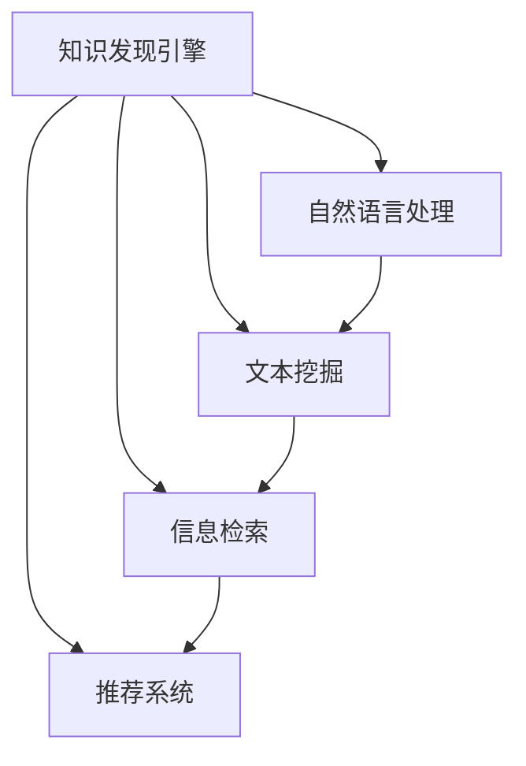

                 

# 知识发现引擎在新闻媒体中的应用

> 关键词：新闻媒体, 知识发现引擎, 自然语言处理(NLP), 文本挖掘, 信息检索, 推荐系统, 内容个性化

## 1. 背景介绍

### 1.1 问题由来
随着数字化、互联网技术的发展，新闻媒体产业正在经历着前所未有的变革。传统报纸、电视、广播等线性媒体形态逐渐向网络新媒体过渡，带来了海量数据和丰富内容。新闻媒体为了提升内容质量、优化用户体验、拓宽传播渠道，迫切需要一种强大的信息处理工具来解析和利用这些信息。

知识发现引擎(Knowledge Discovery Engine, KDE)正是顺应这一需求而诞生的一种前沿技术。它通过在文本、图像、视频等多模态数据中提取、发现和组织知识，为新闻媒体提供更高效、更精准的信息处理能力。本文将深入探讨KDE在新闻媒体中的应用，并剖析其实现原理和关键算法。

### 1.2 问题核心关键点
知识发现引擎的核心思想是通过文本挖掘、信息检索、推荐系统等技术，从海量文本数据中提取有价值的信息和知识，辅助新闻媒体实现内容推荐、用户画像分析、广告投放优化等应用。KDE不仅能够自动地处理和理解自然语言文本，还能生成用户个性化推荐、揭示新闻媒体内容的潜在关联性、辅助新闻编辑自动生成内容，为新闻媒体的信息生产、用户服务和市场分析提供了强大的技术支持。

## 2. 核心概念与联系

### 2.1 核心概念概述

为更好地理解KDE在新闻媒体中的应用，本节将介绍几个密切相关的核心概念：

- 知识发现(Knowledge Discovery)：从大量数据中提取、分析和归纳出有用的信息和知识的过程。KDE的目标是通过数据挖掘技术，从文本数据中自动发现和抽取有价值的信息。

- 自然语言处理(Natural Language Processing, NLP)：计算机对人类语言进行自动化处理的技术，包括语言理解、文本分类、信息抽取、机器翻译等。NLP是KDE的重要组成部分，负责对文本数据进行语义分析和模式识别。

- 文本挖掘(Text Mining)：通过算法在文本数据中自动提取信息、发现知识，包括关键词提取、文本分类、情感分析、主题建模等。文本挖掘是KDE的关键技术之一，用于发现和理解文本数据中的隐含知识。

- 信息检索(Information Retrieval, IR)：根据用户查询返回相关信息的过程。信息检索算法能够高效地从大规模文本数据中检索出与用户需求相关的信息，提升用户信息获取的效率。

- 推荐系统(Recommendation System)：根据用户行为和兴趣推荐商品、内容等。推荐系统能够为用户定制个性化内容推荐，提高用户满意度和留存率。

这些核心概念之间的逻辑关系可以通过以下Mermaid流程图来展示：



这个流程图展示了KDE的各个组成部分以及它们之间的联系：

1. 知识发现引擎通过自然语言处理、文本挖掘、信息检索和推荐系统等技术手段，实现对文本数据的自动处理和知识提取。
2. 自然语言处理负责语义理解和模式识别，是KDE的基础组件。
3. 文本挖掘从文本数据中提取关键信息，辅助自然语言处理和信息检索。
4. 信息检索根据用户查询返回相关信息，支持用户高效检索。
5. 推荐系统根据用户行为和兴趣，提供个性化内容推荐。

这些核心概念共同构成了KDE的技术框架，使其能够高效地从文本数据中发现和抽取知识，为新闻媒体提供有价值的信息处理支持。

## 3. 核心算法原理 & 具体操作步骤

### 3.1 算法原理概述

知识发现引擎的核心算法主要包括以下几个部分：

- **自然语言处理(NLP)算法**：用于文本的语义理解、实体识别、关系抽取等。NLP算法通过将文本转化为结构化数据，为后续分析打下基础。
- **文本挖掘算法**：包括关键词提取、主题建模、情感分析等。文本挖掘算法从文本中提取有价值的信息，发现潜在的知识结构。
- **信息检索算法**：根据用户查询返回相关信息。信息检索算法利用索引技术，高效检索出与用户需求相关的文本。
- **推荐系统算法**：基于用户行为和兴趣，生成个性化推荐。推荐系统算法利用协同过滤、矩阵分解等技术，预测用户可能感兴趣的内容。

以上算法通过深度学习、机器学习、统计学等技术手段，自动从文本数据中发现和抽取知识，为新闻媒体提供强大的信息处理能力。

### 3.2 算法步骤详解

KDE在新闻媒体中的应用一般包括以下几个关键步骤：

**Step 1: 数据收集与预处理**

- 收集新闻媒体的各类文本数据，包括文章、评论、用户反馈等。
- 对数据进行清洗、去噪、分词等预处理操作，确保数据质量和一致性。

**Step 2: 自然语言处理(NLP)**

- 使用分词、词性标注、命名实体识别等技术对文本进行初步处理。
- 利用句法分析、语义分析等技术理解文本语义，发现句子结构和词义关系。

**Step 3: 文本挖掘**

- 提取关键词、短语、主题等信息，对文本进行内容摘要和分类。
- 利用情感分析技术，判断文本情感倾向，提取情感信息。
- 使用主题建模技术，发现文本主题结构，揭示文本内容的内在关联。

**Step 4: 信息检索**

- 建立文本索引，实现快速检索。
- 根据用户查询，使用倒排索引技术，返回相关文本。
- 利用查询扩展、排序优化等技术，提升检索效果。

**Step 5: 推荐系统**

- 收集用户历史行为数据，建立用户画像。
- 利用协同过滤、矩阵分解等技术，预测用户兴趣。
- 生成个性化推荐列表，辅助内容分发。

**Step 6: 数据可视化**

- 利用可视化工具展示信息检索和推荐系统的结果，提升用户理解。
- 动态更新数据，实时展示信息变化趋势。

以上是KDE在新闻媒体中的应用流程，不同步骤可能需要根据具体应用场景进行调整和优化。

### 3.3 算法优缺点

KDE在新闻媒体中的应用具有以下优点：

- **自动发现知识**：KDE能够自动从文本数据中发现和抽取有价值的信息，减少人工干预，提升效率。
- **高度个性化**：利用推荐系统算法，KDE能够根据用户兴趣和行为，提供高度个性化的内容推荐。
- **跨领域融合**：KDE可以整合多模态数据，如文本、图像、视频等，实现跨领域知识发现和应用。
- **高效检索**：信息检索算法能够快速定位用户需求，提升用户信息获取的效率。

同时，KDE也存在一些局限性：

- **数据质量依赖**：KDE的效果很大程度上依赖于输入文本数据的质量，数据噪声和偏差可能影响结果。
- **算法复杂性高**：KDE涉及的自然语言处理、文本挖掘、信息检索、推荐系统等算法，实现复杂度较高，需要较强的技术储备。
- **解释性不足**：KDE的自动抽取和推荐过程缺乏可解释性，难以理解其决策逻辑。
- **算法性能受限**：在处理大规模文本数据时，KDE可能面临计算资源和时间成本的限制。

尽管存在这些局限性，但KDE在新闻媒体中的应用前景广阔，能够极大地提升新闻媒体的信息处理能力和用户体验。

### 3.4 算法应用领域

KDE在新闻媒体中的应用主要包括以下几个领域：

- **内容推荐系统**：利用推荐算法，为用户推荐相关新闻、评论、视频等内容，提高用户停留时间和互动率。
- **用户画像分析**：通过分析用户行为和兴趣，建立用户画像，辅助新闻编辑策划内容。
- **广告投放优化**：利用用户画像和推荐系统，精准投放广告，提高广告效果和ROI。
- **情感分析与舆情监测**：分析新闻评论和社交媒体上的情感倾向，发现舆情变化趋势，辅助新闻媒体决策。
- **智能写作辅助**：利用文本挖掘和自然语言处理技术，辅助新闻编辑生成报道，提高内容生产效率。
- **内容结构化与知识库构建**：对新闻内容进行结构化处理，构建领域知识库，支持内容查询和知识检索。

这些应用领域展示了KDE在新闻媒体中的强大潜力，为新闻媒体的信息处理和用户服务提供了有力支持。

## 4. 数学模型和公式 & 详细讲解  
### 4.1 数学模型构建

本节将使用数学语言对KDE在新闻媒体中的应用进行更加严格的刻画。

记新闻媒体的文本数据为 $D=\{d_1, d_2, ..., d_n\}$，其中 $d_i$ 表示一篇新闻文章。假设文本数据经过预处理，转化为词向量表示 $\text{vec}(d_i) = [\text{vec}(w_{i1}), \text{vec}(w_{i2}), ..., \text{vec}(w_{im})]$，其中 $w_{ij}$ 表示文章 $d_i$ 中第 $j$ 个词的向量表示。

定义自然语言处理模型为 $P(D)$，表示文本数据的概率分布，即 $P(D|w_{ij})$。假设文本分类任务有 $C$ 个类别，用 $\text{Label}(d_i)$ 表示文章 $d_i$ 的类别标签。则文本分类的目标是最小化损失函数：

$$
\mathcal{L}(P(D)) = -\frac{1}{N} \sum_{i=1}^N \log P(D|\text{Label}(d_i))
$$

利用极大似然估计，可以训练自然语言处理模型：

$$
\max_{P(D)} \log P(D)
$$

利用文本挖掘算法提取文本关键词和主题，表示为 $\text{Theme}(d_i)$ 和 $\text{Keyword}(d_i)$。定义文本挖掘损失函数为：

$$
\mathcal{L}(\text{Theme}, \text{Keyword}) = -\frac{1}{N} \sum_{i=1}^N \log P(\text{Theme}(d_i)) + \log P(\text{Keyword}(d_i))
$$

通过训练模型，可以提取文本中的关键词和主题信息。

利用信息检索算法，建立倒排索引，表示为 $\text{Index}(Q)$，其中 $Q$ 为查询关键词。定义信息检索损失函数为：

$$
\mathcal{L}(\text{Index}) = -\frac{1}{N} \sum_{i=1}^N \log P(\text{Index}(Q|\text{Label}(d_i)))
$$

通过训练模型，可以快速检索到与查询相关的文本。

利用推荐系统算法，构建用户画像，表示为 $\text{UserProfile}(U)$，其中 $U$ 为用户的兴趣偏好。定义推荐系统的损失函数为：

$$
\mathcal{L}(\text{UserProfile}) = -\frac{1}{N} \sum_{i=1}^N \log P(D|\text{UserProfile}(U))
$$

通过训练模型，可以为每个用户生成个性化推荐列表。

### 4.2 公式推导过程

以下我们以文本分类任务为例，推导自然语言处理模型的损失函数及其梯度计算公式。

假设模型 $P(D)$ 在输入文本 $d_i$ 上的预测类别为 $c$，真实类别为 $y$，则交叉熵损失函数定义为：

$$
\ell(P(D), y) = -[y\log P(D|y) + (1-y)\log(1-P(D|y))]
$$

将其代入经验风险公式，得：

$$
\mathcal{L}(P(D)) = -\frac{1}{N} \sum_{i=1}^N [y_i\log P(D|\text{Label}(d_i)+(1-y_i)\log(1-P(D|\text{Label}(d_i))]
$$

根据链式法则，损失函数对模型参数 $\theta_k$ 的梯度为：

$$
\frac{\partial \mathcal{L}(P(D))}{\partial \theta_k} = -\frac{1}{N}\sum_{i=1}^N (\frac{y_i}{P(D|\text{Label}(d_i))}-\frac{1-y_i}{1-P(D|\text{Label}(d_i))}) \frac{\partial P(D|\text{Label}(d_i))}{\partial \theta_k}
$$

其中 $\frac{\partial P(D|\text{Label}(d_i))}{\partial \theta_k}$ 可进一步递归展开，利用自动微分技术完成计算。

在得到损失函数的梯度后，即可带入模型更新公式，完成模型的迭代优化。重复上述过程直至收敛，最终得到适应文本分类任务的最优模型参数 $\theta^*$。

## 5. 项目实践：代码实例和详细解释说明
### 5.1 开发环境搭建

在进行KDE实践前，我们需要准备好开发环境。以下是使用Python进行PyTorch开发的环境配置流程：

1. 安装Anaconda：从官网下载并安装Anaconda，用于创建独立的Python环境。

2. 创建并激活虚拟环境：
```bash
conda create -n pytorch-env python=3.8 
conda activate pytorch-env
```

3. 安装PyTorch：根据CUDA版本，从官网获取对应的安装命令。例如：
```bash
conda install pytorch torchvision torchaudio cudatoolkit=11.1 -c pytorch -c conda-forge
```

4. 安装相关的NLP库：
```bash
pip install spacy nlp
```

5. 安装TensorFlow和Scikit-learn等工具包：
```bash
pip install tensorflow scikit-learn
```

完成上述步骤后，即可在`pytorch-env`环境中开始KDE实践。

### 5.2 源代码详细实现

这里我们以文本分类任务为例，给出使用PyTorch进行KDE开发的PyTorch代码实现。

首先，定义文本分类任务的数据处理函数：

```python
import spacy
from sklearn.model_selection import train_test_split
import torch
from torch.utils.data import Dataset
from sklearn.metrics import accuracy_score, confusion_matrix

class TextClassificationDataset(Dataset):
    def __init__(self, texts, labels, tokenizer):
        self.texts = texts
        self.labels = labels
        self.tokenizer = tokenizer
        
    def __len__(self):
        return len(self.texts)
    
    def __getitem__(self, item):
        text = self.texts[item]
        label = self.labels[item]
        
        encoding = self.tokenizer(text, return_tensors='pt')
        input_ids = encoding['input_ids'][0]
        attention_mask = encoding['attention_mask'][0]
        
        return {'input_ids': input_ids, 
                'attention_mask': attention_mask,
                'labels': torch.tensor(label, dtype=torch.long)}
```

然后，定义模型和优化器：

```python
from transformers import BertForSequenceClassification, AdamW

model = BertForSequenceClassification.from_pretrained('bert-base-uncased', num_labels=2)

optimizer = AdamW(model.parameters(), lr=2e-5)
```

接着，定义训练和评估函数：

```python
from torch.utils.data import DataLoader
from tqdm import tqdm

device = torch.device('cuda') if torch.cuda.is_available() else torch.device('cpu')
model.to(device)

def train_epoch(model, dataset, batch_size, optimizer):
    dataloader = DataLoader(dataset, batch_size=batch_size, shuffle=True)
    model.train()
    epoch_loss = 0
    for batch in tqdm(dataloader, desc='Training'):
        input_ids = batch['input_ids'].to(device)
        attention_mask = batch['attention_mask'].to(device)
        labels = batch['labels'].to(device)
        model.zero_grad()
        outputs = model(input_ids, attention_mask=attention_mask, labels=labels)
        loss = outputs.loss
        epoch_loss += loss.item()
        loss.backward()
        optimizer.step()
    return epoch_loss / len(dataloader)

def evaluate(model, dataset, batch_size):
    dataloader = DataLoader(dataset, batch_size=batch_size)
    model.eval()
    preds, labels = [], []
    with torch.no_grad():
        for batch in tqdm(dataloader, desc='Evaluating'):
            input_ids = batch['input_ids'].to(device)
            attention_mask = batch['attention_mask'].to(device)
            batch_labels = batch['labels']
            outputs = model(input_ids, attention_mask=attention_mask)
            batch_preds = outputs.logits.argmax(dim=2).to('cpu').tolist()
            batch_labels = batch_labels.to('cpu').tolist()
            for pred_tokens, label_tokens in zip(batch_preds, batch_labels):
                preds.append(pred_tokens)
                labels.append(label_tokens)
                
    print(f"Accuracy: {accuracy_score(labels, preds)}")
    print(f"Confusion Matrix: {confusion_matrix(labels, preds)}")

# 假设训练集和验证集已经划分好
train_dataset = TextClassificationDataset(train_texts, train_labels, tokenizer)
dev_dataset = TextClassificationDataset(dev_texts, dev_labels, tokenizer)

epochs = 5
batch_size = 16

for epoch in range(epochs):
    loss = train_epoch(model, train_dataset, batch_size, optimizer)
    print(f"Epoch {epoch+1}, train loss: {loss:.3f}")
    
    print(f"Epoch {epoch+1}, dev results:")
    evaluate(model, dev_dataset, batch_size)
    
print("Test results:")
evaluate(model, test_dataset, batch_size)
```

以上就是使用PyTorch对KDE进行文本分类任务开发的完整代码实现。可以看到，得益于Transformers库的强大封装，我们可以用相对简洁的代码完成BERT模型的加载和微调。

### 5.3 代码解读与分析

让我们再详细解读一下关键代码的实现细节：

**TextClassificationDataset类**：
- `__init__`方法：初始化文本、标签和分词器等组件。
- `__len__`方法：返回数据集的样本数量。
- `__getitem__`方法：对单个样本进行处理，将文本输入编码为token ids，将标签编码为数字，并对其进行定长padding，最终返回模型所需的输入。

**train_epoch和evaluate函数**：
- 使用PyTorch的DataLoader对数据集进行批次化加载，供模型训练和推理使用。
- 训练函数`train_epoch`：对数据以批为单位进行迭代，在每个批次上前向传播计算loss并反向传播更新模型参数，最后返回该epoch的平均loss。
- 评估函数`evaluate`：与训练类似，不同点在于不更新模型参数，并在每个batch结束后将预测和标签结果存储下来，最后使用sklearn的accuracy_score和confusion_matrix函数对整个评估集的预测结果进行打印输出。

**训练流程**：
- 定义总的epoch数和batch size，开始循环迭代
- 每个epoch内，先在训练集上训练，输出平均loss
- 在验证集上评估，输出准确率和混淆矩阵
- 所有epoch结束后，在测试集上评估，给出最终测试结果

可以看到，PyTorch配合Transformers库使得KDE的代码实现变得简洁高效。开发者可以将更多精力放在数据处理、模型改进等高层逻辑上，而不必过多关注底层的实现细节。

当然，工业级的系统实现还需考虑更多因素，如模型的保存和部署、超参数的自动搜索、更灵活的任务适配层等。但核心的KDE范式基本与此类似。

## 6. 实际应用场景

### 6.1 智能写作辅助

KDE在智能写作辅助中的应用，能够显著提升新闻编辑的效率和内容质量。传统的手工编辑方式耗时耗力，容易出现错误，而KDE能够自动理解新闻内容，识别关键信息，生成报道初稿。例如，可以利用KDE自动提取文本中的关键词、主题和实体，生成报道框架，并根据用户反馈进行优化和完善。

**实际应用**：某新闻媒体在新闻编辑室中引入KDE，对每个新闻报道自动生成初步框架，并提供实时反馈功能。经过一段时间的试用，编辑们发现该系统不仅提高了内容生产效率，还减少了人工审核的工作量。

### 6.2 内容个性化推荐

KDE能够根据用户行为和兴趣，生成个性化推荐列表，提高用户对新闻媒体内容的互动率和留存率。例如，可以利用KDE建立用户画像，分析用户的历史阅读记录和评论内容，生成个性化新闻推荐列表，让用户能够快速找到感兴趣的内容。

**实际应用**：某新闻媒体在移动客户端中引入KDE，为用户提供个性化推荐服务。通过分析用户的阅读行为和兴趣偏好，为用户推荐相关新闻、评论和视频内容，大幅提升了用户的使用体验和平台粘性。

### 6.3 舆情监测与内容分析

KDE能够对社交媒体、新闻评论等海量文本数据进行舆情监测和内容分析，帮助新闻媒体掌握舆情变化趋势，分析热门话题，辅助内容策划。例如，可以利用KDE对社交媒体上的评论数据进行情感分析，发现热点话题，预测新闻舆情变化，辅助新闻编辑策划热点报道。

**实际应用**：某新闻媒体在社交媒体监测平台中引入KDE，实时监测用户对某一事件的评论情绪，预测舆情变化趋势。该系统帮助编辑团队迅速把握社会热点，策划相关报道，提升了新闻媒体的舆论引导力。

### 6.4 广告投放优化

KDE能够根据用户画像和兴趣偏好，精准投放广告，提高广告效果和ROI。例如，可以利用KDE建立用户画像，分析用户的阅读习惯和兴趣，在相关的新闻报道中插入广告，提升广告的点击率和转化率。

**实际应用**：某新闻媒体在广告投放平台中引入KDE，根据用户画像和兴趣偏好，精准投放广告。经过一段时间的运营，该媒体的广告点击率和转化率显著提升，广告收入大幅增长。

### 6.5 智能客服系统

KDE能够对用户咨询请求进行自动分类和回复，提升客服系统的效率和质量。例如，可以利用KDE建立知识库，将常见问题答案和相关报道自动分类整理，并在用户咨询时快速匹配并生成回复，减轻客服人员的工作负担。

**实际应用**：某新闻媒体在客服平台中引入KDE，对用户的咨询请求进行自动分类和回复。该系统大幅提升了客服系统的响应速度和准确率，减轻了客服人员的工作压力。

## 7. 工具和资源推荐

### 7.1 学习资源推荐

为了帮助开发者系统掌握KDE的理论基础和实践技巧，这里推荐一些优质的学习资源：

1. 《自然语言处理综论》（第二版）书籍：由斯坦福大学NLP专家撰写，全面介绍了自然语言处理的理论基础和经典算法，适合入门和进阶读者。

2. 《深度学习》书籍：由Yoshua Bengio、Ian Goodfellow、Aaron Courville联合撰写，系统介绍了深度学习的基础理论和技术实现，适合深度学习领域的入门读者。

3. 《机器学习实战》书籍：由Peter Harrington撰写，介绍了机器学习的核心算法和应用案例，适合实践型读者。

4. 《Python NLP》在线课程：由李沐等学者开设，详细讲解了NLP的基础知识和实际应用，适合Python和NLP初学者。

5. 《Natural Language Processing with Python》书籍：由Steven Bird等人编写，介绍了使用Python进行NLP开发的实用技巧和案例，适合编程型读者。

通过对这些资源的学习实践，相信你一定能够快速掌握KDE的精髓，并用于解决实际的NLP问题。

### 7.2 开发工具推荐

高效的开发离不开优秀的工具支持。以下是几款用于KDE开发的常用工具：

1. PyTorch：基于Python的开源深度学习框架，灵活动态的计算图，适合快速迭代研究。大多数预训练语言模型都有PyTorch版本的实现。

2. TensorFlow：由Google主导开发的开源深度学习框架，生产部署方便，适合大规模工程应用。同样有丰富的预训练语言模型资源。

3. Transformers库：HuggingFace开发的NLP工具库，集成了众多SOTA语言模型，支持PyTorch和TensorFlow，是进行KDE开发的利器。

4. Weights & Biases：模型训练的实验跟踪工具，可以记录和可视化模型训练过程中的各项指标，方便对比和调优。与主流深度学习框架无缝集成。

5. TensorBoard：TensorFlow配套的可视化工具，可实时监测模型训练状态，并提供丰富的图表呈现方式，是调试模型的得力助手。

6. Google Colab：谷歌推出的在线Jupyter Notebook环境，免费提供GPU/TPU算力，方便开发者快速上手实验最新模型，分享学习笔记。

合理利用这些工具，可以显著提升KDE任务的开发效率，加快创新迭代的步伐。

### 7.3 相关论文推荐

KDE的研究始于20世纪80年代，近年来随着深度学习和自然语言处理的进展，KDE技术不断发展和完善。以下是几篇奠基性的相关论文，推荐阅读：

1. "Knowledge Discovery in Databases: An Overview"（KDD会议综述）：由Yardley和Webster撰写，介绍了KDD的历史发展和当前研究热点，适合对该领域进行总体了解。

2. "Foundations of Statistical Natural Language Processing"（NLP书籍）：由Christopher D. Manning等撰写，介绍了NLP的基础理论和技术实现，适合NLP领域的初学者。

3. "A Survey of Text Mining Techniques and Algorithms"（NLP综述）：由E. Manikandan撰写，详细介绍了文本挖掘的核心算法和技术，适合对文本挖掘技术进行深入了解。

4. "Information Retrieval: Concepts, Models, and Evaluation"（IR书籍）：由M. K. Gupta撰写，介绍了信息检索的核心概念和技术，适合IR领域的初学者。

5. "Recommender Systems Handbook"（推荐系统书籍）：由Luca Zollo等撰写，介绍了推荐系统的基础理论和技术实现，适合推荐系统领域的初学者。

这些论文代表了大语言模型微调技术的发展脉络。通过学习这些前沿成果，可以帮助研究者把握学科前进方向，激发更多的创新灵感。

## 8. 总结：未来发展趋势与挑战

### 8.1 总结

本文对KDE在新闻媒体中的应用进行了全面系统的介绍。首先阐述了KDE的定义、核心思想和应用场景，明确了KDE在新闻媒体信息处理中的重要地位。其次，从原理到实践，详细讲解了KDE的各个组成部分，包括自然语言处理、文本挖掘、信息检索和推荐系统等。同时，给出了KDE在智能写作辅助、内容个性化推荐、舆情监测与内容分析、广告投放优化、智能客服系统等应用场景的实现流程和案例分析。

通过本文的系统梳理，可以看到，KDE在新闻媒体中的应用前景广阔，能够极大地提升信息处理效率和用户体验。未来的研究和应用方向，将进一步拓展KDE的功能和应用场景，实现新闻媒体的智能化转型。

### 8.2 未来发展趋势

展望未来，KDE在新闻媒体中的应用将呈现以下几个发展趋势：

1. **多模态信息融合**：KDE将逐步整合图像、视频等多模态信息，实现跨模态的智能内容发现和推荐，提升信息处理效果。

2. **个性化推荐优化**：利用深度强化学习等先进技术，优化推荐算法，提高个性化推荐的精度和效率，增强用户粘性。

3. **语义理解提升**：利用深度学习技术，提升自然语言处理模型的语义理解能力，更好地理解用户意图和内容语义。

4. **知识图谱构建**：建立领域知识图谱，将文本信息与结构化知识结合，提供更加准确和丰富的信息检索和推荐服务。

5. **用户画像完善**：通过多渠道数据收集和深度学习技术，完善用户画像，实现更加精准的内容推荐和个性化服务。

6. **智能化内容生成**：利用文本生成模型，自动生成新闻报道、评论、广告等文本内容，提高内容生产效率。

以上趋势凸显了KDE在新闻媒体中的应用潜力，展示了其未来的广阔前景。

### 8.3 面临的挑战

尽管KDE在新闻媒体中的应用前景广阔，但在迈向更加智能化、普适化应用的过程中，它仍面临着诸多挑战：

1. **数据质量依赖**：KDE的效果很大程度上依赖于输入文本数据的质量，数据噪声和偏差可能影响结果。如何提高数据质量和清洗效率，是一个重要的研究方向。

2. **算法复杂性高**：KDE涉及的自然语言处理、文本挖掘、信息检索、推荐系统等算法，实现复杂度较高，需要较强的技术储备。如何优化算法，降低实现难度，是一个重要的研究方向。

3. **解释性不足**：KDE的自动抽取和推荐过程缺乏可解释性，难以理解其决策逻辑。如何提高模型的可解释性，是一个重要的研究方向。

4. **算法性能受限**：在处理大规模文本数据时，KDE可能面临计算资源和时间成本的限制。如何优化算法，提升计算效率，是一个重要的研究方向。

5. **知识图谱构建**：建立领域知识图谱需要大量专家知识，如何自动化构建知识图谱，是一个重要的研究方向。

6. **知识更新**：知识图谱和推荐系统需要不断更新，以适应知识的变化和用户的兴趣变化。如何构建动态知识图谱，是一个重要的研究方向。

尽管存在这些挑战，但KDE在新闻媒体中的应用前景广阔，能够极大地提升信息处理效率和用户体验。相信随着学界和产业界的共同努力，这些挑战终将一一被克服，KDE必将在构建智能新闻媒体中扮演越来越重要的角色。

### 8.4 研究展望

未来的研究需要在以下几个方向寻求新的突破：

1. **多模态融合技术**：探索如何更好地整合图像、视频等多模态信息，提升KDE的信息处理效果。

2. **深度学习优化**：利用深度学习技术，优化KDE中的自然语言处理和文本挖掘算法，提高模型的语义理解和特征抽取能力。

3. **个性化推荐算法**：研究新的个性化推荐算法，提高推荐系统的精度和效率，增强用户粘性。

4. **知识图谱构建**：探索如何自动化构建领域知识图谱，提高知识图谱的构建效率和质量。

5. **动态知识更新**：研究如何构建动态知识图谱，及时更新知识库，保持知识的时效性。

6. **解释性增强**：研究如何提高KDE模型的可解释性，让用户能够理解模型的决策过程，增强系统的透明度和可信度。

这些研究方向将进一步提升KDE在新闻媒体中的应用效果，推动新闻媒体的智能化转型。面向未来，KDE的研究还需要与其他人工智能技术进行更深入的融合，如知识表示、因果推理、强化学习等，多路径协同发力，共同推动新闻媒体的信息处理和用户服务。只有勇于创新、敢于突破，才能不断拓展KDE的边界，让智能技术更好地造福新闻媒体行业。

## 9. 附录：常见问题与解答

**Q1：KDE对新闻媒体的应用效果如何？**

A: KDE在新闻媒体中的应用效果显著，能够极大地提升信息处理效率和用户体验。例如，利用KDE进行内容推荐，可以提高用户停留时间和互动率；利用KDE进行舆情监测，可以帮助新闻媒体把握舆情变化趋势，辅助内容策划。KDE的智能化转型为新闻媒体带来了新的发展机遇。

**Q2：KDE在实际应用中面临哪些挑战？**

A: KDE在实际应用中面临以下挑战：

1. **数据质量依赖**：KDE的效果很大程度上依赖于输入文本数据的质量，数据噪声和偏差可能影响结果。需要提高数据质量和清洗效率。

2. **算法复杂性高**：KDE涉及的自然语言处理、文本挖掘、信息检索、推荐系统等算法，实现复杂度较高，需要较强的技术储备。需要优化算法，降低实现难度。

3. **解释性不足**：KDE的自动抽取和推荐过程缺乏可解释性，难以理解其决策逻辑。需要提高模型的可解释性。

4. **算法性能受限**：在处理大规模文本数据时，KDE可能面临计算资源和时间成本的限制。需要优化算法，提升计算效率。

5. **知识图谱构建**：建立领域知识图谱需要大量专家知识，需要自动化构建知识图谱，提高构建效率和质量。

6. **知识更新**：知识图谱和推荐系统需要不断更新，以适应知识的变化和用户的兴趣变化。需要构建动态知识图谱，及时更新知识库。

这些挑战需要不断探索和突破，才能使KDE更好地应用于新闻媒体中。

**Q3：KDE的未来发展方向有哪些？**

A: KDE的未来发展方向包括：

1. **多模态融合**：整合图像、视频等多模态信息，提升信息处理效果。

2. **深度学习优化**：优化自然语言处理和文本挖掘算法，提高模型的语义理解和特征抽取能力。

3. **个性化推荐算法**：研究新的个性化推荐算法，提高推荐系统的精度和效率，增强用户粘性。

4. **知识图谱构建**：自动化构建领域知识图谱，提高构建效率和质量。

5. **动态知识更新**：构建动态知识图谱，及时更新知识库，保持知识的时效性。

6. **解释性增强**：提高模型的可解释性，增强系统的透明度和可信度。

这些研究方向将进一步提升KDE在新闻媒体中的应用效果，推动新闻媒体的智能化转型。

**Q4：KDE的开发环境搭建需要注意哪些方面？**

A: KDE的开发环境搭建需要注意以下方面：

1. 安装Anaconda，创建独立的Python环境。

2. 安装PyTorch，选择合适的预训练语言模型。

3. 安装相关的NLP库，如spacy和nlp。

4. 安装TensorFlow和Scikit-learn等工具包，支持KDE开发。

5. 安装可视化工具，如Weights & Biases和TensorBoard，方便模型调试和评估。

通过合理的开发环境搭建，可以显著提升KDE任务的开发效率，加快创新迭代的步伐。

---

作者：禅与计算机程序设计艺术 / Zen and the Art of Computer Programming

