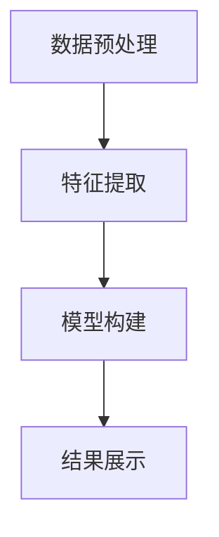

                 

# 知识发现引擎如何助力人类理解世界

> 关键词：知识发现引擎, 大数据技术, 人工智能, 自然语言处理(NLP), 数据挖掘, 信息检索, 商业智能, 预测分析

## 1. 背景介绍

### 1.1 问题由来

随着数字化转型步伐的不断加快，大数据时代已经到来。各行各业的数据量呈指数级增长，人们每天都会产生海量信息。如何从这些海量的数据中提取出有价值的信息和知识，成为了当下最迫切的需求。知识发现引擎作为数据挖掘和大数据技术的重要组成部分，可以通过自动化的方式，从结构化、半结构化、非结构化数据中抽取、分析、建模和展示知识，帮助人们更好地理解世界。

知识发现引擎不仅是数据驱动决策、商业智能、预测分析等高级数据应用的基础，还能推动人工智能、自然语言处理(NLP)等前沿技术的创新与发展。本文将深入探讨知识发现引擎的原理、应用及未来发展方向，以期为大数据时代的知识发现提供新的视角和方法。

### 1.2 问题核心关键点

知识发现引擎的核心在于利用人工智能、机器学习等技术，从数据中挖掘出隐含的知识和规律，并以易于理解和利用的形式呈现出来。其核心步骤包括数据预处理、特征提取、模型构建、结果展示等。

- 数据预处理：对原始数据进行清洗、转换和归一化，确保数据质量和一致性。
- 特征提取：从数据中抽取有效的特征，以供后续模型训练使用。
- 模型构建：基于选择的算法或模型，对数据进行训练，提取知识。
- 结果展示：将模型提取的知识以报告、图形、仪表盘等形式呈现出来，供用户理解和应用。

以下将从数据预处理、特征提取、模型构建和结果展示四个方面，详细阐述知识发现引擎的核心算法原理和操作步骤。

## 2. 核心概念与联系

### 2.1 核心概念概述

知识发现引擎的核心概念包括数据预处理、特征提取、模型构建和结果展示。这些核心概念通过一系列的算法和步骤，实现从原始数据到知识呈现的自动化过程。

- **数据预处理**：通过清洗、转换、归一化等步骤，对数据进行预处理，确保数据的质量和一致性。
- **特征提取**：从数据中提取有意义的特征，为模型训练提供基础。
- **模型构建**：选择合适的算法或模型，对数据进行训练，提取有价值的知识。
- **结果展示**：将提取的知识以报告、图形、仪表盘等形式呈现出来，方便用户理解和应用。

这些核心概念之间的联系可以通过以下Mermaid流程图来展示：



这个流程图展示了知识发现引擎的核心流程：首先对原始数据进行预处理，然后提取特征并选择合适的模型进行训练，最后对提取的知识进行展示。

## 3. 核心算法原理 & 具体操作步骤

### 3.1 算法原理概述

知识发现引擎的算法原理主要基于数据挖掘、机器学习、自然语言处理等领域的经典技术。通过选择合适的算法和模型，从数据中抽取知识，并最终以易于理解和利用的形式呈现出来。

### 3.2 算法步骤详解

知识发现引擎的算法步骤一般包括以下几个关键步骤：

**Step 1: 数据预处理**
- 清洗数据，去除重复、错误、无关信息。
- 数据转换，如日期格式转换、文本编码等。
- 数据归一化，如标准化、归一化处理。

**Step 2: 特征提取**
- 特征选择，选择对模型训练有帮助的特征。
- 特征提取，如从文本中提取关键词、主题、情感等特征。
- 特征变换，如词干提取、词向量转换等。

**Step 3: 模型构建**
- 选择合适的算法或模型，如决策树、随机森林、神经网络、BERT等。
- 模型训练，在标注数据上训练模型，提取知识。
- 模型优化，调整模型参数，提升模型性能。

**Step 4: 结果展示**
- 结果可视化，将模型提取的知识以报告、图形、仪表盘等形式呈现。
- 结果解读，对模型输出进行解释和分析。
- 结果应用，将知识应用于实际业务中。

### 3.3 算法优缺点

知识发现引擎的优点在于能够自动化地从大量数据中提取有价值的信息，以供决策、分析、预测等应用使用。其缺点在于对数据质量、模型选择、特征提取等环节要求较高，需要投入较多的时间和精力。

### 3.4 算法应用领域

知识发现引擎已经广泛应用于各行各业，例如：

- **商业智能**：通过数据分析、预测和可视化，支持企业决策制定。
- **金融分析**：利用大数据技术，进行市场分析、风险评估、客户细分等。
- **医疗健康**：从患者数据中挖掘出有价值的信息，辅助临床诊断和治疗。
- **电商推荐**：分析用户行为数据，提供个性化的产品推荐。
- **智能客服**：通过自然语言处理技术，提升客户服务质量。

## 4. 数学模型和公式 & 详细讲解

### 4.1 数学模型构建

知识发现引擎的数学模型构建主要涉及数据预处理、特征提取和模型训练。这里以一个简单的决策树模型为例，介绍其数学模型构建过程。

假设我们有一组训练数据集 $D=\{(x_i,y_i)\}_{i=1}^N$，其中 $x_i$ 为输入特征，$y_i$ 为输出标签。我们的目标是构建一个决策树模型，将输入特征映射到输出标签。

决策树的数学模型可以表示为：

$$
T(x) = \begin{cases}
\text{Leaf} & \text{if } x \in \text{Leaf}\\
T(\text{Split Attribute}, \text{Split Value}) & \text{else}
\end{cases}
$$

其中，$\text{Split Attribute}$ 为选择的划分属性，$\text{Split Value}$ 为划分属性对应的取值。$\text{Leaf}$ 表示决策树的叶子节点，表示最终的预测结果。

### 4.2 公式推导过程

决策树模型的构建过程主要包括以下几个步骤：

1. **节点选择**：选择最优的划分属性和取值，作为当前节点的划分条件。

2. **节点分裂**：根据选择的划分属性和取值，将当前节点分裂为两个子节点。

3. **递归构建**：对每个子节点重复上述过程，直到满足停止条件。

4. **预测结果**：将新的输入特征递归地映射到叶子节点，得到最终的预测结果。

### 4.3 案例分析与讲解

以一个简单的房价预测数据集为例，展示决策树模型的构建过程。假设我们的数据集包含房屋的面积、卫生间数量、卧室数量等特征，以及房屋的价格。

首先，我们对数据集进行预处理，清洗数据，去除缺失值，转换日期格式等。接着，我们从数据中提取有意义的特征，如面积、卫生间数量、卧室数量等。

然后，我们选择一个最优的划分属性，如卧室数量，将其作为当前节点的划分条件。假设选择卧室数量大于3作为划分条件，将数据集分为两个子集。对每个子集重复上述过程，直到满足停止条件（如叶子节点样本数小于预设值）。

最后，我们将新的输入特征递归地映射到叶子节点，得到最终的预测结果。

## 5. 项目实践：代码实例和详细解释说明

### 5.1 开发环境搭建

在进行知识发现引擎的开发实践前，我们需要准备好开发环境。以下是使用Python进行Scikit-Learn开发的Python环境配置流程：

1. 安装Anaconda：从官网下载并安装Anaconda，用于创建独立的Python环境。

2. 创建并激活虚拟环境：
```bash
conda create -n sklearn-env python=3.8 
conda activate sklearn-env
```

3. 安装Scikit-Learn：
```bash
pip install scikit-learn
```

4. 安装各类工具包：
```bash
pip install numpy pandas matplotlib seaborn jupyter notebook
```

完成上述步骤后，即可在`sklearn-env`环境中开始开发实践。

### 5.2 源代码详细实现

这里我们以一个简单的房价预测为例，给出使用Scikit-Learn库构建决策树模型的Python代码实现。

```python
from sklearn.datasets import load_boston
from sklearn.model_selection import train_test_split
from sklearn.tree import DecisionTreeRegressor
from sklearn.metrics import mean_squared_error

# 加载数据集
boston = load_boston()
X = boston.data
y = boston.target

# 数据集划分
X_train, X_test, y_train, y_test = train_test_split(X, y, test_size=0.2, random_state=42)

# 构建决策树模型
tree_model = DecisionTreeRegressor(max_depth=3, random_state=42)
tree_model.fit(X_train, y_train)

# 模型评估
y_pred = tree_model.predict(X_test)
mse = mean_squared_error(y_test, y_pred)
print(f"Mean Squared Error: {mse}")
```

以上代码实现了使用Scikit-Learn库构建决策树模型，并进行模型评估的过程。可以看到，使用Scikit-Learn库进行知识发现引擎的开发实践，代码实现相对简洁高效。

### 5.3 代码解读与分析

让我们再详细解读一下关键代码的实现细节：

**数据加载与划分**：
- 使用Scikit-Learn库加载波士顿房价数据集，并将其划分为训练集和测试集。

**模型构建**：
- 选择决策树回归器，并设置最大深度为3。
- 在训练集上训练模型，得到最终的决策树模型。

**模型评估**：
- 使用测试集对模型进行评估，计算均方误差（MSE）。
- 输出均方误差，用于衡量模型的预测性能。

可以看到，Scikit-Learn库提供了丰富的模型和算法，可以快速搭建知识发现引擎的基本流程。开发者可以根据实际需求，灵活选择和组合不同的模型和算法，构建更复杂、更高效的知识发现系统。

## 6. 实际应用场景

### 6.1 商业智能

知识发现引擎在商业智能领域有着广泛的应用。通过分析企业的销售数据、客户数据、市场数据等，知识发现引擎可以帮助企业进行市场分析、客户细分、销售预测等，提升企业的决策能力。

### 6.2 金融分析

在金融分析领域，知识发现引擎可以用于风险评估、客户行为分析、市场趋势预测等。通过分析大量的金融数据，知识发现引擎可以提取有价值的信息，帮助金融机构进行风险控制和投资决策。

### 6.3 医疗健康

在医疗健康领域，知识发现引擎可以用于疾病预测、患者分析、医疗资源优化等。通过分析患者的病历数据、基因数据、治疗数据等，知识发现引擎可以提取有价值的信息，帮助医生进行精准诊疗，提升医疗服务质量。

### 6.4 未来应用展望

随着大数据技术和人工智能的不断发展，知识发现引擎的应用领域将进一步扩展。未来，知识发现引擎将在更多领域发挥重要作用，例如：

- **智能制造**：通过分析生产数据，优化生产流程，提升生产效率。
- **智慧城市**：分析城市交通数据、能源数据、环境数据等，提升城市管理水平。
- **智能交通**：通过分析交通数据，优化交通流，提升交通效率。

## 7. 工具和资源推荐

### 7.1 学习资源推荐

为了帮助开发者系统掌握知识发现引擎的理论基础和实践技巧，这里推荐一些优质的学习资源：

1. 《数据科学基础》系列书籍：系统介绍了数据预处理、特征工程、模型选择等知识发现引擎的关键步骤。

2. 《Python数据科学手册》：涵盖了Python中常用的数据处理、机器学习、可视化等工具和库，是入门知识发现引擎的必读书籍。

3. Coursera《数据科学与机器学习》课程：由斯坦福大学开设，系统介绍了数据科学和机器学习的理论基础和实践技巧。

4. Kaggle平台：数据科学竞赛平台，提供大量的数据集和样例代码，帮助开发者实践和提升技能。

5. Scikit-Learn官方文档：Scikit-Learn库的官方文档，提供了丰富的模型和算法介绍，以及详细的代码示例。

通过对这些资源的学习实践，相信你一定能够快速掌握知识发现引擎的精髓，并用于解决实际的业务问题。

### 7.2 开发工具推荐

高效的开发离不开优秀的工具支持。以下是几款用于知识发现引擎开发的常用工具：

1. Jupyter Notebook：交互式的编程环境，支持Python、R等多种语言，方便开发者进行数据处理和模型调试。

2. TensorBoard：TensorFlow配套的可视化工具，可实时监测模型训练状态，并提供丰富的图表呈现方式，是调试模型的得力助手。

3. Apache Spark：大规模数据处理引擎，支持大数据量的数据挖掘和分析。

4. Tableau：数据可视化工具，能够将复杂的数据分析结果以直观的图表和仪表盘形式呈现出来。

5. Power BI：微软的数据分析工具，支持企业级的数据分析和商业智能应用。

合理利用这些工具，可以显著提升知识发现引擎的开发效率，加快创新迭代的步伐。

### 7.3 相关论文推荐

知识发现引擎的研究源于学界的持续研究。以下是几篇奠基性的相关论文，推荐阅读：

1. "A Decision-Theoretic Generalization of On-Line Learning and its Application to Boosting"（Boosting算法）：提出了Boosting算法，极大地提升了机器学习模型的性能。

2. "Introduction to Statistical Learning"（统计学习基础）：介绍了统计学习的基本理论和算法，是数据挖掘领域的经典教材。

3. "An Introduction to Statistical Learning with Applications in R"（R语言应用）：介绍了R语言在数据挖掘和机器学习中的应用，提供了丰富的代码示例。

4. "Feature Selection for Data and Signal Processing"（特征选择）：介绍了特征选择的基本理论和算法，是特征提取领域的重要文献。

5. "Knowledge Discovery and Data Mining"（知识发现与数据挖掘）：总结了知识发现与数据挖掘领域的最新进展，是研究领域的权威书籍。

这些论文代表了大数据技术和知识发现引擎的发展脉络。通过学习这些前沿成果，可以帮助研究者把握学科前进方向，激发更多的创新灵感。

## 8. 总结：未来发展趋势与挑战

### 8.1 总结

本文对知识发现引擎的原理、应用及未来发展方向进行了全面系统的介绍。首先阐述了知识发现引擎在数据驱动决策、商业智能、预测分析等高级数据应用中的重要作用。其次，从数据预处理、特征提取、模型构建和结果展示四个方面，详细讲解了知识发现引擎的核心算法原理和操作步骤，并给出了具体的代码实现和分析。同时，本文还广泛探讨了知识发现引擎在商业智能、金融分析、医疗健康等多个领域的应用前景，展示了知识发现引擎的巨大潜力。最后，本文精选了知识发现引擎的学习资源、开发工具和相关论文，力求为读者提供全方位的技术指引。

通过本文的系统梳理，可以看到，知识发现引擎已经在大数据时代中扮演着越来越重要的角色，成为各行各业的重要工具。未来，伴随大数据技术和人工智能的不断演进，知识发现引擎还将迎来更多的创新和突破。

### 8.2 未来发展趋势

展望未来，知识发现引擎将呈现以下几个发展趋势：

1. **数据处理能力提升**：随着算力资源的不断增长，知识发现引擎将能够处理更大规模的数据集，从而挖掘出更多有价值的信息。

2. **模型多样化**：除了传统的决策树、随机森林等算法，未来还将涌现更多新颖的模型，如深度学习、强化学习等，提升知识发现的能力和效率。

3. **实时化处理**：通过分布式计算和实时流处理技术，知识发现引擎将能够实现对实时数据的处理和分析，提升决策的及时性和有效性。

4. **自动化程度提升**：未来的知识发现引擎将更加智能化，能够自动识别和处理异常数据，自动识别和选择最优模型，实现全自动化流程。

5. **跨领域融合**：知识发现引擎将与其他技术进行更深入的融合，如自然语言处理、计算机视觉、物联网等，实现多模态数据的协同分析。

以上趋势凸显了知识发现引擎的广阔前景。这些方向的探索发展，必将进一步提升知识发现引擎的性能和应用范围，为大数据时代的知识发现提供新的突破。

### 8.3 面临的挑战

尽管知识发现引擎已经取得了瞩目成就，但在迈向更加智能化、普适化应用的过程中，它仍面临着诸多挑战：

1. **数据质量和一致性**：知识发现引擎对数据质量的要求较高，数据清洗和转换过程繁琐，可能导致数据丢失和错误。

2. **模型选择和调参**：模型选择和参数调整需要丰富的经验和专业知识，对开发者提出了较高的要求。

3. **计算资源需求**：知识发现引擎通常需要大量的计算资源，尤其是在处理大规模数据时，资源需求较高。

4. **结果解释性**：模型输出的解释性较弱，难以理解其内部工作机制和决策逻辑，可能影响用户信任和应用效果。

5. **数据隐私和安全**：知识发现过程中涉及大量敏感数据，如何保护数据隐私和安全，是重要的挑战。

6. **业务理解**：知识发现引擎需要与具体业务紧密结合，才能发挥其最大效用，但不同行业的业务复杂度各异，难以一概而论。

正视知识发现引擎面临的这些挑战，积极应对并寻求突破，将使知识发现引擎更好地服务于各行业，推动数据驱动的决策和分析。

### 8.4 研究展望

未来的知识发现引擎研究将在以下几个方面寻求新的突破：

1. **自动化特征选择**：通过自动化特征选择技术，减少人为干预，提升特征提取的效率和质量。

2. **多模态数据融合**：将视觉、语音、文本等多种模态的数据进行融合分析，提升知识发现的能力和深度。

3. **实时流处理**：开发实时流处理算法，支持对实时数据的快速分析和处理，提升决策的及时性和准确性。

4. **模型解释性增强**：通过可解释性算法和工具，增强模型的解释性，使用户能够理解和信任模型的输出。

5. **跨领域应用推广**：将知识发现引擎应用于更多领域，如医疗、交通、教育等，提升各行业的数据分析和决策能力。

这些研究方向的探索，将引领知识发现引擎迈向更高的台阶，为大数据时代的知识发现提供新的思路和方法。

## 9. 附录：常见问题与解答

**Q1：知识发现引擎如何选择合适的模型和算法？**

A: 知识发现引擎的选择模型和算法，需要考虑数据的类型、规模、分布等因素。一般而言，分类任务可以使用决策树、随机森林等模型，回归任务可以使用线性回归、支持向量机等模型，聚类任务可以使用K-means、层次聚类等算法。在选择模型和算法时，还需要结合具体业务需求，进行模型调参和评估，以选择最优模型。

**Q2：如何提高知识发现引擎的实时处理能力？**

A: 提高知识发现引擎的实时处理能力，需要采用分布式计算和流处理技术。例如，使用Apache Spark等分布式计算框架，将数据处理任务分散到多个节点上进行处理。对于实时数据流，可以使用Apache Flink等流处理框架，实现对数据的实时分析和处理。此外，还需要优化算法和模型，降低计算复杂度，提升处理效率。

**Q3：知识发现引擎在处理多模态数据时需要注意哪些问题？**

A: 处理多模态数据时，需要注意不同模态数据之间的融合和转换问题。例如，在文本和图像数据的融合中，需要考虑如何提取有效的特征，以及如何构建多模态模型。此外，还需要考虑数据的异构性、不完全性等问题，采用合适的预处理和转换方法。

**Q4：知识发现引擎在处理非结构化数据时有哪些挑战？**

A: 处理非结构化数据时，主要面临数据清洗、特征提取、模型训练等问题。非结构化数据类型多样，格式不一，需要进行清洗和转换。特征提取需要设计合适的特征表示方法，模型训练需要选择合适的算法和模型。非结构化数据的处理难度较大，需要结合具体应用场景，进行多轮实验和优化。

**Q5：知识发现引擎在应用中如何保护数据隐私和安全？**

A: 在应用知识发现引擎时，需要考虑数据隐私和安全问题。首先，需要对数据进行匿名化处理，去除敏感信息。其次，需要使用安全的传输和存储机制，保护数据不被泄露或篡改。最后，需要对知识发现引擎进行安全审计和监控，防止恶意攻击和滥用。

以上常见问题的解答，希望能为你在使用知识发现引擎时提供一些参考和帮助。

---

作者：禅与计算机程序设计艺术 / Zen and the Art of Computer Programming

