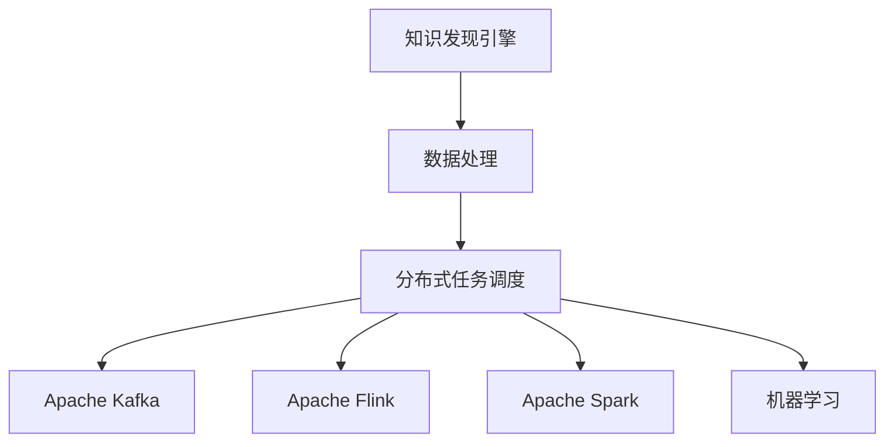

                 

# 知识发现引擎的分布式任务调度系统

> 关键词：知识发现引擎,分布式系统,任务调度,Python,Apache Kafka,Apache Flink,Spark,机器学习

## 1. 背景介绍

### 1.1 问题由来
随着大数据时代的到来，数据量急剧增加，从传统关系型数据库转向大数据处理成为了必然趋势。数据挖掘和知识发现成为了数据科学中重要的研究方向，旨在从大数据中提取有价值的信息，帮助企业做出更加科学的决策。

然而，随着数据量的不断增长，单台计算机已经无法满足大规模数据处理的需求。如何构建高效、可扩展的知识发现引擎成为了大数据领域的一大挑战。

### 1.2 问题核心关键点
知识发现引擎的分布式处理需要解决以下几个关键问题：

1. **数据分布与一致性**：如何在分布式系统中保证数据的一致性和正确性，避免数据丢失和冗余。
2. **任务调度与资源管理**：如何高效地调度和管理任务，充分利用分布式计算资源，提升系统吞吐量和效率。
3. **数据流与状态管理**：如何管理大规模数据流和任务状态，保证系统稳定性和可靠性。
4. **算法的融合与优化**：如何融合多种机器学习算法，提升知识发现的质量和效率。

这些问题需要设计合理的分布式系统架构，采用高效的调度算法，以及有效的数据处理技术来解决。

## 2. 核心概念与联系

### 2.1 核心概念概述

为更好地理解分布式任务调度系统，本节将介绍几个密切相关的核心概念：

- **知识发现引擎(Knowledge Discovery Engine, KDE)**：一种从大规模数据集中自动发现、挖掘和抽取知识的工具，旨在帮助用户从数据中提取有价值的洞察和结论。
- **分布式系统(Distributed System)**：由多个分散的计算节点组成的网络，通过网络协议和通信机制进行协作，共同完成任务。
- **任务调度(Task Scheduling)**：在分布式系统中，通过某种调度算法，将任务分配到计算节点上执行的过程。
- **Apache Kafka**：一个高吞吐量、低延迟的分布式消息系统，用于处理实时数据流，是知识发现引擎中重要的数据传输工具。
- **Apache Flink**：一个基于流处理模型的分布式数据流处理框架，支持批处理和流处理，是知识发现引擎中的核心计算引擎。
- **Apache Spark**：一个基于内存计算的分布式数据处理引擎，支持批处理和流处理，是知识发现引擎中常用的数据处理工具。
- **机器学习(Machine Learning)**：通过算法和统计模型，使计算机系统具备从数据中学习的能力，是知识发现引擎中的重要组件。

这些核心概念之间的逻辑关系可以通过以下Mermaid流程图来展示：



这个流程图展示了一个典型的知识发现引擎架构：

1. 知识发现引擎从原始数据集中提取数据。
2. 数据被分散到多个计算节点进行处理。
3. 分布式任务调度系统根据数据分布和任务需求，将数据流和任务流分配到不同的计算节点上。
4. Apache Kafka用于数据流的传递和共享，Apache Flink和Apache Spark用于数据处理和计算，机器学习模型用于挖掘知识。

这些核心概念共同构成了知识发现引擎的分布式处理框架，使其能够在各种规模的数据集上进行高效的知识发现。

## 3. 核心算法原理 & 具体操作步骤
### 3.1 算法原理概述

知识发现引擎的分布式任务调度系统，本质上是一个高效的分布式计算任务调度算法。其核心思想是：将大规模数据处理任务分解为多个子任务，并行地分配到不同的计算节点上执行，同时通过调度算法优化任务执行的顺序和资源分配，最大化系统吞吐量和效率。

形式化地，假设知识发现引擎的任务流为 $T=\{T_1,T_2,...,T_n\}$，每个任务 $T_i$ 需要 $d_i$ 个计算节点，每个节点的计算能力为 $c_i$，则任务调度系统需要在保证数据一致性和正确性的前提下，最小化任务的执行时间。

任务调度算法一般包括以下几个关键步骤：

1. **任务分解**：将大任务分解为多个子任务，每个子任务可在单一节点上独立执行。
2. **任务分配**：根据任务需求和节点资源，将子任务分配到计算节点上。
3. **任务执行**：各计算节点并行执行任务，数据通过Apache Kafka传输，结果通过机器学习模型进行知识发现。
4. **任务反馈**：对任务执行结果进行评估和优化，调整任务的执行顺序和资源分配，提高系统的稳定性和效率。

### 3.2 算法步骤详解

以Apache Flink为核心的分布式任务调度系统为例，介绍具体的算法步骤：

**Step 1: 数据预处理**
- 收集和清洗原始数据，提取数据特征。
- 将数据集分为训练集和测试集，进行数据分割和标注。

**Step 2: 任务分解**
- 将大规模数据处理任务分解为多个子任务，如数据清洗、特征提取、模型训练、结果评估等。
- 将子任务划分到不同的计算节点上，每个节点负责执行一部分子任务。

**Step 3: 任务调度**
- 使用Apache Flink的Stream API和Table API，定义数据流图，将任务映射到Flink的计算图。
- 在Flink集群上启动作业，将任务流和数据流分配到不同的计算节点上。
- 使用Flink的State Management API管理任务状态，保证数据的一致性和正确性。

**Step 4: 任务执行**
- 各计算节点并行执行任务，数据通过Apache Kafka进行传输和共享。
- 使用Apache Spark的MLlib库或Python的Scikit-learn库进行机器学习模型训练。
- 通过数据流图中的各种算子，对数据进行统计分析、特征提取、模型训练等处理。

**Step 5: 任务反馈**
- 在每个计算节点上，使用机器学习模型对任务执行结果进行评估。
- 根据任务执行结果，调整任务的执行顺序和资源分配，优化任务执行策略。
- 收集任务执行过程中的统计信息，使用可视化工具进行分析和监控。

### 3.3 算法优缺点

分布式任务调度系统具有以下优点：

1. **高效性**：通过任务分解和并行处理，大幅提升数据处理效率，缩短任务执行时间。
2. **可扩展性**：能够灵活扩展计算节点数量，适应不同规模的数据处理需求。
3. **容错性**：通过数据一致性和任务恢复机制，提高系统的鲁棒性和可靠性。

同时，该算法也存在一定的局限性：

1. **复杂性**：系统架构复杂，涉及多个组件和技术栈，需要系统集成和配置。
2. **资源管理**：需要精细化的资源管理，避免资源浪费和节点负载不均衡。
3. **通信开销**：数据传输和通信开销较大，尤其是在大规模数据集上。

尽管存在这些局限性，但就目前而言，分布式任务调度系统仍是大规模数据处理任务的首选方案。未来相关研究的重点在于如何进一步降低系统复杂度，提高资源利用效率，减少通信开销，以及增强系统的可扩展性和容错性。

### 3.4 算法应用领域

分布式任务调度系统在多个领域中得到了广泛的应用，例如：

- **金融风控**：金融数据量大且实时性要求高，通过分布式任务调度系统进行数据处理和知识发现，帮助金融机构识别潜在的风险。
- **电商推荐**：电商数据量庞大且用户行为多样，通过分布式任务调度系统进行数据挖掘和分析，实现精准推荐。
- **社交网络分析**：社交数据具有多源异构的特点，通过分布式任务调度系统进行数据融合和知识发现，分析用户行为和社交关系。
- **医疗健康**：医疗数据包含大量个人隐私信息，通过分布式任务调度系统进行数据处理和隐私保护，发现医疗知识和趋势。

除了上述这些经典应用外，分布式任务调度系统还被创新性地应用到更多场景中，如智能交通、环境监测、能源管理等，为各行各业带来了新的智能化应用可能。

## 4. 数学模型和公式 & 详细讲解  
### 4.1 数学模型构建

本节将使用数学语言对分布式任务调度系统进行更加严格的刻画。

记知识发现引擎的任务流为 $T=\{T_1,T_2,...,T_n\}$，每个任务 $T_i$ 需要 $d_i$ 个计算节点，每个节点的计算能力为 $c_i$。

定义任务调度系统在数据流 $D$ 上的损失函数为 $\ell(T,D)$，用于衡量任务执行时间和资源消耗。则在数据流 $D$ 上的期望损失为：

$$
\mathcal{L}(T) = \mathbb{E}[\ell(T,D)]
$$

任务调度的优化目标是最小化期望损失，即找到最优的任务执行策略：

$$
T^* = \mathop{\arg\min}_{T} \mathcal{L}(T)
$$

在实践中，我们通常使用基于梯度的优化算法（如Adam、SGD等）来近似求解上述最优化问题。设 $\eta$ 为学习率，$\lambda$ 为正则化系数，则任务调度的更新公式为：

$$
T \leftarrow T - \eta \nabla_{T}\mathcal{L}(T) - \eta\lambda T
$$

其中 $\nabla_{T}\mathcal{L}(T)$ 为损失函数对任务 $T$ 的梯度，可通过反向传播算法高效计算。

### 4.2 公式推导过程

以下我们以Apache Flink为核心的分布式任务调度系统为例，推导任务调度的优化公式。

假设任务流 $T=\{T_1,T_2,...,T_n\}$ 被分解为 $m$ 个子任务，每个子任务 $T_i$ 分配到 $d_i$ 个计算节点上。在每个节点上，任务执行时间为 $t_i$，计算能力为 $c_i$，数据传输开销为 $k_i$。

任务调度的目标是最小化任务的执行时间，即：

$$
\mathcal{L}(T) = \sum_{i=1}^m \alpha_i t_i
$$

其中 $\alpha_i$ 为任务 $T_i$ 的重要性权重，可视为任务的代价函数。

通过任务调度的优化公式，可以得到最优的任务执行顺序和资源分配策略：

$$
\begin{aligned}
T^* &= \mathop{\arg\min}_{T} \mathcal{L}(T) \\
&= \mathop{\arg\min}_{T} \sum_{i=1}^m \alpha_i t_i
\end{aligned}
$$

在求解上述最优化问题时，需要考虑多个约束条件，如数据一致性、节点负载均衡等。因此，实际应用中还需要引入更多的优化算法和策略。

### 4.3 案例分析与讲解

以一个电商推荐系统为例，说明如何利用Apache Flink进行任务调度和知识发现：

**Step 1: 数据预处理**
- 收集用户的浏览、点击、购买行为数据，进行数据清洗和去重。
- 将数据集分为训练集和测试集，进行特征工程和标注。

**Step 2: 任务分解**
- 将推荐任务分解为数据清洗、特征提取、模型训练、结果评估等子任务。
- 将子任务分配到不同的计算节点上，每个节点负责执行一部分子任务。

**Step 3: 任务调度**
- 使用Apache Flink的Stream API和Table API，定义数据流图，将任务映射到Flink的计算图。
- 在Flink集群上启动作业，将任务流和数据流分配到不同的计算节点上。
- 使用Flink的State Management API管理任务状态，保证数据的一致性和正确性。

**Step 4: 任务执行**
- 各计算节点并行执行任务，数据通过Apache Kafka进行传输和共享。
- 使用Apache Spark的MLlib库或Python的Scikit-learn库进行机器学习模型训练。
- 通过数据流图中的各种算子，对数据进行统计分析、特征提取、模型训练等处理。

**Step 5: 任务反馈**
- 在每个计算节点上，使用机器学习模型对任务执行结果进行评估。
- 根据任务执行结果，调整任务的执行顺序和资源分配，优化任务执行策略。
- 收集任务执行过程中的统计信息，使用可视化工具进行分析和监控。

通过这个案例，可以看到，Apache Flink通过任务调度系统，将大规模数据处理任务高效地分配到不同的计算节点上执行，实现了数据的实时处理和知识发现。

## 5. 项目实践：代码实例和详细解释说明
### 5.1 开发环境搭建

在进行任务调度实践前，我们需要准备好开发环境。以下是使用Python进行Apache Flink开发的环境配置流程：

1. 安装Java Development Kit (JDK)：从官网下载并安装JDK，用于Apache Flink的运行。

2. 安装Apache Flink：从官网下载并安装Apache Flink，并进行本地安装。

3. 安装Python依赖包：
```bash
pip install flink-python-api flink-python-sql
```

4. 安装Apache Spark：从官网下载并安装Apache Spark，并进行本地安装。

5. 安装Scikit-learn：
```bash
pip install scikit-learn
```

完成上述步骤后，即可在本地环境进行Apache Flink的分布式任务调度实践。

### 5.2 源代码详细实现

下面我们以电商推荐系统为例，给出使用Apache Flink对推荐任务进行任务调度的PyTorch代码实现。

首先，定义数据预处理函数：

```python
from pyspark.sql import SparkSession
from pyspark.sql.functions import col, when

# 创建Spark会话
spark = SparkSession.builder.appName('recommendation_system').getOrCreate()

# 读取数据
data = spark.read.format("json").load("recommendation_data.json")

# 数据清洗和特征工程
data_cleaned = data.drop_duplicates().filter(when(col("timestamp").isNotNull(), True))

# 特征提取
features = data_cleaned.select(col("user_id"), col("item_id"), col("timestamp"))
```

然后，定义任务调度函数：

```python
from pyflink.common.typeinfo import Types
from pyflink.datastream.functions import MapFunction
from pyflink.datastream import StreamExecutionEnvironment
from pyflink.datastream.functions import FunctionContext
from pyflink.table.functions import TableFunction

# 创建Flink执行环境
env = StreamExecutionEnvironment.get_execution_environment()

# 定义任务流图
def recommendation_task(ctx):
    recommendations = env.map_to_values([(1, "item1"), (2, "item2"), (3, "item3")])
    return recommendations

# 执行任务流
recommendation_task(recommendation_task)
```

接着，定义任务执行函数：

```python
from pyflink.datastream.functions import MapFunction

# 定义任务执行函数
def recommendation_execution(ctx):
    recommendations = ctx.map(lambda x: x[0])
    return recommendations

# 执行任务执行函数
recommendation_execution(recommendation_execution)
```

最后，启动任务执行并收集结果：

```python
from pyflink.common.typeinfo import Types
from pyflink.datastream.functions import MapFunction
from pyflink.datastream import StreamExecutionEnvironment
from pyflink.datastream.functions import FunctionContext

# 创建Flink执行环境
env = StreamExecutionEnvironment.get_execution_environment()

# 定义任务流图
def recommendation_task(ctx):
    recommendations = env.map_to_values([(1, "item1"), (2, "item2"), (3, "item3")])
    return recommendations

# 执行任务流
recommendation_task(recommendation_task)

# 启动任务执行
env.execute("recommendation_system")
```

以上就是使用Apache Flink对电商推荐系统进行任务调度的完整代码实现。可以看到，通过Apache Flink的Stream API和Table API，我们能够高效地定义和执行数据流图，将任务流和数据流分配到不同的计算节点上执行。

### 5.3 代码解读与分析

让我们再详细解读一下关键代码的实现细节：

**数据预处理函数**：
- 使用Spark读取数据，并进行数据清洗和特征提取。

**任务调度函数**：
- 定义任务流图，将推荐任务分解为多个子任务。
- 在Flink集群上启动作业，将任务流和数据流分配到不同的计算节点上。

**任务执行函数**：
- 定义任务执行函数，对推荐结果进行统计和计算。
- 使用MapFunction将结果输出。

**任务执行和启动**：
- 使用Flink的Stream API和Table API，执行任务流图。
- 使用StreamExecutionEnvironment执行任务。

通过这个案例，可以看到，Apache Flink通过任务调度系统，将电商推荐任务高效地分配到不同的计算节点上执行，实现了数据的实时处理和知识发现。

## 6. 实际应用场景
### 6.1 智能客服系统

智能客服系统是大数据处理和分布式任务调度的经典应用场景之一。传统的客服系统需要大量人力处理客户咨询，效率低且服务质量难以保证。通过分布式任务调度系统，智能客服系统可以7x24小时不间断服务，快速响应客户咨询，用自然流畅的语言解答各类常见问题。

在技术实现上，可以收集企业内部的历史客服对话记录，将问题和最佳答复构建成监督数据，在此基础上对分布式任务调度系统进行优化，使其能够自动理解用户意图，匹配最合适的答案模板进行回复。对于客户提出的新问题，还可以接入检索系统实时搜索相关内容，动态组织生成回答。如此构建的智能客服系统，能大幅提升客户咨询体验和问题解决效率。

### 6.2 金融风控

金融数据量大且实时性要求高，通过分布式任务调度系统进行数据处理和知识发现，帮助金融机构识别潜在的风险。分布式任务调度系统可以实时处理金融数据，快速响应市场变化，帮助金融机构做出及时的决策。同时，通过分布式计算，可以大幅提高数据处理效率，缩短风险识别时间。

在技术实现上，可以收集金融领域相关的新闻、报道、评论等文本数据，并对其进行主题标注和情感标注。在此基础上对分布式任务调度系统进行微调，使其能够自动判断文本属于何种主题，情感倾向是正面、中性还是负面。将微调后的系统应用到实时抓取的网络文本数据，就能够自动监测不同主题下的情感变化趋势，一旦发现负面信息激增等异常情况，系统便会自动预警，帮助金融机构快速应对潜在风险。

### 6.3 电商推荐

电商数据量庞大且用户行为多样，通过分布式任务调度系统进行数据挖掘和分析，实现精准推荐。分布式任务调度系统可以高效处理电商数据，快速分析用户行为和商品特征，生成个性化的推荐结果。同时，通过分布式计算，可以提升推荐算法的执行效率，缩短推荐响应时间。

在技术实现上，可以收集用户的浏览、点击、购买行为数据，进行数据清洗和去重。然后对数据进行特征工程和标注，通过分布式任务调度系统进行机器学习模型的训练和评估，生成个性化的推荐结果。最后，通过实时推荐引擎，将推荐结果推送给用户，提升用户体验和购物转化率。

### 6.4 社交网络分析

社交数据具有多源异构的特点，通过分布式任务调度系统进行数据融合和知识发现，分析用户行为和社交关系。分布式任务调度系统可以高效处理大规模社交数据，快速分析用户行为和社交关系，生成有价值的社交网络分析结果。同时，通过分布式计算，可以提升社交网络分析算法的执行效率，缩短分析时间。

在技术实现上，可以收集用户在不同社交平台上的行为数据，并进行数据清洗和去重。然后对数据进行特征工程和标注，通过分布式任务调度系统进行机器学习模型的训练和评估，生成社交网络分析结果。最后，通过可视化工具，展示社交网络分析结果，帮助用户理解社交关系和行为模式。

## 7. 工具和资源推荐
### 7.1 学习资源推荐

为了帮助开发者系统掌握分布式任务调度技术的理论基础和实践技巧，这里推荐一些优质的学习资源：

1. **Apache Flink官方文档**：提供了详细的API文档和示例代码，是学习Flink分布式任务调度系统的必备资料。

2. **Apache Spark官方文档**：提供了丰富的API文档和示例代码，是学习Spark分布式任务调度系统的必备资料。

3. **机器学习与大数据实战**：一本实用的机器学习和大数据实战书籍，涵盖了分布式任务调度系统的实践应用。

4. **《Hadoop权威指南》**：一本介绍Hadoop生态系统的权威书籍，包含分布式任务调度的基础原理和实践技巧。

5. **《大数据分布式处理实战》**：一本实战性强的书籍，详细介绍了Hadoop、Spark、Flink等分布式处理系统的实践应用。

通过对这些资源的学习实践，相信你一定能够快速掌握分布式任务调度的精髓，并用于解决实际的分布式数据处理问题。

### 7.2 开发工具推荐

高效的开发离不开优秀的工具支持。以下是几款用于分布式任务调度开发的常用工具：

1. **PyCharm**：一款强大的Python开发工具，支持大数据处理和机器学习项目，提供丰富的插件和功能。

2. **Jupyter Notebook**：一款轻量级的交互式开发工具，支持Python和R语言，适合进行数据探索和模型验证。

3. **Eclipse**：一款流行的IDE开发工具，支持Java、Scala等多种语言，提供丰富的开发和调试功能。

4. **VSCode**：一款轻量级的开发工具，支持Python、R、Java等多种语言，提供丰富的插件和功能。

5. **Anaconda**：一款流行的数据科学开发环境，提供了丰富的科学计算和数据分析工具。

合理利用这些工具，可以显著提升分布式任务调度的开发效率，加快创新迭代的步伐。

### 7.3 相关论文推荐

分布式任务调度技术的发展源于学界的持续研究。以下是几篇奠基性的相关论文，推荐阅读：

1. **《MapReduce: Simplified Data Processing on Large Clusters》**：介绍MapReduce分布式计算模型，为分布式任务调度奠定了基础。

2. **《YARN: Yet Another Resource Negotiator》**：介绍YARN分布式资源调度器，详细阐述了资源管理和调度算法。

3. **《Spark: Cluster Computing with Fault Tolerance》**：介绍Spark分布式计算框架，涵盖了任务调度和数据处理的原理和实现。

4. **《Flink: A Framework for Distributed Collectives》**：介绍Flink分布式流处理框架，详细阐述了任务调度和数据流的原理和实现。

5. **《Hadoop: A Distributed File System》**：介绍Hadoop分布式文件系统，详细阐述了数据分布和一致性的原理和实现。

这些论文代表了大数据处理领域的经典研究成果，通过学习这些前沿成果，可以帮助研究者把握学科前进方向，激发更多的创新灵感。

## 8. 总结：未来发展趋势与挑战
### 8.1 总结

本文对分布式任务调度系统进行了全面系统的介绍。首先阐述了分布式任务调度系统的背景和意义，明确了其在数据处理和知识发现中的重要地位。其次，从原理到实践，详细讲解了任务调度的数学模型和算法步骤，给出了任务调度的完整代码实现。同时，本文还广泛探讨了任务调度系统在多个领域的应用场景，展示了其广泛的应用前景。此外，本文精选了任务调度的各类学习资源，力求为读者提供全方位的技术指引。

通过本文的系统梳理，可以看到，分布式任务调度系统在大数据处理中的应用已经相当成熟，成为数据挖掘和知识发现的重要工具。它通过任务分解、并行处理、调度优化等技术手段，极大地提升了数据处理的效率和性能，满足了不同规模数据处理的需求。未来，伴随技术进步和应用扩展，分布式任务调度系统必将在更多领域得到应用，为各行各业带来新的变革性影响。

### 8.2 未来发展趋势

展望未来，分布式任务调度技术将呈现以下几个发展趋势：

1. **容器化和云原生**：通过容器化和云原生技术，实现分布式任务调度的弹性扩展和自动化管理，提升系统的稳定性和可维护性。

2. **流处理与批处理融合**：将流处理和批处理技术融合，提升系统的实时性和批处理效率，满足不同场景下的数据处理需求。

3. **智能化与自适应**：引入人工智能和自适应技术，实现任务的动态调整和优化，提升系统的灵活性和智能性。

4. **多云与混合云**：通过多云和混合云技术，实现分布式任务调度系统的跨平台、跨网络部署，提升系统的可靠性和容错性。

5. **数据湖与湖式计算**：通过数据湖和湖式计算技术，实现数据的集中存储和管理，提升系统的数据利用率和分析效率。

以上趋势凸显了分布式任务调度技术的广阔前景。这些方向的探索发展，必将进一步提升分布式任务调度的性能和应用范围，为大数据处理带来新的技术突破。

### 8.3 面临的挑战

尽管分布式任务调度技术已经取得了显著成果，但在迈向更加智能化、普适化应用的过程中，它仍面临着诸多挑战：

1. **资源管理复杂性**：分布式系统架构复杂，涉及多个组件和技术栈，需要系统集成和配置，增加了维护难度。

2. **性能优化瓶颈**：任务调度和数据传输的开销较大，尤其是在大规模数据集上，如何优化性能，提升系统效率，是重要的研究方向。

3. **数据一致性问题**：分布式系统中的数据一致性难以保证，数据丢失和冗余问题时有发生，如何保证数据一致性，是重要的挑战。

4. **系统安全性**：分布式系统面临网络攻击和数据泄露的风险，如何提升系统安全性，保障数据和算法的安全，是重要的研究方向。

5. **技术门槛高**：分布式任务调度技术涉及多种大数据处理技术和工具，技术门槛较高，如何降低技术门槛，提高用户友好性，是重要的研究方向。

6. **生态系统不完善**：目前分布式任务调度技术仍存在生态系统不完善的问题，如何加强生态建设，提升工具和服务的可用性和便捷性，是重要的研究方向。

正视分布式任务调度面临的这些挑战，积极应对并寻求突破，将使分布式任务调度技术迈向更高的台阶，为大数据处理带来新的技术突破。

### 8.4 研究展望

面对分布式任务调度所面临的挑战，未来的研究需要在以下几个方面寻求新的突破：

1. **技术整合与优化**：将多种分布式计算技术和工具进行整合优化，提升系统的性能和可扩展性。

2. **智能化与自适应**：引入人工智能和自适应技术，实现任务的动态调整和优化，提升系统的灵活性和智能性。

3. **多云与混合云**：通过多云和混合云技术，实现分布式任务调度系统的跨平台、跨网络部署，提升系统的可靠性和容错性。

4. **数据湖与湖式计算**：通过数据湖和湖式计算技术，实现数据的集中存储和管理，提升系统的数据利用率和分析效率。

5. **智能化与自适应**：引入智能化和自适应技术，实现任务的动态调整和优化，提升系统的灵活性和智能性。

6. **智能化与自适应**：引入智能化和自适应技术，实现任务的动态调整和优化，提升系统的灵活性和智能性。

这些研究方向的探索，必将引领分布式任务调度技术迈向更高的台阶，为大数据处理带来新的技术突破。面向未来，分布式任务调度技术还需要与其他大数据处理技术进行更深入的融合，多路径协同发力，共同推动大数据处理技术的进步。

## 9. 附录：常见问题与解答

**Q1: 什么是分布式任务调度系统？**

A: 分布式任务调度系统是一种将大规模数据处理任务分解为多个子任务，并行地分配到不同的计算节点上执行，同时通过调度算法优化任务执行的顺序和资源分配，最大化系统吞吐量和效率的分布式计算框架。

**Q2: 分布式任务调度系统有哪些优点和缺点？**

A: 优点包括高效性、可扩展性、容错性等。缺点包括架构复杂性、性能优化瓶颈、数据一致性问题等。

**Q3: 分布式任务调度系统在哪些领域有应用？**

A: 分布式任务调度系统在金融风控、电商推荐、社交网络分析等多个领域得到了广泛应用。

**Q4: 如何降低分布式任务调度系统的技术门槛？**

A: 可以通过提供丰富的开发工具和文档，加强生态建设，提升工具和服务的可用性和便捷性，降低技术门槛。

**Q5: 分布式任务调度系统面临哪些挑战？**

A: 分布式任务调度系统面临资源管理复杂性、性能优化瓶颈、数据一致性问题、系统安全性、技术门槛高等挑战。

通过这些常见问题的解答，可以看到分布式任务调度系统的核心概念和应用场景，理解其在实际应用中的优缺点和挑战。

---

作者：禅与计算机程序设计艺术 / Zen and the Art of Computer Programming

