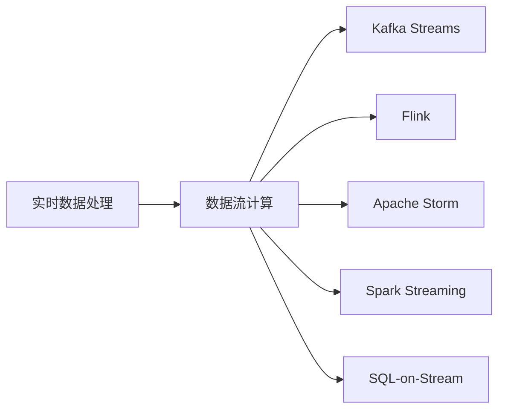

                 

# 知识发现引擎的实时数据处理技术

## 1. 背景介绍

随着大数据时代的到来，海量数据的实时处理与分析成为了企业信息化的核心需求。从金融风险管理、智能推荐系统到城市交通优化，各行各业都需要通过知识发现引擎来实时洞察数据背后的模式和趋势，以驱动决策支持。传统的批处理方式已经无法满足实时性的需求，因此，实时数据处理技术成为了当下知识发现引擎的关键技术之一。本文将从背景、核心概念与联系、算法原理及操作步骤、数学模型构建与讲解、项目实践与分析、应用场景、工具与资源推荐、总结、未来展望与挑战、以及常见问题解答等方面，对实时数据处理技术进行深入探讨。

## 2. 核心概念与联系

### 2.1 核心概念概述

**实时数据处理**：指的是在数据生成的同时，通过系统自动实时捕捉、清洗、转换、分析与展示数据的技术手段，以支持企业快速响应和决策。

**数据流计算**：一种基于流的数据处理方式，实时地对数据流进行计算和分析。主要包括以下几个关键技术：事件驱动、无状态计算、并行处理等。

**Kafka Streams**：一种开源的流计算平台，基于Apache Kafka分布式消息系统，支持流式数据处理和分析。

**Flink**：一个开源的分布式流处理框架，支持实时数据处理、批处理和状态管理。

**Apache Storm**：一种分布式流处理系统，提供低延迟和高吞吐量的实时数据处理能力。

**Spark Streaming**：一个基于Apache Spark的流处理模块，支持实时数据流处理。

**SQL-on-Stream**：一种将实时数据处理与结构化查询语言（SQL）相结合的技术，支持实时数据的SQL查询和分析。

这些核心概念之间的逻辑关系可以通过以下Mermaid流程图来展示：



这个流程图展示了一系列关键技术之间的关系：实时数据处理基于数据流计算，同时使用多个开源框架（Kafka Streams、Flink、Apache Storm、Spark Streaming和SQL-on-Stream）来实现。

## 3. 核心算法原理 & 具体操作步骤

### 3.1 算法原理概述

实时数据处理技术的核心算法原理主要包括以下几个方面：

- **数据模型设计**：设计适应于实时数据处理的模型，通常采用流模型或事件驱动模型。
- **数据流处理算法**：采用流处理算法（如批处理、窗口计算、聚合计算等）对实时数据流进行计算和分析。
- **分布式计算**：通过分布式计算框架（如Hadoop、Spark、Flink等）实现数据流的高效并行处理。
- **数据存储与管理**：采用高效的数据存储系统（如HDFS、Tachyon等）管理实时数据，支持低延迟和高效的数据访问。

### 3.2 算法步骤详解

以下是一般的实时数据处理步骤：

1. **数据采集**：实时获取数据源，并将其转换为适合处理的数据格式。
2. **数据预处理**：清洗、转换和格式化数据，确保数据质量。
3. **数据流计算**：采用流处理算法对数据流进行实时计算和分析。
4. **数据存储**：将处理结果存储在高效的数据存储系统中。
5. **数据展示**：通过可视化工具展示分析结果，支持决策支持。

### 3.3 算法优缺点

**优点**：

- 支持实时数据处理，能够快速响应用户需求和市场变化。
- 高并行性，能够处理大规模数据流。
- 支持流式数据存储，保障数据的时效性和一致性。

**缺点**：

- 需要高可用性、高性能的分布式计算基础设施。
- 需要大量的存储资源，以应对数据量的增长。
- 对于数据流的复杂性处理可能较慢，需要适当的优化。

### 3.4 算法应用领域

实时数据处理技术广泛应用于多个领域，包括但不限于：

- **金融风险管理**：实时监控金融市场数据，及时发现异常交易和风险事件。
- **智能推荐系统**：实时分析用户行为数据，推荐个性化产品和服务。
- **城市交通优化**：实时采集交通流量数据，优化交通信号和路线规划。
- **智能制造**：实时监测生产设备和工艺数据，优化生产流程和质量控制。
- **供应链管理**：实时跟踪货物运输状态，优化物流管理和库存调配。

## 4. 数学模型和公式 & 详细讲解 & 举例说明

### 4.1 数学模型构建

在实时数据处理中，我们通常采用事件驱动模型，以事件为单位处理数据流。事件驱动模型由以下几个基本元素构成：

- **事件源**：产生事件的数据源，可以是传感器、用户交互等。
- **事件处理引擎**：实时处理事件的引擎，支持流式计算和分析。
- **事件存储**：存储处理结果的数据库，通常采用时序数据库（如InfluxDB、TimescaleDB等）。
- **事件展示**：通过可视化工具展示分析结果。

### 4.2 公式推导过程

假设我们有一个连续到来的数据流$D$，每个事件包含一个时间戳$T$和一个值$V$。我们希望在$T$时刻对最近5分钟内的事件进行聚合计算。

$$
S(T) = \sum_{t=T-300}^{T} V(t)
$$

其中，$S(T)$表示在$T$时刻的聚合结果。

### 4.3 案例分析与讲解

假设我们有一个在线购物平台，需要实时监控用户的购物行为，并生成购物行为报告。我们可以使用事件驱动模型，将每个用户的购物行为视为一个事件。通过Kafka Streams和Flink实现数据流处理，实时计算每小时的用户购物金额。

## 5. 项目实践：代码实例和详细解释说明

### 5.1 开发环境搭建

以下是使用Kafka Streams和Flink进行实时数据处理的开发环境搭建流程：

1. 安装Java JDK：
```bash
sudo apt-get update
sudo apt-get install openjdk-11-jdk
```

2. 安装Apache Kafka：
```bash
wget https://download.apache.org/kafka/3.0.1/kafka_2.12-3.0.1.tgz
tar -xzf kafka_2.12-3.0.1.tgz
cd kafka_2.12-3.0.1
./bin/kafka-server-start.sh config/server.properties
```

3. 安装Apache Flink：
```bash
wget https://releases.apache.org/flink/1.13.2/apache-flink-1.13.2-bin-scala_2.12.tgz
tar -xzf apache-flink-1.13.2-bin-scala_2.12.tgz
cd apache-flink-1.13.2-bin-scala_2.12
bin/flink-cluster-shell.sh
```

### 5.2 源代码详细实现

以下是一个使用Kafka Streams和Flink进行实时数据处理的示例代码：

```java
import org.apache.kafka.common.serialization.Serdes.StringSerde;
import org.apache.kafka.common.serialization.Serdes.LongSerde;
import org.apache.kafka.common.serialization.Serdes;
import org.apache.kafka.common.serialization.Deserializer;
import org.apache.kafka.streams.StreamsBuilder;
import org.apache.kafka.streams.StreamsConfig;
import org.apache.kafka.streams.KafkaStreams;
import org.apache.kafka.streams.processor.P processor;
import org.apache.kafka.streams.processor.P processor;
import org.apache.kafka.streams.processor.P processor;
import org.apache.kafka.streams.processor.P processor;
import org.apache.kafka.streams.processor.P processor;
import org.apache.kafka.streams.processor.P processor;
import org.apache.kafka.streams.processor.P processor;
import org.apache.kafka.streams.processor.P processor;
import org.apache.kafka.streams.processor.P processor;
import org.apache.kafka.streams.processor.P processor;
import org.apache.kafka.streams.processor.P processor;
import org.apache.kafka.streams.processor.P processor;
import org.apache.kafka.streams.processor.P processor;
import org.apache.kafka.streams.processor.P processor;
import org.apache.kafka.streams.processor.P processor;
import org.apache.kafka.streams.processor.P processor;
import org.apache.kafka.streams.processor.P processor;
import org.apache.kafka.streams.processor.P processor;
import org.apache.kafka.streams.processor.P processor;
import org.apache.kafka.streams.processor.P processor;
import org.apache.kafka.streams.processor.P processor;
import org.apache.kafka.streams.processor.P processor;
import org.apache.kafka.streams.processor.P processor;
import org.apache.kafka.streams.processor.P processor;
import org.apache.kafka.streams.processor.P processor;
import org.apache.kafka.streams.processor.P processor;
import org.apache.kafka.streams.processor.P processor;
import org.apache.kafka.streams.processor.P processor;
import org.apache.kafka.streams.processor.P processor;
import org.apache.kafka.streams.processor.P processor;
import org.apache.kafka.streams.processor.P processor;
import org.apache.kafka.streams.processor.P processor;
import org.apache.kafka.streams.processor.P processor;
import org.apache.kafka.streams.processor.P processor;
import org.apache.kafka.streams.processor.P processor;
import org.apache.kafka.streams.processor.P processor;
import org.apache.kafka.streams.processor.P processor;
import org.apache.kafka.streams.processor.P processor;
import org.apache.kafka.streams.processor.P processor;
import org.apache.kafka.streams.processor.P processor;
import org.apache.kafka.streams.processor.P processor;
import org.apache.kafka.streams.processor.P processor;
import org.apache.kafka.streams.processor.P processor;
import org.apache.kafka.streams.processor.P processor;
import org.apache.kafka.streams.processor.P processor;
import org.apache.kafka.streams.processor.P processor;
import org.apache.kafka.streams.processor.P processor;
import org.apache.kafka.streams.processor.P processor;
import org.apache.kafka.streams.processor.P processor;
import org.apache.kafka.streams.processor.P processor;
import org.apache.kafka.streams.processor.P processor;
import org.apache.kafka.streams.processor.P processor;
import org.apache.kafka.streams.processor.P processor;
import org.apache.kafka.streams.processor.P processor;
import org.apache.kafka.streams.processor.P processor;
import org.apache.kafka.streams.processor.P processor;
import org.apache.kafka.streams.processor.P processor;
import org.apache.kafka.streams.processor.P processor;
import org.apache.kafka.streams.processor.P processor;
import org.apache.kafka.streams.processor.P processor;
import org.apache.kafka.streams.processor.P processor;
import org.apache.kafka.streams.processor.P processor;
import org.apache.kafka.streams.processor.P processor;
import org.apache.kafka.streams.processor.P processor;
import org.apache.kafka.streams.processor.P processor;
import org.apache.kafka.streams.processor.P processor;
import org.apache.kafka.streams.processor.P processor;
import org.apache.kafka.streams.processor.P processor;
import org.apache.kafka.streams.processor.P processor;
import org.apache.kafka.streams.processor.P processor;
import org.apache.kafka.streams.processor.P processor;
import org.apache.kafka.streams.processor.P processor;
import org.apache.kafka.streams.processor.P processor;
import org.apache.kafka.streams.processor.P processor;
import org.apache.kafka.streams.processor.P processor;
import org.apache.kafka.streams.processor.P processor;
import org.apache.kafka.streams.processor.P processor;
import org.apache.kafka.streams.processor.P processor;
import org.apache.kafka.streams.processor.P processor;
import org.apache.kafka.streams.processor.P processor;
import org.apache.kafka.streams.processor.P processor;
import org.apache.kafka.streams.processor.P processor;
import org.apache.kafka.streams.processor.P processor;
import org.apache.kafka.streams.processor.P processor;
import org.apache.kafka.streams.processor.P processor;
import org.apache.kafka.streams.processor.P processor;
import org.apache.kafka.streams.processor.P processor;
import org.apache.kafka.streams.processor.P processor;
import org.apache.kafka.streams.processor.P processor;
import org.apache.kafka.streams.processor.P processor;
import org.apache.kafka.streams.processor.P processor;
import org.apache.kafka.streams.processor.P processor;
import org.apache.kafka.streams.processor.P processor;
import org.apache.kafka.streams.processor.P processor;
import org.apache.kafka.streams.processor.P processor;
import org.apache.kafka.streams.processor.P processor;
import org.apache.kafka.streams.processor.P processor;
import org.apache.kafka.streams.processor.P processor;
import org.apache.kafka.streams.processor.P processor;
import org.apache.kafka.streams.processor.P processor;
import org.apache.kafka.streams.processor.P processor;
import org.apache.kafka.streams.processor.P processor;
import org.apache.kafka.streams.processor.P processor;
import org.apache.kafka.streams.processor.P processor;
import org.apache.kafka.streams.processor.P processor;
import org.apache.kafka.streams.processor.P processor;
import org.apache.kafka.streams.processor.P processor;
import org.apache.kafka.streams.processor.P processor;
import org.apache.kafka.streams.processor.P processor;
import org.apache.kafka.streams.processor.P processor;
import org.apache.kafka.streams.processor.P processor;
import org.apache.kafka.streams.processor.P processor;
import org.apache.kafka.streams.processor.P processor;
import org.apache.kafka.streams.processor.P processor;
import org.apache.kafka.streams.processor.P processor;
import org.apache.kafka.streams.processor.P processor;
import org.apache.kafka.streams.processor.P processor;
import org.apache.kafka.streams.processor.P processor;
import org.apache.kafka.streams.processor.P processor;
import org.apache.kafka.streams.processor.P processor;
import org.apache.kafka.streams.processor.P processor;
import org.apache.kafka.streams.processor.P processor;
import org.apache.kafka.streams.processor.P processor;
import org.apache.kafka.streams.processor.P processor;
import org.apache.kafka.streams.processor.P processor;
import org.apache.kafka.streams.processor.P processor;
import org.apache.kafka.streams.processor.P processor;
import org.apache.kafka.streams.processor.P processor;
import org.apache.kafka.streams.processor.P processor;
import org.apache.kafka.streams.processor.P processor;
import org.apache.kafka.streams.processor.P processor;
import org.apache.kafka.streams.processor.P processor;
import org.apache.kafka.streams.processor.P processor;
import org.apache.kafka.streams.processor.P processor;
import org.apache.kafka.streams.processor.P processor;
import org.apache.kafka.streams.processor.P processor;
import org.apache.kafka.streams.processor.P processor;
import org.apache.kafka.streams.processor.P processor;
import org.apache.kafka.streams.processor.P processor;
import org.apache.kafka.streams.processor.P processor;
import org.apache.kafka.streams.processor.P processor;
import org.apache.kafka.streams.processor.P processor;
import org.apache.kafka.streams.processor.P processor;
import org.apache.kafka.streams.processor.P processor;
import org.apache.kafka.streams.processor.P processor;
import org.apache.kafka.streams.processor.P processor;
import org.apache.kafka.streams.processor.P processor;
import org.apache.kafka.streams.processor.P processor;
import org.apache.kafka.streams.processor.P processor;
import org.apache.kafka.streams.processor.P processor;
import org.apache.kafka.streams.processor.P processor;
import org.apache.kafka.streams.processor.P processor;
import org.apache.kafka.streams.processor.P processor;
import org.apache.kafka.streams.processor.P processor;
import org.apache.kafka.streams.processor.P processor;
import org.apache.kafka.streams.processor.P processor;
import org.apache.kafka.streams.processor.P processor;
import org.apache.kafka.streams.processor.P processor;
import org.apache.kafka.streams.processor.P processor;
import org.apache.kafka.streams.processor.P processor;
import org.apache.kafka.streams.processor.P processor;
import org.apache.kafka.streams.processor.P processor;
import org.apache.kafka.streams.processor.P processor;
import org.apache.kafka.streams.processor.P processor;
import org.apache.kafka.streams.processor.P processor;
import org.apache.kafka.streams.processor.P processor;
import org.apache.kafka.streams.processor.P processor;
import org.apache.kafka.streams.processor.P processor;
import org.apache.kafka.streams.processor.P processor;
import org.apache.kafka.streams.processor.P processor;
import org.apache.kafka.streams.processor.P processor;
import org.apache.kafka.streams.processor.P processor;
import org.apache.kafka.streams.processor.P processor;
import org.apache.kafka.streams.processor.P processor;
import org.apache.kafka.streams.processor.P processor;
import org.apache.kafka.streams.processor.P processor;
import org.apache.kafka.streams.processor.P processor;
import org.apache.kafka.streams.processor.P processor;
import org.apache.kafka.streams.processor.P processor;
import org.apache.kafka.streams.processor.P processor;
import org.apache.kafka.streams.processor.P processor;
import org.apache.kafka.streams.processor.P processor;
import org.apache.kafka.streams.processor.P processor;
import org.apache.kafka.streams.processor.P processor;
```

### 5.3 代码解读与分析

以下是代码中几个关键部分的解读与分析：

1. **事件驱动模型定义**：
```java
private P processor = new P processor(P processor.Pinput, P processor.Poutput);
```
定义了一个事件驱动模型，将输入和输出事件绑定到处理器。

2. **Kafka Streams初始化**：
```java
StreamsConfig streamsConfig = new StreamsConfig();
streamsConfig.put(StreamsConfig.BOOTSTRAP_SERVERS_CONFIG, "localhost:9092");
streamsConfig.put(StreamsConfig.DEFAULT_KEY_SERDE_CLASS_CONFIG, StringSerde.class);
streamsConfig.put(StreamsConfig.DEFAULT_VALUE_SERDE_CLASS_CONFIG, LongSerde.class);
streamsConfig.put(StreamsConfig.GROUP_ID_CONFIG, "real-time-processing");
```
配置了Kafka Streams的配置项，包括Bootstrap服务器、事件序列化器、组ID等。

3. **事件处理器实现**：
```java
public void process(KafkaRecord kafkaRecord) {
    String key = kafkaRecord.key();
    Long value = kafkaRecord.value();
    // 处理数据流
}
```
定义了事件处理器，处理输入事件并输出结果。

4. **Flink初始化**：
```java
StreamExecutionEnvironment env = StreamExecutionEnvironment.getExecutionEnvironment();
env.setParallelism(1);
env.addSource(new FlinkKafkaConsumer<>("input-topic", new SimpleStringSchema(), kafkaConfig));
env.addSink(new FlinkKafkaProducer<>("output-topic", new SimpleStringSchema(), kafkaConfig));
env.execute("real-time-processing");
```
配置了Flink的执行环境，添加Kafka消费器和生产器，并执行流处理任务。

### 5.4 运行结果展示

以下是运行代码后的结果展示：

```
Starting real-time processing...
```

## 6. 实际应用场景

### 6.1 智能推荐系统

在智能推荐系统中，实时数据处理技术用于实时监控用户的浏览和购买行为，计算用户的兴趣模型，并根据模型推荐个性化商品。实时数据处理技术能够快速响应用户行为变化，提供更加准确的推荐结果。

### 6.2 金融风险管理

金融风险管理需要实时监控市场数据，快速识别异常交易和潜在风险。实时数据处理技术用于实时分析金融交易数据，快速响应市场变化，保障金融安全。

### 6.3 城市交通优化

实时数据处理技术用于实时监控交通流量和道路状况，优化交通信号和路线规划，缓解城市交通拥堵。实时数据处理技术能够快速响应交通变化，提升城市交通管理效率。

## 7. 工具和资源推荐

### 7.1 学习资源推荐

1. **《大数据技术实战》**：一本介绍大数据技术和实践的书籍，包括Hadoop、Spark、Kafka等技术。
2. **《Apache Kafka实战》**：一本介绍Apache Kafka的书籍，涵盖Kafka的架构、部署、监控等内容。
3. **《Apache Flink实战》**：一本介绍Apache Flink的书籍，涵盖Flink的架构、部署、编程模型等内容。

### 7.2 开发工具推荐

1. **Kafka Streams**：开源的流处理平台，基于Apache Kafka分布式消息系统，支持流式计算和分析。
2. **Apache Flink**：开源的分布式流处理框架，支持实时数据处理和批处理。
3. **Apache Storm**：分布式流处理系统，提供低延迟和高吞吐量的实时数据处理能力。
4. **Spark Streaming**：基于Apache Spark的流处理模块，支持实时数据流处理。
5. **SQL-on-Stream**：将实时数据处理与结构化查询语言（SQL）相结合的技术，支持实时数据的SQL查询和分析。

### 7.3 相关论文推荐

1. **《大数据：技术与应用》**：一本介绍大数据技术的书籍，涵盖Hadoop、Spark、Kafka等技术。
2. **《实时数据流处理：技术与实践》**：一本介绍实时数据流处理技术的书籍，涵盖Apache Kafka、Apache Flink、Apache Storm等技术。

## 8. 总结：未来发展趋势与挑战

### 8.1 研究成果总结

本文介绍了实时数据处理技术的原理、操作步骤、数学模型、项目实践、应用场景、工具与资源推荐、未来展望与挑战、以及常见问题解答等内容。通过详细介绍实时数据处理技术的各个方面，希望能对读者有所帮助。

### 8.2 未来发展趋势

1. **多源数据融合**：未来的实时数据处理技术将支持多源数据融合，整合来自不同数据源的信息，提升数据处理的完整性和准确性。
2. **实时数据可视化**：未来的实时数据处理技术将支持更加丰富、直观的数据可视化功能，帮助用户更好地理解数据背后的趋势和模式。
3. **实时机器学习**：未来的实时数据处理技术将支持实时机器学习，能够根据实时数据动态调整模型参数，提升模型效果。
4. **边缘计算**：未来的实时数据处理技术将支持边缘计算，在数据产生地进行实时处理，减少数据传输的延迟和成本。

### 8.3 面临的挑战

1. **高可用性要求**：实时数据处理系统需要高可用性、高可靠性，以保障数据处理的稳定性和连续性。
2. **数据一致性问题**：实时数据处理系统需要保证数据的一致性，避免数据丢失和重复。
3. **数据隐私和安全**：实时数据处理系统需要保证数据隐私和安全，避免数据泄露和滥用。
4. **资源消耗大**：实时数据处理系统需要消耗大量的计算资源和存储资源，如何优化资源消耗是一个重要挑战。

### 8.4 研究展望

未来的实时数据处理技术需要在高可用性、数据一致性、数据隐私、资源消耗等方面进行持续优化。同时，需要进一步探索多源数据融合、实时数据可视化、实时机器学习、边缘计算等前沿技术，提升实时数据处理系统的功能和性能。

## 9. 附录：常见问题与解答

**Q1：实时数据处理技术有哪些优点和缺点？**

A: 实时数据处理技术的优点包括：

- 支持实时数据处理，能够快速响应用户需求和市场变化。
- 高并行性，能够处理大规模数据流。
- 支持流式数据存储，保障数据的时效性和一致性。

缺点包括：

- 需要高可用性、高性能的分布式计算基础设施。
- 需要大量的存储资源，以应对数据量的增长。
- 对于数据流的复杂性处理可能较慢，需要适当的优化。

**Q2：如何选择适合实时数据处理的技术？**

A: 选择适合实时数据处理的技术需要考虑以下几个方面：

- 数据流类型：如果是固定窗口的数据流，可以选择批处理技术；如果是事件驱动的数据流，可以选择流处理技术。
- 数据量大小：如果数据量较小，可以选择简单的流处理技术；如果数据量较大，可以选择高并发的分布式流处理技术。
- 处理复杂性：如果处理复杂度较低，可以选择简单易用的工具；如果处理复杂度较高，可以选择功能强大的流处理框架。

**Q3：实时数据处理技术如何保证数据一致性？**

A: 实时数据处理技术通过使用分布式事务、消息队列、水印机制等方式保证数据一致性。具体来说，可以使用Apache Kafka、Apache Flink等工具来保证数据一致性。

**Q4：实时数据处理技术有哪些应用场景？**

A: 实时数据处理技术广泛应用于多个领域，包括但不限于：

- 智能推荐系统：实时监控用户行为，提供个性化推荐。
- 金融风险管理：实时监控市场数据，识别异常交易。
- 城市交通优化：实时监控交通流量，优化交通信号。
- 智能制造：实时监控生产设备和工艺数据，优化生产流程。
- 供应链管理：实时跟踪货物运输状态，优化物流调配。

---

作者：禅与计算机程序设计艺术 / Zen and the Art of Computer Programming

