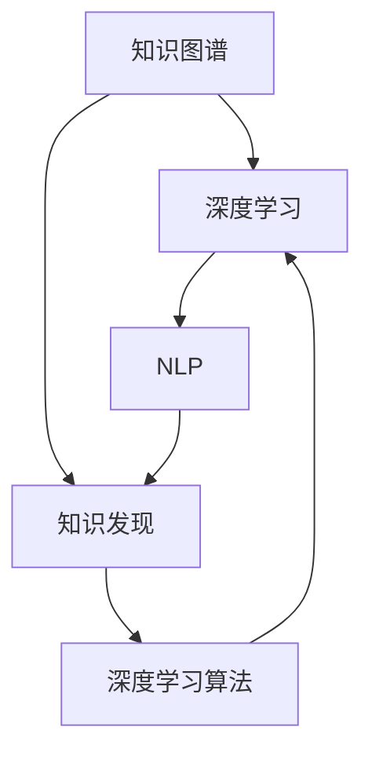

                 

# 知识发现引擎的深度学习应用

> 关键词：知识发现,深度学习,知识图谱,自然语言处理,深度学习算法

## 1. 背景介绍

### 1.1 问题由来

知识发现(Knowledge Discovery in Databases, KDD)是数据挖掘的重要分支，其目标是从数据中挖掘出有用的知识和模式。传统的知识发现方法包括关联规则学习、分类器训练、聚类分析等，但这些方法往往需要专家干预，缺乏自动化和智能化。随着深度学习技术的飞速发展，特别是深度神经网络在图像、语音、文本等复杂结构化数据上的卓越表现，知识发现领域也迎来了新一轮的变革。

深度学习技术通过多层非线性变换，能够从大量数据中学习出高级抽象特征，自动发现数据中的潜在模式和知识结构。在知识发现领域，深度学习技术被广泛应用于知识图谱构建、实体关系识别、属性推断、关联分析等任务，极大提升了知识发现的能力和效率。

### 1.2 问题核心关键点

深度学习在知识发现中的应用主要集中在以下几个方面：

- **知识图谱构建**：利用深度学习技术自动学习数据中实体之间的语义关系，构建知识图谱。
- **实体关系识别**：通过神经网络模型学习实体之间的多种关系，如父子、包含、相互作用等。
- **属性推断**：利用深度学习对已有知识进行迁移学习，预测新实体的属性值。
- **关联分析**：通过神经网络模型学习数据中的复杂关联模式，发现未知的潜在知识。

这些应用领域需要深度学习模型具有强大的数据建模能力和知识迁移能力，而知识图谱和深度学习算法的结合为知识发现提供了新的视角和方法。

## 2. 核心概念与联系

### 2.1 核心概念概述

为更好地理解深度学习在知识发现中的应用，本节将介绍几个密切相关的核心概念：

- **知识图谱(Knowledge Graph)**：以图结构形式表示实体之间的语义关系，是知识发现的重要载体。
- **深度学习(Deep Learning)**：通过多层神经网络对数据进行非线性建模，从原始数据中自动发现规律和模式。
- **知识发现(Knowledge Discovery)**：从数据中挖掘出潜在知识的过程，包含数据清洗、特征提取、模型训练等步骤。
- **自然语言处理(Natural Language Processing, NLP)**：研究如何让计算机理解和处理人类语言的技术，涉及语言建模、语义分析、知识图谱等方向。
- **深度学习算法(Deep Learning Algorithms)**：如卷积神经网络(CNN)、循环神经网络(RNN)、自编码器(Autoencoder)等，是实现深度学习的核心技术。

这些核心概念之间的逻辑关系可以通过以下Mermaid流程图来展示：



这个流程图展示了几类核心概念之间的关联关系：

1. 知识图谱通过深度学习技术进行构建和分析，提取知识结构。
2. 深度学习与NLP技术结合，实现对自然语言的理解与处理。
3. 深度学习算法是实现深度学习模型的基础工具。
4. 知识发现通过深度学习模型自动从数据中挖掘出潜在知识。

这些概念共同构成了深度学习在知识发现领域的应用框架，使得模型能够自动、高效地发现和利用知识。

## 3. 核心算法原理 & 具体操作步骤
### 3.1 算法原理概述

基于深度学习的知识发现主要包含以下几个步骤：

1. **数据预处理**：清洗数据，提取实体、关系等关键信息。
2. **实体嵌入**：将实体转化为向量表示，方便后续的计算和推理。
3. **关系建模**：利用深度学习模型学习实体之间的关系，建立知识图谱。
4. **知识推理**：通过推理引擎对知识图谱进行查询和预测，发现潜在知识。

这些步骤中，深度学习算法主要应用于实体嵌入和关系建模。

### 3.2 算法步骤详解

**Step 1: 数据预处理**

知识发现的首要步骤是数据预处理，通过清洗和标注数据，提取实体和关系等关键信息。数据预处理包括：

1. **数据清洗**：去除噪声和冗余数据，确保数据质量和一致性。
2. **实体标注**：手动或自动对数据中出现的实体进行标注，建立实体列表。
3. **关系标注**：手动或自动标注实体之间的语义关系，建立关系列表。

**Step 2: 实体嵌入**

实体嵌入是将实体转换为向量表示的过程，一般通过神经网络模型实现。常见的实体嵌入模型包括：

- **TransE**：基于关系图嵌入，学习实体-关系-实体三元组的向量表示。
- **TransH**：在TransE的基础上加入属性信息，利用基于属性的关系图嵌入模型。
- **RotatE**：基于旋转矩阵，学习实体-关系-实体三元组的向量表示。

**Step 3: 关系建模**

关系建模是知识发现的核心环节，利用深度学习模型学习实体之间的关系。常见的关系建模方法包括：

- **关系图神经网络(Graph Neural Networks, GNNs)**：利用图卷积网络学习实体-关系-实体三元组之间的语义关系。
- **基于注意力机制的关系模型(Attention-based Relations)**：通过注意力机制，学习实体之间的关系，赋予不同关系不同的权重。
- **变分图嵌入(Variational Graph Embedding)**：利用变分推断方法，学习实体之间的语义关系，并捕获数据的隐含结构。

**Step 4: 知识推理**

知识推理是将知识图谱转化为可操作的形式，通过推理引擎查询和预测实体之间的关系。常见的推理方法包括：

- **逻辑推理**：利用规则或逻辑表达式对知识图谱进行推理。
- **基于深度学习模型的推理**：利用神经网络模型对知识图谱进行推理，如基于图卷积网络、注意力机制等方法。

### 3.3 算法优缺点

深度学习在知识发现中的应用有以下优点：

1. **自动化**：深度学习模型可以自动发现数据中的潜在模式和知识结构，无需人工干预。
2. **高精度**：深度学习模型具有强大的数据建模能力，能够学习复杂的非线性关系。
3. **可扩展性**：深度学习模型可以处理大规模数据集，适应不同规模和复杂度的知识发现任务。
4. **鲁棒性**：深度学习模型具有较强的泛化能力，能够适应不同领域和类型的知识发现任务。

但同时，深度学习在知识发现中也有一些缺点：

1. **数据需求高**：深度学习模型需要大量的标注数据进行训练，数据需求较高。
2. **模型复杂**：深度学习模型的结构较为复杂，训练和推理速度较慢。
3. **解释性差**：深度学习模型通常被认为是"黑盒"，难以解释其内部工作机制。
4. **需要专家干预**：深度学习模型的设计和优化需要大量领域知识和经验，对专家依赖较大。

尽管存在这些局限，但深度学习在知识发现领域的应用前景广阔，是未来知识发现的重要方向。

### 3.4 算法应用领域

基于深度学习的知识发现技术在多个领域得到了广泛应用，例如：

- **生物医学**：从基因序列数据中挖掘潜在的生物学知识，辅助新药研发和疾病诊断。
- **金融分析**：从金融数据中提取关键信息，预测市场趋势和风险。
- **社交网络分析**：从社交网络数据中提取关系模式，发现隐藏的社会网络结构。
- **电商推荐**：从用户行为数据中学习实体之间的关系，实现个性化推荐。
- **智能问答系统**：从知识图谱中检索信息，提供实时问答服务。

除了上述这些应用外，深度学习在知识发现领域还有很多创新应用，如事件驱动的知识发现、跨领域知识迁移等，推动了知识发现的智能化和自动化进程。

## 4. 数学模型和公式 & 详细讲解 & 举例说明

### 4.1 数学模型构建

本节将使用数学语言对深度学习在知识发现中的应用进行更加严格的刻画。

记实体嵌入矩阵为 $E \in \mathbb{R}^{n \times d}$，其中 $n$ 为实体数量，$d$ 为向量维度。假设训练集为 $D=\{(x_i, y_i)\}_{i=1}^N$，其中 $x_i$ 为实体-关系-实体三元组，$y_i$ 为关系标签。

定义损失函数为：

$$
\mathcal{L} = \frac{1}{N}\sum_{i=1}^N \ell(x_i, y_i)
$$

其中 $\ell(x_i, y_i)$ 为损失函数，常见的有交叉熵损失、均方误差损失等。

### 4.2 公式推导过程

以下我们以关系图神经网络(Relational Graph Neural Network, R-GNN)为例，推导其在知识图谱构建中的损失函数。

假设知识图谱为 $G=(V, E)$，其中 $V$ 为实体节点集合，$E$ 为关系边集合。将关系表示为 $E_{i,j}$，则R-GNN的预测关系 $y_{i,j}$ 可以表示为：

$$
y_{i,j} = \sigma(W^R_{i,j} \tanh(W^E_{i,j} [e_i; e_j] + b_R)
$$

其中 $\sigma$ 为激活函数，$W^R_{i,j}$ 和 $W^E_{i,j}$ 为可学习权重矩阵，$[e_i; e_j]$ 为节点 $i$ 和节点 $j$ 的嵌入向量拼接。

对于每个训练样本 $(x_i, y_i)$，其损失函数为：

$$
\ell(x_i, y_i) = -\log \sigma(W^R_{i,j} \tanh(W^E_{i,j} [e_i; e_j] + b_R) + b_y)
$$

对于整个训练集，损失函数为：

$$
\mathcal{L} = \frac{1}{N}\sum_{i=1}^N \ell(x_i, y_i)
$$

### 4.3 案例分析与讲解

以生物医学领域的知识图谱构建为例，讨论深度学习在其中的应用。

假设有一份基因序列数据集，其中每个样本包含基因序列和其对应的疾病信息。目标是学习基因序列与疾病之间的语义关系，构建知识图谱。

**Step 1: 数据预处理**

- 数据清洗：去除噪声和冗余数据，确保数据质量和一致性。
- 实体标注：手动或自动对数据中出现的基因和疾病进行标注，建立实体列表。
- 关系标注：手动或自动标注基因与疾病之间的关系，如"导致"、"影响"等。

**Step 2: 实体嵌入**

- 利用TransE模型学习基因序列和疾病的向量表示。
- 通过神经网络模型学习基因序列和疾病之间的关系，如利用基于注意力机制的关系模型。

**Step 3: 关系建模**

- 利用R-GNN模型学习基因序列和疾病之间的关系，构建知识图谱。
- 通过逻辑推理引擎查询和预测基因序列与疾病之间的关系。

**Step 4: 知识推理**

- 利用深度学习模型对知识图谱进行推理，发现潜在的生物学知识。
- 根据推理结果预测新基因序列的疾病风险。

通过以上步骤，可以构建出一个完整的基于深度学习的知识图谱构建系统，从原始数据中自动发现生物学知识。

## 5. 项目实践：代码实例和详细解释说明

### 5.1 开发环境搭建

在进行深度学习在知识发现中的应用实践前，我们需要准备好开发环境。以下是使用Python进行PyTorch开发的环境配置流程：

1. 安装Anaconda：从官网下载并安装Anaconda，用于创建独立的Python环境。

2. 创建并激活虚拟环境：
```bash
conda create -n pytorch-env python=3.8 
conda activate pytorch-env
```

3. 安装PyTorch：根据CUDA版本，从官网获取对应的安装命令。例如：
```bash
conda install pytorch torchvision torchaudio cudatoolkit=11.1 -c pytorch -c conda-forge
```

4. 安装其它依赖包：
```bash
pip install numpy pandas scikit-learn matplotlib tqdm jupyter notebook ipython
```

完成上述步骤后，即可在`pytorch-env`环境中开始知识发现应用开发。

### 5.2 源代码详细实现

下面以生物医学领域的知识图谱构建为例，给出使用PyTorch实现的关系图神经网络模型的代码实现。

首先，定义R-GNN模型：

```python
import torch
import torch.nn as nn
import torch.nn.functional as F

class RGNNTask(nn.Module):
    def __init__(self, n_entities, n_relations, hidden_dim, dropout):
        super(RGNNTask, self).__init__()
        self.embedding = nn.Embedding(n_entities, hidden_dim)
        self.lin_r = nn.Linear(hidden_dim*2, hidden_dim)
        self.lin_e = nn.Linear(hidden_dim, hidden_dim)
        self.lin_out = nn.Linear(hidden_dim, n_relations)
        self.dropout = nn.Dropout(dropout)

    def forward(self, x, y):
        e_i = self.embedding(x)
        e_j = self.embedding(y)
        r = torch.cat((e_i, e_j), dim=1)
        r = self.dropout(F.relu(self.lin_r(r)))
        r = self.dropout(F.tanh(self.lin_e(r)))
        y_hat = self.lin_out(r)
        return y_hat
```

然后，定义损失函数和优化器：

```python
import torch.nn.functional as F

loss_fn = nn.BCEWithLogitsLoss()
optimizer = torch.optim.Adam(model.parameters(), lr=0.01)
```

接着，定义训练和评估函数：

```python
from torch.utils.data import DataLoader

def train_epoch(model, train_loader, optimizer):
    model.train()
    total_loss = 0
    for batch in train_loader:
        optimizer.zero_grad()
        x, y = batch
        y_hat = model(x, y)
        loss = loss_fn(y_hat, y)
        loss.backward()
        optimizer.step()
        total_loss += loss.item()
    return total_loss / len(train_loader)

def evaluate(model, test_loader):
    model.eval()
    total_loss = 0
    for batch in test_loader:
        x, y = batch
        y_hat = model(x, y)
        loss = loss_fn(y_hat, y)
        total_loss += loss.item()
    return total_loss / len(test_loader)
```

最后，启动训练流程并在测试集上评估：

```python
epochs = 10
batch_size = 32

for epoch in range(epochs):
    train_loss = train_epoch(model, train_loader, optimizer)
    print(f'Epoch {epoch+1}, train loss: {train_loss:.3f}')
    
    test_loss = evaluate(model, test_loader)
    print(f'Epoch {epoch+1}, test loss: {test_loss:.3f}')
```

以上就是使用PyTorch进行生物医学知识图谱构建的完整代码实现。可以看到，通过构建关系图神经网络模型，可以自动学习基因序列与疾病之间的语义关系，构建知识图谱。

### 5.3 代码解读与分析

让我们再详细解读一下关键代码的实现细节：

**RGNNTask类**：
- `__init__`方法：定义模型的各层结构，包括嵌入层、线性层、激活函数、dropout等。
- `forward`方法：定义模型的前向传播过程，包括计算关系嵌入、激活函数、线性变换等。

**损失函数**：
- 使用PyTorch内置的交叉熵损失函数，对预测关系和真实关系进行对比，计算损失。

**训练和评估函数**：
- 利用PyTorch的DataLoader对数据集进行批次化加载，供模型训练和推理使用。
- 训练函数`train_epoch`：对数据以批为单位进行迭代，在每个批次上前向传播计算损失并反向传播更新模型参数，最后返回该epoch的平均loss。
- 评估函数`evaluate`：与训练类似，不同点在于不更新模型参数，并在每个batch结束后将预测和标签结果存储下来，最后使用均方误差计算整个测试集上的平均loss。

**训练流程**：
- 定义总的epoch数和batch size，开始循环迭代
- 每个epoch内，先在训练集上训练，输出平均loss
- 在验证集上评估，输出测试集上的平均loss

可以看到，PyTorch配合深度学习模型使知识图谱构建的代码实现变得简洁高效。开发者可以将更多精力放在模型改进、数据处理等高层逻辑上，而不必过多关注底层的实现细节。

当然，工业级的系统实现还需考虑更多因素，如模型的保存和部署、超参数的自动搜索、更灵活的任务适配层等。但核心的知识图谱构建思路基本与此类似。

## 6. 实际应用场景

### 6.1 智能推荐系统

基于深度学习的知识发现技术在推荐系统中得到了广泛应用，通过知识图谱构建和关系建模，可以提供更加精准和多样化的推荐结果。

在推荐系统中，实体表示为物品，关系表示为物品之间的相似度或关联度，知识图谱表示为物品之间的关系图。通过深度学习模型学习物品之间的语义关系，构建知识图谱，可以发现用户兴趣和物品之间的潜在关联，从而实现更精准的推荐。

**Step 1: 数据预处理**

- 数据清洗：去除噪声和冗余数据，确保数据质量和一致性。
- 实体标注：手动或自动对数据中出现的物品进行标注，建立实体列表。
- 关系标注：手动或自动标注物品之间的关系，如相似度、关联度等。

**Step 2: 实体嵌入**

- 利用TransE模型学习物品的向量表示。
- 通过神经网络模型学习物品之间的关系，如利用基于注意力机制的关系模型。

**Step 3: 关系建模**

- 利用R-GNN模型学习物品之间的关系，构建知识图谱。
- 通过逻辑推理引擎查询和预测物品之间的关系。

**Step 4: 知识推理**

- 利用深度学习模型对知识图谱进行推理，发现潜在的用户兴趣和物品关联。
- 根据推理结果预测用户对新物品的兴趣程度，实现个性化推荐。

通过以上步骤，可以构建出一个完整的基于深度学习的推荐系统，从原始数据中自动发现用户兴趣和物品关联，实现更精准的推荐。

### 6.2 智能问答系统

智能问答系统是深度学习在知识发现领域的重要应用之一，通过知识图谱构建和关系建模，可以实现实时问答服务。

在智能问答系统中，实体表示为问题，关系表示为问题与答案之间的语义关系，知识图谱表示为问题与答案之间的关系图。通过深度学习模型学习问题与答案之间的语义关系，构建知识图谱，可以实时检索知识图谱中的信息，提供准确的回答。

**Step 1: 数据预处理**

- 数据清洗：去除噪声和冗余数据，确保数据质量和一致性。
- 实体标注：手动或自动对数据中提出的问题进行标注，建立实体列表。
- 关系标注：手动或自动标注问题与答案之间的语义关系，如因果关系、相关关系等。

**Step 2: 实体嵌入**

- 利用TransE模型学习问题的向量表示。
- 通过神经网络模型学习问题与答案之间的关系，如利用基于注意力机制的关系模型。

**Step 3: 关系建模**

- 利用R-GNN模型学习问题与答案之间的关系，构建知识图谱。
- 通过逻辑推理引擎查询和预测问题与答案之间的关系。

**Step 4: 知识推理**

- 利用深度学习模型对知识图谱进行推理，发现潜在的知识图谱信息。
- 根据推理结果检索知识图谱中的答案，提供实时问答服务。

通过以上步骤，可以构建出一个完整的基于深度学习的智能问答系统，从原始数据中自动发现问题与答案之间的语义关系，实现实时问答服务。

### 6.3 金融风险控制

金融风险控制是深度学习在知识发现领域的重要应用之一，通过知识图谱构建和关系建模，可以实现对金融数据的深度分析和预测。

在金融风险控制中，实体表示为金融数据，关系表示为金融数据之间的关联关系，知识图谱表示为金融数据的关联图。通过深度学习模型学习金融数据之间的语义关系，构建知识图谱，可以发现潜在的金融风险和异常行为。

**Step 1: 数据预处理**

- 数据清洗：去除噪声和冗余数据，确保数据质量和一致性。
- 实体标注：手动或自动对数据中出现的金融数据进行标注，建立实体列表。
- 关系标注：手动或自动标注金融数据之间的关联关系，如价格变化、交易异常等。

**Step 2: 实体嵌入**

- 利用TransE模型学习金融数据的向量表示。
- 通过神经网络模型学习金融数据之间的关联关系，如利用基于注意力机制的关系模型。

**Step 3: 关系建模**

- 利用R-GNN模型学习金融数据之间的关联关系，构建知识图谱。
- 通过逻辑推理引擎查询和预测金融数据之间的关联关系。

**Step 4: 知识推理**

- 利用深度学习模型对知识图谱进行推理，发现潜在的金融风险和异常行为。
- 根据推理结果预测未来的金融风险和异常行为，进行风险控制。

通过以上步骤，可以构建出一个完整的基于深度学习的金融风险控制系统，从原始数据中自动发现金融风险和异常行为，进行风险控制。

### 6.4 未来应用展望

随着深度学习技术的发展，基于知识图谱的知识发现技术将在更多领域得到应用，为各行各业带来变革性影响。

在智慧城市治理中，基于知识图谱的智能问答系统可以帮助市民快速解决各类问题，提升城市治理效率。

在智慧医疗领域，基于知识图谱的智能问答系统可以提供实时医疗咨询，辅助医生诊疗。

在智慧教育领域，基于知识图谱的智能推荐系统可以为学生推荐个性化的学习内容和路径。

此外，在社会治理、文娱传媒、智能交通等众多领域，基于深度学习的知识发现技术也将不断涌现，为经济社会发展注入新的动力。相信随着技术的日益成熟，知识图谱在深度学习的应用将越来越广泛，为构建智能社会提供坚实的技术支持。

## 7. 工具和资源推荐
### 7.1 学习资源推荐

为了帮助开发者系统掌握深度学习在知识发现中的应用，这里推荐一些优质的学习资源：

1. 《深度学习》书籍：斯坦福大学李飞飞教授的教材，深入浅出地介绍了深度学习的基本概念和应用实例。
2. 《深度学习在自然语言处理中的应用》博文：大模型技术专家撰写，全面介绍了深度学习在NLP领域的应用，包括知识图谱构建、实体关系识别等方向。
3. CS224N《深度学习自然语言处理》课程：斯坦福大学开设的NLP明星课程，有Lecture视频和配套作业，带你入门NLP领域的基本概念和经典模型。
4. 《深度学习在知识图谱中的应用》书籍：详细介绍了深度学习在知识图谱构建和关系建模中的应用，适合深入学习。
5. ArXiv预印本平台：收集了大量深度学习在知识图谱领域的最新研究成果，是前沿探索的好去处。

通过对这些资源的学习实践，相信你一定能够快速掌握深度学习在知识发现中的应用，并用于解决实际的NLP问题。
###  7.2 开发工具推荐

高效的开发离不开优秀的工具支持。以下是几款用于深度学习在知识发现领域应用的常用工具：

1. PyTorch：基于Python的开源深度学习框架，灵活动态的计算图，适合快速迭代研究。大部分深度学习模型都有PyTorch版本的实现。
2. TensorFlow：由Google主导开发的开源深度学习框架，生产部署方便，适合大规模工程应用。同样有丰富的深度学习模型资源。
3. PyGNN：基于PyTorch的图神经网络库，支持多种图结构，易于实现图神经网络模型。
4. NetworkX：Python的图形网络库，可以用于构建和处理各种图形数据结构。
5. Jupyter Notebook：交互式的编程环境，支持Python等语言，适合快速原型开发和数据探索。
6. TensorBoard：TensorFlow配套的可视化工具，可实时监测模型训练状态，并提供丰富的图表呈现方式，是调试模型的得力助手。

合理利用这些工具，可以显著提升深度学习在知识发现领域的应用开发效率，加快创新迭代的步伐。

### 7.3 相关论文推荐

深度学习在知识发现领域的发展源于学界的持续研究。以下是几篇奠基性的相关论文，推荐阅读：

1. Knowledge Graph Embeddings and their Application to Recommender Systems: A Survey：综述了知识图谱嵌入技术在推荐系统中的应用，详细介绍了各种知识图谱嵌入模型。
2. Knowledge Graph Machine Learning：介绍了知识图谱和机器学习的结合，详细讨论了知识图谱学习的方法和应用。
3. How to Discovered: Knowledge Graphs with Neural Networks: 讨论了如何利用神经网络学习知识图谱，详细介绍了各种基于神经网络的知识图谱构建方法。
4. Reasoning in Graph Neural Networks: A Survey：综述了图神经网络在知识推理中的应用，详细介绍了各种图神经网络推理方法。
5. Graph Neural Networks: A Review of Methods and Applications：综述了图神经网络的发展历程和应用领域，详细介绍了各种图神经网络模型。

这些论文代表了大语言模型微调技术的发展脉络。通过学习这些前沿成果，可以帮助研究者把握学科前进方向，激发更多的创新灵感。

## 8. 总结：未来发展趋势与挑战

### 8.1 总结

本文对基于深度学习的知识发现引擎进行了全面系统的介绍。首先阐述了知识发现在大数据时代的重要意义，明确了深度学习在其中的核心作用。其次，从原理到实践，详细讲解了深度学习在知识发现中的应用流程和关键技术。最后，通过多个实际应用场景，展示了深度学习在知识发现领域的广泛应用前景。

通过本文的系统梳理，可以看到，深度学习在知识发现中的应用前景广阔，是未来知识发现的重要方向。深度学习模型通过多层次非线性变换，自动发现数据中的潜在模式和知识结构，具有强大的数据建模能力和知识迁移能力，是实现知识发现的重要手段。

### 8.2 未来发展趋势

展望未来，深度学习在知识发现领域将呈现以下几个发展趋势：

1. **知识图谱的自动化构建**：随着深度学习模型在数据建模方面的突破，知识图谱的构建将更加自动化，需要更少的领域知识和人工干预。
2. **多模态知识发现**：深度学习模型将能够处理文本、图像、语音等多种数据类型，实现跨模态的知识发现。
3. **知识推理的复杂化**：深度学习模型将能够处理更加复杂的知识推理任务，如因果关系推理、类比推理等。
4. **知识发现模型的迁移学习**：深度学习模型将能够更好地实现知识迁移，应用于更多领域和任务。
5. **可解释性增强**：深度学习模型将逐渐具备更好的可解释性，能够解释其内部工作机制和推理逻辑。

这些趋势将推动深度学习在知识发现领域迈向新的高度，为构建智能社会提供坚实的技术支持。

### 8.3 面临的挑战

尽管深度学习在知识发现领域的应用前景广阔，但在迈向更加智能化、普适化应用的过程中，它仍面临着诸多挑战：

1. **数据需求高**：深度学习模型需要大量的标注数据进行训练，数据需求较高。对于某些领域，数据获取成本较高，限制了深度学习的应用。
2. **模型复杂**：深度学习模型的结构较为复杂，训练和推理速度较慢，需要高效的计算资源支持。
3. **可解释性差**：深度学习模型通常被认为是"黑盒"，难以解释其内部工作机制和推理逻辑。这对于高风险领域的应用，如医疗、金融等，是一个重要的挑战。
4. **需要专家干预**：深度学习模型的设计和优化需要大量领域知识和经验，对专家依赖较大。

尽管存在这些局限，但深度学习在知识发现领域的应用前景广阔，是未来知识发现的重要方向。

### 8.4 研究展望

面对深度学习在知识发现领域所面临的挑战，未来的研究需要在以下几个方面寻求新的突破：

1. **低成本数据获取**：探索无监督和半监督学习的方法，利用少量标注数据进行深度学习模型的训练。
2. **模型优化和压缩**：开发更加高效、轻量级的深度学习模型，提升推理速度，优化资源占用。
3. **可解释性增强**：引入可解释性模型和工具，解释深度学习模型的推理逻辑和决策依据。
4. **知识迁移能力提升**：研究知识迁移和跨领域迁移的方法，提升深度学习模型的泛化能力。
5. **多模态融合**：研究多模态数据的融合方法，提升深度学习模型对复杂数据的建模能力。

这些研究方向的探索，必将引领深度学习在知识发现领域迈向更高的台阶，为构建智能社会提供坚实的技术支持。

## 9. 附录：常见问题与解答

**Q1: 深度学习在知识发现中的应用主要有哪些方面？**

A: 深度学习在知识发现中的应用主要包括以下几个方面：

1. **知识图谱构建**：利用深度学习模型学习实体之间的语义关系，构建知识图谱。
2. **实体关系识别**：通过神经网络模型学习实体之间的多种关系，如父子、包含、相互作用等。
3. **属性推断**：利用深度学习对已有知识进行迁移学习，预测新实体的属性值。
4. **关联分析**：通过神经网络模型学习数据中的复杂关联模式，发现未知的潜在知识。

这些应用领域需要深度学习模型具有强大的数据建模能力和知识迁移能力，而知识图谱和深度学习算法的结合为知识发现提供了新的视角和方法。

**Q2: 如何构建知识图谱？**

A: 知识图谱的构建主要包括以下几个步骤：

1. **数据预处理**：清洗数据，提取实体、关系等关键信息。
2. **实体嵌入**：将实体转换为向量表示，方便后续的计算和推理。
3. **关系建模**：利用深度学习模型学习实体之间的关系，建立知识图谱。
4. **知识推理**：通过推理引擎对知识图谱进行查询和预测，发现潜在知识。

其中，实体嵌入和关系建模是知识图谱构建的核心步骤。

**Q3: 深度学习在推荐系统中的应用主要有哪些方面？**

A: 深度学习在推荐系统中的应用主要包括以下几个方面：

1. **知识图谱构建**：构建推荐系统的知识图谱，利用深度学习模型学习物品之间的语义关系。
2. **实体嵌入**：利用深度学习模型学习物品的向量表示。
3. **关系建模**：通过神经网络模型学习物品之间的关系，如利用基于注意力机制的关系模型。
4. **知识推理**：利用深度学习模型对知识图谱进行推理，发现潜在的用户兴趣和物品关联。

通过以上步骤，可以构建出一个完整的基于深度学习的推荐系统，从原始数据中自动发现用户兴趣和物品关联，实现更精准的推荐。

**Q4: 如何构建智能问答系统？**

A: 智能问答系统的构建主要包括以下几个步骤：

1. **数据预处理**：清洗数据，提取问题与答案等关键信息。
2. **实体嵌入**：利用深度学习模型学习问题的向量表示。
3. **关系建模**：通过神经网络模型学习问题与答案之间的关系，如利用基于注意力机制的关系模型。
4. **知识推理**：利用深度学习模型对知识图谱进行推理，检索答案。

通过以上步骤，可以构建出一个完整的基于深度学习的智能问答系统，从原始数据中自动发现问题与答案之间的语义关系，实现实时问答服务。

**Q5: 深度学习在金融风险控制中的应用主要有哪些方面？**

A: 深度学习在金融风险控制中的应用主要包括以下几个方面：

1. **知识图谱构建**：构建金融风险控制系统的知识图谱，利用深度学习模型学习金融数据之间的语义关系。
2. **实体嵌入**：利用深度学习模型学习金融数据的向量表示。
3. **关系建模**：通过神经网络模型学习金融数据之间的关联关系，如利用基于注意力机制的关系模型。
4. **知识推理**：利用深度学习模型对知识图谱进行推理，发现潜在的金融风险和异常行为。

通过以上步骤，可以构建出一个完整的基于深度学习的金融风险控制系统，从原始数据中自动发现金融风险和异常行为，进行风险控制。

**Q6: 深度学习在智慧城市治理中的应用主要有哪些方面？**

A: 深度学习在智慧城市治理中的应用主要包括以下几个方面：

1. **知识图谱构建**：构建智慧城市治理系统的知识图谱，利用深度学习模型学习城市数据之间的语义关系。
2. **实体嵌入**：利用深度学习模型学习城市数据的向量表示。
3. **关系建模**：通过神经网络模型学习城市数据之间的关联关系，如利用基于注意力机制的关系模型。
4. **知识推理**：利用深度学习模型对知识图谱进行推理，发现潜在的城市事件和异常行为。

通过以上步骤，可以构建出一个完整的基于深度学习的智慧城市治理系统，从原始数据中自动发现城市事件和异常行为，提升城市治理效率。

**Q7: 如何处理低成本数据获取问题？**

A: 处理低成本数据获取问题的方法主要包括以下几个方面：

1. **无监督和半监督学习**：利用自监督学习、主动学习等无监督和半监督方法，最大化利用非结构化数据。
2. **知识迁移和跨领域迁移**：将知识迁移和跨领域迁移方法应用于深度学习模型，提升模型的泛化能力。
3. **数据增强和数据合成**：利用数据增强和数据合成技术，生成更多的训练数据。

这些方法可以有效地降低深度学习模型对标注数据的需求，提升模型在低成本数据情况下的性能。

**Q8: 如何处理模型复杂问题？**

A: 处理模型复杂问题的方法主要包括以下几个方面：

1. **模型优化和压缩**：开发更加高效、轻量级的深度学习模型，提升推理速度，优化资源占用。
2. **分布式训练**：利用分布式训练技术，加快模型训练速度。
3. **模型压缩和剪枝**：利用模型压缩和剪枝技术，减少模型参数量，优化计算资源。

这些方法可以有效地处理深度学习模型结构复杂的问题，提升模型的训练和推理效率。

**Q9: 如何处理可解释性问题？**

A: 处理可解释性问题的方法主要包括以下几个方面：

1. **可解释性模型和工具**：引入可解释性模型和工具，解释深度学习模型的推理逻辑和决策依据。
2. **模型可视化和调试**：利用模型可视化和调试工具，可视化模型的内部结构和推理过程。
3. **知识图谱和规则库**：结合知识图谱和规则库，解释深度学习模型的推理逻辑和决策依据。

这些方法可以有效地提升深度学习模型的可解释性，增强模型的透明度和可信度。

**Q10: 如何处理知识迁移问题？**

A: 处理知识迁移问题的方法主要包括以下几个方面：

1. **迁移学习**：利用迁移学习方法，将知识迁移应用于深度学习模型。
2. **跨领域迁移**：研究跨领域迁移方法，提升模型的泛化能力。
3. **多任务学习**：利用多任务学习方法，训练多个相关任务，提升模型的泛化能力。

这些方法可以有效地提升深度学习模型的知识迁移能力，增强模型的泛化能力和适用性。

通过以上常见问题的解答，相信你一定能够更好地理解深度学习在知识发现领域的应用，并用于解决实际的NLP问题。

---

作者：禅与计算机程序设计艺术 / Zen and the Art of Computer Programming

