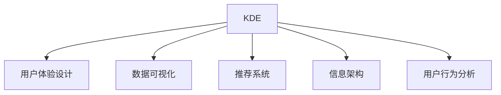

                 

# 知识发现引擎的用户体验设计

> 关键词：知识发现引擎, 用户体验设计, 交互设计, 数据可视化, 推荐系统, 信息架构, 用户行为分析

## 1. 背景介绍

### 1.1 问题由来
在信息爆炸的时代，如何从海量数据中提取有价值的知识，并有效传达给用户，成为企业与组织面临的一大挑战。知识发现引擎(Knowledge Discovery Engine, KDE)应运而生，通过深度学习、自然语言处理、数据挖掘等先进技术，帮助用户在信息海洋中发现隐藏的知识模式和洞察，辅助决策和创新。然而，尽管KDE在技术上已日趋成熟，如何提升用户体验、简化使用流程，使其被更多用户接受和采纳，仍是一大难题。

### 1.2 问题核心关键点
用户对知识发现引擎的体验感，直接影响到其使用意愿和效率。良好的用户体验设计，能够引导用户自然高效地利用KDE，发挥其最大效能。核心关键点包括：

1. **易用性**：KDE应设计简洁明了的交互界面，减少用户学习成本，使用户能够轻松上手。
2. **可理解性**：KDE应具备直观的数据可视化能力，将复杂的知识模式转化为易于理解的形式。
3. **个性化**：KDE应根据用户偏好和行为，提供定制化的知识推荐，增强用户参与度。
4. **互动性**：KDE应提供丰富的互动工具，支持用户探索和验证知识发现结果，加深理解。
5. **反馈机制**：KDE应建立用户反馈循环，根据用户行为调整算法，持续优化推荐结果。

### 1.3 问题研究意义
提升KDE的用户体验，对于促进知识发现的普及应用、加速企业决策和创新、提高个人学习效率，具有重要意义。

- **促进知识发现普及**：改善用户体验，降低使用门槛，吸引更多用户采纳KDE，提升知识发现技术的渗透率。
- **加速企业决策**：通过定制化的知识推荐和直观的数据可视化，帮助管理层快速掌握关键洞察，做出更加明智的决策。
- **提高个人学习效率**：简化知识发现流程，增强学习工具的吸引力和易用性，提升个人在终身学习中的知识获取能力。
- **支撑行业创新**：KDE的用户体验设计，对于提升创新效率、推动行业技术进步，具有重要的推动作用。

## 2. 核心概念与联系

### 2.1 核心概念概述

为更好地理解KDE的用户体验设计，本节将介绍几个密切相关的核心概念：

- **知识发现引擎(KDE)**：通过算法自动从海量数据中提取知识模式和洞察，辅助决策和创新的系统。
- **用户体验设计**：以用户为中心，通过界面设计、交互设计等手段，提升产品易用性和满意度。
- **数据可视化**：将数据以图形、图表等形式呈现，增强数据的可理解性和可解释性。
- **推荐系统**：根据用户历史行为和偏好，推荐最符合其需求的物品或内容，提升用户体验的系统。
- **信息架构**：通过合理组织和呈现信息，提升用户对内容的理解和利用效率。
- **用户行为分析**：通过数据分析技术，了解用户使用习惯和偏好，指导产品优化。

这些核心概念之间的逻辑关系可以通过以下Mermaid流程图来展示：



这个流程图展示了这个核心概念之间的关系：

1. KDE通过数据挖掘、深度学习等技术手段，提取知识模式。
2. 用户体验设计、数据可视化、推荐系统和信息架构，共同构建KDE的用户界面和交互逻辑。
3. 用户行为分析提供反馈，指导系统优化。

## 3. 核心算法原理 & 具体操作步骤
### 3.1 算法原理概述

KDE的用户体验设计，本质上是将复杂的技术算法和数据处理逻辑，通过直观、易用的界面和互动工具，呈现给用户。其核心算法原理包括：

1. **数据预处理**：通过数据清洗、特征工程等步骤，对原始数据进行标准化处理，便于算法训练。
2. **模型训练**：采用深度学习、自然语言处理等算法，训练知识发现模型，提取知识模式。
3. **数据可视化**：将模型输出的知识模式，转化为图形、图表等形式，增强可理解性。
4. **推荐系统**：根据用户行为，推荐相关知识内容，提升用户参与度。
5. **信息架构设计**：构建合理的页面布局和内容组织，提升用户体验。
6. **用户行为分析**：通过用户交互数据，分析用户偏好和行为，指导系统优化。

### 3.2 算法步骤详解

以下是KDE用户体验设计的具体步骤：

**Step 1: 数据收集与预处理**

- 收集与业务相关的数据，如用户行为记录、交易数据、文本记录等。
- 对数据进行清洗，去除噪声和异常值。
- 进行特征工程，提取有意义的特征，便于模型训练。
- 使用ETL工具对数据进行标准化处理，如时间戳对齐、数据归一化等。

**Step 2: 模型选择与训练**

- 根据数据特性选择合适的算法模型，如深度学习模型、协同过滤、基于规则的模型等。
- 在训练集上进行模型训练，调整超参数以优化性能。
- 使用验证集评估模型效果，防止过拟合。
- 对模型进行微调，提高预测准确性。

**Step 3: 数据可视化设计**

- 选择合适的可视化工具和库，如D3.js、Tableau、PowerBI等。
- 设计直观的图表类型，如折线图、散点图、柱状图等，增强数据的可理解性。
- 根据业务需求设计图表布局和交互方式，支持用户自定义和探索。
- 利用交互工具，如鼠标悬停、点击、拖拽等，增强数据交互性。

**Step 4: 推荐系统构建**

- 收集用户历史行为数据，构建用户画像。
- 选择合适的推荐算法，如基于内容的推荐、协同过滤、深度学习等。
- 在推荐系统中，整合KDE输出的知识模式，增强推荐精度。
- 构建推荐模型，调整推荐策略和权重，优化推荐效果。

**Step 5: 信息架构设计**

- 根据业务需求和用户行为，设计合理的页面布局和内容组织。
- 设计清晰的信息层级结构，帮助用户快速定位和理解内容。
- 利用信息架构工具，如Axure、Balsamiq等，进行界面设计和原型制作。
- 进行用户测试，收集反馈，优化界面和交互设计。

**Step 6: 用户行为分析**

- 收集用户交互数据，分析用户行为模式和偏好。
- 使用A/B测试等方法，评估用户对KDE不同功能模块的使用情况。
- 根据用户反馈和行为数据，调整算法和设计，提升用户体验。
- 持续监控用户行为，定期更新和优化系统。

### 3.3 算法优缺点

KDE的用户体验设计在技术实现上具备以下优点：

1. **增强用户理解**：通过直观的数据可视化，帮助用户快速理解复杂的数据模式和洞察。
2. **提高用户参与度**：通过推荐系统，个性化推荐用户感兴趣的内容，增强用户参与和互动。
3. **优化信息呈现**：通过合理的信息架构设计，提升用户对内容的理解和利用效率。
4. **提升决策支持**：通过定制化的知识推荐，帮助用户做出更明智的决策。
5. **简化使用流程**：通过易用的界面和互动工具，降低用户使用门槛，提升使用效率。

同时，这种设计也存在一定的局限性：

1. **数据质量依赖**：KDE的用户体验设计，高度依赖于数据质量。低质量的原始数据，会影响到算法模型的输出效果。
2. **算法复杂度高**：设计高精度的算法模型，需要大量的计算资源和时间成本。
3. **用户差异化需求**：不同用户对数据的理解和需求各异，单一设计方案难以满足所有用户的需求。
4. **交互复杂性**：交互工具和数据可视化设计的复杂度，可能会影响用户的学习曲线和操作效率。
5. **隐私和安全问题**：用户数据涉及隐私和安全，设计过程中需要充分考虑数据保护和隐私问题。

尽管存在这些局限性，但就目前而言，KDE的用户体验设计是推动知识发现技术应用的重要手段。未来相关研究的重点在于如何进一步提升数据质量和算法性能，同时兼顾用户差异化需求和隐私保护问题。

### 3.4 算法应用领域

KDE的用户体验设计在多个行业领域中已得到广泛应用，例如：

- **金融行业**：利用KDE进行风险评估、投资组合优化、市场分析等，辅助决策和风险控制。
- **零售行业**：通过KDE分析用户消费行为和趋势，进行个性化推荐，提升用户体验和销售额。
- **医疗行业**：使用KDE进行病历分析、药物研发、疾病预测等，辅助医疗决策和创新。
- **制造行业**：利用KDE进行供应链优化、质量控制、设备故障预测等，提升生产效率和运营管理。
- **公共安全**：使用KDE进行犯罪分析、疫情监测、情报分析等，提升社会治理和安全保障能力。

除了这些典型应用外，KDE的用户体验设计还在更多领域展现出巨大的潜力，为各行业提供精准的数据洞察和决策支持。

## 4. 数学模型和公式 & 详细讲解  
### 4.1 数学模型构建

本节将使用数学语言对KDE的用户体验设计进行更加严格的刻画。

记KDE的数据集为 $D=\{(x_i, y_i)\}_{i=1}^N, x_i \in \mathcal{X}, y_i \in \mathcal{Y}$，其中 $\mathcal{X}$ 为输入空间，$\mathcal{Y}$ 为输出空间，$y_i$ 表示知识模式，$x_i$ 表示输入数据。

定义KDE在输入 $x$ 上的知识发现模型为 $f: \mathcal{X} \rightarrow \mathcal{Y}$，模型输出为知识模式 $f(x)$。知识发现过程可以分为三个步骤：

1. **数据预处理**：对原始数据 $x$ 进行清洗和标准化处理，得到预处理数据 $\hat{x}$。
2. **模型训练**：在预处理数据 $\hat{x}$ 上训练知识发现模型 $f$，得到参数 $\theta$。
3. **知识可视化**：将模型输出 $f(x)$ 转化为图表等形式，增强可理解性。

### 4.2 公式推导过程

以下我们以金融风险评估为例，推导KDE的知识发现过程。

假设KDE的任务是评估金融交易的违约风险，输入数据为交易记录 $x=\{t_1,t_2,\ldots,t_N\}$，其中 $t_i$ 包含交易时间、金额、交易方等信息。KDE的输出为违约风险 $y \in \{0,1\}$，其中0表示交易无违约风险，1表示交易存在违约风险。

**Step 1: 数据预处理**

对交易记录进行清洗和标准化处理，得到预处理数据 $\hat{x}=\{\hat{t}_1,\hat{t}_2,\ldots,\hat{t}_N\}$，其中 $\hat{t}_i$ 表示预处理后的交易记录。

**Step 2: 模型训练**

采用深度学习算法，如多层感知机(Multilayer Perceptron, MLP)，训练知识发现模型 $f: \mathcal{X} \rightarrow \mathcal{Y}$，得到参数 $\theta$。训练损失函数为交叉熵损失：

$$
\ell(f(x),y) = -[y\log f(x) + (1-y)\log(1-f(x))]
$$

训练过程可以通过梯度下降等优化算法进行。

**Step 3: 知识可视化**

将模型输出 $f(x)$ 转化为图表形式，如直方图、散点图等，直观展示违约风险的分布情况。

### 4.3 案例分析与讲解

以医疗行业中的疾病预测为例，分析KDE的知识发现和用户体验设计过程。

假设KDE的任务是预测某种疾病的发生概率，输入数据为患者历史病历记录 $x=\{x_1,x_2,\ldots,x_N\}$，其中 $x_i$ 包含年龄、性别、家族病史等信息。KDE的输出为疾病发生概率 $y \in [0,1]$。

**Step 1: 数据预处理**

对病历记录进行清洗和标准化处理，得到预处理数据 $\hat{x}=\{\hat{x}_1,\hat{x}_2,\ldots,\hat{x}_N\}$。

**Step 2: 模型训练**

采用深度学习算法，如卷积神经网络(Convolutional Neural Network, CNN)，训练知识发现模型 $f: \mathcal{X} \rightarrow \mathcal{Y}$，得到参数 $\theta$。训练损失函数为均方误差损失：

$$
\ell(f(x),y) = \frac{1}{N}\sum_{i=1}^N (f(x_i)-y_i)^2
$$

**Step 3: 知识可视化**

将模型输出 $f(x)$ 转化为图表形式，如折线图、热力图等，直观展示疾病发生概率的分布情况。

通过上述过程，KDE能够自动提取病历数据中的疾病模式，并辅助医生进行疾病预测和诊断，显著提高诊疗效率和效果。

## 5. 项目实践：代码实例和详细解释说明
### 5.1 开发环境搭建

在进行KDE项目实践前，我们需要准备好开发环境。以下是使用Python进行KDE开发的流程：

1. 安装Anaconda：从官网下载并安装Anaconda，用于创建独立的Python环境。

2. 创建并激活虚拟环境：
```bash
conda create -n kde-env python=3.8 
conda activate kde-env
```

3. 安装KDE相关的工具包：
```bash
pip install pandas numpy scikit-learn matplotlib seaborn matplotlib
```

4. 安装可视化库：
```bash
pip install plotly
```

5. 安装KDE相关的预训练模型和库：
```bash
pip install keras tensorflow
```

完成上述步骤后，即可在`kde-env`环境中开始KDE实践。

### 5.2 源代码详细实现

下面我们以医疗行业中的疾病预测任务为例，给出使用TensorFlow进行KDE开发的PyTorch代码实现。

首先，定义数据处理函数：

```python
import pandas as pd
import numpy as np
from sklearn.model_selection import train_test_split

def load_data(file_path, target_col='diagnosis'):
    data = pd.read_csv(file_path)
    x = data.drop(target_col, axis=1)
    y = data[target_col]
    return x, y

def preprocess_data(x):
    x = x.fillna(x.mean())
    x = (x - x.mean()) / x.std()
    return x

def train_test_split_data(x, y, test_size=0.2, random_state=42):
    x_train, x_test, y_train, y_test = train_test_split(x, y, test_size=test_size, random_state=random_state)
    return x_train, x_test, y_train, y_test
```

然后，定义模型和优化器：

```python
from tensorflow.keras.models import Sequential
from tensorflow.keras.layers import Dense, Dropout, Input, Flatten
from tensorflow.keras.callbacks import EarlyStopping

def build_model(input_dim, output_dim):
    model = Sequential([
        Dense(64, activation='relu', input_dim=input_dim),
        Dropout(0.2),
        Dense(64, activation='relu'),
        Dropout(0.2),
        Dense(output_dim, activation='sigmoid')
    ])
    model.compile(loss='binary_crossentropy', optimizer='adam', metrics=['accuracy'])
    return model

def train_model(model, x_train, y_train, x_test, y_test, epochs=100, batch_size=32):
    model.fit(x_train, y_train, validation_data=(x_test, y_test), epochs=epochs, batch_size=batch_size, callbacks=[EarlyStopping(patience=10)])
    return model
```

接着，定义可视化函数：

```python
import plotly.graph_objects as go
import plotly.express as px

def visualize_model(model, x_train, y_train, y_pred):
    x = x_train
    y = y_train
    y_pred = model.predict(x)
    fig = px.histogram(x, y, color='diagnosis', title='Disease Predictions')
    fig.add_violin(x, y, y_pred, color='diagnosis', title='Disease Predictions')
    fig.show()
```

最后，启动训练流程并在测试集上评估：

```python
# 加载数据
x, y = load_data('data.csv', 'diagnosis')

# 预处理数据
x = preprocess_data(x)

# 数据分割
x_train, x_test, y_train, y_test = train_test_split_data(x, y)

# 构建模型
model = build_model(x_train.shape[1], 1)

# 训练模型
model = train_model(model, x_train, y_train, x_test, y_test)

# 可视化模型输出
visualize_model(model, x_train, y_train, y_test)
```

以上就是使用TensorFlow对医疗行业中的疾病预测任务进行KDE开发的完整代码实现。可以看到，得益于TensorFlow的强大封装，我们可以用相对简洁的代码完成模型训练和可视化过程。

### 5.3 代码解读与分析

让我们再详细解读一下关键代码的实现细节：

**load_data函数**：
- 定义加载数据函数，从指定路径读取CSV文件，返回特征和标签。
- 数据清洗：去除缺失值，使用均值和标准差标准化数据。
- 数据分割：使用sklearn的train_test_split函数进行数据分割，划分为训练集和测试集。

**preprocess_data函数**：
- 对数据进行清洗和标准化处理，去除缺失值，标准化数据，使其更适合模型训练。

**train_model函数**：
- 定义模型结构，使用多层感知机。
- 定义优化器和损失函数，采用Adam优化器和二元交叉熵损失。
- 在训练过程中，使用EarlyStopping回调函数防止过拟合。
- 模型训练后，返回训练好的模型。

**visualize_model函数**：
- 使用plotly库绘制直方图和小提琴图，展示模型输出。
- 通过可视化，直观展示模型对疾病的预测结果。

**训练流程**：
- 定义模型结构，在训练集上进行模型训练。
- 在测试集上评估模型性能，可视化模型输出。

可以看到，TensorFlow的高级API使得KDE的开发过程更加简便高效。开发者可以将更多精力放在模型设计和数据处理上，而不必过多关注底层实现细节。

当然，工业级的系统实现还需考虑更多因素，如模型的保存和部署、超参数的自动搜索、更灵活的任务适配层等。但核心的用户体验设计流程基本与此类似。

## 6. 实际应用场景
### 6.1 医疗行业

在医疗行业中，KDE的应用主要集中在疾病预测、药物研发、个性化治疗等方面。通过KDE，医生和研究人员可以深入分析海量病历数据，挖掘出疾病发生和发展过程中的规律，提高诊疗的准确性和个性化水平。

具体应用场景包括：
- **疾病预测**：利用历史病历数据，预测患者的疾病风险，辅助医生早期干预和治疗。
- **药物研发**：通过分析临床试验数据，发现潜在的新药候选，加速新药的研发进程。
- **个性化治疗**：根据患者的基因、病史等信息，推荐个性化治疗方案，提升治疗效果。

### 6.2 金融行业

金融行业中的风险管理、投资组合优化、市场分析等任务，也通过KDE进行知识发现和决策支持。KDE帮助金融机构洞察市场趋势、识别风险点，提升决策的科学性和精确度。

具体应用场景包括：
- **风险评估**：利用交易记录和财务数据，评估客户的信用风险，进行信用评分。
- **投资组合优化**：通过分析历史市场数据，发现投资组合的最佳配置方案，提升投资收益。
- **市场分析**：预测市场趋势，识别投资机会，辅助投资决策。

### 6.3 零售行业

零售行业中的客户行为分析、产品推荐、库存管理等任务，通过KDE进行优化和智能化。KDE帮助零售企业提升客户满意度、优化库存管理和销售策略。

具体应用场景包括：
- **客户行为分析**：分析客户的购买历史和行为模式，预测未来的购买意向。
- **产品推荐**：根据用户历史购买记录和浏览行为，推荐个性化的商品，提升销售转化率。
- **库存管理**：通过分析销售数据和供应链信息，优化库存水平，减少库存积压和缺货风险。

### 6.4 未来应用展望

随着KDE技术的不断发展，其在更多领域展现出巨大的潜力。未来应用场景包括：

- **智能制造**：通过分析生产数据，预测设备故障，优化生产流程，提升生产效率。
- **智慧城市**：利用城市数据进行智能交通、环境监测、公共安全等决策支持。
- **教育行业**：分析学生学习数据，发现学习规律，提供个性化学习建议，提升学习效果。
- **文化创意**：分析用户评论和反馈，发现流行趋势，辅助内容创作和版权保护。

KDE在各行业的广泛应用，将带来全新的业务模式和商业模式，为社会经济的发展注入新的动力。未来，随着技术的进步和应用的拓展，KDE必将在更多领域发挥其独特的价值，成为推动社会进步的重要工具。

## 7. 工具和资源推荐
### 7.1 学习资源推荐

为了帮助开发者系统掌握KDE的理论基础和实践技巧，这里推荐一些优质的学习资源：

1. **KDE官方文档**：权威的KDE文档，详细介绍了KDE的核心概念、算法原理、应用案例等，是入门KDE的最佳资源。

2. **《深度学习》（Ian Goodfellow著）**：深度学习领域的经典书籍，全面介绍了深度学习的基本概念和算法原理，帮助理解KDE的技术基础。

3. **《Python数据科学手册》（Jake VanderPlas著）**：涵盖Python在数据科学中的应用，包括数据处理、可视化、机器学习等，是学习KDE的必备工具书。

4. **Kaggle竞赛平台**：Kaggle是数据科学竞赛平台，通过参与Kaggle竞赛，可以学习和掌握最新的KDE技术和应用。

5. **在线课程**：Coursera、edX等在线学习平台，提供大量KDE相关的课程，如《深度学习在医疗领域的应用》、《机器学习在金融行业的应用》等。

通过对这些资源的学习实践，相信你一定能够快速掌握KDE的核心思想和实践技巧，并用于解决实际的业务问题。

### 7.2 开发工具推荐

高效的开发离不开优秀的工具支持。以下是几款用于KDE开发的常用工具：

1. **Jupyter Notebook**：开源的交互式笔记本环境，支持Python、R等多种语言，适合快速原型开发和数据探索。

2. **TensorFlow**：由Google开发的深度学习框架，支持分布式计算，适合大规模工程应用。

3. **PyTorch**：由Facebook开发的深度学习框架，灵活易用，适合快速研究原型开发。

4. **Keras**：基于TensorFlow和Theano等后端实现的高级API，适合快速搭建和训练深度学习模型。

5. **Python**：广泛使用的编程语言，适合开发各种KDE应用。

6. **Plotly**：用于数据可视化的Python库，支持多种图表类型，适合展示KDE的输出结果。

合理利用这些工具，可以显著提升KDE的开发效率，加快创新迭代的步伐。

### 7.3 相关论文推荐

KDE的研究源于学界的持续探索。以下是几篇奠基性的相关论文，推荐阅读：

1. **《知识发现和数据挖掘》（Jerry K. intelligers, ed.）**：该书全面介绍了知识发现和数据挖掘的基本概念和算法，是KDE研究的理论基础。

2. **《数据挖掘与统计学习》（J. Goldberger等著）**：涵盖数据挖掘和统计学习的核心内容，帮助理解KDE的理论基础和应用方法。

3. **《数据挖掘：概念与技术》（Peter L. Koukomeris等著）**：介绍数据挖掘的基本概念和算法，适合初学者入门。

4. **《KDE与数据挖掘》（Han J. ed.）**：该书介绍了KDE在各行业中的应用案例，帮助理解KDE的实际应用场景。

5. **《深度学习在金融领域的应用》（L. Kanade等著）**：介绍深度学习在金融领域的应用，帮助理解KDE在金融行业的具体应用。

这些论文代表了大KDE领域的进展和前沿，通过学习这些经典成果，可以帮助研究者深入理解KDE的理论和实践。

## 8. 总结：未来发展趋势与挑战

### 8.1 总结

本文对KDE的用户体验设计进行了全面系统的介绍。首先阐述了KDE的背景和意义，明确了用户体验设计对KDE技术普及应用的重要性。其次，从原理到实践，详细讲解了KDE的用户体验设计过程，包括数据预处理、模型训练、知识可视化、推荐系统构建、信息架构设计、用户行为分析等关键步骤。同时，本文还广泛探讨了KDE在医疗、金融、零售等领域的实际应用场景，展示了KDE的巨大潜力。

通过本文的系统梳理，可以看到，KDE的用户体验设计是推动知识发现技术应用的重要手段。提升用户体验，降低使用门槛，使更多用户采纳KDE，成为KDE发展的重要方向。

### 8.2 未来发展趋势

展望未来，KDE的用户体验设计将呈现以下几个发展趋势：

1. **更智能的算法模型**：未来的KDE将采用更先进的深度学习算法，如卷积神经网络、生成对抗网络等，提升模型的精度和泛化能力。
2. **更直观的数据可视化**：未来的KDE将采用更加丰富的图表类型和交互方式，增强数据的可理解性和可解释性。
3. **更个性化的推荐系统**：未来的KDE将采用更加灵活的推荐算法，如协同过滤、基于内容的推荐、混合推荐等，提高推荐效果和用户满意度。
4. **更合理的信息架构**：未来的KDE将采用更科学的组织方式和展示逻辑，提升用户的利用效率和满意度。
5. **更全面的用户行为分析**：未来的KDE将采用更全面的数据分析工具，如A/B测试、用户调研等，指导系统的优化和改进。

以上趋势凸显了KDE用户体验设计的广阔前景。这些方向的探索发展，将进一步提升KDE的用户体验，使其在更多领域发挥更大的作用。

### 8.3 面临的挑战

尽管KDE的用户体验设计已取得了一定的进展，但在迈向更加智能化、普适化应用的过程中，它仍面临诸多挑战：

1. **数据质量问题**：KDE高度依赖于数据质量，低质量的原始数据会影响到算法的输出效果。如何提升数据质量，保障数据的完整性和一致性，将是重要的研究方向。
2. **算法复杂性**：设计高精度的算法模型，需要大量的计算资源和时间成本。如何简化算法模型，提高计算效率，是一个亟待解决的问题。
3. **用户差异化需求**：不同用户对数据的理解和需求各异，单一设计方案难以满足所有用户的需求。如何设计灵活的交互界面，支持用户自定义和探索，是一个值得深入探索的课题。
4. **交互复杂性**：交互工具和数据可视化设计的复杂度，可能会影响用户的学习曲线和操作效率。如何设计简洁易用的界面，降低用户学习成本，是一个重要的研究方向。
5. **隐私和安全问题**：用户数据涉及隐私和安全，设计过程中需要充分考虑数据保护和隐私问题。如何保障用户数据的安全和隐私，是一个亟待解决的问题。

尽管存在这些挑战，但随着KDE研究的不断深入和技术的不断进步，相信这些挑战终将逐步被克服，KDE必将在更多领域发挥其独特的价值，为社会经济的发展注入新的动力。

### 8.4 研究展望

面向未来，KDE的研究需要在以下几个方面寻求新的突破：

1. **更先进的算法模型**：开发更先进、更高效的算法模型，提升KDE的计算效率和精度。
2. **更智能的推荐系统**：通过引入因果推断和强化学习等思想，提升KDE的推荐精度和鲁棒性。
3. **更全面的数据可视化**：结合因果分析、对比学习等方法，增强KDE的数据可视化能力。
4. **更科学的交互设计**：通过引入心理学、认知科学等知识，设计更符合用户认知的交互界面。
5. **更全面的用户行为分析**：利用多模态数据分析技术，获取更全面的用户行为数据，指导系统的优化和改进。

这些研究方向将推动KDE技术的发展，使其在更多领域发挥更大的作用，推动社会经济的发展。

## 9. 附录：常见问题与解答

**Q1：如何评估KDE的用户体验设计效果？**

A: KDE的用户体验设计效果评估，可以通过以下几种方式进行：
1. **用户满意度调查**：通过问卷调查、用户访谈等方式，了解用户对KDE的使用感受和满意度。
2. **任务完成时间**：测量用户完成特定任务所需的时间，评估用户体验的效率。
3. **错误率和用户帮助请求**：统计用户在使用KDE时产生的错误和帮助请求，评估系统的易用性和支持性。
4. **用户行为分析**：通过分析用户的使用数据，了解用户对KDE的功能使用情况，发现潜在的问题和优化点。
5. **A/B测试**：通过对比不同设计方案的用户使用效果，评估不同设计方案的效果差异。

通过综合以上评估指标，可以全面了解KDE的用户体验设计效果，指导系统的优化和改进。

**Q2：KDE的用户体验设计有哪些关键点？**

A: KDE的用户体验设计关键点包括：
1. **数据预处理**：对原始数据进行清洗、标准化处理，确保数据的准确性和一致性。
2. **模型训练**：选择合适的算法模型，调整超参数，优化模型的性能和泛化能力。
3. **数据可视化**：设计直观的图表类型和交互方式，增强数据的可理解性和可解释性。
4. **推荐系统构建**：根据用户行为，构建个性化推荐系统，提升用户参与度和满意度。
5. **信息架构设计**：构建合理的页面布局和内容组织，提升用户利用效率。
6. **用户行为分析**：通过用户行为数据，分析用户需求和偏好，指导系统的优化和改进。

通过以上关键点，可以设计出高质量的KDE系统，提升用户体验。

**Q3：KDE在各行业中的具体应用有哪些？**

A: KDE在各行业中的具体应用包括：
1. **医疗行业**：疾病预测、药物研发、个性化治疗等。
2. **金融行业**：风险评估、投资组合优化、市场分析等。
3. **零售行业**：客户行为分析、产品推荐、库存管理等。
4. **智能制造**：生产数据预测、设备故障预测等。
5. **智慧城市**：智能交通、环境监测、公共安全等。
6. **教育行业**：学生学习数据分析、个性化学习建议等。
7. **文化创意**：内容创作、版权保护等。

KDE在各行业的广泛应用，将带来全新的业务模式和商业模式，为社会经济的发展注入新的动力。

---

作者：禅与计算机程序设计艺术 / Zen and the Art of Computer Programming

