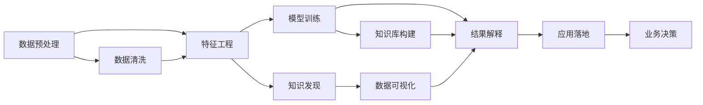

                 

# 知识发现引擎：人工智能时代的智慧伙伴

> 关键词：知识发现引擎,人工智能,智慧伙伴,数据挖掘,数据预处理,机器学习,深度学习,自然语言处理,NLP,深度学习模型,神经网络

## 1. 背景介绍

### 1.1 问题由来
在人工智能迅猛发展的今天，数据成为推动科技进步的关键。然而，在数据总量爆炸式增长的同时，数据的质量和结构也变得越来越复杂。传统的数据处理和分析方法已无法满足日益增长的需求。为了应对这一挑战，知识发现引擎(Knowledge Discovery Engine, KDE)应运而生。

知识发现引擎通过智能化手段，对海量数据进行高效抽取、清洗、建模和应用，帮助企业挖掘隐藏在数据中的知识，辅助决策制定。其核心思想在于将知识从数据中发现出来，并转化为对人类决策有帮助的洞察力。本文将深入探讨知识发现引擎的设计原理、核心算法及其实际应用，为人工智能时代的智慧伙伴提供理论支撑和实践指南。

## 2. 核心概念与联系

### 2.1 核心概念概述

- **知识发现引擎(KDE)**：一种基于人工智能和机器学习的自动化数据分析工具，通过对大规模数据进行多维度分析，揭示数据背后的知识。
- **数据挖掘(Data Mining)**：从数据中自动发现有用信息和知识的过程，包括数据预处理、特征工程、模型训练和结果解释等步骤。
- **机器学习(Machine Learning)**：一种使机器能够通过学习数据特征自动改善算法性能的技术，通常涉及监督学习和无监督学习两种范式。
- **深度学习(Deep Learning)**：一种基于多层神经网络的高效自动特征学习技术，在处理复杂数据结构（如图像、文本等）时表现出色。
- **自然语言处理(NLP)**：使计算机能够理解、解释和生成自然语言的技术，是知识发现引擎的重要应用领域之一。
- **深度学习模型**：如卷积神经网络(CNN)、循环神经网络(RNN)、变换器(Transformer)等，是现代深度学习的基础结构。
- **神经网络(Neural Network)**：由大量人工神经元构成的复杂计算模型，能够自动学习数据特征和规律。

### 2.2 核心概念原理和架构的 Mermaid 流程图



该流程图展示了知识发现引擎的主要工作流程：从原始数据开始，通过数据预处理、特征工程等步骤提取有用信息，然后使用深度学习模型进行训练，提取并解释知识，最后通过数据可视化将发现的知识转化为可行的业务决策。

## 3. 核心算法原理 & 具体操作步骤
### 3.1 算法原理概述

知识发现引擎的核心算法包括数据预处理、特征工程、模型训练、结果解释和知识应用等步骤。下面将逐一介绍这些步骤的原理和具体操作步骤。

### 3.2 算法步骤详解

#### 数据预处理
数据预处理是知识发现引擎的第一步，目的是对原始数据进行清洗和整理，以便后续分析。常用的预处理方法包括：

- 数据清洗：删除重复记录、填补缺失值、处理异常值等。
- 数据归一化：将数据转换为标准格式，减少数据间的差异性。
- 数据采样：选择合适的样本集，如随机采样、分层采样等。

#### 特征工程
特征工程是将原始数据转化为可用于训练模型的特征集的过程。常用的特征工程方法包括：

- 特征选择：选择与目标变量最相关的特征。
- 特征提取：通过映射、编码等方式提取有用特征。
- 特征变换：如PCA降维、生成对抗网络(GAN)生成特征等。

#### 模型训练
模型训练是知识发现引擎的核心环节，通过机器学习或深度学习算法从数据中学习模型。常用的模型训练方法包括：

- 监督学习：如线性回归、支持向量机(SVM)、随机森林等。
- 无监督学习：如聚类、关联规则等。
- 深度学习：如卷积神经网络、循环神经网络、变换器等。

#### 结果解释
结果解释是将模型输出转化为易于理解的知识形式的过程。常用的结果解释方法包括：

- 可视化：如散点图、热力图、时间序列图等。
- 自然语言生成：将数字结果转换为自然语言描述。
- 因果推断：通过因果图等工具揭示变量间的因果关系。

#### 知识应用
知识应用是将发现的知识转化为实际应用的过程。常用的知识应用方法包括：

- 预测分析：如销售预测、用户行为预测等。
- 推荐系统：如商品推荐、内容推荐等。
- 实时决策：如智能客服、金融交易等。

### 3.3 算法优缺点

#### 优点
- **自动化处理**：通过自动化流程，大幅度降低数据处理的复杂度和成本。
- **精确性高**：利用机器学习或深度学习算法，能够从数据中发现精确的知识和规律。
- **适用性强**：适用于各种规模和类型的数据，如图像、文本、时间序列等。

#### 缺点
- **数据依赖性强**：需要大量的高质量标注数据才能训练出高性能模型。
- **模型解释性差**：深度学习模型通常被称为“黑盒”，难以解释其决策过程。
- **计算资源需求高**：深度学习模型对计算资源要求较高，训练和推理时间较长。

### 3.4 算法应用领域

知识发现引擎广泛应用于多个领域，如：

- **金融风控**：通过数据分析和建模，实时监控和预测金融风险，辅助决策制定。
- **电商推荐**：通过用户行为数据分析，提供个性化推荐，提升用户体验和转化率。
- **医疗诊断**：通过患者病历和影像数据建模，辅助医生诊断和治疗。
- **智能客服**：通过自然语言处理技术，自动理解用户意图，提供智能回答。
- **社交媒体分析**：通过文本情感分析和舆情监测，洞察用户情绪和趋势。
- **能源管理**：通过数据分析和建模，优化能源使用和配置，降低成本。

## 4. 数学模型和公式 & 详细讲解 & 举例说明

### 4.1 数学模型构建

知识发现引擎的数学模型构建通常基于数据预处理、特征工程和模型训练的流程。这里以深度学习模型为例，构建一个典型的知识发现引擎模型。

- **输入层**：原始数据经过特征工程处理后，转换为模型可接受的特征向量。
- **隐藏层**：由多个全连接层组成，通过非线性激活函数学习数据特征。
- **输出层**：根据任务需求设计，如分类、回归等。

### 4.2 公式推导过程

以二分类任务为例，假设输入数据为 $x$，输出标签为 $y$，隐藏层节点的激活函数为 $f(\cdot)$，模型参数为 $\theta$。常用的逻辑回归模型可以表示为：

$$
y = \sigma(Wx + b)
$$

其中 $\sigma$ 为sigmoid函数，$W$ 和 $b$ 为模型参数。通过梯度下降等优化算法更新参数 $\theta$，使得模型能够最小化损失函数：

$$
\mathcal{L}(\theta) = -\frac{1}{N}\sum_{i=1}^N [y_i\log\sigma(Wx_i + b) + (1-y_i)\log(1-\sigma(Wx_i + b))]
$$

在实际应用中，通常使用反向传播算法计算梯度并更新参数。通过不断迭代训练，模型能够学习数据特征，并输出正确的分类结果。

### 4.3 案例分析与讲解

**案例分析：电商平台用户行为分析**

电商平台希望通过分析用户行为数据，预测用户购买意愿，从而提升销售额。具体步骤如下：

1. **数据预处理**：收集用户浏览、点击、购买等行为数据，并进行数据清洗、归一化等处理。
2. **特征工程**：选择与购买意愿相关的特征，如浏览时间、点击次数、价格等。
3. **模型训练**：使用随机森林或深度学习模型对特征进行训练，预测用户购买意愿。
4. **结果解释**：通过可视化手段展示模型输出结果，理解不同特征对购买意愿的影响。
5. **知识应用**：根据预测结果，对用户进行个性化推荐，提升用户体验和销售额。

## 5. 项目实践：代码实例和详细解释说明

### 5.1 开发环境搭建

为了进行知识发现引擎的开发，需要先搭建好开发环境。以下是使用Python和TensorFlow进行开发的环境配置流程：

1. 安装Anaconda：从官网下载并安装Anaconda，用于创建独立的Python环境。

2. 创建并激活虚拟环境：
```bash
conda create -n tensorflow-env python=3.8 
conda activate tensorflow-env
```

3. 安装TensorFlow：根据CUDA版本，从官网获取对应的安装命令。例如：
```bash
conda install tensorflow=2.6.0 tf-nightly-cp38-cp38 -c tf -c conda-forge
```

4. 安装Pandas、NumPy、Matplotlib等库：
```bash
pip install pandas numpy matplotlib scikit-learn
```

5. 安装TensorBoard：用于可视化模型训练过程。
```bash
pip install tensorboard
```

完成上述步骤后，即可在`tensorflow-env`环境中开始知识发现引擎的开发。

### 5.2 源代码详细实现

这里以基于TensorFlow的深度学习模型为例，实现一个简单的知识发现引擎。

```python
import tensorflow as tf
import numpy as np
import pandas as pd

# 数据预处理
data = pd.read_csv('data.csv')
data = data.dropna()
data = data.sample(frac=1)  # 随机采样

# 特征工程
features = data[['浏览时间', '点击次数', '价格']]
labels = data['购买意愿']
features = (features - features.mean()) / features.std()  # 标准化

# 模型训练
model = tf.keras.Sequential([
    tf.keras.layers.Dense(64, activation='relu', input_shape=[features.shape[1]]),
    tf.keras.layers.Dense(1, activation='sigmoid')
])
model.compile(optimizer='adam', loss='binary_crossentropy', metrics=['accuracy'])

# 训练模型
model.fit(features, labels, epochs=10, batch_size=32)

# 结果解释
probabilities = model.predict(features)
threshold = 0.5
predictions = [1 if p > threshold else 0 for p in probabilities]
```

### 5.3 代码解读与分析

这里我们详细解读代码实现中的关键部分：

**数据预处理**
- `pd.read_csv('data.csv')`：从CSV文件中读取数据。
- `data.dropna()`：删除缺失值。
- `data.sample(frac=1)`：进行随机采样，保留全部数据。

**特征工程**
- `features = data[['浏览时间', '点击次数', '价格']]`：选择需要的特征。
- `labels = data['购买意愿']`：选择目标变量。
- `features = (features - features.mean()) / features.std()`：标准化特征。

**模型训练**
- `model = tf.keras.Sequential([...])`：定义神经网络模型。
- `model.compile(...)`：编译模型，指定优化器和损失函数。
- `model.fit(...)`：训练模型，指定训练轮数和批量大小。

**结果解释**
- `probabilities = model.predict(features)`：模型预测的概率值。
- `threshold = 0.5`：设置阈值，将概率转换为二分类结果。
- `predictions = [1 if p > threshold else 0 for p in probabilities]`：将预测结果转换为0和1。

## 6. 实际应用场景

### 6.1 金融风控

金融风控是知识发现引擎的重要应用场景之一。金融机构通过分析历史交易数据和客户行为数据，建立风险预测模型，识别潜在的信用风险和欺诈行为。

在实际应用中，可以利用知识发现引擎对以下数据进行建模：

- 交易记录：包括交易时间、金额、类型等信息。
- 客户行为：如贷款申请次数、信用卡使用情况等。
- 社交媒体数据：通过自然语言处理技术，提取用户情绪和行为特征。

通过多维度数据的综合分析，金融机构可以构建多层次的风险评估模型，实时监控和预测信用风险，辅助决策制定。

### 6.2 电商推荐

电商推荐是知识发现引擎的另一个重要应用场景。电商平台通过分析用户行为数据，建立个性化推荐模型，提升用户体验和销售额。

具体而言，可以利用知识发现引擎对以下数据进行建模：

- 用户行为：如浏览、点击、购买记录等。
- 商品属性：如价格、品牌、类别等。
- 社交媒体数据：如评论、评分等。

通过多维度数据的综合分析，电商平台可以构建精准的推荐模型，为用户推荐最感兴趣的商品，提高用户满意度和转化率。

### 6.3 医疗诊断

医疗诊断是知识发现引擎的重要应用领域之一。医院通过分析患者的病历和影像数据，建立疾病预测模型，辅助医生诊断和治疗。

在实际应用中，可以利用知识发现引擎对以下数据进行建模：

- 患者病历：如症状、病史、检查结果等。
- 影像数据：如X光、CT、MRI等。
- 实验室数据：如血常规、生化指标等。

通过多维度数据的综合分析，医院可以构建精准的疾病预测模型，辅助医生诊断和治疗，提高医疗服务质量和效率。

### 6.4 智能客服

智能客服是知识发现引擎的另一个重要应用场景。通过自然语言处理技术，智能客服系统可以自动理解用户意图，提供智能回答，提高客户咨询体验和问题解决效率。

具体而言，可以利用知识发现引擎对以下数据进行建模：

- 用户咨询记录：如问题、回复等。
- 用户历史数据：如购买记录、用户画像等。
- 自然语言处理模型：如BERT、GPT等。

通过多维度数据的综合分析，智能客服系统可以构建精准的意图识别模型，自动理解用户意图，提供智能回答，提升客户咨询体验和问题解决效率。

### 6.5 社交媒体分析

社交媒体分析是知识发现引擎的重要应用领域之一。通过分析社交媒体数据，洞察用户情绪和趋势，预测市场动态。

在实际应用中，可以利用知识发现引擎对以下数据进行建模：

- 社交媒体数据：如微博、微信、抖音等。
- 用户评论：如情感、话题等。
- 新闻数据：如新闻报道、舆情等。

通过多维度数据的综合分析，可以构建精准的情感分析模型，洞察用户情绪和趋势，预测市场动态，为营销决策提供有力支持。

### 6.6 能源管理

能源管理是知识发现引擎的重要应用场景之一。通过数据分析和建模，优化能源使用和配置，降低成本。

具体而言，可以利用知识发现引擎对以下数据进行建模：

- 能源使用数据：如电能、燃气等。
- 环境数据：如气温、湿度等。
- 用户行为数据：如设备使用情况等。

通过多维度数据的综合分析，可以构建精准的能源管理模型，优化能源使用和配置，降低成本，提高能源利用效率。

## 7. 工具和资源推荐

### 7.1 学习资源推荐

为了帮助开发者系统掌握知识发现引擎的理论基础和实践技巧，这里推荐一些优质的学习资源：

1. **《深度学习》**：由深度学习领域的知名专家Ian Goodfellow、Yoshua Bengio和Aaron Courville合著，深入浅出地介绍了深度学习的理论基础和实践技巧。
2. **《机器学习实战》**：由Peter Harrington所著，通过大量的Python代码示例，介绍了机器学习算法和应用。
3. **TensorFlow官方文档**：详细介绍了TensorFlow框架的使用方法，提供了丰富的API参考和代码示例。
4. **PyTorch官方文档**：详细介绍了PyTorch框架的使用方法，提供了丰富的API参考和代码示例。
5. **Kaggle**：提供了大量的数据集和竞赛项目，帮助开发者实践和应用知识发现引擎。

通过对这些资源的学习实践，相信你一定能够快速掌握知识发现引擎的精髓，并用于解决实际的业务问题。

### 7.2 开发工具推荐

高效的开发离不开优秀的工具支持。以下是几款用于知识发现引擎开发的常用工具：

1. **Jupyter Notebook**：一种交互式编程环境，支持Python、R等语言的代码编写和数据可视化，适合快速迭代和共享。
2. **TensorBoard**：用于可视化模型训练和推理过程的工具，可以生成图表和动画，帮助开发者理解和调试模型。
3. **Pandas**：Python中强大的数据处理库，支持数据的清洗、处理和分析。
4. **NumPy**：Python中强大的数值计算库，支持高效的数组操作和科学计算。
5. **Matplotlib**：Python中强大的数据可视化库，支持生成各种类型的图表和动画。
6. **scikit-learn**：Python中强大的机器学习库，支持各种常用的机器学习算法和工具。

合理利用这些工具，可以显著提升知识发现引擎的开发效率，加快创新迭代的步伐。

### 7.3 相关论文推荐

知识发现引擎的发展源于学界的持续研究。以下是几篇奠基性的相关论文，推荐阅读：

1. **《深度学习》**：由深度学习领域的知名专家Ian Goodfellow、Yoshua Bengio和Aaron Courville合著，详细介绍了深度学习的理论基础和实践技巧。
2. **《机器学习》**：由Tom Mitchell所著，介绍了机器学习的基础理论和应用方法。
3. **《数据挖掘：概念与技术》**：由Jerry Kilian、John V., Rheinlander, Jonatan et al. 和Erich W. 合著，详细介绍了数据挖掘的理论基础和应用技术。
4. **《自然语言处理综论》**：由Daniel Jurafsky和James H. Martin合著，介绍了自然语言处理的理论基础和应用方法。
5. **《计算机视觉：模型、学习和推理》**：由David J. C. MacKay合著，详细介绍了计算机视觉的理论基础和应用技术。

这些论文代表了大数据和人工智能领域的经典研究成果，通过学习这些前沿成果，可以帮助研究者把握学科前进方向，激发更多的创新灵感。

## 8. 总结：未来发展趋势与挑战

### 8.1 研究成果总结

本文对知识发现引擎的设计原理、核心算法及其实际应用进行了全面系统的介绍。通过系统的分析，帮助读者深入理解知识发现引擎的工作流程和关键技术。

### 8.2 未来发展趋势

展望未来，知识发现引擎将呈现以下几个发展趋势：

1. **多模态数据融合**：未来的知识发现引擎将更加注重多模态数据的融合，如文本、图像、声音等，构建更为全面的数据模型。
2. **自适应学习**：未来的知识发现引擎将更加注重自适应学习，能够根据数据的变化和业务需求自动调整模型和算法。
3. **实时化处理**：未来的知识发现引擎将更加注重实时化处理，能够实时分析和预测数据变化，提供更快速的决策支持。
4. **强化学习**：未来的知识发现引擎将更加注重强化学习，通过不断试错和反馈，优化模型性能和决策策略。
5. **分布式计算**：未来的知识发现引擎将更加注重分布式计算，通过集群和云计算资源，处理大规模数据集。

### 8.3 面临的挑战

尽管知识发现引擎已经取得了一定的进展，但在迈向更加智能化、普适化应用的过程中，仍面临诸多挑战：

1. **数据质量和规模**：知识发现引擎需要大量高质量的数据才能训练出高性能模型，数据质量和规模的不足将制约模型的性能。
2. **计算资源需求**：深度学习模型的计算资源需求较高，如何降低计算成本，提高模型训练和推理效率，是未来亟待解决的问题。
3. **模型可解释性**：深度学习模型通常被称为“黑盒”，难以解释其决策过程，如何提高模型的可解释性和透明度，是未来重要的研究方向。
4. **隐私和安全**：知识发现引擎涉及大量敏感数据，如何保护数据隐私和安全，是未来必须解决的问题。
5. **跨领域应用**：知识发现引擎在不同领域的应用场景中，可能存在特定的挑战，如医疗、金融、教育等，需要针对不同领域进行优化。

### 8.4 研究展望

面对知识发现引擎所面临的挑战，未来的研究需要在以下几个方面寻求新的突破：

1. **分布式深度学习**：利用分布式计算资源，加速深度学习模型的训练和推理过程。
2. **自适应模型优化**：开发自适应模型优化算法，使模型能够根据数据变化和业务需求自动调整。
3. **跨领域知识迁移**：研究跨领域知识迁移方法，使知识发现引擎在不同领域之间实现知识共享和迁移。
4. **模型可解释性**：开发可解释性模型算法，使知识发现引擎的决策过程更加透明和可信。
5. **隐私保护技术**：研究隐私保护技术，如差分隐私、联邦学习等，保护数据隐私和安全。

这些研究方向的探索，必将引领知识发现引擎技术迈向更高的台阶，为人工智能时代的智慧伙伴提供更加强大、灵活、安全的数据分析能力。面向未来，知识发现引擎需要不断创新和突破，才能在多个领域中发挥更大的作用。

## 9. 附录：常见问题与解答

**Q1：知识发现引擎的输入数据需要满足哪些条件？**

A: 知识发现引擎的输入数据需要满足以下几个条件：

1. **数据完整性**：数据应该完整无缺失，尽量减少数据丢失和噪声。
2. **数据质量**：数据应该真实、可靠，避免虚假信息和异常值。
3. **数据一致性**：数据应该一致，避免重复记录和冲突。
4. **数据格式**：数据应该具有统一的格式和标准，方便处理和分析。

**Q2：知识发现引擎的输出结果如何解释？**

A: 知识发现引擎的输出结果通常需要经过可视化处理，以便更好地理解和使用。常见的可视化方法包括：

1. **图表可视化**：如散点图、柱状图、饼图等，展示数据分布和趋势。
2. **热力图可视化**：展示特征与目标变量之间的关联度。
3. **时序图可视化**：展示数据随时间的变化趋势。

**Q3：知识发现引擎在不同领域的应用有何不同？**

A: 知识发现引擎在不同领域的应用有所差异，主要体现在以下几个方面：

1. **数据类型**：不同领域的数据类型和结构不同，需要针对性地进行数据预处理和特征工程。
2. **业务需求**：不同领域的业务需求不同，需要针对性地设计模型和算法。
3. **数据敏感性**：不同领域的数据敏感性不同，需要针对性地保护数据隐私和安全。

**Q4：知识发现引擎在数据预处理阶段需要注意哪些问题？**

A: 知识发现引擎在数据预处理阶段需要注意以下几个问题：

1. **数据清洗**：删除重复记录、填补缺失值、处理异常值等。
2. **数据归一化**：将数据转换为标准格式，减少数据间的差异性。
3. **数据采样**：选择合适的样本集，如随机采样、分层采样等。
4. **特征选择**：选择与目标变量最相关的特征。
5. **特征提取**：通过映射、编码等方式提取有用特征。
6. **特征变换**：如PCA降维、生成对抗网络(GAN)生成特征等。

**Q5：知识发现引擎在模型训练阶段需要注意哪些问题？**

A: 知识发现引擎在模型训练阶段需要注意以下几个问题：

1. **模型选择**：选择合适的模型算法，如线性回归、支持向量机、深度学习等。
2. **参数优化**：选择合适的优化器、学习率、正则化系数等。
3. **模型评估**：选择合适的评估指标，如准确率、召回率、F1值等。
4. **超参数调优**：进行超参数调优，找到最优的模型参数。
5. **模型验证**：在验证集上评估模型性能，防止过拟合。

**Q6：知识发现引擎在结果解释阶段需要注意哪些问题？**

A: 知识发现引擎在结果解释阶段需要注意以下几个问题：

1. **可视化**：通过图表、热力图、时间序列图等展示模型输出结果。
2. **自然语言生成**：将数字结果转换为自然语言描述。
3. **因果推断**：通过因果图等工具揭示变量间的因果关系。

**Q7：知识发现引擎在知识应用阶段需要注意哪些问题？**

A: 知识发现引擎在知识应用阶段需要注意以下几个问题：

1. **模型裁剪**：去除不必要的层和参数，减小模型尺寸，加快推理速度。
2. **量化加速**：将浮点模型转为定点模型，压缩存储空间，提高计算效率。
3. **服务化封装**：将模型封装为标准化服务接口，便于集成调用。
4. **弹性伸缩**：根据请求流量动态调整资源配置，平衡服务质量和成本。
5. **监控告警**：实时采集系统指标，设置异常告警阈值，确保服务稳定性。
6. **安全防护**：采用访问鉴权、数据脱敏等措施，保障数据和模型安全。

---

作者：禅与计算机程序设计艺术 / Zen and the Art of Computer Programming

