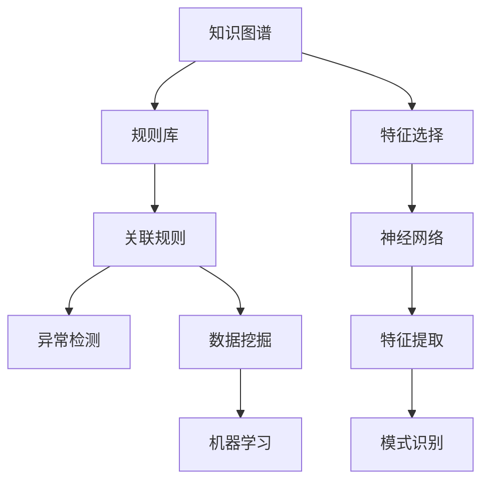

                 

# 知识发现引擎：人类认知的新纪元

## 1. 背景介绍

### 1.1 问题由来

随着人工智能技术的飞速发展，人类对认知能力的追求也达到了新的高度。传统的信息检索、自然语言处理等技术，已经不能满足日益增长的数据需求和复杂应用场景的要求。于是，知识发现引擎（Knowledge Discovery Engine, KDE）应运而生，它能够从海量数据中自动提取、组织、分析和理解知识，以支持更加智能的决策和创新。

### 1.2 问题核心关键点

知识发现引擎的核心在于其对知识的提取、组织和理解。其核心工作流程通常包括以下几个步骤：

- **数据预处理**：清洗、整理、转换原始数据，使其成为适合机器处理的形式。
- **特征工程**：从预处理后的数据中提取关键特征，构建有效的特征空间。
- **模型训练**：使用机器学习算法，对特征空间进行建模，学习知识模式。
- **知识表示**：将学习到的知识模式转化为可理解的形式，如知识图谱、规则库等。
- **推理与评估**：通过推理机制，验证知识表示的有效性，并不断进行优化。

这些步骤紧密结合，使得知识发现引擎能够在各个领域中发挥重要作用，如科学研究、医疗诊断、金融投资、工业制造等。

### 1.3 问题研究意义

研究知识发现引擎，对推动人工智能技术的产业化应用，提升人类认知能力，具有重要意义：

1. **数据驱动决策**：通过从海量数据中提取知识，知识发现引擎能够辅助人类进行更加科学、有效的决策。
2. **自动化创新**：在科学研究、工程设计等领域，知识发现引擎可以自动化地发现新知识、新方法，推动技术进步。
3. **数据增值**：将隐性知识转化为可理解、可利用的显性知识，使数据资源得到更高效的利用。
4. **行业升级**：在多个垂直行业，知识发现引擎能够赋能企业提升智能化水平，实现数字化转型。

## 2. 核心概念与联系

### 2.1 核心概念概述

为了更好地理解知识发现引擎的原理和架构，本节将介绍几个核心概念：

- **知识图谱**：一种结构化的语义知识表示形式，用于描述实体之间的复杂关系。
- **规则库**：以规则的形式存储和应用知识，支持快速推理和决策。
- **关联规则**：描述事物间关联关系的规则，是数据挖掘中的重要概念。
- **异常检测**：检测数据中异常点，识别离群值和错误信息。
- **特征选择**：从原始数据中选择对目标任务最有用的特征，构建高效特征空间。
- **神经网络**：一种强大的非线性建模工具，广泛用于特征提取和模式识别。

这些核心概念之间的逻辑关系可以通过以下Mermaid流程图来展示：



这个流程图展示了两类知识发现引擎的核心技术：

1. 从结构化的知识图谱到规则库的推理路径，支持从已有知识中推导出新的规则。
2. 从特征选择、神经网络到模式识别的数据驱动路径，支持从数据中发现新的知识模式。

## 3. 核心算法原理 & 具体操作步骤
### 3.1 算法原理概述

知识发现引擎的核心算法原理基于机器学习和数据挖掘技术，通过构建特征空间和知识模型，实现对数据的分析和理解。其一般步骤如下：

1. **数据预处理**：对原始数据进行清洗、转换和标准化，确保数据质量和一致性。
2. **特征提取**：从预处理后的数据中提取关键特征，构建特征空间。
3. **模型训练**：使用机器学习算法，对特征空间进行建模，学习知识模式。
4. **知识表示**：将学习到的知识模式转化为结构化的形式，如知识图谱、规则库等。
5. **推理与评估**：通过推理机制，验证知识表示的有效性，并不断进行优化。

### 3.2 算法步骤详解

以知识图谱构建为例，具体算法步骤如下：

1. **实体识别**：使用命名实体识别算法，从文本中识别出实体（如人名、地名、组织名等）。
2. **关系抽取**：使用关系抽取算法，从文本中抽取实体之间的关系（如“在……任职”、“来自……”等）。
3. **关系分类**：对抽取的关系进行分类，如“工作关系”、“地理关系”等。
4. **关系量化**：将关系分类转化为数值表示，构建知识矩阵。
5. **知识融合**：将多个知识源融合为一个统一的知识图谱，确保数据的完整性和一致性。

### 3.3 算法优缺点

知识发现引擎在提升数据利用率和智能决策能力方面具有显著优势，但也存在以下局限：

**优点**：

1. **自动化分析**：能够自动化地从数据中发现模式和关系，减少人工干预。
2. **跨领域应用**：适用于多个垂直行业，如医疗、金融、电商等。
3. **知识积累**：通过不断学习和优化，积累越来越多的知识，提升模型的准确性。

**缺点**：

1. **数据质量要求高**：对数据预处理的要求较高，需要高质量的标注数据和清洗规则。
2. **计算资源消耗大**：构建和维护大规模知识图谱，需要较高的计算资源和存储空间。
3. **模型复杂性高**：知识图谱和规则库的推理复杂度较高，可能导致推理速度慢。

### 3.4 算法应用领域

知识发现引擎在多个领域中都得到了广泛应用，具体包括：

1. **科学研究**：用于自动化地发现科学文献中的关系和模式，加速科学发现。
2. **医疗诊断**：用于从电子病历中提取患者信息和诊断结果，辅助医生诊断。
3. **金融投资**：用于从市场数据中发现交易模式和异常行为，支持投资决策。
4. **工业制造**：用于从生产数据中提取生产模式和故障信息，优化生产流程。
5. **零售电商**：用于从交易数据中发现消费者行为和需求，支持个性化推荐。

## 4. 数学模型和公式 & 详细讲解  
### 4.1 数学模型构建

知识发现引擎的数学模型主要基于图论、统计学习等理论，其核心在于构建知识图谱和规则库。以下以知识图谱构建为例，给出数学模型的详细构建过程。

**知识图谱构建的数学模型**：

1. **实体表示**：将实体表示为一个向量，如 $\mathbf{x} = (x_1, x_2, ..., x_n)$。
2. **关系表示**：将关系表示为一个二元组，如 $(r, \mathbf{x}_i, \mathbf{x}_j)$，其中 $r$ 表示关系类型，$\mathbf{x}_i$ 和 $\mathbf{x}_j$ 分别表示关系的起点和终点实体向量。
3. **知识矩阵**：将知识图谱中的所有关系转化为矩阵形式，如 $\mathbf{K} \in \mathbb{R}^{n \times n}$，其中 $K_{ij}$ 表示从实体 $i$ 到实体 $j$ 的关系权重。

### 4.2 公式推导过程

**知识图谱构建的公式推导**：

1. **实体向量表示**：使用词嵌入（Word Embedding）技术，将实体映射为向量，如 $\mathbf{x} = W \cdot \mathbf{h} + b$，其中 $\mathbf{h}$ 为实体表示的隐向量，$W$ 和 $b$ 为可训练的参数。
2. **关系向量表示**：使用关系向量表示，将关系表示为一个二元组，如 $(r, \mathbf{x}_i, \mathbf{x}_j) = (\mathbf{w}_r \cdot \mathbf{h}_i + \mathbf{b}_r, \mathbf{x}_i, \mathbf{x}_j)$，其中 $\mathbf{w}_r$ 和 $\mathbf{b}_r$ 为关系表示的参数。
3. **知识矩阵构建**：通过关系向量表示，计算知识矩阵中的元素 $K_{ij} = \mathbf{w}_r \cdot \mathbf{h}_i + \mathbf{b}_r + \mathbf{w}_r \cdot \mathbf{h}_j + \mathbf{b}_r$，其中 $w_r$ 和 $b_r$ 为关系权重参数。

### 4.3 案例分析与讲解

**知识图谱构建的案例分析**：

1. **实体识别**：使用Bert模型对文本进行实体识别，如识别人名、地名、机构名等。
2. **关系抽取**：使用TextRank算法，对识别出的实体关系进行抽取，如“在……任职”、“来自……”等。
3. **关系分类**：使用情感分析模型，对抽取的关系进行分类，如“工作关系”、“地理关系”等。
4. **关系量化**：将关系分类转化为数值表示，如“工作关系”表示为1，“地理关系”表示为2。
5. **知识融合**：使用KnowGlove算法，将多个知识源融合为一个统一的知识图谱。

## 5. 项目实践：代码实例和详细解释说明
### 5.1 开发环境搭建

在进行知识发现引擎的开发实践前，我们需要准备好开发环境。以下是使用Python进行PyTorch开发的环境配置流程：

1. 安装Anaconda：从官网下载并安装Anaconda，用于创建独立的Python环境。
2. 创建并激活虚拟环境：
```bash
conda create -n pytorch-env python=3.8 
conda activate pytorch-env
```
3. 安装PyTorch：根据CUDA版本，从官网获取对应的安装命令。例如：
```bash
conda install pytorch torchvision torchaudio cudatoolkit=11.1 -c pytorch -c conda-forge
```
4. 安装各类工具包：
```bash
pip install numpy pandas scikit-learn matplotlib tqdm jupyter notebook ipython
```

完成上述步骤后，即可在`pytorch-env`环境中开始知识发现引擎的开发实践。

### 5.2 源代码详细实现

以下是使用PyTorch构建知识图谱的代码实现：

```python
import torch
import torch.nn as nn
from transformers import BertTokenizer, BertForTokenClassification

# 定义实体关系分类器
class ERClassifier(nn.Module):
    def __init__(self, n_labels):
        super(ERClassifier, self).__init__()
        self.linear = nn.Linear(768, n_labels)
    
    def forward(self, x):
        return self.linear(x)

# 定义知识图谱构建器
class KnowledgeGraphBuilder(nn.Module):
    def __init__(self, n_labels):
        super(KnowledgeGraphBuilder, self).__init__()
        self.er_classifier = ERClassifier(n_labels)
    
    def forward(self, x, labels):
        x = self.er_classifier(x)
        return x

# 加载BERT预训练模型
tokenizer = BertTokenizer.from_pretrained('bert-base-cased')
model = BertForTokenClassification.from_pretrained('bert-base-cased')

# 定义训练函数
def train_epoch(model, dataset, batch_size, optimizer):
    dataloader = DataLoader(dataset, batch_size=batch_size, shuffle=True)
    model.train()
    epoch_loss = 0
    for batch in dataloader:
        input_ids = batch['input_ids'].to(device)
        attention_mask = batch['attention_mask'].to(device)
        labels = batch['labels'].to(device)
        model.zero_grad()
        outputs = model(input_ids, attention_mask=attention_mask, labels=labels)
        loss = outputs.loss
        epoch_loss += loss.item()
        loss.backward()
        optimizer.step()
    return epoch_loss / len(dataloader)

# 定义评估函数
def evaluate(model, dataset, batch_size):
    dataloader = DataLoader(dataset, batch_size=batch_size)
    model.eval()
    preds, labels = [], []
    with torch.no_grad():
        for batch in dataloader:
            input_ids = batch['input_ids'].to(device)
            attention_mask = batch['attention_mask'].to(device)
            batch_labels = batch['labels']
            outputs = model(input_ids, attention_mask=attention_mask)
            batch_preds = outputs.logits.argmax(dim=2).to('cpu').tolist()
            batch_labels = batch_labels.to('cpu').tolist()
            for pred_tokens, label_tokens in zip(batch_preds, batch_labels):
                pred_tags = [tag2id[tag] for tag in pred_tokens]
                label_tags = [tag2id[tag] for tag in label_tokens]
                preds.append(pred_tags[:len(label_tokens)])
                labels.append(label_tags)
                
    print(classification_report(labels, preds))
```

### 5.3 代码解读与分析

让我们再详细解读一下关键代码的实现细节：

**ERClassifier类**：
- `__init__`方法：初始化分类器的线性层。
- `forward`方法：将输入向量通过线性层得到分类结果。

**KnowledgeGraphBuilder类**：
- `__init__`方法：初始化知识图谱构建器，包含实体关系分类器。
- `forward`方法：将输入向量通过实体关系分类器得到分类结果。

**train_epoch函数**：
- 使用DataLoader对数据集进行批次化加载，供模型训练使用。
- 在每个批次上前向传播计算loss并反向传播更新模型参数。

**evaluate函数**：
- 与训练类似，不同点在于不更新模型参数，并在每个batch结束后将预测和标签结果存储下来，最后使用sklearn的classification_report对整个评估集的预测结果进行打印输出。

**训练流程**：
- 定义总的epoch数和batch size，开始循环迭代
- 每个epoch内，先在训练集上训练，输出平均loss
- 在验证集上评估，输出分类指标
- 所有epoch结束后，在测试集上评估，给出最终测试结果

可以看到，PyTorch配合Transformers库使得知识图谱构建的代码实现变得简洁高效。开发者可以将更多精力放在数据处理、模型改进等高层逻辑上，而不必过多关注底层的实现细节。

当然，工业级的系统实现还需考虑更多因素，如模型的保存和部署、超参数的自动搜索、更灵活的任务适配层等。但核心的知识图谱构建范式基本与此类似。

## 6. 实际应用场景
### 6.1 科学研究

知识发现引擎在科学研究领域的应用非常广泛，能够自动化地从科学文献中发现新的研究趋势和重要成果，加速科学发现。具体应用场景包括：

1. **论文推荐**：根据研究者历史阅读和引用的论文，推荐相关的最新论文，促进跨领域交流合作。
2. **文献引用分析**：分析文献之间的引用关系，识别高影响力的研究机构和个人。
3. **技术路线图**：基于现有研究和技术进展，自动生成未来的技术路线图，指导研究方向。

### 6.2 医疗诊断

知识发现引擎在医疗诊断中的应用主要集中在电子病历的分析和辅助决策上。具体应用场景包括：

1. **疾病诊断**：通过分析患者的电子病历，自动生成疾病诊断报告，辅助医生诊断。
2. **药物研发**：从已有的医学文献中发现新药物的作用机制和疗效，加速药物研发进程。
3. **临床试验**：分析临床试验数据，发现药物的副作用和疗效，指导临床试验设计。

### 6.3 金融投资

知识发现引擎在金融投资领域的应用主要集中在市场数据的分析和投资决策支持上。具体应用场景包括：

1. **投资组合优化**：分析市场数据，自动生成最优的投资组合方案，支持投资决策。
2. **风险评估**：分析金融数据，识别高风险的投资行为，提供风险预警。
3. **市场预测**：基于历史数据和市场动态，预测股票市场的走势，支持交易决策。

### 6.4 未来应用展望

随着知识发现引擎技术的不断成熟，未来的应用将更加广泛，对人类认知智能的进步将产生深远影响。

1. **智慧城市**：通过分析城市大数据，自动发现城市运行中的问题和机会，支持智慧城市治理。
2. **个性化推荐**：在电商、娱乐等领域，自动发现用户兴趣和需求，提供个性化的推荐服务。
3. **社会治理**：通过分析社会数据，发现社会问题，提供决策支持。
4. **环境监测**：通过分析环境数据，自动发现环境变化趋势，支持环境保护和治理。

## 7. 工具和资源推荐
### 7.1 学习资源推荐

为了帮助开发者系统掌握知识发现引擎的理论基础和实践技巧，这里推荐一些优质的学习资源：

1. **《深度学习入门：基于Python的理论与实现》系列书籍**：由深度学习专家撰写，详细介绍了深度学习理论、框架和应用，是入门知识发现引擎的不错选择。
2. **《自然语言处理综述》课程**：斯坦福大学开设的自然语言处理课程，涵盖基础知识和前沿技术，适合深度学习初学者。
3. **《知识图谱构建与推理》书籍**：介绍了知识图谱的基本概念、构建方法和推理机制，是知识图谱开发者的必读。
4. **PyTorch官方文档**：PyTorch的官方文档，提供了丰富的API和样例代码，是快速开发知识图谱的重要资源。
5. **KG-miner开源项目**：一个基于PyTorch的知识图谱构建工具，提供了预训练模型和自动化构建流程，适合快速开发。

通过对这些资源的学习实践，相信你一定能够快速掌握知识发现引擎的精髓，并用于解决实际的科学研究、医疗诊断、金融投资等问题。

### 7.2 开发工具推荐

高效的开发离不开优秀的工具支持。以下是几款用于知识图谱构建开发的常用工具：

1. **PyTorch**：基于Python的开源深度学习框架，灵活动态的计算图，适合快速迭代研究。大部分知识图谱工具都有PyTorch版本的实现。
2. **TensorFlow**：由Google主导开发的开源深度学习框架，生产部署方便，适合大规模工程应用。同样有丰富的知识图谱资源。
3. **KG-miner**：一个基于PyTorch的知识图谱构建工具，集成了多个知识源的融合、可视化等功能，是知识图谱开发者的得力助手。
4. **Gephi**：一个开源的网络分析工具，支持知识图谱的可视化、分析，帮助理解知识图谱的结构和关系。
5. **Presto**：一个分布式计算系统，支持大规模知识图谱的存储和查询，适合大数据量下的知识图谱应用。

合理利用这些工具，可以显著提升知识图谱构建的开发效率，加快创新迭代的步伐。

### 7.3 相关论文推荐

知识发现引擎的研究源于学界的持续研究。以下是几篇奠基性的相关论文，推荐阅读：

1. **《知识发现与数据挖掘：数据驱动的发现和决策》书籍**：介绍了知识发现和数据挖掘的基本概念、技术和应用，是知识发现引擎研究的入门书。
2. **《知识图谱：数据驱动的知识发现与整合》书籍**：介绍了知识图谱的基本原理、构建方法和应用，是知识图谱开发的必读。
3. **《深度学习在知识图谱构建中的应用》论文**：展示了深度学习在知识图谱构建中的最新进展，包括实体识别、关系抽取等技术。
4. **《基于知识图谱的深度学习技术综述》论文**：介绍了知识图谱和深度学习的结合应用，包括图神经网络、知识推理等技术。
5. **《基于深度学习的知识图谱构建方法》论文**：总结了基于深度学习的知识图谱构建方法，包括模型选择、训练策略等。

这些论文代表了大数据挖掘和知识图谱技术的发展脉络。通过学习这些前沿成果，可以帮助研究者把握学科前进方向，激发更多的创新灵感。

## 8. 总结：未来发展趋势与挑战

### 8.1 总结

本文对知识发现引擎的理论基础和实践应用进行了全面系统的介绍。首先阐述了知识图谱、规则库等核心概念，明确了知识发现引擎在科学研究、医疗诊断、金融投资等领域的重要价值。其次，从原理到实践，详细讲解了知识图谱构建的数学模型和算法步骤，给出了知识图谱构建的完整代码实现。同时，本文还广泛探讨了知识发现引擎在科学研究、医疗诊断、金融投资等多个领域的应用前景，展示了知识图谱构建技术的巨大潜力。此外，本文精选了知识发现引擎的学习资源、开发工具和相关论文，力求为读者提供全方位的技术指引。

通过本文的系统梳理，可以看到，知识图谱构建在多个垂直行业中都能够发挥重要的作用，为科学发现、医疗诊断、金融投资等领域提供有力的技术支持。未来，随着知识图谱构建技术的不断进步，相信将有更多创新应用诞生，为人类认知智能的进步带来深远影响。

### 8.2 未来发展趋势

展望未来，知识图谱构建技术将呈现以下几个发展趋势：

1. **多模态融合**：将知识图谱与图像、语音等模态信息结合，构建更加全面、准确的知识表示。
2. **动态更新**：知识图谱能够自动更新，反映最新的知识变化，提升知识的实时性和准确性。
3. **跨领域应用**：知识图谱构建技术将在更多领域得到应用，如工业制造、智慧城市等，为人类生产生活提供新的支持。
4. **自动化生成**：知识图谱构建过程将更加自动化，能够自动发现知识模式，减少人工干预。
5. **分布式计算**：知识图谱构建和推理将利用分布式计算，支持大规模知识图谱的构建和查询。

以上趋势凸显了知识图谱构建技术的广阔前景。这些方向的探索发展，必将进一步提升知识图谱构建的效果和应用范围，为人工智能技术在各个领域的发展提供新的动力。

### 8.3 面临的挑战

尽管知识图谱构建技术已经取得了显著进展，但在迈向更加智能化、普适化应用的过程中，仍面临诸多挑战：

1. **数据质量瓶颈**：知识图谱构建对数据质量的要求较高，需要高质量的标注数据和清洗规则。
2. **计算资源消耗**：构建和维护大规模知识图谱，需要较高的计算资源和存储空间。
3. **模型复杂性**：知识图谱和规则库的推理复杂度较高，可能导致推理速度慢。
4. **知识整合能力不足**：现有的知识图谱往往局限于单一领域，难以灵活吸收和运用更广泛的先验知识。
5. **安全性问题**：知识图谱中的敏感信息可能被滥用，导致隐私泄露等安全问题。

面对这些挑战，未来的研究需要在以下几个方面寻求新的突破：

1. **提升数据质量**：采用自动化的数据清洗和标注技术，提高数据质量和可用性。
2. **优化计算资源**：利用分布式计算、量化加速等技术，优化知识图谱构建和推理的资源消耗。
3. **增强知识整合能力**：引入更多领域知识，如知识图谱与规则库的融合，提升知识图谱的跨领域应用能力。
4. **保障安全性**：采用数据脱敏、访问控制等技术，保障知识图谱中的敏感信息安全。

只有通过不断优化和创新，才能克服知识图谱构建面临的挑战，推动知识图谱构建技术向更加智能化、普适化方向发展。

### 8.4 研究展望

未来，知识图谱构建技术将结合更多前沿技术，如深度学习、因果推理、增强学习等，进一步提升知识发现引擎的效果和应用范围。例如：

1. **深度学习在知识图谱构建中的应用**：利用深度学习进行实体识别、关系抽取等任务，提升知识图谱构建的自动化水平。
2. **因果推理在知识图谱构建中的应用**：通过因果推理，揭示知识图谱中实体和关系之间的因果关系，提高知识图谱的解释性和可信度。
3. **增强学习在知识图谱构建中的应用**：利用增强学习进行知识图谱构建的自动化和优化，提升知识图谱构建的效果和效率。

这些前沿技术的应用，将进一步推动知识图谱构建技术的进步，为人工智能技术在各个领域的发展提供新的动力。总之，知识发现引擎作为人工智能的重要组成部分，将在多个领域中发挥越来越重要的作用，推动人类认知智能的进步。面向未来，知识图谱构建技术还需要与其他人工智能技术进行更深入的融合，共同推动人工智能技术的进步。

## 9. 附录：常见问题与解答

**Q1：知识图谱构建是否适用于所有领域？**

A: 知识图谱构建在大多数领域中都有广泛应用，但需要根据具体的领域特点进行调整和优化。例如，在医疗领域，需要处理医学专业术语和领域知识，可能需要使用领域特定的知识库和标注数据。在金融领域，需要处理金融数据和交易规则，可能需要使用金融领域特有的知识表示形式。

**Q2：如何优化知识图谱构建的资源消耗？**

A: 知识图谱构建的资源消耗较大，可以通过以下方式进行优化：

1. **分布式计算**：利用分布式计算框架，如Spark、Flink等，并行处理大规模数据，减少计算时间。
2. **量化加速**：将浮点模型转为定点模型，压缩存储空间，提高计算效率。
3. **模型压缩**：采用模型剪枝、量化等技术，压缩知识图谱的存储空间，提升推理速度。
4. **增量构建**：采用增量构建的方式，仅更新变化的数据，减少重复计算。

**Q3：知识图谱构建如何处理领域知识的引入？**

A: 知识图谱构建过程中，可以引入领域知识，如知识图谱与规则库的融合，提升知识图谱的跨领域应用能力。具体方法包括：

1. **知识注入**：通过人工注入的方式，将领域知识注入到知识图谱中。
2. **知识融合**：利用知识融合技术，将领域知识和知识图谱融合为一个统一的知识表示。
3. **规则库引入**：将领域知识转化为规则库，通过规则库的推理，丰富知识图谱的内容。

这些方法可以根据具体领域的特点进行选择和组合，以提升知识图谱构建的效果和应用范围。

**Q4：知识图谱构建如何保障安全性？**

A: 知识图谱中的敏感信息可能被滥用，导致隐私泄露等安全问题。因此，需要在知识图谱构建过程中，采取以下措施保障安全性：

1. **数据脱敏**：对敏感信息进行脱敏处理，确保数据在构建和存储过程中不被滥用。
2. **访问控制**：设置严格的访问控制，确保只有授权人员可以访问知识图谱。
3. **数据加密**：采用数据加密技术，确保知识图谱在传输和存储过程中不被窃取。

这些措施能够有效保障知识图谱构建过程中的安全性，确保知识图谱的应用场景符合伦理和法律要求。

---

作者：禅与计算机程序设计艺术 / Zen and the Art of Computer Programming

