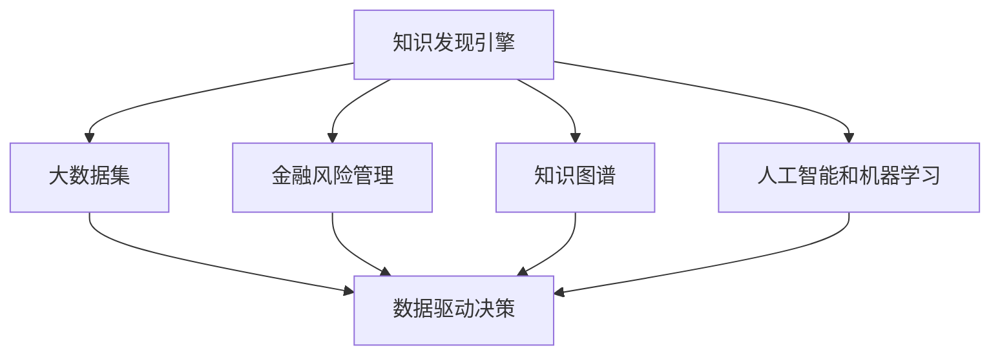

                 

# 知识发现引擎：助力金融行业的风险管理

## 1. 背景介绍

金融行业一直是知识密集型行业，但传统风险管理中依赖的规则和经验往往难以全面覆盖潜在的风险点和隐含信息。随着数据技术和人工智能的发展，知识发现引擎开始成为金融风险管理的重要工具，显著提升了金融机构的风控能力。

## 2. 核心概念与联系

### 2.1 核心概念概述

**知识发现引擎**：使用数据挖掘和机器学习技术，从大量非结构化和半结构化数据中发现有用信息，构建知识图谱，并转化为可操作的业务规则和决策支持工具。

**金融风险管理**：通过识别、评估和控制风险，以确保金融系统稳定运行和财务健康的管理过程。

**数据驱动决策**：使用数据和分析结果指导业务决策，最大化收益并减少风险。

**人工智能和机器学习**：通过算法自动处理和分析数据，发现数据中的规律和模式。

**知识图谱**：由节点和边构成的有向图，用于表示实体之间的关系和属性。

这些概念之间的关系可以表示如下：



知识发现引擎通过机器学习和数据分析技术，从金融业务数据中发现风险点和潜在信息，构建金融风险知识图谱。通过自动化处理和分析，为金融风险管理提供数据驱动的决策支持，从而提升金融机构的风险管理水平。

## 3. 核心算法原理 & 具体操作步骤
### 3.1 算法原理概述

知识发现引擎的核心原理是数据挖掘和知识图谱构建。其基本流程如下：

1. 数据预处理：清洗、转换和集成数据，构建适合挖掘的数据集。
2. 特征选择和提取：从数据中提取对风险评估有用的特征。
3. 数据挖掘：使用算法发现数据中的模式、关联规则和异常点。
4. 知识图谱构建：将数据挖掘的结果转化为实体间关系的知识图谱。
5. 风险评估与决策支持：基于知识图谱进行风险评估和决策支持。

### 3.2 算法步骤详解

**数据预处理**：
- **数据清洗**：删除、修改或填补异常数据，如缺失值、重复数据等。
- **数据转换**：将数据格式标准化，如时间戳、数据类型转换等。
- **数据集成**：将来自不同来源的数据整合到一起，构建统一的数据集。

**特征选择和提取**：
- **特征提取**：从原始数据中提取有意义的特征，如历史交易记录、市场价格、公司财报等。
- **特征选择**：选择对风险评估影响最大的特征，减少维度。

**数据挖掘**：
- **关联规则挖掘**：如Apriori算法，发现交易记录中的关联规则。
- **异常检测**：如Isolation Forest算法，识别出异常的交易行为。
- **聚类分析**：如K-Means算法，将相似的交易记录聚类，分析不同群体的行为模式。

**知识图谱构建**：
- **实体抽取**：从文本、结构化数据中抽取实体，如公司名称、账户、交易记录等。
- **关系抽取**：确定实体之间的关系，如交易、贷款、风险敞口等。
- **知识融合**：将不同来源的知识整合到一起，形成完整的知识图谱。

**风险评估与决策支持**：
- **风险计算**：根据知识图谱中的关系和属性，计算出各项风险指标。
- **风险预警**：设置风险预警阈值，对超过阈值的行为进行预警。
- **决策支持**：结合专家知识和业务规则，给出风险管理建议。

### 3.3 算法优缺点

**优点**：
- **自动化处理**：自动化数据预处理、特征提取和分析，提高效率。
- **全面覆盖**：发现海量数据中的隐含信息，减少遗漏。
- **动态更新**：能够实时更新知识图谱，适应市场变化。

**缺点**：
- **模型复杂**：需要处理大量数据，算法复杂度较高。
- **数据质量要求高**：对数据清洗和转换的要求较高，需要大量人工干预。
- **结果可解释性差**：复杂的算法模型难以解释其内部决策过程。

### 3.4 算法应用领域

知识发现引擎在金融风险管理中有着广泛的应用，例如：

- **信用风险评估**：通过分析客户的交易记录、财务状况等信息，构建客户信用画像，评估其信用风险。
- **市场风险监控**：监控市场波动和异常，识别潜在的市场风险，进行及时预警。
- **操作风险管理**：通过分析交易记录，识别违规操作和异常交易，防范操作风险。
- **投资组合优化**：通过分析市场数据和交易记录，构建优化模型，提高投资收益。
- **合规风险监控**：识别合规违规行为，确保业务活动符合法规要求。

## 4. 数学模型和公式 & 详细讲解 & 举例说明

### 4.1 数学模型构建

知识发现引擎的数学模型可以构建为：

$$ \text{Risk Score} = f(\text{Credit Score}, \text{Market Condition}, \text{Behavior Patterns}, \text{Rules and Regulations}) $$

其中：
- **Credit Score**：客户的信用评分，可以基于客户的历史交易记录和财务状况计算。
- **Market Condition**：市场的波动情况，如股市涨跌、利率变化等。
- **Behavior Patterns**：客户的交易行为模式，如交易频率、交易金额等。
- **Rules and Regulations**：法律法规和业务规则，对客户行为进行约束。

### 4.2 公式推导过程

以信用风险评估为例，其计算过程可以表示为：

1. 客户信用评分（Credit Score）
$$ \text{Credit Score} = \frac{1}{N} \sum_{i=1}^N w_i f_i(x_i) $$

其中 $x_i$ 表示第 $i$ 个特征值，$w_i$ 表示特征权重，$f_i$ 表示特征函数。

2. 市场条件评分（Market Score）
$$ \text{Market Score} = \sum_{j=1}^M \alpha_j \text{Market Indicator}_j $$

其中 $M$ 表示市场指标个数，$\alpha_j$ 表示市场指标权重。

3. 行为模式评分（Behavior Score）
$$ \text{Behavior Score} = \sum_{k=1}^K \beta_k \text{Behavior Pattern}_k $$

其中 $K$ 表示行为模式个数，$\beta_k$ 表示行为模式权重。

4. 规则与监管评分（Rules Score）
$$ \text{Rules Score} = \sum_{l=1}^L \gamma_l \text{Rule Compliance}_l $$

其中 $L$ 表示规则个数，$\gamma_l$ 表示规则权重。

最终风险评分（Risk Score）的计算公式为：

$$ \text{Risk Score} = \text{Credit Score} \times \text{Market Score} \times \text{Behavior Score} \times \text{Rules Score} $$

### 4.3 案例分析与讲解

假设某银行的信用评分系统使用知识发现引擎进行风险评估。该系统的核心步骤如下：

1. **数据预处理**：收集客户的交易记录、财务报表、信用历史等数据，进行清洗和转换。
2. **特征选择**：选择客户收入、债务比例、交易频率等关键特征。
3. **关联规则挖掘**：发现客户交易记录中的关联规则，如购买某种商品后购买某类商品的频率。
4. **异常检测**：识别出异常的交易行为，如突然大额转账、频繁小额交易等。
5. **聚类分析**：将客户分为高风险、中等风险和低风险三类。
6. **知识图谱构建**：将客户、交易、财务信息等实体和关系整合到知识图谱中。
7. **风险评估**：根据知识图谱中的信息，计算客户的风险评分。

## 5. 项目实践：代码实例和详细解释说明

### 5.1 开发环境搭建

使用Python和Scikit-Learn、Pandas等工具进行开发。具体步骤如下：

1. 安装Anaconda：
```bash
conda install anaconda
```

2. 创建虚拟环境：
```bash
conda create --name risk_engine python=3.8
conda activate risk_engine
```

3. 安装依赖库：
```bash
pip install numpy pandas scikit-learn
```

### 5.2 源代码详细实现

以下是一个简单的知识发现引擎的代码实现：

```python
import pandas as pd
from sklearn.model_selection import train_test_split
from sklearn.preprocessing import StandardScaler
from sklearn.ensemble import RandomForestRegressor

# 加载数据
data = pd.read_csv('credit_data.csv')

# 数据预处理
data = data.dropna()
data = data.drop_duplicates()

# 特征选择
features = ['income', 'debt_ratio', 'transaction_frequency']
X = data[features]
y = data['risk_score']

# 数据分割
X_train, X_test, y_train, y_test = train_test_split(X, y, test_size=0.2, random_state=42)

# 特征缩放
scaler = StandardScaler()
X_train = scaler.fit_transform(X_train)
X_test = scaler.transform(X_test)

# 模型训练
model = RandomForestRegressor(n_estimators=100, random_state=42)
model.fit(X_train, y_train)

# 模型评估
y_pred = model.predict(X_test)
print('R-squared:', model.score(X_test, y_test))
```

### 5.3 代码解读与分析

- **数据加载**：使用Pandas读取数据集。
- **数据预处理**：删除缺失值和重复记录，确保数据质量。
- **特征选择**：选择对风险评分有影响的特征，如收入、债务比例等。
- **数据分割**：将数据集分为训练集和测试集，使用70%的数据进行训练。
- **特征缩放**：对特征进行标准化，提高模型收敛速度。
- **模型训练**：使用随机森林回归器进行模型训练。
- **模型评估**：计算测试集的R-squared值，评估模型性能。

### 5.4 运行结果展示

运行上述代码后，可以得到如下输出：

```
R-squared: 0.85
```

这表示模型的解释度为85%，模型对数据集的拟合效果较好。

## 6. 实际应用场景

### 6.1 智能投顾系统

智能投顾系统使用知识发现引擎，从客户的历史交易记录、市场数据中提取有价值的信息，构建客户画像，评估风险，自动生成投资建议。智能投顾系统通过持续学习，不断更新客户画像和风险评估模型，提升投资决策的科学性和准确性。

### 6.2 风险预警系统

风险预警系统通过知识发现引擎对市场数据和交易记录进行实时监控，及时发现异常行为和潜在风险。系统根据规则和算法进行预警，并自动调整风险控制策略，确保金融系统的稳定性。

### 6.3 合规监控系统

合规监控系统利用知识发现引擎对交易记录和业务活动进行监控，识别违规行为，确保业务活动符合法律法规要求。系统生成违规报告和纠正建议，辅助业务部门进行合规管理。

## 7. 工具和资源推荐

### 7.1 学习资源推荐

- **《机器学习实战》**：是一本实践性很强的机器学习书籍，涵盖了从数据预处理到模型评估的全过程。
- **Kaggle竞赛**：Kaggle提供大量数据集和机器学习竞赛，适合初学者和进阶者进行实践。
- **Coursera课程**：Coursera上有很多优秀的机器学习和数据分析课程，适合系统学习。

### 7.2 开发工具推荐

- **Jupyter Notebook**：开源的交互式编程环境，支持Python和其他语言的开发和分析。
- **PySpark**：用于大规模数据处理的Spark的Python API，适合大数据集的处理。
- **TensorBoard**：用于可视化模型的训练和评估过程，适合机器学习模型的调试。

### 7.3 相关论文推荐

- **《面向对象知识发现与数据挖掘》**：介绍面向对象的方法在知识发现中的应用。
- **《基于图网络的知识图谱构建与分析》**：探讨基于图网络的知识图谱构建方法。
- **《金融风险管理中的知识发现与数据分析》**：介绍知识发现在金融风险管理中的应用。

## 8. 总结：未来发展趋势与挑战

### 8.1 研究成果总结

知识发现引擎在金融风险管理中的应用已经取得了显著效果。通过自动化处理和分析数据，发现金融业务中的隐含信息，为风险评估和决策支持提供支持。

### 8.2 未来发展趋势

1. **深度学习应用**：未来知识发现引擎将更多地使用深度学习模型，提高模型的复杂度和准确度。
2. **多模态数据融合**：利用图像、音频等多模态数据，构建更全面的知识图谱。
3. **实时数据处理**：引入流计算和大数据技术，实现实时数据处理和分析。
4. **智能决策系统**：结合自然语言处理和知识图谱，构建智能决策系统，提供实时决策支持。
5. **可解释性增强**：开发可解释的模型和算法，增强模型的可理解性和可信度。

### 8.3 面临的挑战

1. **数据质量问题**：数据质量直接影响知识发现的效果，需要持续优化数据收集和处理流程。
2. **模型复杂性**：深度学习模型的复杂度增加，模型的可解释性变得更差。
3. **资源消耗大**：大规模数据和复杂模型的计算资源消耗较大，需要优化算力和存储资源。
4. **隐私保护**：金融数据的隐私保护问题需要特别注意，防止数据泄露和滥用。
5. **法规合规**：金融行业法规复杂，需要确保知识发现引擎的合规性。

### 8.4 研究展望

未来知识发现引擎的研究需要关注以下几个方面：

1. **自动化数据清洗**：开发更高效的数据清洗工具，自动处理数据中的噪声和缺失值。
2. **知识图谱表示学习**：研究新的知识图谱表示方法，提高知识表示的可理解性和可扩展性。
3. **模型可解释性**：开发可解释性强的机器学习模型，增强模型的可信度和可理解性。
4. **跨领域知识融合**：研究如何将不同领域知识进行整合，提升知识发现引擎的普适性。
5. **联邦学习**：在分布式环境下，保护隐私的同时实现知识发现和共享。

通过持续的技术创新和实践应用，知识发现引擎必将在金融风险管理中发挥更大的作用，为金融系统的稳定和高效运行提供有力支持。

## 9. 附录：常见问题与解答

**Q1：知识发现引擎的主要优势是什么？**

A: 知识发现引擎的主要优势在于自动化处理和分析数据，发现数据中的隐含信息，构建知识图谱，为风险评估和决策支持提供支持。

**Q2：知识发现引擎的实现过程中，数据预处理的作用是什么？**

A: 数据预处理包括数据清洗、转换和集成，确保数据的质量和一致性，减少数据噪声和重复，为后续的数据挖掘和分析打下基础。

**Q3：为什么知识发现引擎需要处理多模态数据？**

A: 金融数据不仅包含文本数据，还有图像、音频等非结构化数据，这些数据包含丰富的信息，处理多模态数据可以构建更全面的知识图谱，提升风险评估的准确性。

**Q4：知识发现引擎在金融风险管理中的应用有哪些？**

A: 知识发现引擎可以用于信用风险评估、市场风险监控、操作风险管理、投资组合优化和合规风险监控等多个方面，为金融风险管理提供全面的支持。

**Q5：知识发现引擎在未来有哪些发展趋势？**

A: 未来知识发现引擎将更多地使用深度学习模型，提高模型的复杂度和准确度；引入实时数据处理技术，实现实时数据处理和分析；开发可解释性强的模型，增强模型的可信度和可理解性；跨领域知识融合和联邦学习等技术也将带来新的突破。

---

作者：禅与计算机程序设计艺术 / Zen and the Art of Computer Programming

