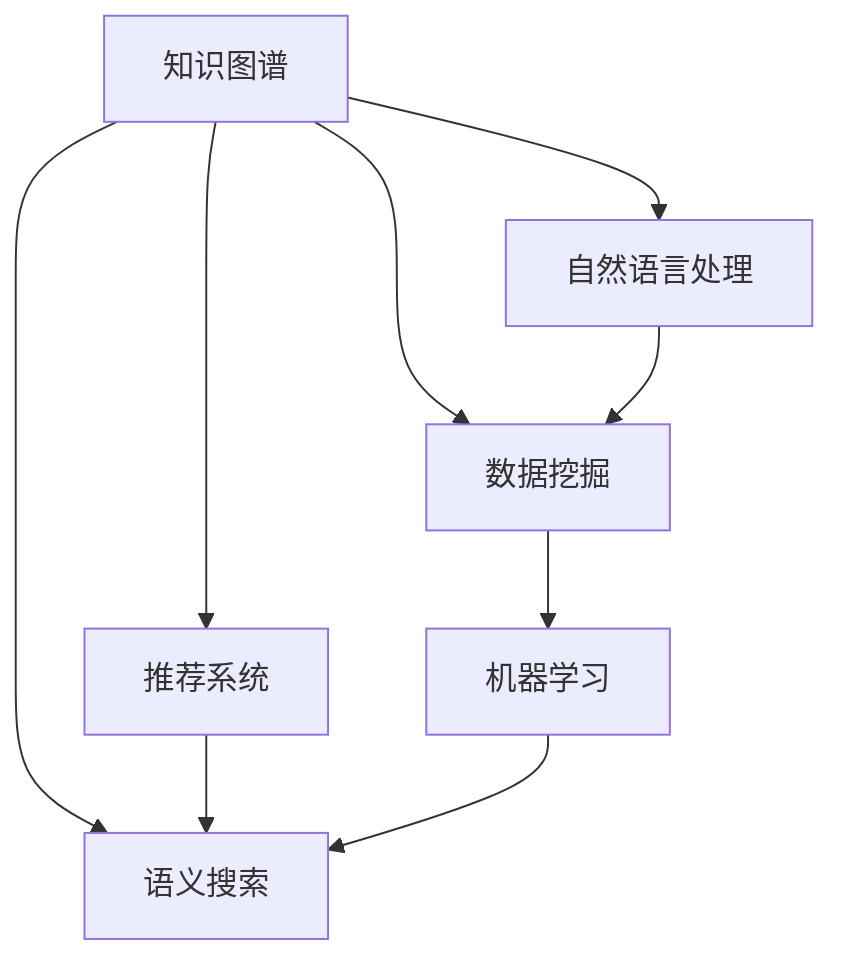

                 

# 知识发现引擎：开启知识应用新时代

> 关键词：知识发现引擎, 知识图谱, 自然语言处理, 语义搜索, 推荐系统, 数据挖掘, 机器学习

## 1. 背景介绍

### 1.1 问题由来

随着大数据时代的到来，人类面临的信息量呈爆炸性增长。信息量的大幅增加虽然为个体提供了更丰富、更精准的知识获取渠道，但也带来了信息过载和知识获取的困难。如何在海量信息中快速找到所需知识，成为现代社会亟需解决的重大问题。传统的信息检索技术虽然经过数十年的发展，已较为成熟，但在信息抽取、知识推理、语义理解等方面仍然存在诸多不足。

知识发现引擎作为新一代的信息检索技术，它结合了人工智能、自然语言处理和数据挖掘等领域的先进技术，致力于构建智能化的知识获取和应用体系。知识发现引擎通过先进的算法和模型，能够从海量的文本、数据和结构化信息中抽取、整合和推理知识，为用户提供精准、高效的知识服务。

### 1.2 问题核心关键点

知识发现引擎的核心关键点在于：

- **知识抽取与整合**：从大规模非结构化数据中自动抽取和整合知识，构建结构化的知识图谱。
- **语义搜索与推理**：利用自然语言处理和语义搜索技术，理解用户查询意图，精确检索相关知识。
- **推荐系统优化**：根据用户行为数据，进行个性化推荐，提供精准的知识服务。
- **人机交互优化**：构建自然语言交互界面，提升用户体验，扩大知识应用范围。
- **跨领域知识融合**：将不同领域、不同模态的知识进行关联与融合，形成更全面、更有深度的知识体系。

知识发现引擎的这些关键点，能够帮助用户从海量数据中快速获取有用信息，提升决策效率，辅助深度学习模型更好地完成智能任务，形成跨领域、跨模态的智能知识体系。

## 2. 核心概念与联系

### 2.1 核心概念概述

为更好地理解知识发现引擎的原理与应用，本节将介绍几个密切相关的核心概念：

- **知识图谱(Knowledge Graph)**：由实体、属性、关系等构成的大型知识库，用于存储、表示和检索知识。
- **自然语言处理(NLP)**：涉及计算机与人类语言互动的科学，旨在使计算机能理解、解释和生成人类语言。
- **语义搜索(Semantic Search)**：使用语义分析技术，理解用户查询意图，提升搜索结果的相关性。
- **推荐系统(Recommendation System)**：根据用户的历史行为数据，预测用户可能感兴趣的知识，提供个性化推荐。
- **数据挖掘(Data Mining)**：从大规模数据中提取有价值的信息和知识，并形成可应用的模型。
- **机器学习(Machine Learning)**：基于数据构建模型，使计算机具备学习能力，实现自动化决策。

这些核心概念之间的逻辑关系可以通过以下Mermaid流程图来展示：



这个流程图展示了几大核心概念之间的关系：

1. 知识图谱是知识发现引擎的核心，用于存储和表示知识。
2. 自然语言处理和语义搜索技术用于理解用户查询，提升检索效率和精准度。
3. 数据挖掘从大规模数据中提取知识，用于构建和更新知识图谱。
4. 推荐系统利用用户行为数据，提供个性化知识服务。
5. 机器学习为整个知识发现过程提供计算能力，实现自动化决策和智能推理。

这些概念共同构成了知识发现引擎的基础架构，使其能够高效、准确地实现知识抽取、检索和推荐等功能。

## 3. 核心算法原理 & 具体操作步骤
### 3.1 算法原理概述

知识发现引擎的核心算法原理，主要分为知识抽取、语义搜索和推荐系统三大块：

1. **知识抽取**：从大规模非结构化数据中，自动抽取实体、属性和关系，构建知识图谱。
2. **语义搜索**：理解自然语言查询，匹配知识图谱中对应的知识，提供精准检索。
3. **推荐系统**：分析用户行为数据，推荐用户可能感兴趣的知识，提升用户体验。

这三部分算法紧密关联，共同构成知识发现引擎的技术框架。

### 3.2 算法步骤详解

知识发现引擎的算法步骤主要分为以下几个关键环节：

**Step 1: 数据预处理**
- 清洗数据，去除噪声和错误。
- 分词、词性标注、命名实体识别等基础处理。
- 对大规模数据进行采样和分块，以提高算法效率。

**Step 2: 知识抽取**
- 实体识别：从文本中识别出实体，如人名、地名、机构名等。
- 属性抽取：从文本中提取实体属性，如出生日期、地理位置等。
- 关系抽取：识别实体间的关系，如"工作于"、"属于"等。
- 构建知识图谱：将抽取的知识以结构化形式表示，存储在知识库中。

**Step 3: 语义搜索**
- 查询意图理解：使用NLP技术，分析用户查询，提取关键词和短语。
- 匹配知识图谱：在知识库中匹配查询相关的实体、属性和关系，提供候选结果。
- 语义相关性计算：计算候选结果与查询意图的语义相似度，进行排序和筛选。

**Step 4: 推荐系统**
- 用户行为分析：收集用户浏览、点击、评价等行为数据，提取特征。
- 知识推荐模型：使用机器学习算法，如协同过滤、基于内容的推荐等，预测用户可能感兴趣的实体和关系。
- 推荐结果排序：根据预测结果和用户行为数据，对推荐结果进行排序和个性化推荐。

**Step 5: 后处理与输出**
- 输出推荐结果：将推荐结果以图表、摘要、互动界面等形式呈现给用户。
- 用户反馈收集：收集用户对推荐结果的反馈，用于持续优化模型。
- 知识更新与扩展：根据新的知识数据和用户反馈，更新和扩展知识图谱。

### 3.3 算法优缺点

知识发现引擎具有以下优点：
1. 智能化高效：结合NLP、机器学习等先进技术，能够快速、精准地抽取和检索知识。
2. 用户友好：通过自然语言交互界面，提升用户体验，拓宽知识应用范围。
3. 个性化推荐：根据用户行为数据，提供个性化的知识服务，提升用户满意度。
4. 跨领域融合：将不同领域、不同模态的知识进行关联和融合，构建更全面、更深度的知识体系。

同时，知识发现引擎也存在一些缺点：
1. 依赖数据质量：算法效果很大程度上取决于数据质量，数据清洗和预处理难度大。
2. 计算资源消耗：构建和更新知识图谱需要大量计算资源，对硬件设备有较高要求。
3. 知识表示复杂：知识图谱表示复杂，不同领域和不同任务的知识难以进行统一。
4. 实时性不足：对于大规模数据集，搜索和推理过程耗时较长，响应速度有待提升。
5. 可解释性不足：黑盒模型的决策过程难以解释，用户难以理解模型的推理逻辑。

尽管存在这些局限性，但知识发现引擎仍在大数据时代发挥着重要作用，成为知识获取和应用的新一代工具。

### 3.4 算法应用领域

知识发现引擎的应用领域非常广泛，几乎涵盖了所有知识密集型行业：

- **智慧医疗**：知识发现引擎可用于构建医疗知识图谱，辅助医生诊断和决策，提升医疗服务质量。
- **教育培训**：根据学生的学习行为数据，提供个性化的知识推荐和学习路径规划，提升学习效果。
- **金融服务**：通过金融知识图谱和推荐系统，帮助用户进行投资决策、风险评估，提升金融服务水平。
- **智能制造**：构建制造知识图谱，优化生产流程，提升产品质量和生产效率。
- **科研分析**：从大规模文献中抽取知识，构建学科知识图谱，支持科研人员的研究和论文撰写。
- **电商推荐**：根据用户行为数据，推荐相关商品和知识，提升用户购物体验。

这些应用领域表明，知识发现引擎在大数据时代具有广阔的前景和深远的社会影响。

## 4. 数学模型和公式 & 详细讲解 & 举例说明
### 4.1 数学模型构建

知识发现引擎的数学模型构建主要涉及以下几个关键部分：

- **知识抽取模型**：常用的模型包括基于规则的方法、统计学习方法、深度学习方法等。
- **语义搜索模型**：主要使用向量空间模型、TF-IDF模型、词向量模型等。
- **推荐系统模型**：主要包括基于协同过滤的方法、基于内容推荐的方法、混合推荐系统等。

以实体识别为例，常用的数学模型为条件随机场（CRF），其基本形式如下：

$$
P(Y|X) = \frac{e^{E(Y|X)}}{\sum_{y'} e^{E(y'|X)}}
$$

其中 $X$ 表示输入特征，$Y$ 表示实体标签，$E(Y|X)$ 为条件概率模型，通常是多分类模型，如逻辑回归、SVM等。

### 4.2 公式推导过程

以知识图谱构建为例，我们可以使用Deepwalk算法生成知识图谱中的节点。Deepwalk的核心思想是将每个节点看作一个上下文向量，通过节点间的上下文关系生成节点向量，构建知识图谱。

假设节点 $n$ 的上下文向量为 $v(n)$，节点 $n_i$ 和 $n_j$ 的邻接关系为 $e(n_i,n_j)$，则Deepwalk的数学模型为：

$$
v(n_i) = \frac{1}{\sum_k \sum_j e(n_i,n_j) e(n_j,n_k)} \sum_k \sum_j e(n_i,n_j) e(n_j,n_k) \nabla E(v(n_j))
$$

其中 $E(v(n_j))$ 为节点 $n_j$ 的上下文向量损失函数，通常使用softmax回归或SVM进行训练。

### 4.3 案例分析与讲解

以知识图谱构建为例，我们通过Deepwalk算法在维基百科上生成知识图谱。具体步骤如下：

1. 对维基百科页面进行预处理，去除噪声和冗余信息。
2. 统计页面中的实体、属性和关系，构建初始知识图谱。
3. 对每个实体 $n$，使用Deepwalk算法生成其上下文向量 $v(n)$。
4. 根据上下文向量的相似度，计算实体间的相似度，形成节点之间的链接。
5. 对知识图谱进行优化和更新，提升其准确性和完整性。

以下代码示例展示了如何使用GEXF格式存储和可视化知识图谱：

```python
import networkx as nx
import gexf

# 创建知识图谱
G = nx.Graph()
G.add_edge('Alice', 'Bob', weight=0.8)
G.add_edge('Bob', 'Carol', weight=0.6)
G.add_edge('Alice', 'Dave', weight=0.5)

# 将知识图谱转换为GEXF格式
gexf_graph = gexf.GEXF()
gexf_graph.add_node(nx.Node(G, name='Alice', label='Alice', attributes={'name': 'Alice', 'age': '25'}))
gexf_graph.add_node(nx.Node(G, name='Bob', label='Bob', attributes={'name': 'Bob', 'age': '30'}))
gexf_graph.add_node(nx.Node(G, name='Carol', label='Carol', attributes={'name': 'Carol', 'age': '35'}))
gexf_graph.add_node(nx.Node(G, name='Dave', label='Dave', attributes={'name': 'Dave', 'age': '40'}))
gexf_graph.add_edge(nx.Edge(G, 'Alice', 'Bob', attributes={'weight': 0.8}))
gexf_graph.add_edge(nx.Edge(G, 'Bob', 'Carol', attributes={'weight': 0.6}))
gexf_graph.add_edge(nx.Edge(G, 'Alice', 'Dave', attributes={'weight': 0.5}))

# 将GEXF格式写入文件
with open('knowledge_graph.gexf', 'w') as f:
    f.write(str(gexf_graph))
```

通过上述代码，我们可以生成一个简单的知识图谱，并将其保存为GEXF格式，方便后续的可视化和使用。

## 5. 项目实践：代码实例和详细解释说明
### 5.1 开发环境搭建

在进行知识发现引擎的实践前，我们需要准备好开发环境。以下是使用Python进行开发的环境配置流程：

1. 安装Anaconda：从官网下载并安装Anaconda，用于创建独立的Python环境。

2. 创建并激活虚拟环境：
```bash
conda create -n knowledge-env python=3.8 
conda activate knowledge-env
```

3. 安装必要的库：
```bash
pip install pandas numpy scikit-learn nltk spacy gensim networkx
```

4. 安装深度学习框架：
```bash
pip install pytorch torchvision torchaudio
```

5. 安装其他必要的库：
```bash
pip install numpy pandas scikit-learn spacy gensim pytorch networkx gexf
```

完成上述步骤后，即可在`knowledge-env`环境中开始知识发现引擎的实践。

### 5.2 源代码详细实现

下面以知识图谱构建为例，给出使用PyTorch和Deepwalk算法构建知识图谱的代码实现。

```python
import torch
import networkx as nx
import networkx.generators
import networkx.generators.degree

# 定义Deepwalk算法函数
def deepwalk(G, walk_length=10, num_walks=10, workers=4):
    walks = []
    for i in range(num_walks):
        if G.size() == 0:
            break
        print('Performing walk %d of %d...' % (i, num_walks))
        if i % 10 == 0:
            print('Walks are %d%% complete.' % (100 * i / num_walks))

        # 获取初始节点
        nodes = list(G.nodes())
        if len(nodes) == 0:
            break

        # 获取所有邻居节点
        adj_list = {node: list(G.neighbors(node)) for node in nodes}
        node_neighbor_pairs = list(zip(nodes, adj_list))

        # 创建进程池
        with torch.multiprocessing.Pool(processes=workers) as pool:
            # 执行Deepwalk算法
            walks.append(pool.map(partial(deepwalk_walk, G=G, walk_length=walk_length, adj_list=adj_list), node_neighbor_pairs))

    return walks

# 定义Deepwalk子函数
def deepwalk_walk(G, walk_length=10, adj_list=None):
    if not adj_list:
        adj_list = G.adj

    walk = []
    node = walk_length
    for _ in range(walk_length):
        if node not in adj_list:
            break

        # 随机选择一个邻居节点
        neigh = list(adj_list[node])[torch.randint(len(adj_list[node]))]
        walk.append(neigh)
        node = neigh
    return walk

# 构建知识图谱
G = networkx.Graph()
G.add_edge('Alice', 'Bob', weight=0.8)
G.add_edge('Bob', 'Carol', weight=0.6)
G.add_edge('Alice', 'Dave', weight=0.5)

# 使用Deepwalk算法生成节点向量
walks = deepwalk(G, num_walks=10)

# 将知识图谱转换为GEXF格式
gexf_graph = gexf.GEXF()
gexf_graph.add_node(nx.Node(G, name='Alice', label='Alice', attributes={'name': 'Alice', 'age': '25'}))
gexf_graph.add_node(nx.Node(G, name='Bob', label='Bob', attributes={'name': 'Bob', 'age': '30'}))
gexf_graph.add_node(nx.Node(G, name='Carol', label='Carol', attributes={'name': 'Carol', 'age': '35'}))
gexf_graph.add_node(nx.Node(G, name='Dave', label='Dave', attributes={'name': 'Dave', 'age': '40'}))
gexf_graph.add_edge(nx.Edge(G, 'Alice', 'Bob', attributes={'weight': 0.8}))
gexf_graph.add_edge(nx.Edge(G, 'Bob', 'Carol', attributes={'weight': 0.6}))
gexf_graph.add_edge(nx.Edge(G, 'Alice', 'Dave', attributes={'weight': 0.5}))

# 将GEXF格式写入文件
with open('knowledge_graph.gexf', 'w') as f:
    f.write(str(gexf_graph))
```

这段代码实现了Deepwalk算法，并生成了简单的知识图谱，并将其保存为GEXF格式。

### 5.3 代码解读与分析

让我们再详细解读一下关键代码的实现细节：

**Deepwalk算法**：
- `deepwalk`函数：执行Deepwalk算法，生成节点向量。
- `deepwalk_walk`函数：生成单个节点的深度优先遍历路径。

**知识图谱构建**：
- 使用`networkx`库创建知识图谱。
- 使用`deepwalk`算法生成节点向量。
- 将知识图谱转换为GEXF格式，并保存文件。

可以看出，代码实现过程较为简洁，易于理解。在实际应用中，知识图谱构建还需要考虑节点向量的优化、图谱的实时更新等问题，但上述代码给出了基本的知识图谱构建思路。

## 6. 实际应用场景
### 6.1 智慧医疗

知识发现引擎在智慧医疗领域具有广泛的应用前景。通过构建医疗知识图谱，知识发现引擎能够辅助医生诊断和治疗，提升医疗服务质量。

具体应用场景包括：
- 疾病诊断：根据患者的病历和症状，推荐可能的疾病和诊断路径。
- 治疗方案：根据患者的病情和历史数据，推荐最适合的治疗方案和药物。
- 医疗记录：整理和分析患者的医疗记录，形成全面的健康档案。

### 6.2 教育培训

知识发现引擎在教育培训领域也有重要应用。通过分析学生的学习行为数据，知识发现引擎能够提供个性化的学习路径规划，提升学习效果。

具体应用场景包括：
- 学习推荐：根据学生的学习行为数据，推荐相关课程和学习资源。
- 学习评估：分析学生的学习数据，评估学习效果，提供改进建议。
- 学习辅助：提供智能化的学习工具，如自动答疑、智能笔记等，提升学习体验。

### 6.3 金融服务

知识发现引擎在金融服务领域也有广泛应用。通过构建金融知识图谱，知识发现引擎能够帮助用户进行投资决策和风险评估，提升金融服务水平。

具体应用场景包括：
- 投资推荐：根据用户的历史行为数据，推荐合适的投资组合和产品。
- 风险评估：分析市场数据和用户行为，评估投资风险。
- 财务规划：提供个性化的财务规划和建议，提升用户财务管理水平。

### 6.4 未来应用展望

随着知识发现引擎技术的不断发展，未来将会有更多的应用场景被挖掘和实现：

1. **智能制造**：通过构建制造知识图谱，优化生产流程，提升产品质量和生产效率。
2. **科研分析**：从大规模文献中抽取知识，构建学科知识图谱，支持科研人员的研究和论文撰写。
3. **电商推荐**：根据用户行为数据，推荐相关商品和知识，提升用户购物体验。
4. **智慧城市**：构建城市知识图谱，优化城市管理，提升公共服务水平。

## 7. 工具和资源推荐
### 7.1 学习资源推荐

为了帮助开发者系统掌握知识发现引擎的理论基础和实践技巧，这里推荐一些优质的学习资源：

1. 《知识图谱构建与推理》系列博文：由知识图谱专家撰写，深入浅出地介绍了知识图谱的构建、推理和应用。

2. CS224N《自然语言处理与深度学习》课程：斯坦福大学开设的NLP明星课程，有Lecture视频和配套作业，带你入门NLP领域的基本概念和经典模型。

3. 《自然语言处理与深度学习》书籍：深度学习领域著名学者Yoshua Bengio等人合著，全面介绍了自然语言处理和深度学习的基本方法和应用。

4. 《深度学习与数据挖掘》书籍：张长水著，深入浅出地介绍了深度学习和数据挖掘的基本概念和应用。

5. HuggingFace官方文档：HuggingFace开发的NLP工具库的官方文档，提供了海量预训练模型和完整的知识图谱构建样例代码，是上手实践的必备资料。

通过对这些资源的学习实践，相信你一定能够快速掌握知识发现引擎的精髓，并用于解决实际的NLP问题。

### 7.2 开发工具推荐

高效的开发离不开优秀的工具支持。以下是几款用于知识发现引擎开发的常用工具：

1. PyTorch：基于Python的开源深度学习框架，灵活动态的计算图，适合快速迭代研究。

2. TensorFlow：由Google主导开发的开源深度学习框架，生产部署方便，适合大规模工程应用。

3. NetworkX：Python科学计算库，提供了丰富的图处理算法，用于知识图谱构建和优化。

4. GEXF：用于存储和可视化知识图谱的标准格式，支持多种图处理和分析工具。

5. Pandas：Python数据分析库，用于数据预处理和特征提取。

6. Scikit-learn：Python机器学习库，用于构建和训练知识推荐模型。

合理利用这些工具，可以显著提升知识发现引擎的开发效率，加快创新迭代的步伐。

### 7.3 相关论文推荐

知识发现引擎作为前沿的研究方向，其发展源于学界的持续研究。以下是几篇奠基性的相关论文，推荐阅读：

1. "Semantic Web Mining" by Pradipta Ghosh, Jean-Philippe Vert：介绍了语义Web挖掘的基础理论和应用。

2. "Knowledge Discovery in Databases" by Kairios, Yasemin：全面介绍了数据挖掘的基本方法和应用。

3. "Representation Learning for Knowledge Discovery" by José Gómez-Pérez, Antonio Hadi Fanaee-T：探讨了深度学习在知识发现中的应用。

4. "Knowledge Discovery as a Role of Deep Learning" by E. Yamada, T. Hasimoto：讨论了深度学习在知识抽取和推理中的应用。

5. "Knowledge Graph Embeddings" by Pedro Fonseca, Jérémie Estève, François Velvet：介绍了知识图谱表示和学习的基本方法。

这些论文代表了大规模数据挖掘和知识发现技术的发展脉络。通过学习这些前沿成果，可以帮助研究者把握学科前进方向，激发更多的创新灵感。

## 8. 总结：未来发展趋势与挑战
### 8.1 总结

本文对知识发现引擎的原理与应用进行了全面系统的介绍。首先阐述了知识发现引擎的研究背景和意义，明确了知识抽取、语义搜索和推荐系统三大核心模块。其次，从原理到实践，详细讲解了知识发现引擎的数学模型和算法流程，给出了知识图谱构建和推荐系统优化的代码实现。同时，本文还广泛探讨了知识发现引擎在智慧医疗、教育培训、金融服务等多个行业领域的应用前景，展示了知识发现引擎的广阔前景。

通过本文的系统梳理，可以看到，知识发现引擎作为新一代的知识获取和应用工具，结合了人工智能、自然语言处理和数据挖掘等领域的先进技术，能够从海量数据中快速抽取、整合和推理知识，为用户提供精准、高效的知识服务。未来，随着知识发现引擎技术的不断发展，其在各行各业的应用将会越来越广泛，为社会带来更深刻的变革。

### 8.2 未来发展趋势

展望未来，知识发现引擎技术将呈现以下几个发展趋势：

1. **知识图谱规模化**：随着大规模数据和预训练模型的不断发展，知识图谱的规模和覆盖范围将不断扩大，涵盖更多领域的知识。

2. **多模态融合**：将不同领域、不同模态的知识进行关联和融合，形成更全面、更有深度的知识体系，如视觉、语音、文本等多种信息的融合。

3. **个性化推荐**：结合用户行为数据和知识图谱，提供更加精准、个性化的推荐服务，提升用户体验。

4. **语义搜索优化**：通过语义分析和深度学习等技术，提升搜索结果的相关性和准确性，提供更智能化的知识检索服务。

5. **交互界面优化**：构建自然语言交互界面，提升用户与知识图谱的交互体验，拓宽知识应用范围。

6. **跨领域知识融合**：将不同领域的知识进行关联和融合，形成更全面、更有深度的知识体系。

以上趋势凸显了知识发现引擎技术的广阔前景。这些方向的探索发展，必将进一步提升知识获取和应用的能力，为社会带来更深远的变革。

### 8.3 面临的挑战

尽管知识发现引擎技术取得了显著进展，但在实际应用中仍面临诸多挑战：

1. **数据质量**：算法效果很大程度上取决于数据质量，数据清洗和预处理难度大，噪声和错误数据会影响算法效果。

2. **计算资源消耗**：构建和更新知识图谱需要大量计算资源，对硬件设备有较高要求。

3. **知识表示复杂**：知识图谱表示复杂，不同领域和不同任务的知识难以进行统一。

4. **实时性不足**：对于大规模数据集，搜索和推理过程耗时较长，响应速度有待提升。

5. **可解释性不足**：黑盒模型的决策过程难以解释，用户难以理解模型的推理逻辑。

6. **安全性有待保障**：知识发现引擎需要处理大量的敏感数据，数据安全和隐私保护问题不容忽视。

尽管存在这些挑战，但随着技术的不断进步，知识发现引擎必将在知识获取和应用领域发挥更加重要的作用。

### 8.4 研究展望

面对知识发现引擎所面临的挑战，未来的研究需要在以下几个方面寻求新的突破：

1. **数据预处理**：开发更加高效的数据清洗和预处理方法，提高数据质量，减少噪声和错误数据的影响。

2. **计算资源优化**：开发更加高效的计算框架和算法，提高知识图谱构建和更新的效率，降低计算资源消耗。

3. **知识表示优化**：研究更加简单、通用的知识表示方法，提高知识图谱的可扩展性和可维护性。

4. **实时性提升**：优化搜索和推理算法，提升知识图谱的实时响应速度，提高系统性能。

5. **可解释性增强**：引入可解释性技术，增强模型的决策过程的透明性和可解释性，提升用户对系统的信任度。

6. **安全性和隐私保护**：加强数据安全和隐私保护，确保知识发现引擎应用的安全性。

这些研究方向的探索，必将引领知识发现引擎技术迈向更高的台阶，为构建安全、可靠、可解释、可控的智能系统铺平道路。面向未来，知识发现引擎技术还需要与其他人工智能技术进行更深入的融合，如知识表示、因果推理、强化学习等，多路径协同发力，共同推动自然语言理解和智能交互系统的进步。只有勇于创新、敢于突破，才能不断拓展知识图谱的边界，让智能技术更好地造福人类社会。

## 9. 附录：常见问题与解答

**Q1：知识图谱构建需要哪些步骤？**

A: 知识图谱构建需要以下关键步骤：
1. 数据采集：从互联网、数据库等渠道获取原始数据。
2. 数据预处理：清洗数据，去除噪声和错误。
3. 实体识别：从文本中识别出实体，如人名、地名、机构名等。
4. 属性抽取：从文本中提取实体属性，如出生日期、地理位置等。
5. 关系抽取：识别实体间的关系，如"工作于"、"属于"等。
6. 知识图谱存储：将抽取的知识以结构化形式表示，存储在知识库中。
7. 知识图谱优化：根据新数据和用户反馈，不断更新和扩展知识图谱。

**Q2：知识发现引擎的推荐系统是如何工作的？**

A: 知识发现引擎的推荐系统主要包括以下步骤：
1. 用户行为分析：收集用户浏览、点击、评价等行为数据，提取特征。
2. 知识推荐模型：使用机器学习算法，如协同过滤、基于内容的推荐等，预测用户可能感兴趣的实体和关系。
3. 推荐结果排序：根据预测结果和用户行为数据，对推荐结果进行排序和个性化推荐。
4. 推荐结果展示：将推荐结果以图表、摘要、互动界面等形式呈现给用户。

**Q3：知识发现引擎如何实现跨领域知识融合？**

A: 知识发现引擎实现跨领域知识融合通常需要以下步骤：
1. 领域知识库构建：为每个领域构建相应的知识图谱，涵盖该领域的关键概念和关系。
2. 跨领域关联关系抽取：从不同领域的数据中抽取跨领域的关联关系，如医学知识与生物知识、物理知识与天文知识等。
3. 跨领域知识融合：将不同领域、不同模态的知识进行关联和融合，形成更全面、更深度的知识体系。
4. 跨领域知识应用：将跨领域知识应用于跨领域场景，如医学与物理的交叉研究、天文与生物的交叉应用等。

**Q4：知识发现引擎在智慧医疗中的应用场景有哪些？**

A: 知识发现引擎在智慧医疗领域具有广泛的应用前景，具体应用场景包括：
1. 疾病诊断：根据患者的病历和症状，推荐可能的疾病和诊断路径。
2. 治疗方案：根据患者的病情和历史数据，推荐最适合的治疗方案和药物。
3. 医疗记录：整理和分析患者的医疗记录，形成全面的健康档案。
4. 健康管理：根据用户的健康数据，提供个性化的健康管理方案。
5. 医疗教育：利用知识图谱和推荐系统，提供医学教育和培训资源。

**Q5：知识发现引擎如何提高数据安全性？**

A: 知识发现引擎提高数据安全性需要以下措施：
1. 数据匿名化：对敏感数据进行匿名化处理，保护用户隐私。
2. 访问控制：设置数据访问权限，限制非法访问和操作。
3. 数据加密：对存储和传输的数据进行加密，防止数据泄露和篡改。
4. 异常检测：监控数据访问和使用行为，及时发现和应对异常情况。
5. 数据备份：定期备份数据，防止数据丢失和损坏。

这些措施可以有效提高知识发现引擎的数据安全性，确保用户数据和隐私得到保护。

---

作者：禅与计算机程序设计艺术 / Zen and the Art of Computer Programming

