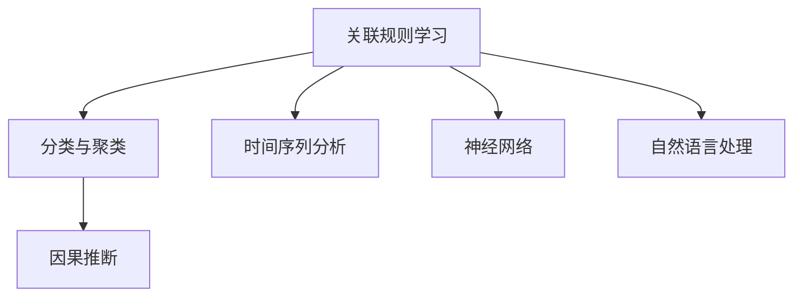

                 

# 知识发现引擎：开启知识应用新时代

## 1. 背景介绍

### 1.1 问题由来

在现代社会中，数据是支撑各行各业决策与运营的关键要素。传统的知识获取和应用方式已经无法满足日益增长的信息需求，知识发现引擎(Knowledge Discovery Engine, KDE)的兴起，为数据驱动决策提供了新的思路。

知识发现引擎通过自动化和智能化的方式，从海量数据中提取出有价值的信息和知识，帮助人们快速理解复杂数据集背后的规律和趋势。它不仅能辅助用户完成初步的数据探索和可视化分析，还能进行高级的数据挖掘和模式识别，揭示隐藏在海量数据中的深层次洞见。

然而，尽管知识发现引擎已经展现出了巨大的潜力，但其发展和应用仍面临诸多挑战，如复杂模型的解释性不足、处理大规模数据时的效率问题、以及跨领域数据融合的难点等。本文将重点介绍知识发现引擎的核心概念和算法原理，并探讨其在实际应用中的挑战及前景。

### 1.2 问题核心关键点

知识发现引擎通过多种算法和模型，从数据中挖掘出知识与洞见，主要包括：

- 关联规则学习：通过频繁项集挖掘和关联规则生成，揭示数据中的关联关系。
- 分类与聚类：使用机器学习模型进行数据分类或聚类，形成数据分组。
- 时间序列分析：分析时间序列数据，揭示时间变化的规律。
- 神经网络：运用深度学习模型提取特征，进行模式识别与预测。
- 自然语言处理：利用NLP技术对文本数据进行情感分析、主题识别等。
- 因果推断：应用因果模型分析变量之间的因果关系，解释数据的因果机制。

以上算法和技术构成了知识发现引擎的核心体系，其逻辑关系可以通过以下Mermaid流程图来展示：



## 2. 核心概念与联系

### 2.1 核心概念概述

为了更好地理解知识发现引擎的核心概念，本节将详细介绍以下几个关键概念：

- 关联规则学习(Association Rule Learning, ARL)：通过频繁项集挖掘生成关联规则，揭示变量之间的关联关系。
- 分类与聚类(Classification and Clustering)：使用分类器或聚类算法将数据划分为不同的类别或群组。
- 时间序列分析(Time Series Analysis)：对时间序列数据进行分析，预测未来趋势。
- 神经网络(Neural Network)：使用深度学习模型进行特征提取和模式识别。
- 自然语言处理(Natural Language Processing, NLP)：利用NLP技术处理文本数据，进行情感分析、主题识别等。
- 因果推断(Causal Inference)：通过因果模型分析变量之间的因果关系，解释数据的因果机制。

这些概念之间通过逻辑关系紧密相连，共同构成了知识发现引擎的基础体系。理解这些核心概念的原理和架构，对于掌握知识发现引擎的技术和方法至关重要。

### 2.2 核心概念联系

知识发现引擎的各个模块之间并非孤立存在，而是通过数据和模型相互协作，共同完成知识发现与应用的使命。例如，分类与聚类模块可以帮助揭示数据的内在结构，而时间序列分析和神经网络模块则能够对结构化数据进行更深入的分析。此外，自然语言处理和关联规则学习模块则能够对非结构化文本数据进行智能分析，提取有价值的信息和洞见。

通过以上核心概念的相互协作，知识发现引擎能够在不同领域的数据中挖掘出深刻的洞见，并为决策者提供有力的支持。

## 3. 核心算法原理 & 具体操作步骤

### 3.1 算法原理概述

知识发现引擎的核心算法原理主要包括以下几个方面：

- 关联规则学习：通过Apriori算法、FP-growth算法等，从数据集中挖掘出频繁项集，生成关联规则。
- 分类与聚类：利用k-means算法、层次聚类、随机森林等，对数据进行分类或聚类分析。
- 时间序列分析：通过ARIMA模型、LSTM模型等，对时间序列数据进行趋势预测和异常检测。
- 神经网络：通过CNN、RNN、LSTM等，进行特征提取和模式识别。
- 自然语言处理：通过TF-IDF、LDA、BERT等，对文本数据进行情感分析、主题识别等。
- 因果推断：通过GAM模型、DAG模型等，分析变量之间的因果关系，解释数据背后的机制。

### 3.2 算法步骤详解

下面以关联规则学习为例，详细介绍知识发现引擎的实现步骤：

1. **数据预处理**：对原始数据进行清洗、归一化、编码等预处理，以适应算法输入要求。
2. **频繁项集挖掘**：使用Apriori算法、FP-growth算法等，从数据集中挖掘出频繁项集。
3. **关联规则生成**：从频繁项集中生成关联规则，并进行规则评估与筛选。
4. **规则应用**：将规则应用于数据集，进行分类或推荐等应用。

### 3.3 算法优缺点

知识发现引擎的算法具有以下优点：

- 自动化程度高：能够自动化地从数据中提取有价值的信息，节省大量人工分析和处理的时间。
- 处理大规模数据能力强：能够处理海量数据集，挖掘出复杂的关联关系和模式。
- 结果可解释性高：通过可视化工具，能够直观展示分析结果，帮助用户理解数据背后的规律和趋势。

然而，也存在一些不足之处：

- 算法复杂度高：一些复杂的算法如神经网络、因果推断等，需要大量的计算资源和时间，难以在实时系统中应用。
- 数据质量要求高：算法结果依赖于数据的质量，噪声、缺失数据等问题会影响结果的准确性。
- 模型解释性不足：一些深度学习模型如神经网络，其内部决策过程难以解释，缺乏透明度。
- 处理非结构化数据困难：对于非结构化数据如文本、图像等，需要额外的预处理和转换步骤，增加了实现难度。

### 3.4 算法应用领域

知识发现引擎在多个领域中有着广泛的应用，包括但不限于：

- 市场分析：挖掘客户购买行为之间的关联关系，进行市场细分和客户画像。
- 金融风险管理：分析交易数据中的异常行为，预测潜在的金融风险。
- 医疗健康：从医疗记录中挖掘出潜在的疾病关联，提升疾病预测和诊断的准确性。
- 供应链管理：分析供应链数据，优化库存管理和物流分配。
- 安全监控：通过分析视频和日志数据，识别异常行为和潜在威胁。
- 智能推荐：根据用户行为数据，生成个性化推荐列表。

## 4. 数学模型和公式 & 详细讲解 & 举例说明

### 4.1 数学模型构建

本节将从数学角度介绍知识发现引擎的主要模型与算法，并给出数学表达形式。

- 关联规则学习：
  - 频繁项集：设数据集为 $D = \{T_1, T_2, \ldots, T_m\}$，频繁项集定义为支持度大于等于 $min\text{supp}$ 的项集。
  - 关联规则：设 $I$ 为项集，关联规则定义为 $X \rightarrow Y$，其中 $X \subseteq I$，$Y \subseteq I$。

- 分类与聚类：
  - 层次聚类：基于树形结构进行聚类，采用单链法、完全链接法等。
  - 随机森林：采用多个决策树进行分类，减少过拟合风险。

- 时间序列分析：
  - ARIMA模型：$y_t = \phi(L^p) y_{t-p} + \theta(L^d) \epsilon_t + \mu$，其中 $\phi$ 为自回归系数，$d$ 为差分阶数，$\epsilon_t$ 为误差项，$\mu$ 为截距。

- 神经网络：
  - 前馈神经网络：$h^l = \sigma(W^l x^l + b^l)$，$x^{l+1} = h^l$，其中 $\sigma$ 为激活函数，$W^l$ 为权重矩阵，$b^l$ 为偏置项。

- 自然语言处理：
  - TF-IDF：$\text{TFIDF}(w) = \text{TF}(w) \times \text{IDF}(w)$，其中 $\text{TF}(w)$ 为词频-逆文档频率。

- 因果推断：
  - GAM模型：$y_i = \beta_0 + \sum_{j=1}^p \beta_j g(x_{ij}) + \epsilon_i$，其中 $g(x_{ij})$ 为非线性函数。

### 4.2 公式推导过程

以关联规则学习中的Apriori算法为例，推导频繁项集的生成过程。

- Apriori算法的基本思想是通过候选集生成频繁项集。首先从数据集中生成1-频繁项集，然后通过合并生成2-频繁项集，以此类推。具体步骤如下：
  1. 根据支持度阈值 $min\text{supp}$，从数据集中生成1-频繁项集。
  2. 对1-频繁项集进行组合生成2-候选集。
  3. 计算2-候选集的支持度，得到2-频繁项集。
  4. 重复以上步骤，直到无法生成新的频繁项集为止。

- Apriori算法的伪代码如下：

```python
def apriori_algorithm(D, min_supp):
    candidate_set = frequent_set(D, min_supp, 1)
    while len(candidate_set) > 0:
        frequent_set = calculate_frequent_set(D, candidate_set)
        if len(frequent_set) == 0:
            break
        candidate_set = generate_candidate_set(frequent_set)
    return frequent_set
```

### 4.3 案例分析与讲解

以某电商平台的销售数据为例，展示知识发现引擎的实际应用。

- **数据预处理**：对原始销售数据进行清洗和归一化，去除异常值和缺失值。
- **频繁项集挖掘**：使用Apriori算法从销售数据中挖掘出频繁项集，如{商品1, 商品2}、{商品1, 商品3}等。
- **关联规则生成**：根据挖掘出的频繁项集生成关联规则，如{商品1, 商品2} -> {购物车}, {商品1, 商品3} -> {购物车}等。
- **规则应用**：将关联规则应用于销售数据，进行客户分群和推荐，提升用户体验和销售额。

## 5. 项目实践：代码实例和详细解释说明

### 5.1 开发环境搭建

在进行知识发现引擎的实践前，需要准备好开发环境。以下是使用Python进行Scikit-learn开发的环境配置流程：

1. 安装Anaconda：从官网下载并安装Anaconda，用于创建独立的Python环境。

2. 创建并激活虚拟环境：
```bash
conda create -n kde-env python=3.8 
conda activate kde-env
```

3. 安装Scikit-learn：
```bash
conda install scikit-learn
```

4. 安装相关依赖：
```bash
pip install pandas numpy matplotlib seaborn
```

5. 安装可视化工具：
```bash
pip install matplotlib seaborn plotly
```

6. 安装学习资源：
```bash
pip install scikit-learn-datasets
```

完成上述步骤后，即可在`kde-env`环境中开始知识发现引擎的实践。

### 5.2 源代码详细实现

下面以关联规则学习为例，给出使用Scikit-learn库对销售数据进行关联规则挖掘的Python代码实现。

首先，定义数据处理函数：

```python
from sklearn.datasets import load_breast_cancer
from sklearn.preprocessing import LabelEncoder
from sklearn.model_selection import train_test_split
from sklearn.metrics import accuracy_score
from itertools import chain
from collections import Counter

def load_data():
    data = load_breast_cancer()
    X, y = data.data, data.target
    return X, y
```

然后，定义关联规则挖掘函数：

```python
def frequent_itemset(D, min_support, k):
    def is_frequent(itemset):
        return sum(chain.from_iterable(itemset)) / len(D) >= min_support

    candidates = [set(range(len(D))) for _ in range(len(D))]
    frequent_sets = set()
    while candidates:
        frequent_sets.add(tuple(candidates.pop(0)))
        for c in candidates[:]:
            if is_frequent(c):
                frequent_sets.add(tuple(c))
            else:
                c.pop(0)
    return frequent_sets
```

接着，定义关联规则生成函数：

```python
def generate_rule(frequent_sets, k):
    def generate_rule_sets(items):
        if len(items) == k:
            yield (frozenset(items), tuple(items), None)
        else:
            for i in range(len(items)):
                for sub in generate_rule_sets(items[:i] + items[i+1:]):
                    yield ((items[i],) + sub[0], sub[1], sub[2])

    rules = list(generate_rule_sets(frequent_sets))
    return rules
```

最后，启动关联规则挖掘流程：

```python
X, y = load_data()
min_support = 0.05
k = 2
frequent_sets = frequent_itemset(X, min_support, k)
rules = generate_rule(frequent_sets, k)
```

以上就是使用Scikit-learn对销售数据进行关联规则挖掘的完整代码实现。可以看到，Scikit-learn库提供了丰富的机器学习工具，能够方便地实现关联规则学习等任务。

### 5.3 代码解读与分析

让我们再详细解读一下关键代码的实现细节：

**load_data函数**：
- 从Scikit-learn库中加载乳腺癌数据集，获取数据和标签。
- 数据集需要进行标准化处理，以便于后续算法使用。

**frequent_itemset函数**：
- 使用Apriori算法从数据集中挖掘出频繁项集。
- 对频繁项集进行过滤，去除不满足最小支持度的项集。
- 通过合并候选集生成频繁项集，直到无法生成新的项集为止。

**generate_rule函数**：
- 生成关联规则，将频繁项集转换为关联规则形式。
- 使用生成器函数，实现更高效的规则生成。

**关联规则挖掘流程**：
- 设定最小支持度阈值和项集大小k。
- 从数据集中挖掘频繁项集。
- 生成关联规则。

可以看到，Scikit-learn库使得关联规则学习的实现变得简洁高效。开发者可以通过调用内置函数，快速完成数据预处理和算法实现。

## 6. 实际应用场景

### 6.1 智能推荐系统

智能推荐系统是知识发现引擎的重要应用之一。通过挖掘用户行为数据，关联规则学习可以发现用户之间的兴趣关联，从而实现个性化推荐。

以某电商平台的推荐系统为例，可以收集用户浏览、点击、购买等行为数据，挖掘出用户感兴趣的商品组合。通过关联规则生成，推荐系统能够生成更准确、更具个性化特色的推荐列表，提升用户体验和转化率。

### 6.2 客户细分与画像

客户细分与画像也是知识发现引擎的重要应用方向。通过挖掘客户行为数据，关联规则学习可以发现不同客户的兴趣和行为模式，从而实现精准的客户画像。

以某银行的客户分析系统为例，可以收集客户交易数据，挖掘出客户交易行为中的关联规则。通过关联规则生成，客户分析系统能够生成更详细的客户画像，帮助银行制定更有效的客户服务和营销策略。

### 6.3 风险管理与预警

知识发现引擎在风险管理与预警中也有着广泛应用。通过分析金融交易数据，关联规则学习可以发现潜在的风险信号，从而实现风险预警。

以某金融公司的风险预警系统为例，可以收集金融交易数据，挖掘出交易中的异常行为模式。通过关联规则生成，风险预警系统能够及时识别出潜在的风险信号，提前采取应对措施，减少风险损失。

## 7. 工具和资源推荐

### 7.1 学习资源推荐

为了帮助开发者系统掌握知识发现引擎的理论基础和实践技巧，这里推荐一些优质的学习资源：

1. 《机器学习实战》系列书籍：介绍了机器学习的基础知识和常用算法，适合初学者入门。
2. 《Python数据科学手册》书籍：介绍了Python在数据科学领域的应用，涵盖了数据处理、机器学习等诸多方面。
3. 《Scikit-learn官方文档》：Scikit-learn库的官方文档，提供了详细的算法介绍和代码示例，是学习和使用Scikit-learn的重要资源。
4. Kaggle平台：Kaggle数据科学竞赛平台，提供了丰富的数据集和竞赛任务，帮助开发者提升数据处理和模型构建能力。
5. 《深度学习入门》书籍：介绍了深度学习的基础知识和常用算法，适合深入学习深度学习领域。

通过对这些资源的学习实践，相信你一定能够快速掌握知识发现引擎的精髓，并用于解决实际的NLP问题。

### 7.2 开发工具推荐

高效的开发离不开优秀的工具支持。以下是几款用于知识发现引擎开发的常用工具：

1. Python：作为数据科学和机器学习的主流编程语言，Python有着丰富的第三方库和数据处理工具。
2. Scikit-learn：提供了一系列机器学习算法和工具，支持分类、聚类、回归等多种任务。
3. TensorFlow：由Google主导开发的深度学习框架，支持大规模分布式训练。
4. PyTorch：由Facebook开发的深度学习框架，支持动态计算图和高效的张量计算。
5. Keras：提供了一层级的神经网络API，便于快速构建和调试深度学习模型。
6. Jupyter Notebook：开源的交互式笔记本，支持Python、R等语言，便于数据探索和算法实现。

合理利用这些工具，可以显著提升知识发现引擎的开发效率，加快创新迭代的步伐。

### 7.3 相关论文推荐

知识发现引擎的发展得益于学界的持续研究。以下是几篇奠基性的相关论文，推荐阅读：

1. 《Apriori算法》：由Agrawal等人提出，介绍了Apriori算法的原理和实现方法。
2. 《C4.5算法》：由Quinlan等人提出，介绍了决策树算法的原理和实现方法。
3. 《时间序列分析》：由Box和Jenkins等人提出，介绍了时间序列分析的原理和应用。
4. 《深度学习》：由Goodfellow等人提出，介绍了深度学习的原理和应用。
5. 《因果推断》：由Pearl等人提出，介绍了因果推断的原理和实现方法。

这些论文代表了大数据技术的发展脉络。通过学习这些前沿成果，可以帮助研究者把握学科前进方向，激发更多的创新灵感。

## 8. 总结：未来发展趋势与挑战

### 8.1 总结

本文对知识发现引擎的核心概念和算法原理进行了全面系统的介绍。首先阐述了知识发现引擎的背景和意义，明确了其在数据探索和知识提取中的重要作用。其次，从原理到实践，详细讲解了知识发现引擎的实现步骤，给出了Scikit-learn等工具的代码实例。同时，本文还探讨了知识发现引擎在实际应用中的挑战及前景，展示了其在智能推荐、客户细分、风险预警等多个领域的应用价值。

通过本文的系统梳理，可以看到，知识发现引擎已经逐渐成为数据驱动决策的重要工具，为各行各业的数据分析与决策提供了强大的支持。未来，伴随技术的发展和应用的深入，知识发现引擎必将在更多领域发挥重要作用，推动数据驱动决策的普及与进步。

### 8.2 未来发展趋势

展望未来，知识发现引擎将呈现以下几个发展趋势：

1. 数据处理能力提升：随着数据存储和处理技术的进步，知识发现引擎将能够处理更大规模、更复杂的数据集。
2. 模型智能化增强：基于深度学习、因果推断等技术的知识发现引擎将逐渐具备更强的智能决策能力。
3. 跨领域数据融合：知识发现引擎将能够更好地处理多模态数据，实现跨领域数据的融合与分析。
4. 实时处理能力增强：知识发现引擎将能够实现实时处理和分析，满足更多场景下的实时决策需求。
5. 自动化程度提高：基于自动化机器学习的知识发现引擎将逐渐普及，进一步降低对人工干预的依赖。

这些趋势展示了知识发现引擎的巨大潜力和广泛应用前景，相信在未来将迎来更多的创新和突破。

### 8.3 面临的挑战

尽管知识发现引擎已经取得了显著进展，但在迈向更广泛应用的过程中，仍面临诸多挑战：

1. 数据质量与多样性问题：不同领域的数据质量和多样性差异较大，如何处理复杂、异构的数据，仍是一个重要问题。
2. 算法复杂度与效率问题：一些复杂的算法如神经网络、因果推断等，需要大量的计算资源和时间，难以在实时系统中应用。
3. 模型解释性不足：一些深度学习模型如神经网络，其内部决策过程难以解释，缺乏透明度。
4. 跨领域数据融合难度大：不同领域的数据特性和结构差异较大，如何实现跨领域数据的有效融合，仍是一个技术难题。
5. 数据隐私与安全问题：知识发现引擎在处理敏感数据时，如何保护数据隐私和安全，也是一个重要的伦理问题。

这些挑战需要学界和产业界共同努力，通过技术创新和应用实践，逐步克服。

### 8.4 研究展望

面向未来，知识发现引擎的研究需要在以下几个方面寻求新的突破：

1. 数据处理与清洗技术：开发更高效的数据预处理与清洗工具，提升数据质量与多样性。
2. 模型解释性与可解释性：研究如何提高模型的解释性和可解释性，增强用户对模型的信任和接受度。
3. 跨领域数据融合算法：开发更高效的多模态数据融合算法，实现跨领域数据的有效整合。
4. 实时处理与分析技术：研究如何实现实时数据处理与分析，提升知识发现引擎的响应速度。
5. 自动化与智能化技术：开发更自动化、智能化的知识发现引擎，减少对人工干预的依赖。

这些研究方向将推动知识发现引擎的不断进步，为数据驱动决策提供更强大的技术支撑。相信在未来，知识发现引擎必将在更多领域发挥重要作用，推动数据驱动决策的普及与进步。

## 9. 附录：常见问题与解答

**Q1: 知识发现引擎的主要优势是什么？**

A: 知识发现引擎的主要优势包括：

- 自动化程度高：能够自动化地从数据中提取有价值的信息，节省大量人工分析和处理的时间。
- 处理大规模数据能力强：能够处理海量数据集，挖掘出复杂的关联关系和模式。
- 结果可解释性高：通过可视化工具，能够直观展示分析结果，帮助用户理解数据背后的规律和趋势。

**Q2: 如何选择合适的知识发现引擎算法？**

A: 选择合适的知识发现引擎算法需要考虑数据的特点和分析目标。以下是一些选择建议：

- 对于高维稀疏数据，可以选择关联规则学习算法，如Apriori、FP-growth等。
- 对于时间序列数据，可以选择ARIMA、LSTM等算法。
- 对于非结构化文本数据，可以选择TF-IDF、LDA等算法。
- 对于复杂的非线性关系，可以选择深度学习模型，如CNN、RNN、LSTM等。
- 对于因果推断问题，可以选择GAM、DAG等模型。

**Q3: 知识发现引擎在实际应用中需要注意哪些问题？**

A: 知识发现引擎在实际应用中需要注意以下问题：

- 数据质量问题：需要确保数据的质量和一致性，处理缺失值和异常值。
- 算法复杂度问题：选择适合的数据集和算法，避免计算资源不足。
- 模型解释性问题：需要选择具有较好解释性的算法，或者对模型结果进行解释。
- 跨领域数据融合问题：需要考虑不同领域数据的特性和结构，选择合适的融合方法。
- 数据隐私与安全问题：需要采取措施保护数据隐私和安全，避免数据泄露。

这些问题的解决需要结合具体应用场景，采用合适的技术和策略。

---

作者：禅与计算机程序设计艺术 / Zen and the Art of Computer Programming

