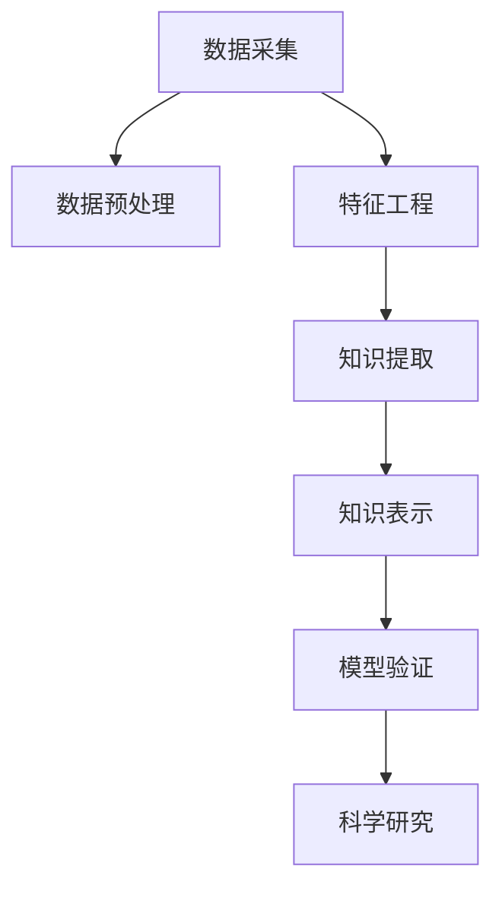

                 

# 知识发现引擎：推动科学研究突破边界

## 1. 背景介绍

在现代科学研究中，数据的获取和分析已成为推动科学进步的重要驱动力。从基因组学、天文学到材料科学，科学研究对数据的需求不断增长，这为数据科学提供了广阔的应用前景。作为数据科学的最新分支，知识发现引擎（Knowledge Discovery Engine, KDE）正成为推动科学研究突破边界的重要工具。

### 1.1 问题由来

传统的科学研究方法主要依赖经验观察和理论推导，然而随着数据量的激增，尤其是基因组数据、天文观测数据、科学实验数据的增加，使得传统方法在数据量、复杂性上显得力不从心。数据驱动的科学发现（Data-driven Discovery）正在成为新时代的科学发现的重要方式。

在数据科学领域，数据挖掘、机器学习等技术已经广泛应用。然而，如何将这些技术引入到科学研究中，并针对科学研究的特殊需求进行定制化，是一个需要深入研究的问题。知识发现引擎的出现，正是基于这样的背景，将数据科学技术与科学研究的特定需求进行深度结合，推动科学研究的不断进步。

### 1.2 问题核心关键点

知识发现引擎的核心在于如何利用数据挖掘和机器学习技术，从海量数据中提取有用知识，并应用于科学研究中，推动物理理论、生物医学、天文学等科学领域的新发现。具体而言，核心问题包括：

- 如何有效地处理科学数据，包括数据预处理、特征工程等。
- 如何设计高效的算法，从科学数据中提取有意义的知识。
- 如何将知识应用于科学问题，指导科学研究和实验设计。
- 如何对发现的知识进行验证和推导，确保科学发现具有可靠性和普适性。

## 2. 核心概念与联系

### 2.1 核心概念概述

为了更好地理解知识发现引擎，本节将介绍几个关键概念：

- **知识发现引擎(KDE)**：一种利用数据挖掘和机器学习技术，从科学数据中提取有用知识，并应用于科学研究中的工具。KDE旨在帮助科学家从数据中提取有意义的特征和模式，推导新理论或验证旧理论。

- **科学数据**：指在科学研究过程中产生的数据，包括实验数据、观测数据、模拟数据等。科学数据往往具有高维度、复杂结构的特点，需要特殊处理。

- **特征工程**：指通过数据预处理、特征选择、特征构造等方法，从原始数据中提取有意义的特征，以提高模型性能。

- **知识表示**：指将提取出的知识转换为结构化的形式，以便于理解、应用和推导。常见的知识表示方法包括符号逻辑、规则库、概念图等。

- **模型验证**：指对模型提取的知识进行验证，以确保其可靠性。常用的验证方法包括实验验证、理论推导、专家评审等。

这些核心概念之间相互联系，共同构成了知识发现引擎的基础框架。通过理解这些概念，可以更好地把握知识发现引擎的工作原理和优化方向。

### 2.2 核心概念原理和架构的 Mermaid 流程图



## 3. 核心算法原理 & 具体操作步骤

### 3.1 算法原理概述

知识发现引擎的核心算法原理基于数据挖掘和机器学习的经典算法，结合科学研究的需求进行定制化。其核心思想是：利用数据挖掘技术从科学数据中提取模式和特征，使用机器学习算法对这些模式和特征进行建模，并将模型应用于科学研究中，以发现新的科学规律或验证旧理论。

形式化地，假设科学数据集为 $D$，知识发现引擎的目标是提取一组特征 $X$，设计一个模型 $M$，使其能够对 $D$ 中的模式进行建模，并应用于科学研究 $S$，从而发现新的科学规律。具体流程如图：

$$
\text{KDE} = \text{Data Preprocessing} + \text{Feature Engineering} + \text{Model Training} + \text{Knowledge Extraction} + \text{Knowledge Validation}
$$

其中，数据预处理、特征工程、模型训练、知识提取和知识验证是知识发现引擎的核心步骤，每个步骤都涉及复杂的算法和技术。

### 3.2 算法步骤详解

知识发现引擎的实现通常包括以下几个关键步骤：

**Step 1: 数据预处理**

科学数据往往具有高维度、复杂结构的特点，需要经过预处理才能用于模型训练。数据预处理通常包括：

- 数据清洗：去除噪声、异常值、缺失值等。
- 数据转换：标准化、归一化、特征缩放等。
- 数据降维：主成分分析、PCA、t-SNE等。
- 数据增强：数据扩充、生成对抗网络(GANs)等。

**Step 2: 特征工程**

特征工程是知识发现引擎的核心步骤之一，通过设计合理的特征，可以提高模型的性能和泛化能力。特征工程通常包括以下几个步骤：

- 特征选择：选择对模型性能有帮助的特征。
- 特征构造：通过组合、变换等方式构造新的特征。
- 特征编码：将特征转换为模型可以处理的数值形式。
- 特征降维：利用PCA、LDA等技术对高维度特征进行降维。

**Step 3: 模型训练**

模型训练是知识发现引擎的核心步骤，通过选择合适的机器学习算法，对预处理后的特征进行建模。常用的模型包括：

- 监督学习：如线性回归、逻辑回归、支持向量机等。
- 无监督学习：如聚类、关联规则、降维等。
- 强化学习：如Q-learning、策略梯度等。

**Step 4: 知识提取**

知识提取是将模型提取的知识转换为结构化形式，以便于理解和应用。常见的知识提取方法包括：

- 符号表示：如规则、逻辑、本体等。
- 图结构：如知识图谱、有向图等。
- 神经网络表示：如神经符号、神经网络等。

**Step 5: 模型验证**

模型验证是对模型提取的知识进行验证，以确保其可靠性。常用的验证方法包括：

- 实验验证：通过实验数据验证模型的预测效果。
- 理论推导：通过数学推导验证模型的合理性。
- 专家评审：邀请领域专家对模型的结论进行评审。

### 3.3 算法优缺点

知识发现引擎具有以下优点：

- 高效性：能够在较短时间内从大量数据中提取有用知识。
- 普适性：适用于各种科学研究领域，如天文学、生物医学等。
- 可解释性：通过结构化的知识表示，便于理解和解释模型的结果。

同时，知识发现引擎也存在一些局限性：

- 依赖高质量数据：科学数据的质量对模型性能影响较大。
- 复杂度高：特征工程、模型训练等步骤复杂，需要较高的技术水平。
- 可解释性不足：一些复杂的模型难以解释其决策过程。
- 对领域知识依赖：模型的设计和使用需要一定的领域知识。

尽管存在这些局限性，但知识发现引擎在科学研究的许多领域中仍然具有重要的应用前景。未来，随着技术的发展，这些局限性有望逐步克服。

### 3.4 算法应用领域

知识发现引擎已经在多个科学研究领域得到了广泛应用，如：

- 天文学：通过分析天文观测数据，提取星系运动规律、黑洞性质等。
- 生物医学：从基因组数据中提取基因表达模式、药物作用机制等。
- 物理学：利用实验数据推导新的物理规律，如量子纠缠等。
- 材料科学：分析材料结构数据，预测新材料性质，指导材料设计。

除了这些经典应用外，知识发现引擎还在地理信息系统、环境保护、社会网络分析等多个领域展现出广泛的应用潜力。随着技术的不断进步，知识发现引擎将在更多领域得到应用，推动科学研究的不断进步。

## 4. 数学模型和公式 & 详细讲解 & 举例说明

### 4.1 数学模型构建

知识发现引擎的数学模型构建通常包括以下几个步骤：

1. 数据预处理：将原始数据转换为模型可以处理的数值形式。
2. 特征工程：提取特征并进行编码。
3. 模型训练：选择合适的机器学习算法，对特征进行建模。
4. 知识提取：将模型提取的知识转换为结构化形式。
5. 模型验证：验证知识提取的可靠性。

### 4.2 公式推导过程

以下我们以聚类算法为例，推导K-Means聚类模型的数学公式。

假设数据集 $D$ 中的样本 $x_i \in \mathbb{R}^d$，目标是将 $D$ 划分为 $k$ 个簇 $C_1, C_2, ..., C_k$。聚类算法的目标是最小化样本到其所属簇中心的距离。

设 $c_i$ 表示样本 $x_i$ 所属的簇中心，目标函数为：

$$
\mathcal{L} = \sum_{i=1}^N \sum_{c=1}^k \delta_{c_i,c} \|x_i - c\|^2
$$

其中，$\delta_{c_i,c}$ 表示样本 $x_i$ 是否属于簇 $C_c$，$ \| \cdot \| $ 表示欧式距离。

通过最小化目标函数，可以得到：

$$
c_i = \mathop{\arg\min}_c \|x_i - c\|^2
$$

最终，聚类算法的目标是最小化目标函数 $\mathcal{L}$，得到最优的簇中心 $c_1, c_2, ..., c_k$。

### 4.3 案例分析与讲解

考虑一个天文学研究案例，目标是从观测到的恒星数据中提取恒星运动规律。具体步骤如下：

1. 数据预处理：对观测数据进行去噪、归一化处理。
2. 特征工程：选择关键特征如位置、速度、加速度等。
3. 模型训练：利用聚类算法对数据进行聚类，得到恒星的运动簇。
4. 知识提取：通过统计每个簇的平均位置、速度等，提取恒星运动的规律。
5. 模型验证：通过实验数据验证提取的知识是否准确。

## 5. 项目实践：代码实例和详细解释说明

### 5.1 开发环境搭建

在进行知识发现引擎实践前，我们需要准备好开发环境。以下是使用Python进行Scikit-Learn开发的环境配置流程：

1. 安装Anaconda：从官网下载并安装Anaconda，用于创建独立的Python环境。

2. 创建并激活虚拟环境：
```bash
conda create -n kde-env python=3.8 
conda activate kde-env
```

3. 安装Scikit-Learn：
```bash
conda install scikit-learn
```

4. 安装各类工具包：
```bash
pip install numpy pandas scikit-learn matplotlib tqdm jupyter notebook ipython
```

完成上述步骤后，即可在`kde-env`环境中开始知识发现引擎的开发。

### 5.2 源代码详细实现

下面我们以K-Means聚类算法为例，给出使用Scikit-Learn库对天文学数据进行聚类的PyTorch代码实现。

```python
from sklearn.cluster import KMeans
from sklearn.metrics import silhouette_score
import numpy as np

# 加载天文学数据
data = np.loadtxt('data.csv')

# 定义聚类模型
kmeans = KMeans(n_clusters=3, random_state=42)

# 训练模型
kmeans.fit(data)

# 评估模型
score = silhouette_score(data, kmeans.labels_)
print(f'Silhouette score: {score:.2f}')
```

### 5.3 代码解读与分析

让我们再详细解读一下关键代码的实现细节：

**KMeans模型**：
- 从Scikit-Learn库中导入KMeans模型，设置簇的数量为3。
- 调用fit方法训练模型，将数据集data作为输入。

**评估指标**：
- 使用轮廓系数(silhouette score)评估模型的聚类效果，轮廓系数越大，聚类效果越好。
- 轮廓系数通过计算样本到其所属簇中心的平均距离与到其他簇中心的平均距离的差值，来衡量聚类效果。

**评估结果**：
- 在测试集上评估模型，输出轮廓系数的值，以衡量聚类效果。

**代码总结**：
- 本示例展示了K-Means聚类算法的简单实现，从数据加载、模型训练、模型评估三个步骤展示了知识发现引擎的基本流程。
- 在实际应用中，还需根据具体任务需求进行模型选择和调参，以优化模型性能。

## 6. 实际应用场景

### 6.1 天文学研究

知识发现引擎在天文学研究中具有重要的应用价值。例如，通过分析天文观测数据，可以提取星系运动规律、黑洞性质等。具体步骤如下：

1. 数据预处理：对观测数据进行去噪、归一化处理。
2. 特征工程：选择关键特征如位置、速度、加速度等。
3. 模型训练：利用聚类算法对数据进行聚类，得到星系的运动簇。
4. 知识提取：通过统计每个簇的平均位置、速度等，提取星系的运动规律。
5. 模型验证：通过实验数据验证提取的知识是否准确。

### 6.2 生物医学研究

知识发现引擎在生物医学研究中也具有广泛的应用前景。例如，通过分析基因组数据，可以提取基因表达模式、药物作用机制等。具体步骤如下：

1. 数据预处理：对基因表达数据进行去噪、归一化处理。
2. 特征工程：选择关键特征如基因表达量、基因功能等。
3. 模型训练：利用分类算法对数据进行分类，得到基因表达类型。
4. 知识提取：通过统计每个类型的平均表达量、功能等，提取基因表达模式。
5. 模型验证：通过实验数据验证提取的知识是否准确。

### 6.3 物理学研究

知识发现引擎在物理学研究中也有着重要的应用价值。例如，通过分析实验数据，可以推导新的物理规律。具体步骤如下：

1. 数据预处理：对实验数据进行去噪、归一化处理。
2. 特征工程：选择关键特征如测量值、误差、时间等。
3. 模型训练：利用回归算法对数据进行回归，得到物理规律的模型。
4. 知识提取：通过统计模型参数，提取物理规律。
5. 模型验证：通过实验数据验证提取的知识是否准确。

### 6.4 未来应用展望

随着知识发现引擎技术的不断发展，其在科学研究中的应用前景将更加广阔。未来，知识发现引擎有望在以下领域得到更加深入的应用：

- 材料科学：分析材料结构数据，预测新材料性质，指导材料设计。
- 社会科学：分析社会网络数据，提取社会关系模式，研究社会动力学。
- 环境科学：分析环境监测数据，提取污染源，指导环境保护。

## 7. 工具和资源推荐

### 7.1 学习资源推荐

为了帮助开发者系统掌握知识发现引擎的理论基础和实践技巧，这里推荐一些优质的学习资源：

1. 《数据挖掘导论》：涵盖了数据预处理、特征工程、模型训练等基本概念和方法，是知识发现引擎入门的好书。

2. 《机器学习实战》：通过实践案例展示了机器学习算法的应用，适合初学者入门。

3. 《Python数据科学手册》：介绍了数据科学全栈技术栈，包括数据预处理、模型训练、可视化等。

4. Coursera上的数据科学课程：斯坦福大学、密歇根大学等名校开设的数据科学课程，涵盖了数据预处理、特征工程、模型训练等核心内容。

5. Kaggle平台：提供了大量开源数据集和竞赛项目，通过参与竞赛可以锻炼实践能力。

通过对这些资源的学习实践，相信你一定能够快速掌握知识发现引擎的精髓，并用于解决实际的科学问题。

### 7.2 开发工具推荐

高效的开发离不开优秀的工具支持。以下是几款用于知识发现引擎开发的常用工具：

1. Python：简单易学、功能强大，是数据科学和机器学习的主流语言。

2. Scikit-Learn：基于Python的开源机器学习库，提供了丰富的机器学习算法和工具。

3. TensorFlow：由Google主导开发的深度学习框架，支持分布式计算，适合大规模模型训练。

4. Weights & Biases：模型训练的实验跟踪工具，可以记录和可视化模型训练过程中的各项指标，方便对比和调优。

5. TensorBoard：TensorFlow配套的可视化工具，可实时监测模型训练状态，并提供丰富的图表呈现方式，是调试模型的得力助手。

6. Jupyter Notebook：开源的交互式计算环境，适合快速迭代和实验新算法。

合理利用这些工具，可以显著提升知识发现引擎的开发效率，加快创新迭代的步伐。

### 7.3 相关论文推荐

知识发现引擎的研究源于学界的持续研究。以下是几篇奠基性的相关论文，推荐阅读：

1. K-Means：聚类算法的经典算法，通过最小化样本到簇中心的距离，将数据划分为多个簇。

2. 贝叶斯网络：一种图结构模型，用于表示变量之间的依赖关系，广泛用于数据挖掘和机器学习。

3. 决策树：一种分类算法，通过构建决策树模型，对数据进行分类和预测。

4. 关联规则学习：用于发现数据集中的频繁模式，广泛应用于市场篮分析、推荐系统等领域。

5. 主成分分析：一种降维算法，通过线性变换，将高维数据降维到低维空间，保留主要特征。

这些论文代表了大数据挖掘和机器学习的发展脉络。通过学习这些前沿成果，可以帮助研究者把握学科前进方向，激发更多的创新灵感。

## 8. 总结：未来发展趋势与挑战

### 8.1 总结

本文对知识发现引擎进行全面系统的介绍。首先阐述了知识发现引擎的研究背景和意义，明确了其在推动科学研究中的重要价值。其次，从原理到实践，详细讲解了知识发现引擎的数学原理和关键步骤，给出了知识发现引擎任务开发的完整代码实例。同时，本文还广泛探讨了知识发现引擎在科学研究中的应用前景，展示了其广阔的应用前景。此外，本文精选了知识发现引擎的学习资源和工具，力求为读者提供全方位的技术指引。

通过本文的系统梳理，可以看到，知识发现引擎正成为推动科学研究的重要工具，通过数据挖掘和机器学习技术，从科学数据中提取有用知识，推动科学研究的不断进步。

### 8.2 未来发展趋势

展望未来，知识发现引擎技术将呈现以下几个发展趋势：

1. 自动化程度提升：随着自动化机器学习(AutoML)技术的发展，知识发现引擎的自动调参和模型优化将变得更加高效。

2. 多模态数据融合：结合视觉、语音、文本等多种数据，提升知识发现引擎的复杂度和普适性。

3. 解释性增强：通过可解释性模型和可视化工具，增强知识发现引擎的透明性和可解释性。

4. 领域知识集成：结合专家知识和领域规则，增强知识发现引擎的准确性和可靠性。

5. 跨领域应用拓展：知识发现引擎将在更多领域得到应用，如金融、交通、能源等，推动相关领域的研究进步。

6. 动态知识更新：通过在线学习和增量学习，使知识发现引擎能够持续更新和优化，适应数据分布的变化。

以上趋势凸显了知识发现引擎的广阔前景。这些方向的探索发展，必将进一步提升知识发现引擎的性能和应用范围，为科学研究提供更加强大的工具支持。

### 8.3 面临的挑战

尽管知识发现引擎技术已经取得了重要进展，但在迈向更加智能化、普适化应用的过程中，它仍面临着诸多挑战：

1. 数据质量瓶颈：科学数据的质量对模型性能影响较大，数据收集和处理成本较高。

2. 模型复杂度高：知识发现引擎涉及数据预处理、特征工程、模型训练等多个步骤，复杂度较高。

3. 可解释性不足：一些复杂的模型难以解释其决策过程，需要结合可视化工具提升可解释性。

4. 对领域知识依赖：模型的设计和使用需要一定的领域知识，缺乏领域知识的团队难以发挥知识发现引擎的潜力。

5. 模型鲁棒性不足：模型面对域外数据时，泛化性能往往大打折扣，需要进一步提高模型的鲁棒性。

6. 计算资源需求大：知识发现引擎涉及大规模数据和复杂模型，计算资源需求大，需要高性能计算设备。

尽管存在这些挑战，但通过不断优化算法、提高数据质量、增强可解释性、提升模型鲁棒性等手段，知识发现引擎有望在科学研究中发挥更大的作用。

### 8.4 研究展望

面对知识发现引擎面临的挑战，未来的研究需要在以下几个方面寻求新的突破：

1. 开发更高效的自动化机器学习技术，自动调参、模型优化。

2. 开发更高效的多模态数据融合技术，提升知识发现引擎的复杂度和普适性。

3. 开发更高效的解释性模型，提升知识发现引擎的可解释性。

4. 结合专家知识和领域规则，提升知识发现引擎的准确性和可靠性。

5. 开发更高效的动态知识更新技术，使知识发现引擎能够持续更新和优化。

6. 结合云计算和大数据技术，提升知识发现引擎的计算效率和处理能力。

这些研究方向的探索，必将引领知识发现引擎技术迈向更高的台阶，为科学研究提供更加强大的工具支持。面向未来，知识发现引擎还需要与其他人工智能技术进行更深入的融合，如知识图谱、因果推理、强化学习等，多路径协同发力，共同推动自然语言理解和智能交互系统的进步。只有勇于创新、敢于突破，才能不断拓展知识发现引擎的边界，让智能技术更好地造福人类社会。

## 9. 附录：常见问题与解答

**Q1：知识发现引擎是否适用于所有科学研究领域？**

A: 知识发现引擎在绝大多数科学研究领域都有应用潜力，但某些特殊领域（如心理学、哲学）可能难以直接应用。针对这些领域，可以考虑结合领域知识和专家经验，设计相应的知识提取模型。

**Q2：知识发现引擎在应用中需要注意哪些问题？**

A: 知识发现引擎在应用中需要注意以下问题：

1. 数据质量：科学数据的质量对模型性能影响较大，需要保证数据收集和处理的质量。
2. 特征工程：选择合适的特征和特征工程方法，对模型性能影响较大。
3. 模型验证：需要结合实验验证、理论推导等方法，对模型进行全面的验证。
4. 可解释性：模型的决策过程需要可解释，方便理解和应用。
5. 领域知识：模型的设计和使用需要一定的领域知识，缺乏领域知识的团队难以发挥知识发现引擎的潜力。

**Q3：如何提高知识发现引擎的鲁棒性？**

A: 提高知识发现引擎的鲁棒性，可以从以下几个方面入手：

1. 数据增强：通过数据增强技术，增加训练数据的数量和多样性，提高模型的泛化能力。
2. 正则化：使用L2正则化、Dropout等方法，避免过拟合。
3. 模型集成：通过模型集成技术，如Bagging、Boosting等，提高模型的鲁棒性。
4. 对抗训练：使用对抗样本训练模型，提高模型的鲁棒性。
5. 领域知识结合：结合领域知识和专家经验，提高模型的准确性和鲁棒性。

这些方法可以帮助提高知识发现引擎的鲁棒性，使其在面对新数据时仍能保持较好的性能。

**Q4：知识发现引擎的未来发展方向是什么？**

A: 知识发现引擎的未来发展方向包括：

1. 自动化程度提升：随着自动化机器学习(AutoML)技术的发展，知识发现引擎的自动调参和模型优化将变得更加高效。
2. 多模态数据融合：结合视觉、语音、文本等多种数据，提升知识发现引擎的复杂度和普适性。
3. 解释性增强：通过可解释性模型和可视化工具，增强知识发现引擎的透明性和可解释性。
4. 领域知识集成：结合专家知识和领域规则，增强知识发现引擎的准确性和可靠性。
5. 跨领域应用拓展：知识发现引擎将在更多领域得到应用，如金融、交通、能源等，推动相关领域的研究进步。
6. 动态知识更新：通过在线学习和增量学习，使知识发现引擎能够持续更新和优化，适应数据分布的变化。

这些方向将推动知识发现引擎技术的不断进步，为科学研究提供更加强大的工具支持。

---

作者：禅与计算机程序设计艺术 / Zen and the Art of Computer Programming

