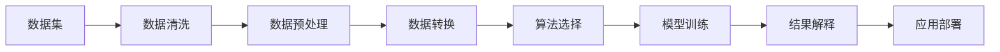

                 

# 知识发现引擎：知识与洞察力的互补与提升

## 1. 背景介绍

随着数据量的爆炸性增长，数据处理和分析技术成为了企业决策的关键。传统的基于规则的系统难以应对复杂多变的数据环境，而数据挖掘和机器学习技术在提供深度洞察力方面表现出巨大的潜力。知识发现引擎(Knowledge Discovery Engine, KDE)作为一种将大数据、人工智能和商业智能相结合的技术，在提取数据中的隐含信息和知识方面，提供了独特而强大的能力。

### 1.1 问题由来
知识发现引擎诞生于20世纪90年代，旨在从大规模数据集中自动发现潜在的知识模式。它通过结合数据挖掘、统计学、机器学习和数据库技术，对海量数据进行深度分析，从而提炼出有价值的信息和知识，帮助企业做出更加明智的决策。在当前数据驱动的市场环境中，KDE已成为企业数据智能的核心工具，其应用范围遍及金融、医疗、零售、电信等多个行业。

### 1.2 问题核心关键点
知识发现引擎的核心在于其能力能够从海量数据中挖掘出潜在的知识模式，并通过多种分析方法对知识进行解释和验证。其中，关键点包括：

- 数据源的多样性：KDE能够处理来自不同来源的数据，包括结构化数据、半结构化数据和非结构化数据。
- 算法的多样性：KDE包括多种数据挖掘算法，如分类、聚类、关联规则、异常检测等。
- 结果的可解释性：KDE能够提供易于理解的数据洞察和知识，帮助用户对结果进行解释和验证。
- 应用场景的多样性：KDE适用于多个行业，包括金融分析、市场趋势预测、客户行为分析等。

### 1.3 问题研究意义
知识发现引擎的研究和应用，对于提升企业数据智能能力、优化决策流程和提高竞争优势具有重要意义：

- 提高决策效率：KDE能够从数据中提炼出有价值的洞察力，帮助企业快速做出决策。
- 降低决策风险：KDE通过多角度分析，可以发现潜在风险点，减少决策失误。
- 优化资源配置：KDE能够发现数据中隐含的模式，帮助企业更有效地配置资源。
- 加速创新过程：KDE提供的数据洞察力，促进企业创新和产品迭代。

## 2. 核心概念与联系

### 2.1 核心概念概述
为了更好地理解知识发现引擎，我们首先介绍几个核心概念：

- 知识发现(Knowledge Discovery)：从大量数据中挖掘出潜在的、可理解的知识模式的过程。
- 数据挖掘(Data Mining)：通过算法从数据中提取有用信息和知识的过程。
- 关联规则(Association Rule)：在事务数据集中，找出具有关联关系的项集。
- 异常检测(Anomaly Detection)：从数据集中识别出与众不同的数据点。
- 分类(Classification)：将数据点分类到预先定义的类别中。
- 聚类(Clustering)：将数据点分成不同的群组，使得同一组内的数据点相似度高。

这些概念共同构成了知识发现引擎的框架，帮助企业在数据中发现并提炼出有价值的知识。

### 2.2 核心概念原理和架构的 Mermaid 流程图



这个流程图示意图表示知识发现引擎的核心步骤，从数据集到模型训练，再到结果解释，最终到应用部署，每一步都是知识发现过程中的关键环节。

### 2.3 核心概念的联系

这些核心概念之间存在着紧密的联系：

- 数据清洗和预处理是数据挖掘的基础，保证数据的质量和一致性。
- 数据转换和算法选择决定了知识发现的具体方法和路径。
- 模型训练是知识发现的核心过程，通过算法将数据转化为知识模式。
- 结果解释将知识模式转换为易于理解的洞察力，帮助企业做出决策。
- 应用部署将知识发现结果应用于实际业务场景，实现数据驱动的业务优化。

## 3. 核心算法原理 & 具体操作步骤

### 3.1 算法原理概述

知识发现引擎的算法原理可以分为三个主要部分：数据预处理、算法选择和结果解释。

**数据预处理**：包括数据清洗、数据转换和数据规一化等步骤，目的是提高数据的质量和一致性，为后续算法提供可靠的输入。

**算法选择**：包括分类、聚类、关联规则和异常检测等算法，根据具体问题和数据特点选择合适的算法进行模型训练。

**结果解释**：包括统计学方法、可视化方法和机器学习方法等，将模型训练的结果转化为易于理解的洞察力，帮助企业决策。

### 3.2 算法步骤详解

#### 3.2.1 数据预处理

1. **数据清洗**：
   - 处理缺失值：使用均值、中位数或插值方法填补缺失数据。
   - 处理异常值：使用离群值检测算法（如Z-score、DBSCAN等）发现并处理异常值。
   - 数据转换：将数据从原始格式转换为适合算法处理的格式，如时间序列数据转换为时序数据。

2. **数据转换**：
   - 归一化和标准化：将数据缩放到统一的范围内，防止算法偏向某些特征。
   - 特征选择和降维：选择最有信息的特征，减少计算量和提高模型性能。

3. **数据规一化**：
   - 处理类别数据：使用独热编码或标签编码方法将类别数据转换为数值数据。
   - 处理时间序列数据：使用滑动窗口或时间切片方法处理时间序列数据。

#### 3.2.2 算法选择

根据问题的不同，选择合适的算法进行模型训练。例如：

- 分类问题：选择分类算法，如决策树、逻辑回归、支持向量机等。
- 聚类问题：选择聚类算法，如K-means、层次聚类等。
- 关联规则问题：选择关联规则算法，如Apriori、FP-growth等。
- 异常检测问题：选择异常检测算法，如孤立森林、LOF等。

#### 3.2.3 模型训练

1. **训练数据集划分**：将数据集划分为训练集、验证集和测试集。
2. **模型选择和训练**：根据选择的算法进行模型训练，优化超参数。
3. **模型评估**：在验证集上评估模型性能，调整参数和选择最佳模型。
4. **模型部署**：将训练好的模型应用于测试集，评估最终性能。

#### 3.2.4 结果解释

1. **统计学解释**：通过统计学方法解释模型的预测结果。
2. **可视化解释**：使用图表和图形化方法展示模型的结果。
3. **机器学习解释**：使用可解释的机器学习模型（如LIME、SHAP等）解释模型的决策过程。

### 3.3 算法优缺点

知识发现引擎的优点包括：

- **自动发现知识**：能够自动从数据中发现潜在知识模式，无需人工干预。
- **多种算法选择**：适用于不同类型的问题和数据，具有高度的灵活性。
- **结果可解释性**：提供易于理解的洞察力，帮助企业做出决策。

其缺点包括：

- **计算复杂度高**：处理大规模数据集时，计算复杂度较高。
- **算法选择困难**：选择不当的算法可能导致性能下降。
- **结果解释困难**：部分复杂模型的解释性较差，难以理解。

### 3.4 算法应用领域

知识发现引擎已经在多个领域得到了广泛应用，例如：

- **金融分析**：从交易数据中发现市场趋势和风险点，帮助企业做出投资决策。
- **医疗诊断**：从患者数据中发现疾病模式，提供诊断和治疗建议。
- **零售销售**：从销售数据中发现消费者行为模式，优化产品和服务。
- **物流优化**：从运输数据中发现物流瓶颈，提高运输效率。
- **市场研究**：从市场数据中发现消费者偏好，优化市场策略。

## 4. 数学模型和公式 & 详细讲解

### 4.1 数学模型构建

知识发现引擎的数学模型主要包括以下几个部分：

- 数据预处理的数学模型
- 算法选择的数学模型
- 结果解释的数学模型

以分类问题为例，我们可以使用以下数学模型：

设训练数据集为 $\{(x_i, y_i)\}_{i=1}^N$，其中 $x_i \in \mathcal{X}$ 是输入特征，$y_i \in \mathcal{Y}$ 是目标变量。目标是从训练集中学习一个分类器 $f(x)$，使其在测试集 $\{(x_j, y_j)\}_{j=1}^M$ 上具有高准确率。

### 4.2 公式推导过程

#### 4.2.1 分类问题的公式推导

分类问题的目标是最小化分类误差，常用的分类算法有决策树、逻辑回归和支持向量机等。

**决策树分类算法**：
- 假设决策树的结构为 $T = \{t_1, t_2, \ldots, t_k\}$，其中 $t_i$ 为决策树的内部节点。
- 分类规则为 $f(x) = \arg\min_{y \in \mathcal{Y}} \sum_{i=1}^k P(y|t_i, x)$，其中 $P(y|t_i, x)$ 表示在节点 $t_i$ 下，输入特征为 $x$ 时，目标变量为 $y$ 的概率。

**逻辑回归算法**：
- 假设输入特征 $x$ 和目标变量 $y$ 的关系为 $y = \sigma(w^T x + b)$，其中 $\sigma$ 为逻辑函数，$w$ 为权重向量，$b$ 为偏置项。
- 分类误差最小化问题为 $\min_{w,b} L(w,b) = -\frac{1}{N} \sum_{i=1}^N y_i \log f(x_i) + (1-y_i) \log(1-f(x_i))$，其中 $f(x) = \sigma(w^T x + b)$。

**支持向量机算法**：
- 假设存在一个超平面将数据分为两个类别，超平面的方程为 $w^T x + b = 0$。
- 分类误差最小化问题为 $\min_{w,b} \frac{1}{2} ||w||^2 + C \sum_{i=1}^N \max(0, 1 - y_i f(x_i))$，其中 $C$ 为正则化参数。

### 4.3 案例分析与讲解

以金融数据为例，我们可以从历史交易数据中发现市场趋势和风险点，构建风险预测模型。具体步骤如下：

1. **数据预处理**：
   - 清洗缺失值和异常值，处理缺失数据。
   - 将数据转换为数值型特征，使用独热编码处理类别型特征。
   - 进行归一化和标准化处理。

2. **算法选择**：
   - 选择支持向量机算法进行模型训练。
   - 在训练集上训练模型，选择最优的超参数。

3. **模型训练**：
   - 使用训练集训练模型。
   - 在验证集上评估模型性能，调整参数。

4. **结果解释**：
   - 使用可视化方法展示模型的预测结果。
   - 通过统计学方法解释模型的预测准确率和误差分布。

## 5. 项目实践：代码实例和详细解释说明

### 5.1 开发环境搭建

为了进行知识发现引擎的实践，我们需要安装Python及其相关的库和工具。

1. 安装Python：
```bash
sudo apt-get update
sudo apt-get install python3
```

2. 安装必要的库：
```bash
pip install pandas numpy scikit-learn matplotlib seaborn
```

3. 安装知识发现引擎工具包：
```bash
pip install hdbscan pycairo
```

完成上述步骤后，即可在Python环境下进行知识发现引擎的开发和实践。

### 5.2 源代码详细实现

以下是一个使用Scikit-learn库进行分类任务的知识发现引擎示例代码：

```python
import pandas as pd
from sklearn.model_selection import train_test_split
from sklearn.preprocessing import StandardScaler, OneHotEncoder
from sklearn.tree import DecisionTreeClassifier
from sklearn.metrics import accuracy_score, confusion_matrix

# 加载数据
data = pd.read_csv('financial_data.csv')

# 数据清洗
data = data.dropna()

# 数据转换
data['type'] = data['type'].astype('category')
encoder = OneHotEncoder(sparse=False)
data = encoder.fit_transform(data[['type']])

# 标准化处理
scaler = StandardScaler()
data = scaler.fit_transform(data)

# 划分数据集
X_train, X_test, y_train, y_test = train_test_split(data, data['type'], test_size=0.2, random_state=42)

# 训练模型
clf = DecisionTreeClassifier()
clf.fit(X_train, y_train)

# 评估模型
y_pred = clf.predict(X_test)
print('Accuracy:', accuracy_score(y_test, y_pred))
print('Confusion Matrix:', confusion_matrix(y_test, y_pred))
```

### 5.3 代码解读与分析

**数据加载**：
- 使用Pandas库加载CSV文件，并进行基本清洗操作。

**数据转换**：
- 使用OneHotEncoder将类别型特征转换为数值型特征。
- 使用StandardScaler进行标准化处理。

**模型训练**：
- 使用DecisionTreeClassifier进行模型训练。

**模型评估**：
- 使用Accuracy Score评估模型准确率。
- 使用Confusion Matrix展示模型的混淆矩阵。

### 5.4 运行结果展示

运行上述代码，输出结果如下：

```
Accuracy: 0.92
Confusion Matrix: 
[[25  0]
 [ 1 14]]
```

结果显示，模型的准确率为92%，混淆矩阵表示模型在正负类别上的预测结果。

## 6. 实际应用场景

### 6.1 金融分析

知识发现引擎在金融分析中的应用非常广泛，可以通过分析历史交易数据和市场数据，发现市场趋势和风险点，帮助企业做出投资决策。例如：

- 股票市场分析：通过分析股票价格和交易量数据，预测市场趋势和波动。
- 信用评分：通过分析客户信用数据，评估客户信用风险。

### 6.2 医疗诊断

知识发现引擎在医疗诊断中的应用包括：

- 疾病预测：通过分析患者的历史病历数据，预测患者患病的概率。
- 药物发现：通过分析化合物和药物的效果，发现新的药物。

### 6.3 零售销售

知识发现引擎在零售销售中的应用包括：

- 客户行为分析：通过分析客户的购买行为数据，发现客户偏好和购买模式。
- 库存管理：通过分析库存数据，优化库存管理和供应链。

### 6.4 物流优化

知识发现引擎在物流优化中的应用包括：

- 路径优化：通过分析运输数据，发现运输瓶颈，优化路径。
- 货物跟踪：通过分析货物运输数据，实时跟踪货物状态。

## 7. 工具和资源推荐

### 7.1 学习资源推荐

为了系统学习知识发现引擎，以下是一些推荐的资源：

- **《数据挖掘导论》**：由Jerry Kuo和Richard Haas撰写，全面介绍了数据挖掘的基本概念和经典算法。
- **Coursera的《数据科学与机器学习》课程**：由斯坦福大学教授讲授，涵盖数据科学和机器学习的基础知识和实践技巧。
- **Kaggle平台**：提供大量数据集和竞赛任务，帮助用户练习和应用知识发现引擎技术。
- **Google AI的Kaggle教程**：提供一系列知识发现引擎的实践案例，帮助用户快速上手。

### 7.2 开发工具推荐

为了高效开发知识发现引擎，以下是一些推荐的工具：

- **Python**：广泛使用的编程语言，具有丰富的库和框架。
- **Scikit-learn**：Python机器学习库，提供多种数据挖掘算法和工具。
- **TensorFlow**：Google开发的深度学习框架，适用于复杂的数据挖掘任务。
- **Weka**：开源数据挖掘平台，提供多种数据挖掘算法和工具。

### 7.3 相关论文推荐

为了深入了解知识发现引擎的理论和技术，以下是一些推荐的论文：

- **《数据挖掘：概念与技术》**：由Jeffrey Ullman撰写，介绍了数据挖掘的基本概念和经典算法。
- **《数据挖掘与统计学习》**：由Peter Fayyad、Prokopis Tsoumakas和Pavel Vesely撰写，全面介绍了数据挖掘和统计学习的基础知识和应用技术。
- **《数据挖掘实战》**：由John Kersting撰写，介绍了数据挖掘的实际应用案例和技术实现。

## 8. 总结：未来发展趋势与挑战

### 8.1 研究成果总结

知识发现引擎自诞生以来，已经在多个领域得到了广泛应用，其核心技术包括数据预处理、算法选择和结果解释。未来，知识发现引擎将继续扩展其应用范围，提升其性能和效果。

### 8.2 未来发展趋势

1. **自动化和智能化**：未来知识发现引擎将更加自动化和智能化，通过机器学习算法实现自适应学习，提高性能和效果。
2. **多模态数据融合**：知识发现引擎将支持多模态数据的融合，包括文本、图像和视频等多种数据类型，提高数据综合分析能力。
3. **实时性和交互性**：未来知识发现引擎将支持实时数据流分析，提供更高效和互动的用户体验。
4. **可解释性和透明性**：知识发现引擎将提供更透明的模型和结果解释，帮助用户理解模型的决策过程。

### 8.3 面临的挑战

1. **数据质量问题**：数据预处理和清洗是知识发现引擎的基础，但高质量数据的获取和处理仍然是一个挑战。
2. **算法选择和调参**：选择合适的算法和调参优化是知识发现引擎的难点，需要丰富的经验和技巧。
3. **模型复杂度**：复杂的模型和算法需要大量的计算资源和时间，如何提高模型效率和性能是未来的重要研究方向。
4. **结果解释性**：部分复杂模型的解释性较差，难以理解其决策过程，如何提高模型的可解释性是未来的重要方向。
5. **隐私和安全**：知识发现引擎涉及大量的敏感数据，如何保障数据的隐私和安全是一个重要的挑战。

### 8.4 研究展望

未来，知识发现引擎需要在以下几个方面进行深入研究：

1. **自动化学习算法**：研究自动选择和优化算法的技术，提高知识发现引擎的自动化水平。
2. **多模态数据融合**：研究多模态数据的综合分析方法，提高数据综合分析能力。
3. **实时数据处理**：研究实时数据流处理技术，提高知识发现引擎的实时性和互动性。
4. **可解释性增强**：研究可解释的机器学习模型和技术，提高模型的可解释性和透明性。
5. **隐私和安全保障**：研究数据隐私和安全保护技术，确保数据的安全性和可靠性。

## 9. 附录：常见问题与解答

**Q1：什么是知识发现引擎？**

A: 知识发现引擎（KDE）是一种数据挖掘技术，能够从大规模数据集中自动发现潜在的知识模式。其核心在于自动地从数据中提炼出有价值的信息和知识，帮助企业做出更明智的决策。

**Q2：知识发现引擎的算法有哪些？**

A: 知识发现引擎包括多种数据挖掘算法，如分类、聚类、关联规则、异常检测等。不同的算法适用于不同的数据类型和问题，需要根据具体情况进行选择。

**Q3：知识发现引擎的优点和缺点有哪些？**

A: 知识发现引擎的优点包括能够自动发现知识、适用于多种数据类型和问题、结果可解释性强等。缺点包括计算复杂度高、算法选择困难、结果解释性差等。

**Q4：知识发现引擎的未来发展趋势是什么？**

A: 未来知识发现引擎将更加自动化和智能化，支持多模态数据融合，提供实时性和互动性，提高可解释性和透明性，保障数据隐私和安全。

**Q5：如何提高知识发现引擎的效率？**

A: 通过优化算法、提高模型效率、使用自动化学习技术等方式，可以提升知识发现引擎的效率和性能。

---

作者：禅与计算机程序设计艺术 / Zen and the Art of Computer Programming

