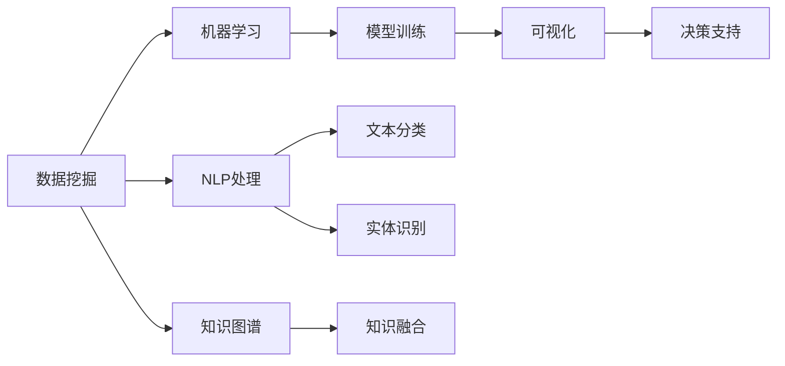

                 

# 知识发现引擎：知识与洞察力的互补与融合

> 关键词：知识发现,数据挖掘,机器学习,知识图谱,自然语言处理(NLP),深度学习,人工智能

## 1. 背景介绍

### 1.1 问题由来
在信息化时代，海量的数据以指数级增长，存储和处理都面临着巨大挑战。传统的统计学方法已无法应对复杂的数据特性，迫切需要新的技术手段提取和融合数据中的隐含信息，驱动决策、优化业务。这就催生了知识发现（Knowledge Discovery）这一领域的兴起，其目标在于从大数据中抽取和挖掘知识，从而辅助业务决策、优化运营管理、提升用户体验等。

知识发现通常需要跨学科的知识和技术的融合，包括数据挖掘、机器学习、自然语言处理、知识工程等。如何高效、准确地实现知识发现，成为一个重要的研究方向。本文将详细介绍知识发现引擎的核心概念、算法原理及其实际应用，并给出一些前沿的实践案例和未来展望。

### 1.2 问题核心关键点
知识发现引擎是一种自动化的数据分析工具，通过数据挖掘、机器学习和自然语言处理等技术手段，从大量数据中抽取、融合、挖掘知识，并将这些知识以可视化的形式呈现，帮助决策者做出更加精准的决策。其核心在于如何将不同来源、不同格式的数据整合到统一的语义框架下，并从中提取有价值的信息。

知识发现引擎的核心技术包括数据清洗与预处理、特征工程、模型训练与评估、知识可视化等。以下将详细介绍每个关键技术的实现方法，并通过实际应用案例展示知识发现引擎的强大能力。

## 2. 核心概念与联系

### 2.1 核心概念概述

为更好地理解知识发现引擎的内部机制和工作原理，本节将介绍几个关键概念及其联系：

- **数据挖掘**：从大量数据中抽取有价值的知识和模式，包括分类、聚类、关联规则挖掘等。
- **机器学习**：通过数据训练模型，自动学习数据中的规律和特征，实现数据的分类、预测等任务。
- **自然语言处理(NLP)**：使计算机能够理解和处理自然语言，包括分词、词性标注、句法分析、语义理解等。
- **知识图谱**：以图的形式表示实体及其之间的关系，用于构建语义网络，辅助知识推理和融合。
- **知识发现引擎**：融合以上技术，从不同来源、不同格式的数据中抽取知识，并呈现为易于理解的可视化形式。

这些概念之间的联系主要体现在以下几方面：
1. 数据挖掘和机器学习是知识发现引擎的基础技术，负责从数据中提取模式和规律。
2. 自然语言处理技术使引擎能够理解和处理非结构化数据，如文本、语音等。
3. 知识图谱为知识发现引擎提供了一个统一的语义框架，辅助知识推理和融合。
4. 可视化技术将抽取的知识以图表形式呈现，增强了决策者的理解和运用能力。

这些概念共同构成了知识发现引擎的核心技术体系，使引擎能够从海量数据中高效、准确地抽取知识，辅助业务决策和运营优化。

### 2.2 核心概念原理和架构的 Mermaid 流程图



这个流程图展示了知识发现引擎的内部技术链条，从数据预处理到知识呈现，每一个环节都至关重要。通过理解这些概念及其联系，可以更好地把握知识发现引擎的工作机制。

## 3. 核心算法原理 & 具体操作步骤
### 3.1 算法原理概述

知识发现引擎的核心算法包括数据挖掘算法、机器学习算法、自然语言处理算法和知识图谱算法。以下将详细介绍每个算法的原理和具体操作。

### 3.2 算法步骤详解

#### 3.2.1 数据挖掘算法
数据挖掘算法通常包括分类、聚类、关联规则挖掘等，用于从大量数据中抽取模式和规律。以分类算法为例，其核心步骤包括：
1. 数据预处理：清洗数据、处理缺失值、特征选择和降维等。
2. 模型选择：选择合适的分类算法，如决策树、随机森林、支持向量机等。
3. 模型训练：利用训练集数据训练分类模型。
4. 模型评估：使用验证集和测试集评估模型性能，选择最优模型。

#### 3.2.2 机器学习算法
机器学习算法用于从数据中学习规律和特征，实现数据的分类、预测等任务。以回归算法为例，其核心步骤包括：
1. 数据预处理：清洗数据、处理缺失值、特征选择和降维等。
2. 模型选择：选择合适的回归算法，如线性回归、决策树回归、随机森林回归等。
3. 模型训练：利用训练集数据训练回归模型。
4. 模型评估：使用验证集和测试集评估模型性能，选择最优模型。

#### 3.2.3 自然语言处理(NLP)算法
NLP算法用于使计算机能够理解和处理自然语言，包括分词、词性标注、句法分析、语义理解等。以分词算法为例，其核心步骤包括：
1. 文本预处理：去除停用词、分词、词性标注等。
2. 模型训练：利用标注数据训练分词模型。
3. 模型评估：使用测试集评估模型性能，选择最优模型。

#### 3.2.4 知识图谱算法
知识图谱算法用于构建语义网络，辅助知识推理和融合。以知识图谱构建算法为例，其核心步骤包括：
1. 数据预处理：清洗数据、处理缺失值、实体识别和关系抽取等。
2. 模型选择：选择合适的知识图谱模型，如基于规则的模型、基于统计的模型、基于深度学习的模型等。
3. 模型训练：利用训练集数据训练知识图谱模型。
4. 模型评估：使用测试集评估模型性能，选择最优模型。

### 3.3 算法优缺点

知识发现引擎的优点包括：
1. 自动化程度高：能够自动化地处理大量数据，提取有用的知识。
2. 可扩展性强：可以轻松扩展到不同领域和数据类型。
3. 辅助决策：提供的知识可视化工具有助于决策者理解和运用知识。

其缺点包括：
1. 数据质量要求高：高质量的数据是知识发现的前提，低质量数据可能导致误导性的结果。
2. 计算复杂度高：算法复杂度高，需要强大的计算资源。
3. 结果可解释性差：有些算法结果难以解释，难以理解其背后的逻辑。

### 3.4 算法应用领域

知识发现引擎在各个领域都有广泛的应用，例如：
- 金融领域：用于风险评估、投资分析、欺诈检测等。
- 医疗领域：用于疾病预测、个性化治疗、医疗资源配置等。
- 零售领域：用于客户行为分析、商品推荐、供应链优化等。
- 社交媒体领域：用于舆情分析、情感分析、用户行为预测等。
- 智能制造领域：用于质量控制、设备维护、生产调度等。

这些应用场景展示了知识发现引擎的强大功能和广泛适用性，其能够帮助各行各业从海量数据中抽取有价值的知识，驱动业务决策和运营优化。

## 4. 数学模型和公式 & 详细讲解 & 举例说明

### 4.1 数学模型构建

本节将使用数学语言对知识发现引擎的核心算法进行更加严格的刻画。

假设有一组数据集 $D=\{(x_i, y_i)\}_{i=1}^N$，其中 $x_i$ 为输入特征，$y_i$ 为标签。以分类算法为例，其数学模型可以表示为：

$$
\hat{y}=f(x;\theta)
$$

其中 $f$ 为分类函数，$\theta$ 为模型参数。模型的训练目标是使分类函数在测试集上的预测结果与真实标签尽可能一致，即最小化预测误差：

$$
\min_{\theta} \frac{1}{N}\sum_{i=1}^N [L(\hat{y_i},y_i)]
$$

其中 $L$ 为损失函数，如交叉熵损失。模型的训练过程就是通过反向传播算法，最小化损失函数，不断调整模型参数 $\theta$。

### 4.2 公式推导过程

以线性回归算法为例，其核心公式可以表示为：

$$
y_i = \beta_0 + \beta_1x_{i1} + \beta_2x_{i2} + \cdots + \beta_px_{ip} + \epsilon_i
$$

其中 $y_i$ 为标签，$\beta_0, \beta_1, \cdots, \beta_p$ 为回归系数，$x_{i1}, x_{i2}, \cdots, x_{ip}$ 为输入特征，$\epsilon_i$ 为误差项。回归系数的求解可以使用最小二乘法，即：

$$
\min_{\beta} \frac{1}{N}\sum_{i=1}^N (y_i - f(x_i;\beta))^2
$$

求解上述问题，可以得到回归系数 $\beta$ 的最优解：

$$
\hat{\beta} = (\frac{1}{N}\sum_{i=1}^N x_ix_i^T)^{-1}\sum_{i=1}^N x_iy_i
$$

以上推导展示了线性回归算法的基本原理和求解方法，是知识发现引擎中常用的模型之一。

### 4.3 案例分析与讲解

以一个简单的电商网站用户行为分析为例，展示知识发现引擎的应用过程。
- 数据准备：收集用户浏览、点击、购买等行为数据，以及商品属性信息。
- 数据预处理：清洗数据、处理缺失值、特征选择和降维等。
- 模型训练：选择合适算法（如随机森林、决策树等）训练模型。
- 模型评估：使用验证集和测试集评估模型性能。
- 知识发现：提取用户行为模式、商品推荐规则等知识。
- 知识可视化：将抽取的知识以图表形式呈现，如用户行为分析图、推荐规则图等。
- 决策支持：结合业务规则，辅助业务决策，如个性化推荐、库存管理等。

通过以上步骤，可以高效地从电商网站用户行为数据中抽取知识，辅助业务决策和运营优化。

## 5. 项目实践：代码实例和详细解释说明

### 5.1 开发环境搭建

在进行知识发现引擎开发前，我们需要准备好开发环境。以下是使用Python进行TensorFlow开发的环境配置流程：

1. 安装Anaconda：从官网下载并安装Anaconda，用于创建独立的Python环境。

2. 创建并激活虚拟环境：
```bash
conda create -n tf-env python=3.8 
conda activate tf-env
```

3. 安装TensorFlow：根据CUDA版本，从官网获取对应的安装命令。例如：
```bash
conda install tensorflow==2.4
```

4. 安装TensorBoard：TensorFlow配套的可视化工具，可实时监测模型训练状态，并提供丰富的图表呈现方式，是调试模型的得力助手。
```bash
pip install tensorboard
```

5. 安装各类工具包：
```bash
pip install numpy pandas scikit-learn matplotlib tqdm jupyter notebook ipython
```

完成上述步骤后，即可在`tf-env`环境中开始知识发现引擎的开发。

### 5.2 源代码详细实现

下面以一个简单的电商网站用户行为分析为例，给出使用TensorFlow进行知识发现引擎开发的代码实现。

首先，定义用户行为数据处理函数：

```python
import pandas as pd
from sklearn.model_selection import train_test_split

# 加载数据
data = pd.read_csv('user_behavior_data.csv')
# 处理缺失值和异常值
data.fillna(method='ffill', inplace=True)
# 特征选择和降维
selected_features = ['click_count', 'buy_count', 'product_category', 'price']
data = data[selected_features]
# 标准化
from sklearn.preprocessing import StandardScaler
scaler = StandardScaler()
data = scaler.fit_transform(data)

# 划分训练集和测试集
X_train, X_test, y_train, y_test = train_test_split(data, data['is_purchase'], test_size=0.2, random_state=42)
```

然后，定义模型训练和评估函数：

```python
import tensorflow as tf
from tensorflow.keras import models, layers

# 定义模型
model = models.Sequential()
model.add(layers.Dense(64, activation='relu', input_shape=(X_train.shape[1],)))
model.add(layers.Dense(32, activation='relu'))
model.add(layers.Dense(1, activation='sigmoid'))

# 编译模型
model.compile(optimizer='adam', loss='binary_crossentropy', metrics=['accuracy'])

# 训练模型
model.fit(X_train, y_train, epochs=10, batch_size=32, validation_data=(X_test, y_test))

# 评估模型
model.evaluate(X_test, y_test)
```

最后，进行模型预测和可视化：

```python
import matplotlib.pyplot as plt

# 进行预测
y_pred = model.predict(X_test)
y_pred = (y_pred > 0.5).astype(int)

# 可视化
plt.figure(figsize=(10, 5))
plt.title('User Behavior Prediction')
plt.hist(y_pred, bins=2, edgecolor='black')
plt.xlabel('Prediction')
plt.ylabel('Count')
plt.show()
```

以上就是使用TensorFlow进行电商网站用户行为分析的完整代码实现。可以看到，TensorFlow提供了强大的模型训练和评估功能，可以方便地构建和优化机器学习模型。

### 5.3 代码解读与分析

让我们再详细解读一下关键代码的实现细节：

**用户行为数据处理函数**：
- 使用`pandas`加载用户行为数据，并进行初步清洗和预处理。
- 选择部分特征，并进行标准化处理，以便于模型训练。
- 使用`train_test_split`函数将数据划分为训练集和测试集。

**模型定义和编译**：
- 使用`Sequential`模型定义神经网络结构，包括输入层、隐藏层和输出层。
- 使用`Dense`层定义神经元个数和激活函数。
- 使用`compile`函数编译模型，指定优化器、损失函数和评估指标。

**模型训练和评估**：
- 使用`fit`函数训练模型，指定训练集、测试集、轮数和批次大小。
- 使用`evaluate`函数评估模型，返回损失和准确率。

**模型预测和可视化**：
- 使用`predict`函数进行预测，并使用`matplotlib`绘制预测结果的直方图。

通过以上步骤，可以高效地构建和训练知识发现引擎，并在电商网站用户行为分析中取得良好的效果。

## 6. 实际应用场景

### 6.1 智能制造领域

在智能制造领域，知识发现引擎可以用于设备状态监测、故障预测、生产调度优化等。例如，通过收集生产设备的历史运行数据、维护记录等，构建设备状态监测模型，实时监测设备运行状态，预测可能出现的故障，并优化生产调度。这将大大提升生产效率，降低生产成本。

### 6.2 医疗领域

在医疗领域，知识发现引擎可以用于疾病预测、个性化治疗方案制定、医疗资源配置等。例如，通过收集患者的历史病历、基因信息等，构建疾病预测模型，辅助医生进行疾病诊断和预测。这将提升医疗服务水平，提高患者治疗效果。

### 6.3 金融领域

在金融领域，知识发现引擎可以用于风险评估、投资分析、欺诈检测等。例如，通过收集金融交易数据、客户行为数据等，构建金融风险评估模型，预测潜在风险。这将帮助金融机构更好地管理风险，提升服务质量。

### 6.4 未来应用展望

随着数据规模和数据类型的不断扩展，知识发现引擎将迎来更多应用场景，发挥更大的作用。未来可能的应用领域包括：

1. 自动驾驶：通过分析历史交通数据、天气数据等，构建智能驾驶模型，提高驾驶安全性和舒适度。
2. 智慧城市：通过分析城市交通数据、环境数据等，构建智慧城市管理模型，提升城市管理效率和质量。
3. 智能客服：通过分析客户咨询数据，构建智能客服系统，提升客户体验和服务质量。
4. 推荐系统：通过分析用户行为数据，构建个性化推荐系统，提升用户体验和满意度。

知识发现引擎的应用前景广阔，将随着数据规模和数据类型的不断扩展而不断拓展新的应用领域。未来，知识发现引擎将成为智能社会的核心工具，驱动各行各业的智能化升级。

## 7. 工具和资源推荐

### 7.1 学习资源推荐

为了帮助开发者系统掌握知识发现引擎的理论基础和实践技巧，这里推荐一些优质的学习资源：

1. 《数据挖掘导论》书籍：由Tan等作者所著，系统介绍了数据挖掘的原理和算法。
2. 《机器学习实战》书籍：由Peter Harrington所著，介绍了各种机器学习算法的实现方法。
3. 《深度学习》书籍：由Ian Goodfellow等作者所著，介绍了深度学习的基本原理和应用方法。
4. 《自然语言处理综论》书籍：由Daniel Jurafsky和James H. Martin所著，介绍了自然语言处理的原理和算法。
5. 《Python数据科学手册》书籍：由Jake VanderPlas所著，介绍了Python在数据科学中的应用。

通过对这些资源的学习实践，相信你一定能够快速掌握知识发现引擎的精髓，并用于解决实际的业务问题。

### 7.2 开发工具推荐

高效的开发离不开优秀的工具支持。以下是几款用于知识发现引擎开发的常用工具：

1. TensorFlow：由Google主导开发的开源深度学习框架，生产部署方便，适合大规模工程应用。
2. PyTorch：基于Python的开源深度学习框架，灵活动态的计算图，适合快速迭代研究。
3. Scikit-learn：基于Python的机器学习库，提供了丰富的算法实现。
4. Pandas：基于Python的数据处理库，提供了强大的数据清洗和预处理功能。
5. TensorBoard：TensorFlow配套的可视化工具，可实时监测模型训练状态，并提供丰富的图表呈现方式。
6. Weights & Biases：模型训练的实验跟踪工具，可以记录和可视化模型训练过程中的各项指标。

合理利用这些工具，可以显著提升知识发现引擎的开发效率，加快创新迭代的步伐。

### 7.3 相关论文推荐

知识发现引擎的研究源于学界的持续研究。以下是几篇奠基性的相关论文，推荐阅读：

1. "Knowledge Discovery in Databases: An Overview"：由Jian Pei等人所著，介绍了知识发现的基本概念和算法。
2. "Data Mining: Concepts and Techniques"：由Han等人所著，系统介绍了数据挖掘的原理和算法。
3. "The Elements of Statistical Learning"：由Tibshirani等人所著，介绍了机器学习的原理和算法。
4. "Deep Learning"：由Ian Goodfellow等人所著，介绍了深度学习的基本原理和应用方法。
5. "Introduction to Natural Language Processing"：由Jurafsky等人所著，介绍了自然语言处理的基本原理和算法。

这些论文代表了大规模数据处理和知识发现技术的发展脉络。通过学习这些前沿成果，可以帮助研究者把握学科前进方向，激发更多的创新灵感。

## 8. 总结：未来发展趋势与挑战

### 8.1 总结

本文对知识发现引擎的核心概念、算法原理及其实际应用进行了全面系统的介绍。首先，详细讲解了知识发现引擎的内部机制和工作原理，明确了知识发现引擎在提取和融合数据中的隐含信息，辅助业务决策和运营优化方面的独特价值。其次，从原理到实践，深入讲解了知识发现引擎的数学模型和算法步骤，并通过实际应用案例展示了知识发现引擎的强大能力。

通过本文的系统梳理，可以看到，知识发现引擎正在成为智能社会的核心工具，其高效、准确地从海量数据中抽取知识，驱动业务决策和运营优化的能力得到了广泛认可。未来，伴随数据规模和数据类型的不断扩展，知识发现引擎的应用场景将更加广泛，为各行各业带来更大的价值。

### 8.2 未来发展趋势

展望未来，知识发现引擎将呈现以下几个发展趋势：

1. 数据规模不断增大。随着数据采集技术的进步，数据规模将不断增大，知识发现引擎将面临更复杂、更庞大的数据处理任务。
2. 算法多样化。新的算法和技术不断涌现，如深度学习、强化学习等，将在知识发现引擎中得到广泛应用。
3. 可视化技术提升。随着可视化技术的不断进步，知识发现引擎将提供更加直观、丰富的可视化结果，增强决策者的理解和运用能力。
4. 多模态数据融合。未来知识发现引擎将能够处理更多种类的数据，如图像、语音、视频等，实现多模态数据的融合，提供更全面、深入的洞察力。
5. 跨领域应用拓展。知识发现引擎将应用于更多领域，如自动驾驶、智慧城市、智能医疗等，推动各个行业的智能化转型。

以上趋势凸显了知识发现引擎的广阔前景。这些方向的探索发展，必将进一步提升知识发现引擎的性能和应用范围，为各行各业带来更大的价值。

### 8.3 面临的挑战

尽管知识发现引擎已经取得了瞩目成就，但在迈向更加智能化、普适化应用的过程中，它仍面临着诸多挑战：

1. 数据质量瓶颈。数据质量是知识发现的前提，低质量数据可能导致误导性的结果。如何提高数据质量，是一个重要的挑战。
2. 计算资源限制。知识发现引擎需要大量的计算资源，如何优化算法、提升计算效率，是一个重要的研究方向。
3. 结果可解释性差。一些算法结果难以解释，难以理解其背后的逻辑，如何提高结果的可解释性，是一个重要的挑战。
4. 安全性问题。知识发现引擎可能学习到有偏见、有害的信息，如何消除模型偏见，确保输出安全，是一个重要的研究方向。

这些挑战凸显了知识发现引擎的发展难度，但只要通过不断的技术创新和优化，这些问题都将逐步得到解决。

### 8.4 研究展望

面对知识发现引擎所面临的挑战，未来的研究需要在以下几个方面寻求新的突破：

1. 数据预处理技术提升。通过更先进的预处理技术，提高数据质量，减少噪声和缺失值的影响。
2. 高效算法开发。开发更加高效、可扩展的算法，提升计算效率，支持大规模数据处理。
3. 可视化技术优化。通过更先进的可视化技术，提供更加直观、丰富的可视化结果，增强决策者的理解和运用能力。
4. 多模态数据融合技术。开发更加高效、准确的多模态数据融合算法，实现多模态数据的协同建模。
5. 跨领域知识图谱构建。开发跨领域知识图谱构建技术，实现不同领域知识的融合，提供更全面的洞察力。
6. 可解释性增强。开发更加可解释的算法和技术，增强模型的透明度和可理解性，确保输出安全可靠。

这些研究方向的探索，必将引领知识发现引擎迈向更高的台阶，为各个行业带来更大的价值。面向未来，知识发现引擎需要与其他人工智能技术进行更深入的融合，如知识表示、因果推理、强化学习等，共同推动智能社会的进步。只有勇于创新、敢于突破，才能不断拓展知识发现引擎的边界，让智能技术更好地造福人类社会。

## 9. 附录：常见问题与解答

**Q1：知识发现引擎是否适用于所有领域？**

A: 知识发现引擎在大多数领域都有广泛的应用，但不同领域的应用场景和需求有所不同。例如，金融领域需要处理大量高维度数据，医疗领域需要处理复杂的非结构化数据。因此，需要根据具体领域的特点，选择合适的算法和技术。

**Q2：如何提高知识发现引擎的准确性？**

A: 提高知识发现引擎的准确性需要从数据、算法和模型等多个方面进行优化。具体包括：
1. 数据清洗和预处理：清洗数据、处理缺失值、特征选择和降维等，减少噪声和缺失值的影响。
2. 选择合适的算法：根据数据特点选择合适的算法，如分类、聚类、回归等。
3. 模型优化：使用适当的模型结构，如深度神经网络、支持向量机等，并使用合适的损失函数和优化器进行训练。
4. 交叉验证：使用交叉验证技术评估模型性能，选择最优模型。

**Q3：知识发现引擎的计算复杂度如何优化？**

A: 优化知识发现引擎的计算复杂度需要从算法和硬件两个方面进行优化。具体包括：
1. 算法优化：开发更加高效、可扩展的算法，如随机梯度下降、AdaGrad等，减少计算量。
2. 硬件优化：使用更高效的计算硬件，如GPU、TPU等，提升计算效率。
3. 并行计算：采用并行计算技术，如MapReduce、Spark等，加速数据处理。

通过以上优化措施，可以显著提高知识发现引擎的计算效率，支持大规模数据处理。

**Q4：知识发现引擎的模型如何部署？**

A: 知识发现引擎的模型部署需要考虑模型裁剪、量化加速、服务化封装、弹性伸缩、监控告警和安全防护等多个方面。具体包括：
1. 模型裁剪：去除不必要的层和参数，减小模型尺寸，加快推理速度。
2. 量化加速：将浮点模型转为定点模型，压缩存储空间，提高计算效率。
3. 服务化封装：将模型封装为标准化服务接口，便于集成调用。
4. 弹性伸缩：根据请求流量动态调整资源配置，平衡服务质量和成本。
5. 监控告警：实时采集系统指标，设置异常告警阈值，确保服务稳定性。
6. 安全防护：采用访问鉴权、数据脱敏等措施，保障数据和模型安全。

通过以上措施，可以将知识发现引擎的模型高效、可靠地部署到实际应用中，为业务决策和运营优化提供有力支持。

通过本文的系统梳理，可以看到，知识发现引擎正在成为智能社会的核心工具，其高效、准确地从海量数据中抽取知识，驱动业务决策和运营优化的能力得到了广泛认可。未来，伴随数据规模和数据类型的不断扩展，知识发现引擎的应用场景将更加广泛，为各行各业带来更大的价值。面向未来，知识发现引擎需要与其他人工智能技术进行更深入的融合，如知识表示、因果推理、强化学习等，共同推动智能社会的进步。只有勇于创新、敢于突破，才能不断拓展知识发现引擎的边界，让智能技术更好地造福人类社会。

---

作者：禅与计算机程序设计艺术 / Zen and the Art of Computer Programming

