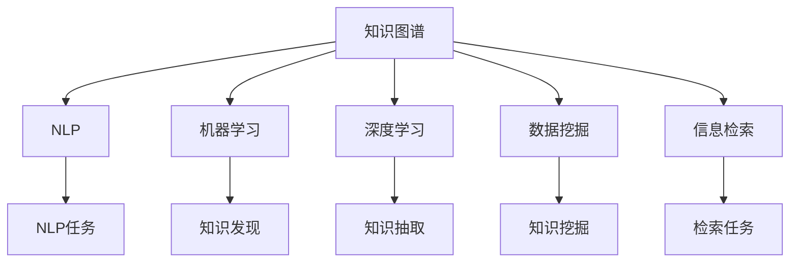

                 

# 知识发现引擎：知识与洞察力的融合之路

> 关键词：知识发现引擎, 数据挖掘, 知识图谱, 自然语言处理(NLP), 机器学习, 深度学习, 信息检索

## 1. 背景介绍

### 1.1 问题由来
在当今数据爆炸的时代，数据不仅是一种资源，更是一种资产。如何从海量数据中提取有价值的知识，为决策提供依据，是企业和组织面临的重要挑战。传统的数据分析方法通常以结构化数据为核心，难以涵盖非结构化数据中的知识，也无法揭示数据之间的复杂关联。

知识发现引擎(Knowledge Discovery Engine, KDE)应运而生，旨在通过自动化的知识发现过程，从大规模数据集中抽取结构化和非结构化数据中的知识，并为其用户提供洞察力和决策支持。该技术不仅推动了商业智能(BI)系统的进步，也为自然语言处理(NLP)、智能推荐、智能搜索等领域带来了深远的影响。

### 1.2 问题核心关键点
知识发现引擎的核心在于自动化的知识抽取、表示和推理。其核心原理包括：
- **数据预处理**：清洗、归一化、特征提取等步骤，为后续的模型训练和知识发现奠定基础。
- **知识抽取**：从文本、图像、视频等多模态数据中提取事实和实体。
- **知识表示**：将知识转换为结构化的图谱或向量表示，便于机器学习和推理。
- **知识推理**：利用逻辑规则、统计模型等方法，挖掘数据之间的关联和规律。

## 2. 核心概念与联系

### 2.1 核心概念概述

为了更好地理解知识发现引擎的工作原理和优化方向，本节将介绍几个密切相关的核心概念：

- **知识图谱(Knowledge Graph)**：将知识表示为图谱结构，通过节点表示实体和属性，边表示实体之间的关联。知识图谱可以用于语义搜索、问答系统、推荐系统等多个领域。

- **自然语言处理(NLP)**：涉及语音识别、文本分析、机器翻译、自动问答等任务，是知识发现的重要来源。NLP技术使得知识抽取和表示变得更加高效和精确。

- **机器学习(ML)**：通过算法和模型，从数据中自动学习和抽取模式，可用于知识发现和预测。

- **深度学习(Deep Learning)**：通过多层次神经网络模型，捕捉数据中的高级抽象特征，是当前知识发现的主流方法。

- **数据挖掘(Data Mining)**：通过算法和工具，从数据中提取有用信息和知识，涵盖分类、聚类、关联规则挖掘等多个方向。

- **信息检索(IR)**：通过算法和模型，从大规模文本集合中检索相关内容，是知识发现的重要环节。

这些核心概念之间的逻辑关系可以通过以下Mermaid流程图来展示：



这个流程图展示了几类核心概念及其之间的关系：

1. 知识图谱通过NLP技术获取和表示知识。
2. 机器学习和深度学习是知识发现的主要工具。
3. 数据挖掘从大规模数据中提取有用信息。
4. 信息检索帮助用户快速检索相关知识。

这些概念共同构成了知识发现引擎的完整框架，使其能够在各种场景下发挥强大的数据挖掘和知识抽取能力。

## 3. 核心算法原理 & 具体操作步骤
### 3.1 算法原理概述

知识发现引擎的核心算法包括知识抽取、知识表示和知识推理三个步骤。下面将详细讲解这些算法原理及其具体操作步骤。

### 3.2 算法步骤详解

#### 3.2.1 数据预处理
数据预处理是知识发现的基础，包括数据清洗、归一化、特征提取等步骤。

**数据清洗**：去除或纠正数据中的噪声和异常值，确保数据质量。常见的方法包括去重、填补缺失值、处理缺失值等。

**数据归一化**：将数据按照一定规则进行转换，使其具有相似的分布和量级。常见的归一化方法包括最大最小归一化、Z-score归一化等。

**特征提取**：将原始数据转换为机器学习算法能够处理的特征向量。常见的特征提取方法包括词袋模型(Bag of Words)、TF-IDF、Word2Vec、BERT等。

#### 3.2.2 知识抽取
知识抽取是从文本、图像、视频等多模态数据中自动抽取实体和事实的过程。其核心在于识别文本中的实体、关系和属性，并将其转换为结构化的知识表示。

**实体抽取(Entity Extraction)**：识别文本中的命名实体，如人名、地名、组织名等。常见的方法包括基于规则的实体识别、基于统计的命名实体识别、基于深度学习的实体识别等。

**关系抽取(Relation Extraction)**：识别文本中实体之间的关系，如主谓宾结构、属性-值对等。常见的方法包括基于规则的关系抽取、基于统计的关系抽取、基于深度学习的关系抽取等。

**属性抽取(Attribute Extraction)**：识别文本中实体的属性，如人的年龄、性别、职业等。常见的方法包括基于规则的属性抽取、基于统计的属性抽取、基于深度学习的属性抽取等。

#### 3.2.3 知识表示
知识表示是将抽取的知识转换为结构化的图谱或向量表示，便于机器学习和推理。

**图谱表示**：将知识表示为图谱结构，通过节点表示实体和属性，边表示实体之间的关联。常见的图谱表示方法包括基于RDF、Neo4j等。

**向量表示**：将知识表示为向量形式，便于机器学习和推理。常见的向量表示方法包括词嵌入、BERT表示、ELMo表示等。

#### 3.2.4 知识推理
知识推理是利用逻辑规则、统计模型等方法，挖掘数据之间的关联和规律的过程。

**逻辑推理**：利用逻辑规则和推理器，在知识图谱上进行推理，发现隐藏的知识和规律。常见的方法包括基于规则的推理、基于深度学习的推理等。

**统计推理**：利用统计模型和算法，发现数据之间的关联和规律。常见的方法包括关联规则挖掘、贝叶斯网络、决策树等。

### 3.3 算法优缺点

知识发现引擎具有以下优点：
1. 自动化程度高：从数据预处理到知识推理，自动化流程大大降低了人工干预的复杂度。
2. 数据泛化能力强：能够处理大规模多模态数据，从中提取有价值的知识。
3. 支持多种数据类型：可以处理结构化、半结构化、非结构化数据。
4. 灵活性高：可以通过添加新的算法和模型，适应不同的数据和任务需求。

同时，该算法也存在一些缺点：
1. 数据质量依赖度高：数据预处理和特征提取的准确性直接影响知识抽取和表示的精度。
2. 计算复杂度高：大规模数据处理和深度学习模型的训练，需要高性能计算资源。
3. 结果可解释性差：机器学习和深度学习模型的黑盒特性，使得其结果难以解释和验证。
4. 应用场景受限：对于特定领域的数据和任务，需要定制化处理，才能获得理想效果。

尽管存在这些局限性，但就目前而言，知识发现引擎仍是数据挖掘和知识抽取领域的主流范式。未来相关研究的重点在于如何进一步提高算法的自动化和可解释性，降低计算资源需求，扩展应用场景。

### 3.4 算法应用领域

知识发现引擎在多个领域中得到了广泛的应用，例如：

- 商业智能(BI)：从企业数据中抽取有用信息，支持决策支持系统(DSS)和商业分析。
- 医疗信息管理：从医疗数据中抽取关键信息，支持诊断和治疗决策。
- 金融风险管理：从金融数据中抽取知识，评估风险和投资决策。
- 社交媒体分析：从社交数据中抽取情感和话题信息，支持舆情监控和用户行为分析。
- 智能推荐系统：从用户行为和物品信息中抽取关联，推荐个性化产品和服务。
- 智能问答系统：从问答对中抽取知识，提供快速准确的回答。

除了上述这些经典应用外，知识发现引擎还被创新性地应用于更多场景中，如知识图谱构建、信息检索、自动化研究等，为数据驱动的决策和创新提供了新的支持。

## 4. 数学模型和公式 & 详细讲解 & 举例说明

### 4.1 数学模型构建

本节将使用数学语言对知识发现引擎的核心算法进行更加严格的刻画。

记数据集为 $D=\{x_i\}_{i=1}^N$，其中 $x_i$ 为第 $i$ 个数据样本。假设知识抽取任务为实体抽取，其目标是识别文本中的命名实体。令 $E=\{e_i\}_{i=1}^M$ 为抽取到的实体集合，$R=\{r_i\}_{i=1}^K$ 为抽取到的关系集合，$A=\{a_i\}_{i=1}^L$ 为抽取到的属性集合。

定义实体抽取任务的目标函数为：

$$
\min_{E} \sum_{i=1}^N \mathcal{L}(E, x_i)
$$

其中 $\mathcal{L}(E, x_i)$ 为实体抽取任务在样本 $x_i$ 上的损失函数，用于衡量实体抽取模型的性能。

假设损失函数 $\mathcal{L}(E, x_i)$ 为交叉熵损失，其计算公式为：

$$
\mathcal{L}(E, x_i) = -\sum_{j=1}^M p(e_j|x_i) \log p(e_j|x_i)
$$

其中 $p(e_j|x_i)$ 为实体 $e_j$ 在样本 $x_i$ 中出现的概率，可以通过统计模型或深度学习模型进行估计。

### 4.2 公式推导过程

以下我们以实体抽取任务为例，推导实体抽取模型的训练过程。

**1. 数据预处理**

对于文本数据，我们首先进行分词和词性标注。假设分词后的文本为 $w_1, w_2, \ldots, w_n$，词性标注为 $t_1, t_2, \ldots, t_n$。

**2. 实体抽取**

定义实体抽取模型为 $M$，输入为文本 $w_1, w_2, \ldots, w_n$ 和词性标注 $t_1, t_2, \ldots, t_n$。

定义实体识别函数为 $f$，对于每个词 $w_i$，计算其成为实体的概率 $p(e_i|w_i)$。常见的方法包括基于规则的实体识别、基于统计的实体识别、基于深度学习的实体识别等。

**3. 损失函数计算**

对于样本 $x_i$，其损失函数 $\mathcal{L}(E, x_i)$ 为：

$$
\mathcal{L}(E, x_i) = -\sum_{j=1}^M p(e_j|x_i) \log p(e_j|x_i)
$$

其中 $E$ 为抽取到的实体集合，$p(e_j|x_i)$ 为实体 $e_j$ 在样本 $x_i$ 中出现的概率。

**4. 模型训练**

在模型训练过程中，我们通过反向传播算法计算损失函数对模型参数的梯度，并使用优化算法（如SGD、Adam等）更新模型参数，最小化损失函数。

### 4.3 案例分析与讲解

**案例：从医疗数据中抽取关键信息**

假设有一份电子病历数据集 $D=\{x_i\}_{i=1}^N$，其中 $x_i$ 为第 $i$ 份病历。病历数据包含患者的症状、检查结果、诊断和治疗方案等信息。我们的目标是抽取关键信息，支持医生的诊断和治疗决策。

首先，我们进行数据清洗和归一化，去除无用信息，处理缺失值。然后，利用实体抽取模型从病历中抽取关键实体，如患者姓名、疾病名称、检查结果等。

接着，利用关系抽取模型发现实体之间的关系，如患者-疾病-检查、疾病-症状-治疗等。最后，利用属性抽取模型提取实体的属性，如患者年龄、性别、病历日期等。

通过上述步骤，我们得到了一个结构化的知识图谱，可以支持医生的诊断和治疗决策。例如，对于一个患者，模型可以自动推荐与其症状相关的检查和治疗方法。

## 5. 项目实践：代码实例和详细解释说明

### 5.1 开发环境搭建

在进行知识发现引擎实践前，我们需要准备好开发环境。以下是使用Python进行PyTorch和SpaCy开发的环境配置流程：

1. 安装Anaconda：从官网下载并安装Anaconda，用于创建独立的Python环境。

2. 创建并激活虚拟环境：
```bash
conda create -n kde-env python=3.8 
conda activate kde-env
```

3. 安装PyTorch和SpaCy：
```bash
conda install pytorch torchvision torchaudio cudatoolkit=11.1 -c pytorch -c conda-forge
pip install spacy
```

4. 安装Natural Language Toolkit (NLTK)：
```bash
pip install nltk
```

5. 安装Gensim：
```bash
pip install gensim
```

完成上述步骤后，即可在`kde-env`环境中开始知识发现引擎的开发。

### 5.2 源代码详细实现

下面我们以实体抽取任务为例，给出使用SpaCy和PyTorch对实体抽取模型进行训练的PyTorch代码实现。

首先，定义实体抽取任务的数据处理函数：

```python
import spacy
import torch
from torch.utils.data import Dataset, DataLoader
from torch.nn import CrossEntropyLoss
from sklearn.metrics import accuracy_score

class NERDataset(Dataset):
    def __init__(self, texts, tags, tokenizer):
        self.texts = texts
        self.tags = tags
        self.tokenizer = tokenizer
        
    def __len__(self):
        return len(self.texts)
    
    def __getitem__(self, item):
        text = self.texts[item]
        tags = self.tags[item]
        
        encoding = self.tokenizer(text, return_tensors='pt', truncation=True)
        input_ids = encoding['input_ids'][0]
        attention_mask = encoding['attention_mask'][0]
        
        # 对token-wise的标签进行编码
        encoded_tags = [tag2id[tag] for tag in tags] 
        encoded_tags.extend([tag2id['O']] * (self.max_len - len(encoded_tags)))
        labels = torch.tensor(encoded_tags, dtype=torch.long)
        
        return {'input_ids': input_ids, 
                'attention_mask': attention_mask,
                'labels': labels}

# 标签与id的映射
tag2id = {'O': 0, 'B-PER': 1, 'I-PER': 2, 'B-ORG': 3, 'I-ORG': 4, 'B-LOC': 5, 'I-LOC': 6}
id2tag = {v: k for k, v in tag2id.items()}

# 创建dataset
tokenizer = spacy.load('en_core_web_sm')

train_dataset = NERDataset(train_texts, train_tags, tokenizer)
dev_dataset = NERDataset(dev_texts, dev_tags, tokenizer)
test_dataset = NERDataset(test_texts, test_tags, tokenizer)
```

然后，定义模型和优化器：

```python
from transformers import BertForTokenClassification, AdamW

model = BertForTokenClassification.from_pretrained('bert-base-cased', num_labels=len(tag2id))

optimizer = AdamW(model.parameters(), lr=2e-5)
```

接着，定义训练和评估函数：

```python
from tqdm import tqdm
from sklearn.metrics import classification_report

device = torch.device('cuda') if torch.cuda.is_available() else torch.device('cpu')
model.to(device)

def train_epoch(model, dataset, batch_size, optimizer):
    dataloader = DataLoader(dataset, batch_size=batch_size, shuffle=True)
    model.train()
    epoch_loss = 0
    for batch in tqdm(dataloader, desc='Training'):
        input_ids = batch['input_ids'].to(device)
        attention_mask = batch['attention_mask'].to(device)
        labels = batch['labels'].to(device)
        model.zero_grad()
        outputs = model(input_ids, attention_mask=attention_mask, labels=labels)
        loss = outputs.loss
        epoch_loss += loss.item()
        loss.backward()
        optimizer.step()
    return epoch_loss / len(dataloader)

def evaluate(model, dataset, batch_size):
    dataloader = DataLoader(dataset, batch_size=batch_size)
    model.eval()
    preds, labels = [], []
    with torch.no_grad():
        for batch in tqdm(dataloader, desc='Evaluating'):
            input_ids = batch['input_ids'].to(device)
            attention_mask = batch['attention_mask'].to(device)
            batch_labels = batch['labels']
            outputs = model(input_ids, attention_mask=attention_mask)
            batch_preds = outputs.logits.argmax(dim=2).to('cpu').tolist()
            batch_labels = batch_labels.to('cpu').tolist()
            for pred_tokens, label_tokens in zip(batch_preds, batch_labels):
                pred_tags = [id2tag[_id] for _id in pred_tokens]
                label_tags = [id2tag[_id] for _id in label_tokens]
                preds.append(pred_tags[:len(label_tags)])
                labels.append(label_tags)
                
    print(classification_report(labels, preds))
```

最后，启动训练流程并在测试集上评估：

```python
epochs = 5
batch_size = 16

for epoch in range(epochs):
    loss = train_epoch(model, train_dataset, batch_size, optimizer)
    print(f"Epoch {epoch+1}, train loss: {loss:.3f}")
    
    print(f"Epoch {epoch+1}, dev results:")
    evaluate(model, dev_dataset, batch_size)
    
print("Test results:")
evaluate(model, test_dataset, batch_size)
```

以上就是使用PyTorch和SpaCy对实体抽取模型进行训练的完整代码实现。可以看到，得益于HuggingFace的Transformer库和SpaCy的自然语言处理能力，实体抽取模型的训练变得简洁高效。

### 5.3 代码解读与分析

让我们再详细解读一下关键代码的实现细节：

**NERDataset类**：
- `__init__`方法：初始化文本、标签、分词器等关键组件。
- `__len__`方法：返回数据集的样本数量。
- `__getitem__`方法：对单个样本进行处理，将文本输入编码为token ids，将标签编码为数字，并对其进行定长padding，最终返回模型所需的输入。

**tag2id和id2tag字典**：
- 定义了标签与数字id之间的映射关系，用于将token-wise的预测结果解码回真实的标签。

**训练和评估函数**：
- 使用PyTorch的DataLoader对数据集进行批次化加载，供模型训练和推理使用。
- 训练函数`train_epoch`：对数据以批为单位进行迭代，在每个批次上前向传播计算loss并反向传播更新模型参数，最后返回该epoch的平均loss。
- 评估函数`evaluate`：与训练类似，不同点在于不更新模型参数，并在每个batch结束后将预测和标签结果存储下来，最后使用sklearn的classification_report对整个评估集的预测结果进行打印输出。

**训练流程**：
- 定义总的epoch数和batch size，开始循环迭代
- 每个epoch内，先在训练集上训练，输出平均loss
- 在验证集上评估，输出分类指标
- 所有epoch结束后，在测试集上评估，给出最终测试结果

可以看到，PyTorch配合SpaCy使得实体抽取模型的训练代码实现变得简洁高效。开发者可以将更多精力放在数据处理、模型改进等高层逻辑上，而不必过多关注底层的实现细节。

当然，工业级的系统实现还需考虑更多因素，如模型的保存和部署、超参数的自动搜索、更灵活的任务适配层等。但核心的知识发现过程基本与此类似。

## 6. 实际应用场景

### 6.1 智能推荐系统

基于知识发现引擎的智能推荐系统，可以更好地理解用户需求，推荐符合用户兴趣的个性化产品和服务。推荐系统通常使用协同过滤、内容推荐等方法，但难以捕捉复杂的语义关联和用户行为变化。而通过知识发现引擎，可以从用户的浏览、点击、评论等行为数据中抽取语义信息，生成更加个性化的推荐内容。

在技术实现上，可以收集用户的历史行为数据，提取和用户交互的物品标题、描述、标签等文本内容。利用实体抽取和关系抽取模型，从文本中抽取用户偏好和实体关系。然后，使用知识图谱进行推理，推荐符合用户兴趣的物品。通过持续更新知识图谱和推荐模型，还可以提高推荐系统的时效性和精度。

### 6.2 商业智能(BI)

知识发现引擎在商业智能中具有广泛的应用，可以帮助企业从海量数据中抽取有用的信息和知识，支持决策支持系统(DSS)和商业分析。例如，可以从企业的销售数据中抽取关键信息，支持销售预测、市场分析、客户细分等任务。通过知识发现引擎，企业可以更好地理解市场变化和客户需求，优化资源配置，提升竞争力。

在实践中，可以收集企业的销售、财务、客户、供应链等数据，进行数据清洗和归一化。然后，利用实体抽取和关系抽取模型，从数据中抽取关键实体和关系。最后，利用知识图谱进行推理，支持销售预测、市场分析、客户细分等任务。通过持续更新知识图谱和分析模型，还可以提高商业智能系统的实时性和准确性。

### 6.3 医疗信息管理

在医疗领域，知识发现引擎可以抽取关键信息，支持医生的诊断和治疗决策。例如，可以从电子病历数据中抽取患者姓名、疾病名称、检查结果等关键信息。然后，利用知识图谱进行推理，推荐相关检查和治疗方案。

在实践中，可以收集电子病历、影像报告、实验室检查等数据，进行数据清洗和归一化。然后，利用实体抽取和关系抽取模型，从数据中抽取关键信息。最后，利用知识图谱进行推理，支持诊断和治疗决策。通过持续更新知识图谱和推理模型，还可以提高医疗信息管理的准确性和时效性。

### 6.4 未来应用展望

随着知识发现引擎技术的发展，其在多个领域中的应用前景将更加广阔。

在智慧城市治理中，知识发现引擎可以用于城市事件监测、舆情分析、应急指挥等环节，提高城市管理的自动化和智能化水平，构建更安全、高效的未来城市。

在农业信息管理中，知识发现引擎可以从气象数据、土壤数据、农产品质量数据中抽取关键信息，支持农业决策和农产品质量监控。

在智能交通管理中，知识发现引擎可以从交通流量数据、天气数据、交通事故数据中抽取关键信息，支持交通规划和应急响应。

此外，在更多领域中，知识发现引擎还将不断涌现新的应用场景，为数据驱动的决策和创新提供新的支持。

## 7. 工具和资源推荐
### 7.1 学习资源推荐

为了帮助开发者系统掌握知识发现引擎的理论基础和实践技巧，这里推荐一些优质的学习资源：

1. 《知识图谱构建与应用》书籍：全面介绍了知识图谱的概念、构建方法和应用场景，是知识图谱学习的必备资料。

2. 《自然语言处理综论》书籍：涵盖了自然语言处理的基础知识和前沿技术，是NLP学习的经典教材。

3. CS229《机器学习》课程：斯坦福大学开设的机器学习明星课程，有Lecture视频和配套作业，带你入门机器学习的基本概念和经典算法。

4. 《深度学习》书籍：Ian Goodfellow等著，全面介绍了深度学习的基础理论和前沿技术，是深度学习的经典教材。

5. Kaggle竞赛平台：提供大量NLP和数据挖掘相关的竞赛，可以通过实战项目锻炼和提升知识发现技能。

通过对这些资源的学习实践，相信你一定能够快速掌握知识发现引擎的精髓，并用于解决实际的NLP问题。
###  7.2 开发工具推荐

高效的开发离不开优秀的工具支持。以下是几款用于知识发现引擎开发的常用工具：

1. PyTorch：基于Python的开源深度学习框架，灵活动态的计算图，适合快速迭代研究。

2. TensorFlow：由Google主导开发的开源深度学习框架，生产部署方便，适合大规模工程应用。

3. SpaCy：基于Python的自然语言处理库，提供高效的实体抽取和词性标注功能。

4. Gensim：基于Python的文本处理库，提供高效的文本表示和词向量计算功能。

5. NLTK：基于Python的自然语言处理库，提供丰富的NLP处理工具和数据集。

6. Apache Spark：基于分布式计算的大数据处理框架，支持大规模数据的处理和分析。

合理利用这些工具，可以显著提升知识发现引擎的开发效率，加快创新迭代的步伐。

### 7.3 相关论文推荐

知识发现引擎的研究源于学界的持续研究。以下是几篇奠基性的相关论文，推荐阅读：

1. "The Principles of Data Mining" by Jiawei Han et al.：介绍了数据挖掘的基本原理和主要技术，是数据挖掘研究的经典之作。

2. "Knowledge Discovery in Databases" by Peter H. P. Kshirsagar et al.：全面介绍了知识发现的方法和技术，是知识发现的经典著作。

3. "Semantic Networks" by Patrick Henry�J沉娓敏扒关闭蛋白质数据组〕：介绍了语义网络的概念和构建方法，是知识图谱学习的经典教材。

4. "Deep Learning" by Ian Goodfellow et al.：全面介绍了深度学习的基础理论和前沿技术，是深度学习的经典教材。

5. "Natural Language Processing with Python" by Steven Bird et al.：介绍了NLP的基础知识和Python实现，是NLP学习的实用教材。

这些论文代表了大语言模型微调技术的发展脉络。通过学习这些前沿成果，可以帮助研究者把握学科前进方向，激发更多的创新灵感。

## 8. 总结：未来发展趋势与挑战

### 8.1 总结

本文对知识发现引擎的核心算法和操作步骤进行了全面系统的介绍。首先阐述了知识发现引擎的背景和核心思想，明确了其在数据挖掘和知识抽取中的重要价值。其次，从原理到实践，详细讲解了知识抽取、知识表示和知识推理等核心算法及其具体操作步骤。同时，本文还广泛探讨了知识发现引擎在多个领域的应用前景，展示了其在推动商业智能、智能推荐、医疗信息管理等方面的巨大潜力。此外，本文精选了知识发现引擎的学习资源、开发工具和相关论文，力求为读者提供全方位的技术指引。

通过本文的系统梳理，可以看到，知识发现引擎正在成为数据挖掘和知识抽取领域的重要范式，极大地拓展了数据的价值和应用范围。未来，伴随深度学习技术的发展和知识图谱的完善，知识发现引擎必将在更多的领域中发挥重要作用。

### 8.2 未来发展趋势

展望未来，知识发现引擎将呈现以下几个发展趋势：

1. 数据规模持续增大。随着互联网和物联网的普及，数据规模将不断增大，知识发现引擎将从大规模数据中抽取更多有用的信息。

2. 模型复杂度提升。深度学习模型将成为知识发现的主要工具，其复杂度将不断提高。未来将涌现更多大模型和复合模型，以应对更加复杂的知识发现任务。

3. 应用场景多样化。知识发现引擎将从传统的商业智能、医疗信息管理等领域，扩展到更多新领域，如智慧城市、智能交通、农业信息管理等。

4. 自动化和智能化程度提高。知识发现引擎将从传统的规则驱动和手动调参，转向更加自动化和智能化的方向，减少人工干预。

5. 跨领域知识整合能力增强。知识发现引擎将更多地融合跨领域知识，提升其泛化能力和普适性。

以上趋势凸显了知识发现引擎的广阔前景。这些方向的探索发展，必将进一步提升知识发现引擎的性能和应用范围，为数据驱动的决策和创新提供新的支持。

### 8.3 面临的挑战

尽管知识发现引擎已经取得了瞩目成就，但在迈向更加智能化、普适化应用的过程中，它仍面临诸多挑战：

1. 数据质量问题。数据质量直接影响知识抽取和表示的精度，需要持续进行数据清洗和预处理。

2. 模型计算资源需求高。大规模数据处理和深度学习模型的训练，需要高性能计算资源。

3. 结果可解释性差。深度学习模型的黑盒特性，使得其结果难以解释和验证。

4. 应用场景受限。对于特定领域的数据和任务，需要定制化处理，才能获得理想效果。

5. 隐私和安全问题。知识抽取和表示过程中涉及大量敏感信息，如何保障数据隐私和安全，是一大难题。

尽管存在这些局限性，但就目前而言，知识发现引擎仍是数据挖掘和知识抽取领域的主流范式。未来相关研究的重点在于如何进一步提高算法的自动化和可解释性，降低计算资源需求，扩展应用场景。

### 8.4 研究展望

面对知识发现引擎所面临的挑战，未来的研究需要在以下几个方面寻求新的突破：

1. 探索无监督和半监督知识发现方法。摆脱对大规模标注数据的依赖，利用自监督学习、主动学习等无监督和半监督范式，最大限度利用非结构化数据，实现更加灵活高效的知识发现。

2. 研究跨领域知识整合方法。将符号化的先验知识，如知识图谱、逻辑规则等，与神经网络模型进行巧妙融合，引导知识发现过程学习更准确、合理的语言模型。同时加强不同模态数据的整合，实现视觉、语音等多模态信息与文本信息的协同建模。

3. 引入更多先验知识。将符号化的先验知识，如知识图谱、逻辑规则等，与神经网络模型进行巧妙融合，引导知识发现过程学习更准确、合理的语言模型。同时加强不同模态数据的整合，实现视觉、语音等多模态信息与文本信息的协同建模。

4. 结合因果分析和博弈论工具。将因果分析方法引入知识发现模型，识别出模型决策的关键特征，增强输出解释的因果性和逻辑性。借助博弈论工具刻画人机交互过程，主动探索并规避模型的脆弱点，提高系统稳定性。

5. 纳入伦理道德约束。在模型训练目标中引入伦理导向的评估指标，过滤和惩罚有偏见、有害的输出倾向。同时加强人工干预和审核，建立模型行为的监管机制，确保输出符合人类价值观和伦理道德。

这些研究方向的探索，必将引领知识发现引擎技术迈向更高的台阶，为构建安全、可靠、可解释、可控的智能系统铺平道路。面向未来，知识发现引擎技术还需要与其他人工智能技术进行更深入的融合，如知识表示、因果推理、强化学习等，多路径协同发力，共同推动自然语言理解和智能交互系统的进步。只有勇于创新、敢于突破，才能不断拓展语言模型的边界，让智能技术更好地造福人类社会。

## 9. 附录：常见问题与解答

**Q1：知识发现引擎是否可以处理非结构化数据？**

A: 知识发现引擎可以处理多种数据类型，包括结构化数据、半结构化数据和非结构化数据。对于非结构化数据，需要预处理和特征提取步骤，以便机器学习和深度学习算法能够处理。

**Q2：知识发现引擎在实际应用中需要注意哪些问题？**

A: 在实际应用中，知识发现引擎需要注意以下问题：
1. 数据质量：数据清洗和预处理是知识发现的关键，需要保证数据质量。
2. 计算资源：大规模数据处理和深度学习模型的训练需要高性能计算资源。
3. 可解释性：深度学习模型的黑盒特性，使得其结果难以解释和验证。
4. 应用场景：对于特定领域的数据和任务，需要定制化处理，才能获得理想效果。
5. 隐私和安全：知识抽取和表示过程中涉及大量敏感信息，需要保障数据隐私和安全。

**Q3：如何提高知识发现引擎的实时性？**

A: 提高知识发现引擎的实时性，可以从以下几个方面入手：
1. 模型优化：使用轻量级模型或参数高效微调模型，减少计算量。
2. 数据压缩：使用数据压缩技术，减小数据规模。
3. 分布式计算：使用分布式计算框架，提高处理速度。
4. 数据流处理：使用流处理技术，实时处理数据流。

**Q4：知识发现引擎在实际应用中如何评估模型效果？**

A: 知识发现引擎在实际应用中，可以通过以下几个指标评估模型效果：
1. 准确率：衡量模型预测的正确率。
2. 召回率：衡量模型能够召回的正确实例的比例。
3. F1分数：综合考虑准确率和召回率，反映模型整体的性能。
4. ROC曲线：绘制真阳性率与假阳性率的关系曲线，评估模型的分类性能。
5. AUC值：ROC曲线下的面积，反映模型的整体性能。

**Q5：知识发现引擎在医疗领域有哪些应用？**

A: 知识发现引擎在医疗领域有以下应用：
1. 疾病预测：从电子病历数据中抽取关键信息，支持疾病预测。
2. 诊断辅助：利用实体抽取和关系抽取，抽取疾病信息，支持诊断和治疗决策。
3. 治疗方案推荐：利用实体抽取和关系抽取，推荐相关检查和治疗方案。

这些应用展示了知识发现引擎在医疗领域的广泛应用，可以显著提升医疗决策的准确性和效率。

---

作者：禅与计算机程序设计艺术 / Zen and the Art of Computer Programming

