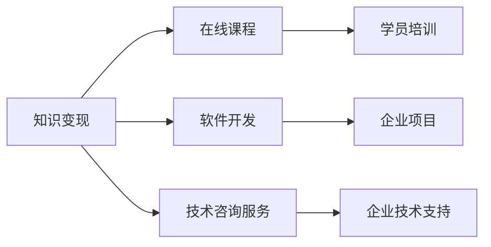

                 

# 知识变现:程序员的第二职业

> 关键词：知识变现, 程序员, 第二职业, 技术教育, 在线课程, 软件开发, 咨询服务

## 1. 背景介绍

### 1.1 问题由来

在快速变化的技术领域中，程序员们面临着不断学习新技术、提升技能的需求。然而，传统的技术培训模式往往难以跟上技术发展的步伐，也无法有效整合资源，帮助程序员实现职业生涯的跨越式发展。因此，探索一条新的路径，利用现有知识和技能进行价值转换，成为程序员们不可回避的问题。

## 2. 核心概念与联系

### 2.1 核心概念概述

为更好地理解知识变现这一主题，我们先梳理几个核心概念：

- **知识变现**：指的是通过转化自身掌握的知识和技能，创造经济价值的过程。对于程序员而言，这包括但不限于编写代码、开发应用、进行技术咨询、教育培训等。
- **程序员的第二职业**：指程序员在主业之外开展的与技术相关的附加职业，以实现收入多元化、职业发展多样化。
- **技术教育**：包括线上线下多种形式的培训课程，旨在传授知识、技能，帮助他人提升技术水平。
- **在线课程**：通过互联网平台提供的教育资源，灵活、便捷，适合任何时间和地点进行学习。
- **软件开发**：利用编程技能和工具，开发满足用户需求的应用程序。
- **咨询服务**：利用专业知识为各类企业提供技术支持、方案设计等服务。

这些概念之间通过知识共享、技能传递等机制相互关联，共同构成了程序员知识变现的多样化路径。

### 2.2 核心概念原理和架构的 Mermaid 流程图



## 3. 核心算法原理 & 具体操作步骤

### 3.1 算法原理概述

知识变现的核心在于如何将个人掌握的知识和技能，转化为可被市场认可的商业价值。在技术领域，这通常意味着通过编写代码、开发产品、提供咨询服务、教授他人等方式，实现经济收益。

对于程序员而言，具体的知识变现方法可以归纳为以下几个步骤：

1. **知识积累与技能提升**：通过不断的学习和实践，积累专业知识，掌握新技能。
2. **项目开发与产品化**：将积累的知识和技能转化为实际的应用产品，如开发应用程序、构建网站、设计技术解决方案等。
3. **教育培训与经验分享**：通过编写博客、录制视频、教授课程等方式，分享自己的技术知识和经验。
4. **咨询服务与技术支持**：为企业提供技术咨询、架构设计、性能优化等服务，解决其技术难题。

### 3.2 算法步骤详解

下面详细描述知识变现的具体操作步骤：

**Step 1: 确定知识变现的方向**

程序员首先需要明确自己想要变现的知识领域和方向。这包括但不限于编程语言、框架、工具、算法、数据结构、软件开发生命周期管理等。不同的方向对应着不同的变现途径，如软件开发、技术咨询、教育培训等。

**Step 2: 评估自身能力和市场需求**

在确定方向后，需要评估自身的技术能力、经验和市场上的实际需求。这可以通过查看招聘信息、参与技术社区、与同行交流等方式进行。了解市场上最需要哪些技术，哪些技能具有竞争力，有助于制定切实可行的变现策略。

**Step 3: 构建知识变现的项目**

根据市场需求和个人能力，选择适合自己的知识变现项目。这可以是开发一个应用程序、设计一个技术解决方案、编写技术博客、录制教育视频等。

**Step 4: 设计盈利模式**

明确项目的盈利模式，如通过售卖应用、提供咨询服务、收取培训费、获取广告分成等方式获得收入。

**Step 5: 市场推广和客户获取**

利用社交媒体、技术论坛、个人博客等渠道进行市场推广，吸引潜在客户。可以通过发布案例分析、成功案例、用户评价等方式提高品牌信任度和吸引力。

**Step 6: 持续优化和反馈**

根据客户反馈和市场变化，持续优化产品和服务，提升用户体验和技术水平。这包括但不限于功能改进、用户体验优化、性能提升等。

### 3.3 算法优缺点

**优点**：

- **多元收入**：通过多渠道变现，减少收入依赖单一来源的风险。
- **技能提升**：不断学习和实践，提升技术水平和市场竞争力。
- **时间灵活**：利用业余时间进行变现，不影响主业。

**缺点**：

- **市场竞争**：知识变现领域竞争激烈，需要不断创新和优化。
- **时间和精力投入**：需要在主业和技术变现之间找到平衡，可能需要较长的时间才能见效。
- **资源限制**：初期可能缺乏资金、技术支持等资源，需要逐步积累和投入。

### 3.4 算法应用领域

知识变现的应用领域非常广泛，涵盖了软件开发、技术咨询、在线教育、内容创作等多个方面。

- **软件开发**：通过开发应用程序、构建网站、设计技术解决方案等，满足市场和企业需求，获得收入。
- **技术咨询**：为企业提供技术指导、解决方案设计、性能优化等服务。
- **在线教育**：通过编写博客、录制视频、教授课程等方式，传授技术知识，分享经验。
- **内容创作**：编写技术书籍、博客、论文等，分享知识，提升知名度。
- **软件开发外包**：通过参与开源项目、为企业提供定制开发服务，获得项目酬劳。

## 4. 数学模型和公式 & 详细讲解 & 举例说明

### 4.1 数学模型构建

知识变现的数学模型可以抽象为以下形式：

设 $K$ 为程序员掌握的知识集合，$S$ 为市场对知识的需求集合，$P$ 为知识变现的渠道集合，$R$ 为每个变现渠道带来的收益。则知识变现的总收益 $R_{\text{total}}$ 可以表示为：

$$
R_{\text{total}} = \sum_{k \in K} \sum_{s \in S} \sum_{p \in P} R_{k,s,p}
$$

其中，$R_{k,s,p}$ 为知识 $k$ 在需求 $s$ 下通过渠道 $p$ 变现的收益。

### 4.2 公式推导过程

假设知识 $k$ 的市场需求为 $d_k$，变现渠道 $p$ 的转换率为 $c_p$，每单位的收益为 $r_p$，则单个知识 $k$ 通过渠道 $p$ 变现的收益 $R_{k,p}$ 可以表示为：

$$
R_{k,p} = d_k \times c_p \times r_p
$$

将上述公式代入总收益公式中，得：

$$
R_{\text{total}} = \sum_{k \in K} d_k \times \sum_{p \in P} c_p \times r_p
$$

在实际操作中，上述模型可以进一步细化，考虑市场变化、技术迭代、用户反馈等因素。例如，通过机器学习模型预测市场需求，通过用户反馈优化变现渠道的转换率和收益，从而提升总体变现效果。

### 4.3 案例分析与讲解

以开发一款编程教育应用为例：

- **知识集合**：Java编程基础、Web开发技术、数据结构与算法等。
- **市场需求**：对编程语言、技术框架、软件开发工具的需求。
- **变现渠道**：App内付费、广告分成、合作伙伴推荐、线上课程订阅等。

通过计算每个知识点的市场需求、渠道转换率和收益，可以估算出应用的总收益。例如，如果Java基础教程的市场需求为100万用户，App内付费的转换率为10%，每课售价为20元，则单日收益为：

$$
R_{\text{Java基础}} = 100 \times 10\% \times 20 = 2 \times 10^5 \text{元}
$$

通过类似计算，可以估算出其他知识点和变现渠道的收益，并进行总收益的计算和优化。

## 5. 项目实践：代码实例和详细解释说明

### 5.1 开发环境搭建

为了实现知识变现的项目，需要准备以下几个开发环境：

- **编程工具**：如Visual Studio Code、PyCharm等，提供高效开发环境。
- **版本控制系统**：如Git，便于代码版本管理。
- **云服务**：如AWS、阿里云等，提供稳定的计算和存储资源。
- **持续集成/持续部署(CI/CD)**：如Jenkins、GitLab CI，自动化构建和部署。
- **测试工具**：如JUnit、PyTest等，确保代码质量。

完成环境搭建后，可以使用上述工具进行代码编写、测试、部署和优化。

### 5.2 源代码详细实现

以开发一个简单的编程教育App为例：

**代码示例**：

```python
# 导入必要的库和模块
import flask
from flask import Flask, request, jsonify
from flask_sqlalchemy import SQLAlchemy
from flask_login import LoginManager, UserMixin, login_user, logout_user, login_required

# 初始化Flask应用
app = Flask(__name__)
app.config['SQLALCHEMY_DATABASE_URI'] = 'sqlite:///blog.db'
db = SQLAlchemy(app)
login_manager = LoginManager(app)

# 定义User模型
class User(db.Model, UserMixin):
    id = db.Column(db.Integer, primary_key=True)
    username = db.Column(db.String(80), unique=True, nullable=False)
    email = db.Column(db.String(120), unique=True, nullable=False)
    password = db.Column(db.String(120), nullable=False)

# 定义登录、登出、注册路由
@app.route('/login', methods=['POST'])
def login():
    username = request.json.get('username')
    password = request.json.get('password')
    user = User.query.filter_by(username=username).first()
    if user and user.password == password:
        login_user(user)
        return jsonify({'msg': 'Login Success'})
    else:
        return jsonify({'msg': 'Login Failed'})

@app.route('/logout')
@login_required
def logout():
    logout_user()
    return jsonify({'msg': 'Logout Success'})

@app.route('/register', methods=['POST'])
def register():
    username = request.json.get('username')
    password = request.json.get('password')
    email = request.json.get('email')
    user = User(username=username, password=password, email=email)
    db.session.add(user)
    db.session.commit()
    return jsonify({'msg': 'Register Success'})

# 定义课程相关路由
@app.route('/courses', methods=['GET'])
@login_required
def get_courses():
    courses = Course.query.all()
    course_list = [{'id': course.id, 'title': course.title, 'content': course.content} for course in courses]
    return jsonify(course_list)

# 运行应用
if __name__ == '__main__':
    app.run(debug=True)
```

**解释说明**：

- **Flask框架**：使用Flask框架搭建Web应用，提供API接口和数据库访问。
- **SQLAlchemy库**：用于数据库操作，存储用户信息和课程内容。
- **Flask-Login库**：用于用户认证和授权。
- **API接口**：定义了用户登录、登出、注册以及获取课程列表的API接口。
- **数据库迁移**：使用Flask-Migrate工具进行数据库迁移，便于新增和删除数据表。

通过上述代码，我们可以快速搭建一个简单的编程教育App，并对其进行开发和优化。

### 5.3 代码解读与分析

**Flask框架**：Flask是一个轻量级的Python Web框架，便于快速开发和部署Web应用。其核心组件包括路由、模板、表单、数据库等。

**SQLAlchemy库**：SQLAlchemy是一个Python SQL工具包，提供了ORM（对象关系映射）功能，便于进行数据库操作。

**Flask-Login库**：Flask-Login是一个用户认证和授权库，支持用户登录、登出、会话管理等功能。

**API接口设计**：API接口设计遵循RESTful风格，使用HTTP动词和URL路径表示不同的操作。

**数据库迁移**：Flask-Migrate是基于Flask-SQLAlchemy的数据库迁移工具，可以方便地进行数据库结构的更新和升级。

## 6. 实际应用场景

### 6.1 在线编程教育平台

在线编程教育平台是一种典型的知识变现应用。通过开发编程课程、录制教学视频、提供在线编程练习等，平台可以提供灵活多样的学习方式，满足不同学习者的需求。

**商业模式**：

- **订阅模式**：用户可以按月或按年订阅平台课程，获得无限制的课程访问权限。
- **单次购买**：用户可以单独购买单个课程或单元，获得永久访问权。
- **广告分成**：平台可以在App内展示广告，通过广告收入获利。

**成功案例**：

- **LeetCode**：一个在线编程练习平台，提供海量编程题目和解答，吸引了大量编程爱好者和学习者。
- **Coursera**：一个在线教育平台，提供来自世界顶尖大学的课程，涵盖计算机科学、数据科学等多个领域。

### 6.2 技术咨询服务

技术咨询服务是指利用自身的技术专长，为企业提供技术支持、解决方案设计等服务。这包括但不限于系统架构设计、性能优化、数据处理、系统迁移等。

**商业模式**：

- **按项目收费**：根据项目需求和复杂度，一次性收取项目费用。
- **按小时计费**：按技术专家的工作时间计费，提供灵活的时间安排。
- **长期合作**：与企业签订长期服务协议，提供持续的技术支持和维护。

**成功案例**：

- **Accenture**：提供全球领先的技术咨询和解决方案，服务领域涵盖金融、医疗、制造等多个行业。
- **Capgemini**：提供全面的信息技术咨询和管理服务，帮助企业实现数字化转型。

### 6.3 软件开发外包

软件开发外包是指将软件开发项目外包给第三方团队或个人，以降低开发成本、提升开发效率。这包括但不限于Web应用开发、移动应用开发、API开发等。

**商业模式**：

- **项目承包**：按项目预算和工期签订合同，提供全流程的开发和维护服务。
- **按小时计费**：按开发工时计费，提供灵活的时间安排。
- **长期合作**：与客户签订长期合作协议，提供持续的技术支持和维护。

**成功案例**：

- **Upwork**：一个全球自由职业者平台，提供软件开发、设计、写作等多种服务。
- **Fiverr**：一个在线自由职业平台，提供多样化的技能服务，包括软件开发、内容创作等。

## 7. 工具和资源推荐

### 7.1 学习资源推荐

为了帮助程序员更好地掌握知识变现的技术和策略，这里推荐几个优质的学习资源：

- **《程序猿的自我修养》**：一本介绍程序员如何自我提升、自我营销的书籍，涵盖职业规划、技术分享、品牌建设等多个方面。
- **《程序员的生存手册》**：一本系统介绍程序员职场技巧、项目管理、团队协作等方面的书籍，帮助程序员在职场中游刃有余。
- **《深度学习入门》**：一本介绍深度学习基础知识和实践的书籍，适合想要转行或提升技术水平的程序员。
- **Coursera和Udacity**：两个知名的在线教育平台，提供大量高质量的计算机科学和编程课程。
- **GitHub和Stack Overflow**：两个程序员社区平台，提供丰富的代码资源和技术交流。

### 7.2 开发工具推荐

为了提高开发效率，以下是几个常用的开发工具推荐：

- **Visual Studio Code**：一款轻量级的代码编辑器，支持多种编程语言和插件，适用于多种开发场景。
- **PyCharm**：一款专业的Python开发工具，提供代码自动补全、调试、版本控制等丰富的功能。
- **GitHub**：一个代码托管平台，支持版本控制、代码审查、项目管理等功能。
- **Docker**：一个容器化平台，便于打包、部署和管理应用。
- **Jenkins**：一个持续集成/持续部署工具，自动化构建和部署应用。

### 7.3 相关论文推荐

以下是几篇关于知识变现的奠基性论文，推荐阅读：

- **Knowledge-Based Intelligent Tutoring Systems**：介绍了基于知识图谱的智能教学系统，通过知识图谱和推荐算法，实现个性化教学。
- **Cloud Computing for Programmers**：探讨了程序员如何利用云计算平台，进行分布式开发和项目部署。
- **Programming as a Service**：介绍了编程即服务（PaaS）的商业模式，通过云平台提供编程环境和服务。

## 8. 总结：未来发展趋势与挑战

### 8.1 研究成果总结

知识变现作为程序员的第二职业，已经逐渐成为行业发展的趋势。通过技术教育、软件开发、技术咨询等多种形式，程序员可以将自身技能转化为经济价值。

### 8.2 未来发展趋势

未来，知识变现将呈现以下几个发展趋势：

- **多元化变现**：除了传统的软件开发、技术咨询，还将涌现更多新兴的变现形式，如内容创作、技术培训、知识付费等。
- **个性化服务**：通过大数据和人工智能技术，提供更个性化、更精准的知识服务，满足不同用户的需求。
- **全球化拓展**：随着互联网的普及和全球化进程的加速，知识变现将突破地域限制，覆盖全球市场。
- **技术与教育的深度融合**：利用技术手段优化教育资源，提升教学质量和效率，推动教育行业的发展。

### 8.3 面临的挑战

尽管知识变现前景广阔，但在实际操作中仍面临诸多挑战：

- **市场需求变化**：市场需求不断变化，程序员需要快速适应新的技术趋势和市场需求。
- **技术门槛提高**：新技术、新工具的涌现，对程序员的技术水平提出了更高要求。
- **版权和知识产权保护**：知识变现过程中，版权和知识产权保护是一个重要问题，需要建立完善的法律保障机制。
- **市场竞争加剧**：知识变现领域竞争激烈，需要不断创新和优化，保持竞争力。
- **用户需求多样**：用户需求千差万别，需要提供更加个性化、灵活的服务。

### 8.4 研究展望

未来的研究需要在以下几个方面寻求新的突破：

- **智能推荐系统**：利用人工智能技术，推荐个性化的知识内容和服务，提升用户体验。
- **知识图谱**：构建大规模知识图谱，实现知识的多层次、多维度整合和利用。
- **区块链技术**：利用区块链技术，保障知识变现过程中的版权和知识产权。
- **跨平台协作**：推动跨平台、跨领域的知识共享和协作，促进知识变现的规模化发展。

## 9. 附录：常见问题与解答

**Q1：知识变现是否只适用于技术类内容？**

A: 知识变现并不仅限于技术类内容，任何有价值的知识和技能都可以变现。例如，写作、绘画、音乐等领域的专家也可以利用自己的特长和经验，进行内容创作、教学培训等。

**Q2：如何找到适合自己的变现方向？**

A: 寻找适合自己的变现方向，需要综合考虑自身的兴趣、能力、市场需求等因素。可以通过以下方式：

- **市场调研**：分析市场上的热门需求，选择有潜力、有发展前景的领域。
- **兴趣导向**：选择自己喜欢且擅长的领域，进行深入学习和实践。
- **资源评估**：评估自身资源和能力，选择具有可行性的变现方式。

**Q3：如何提高知识变现的效率？**

A: 提高知识变现的效率，可以从以下几个方面入手：

- **持续学习**：不断学习新知识、新技能，保持自身技术领先。
- **优化流程**：优化知识变现的流程和工具，提高工作效率。
- **团队协作**：建立团队合作机制，分担工作负担，提升产出质量。
- **市场营销**：利用社交媒体、技术社区等渠道，积极宣传和推广自己的项目和服务。

通过不断优化和创新，程序员可以更加高效地实现知识变现，最大化利用自身资源和技术。

---

作者：禅与计算机程序设计艺术 / Zen and the Art of Computer Programming

