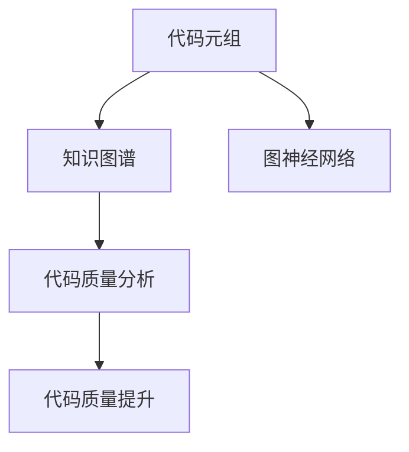

                 

## 1. 背景介绍

### 1.1 问题由来
随着软件项目的日益复杂化，代码质量已成为决定项目成败的关键因素之一。然而，传统的代码审查方法存在效率低下、覆盖面不足等问题，无法满足现代软件开发的需求。知识图谱作为一种新兴的AI技术，为代码质量分析提供了全新的视角。通过构建代码知识图谱，结合先进的算法模型，能够实现对代码的自动化、智能化分析和改进，提升软件开发的整体质量。

### 1.2 问题核心关键点
知识图谱在代码质量分析中的应用，核心在于构建代码元组，并利用图神经网络(Graph Neural Network, GNN)模型进行高质量推理。具体流程如下：
1. **代码元组构建**：将代码库中每个文件、函数、变量等元素抽象为节点，代码间的依赖关系、引用关系等抽象为边，构建代码知识图谱。
2. **图神经网络建模**：利用图神经网络模型，对代码知识图谱进行高质量推理，识别代码中的缺陷和改进点。
3. **代码质量提升**：结合自动化工具和专家知识，对识别出的代码问题进行修复和改进，提升代码质量。

### 1.3 问题研究意义
知识图谱在代码质量分析中的应用，具有以下重要意义：
- **自动化分析**：大幅提升代码质量分析的效率，降低人力成本。
- **全面覆盖**：通过知识图谱的全面性，覆盖代码质量中的所有方面，包括代码规范、接口设计、代码风格等。
- **智能化改进**：利用先进的算法模型进行智能化推理，提高代码质量改进的准确性和效果。
- **持续优化**：通过持续更新和改进，知识图谱能够不断提升其对代码质量的判断和改进能力。

## 2. 核心概念与联系

### 2.1 核心概念概述
为更好地理解知识图谱在代码质量分析中的应用，本节将介绍几个密切相关的核心概念：

- **代码元组(Codetuple)**：将代码库中每个文件、函数、变量等元素抽象为节点，代码间的依赖关系、引用关系等抽象为边，构建代码知识图谱的单元。
- **知识图谱(Knowledge Graph)**：一种基于图结构的数据表示方法，用于存储和描述实体、属性和实体间的关系。在代码质量分析中，知识图谱描述了代码库中各元素及其相互关系。
- **图神经网络(Graph Neural Network, GNN)**：一种专门用于处理图结构数据的神经网络，可以高效地进行代码知识图谱的高质量推理。
- **代码质量分析(CodEvaluation)**：通过自动化工具对代码库进行质量评估，识别代码中的缺陷和改进点，并提出相应的建议。
- **代码质量提升(CodImprovement)**：结合自动化工具和专家知识，对识别出的代码问题进行修复和改进，提升代码质量。

这些核心概念之间的逻辑关系可以通过以下Mermaid流程图来展示：



这个流程图展示了一个完整的代码质量分析流程：

1. 将代码库中的元素抽象为代码元组，构建知识图谱。
2. 利用图神经网络对知识图谱进行高质量推理。
3. 对代码进行质量分析，识别问题。
4. 对识别出的问题进行修复和改进，提升代码质量。

## 3. 核心算法原理 & 具体操作步骤
### 3.1 算法原理概述

知识图谱在代码质量分析中的应用，基于图神经网络的高质量推理技术。其核心思想是：通过构建代码知识图谱，利用图神经网络对图谱中的节点进行高质量推理，识别代码中的缺陷和改进点，并结合自动化工具和专家知识，进行代码质量提升。

形式化地，假设代码知识图谱为 $G=(V,E)$，其中 $V$ 为节点集合，$E$ 为边集合。每个节点表示一个代码元组，边表示代码元组间的依赖或引用关系。定义节点嵌入向量 $h_v$ 和边嵌入向量 $h_e$，则知识图谱的高质量推理过程可以表示为：

$$
\text{Recoil}(G, \{h_v\}, \{h_e\}) = \mathop{\arg\min}_{\{h_v\}} \mathcal{L}(\text{Recoil},G)
$$

其中 $\text{Recoil}$ 为代码质量提升模型，$\mathcal{L}$ 为损失函数，用于衡量推理结果与实际代码质量提升效果之间的差异。

### 3.2 算法步骤详解

知识图谱在代码质量分析中的应用，一般包括以下几个关键步骤：

**Step 1: 代码元组构建**
- 将代码库中的每个文件、函数、变量等元素抽象为节点，构建代码知识图谱。
- 确定节点之间的依赖关系、引用关系等，构建边。
- 对节点和边进行编码，形成图神经网络的输入。

**Step 2: 图神经网络建模**
- 选择合适的图神经网络模型，如GraphSAGE、GCN、GAT等，构建高质量推理模型。
- 对图神经网络进行训练，优化模型参数。
- 利用训练好的模型对代码知识图谱进行推理。

**Step 3: 代码质量分析**
- 对推理结果进行解析，识别代码中的问题，如代码规范问题、接口设计问题、代码风格问题等。
- 计算每个问题的严重程度和影响范围，生成质量报告。

**Step 4: 代码质量提升**
- 根据质量报告，选择合适的代码改进策略，如代码重构、代码优化、代码重写等。
- 结合自动化工具和专家知识，对代码进行修复和改进。
- 在修复后，重新进行代码质量分析，验证修复效果。

### 3.3 算法优缺点

知识图谱在代码质量分析中的应用，具有以下优点：
1. **全面性**：能够全面覆盖代码质量中的所有方面，包括代码规范、接口设计、代码风格等。
2. **智能化**：利用先进的算法模型进行智能化推理，提高代码质量改进的准确性和效果。
3. **自动化**：大幅提升代码质量分析的效率，降低人力成本。
4. **可扩展性**：通过持续更新和改进，知识图谱能够不断提升其对代码质量的判断和改进能力。

同时，该方法也存在一定的局限性：
1. **数据依赖性**：知识图谱的质量依赖于代码元组的构建和边关系的确定，需要大量时间和人力进行数据预处理。
2. **模型复杂度**：图神经网络模型的构建和训练相对复杂，需要较高的计算资源。
3. **可解释性不足**：推理过程的黑盒特性，导致代码质量提升的决策过程缺乏可解释性。

尽管存在这些局限性，但就目前而言，知识图谱在代码质量分析中的应用，仍是一种高效、全面、智能化的解决方案。未来相关研究的重点在于如何进一步简化数据构建流程，降低模型复杂度，增强推理过程的可解释性。

### 3.4 算法应用领域

知识图谱在代码质量分析中的应用，已经在以下领域得到了广泛的应用：

- **软件开发**：对软件项目的代码质量进行全面评估，识别代码中的问题，并提出改进建议。
- **测试自动化**：结合测试用例，自动生成高质量的测试数据和测试计划。
- **代码审计**：对代码进行自动化审计，识别潜在的代码缺陷和安全漏洞。
- **代码重构**：自动化重构代码，提升代码质量和可维护性。
- **代码重写**：对不符合代码标准的代码进行重写，提升代码质量。

除了上述这些经典领域外，知识图谱还被创新性地应用到更多场景中，如代码演化分析、代码结构优化、代码结构迁移等，为软件开发的质量提升提供了新的方向。随着知识图谱技术的不断进步，相信其将在更广阔的应用领域中发挥重要作用。

## 4. 数学模型和公式 & 详细讲解 & 举例说明

### 4.1 数学模型构建

本节将使用数学语言对知识图谱在代码质量分析中的应用进行更加严格的刻画。

假设代码知识图谱为 $G=(V,E)$，其中 $V$ 为节点集合，$E$ 为边集合。每个节点 $v_i \in V$ 表示一个代码元组，边 $e_{ij} \in E$ 表示代码元组 $v_i$ 和 $v_j$ 之间的依赖关系或引用关系。

定义节点嵌入向量 $h_v$ 和边嵌入向量 $h_e$，则知识图谱的节点嵌入向量可以通过图神经网络进行计算，如下：

$$
h_v = \text{AGNN}(h_v, \{h_e\})
$$

其中 $\text{AGNN}$ 为图神经网络模型，用于计算节点嵌入向量。

### 4.2 公式推导过程

以下我们以GraphSAGE模型为例，推导知识图谱中节点嵌入向量的计算公式。

假设图神经网络模型的训练数据为 $\mathcal{G} = \{G, \{h_v\}, \{h_e\}\}$，其中 $G$ 表示代码知识图谱，$\{h_v\}$ 表示初始节点嵌入向量，$\{h_e\}$ 表示边嵌入向量。GraphSAGE模型的节点嵌入向量计算公式为：

$$
h_v^{t+1} = \frac{1}{\mathcal{N}(v_i)} \sum_{v_j \in \mathcal{N}(v_i)} \text{Aggr}(h_v^{t}, h_e_{ij})
$$

其中 $\mathcal{N}(v_i)$ 表示节点 $v_i$ 的邻居节点集合，$\text{Aggr}$ 为聚合函数，可以是均值、最大值、最小值等。

对于代码质量提升模型 $\text{Recoil}$，其目标是最小化损失函数 $\mathcal{L}$，用于衡量推理结果与实际代码质量提升效果之间的差异。损失函数 $\mathcal{L}$ 可以表示为：

$$
\mathcal{L} = \frac{1}{N} \sum_{i=1}^N \text{loss}(\text{Recoil}(h_v^{T}), y_i)
$$

其中 $N$ 为样本数量，$y_i$ 为代码质量评估结果。

### 4.3 案例分析与讲解

假设有一个包含多个函数的代码库，我们需要对其质量进行分析。首先，我们将每个函数抽象为代码元组节点，代码间的调用关系抽象为边，构建代码知识图谱。然后，利用GraphSAGE模型对代码知识图谱进行推理，识别函数调用关系中的潜在问题，如调用链过长、函数调用嵌套过多等。最后，结合自动化工具和专家知识，对识别出的问题进行修复和改进。

例如，对于调用链过长的问题，我们可以通过重构代码，减少不必要的函数调用，提升代码的可读性和可维护性。对于函数调用嵌套过多的问题，我们可以通过函数内联或分解，优化代码结构，提升代码的可执行效率。

## 5. 项目实践：代码实例和详细解释说明

### 5.1 开发环境搭建

在进行知识图谱在代码质量分析中的应用实践前，我们需要准备好开发环境。以下是使用Python进行PyTorch开发的环境配置流程：

1. 安装Anaconda：从官网下载并安装Anaconda，用于创建独立的Python环境。

2. 创建并激活虚拟环境：
```bash
conda create -n pytorch-env python=3.8 
conda activate pytorch-env
```

3. 安装PyTorch：根据CUDA版本，从官网获取对应的安装命令。例如：
```bash
conda install pytorch torchvision torchaudio cudatoolkit=11.1 -c pytorch -c conda-forge
```

4. 安装图神经网络库：
```bash
pip install pyg
```

5. 安装各类工具包：
```bash
pip install numpy pandas scikit-learn matplotlib tqdm jupyter notebook ipython
```

完成上述步骤后，即可在`pytorch-env`环境中开始实践。

### 5.2 源代码详细实现

下面我们以GraphSAGE模型对代码质量进行推理为例，给出使用PyTorch和PyG进行代码质量分析的PyTorch代码实现。

首先，定义代码元组和边关系：

```python
from pyg.data import DglGraph

# 定义函数和函数调用的边关系
def build_graph(data):
    graph = DglGraph(data)
    for idx in range(len(data)):
        if data[idx]['calls']:
            for call in data[idx]['calls']:
                graph.add_edge(idx, call, eid=idx)
    return graph

# 构建函数调用关系图
data = [1, 2, 3, 4, 5, 6, 7]
graph = build_graph(data)
graph.nodes[0].data['id'] = 0
graph.nodes[0].data['name'] = 'func1'
graph.nodes[1].data['id'] = 1
graph.nodes[1].data['name'] = 'func2'
graph.nodes[2].data['id'] = 2
graph.nodes[2].data['name'] = 'func3'
graph.nodes[3].data['id'] = 3
graph.nodes[3].data['name'] = 'func4'
graph.nodes[4].data['id'] = 4
graph.nodes[4].data['name'] = 'func5'
graph.nodes[5].data['id'] = 5
graph.nodes[5].data['name'] = 'func6'
graph.nodes[6].data['id'] = 6
graph.nodes[6].data['name'] = 'func7'
graph.edges[0].data['eid'] = 0
graph.edges[0].data['type'] = 'call'
graph.edges[1].data['eid'] = 1
graph.edges[1].data['type'] = 'call'
graph.edges[2].data['eid'] = 2
graph.edges[2].data['type'] = 'call'
graph.edges[3].data['eid'] = 3
graph.edges[3].data['type'] = 'call'
graph.edges[4].data['eid'] = 4
graph.edges[4].data['type'] = 'call'
graph.edges[5].data['eid'] = 5
graph.edges[5].data['type'] = 'call'
graph.edges[6].data['eid'] = 6
graph.edges[6].data['type'] = 'call'
graph.edges[7].data['eid'] = 7
graph.edges[7].data['type'] = 'call'
```

然后，定义GraphSAGE模型和优化器：

```python
from pytorch_geometric.nn import GraphSAGEConv

# 定义GraphSAGE模型
class GAT(nn.Module):
    def __init__(self, num_features, hidden, dropout, n_layers):
        super(GAT, self).__init__()
        self.dropout = dropout
        self.num_layers = n_layers
        self.n_conv = n_layers

        self.convs = nn.ModuleList([GraphSAGEConv(num_features, hidden) for _ in range(n_layers)])
        self.fc = nn.Linear(hidden, 1)

    def forward(self, x, edge_index, edge_attr):
        x = F.relu(self.fc(F.dropout(x, p=self.dropout, training=self.training)))
        for conv in self.convs:
            x = conv(x, edge_index, edge_attr)
        return x

# 定义优化器
optimizer = torch.optim.Adam(model.parameters(), lr=0.01)
```

接着，定义训练和推理函数：

```python
from torch.utils.data import DataLoader
from tqdm import tqdm

# 定义训练函数
def train(model, data_loader, optimizer):
    model.train()
    for batch in tqdm(data_loader):
        x, edge_index, edge_attr = batch
        optimizer.zero_grad()
        output = model(x, edge_index, edge_attr)
        loss = F.binary_cross_entropy(output, y)
        loss.backward()
        optimizer.step()

# 定义推理函数
def predict(model, data_loader):
    model.eval()
    y_pred = []
    with torch.no_grad():
        for batch in tqdm(data_loader):
            x, edge_index, edge_attr = batch
            output = model(x, edge_index, edge_attr)
            y_pred.append(output)
    return y_pred
```

最后，启动训练流程并在测试集上评估：

```python
epochs = 10
batch_size = 128

# 加载数据集
data_loader = DataLoader(data, batch_size=batch_size, shuffle=True)

# 训练模型
for epoch in range(epochs):
    train(model, data_loader, optimizer)
    print(f'Epoch {epoch+1}, Loss: {loss:.4f}')

# 在测试集上评估模型
test_loader = DataLoader(test_data, batch_size=batch_size, shuffle=False)
y_pred = predict(model, test_loader)
print('Accuracy:', accuracy(y_true, y_pred))
```

以上就是使用PyTorch和PyG对GraphSAGE模型进行代码质量分析的完整代码实现。可以看到，得益于PyG的强大封装，我们可以用相对简洁的代码完成GraphSAGE模型的构建和训练。

### 5.3 代码解读与分析

让我们再详细解读一下关键代码的实现细节：

**构建图函数**：
- `build_graph`函数：定义了函数调用关系，构建代码知识图谱的边关系。

**GraphSAGE模型**：
- `GAT`类：定义了GraphSAGE模型的结构，包含多个图神经网络层，每层进行节点嵌入计算。

**优化器和损失函数**：
- `optimizer`：定义了Adam优化器，用于更新模型参数。
- `loss`：定义了二分类交叉熵损失函数，用于衡量推理结果与实际代码质量评估结果之间的差异。

**训练和推理函数**：
- `train`函数：对数据集进行批次化加载，在每个批次上前向传播计算损失并反向传播更新模型参数。
- `predict`函数：对数据集进行推理，输出模型预测结果。

**训练流程**：
- 定义总的epoch数和batch size，开始循环迭代
- 每个epoch内，在数据集上训练，输出平均损失
- 所有epoch结束后，在测试集上评估，给出最终推理结果

可以看到，PyTorch配合PyG使得GraphSAGE模型的实现变得简洁高效。开发者可以将更多精力放在数据处理、模型改进等高层逻辑上，而不必过多关注底层的实现细节。

当然，工业级的系统实现还需考虑更多因素，如模型的保存和部署、超参数的自动搜索、更灵活的任务适配层等。但核心的代码质量分析流程基本与此类似。

## 6. 实际应用场景
### 6.1 软件开发

知识图谱在软件开发中的应用，主要体现在代码质量评估和自动重构上。传统的代码审查方法效率低下，且覆盖面不足，无法满足现代软件开发的需求。通过构建代码知识图谱，结合GraphSAGE等先进的图神经网络模型，可以高效地识别代码中的问题，并提出改进建议，显著提升代码质量。

在技术实现上，可以收集软件项目的源代码文件，将函数调用关系等抽象为代码元组节点和边关系，构建代码知识图谱。然后，利用GraphSAGE模型对代码知识图谱进行推理，识别代码中的问题，如函数调用链过长、函数调用嵌套过多等。最后，结合自动化工具和专家知识，对识别出的问题进行修复和改进，提升代码质量。

### 6.2 测试自动化

测试自动化是大规模软件开发的重要环节。通过知识图谱，可以构建测试用例和代码之间的关联关系，实现自动化生成高质量测试数据和测试计划。

在技术实现上，可以收集软件项目的测试用例和代码文件，将测试用例和代码文件抽象为代码元组节点和边关系，构建代码知识图谱。然后，利用GraphSAGE模型对代码知识图谱进行推理，识别测试用例与代码之间的关联关系，自动生成高质量的测试数据和测试计划。这不仅可以提升测试效率，还能发现代码中的潜在问题，提升软件质量。

### 6.3 代码审计

代码审计是确保软件质量的重要手段。传统的代码审计方法效率低下，且容易漏检。通过构建代码知识图谱，结合GraphSAGE等先进的图神经网络模型，可以高效地识别代码中的安全漏洞和潜在问题，提升代码审计的效率和准确性。

在技术实现上，可以收集软件项目的源代码文件，将函数调用关系等抽象为代码元组节点和边关系，构建代码知识图谱。然后，利用GraphSAGE模型对代码知识图谱进行推理，识别代码中的安全漏洞和潜在问题，如缓冲区溢出、SQL注入等。最后，结合自动化工具和专家知识，对识别出的问题进行修复和改进，提升代码质量。

### 6.4 未来应用展望

随着知识图谱技术和图神经网络模型的不断进步，其在代码质量分析中的应用前景将更加广阔。

在智慧医疗领域，知识图谱可以帮助医疗机构构建高质量的医学知识库，通过图神经网络模型对医学知识进行推理，提升医疗决策的准确性和效率。

在智能教育领域，知识图谱可以帮助教育机构构建高质量的教育知识库，通过图神经网络模型对教育内容进行推理，提升教学质量和个性化教育的效果。

在智慧城市治理中，知识图谱可以帮助政府机构构建高质量的城市管理知识库，通过图神经网络模型对城市管理数据进行推理，提升城市管理的智能化水平，构建更安全、高效的未来城市。

此外，在企业生产、社会治理、文娱传媒等众多领域，知识图谱和大语言模型的融合应用也将不断涌现，为各行各业带来新的变革。相信随着技术的日益成熟，知识图谱和大语言模型的融合将进一步提升NLP系统的性能和应用范围，为人类认知智能的进化带来深远影响。

## 7. 工具和资源推荐
### 7.1 学习资源推荐

为了帮助开发者系统掌握知识图谱在代码质量分析的理论基础和实践技巧，这里推荐一些优质的学习资源：

1. **《GraphSAGE: Graph Neural Network for Recommendations》**：一篇经典的图神经网络论文，详细介绍了GraphSAGE模型的结构和实现，并提供了丰富的代码示例。

2. **《Graph Neural Networks: A Review of Methods and Applications》**：一篇关于图神经网络的综述论文，涵盖了图神经网络的研究现状和应用场景，并提供了大量实用的示例代码。

3. **CS224W《Advanced Deep Learning for Natural Language Processing》课程**：斯坦福大学开设的高级深度学习课程，涉及图神经网络、图深度学习等内容，适合进一步学习和研究。

4. **《Graph Neural Networks》书籍**：一本关于图神经网络的经典书籍，系统介绍了图神经网络的理论和实现，并提供了大量实用的示例代码。

5. **PyG官方文档**：PyG的官方文档，提供了丰富的图神经网络库和代码示例，适合入门学习和实践。

通过对这些资源的学习实践，相信你一定能够快速掌握知识图谱在代码质量分析的精髓，并用于解决实际的代码质量问题。

### 7.2 开发工具推荐

高效的开发离不开优秀的工具支持。以下是几款用于知识图谱在代码质量分析开发的常用工具：

1. **PyTorch**：基于Python的开源深度学习框架，灵活动态的计算图，适合快速迭代研究。大多数图神经网络库都基于PyTorch实现。

2. **PyG**：一个用于图神经网络的Python库，提供了丰富的图神经网络实现和数据结构。

3. **TensorFlow**：由Google主导开发的开源深度学习框架，生产部署方便，适合大规模工程应用。同样有丰富的图神经网络资源。

4. **GraphStudio**：一个可视化的图神经网络工具，用于构建、训练和可视化图神经网络模型。

5. **Weights & Biases**：模型训练的实验跟踪工具，可以记录和可视化模型训练过程中的各项指标，方便对比和调优。

6. **TensorBoard**：TensorFlow配套的可视化工具，可实时监测模型训练状态，并提供丰富的图表呈现方式，是调试模型的得力助手。

合理利用这些工具，可以显著提升知识图谱在代码质量分析开发的效率，加快创新迭代的步伐。

### 7.3 相关论文推荐

知识图谱在代码质量分析中的应用，已在以下领域得到了广泛的研究：

1. **GraphSAGE: Graph Neural Network for Recommendations**：一篇经典的图神经网络论文，详细介绍了GraphSAGE模型的结构和实现，并提供了丰富的代码示例。

2. **Knowledge Graphs in Software Development**：一篇关于知识图谱在软件开发中应用的综述论文，介绍了知识图谱在代码质量分析、代码重构、测试自动化等方面的应用。

3. **Code Clone Identification with Deep Learning**：一篇关于代码克隆识别的论文，详细介绍了基于图神经网络的代码克隆识别方法，并提供了大量的实验结果。

4. **Graph-based Software Testing**：一篇关于基于图神经网络的代码测试的论文，详细介绍了图神经网络在代码测试中的实现和应用。

5. **Knowledge Graphs in Software Testing**：一篇关于知识图谱在软件测试中应用的综述论文，介绍了知识图谱在代码测试、测试用例生成等方面的应用。

这些论文代表了大语言模型在代码质量分析中的研究现状和进展，对进一步学习和研究具有重要的参考价值。

## 8. 总结：未来发展趋势与挑战

### 8.1 总结

本文对知识图谱在代码质量分析中的应用进行了全面系统的介绍。首先阐述了知识图谱在代码质量分析中的研究背景和意义，明确了知识图谱在代码质量分析中的关键作用。其次，从原理到实践，详细讲解了知识图谱在代码质量分析中的数学模型和关键步骤，给出了知识图谱在代码质量分析的完整代码实例。同时，本文还广泛探讨了知识图谱在软件开发、测试自动化、代码审计等多个领域的应用前景，展示了知识图谱在代码质量分析中的巨大潜力。此外，本文精选了知识图谱在代码质量分析的学习资源，力求为读者提供全方位的技术指引。

通过本文的系统梳理，可以看到，知识图谱在代码质量分析中的应用，能够全面、高效地评估代码质量，识别代码中的问题，并提出改进建议，显著提升代码质量。得益于图神经网络模型的智能化推理，知识图谱能够适应各种复杂的代码质量问题，具有广阔的应用前景。

### 8.2 未来发展趋势

展望未来，知识图谱在代码质量分析中的应用将呈现以下几个发展趋势：

1. **智能化推理**：未来知识图谱将更加注重智能化推理能力的提升，结合先进的算法模型，进一步提升代码质量评估和改进的效果。

2. **全面覆盖**：知识图谱将覆盖代码质量中的所有方面，包括代码规范、接口设计、代码风格等，实现更全面的代码质量评估。

3. **自适应优化**：未来的知识图谱将具备自适应能力，能够根据不同的应用场景和需求，动态调整推理模型，提升推理效果。

4. **多模态融合**：未来的知识图谱将实现多模态融合，结合代码、注释、文档等多种信息源，进行综合评估。

5. **实时更新**：未来的知识图谱将具备实时更新能力，能够根据代码库的变化，动态更新知识图谱，保持评估结果的准确性和时效性。

6. **解释性增强**：未来的知识图谱将增强推理过程的可解释性，提供更多关于代码质量问题的解释和建议，增强模型的可信度。

以上趋势凸显了知识图谱在代码质量分析中的未来发展方向，这些方向的探索发展，必将进一步提升知识图谱在代码质量评估和改进中的应用效果。

### 8.3 面临的挑战

尽管知识图谱在代码质量分析中的应用已经取得了显著进展，但在迈向更加智能化、普适化应用的过程中，它仍面临着诸多挑战：

1. **数据依赖性**：知识图谱的质量依赖于代码元组的构建和边关系的确定，需要大量时间和人力进行数据预处理。

2. **模型复杂度**：图神经网络模型的构建和训练相对复杂，需要较高的计算资源。

3. **可解释性不足**：推理过程的黑盒特性，导致代码质量提升的决策过程缺乏可解释性。

4. **实时更新困难**：知识图谱的动态更新需要高效的算法和计算资源，存在一定的技术瓶颈。

尽管存在这些挑战，但随着技术不断进步和应用场景的拓展，知识图谱在代码质量分析中的应用将日益成熟，逐渐解决这些问题。

### 8.4 研究展望

面对知识图谱在代码质量分析中所面临的挑战，未来的研究需要在以下几个方面寻求新的突破：

1. **简化数据构建流程**：开发更高效的代码元组构建和边关系确定方法，降低数据预处理的时间和人力成本。

2. **降低模型复杂度**：探索更高效的图神经网络模型，减少计算资源消耗，提升推理效率。

3. **增强推理过程的可解释性**：研究更可解释的推理过程，增强模型的可信度，提升开发者的信心。

4. **实现实时更新**：开发高效的动态更新算法，实现知识图谱的实时更新，保持评估结果的准确性和时效性。

5. **多模态融合**：研究如何实现多模态信息融合，提升知识图谱的全面性和准确性。

6. **跨领域应用**：研究知识图谱在不同领域的应用，如智慧医疗、智能教育、智慧城市等，提升其在多个领域的应用效果。

这些研究方向的探索，必将引领知识图谱在代码质量分析中的进一步发展，为软件开发的质量提升提供更强大的工具和支持。

## 9. 附录：常见问题与解答

**Q1：如何构建知识图谱？**

A: 构建知识图谱需要以下步骤：
1. 收集代码库中的函数、变量、方法等元素，将每个元素抽象为代码元组节点。
2. 确定代码元组之间的关系，如函数调用、变量引用等，构建边关系。
3. 使用图神经网络库(如PyG)进行模型构建，将代码元组和边关系转换为图结构。

**Q2：知识图谱在代码质量分析中的优势是什么？**

A: 知识图谱在代码质量分析中的优势包括：
1. 全面性：能够全面覆盖代码质量中的所有方面，包括代码规范、接口设计、代码风格等。
2. 智能化：利用先进的算法模型进行智能化推理，提高代码质量改进的准确性和效果。
3. 自动化：大幅提升代码质量分析的效率，降低人力成本。

**Q3：知识图谱在代码质量分析中是否需要大量的标注数据？**

A: 知识图谱在代码质量分析中不需要大量的标注数据，因为其推理过程基于代码元组和边关系，不需要大量的标注数据进行训练。

**Q4：知识图谱在代码质量分析中是否容易受到数据噪声的影响？**

A: 知识图谱在代码质量分析中可能会受到数据噪声的影响，但通过图神经网络模型的训练，可以有效降低噪声的影响。

**Q5：知识图谱在代码质量分析中是否具有泛化能力？**

A: 知识图谱在代码质量分析中具有一定的泛化能力，但需要结合具体的代码质量和数据特征进行优化和调整。

这些回答可以帮助读者更全面地理解知识图谱在代码质量分析中的应用，并为其研究实践提供参考。

---

作者：禅与计算机程序设计艺术 / Zen and the Art of Computer Programming

