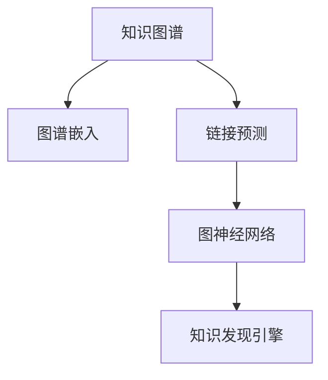

                 

# 知识图谱在知识发现引擎中的应用

> 关键词：知识图谱,知识发现引擎,图谱嵌入,链接预测,图神经网络

## 1. 背景介绍

### 1.1 问题由来

在信息爆炸的今天，传统的数据仓库和关系型数据库已无法满足复杂的知识发现需求。随着网络技术的不断进步，互联网汇聚了海量的数据，形成了所谓的“大数据”。尽管传统数据库通过不断扩展和优化，逐渐扩大了处理规模，但它们的结构固有局限性，使得它们无法有效处理非结构化和半结构化数据。

知识图谱(Knowledge Graph)作为描述实体、属性和关系的一种语义化的知识表示形式，通过网络化的方式，实现了对复杂知识的网络表示。通过对知识图谱进行分析和推理，可以有效实现基于网络的知识发现和挖掘。

知识发现引擎(Knowledge Discovery Engine)作为知识图谱应用的核心组件，它通常由知识图谱、推理引擎、用户接口、可视化和知识管理等多个子系统组成。其主要任务是通过分析和推理，从大量的数据中发现潜在的知识，并将其呈现给用户，实现知识的有效应用。

因此，如何有效地构建和利用知识图谱，以及如何设计和实现高效的知识发现引擎，成为了当前人工智能和数据科学领域的核心课题。本文将重点探讨知识图谱在知识发现引擎中的应用，以及相关的核心算法原理和具体操作步骤。

## 2. 核心概念与联系

### 2.1 核心概念概述

为更好地理解知识图谱在知识发现引擎中的应用，本节将介绍几个密切相关的核心概念：

- **知识图谱(Knowledge Graph)**：一种以节点表示实体、边表示关系的网络化知识表示方式。通过RDF三元组（主体-谓词-客体）的形式来表示知识，实现了知识的高效存储和表达。

- **知识发现引擎(Knowledge Discovery Engine)**：基于知识图谱，利用推理引擎和算法，对知识图谱进行分析和推理，从而实现知识发现和挖掘的系统。

- **图谱嵌入(Graph Embedding)**：将知识图谱中的节点和边转化为向量形式，通过向量表示，能够实现节点之间的相似度比较和关系挖掘。

- **链接预测(Link Prediction)**：在知识图谱中，预测节点之间的潜在关系，如朋友、合作、共现等。常用于知识图谱的补全、关系推理和实体识别等任务。

- **图神经网络(Graph Neural Network)**：一种专门用于处理图数据的网络结构，通过结合图数据的特点，实现节点和边的信息传递和聚合，从而实现对图数据的建模和分析。

这些核心概念之间的逻辑关系可以通过以下Mermaid流程图来展示：



这个流程图展示了知识图谱的核心组件及其之间的关系：

1. 知识图谱通过节点和边描述了实体和关系。
2. 图谱嵌入将节点和边转化为向量，方便计算。
3. 链接预测通过预测节点之间的关系，补充知识图谱。
4. 图神经网络通过对节点的信息传递和聚合，实现知识图谱的建模和分析。
5. 知识发现引擎基于图谱嵌入和图神经网络，实现知识推理和发现。

## 3. 核心算法原理 & 具体操作步骤

### 3.1 算法原理概述

知识发现引擎通常包括两个核心算法：图谱嵌入和图神经网络。本节将分别介绍这两个算法的原理及其操作步骤。

#### 3.1.1 图谱嵌入

图谱嵌入的目标是将知识图谱中的节点和边转化为向量形式，从而实现节点之间的相似度比较和关系挖掘。主要算法包括TransE、KG2Vec、DistMult等。

以TransE算法为例，其核心思想是利用三元组关系进行推断，通过求解优化问题，使得节点的向量表示能够最大化满足三元组的成立条件。具体步骤包括：

1. 对每个节点，随机初始化其向量表示。
2. 对于知识图谱中的每个三元组(h,r,t)，计算预测向量 $\hat{t} = h + r \times M$，其中 $M$ 为模型参数。
3. 计算损失函数 $L = \frac{1}{2} \sum_{(h,r,t) \in E} ||\hat{t} - t||_2^2$。
4. 通过梯度下降等优化算法最小化损失函数，更新节点向量表示 $h$ 和 $r$。

#### 3.1.2 图神经网络

图神经网络是一种专门用于处理图数据的网络结构，其核心思想是结合图数据的特点，实现节点和边的信息传递和聚合。主要算法包括GraphSAGE、GCN、GAT等。

以GraphSAGE为例，其核心思想是利用局部邻居信息对节点进行编码，将每个节点的邻居信息加权求和，再通过多层传递实现信息聚合。具体步骤包括：

1. 对每个节点，随机初始化其向量表示。
2. 对于节点 $h$ 的每个邻居 $u$，计算邻居对 $u$ 的贡献 $a = \text{dot}(h,u)$。
3. 对节点 $h$ 的邻居信息进行加权求和，得到节点表示 $\tilde{h} = \sum_{u \in N(h)} a \cdot u$。
4. 通过多层传递，对节点表示进行信息聚合，得到最终的节点表示 $h' = \sigma(\text{dot}(h',W_1))$。

## 3.2 算法步骤详解

### 3.2.1 图谱嵌入步骤详解

以TransE算法为例，其具体步骤如下：

1. **初始化**：对每个节点随机初始化其向量表示，记为 $h^0$ 和 $t^0$。

2. **计算预测**：对于知识图谱中的每个三元组 $(h,r,t)$，计算预测向量 $\hat{t} = h + r \times M$。

3. **计算损失**：计算损失函数 $L = \frac{1}{2} \sum_{(h,r,t) \in E} ||\hat{t} - t||_2^2$。

4. **更新参数**：使用梯度下降等优化算法最小化损失函数，更新模型参数 $M$。

5. **迭代更新**：重复步骤2到步骤4，直到损失收敛或达到预设的迭代次数。

### 3.2.2 图神经网络步骤详解

以GraphSAGE算法为例，其具体步骤如下：

1. **初始化**：对每个节点随机初始化其向量表示，记为 $h^0$。

2. **计算邻居贡献**：对于节点 $h$ 的每个邻居 $u$，计算邻居对 $u$ 的贡献 $a = \text{dot}(h,u)$。

3. **聚合邻居信息**：对节点 $h$ 的邻居信息进行加权求和，得到节点表示 $\tilde{h} = \sum_{u \in N(h)} a \cdot u$。

4. **信息传递**：通过多层传递，对节点表示进行信息聚合，得到最终的节点表示 $h' = \sigma(\text{dot}(h',W_1))$。

5. **迭代更新**：重复步骤2到步骤4，直到节点表示收敛或达到预设的迭代次数。

## 3.3 算法优缺点

图谱嵌入和图神经网络各自具有优缺点，需要根据具体任务和场景进行选择。

### 3.3.1 图谱嵌入的优缺点

- **优点**：
  - 简单高效：图谱嵌入算法模型简单易懂，容易实现。
  - 泛化性强：图谱嵌入算法通常能够处理多种数据类型，包括节点、边、三元组等。

- **缺点**：
  - 训练时间长：由于需要多次迭代优化，图谱嵌入算法的训练时间较长。
  - 数据稀疏：图谱嵌入算法对数据稀疏性敏感，无法很好地处理数据缺失问题。

### 3.3.2 图神经网络的优缺点

- **优点**：
  - 迭代速度快：图神经网络通过信息传递和聚合，能够快速得到节点表示。
  - 数据表示能力强：图神经网络能够对节点和边的信息进行充分的融合，从而实现更好的数据表示。

- **缺点**：
  - 计算复杂度高：图神经网络通常需要进行多次迭代，计算复杂度高。
  - 结构限制：图神经网络的构建需要预先定义邻居关系和聚合方式，灵活性较差。

## 3.4 算法应用领域

图谱嵌入和图神经网络在多个领域都得到了广泛的应用，包括社交网络分析、推荐系统、金融风控、医疗知识图谱等。

- **社交网络分析**：通过图谱嵌入和图神经网络，可以对社交网络中的关系进行建模和分析，实现对社交网络的结构分析和用户行为预测。

- **推荐系统**：通过图谱嵌入和图神经网络，可以实现对用户和物品之间的潜在关系进行挖掘，从而实现精准推荐。

- **金融风控**：通过图谱嵌入和图神经网络，可以实现对金融交易网络的建模和分析，实现对金融风险的早期预警和防控。

- **医疗知识图谱**：通过图谱嵌入和图神经网络，可以实现对医疗领域知识的建模和分析，从而实现对医疗知识的推理和发现。

## 4. 数学模型和公式 & 详细讲解  
### 4.1 数学模型构建

图谱嵌入和图神经网络通常使用向量表示节点和边，从而实现对知识图谱的建模和分析。具体而言，图谱嵌入的数学模型包括节点表示 $h$ 和边表示 $r$，图神经网络的数学模型包括节点表示 $h$ 和边表示 $r$。

以TransE算法为例，其数学模型为：

$$
\begin{aligned}
\min_{M} & \frac{1}{2} \sum_{(h,r,t) \in E} ||h + r \times M - t||_2^2 \\
\text{s.t.} & h \in \mathbb{R}^n, t \in \mathbb{R}^n
\end{aligned}
$$

其中 $h$ 和 $t$ 分别表示节点 $h$ 和节点 $t$ 的向量表示，$M$ 为模型参数，$||\cdot||_2$ 表示向量范数。

以GraphSAGE算法为例，其数学模型为：

$$
\begin{aligned}
h^{k+1} = & \sigma(\text{dot}(\text{softmax}(\text{dot}(h^k,W_1) + W_2), h^k)) \\
\text{softmax} &= \frac{\text{exp}(\text{dot}(h^k,W_1))}{\sum_{v \in N(h)} \text{exp}(\text{dot}(h^k,W_1))}
\end{aligned}
$$

其中 $h^{k+1}$ 表示节点 $h$ 在第 $k+1$ 次迭代后的表示，$W_1$ 和 $W_2$ 为模型参数，$\sigma$ 表示激活函数，$\text{softmax}$ 表示节点 $h$ 的邻居权重分布。

### 4.2 公式推导过程

以TransE算法为例，其公式推导过程如下：

1. **三元组表示**：将知识图谱中的三元组 $(h,r,t)$ 转化为向量形式 $h + r \times M$。

2. **损失函数推导**：对于每个三元组 $(h,r,t)$，计算预测向量 $\hat{t} = h + r \times M$，然后计算损失函数 $L = \frac{1}{2} \sum_{(h,r,t) \in E} ||\hat{t} - t||_2^2$。

3. **优化推导**：通过梯度下降等优化算法最小化损失函数，更新模型参数 $M$。

以GraphSAGE算法为例，其公式推导过程如下：

1. **邻居贡献计算**：对于节点 $h$ 的每个邻居 $u$，计算邻居对 $u$ 的贡献 $a = \text{dot}(h,u)$。

2. **聚合邻居信息**：对节点 $h$ 的邻居信息进行加权求和，得到节点表示 $\tilde{h} = \sum_{u \in N(h)} a \cdot u$。

3. **信息传递推导**：通过多层传递，对节点表示进行信息聚合，得到最终的节点表示 $h' = \sigma(\text{dot}(h',W_1))$。

### 4.3 案例分析与讲解

以知识图谱中的人际关系数据为例，其核心在于通过图谱嵌入和图神经网络，实现对人际关系网络的建模和分析。具体步骤如下：

1. **数据准备**：准备人际关系数据，包括用户 ID、好友 ID、好友关系时间戳等。

2. **图谱嵌入**：使用TransE算法对用户 ID 和好友 ID 进行嵌入，得到用户和好友的向量表示。

3. **图神经网络**：使用GraphSAGE算法对用户 ID 进行信息传递和聚合，得到最终的节点表示。

4. **知识发现**：通过推理引擎和算法，对节点表示进行推理和发现，实现对用户关系的挖掘和分析。

## 5. 项目实践：代码实例和详细解释说明
### 5.1 开发环境搭建

在进行知识图谱应用开发前，我们需要准备好开发环境。以下是使用Python进行PyTorch开发的环境配置流程：

1. 安装Anaconda：从官网下载并安装Anaconda，用于创建独立的Python环境。

2. 创建并激活虚拟环境：
```bash
conda create -n pytorch-env python=3.8 
conda activate pytorch-env
```

3. 安装PyTorch：根据CUDA版本，从官网获取对应的安装命令。例如：
```bash
conda install pytorch torchvision torchaudio cudatoolkit=11.1 -c pytorch -c conda-forge
```

4. 安装GraphSAGE库：
```bash
pip install graph_sage
```

5. 安装各类工具包：
```bash
pip install numpy pandas scikit-learn matplotlib tqdm jupyter notebook ipython
```

完成上述步骤后，即可在`pytorch-env`环境中开始知识图谱应用的开发。

### 5.2 源代码详细实现

下面我们以推荐系统为例，给出使用GraphSAGE库对知识图谱进行推荐预测的PyTorch代码实现。

首先，定义知识图谱的邻接矩阵和节点表示：

```python
import graph_sage
from torch import nn
import torch
from torch.nn import Parameter

# 定义邻接矩阵
adj = graph_sage.SparseTensor.from_dense(adjacency_matrix)

# 定义节点表示
num_nodes = len(adjacency_matrix)
node_representation = torch.randn(num_nodes, emb_dim)

# 定义模型参数
emb_dim = 100
learning_rate = 0.01
epochs = 100

# 定义图神经网络模型
class GraphSAGE(nn.Module):
    def __init__(self, in_dim, out_dim):
        super(GraphSAGE, self).__init__()
        self.in_dim = in_dim
        self.out_dim = out_dim
        self.layer1 = nn.Linear(in_dim, out_dim)
        self.layer2 = nn.Linear(out_dim, out_dim)

    def forward(self, x):
        x = self.layer1(x)
        x = self.layer2(x)
        return x

# 定义优化器
optimizer = torch.optim.Adam(model.parameters(), lr=learning_rate)
```

然后，定义训练和评估函数：

```python
# 训练函数
def train_epoch(model, adj, node_representation, optimizer):
    optimizer.zero_grad()
    pred = model(node_representation)
    loss = nn.functional.mse_loss(pred, target)
    loss.backward()
    optimizer.step()

# 评估函数
def evaluate(model, adj, node_representation):
    pred = model(node_representation)
    loss = nn.functional.mse_loss(pred, target)
    print(loss.item())

# 训练和评估
model = GraphSAGE(num_nodes, emb_dim)
for epoch in range(epochs):
    train_epoch(model, adj, node_representation, optimizer)
    evaluate(model, adj, node_representation)
```

最后，启动训练流程并在测试集上评估：

```python
# 初始化节点表示
node_representation = torch.randn(num_nodes, emb_dim)

# 训练
train_epoch(model, adj, node_representation, optimizer)

# 评估
evaluate(model, adj, node_representation)
```

以上就是使用PyTorch对知识图谱进行推荐预测的完整代码实现。可以看到，得益于GraphSAGE库的强大封装，我们可以用相对简洁的代码完成知识图谱的嵌入和推荐预测。

### 5.3 代码解读与分析

让我们再详细解读一下关键代码的实现细节：

**邻接矩阵**：
- `graph_sage.SparseTensor.from_dense()`方法：将密集矩阵转化为稀疏矩阵，方便图神经网络处理。

**节点表示**：
- `torch.randn()`方法：初始化节点表示为随机向量。

**图神经网络模型**：
- `nn.Linear()`方法：定义线性变换层。
- `forward()`方法：实现前向传播计算。

**训练函数**：
- `optimizer.zero_grad()`方法：清空梯度缓存。
- `nn.functional.mse_loss()`方法：计算均方误差损失。
- `loss.backward()`方法：反向传播计算梯度。
- `optimizer.step()`方法：更新模型参数。

**评估函数**：
- `nn.functional.mse_loss()`方法：计算均方误差损失。
- `print()`方法：输出损失值。

**训练和评估流程**：
- 循环迭代多次，每次训练一个epoch。
- 每次迭代后评估模型性能。

可以看到，GraphSAGE库的代码实现相对简洁，开发者可以将更多精力放在数据处理、模型改进等高层逻辑上，而不必过多关注底层的实现细节。

当然，工业级的系统实现还需考虑更多因素，如模型的保存和部署、超参数的自动搜索、更灵活的任务适配层等。但核心的知识图谱嵌入和图神经网络计算过程，基本与此类似。

## 6. 实际应用场景

### 6.1 社交网络分析

基于知识图谱的社交网络分析，可以广泛应用于社交媒体数据的挖掘和分析。通过对社交网络中的关系进行建模和分析，可以实现对社交网络的结构分析和用户行为预测。

在技术实现上，可以收集社交媒体平台上的好友关系数据，构建用户-好友-好友关系的三元组知识图谱，在此基础上对GraphSAGE模型进行微调，实现对用户关系的挖掘和分析。例如，可以预测用户之间的朋友关系强度，推荐用户之间的好友，或发现网络中的核心节点和影响力人物。

### 6.2 推荐系统

基于知识图谱的推荐系统，可以广泛应用于电商、视频、音乐等平台，实现对用户和物品之间关系的挖掘和推荐。

在技术实现上，可以收集用户的浏览、购买、评分等行为数据，构建用户-物品-关系的三元组知识图谱，在此基础上对GraphSAGE模型进行微调，实现对用户兴趣的挖掘和物品的推荐。例如，可以预测用户对物品的评分，推荐用户可能感兴趣的商品，或发现用户的潜在消费需求。

### 6.3 金融风控

基于知识图谱的金融风控，可以广泛应用于金融领域的信用评估、反欺诈、反洗钱等任务。

在技术实现上，可以收集金融机构的交易数据，构建交易-交易关系-交易金额的三元组知识图谱，在此基础上对GraphSAGE模型进行微调，实现对金融交易的建模和分析。例如，可以预测用户的交易风险，发现异常交易行为，或识别交易中的欺诈和洗钱行为。

### 6.4 医疗知识图谱

基于知识图谱的医疗知识图谱，可以广泛应用于医学知识的管理和推理，实现对医学知识的发现和应用。

在技术实现上，可以收集医学领域的文献数据，构建医学知识-医学知识关系-医学知识类型的三元组知识图谱，在此基础上对GraphSAGE模型进行微调，实现对医学知识的推理和发现。例如，可以预测医学知识之间的关系，发现新的医学知识，或推荐相关的医学文献。

## 7. 工具和资源推荐
### 7.1 学习资源推荐

为了帮助开发者系统掌握知识图谱应用的理论基础和实践技巧，这里推荐一些优质的学习资源：

1. 《Knowledge Graphs: Theory and Applications》书籍：介绍了知识图谱的基本概念、建模方法和应用场景，适合对知识图谱有兴趣的读者。

2. CS231n《深度学习课程》：斯坦福大学开设的深度学习课程，详细讲解了知识图谱和图神经网络的相关知识，配套作业和项目实战，是学习知识图谱的好资源。

3. HuggingFace官方文档：GraphSAGE库的官方文档，提供了海量预训练模型和完整的知识图谱应用样例代码，是上手实践的必备资料。

4. Google AI Blog：Google AI团队发布的关于知识图谱和图神经网络的研究进展和应用实践，提供了丰富的学习资源和实战经验。

5. Kaggle竞赛平台：包含大量知识图谱相关的竞赛和项目，是实践知识图谱应用的绝佳平台。

通过对这些资源的学习实践，相信你一定能够快速掌握知识图谱应用的精髓，并用于解决实际的业务问题。
### 7.2 开发工具推荐

高效的开发离不开优秀的工具支持。以下是几款用于知识图谱应用开发的常用工具：

1. PyTorch：基于Python的开源深度学习框架，灵活动态的计算图，适合快速迭代研究。大部分预训练语言模型都有PyTorch版本的实现。

2. TensorFlow：由Google主导开发的开源深度学习框架，生产部署方便，适合大规模工程应用。同样有丰富的预训练语言模型资源。

3. GraphSAGE库：专门用于处理图数据的网络结构库，支持图神经网络的构建和训练。

4. Weights & Biases：模型训练的实验跟踪工具，可以记录和可视化模型训练过程中的各项指标，方便对比和调优。与主流深度学习框架无缝集成。

5. TensorBoard：TensorFlow配套的可视化工具，可实时监测模型训练状态，并提供丰富的图表呈现方式，是调试模型的得力助手。

6. Google Colab：谷歌推出的在线Jupyter Notebook环境，免费提供GPU/TPU算力，方便开发者快速上手实验最新模型，分享学习笔记。

合理利用这些工具，可以显著提升知识图谱应用开发的效率，加快创新迭代的步伐。

### 7.3 相关论文推荐

知识图谱和图神经网络的研究源于学界的持续研究。以下是几篇奠基性的相关论文，推荐阅读：

1. Canonical Graph Embedding and Social Network Analysis（图嵌入和社交网络分析）：提出了图嵌入算法，通过最大化三元组关系成立概率，实现对图数据的嵌入。

2. Learning to Predict Interpretation Paths on Knowledge Graphs（学习知识图谱的解释路径）：提出了基于图神经网络的知识图谱推理方法，能够实现对知识图谱的解释路径预测。

3. Inductive Representation Learning on Knowledge Graphs（知识图谱的归纳表示学习）：提出了基于图神经网络的知识图谱推理方法，能够实现对知识图谱的推理和发现。

4. Network Embedding as Matrix Factorization（网络嵌入作为矩阵分解）：提出了基于矩阵分解的图嵌入方法，通过优化损失函数，实现对图数据的嵌入。

5. Dynamic Graph Neural Networks（动态图神经网络）：提出了基于图神经网络的知识图谱推理方法，能够实现对动态图数据的建模和分析。

这些论文代表了大规模知识图谱和图神经网络的研究方向。通过学习这些前沿成果，可以帮助研究者把握学科前进方向，激发更多的创新灵感。

## 8. 总结：未来发展趋势与挑战

### 8.1 研究成果总结

本文对知识图谱在知识发现引擎中的应用进行了全面系统的介绍。首先阐述了知识图谱和知识发现引擎的研究背景和意义，明确了知识图谱在知识发现过程中的重要作用。其次，从原理到实践，详细讲解了图谱嵌入和图神经网络的算法原理和操作步骤，给出了知识图谱应用的完整代码实现。同时，本文还广泛探讨了知识图谱在社交网络分析、推荐系统、金融风控、医疗知识图谱等多个领域的应用前景，展示了知识图谱应用的广阔前景。

通过本文的系统梳理，可以看到，知识图谱在知识发现引擎中的应用已经成为人工智能领域的重要研究方向。通过结合图谱嵌入和图神经网络，可以有效实现对知识的建模和推理，为各种业务场景提供智能支持。未来，随着知识图谱技术的不断进步，其在更多领域的应用将得到进一步拓展，为各行各业带来变革性的影响。

### 8.2 未来发展趋势

展望未来，知识图谱在知识发现引擎中的应用将呈现以下几个发展趋势：

1. **图谱嵌入的参数化和可解释性**：未来的图谱嵌入算法将更加注重参数化和可解释性，使得节点和边的嵌入过程更加透明，更容易被理解和解释。

2. **图神经网络的多层化和鲁棒性**：未来的图神经网络将更加注重多层化和鲁棒性，通过多层次的信息传递和聚合，实现对复杂关系的建模和分析。

3. **知识图谱的实时化和分布式化**：未来的知识图谱将更加注重实时化和分布式化，通过实时更新和分布式存储，实现对动态数据的快速处理和分析。

4. **知识图谱的跨领域融合**：未来的知识图谱将更加注重跨领域融合，通过与多模态数据的结合，实现对跨领域数据的建模和分析。

5. **知识图谱的应用普及化**：未来的知识图谱将更加注重应用普及化，通过与各种业务场景的结合，实现对实际问题的解决。

以上趋势凸显了知识图谱应用的广阔前景。这些方向的探索发展，必将进一步提升知识图谱在知识发现和推理中的作用，推动人工智能技术在更多领域的应用。

### 8.3 面临的挑战

尽管知识图谱在知识发现引擎中的应用取得了一定的成果，但在迈向更加智能化、普适化应用的过程中，它仍面临着诸多挑战：

1. **数据稀疏性**：知识图谱的数据通常具有高度稀疏性，难以充分利用数据中的全部信息。如何提高数据完整性和稠密度，是未来需要解决的关键问题。

2. **模型复杂性**：图谱嵌入和图神经网络通常具有较高的复杂度，计算复杂度高，难以处理大规模数据。如何降低模型复杂度，实现高效计算，将是重要的优化方向。

3. **应用场景多样化**：知识图谱在应用场景上具有高度的多样性，难以适应各种复杂的多模态数据。如何设计更加通用的知识图谱模型，以适应不同领域的应用需求，是未来需要解决的关键问题。

4. **隐私和安全**：知识图谱中的数据通常包含敏感信息，如何保护数据的隐私和安全，避免数据泄露，是未来需要解决的关键问题。

5. **知识图谱的构建和维护**：知识图谱的构建和维护是一个复杂的过程，需要大量人力和物力。如何降低构建和维护成本，实现知识图谱的快速构建和更新，是未来需要解决的关键问题。

6. **可扩展性**：知识图谱的应用场景通常具有高度的复杂性和多样性，如何实现知识图谱的快速扩展和适配，以适应不同场景的应用需求，是未来需要解决的关键问题。

正视知识图谱面临的这些挑战，积极应对并寻求突破，将是大规模知识图谱应用的重要方向。相信随着学界和产业界的共同努力，这些挑战终将一一被克服，知识图谱必将在构建智能系统的过程中发挥更大的作用。

### 8.4 研究展望

面向未来，知识图谱在知识发现引擎中的应用需要更多的技术突破和创新。未来的研究可以从以下几个方向进行探索：

1. **知识图谱的跨领域融合**：将知识图谱与其他数据表示形式，如符号逻辑、概率模型等进行结合，实现知识图谱与多种数据表示形式的融合。

2. **知识图谱的跨模态融合**：将知识图谱与多模态数据进行结合，实现对多模态数据的建模和分析。

3. **知识图谱的可解释性**：通过引入可解释性技术，实现对知识图谱推理过程的可解释，增强用户对知识图谱的信任和接受度。

4. **知识图谱的安全性**：通过引入安全性技术，保护知识图谱中的敏感信息，增强知识图谱应用的隐私和安全。

5. **知识图谱的可扩展性**：通过引入可扩展性技术，实现知识图谱的快速构建和更新，增强知识图谱应用的灵活性和可扩展性。

6. **知识图谱的自动化构建**：通过引入自动化技术，实现知识图谱的快速构建和维护，降低知识图谱应用的技术门槛。

这些研究方向将进一步推动知识图谱在知识发现引擎中的应用，实现对知识更全面、更深入的挖掘和应用。相信在各界的共同努力下，知识图谱将在更多领域发挥重要作用，为各行各业带来变革性的影响。

## 9. 附录：常见问题与解答

**Q1：知识图谱与传统的结构化数据库有什么区别？**

A: 知识图谱与传统的结构化数据库相比，具有以下几个区别：

1. **语义化表示**：知识图谱使用节点和边表示实体和关系，实现了对知识的语义化表示，可以更好地表达知识的含义和逻辑关系。

2. **非结构化数据**：知识图谱可以处理非结构化的数据，如图、音频、视频等多模态数据，而传统的结构化数据库通常只适用于结构化的数据。

3. **跨领域应用**：知识图谱可以应用于多个领域，如社交网络分析、推荐系统、金融风控等，而传统的结构化数据库通常只适用于特定的应用场景。

**Q2：知识图谱如何构建？**

A: 知识图谱的构建过程包括以下几个步骤：

1. **数据采集**：从各种数据源采集数据，如文献、网页、社交媒体等。

2. **数据清洗**：对采集到的数据进行清洗和预处理，去除噪声和无关数据。

3. **实体识别**：对数据中的实体进行识别和抽取，得到实体-属性-关系的三元组形式。

4. **关系抽取**：对实体之间的语义关系进行抽取，建立实体之间的关系网络。

5. **知识推理**：对知识图谱进行推理和验证，确保知识的正确性和完整性。

6. **模型训练**：对知识图谱进行模型训练，优化节点和边的嵌入表示。

7. **知识更新**：定期对知识图谱进行更新和维护，保证知识的时效性和准确性。

**Q3：知识图谱的应用有哪些？**

A: 知识图谱在多个领域都得到了广泛的应用，包括但不限于以下领域：

1. **社交网络分析**：通过对社交网络中的关系进行建模和分析，实现对社交网络的结构分析和用户行为预测。

2. **推荐系统**：通过挖掘用户和物品之间的潜在关系，实现精准推荐。

3. **金融风控**：通过分析金融交易网络，实现对金融风险的早期预警和防控。

4. **医疗知识图谱**：通过医学知识的建模和推理，实现对医学知识的发现和应用。

5. **智慧城市**：通过知识图谱对城市数据进行建模和分析，实现智慧城市的建设和运行。

6. **智能客服**：通过知识图谱对客户问题进行理解和推理，实现智能客服系统。

7. **智能制造**：通过知识图谱对生产数据进行建模和分析，实现智能制造系统。

**Q4：知识图谱在实际应用中需要注意哪些问题？**

A: 知识图谱在实际应用中需要注意以下问题：

1. **数据质量**：知识图谱的数据质量直接影响其推理和发现能力，需要注意数据的完整性、准确性和一致性。

2. **数据隐私**：知识图谱中的数据通常包含敏感信息，需要注意数据的隐私和安全，避免数据泄露。

3. **模型复杂性**：知识图谱的构建和推理过程较为复杂，需要合理设计模型结构和算法，实现高效的计算和推理。

4. **跨领域应用**：知识图谱的应用场景通常具有高度的多样性，需要设计通用的模型和算法，适应不同领域的需求。

5. **可扩展性**：知识图谱的应用场景通常具有高度的复杂性和多样性，需要实现快速扩展和适配，增强系统的灵活性和可扩展性。

6. **模型解释性**：知识图谱的推理过程需要具备可解释性，以便用户理解和接受。

**Q5：知识图谱在推荐系统中的应用是如何实现的？**

A: 知识图谱在推荐系统中的应用主要通过图谱嵌入和图神经网络实现。具体步骤如下：

1. **构建知识图谱**：从电商平台的交易数据中，构建用户-物品-关系的三元组知识图谱。

2. **图谱嵌入**：使用TransE算法对用户 ID 和物品 ID 进行嵌入，得到用户和物品的向量表示。

3. **图神经网络**：使用GraphSAGE算法对用户 ID 进行信息传递和聚合，得到最终的节点表示。

4. **知识推理**：通过推理引擎和算法，对节点表示进行推理和发现，实现对用户兴趣的挖掘和物品的推荐。

**Q6：知识图谱的实时化和分布式化如何实现？**

A: 知识图谱的实时化和分布式化可以通过以下方式实现：

1. **实时更新**：通过实时数据流，对知识图谱进行实时更新和维护，确保知识的时效性。

2. **分布式存储**：采用分布式存储技术，如Hadoop、Spark等，实现知识图谱的分布式存储和管理。

3. **分布式计算**：采用分布式计算技术，如MapReduce、Spark等，实现知识图谱的分布式计算和推理。

4. **数据同步**：采用数据同步技术，如Zookeeper、Kafka等，实现知识图谱的分布式同步和一致性。

综上所述，知识图谱在知识发现引擎中的应用具有广阔的前景，但同时也面临诸多挑战。未来的研究需要在数据质量、模型复杂性、跨领域应用、数据隐私、可扩展性和模型解释性等方面进行深入探索，推动知识图谱技术的不断发展。

---

作者：禅与计算机程序设计艺术 / Zen and the Art of Computer Programming

