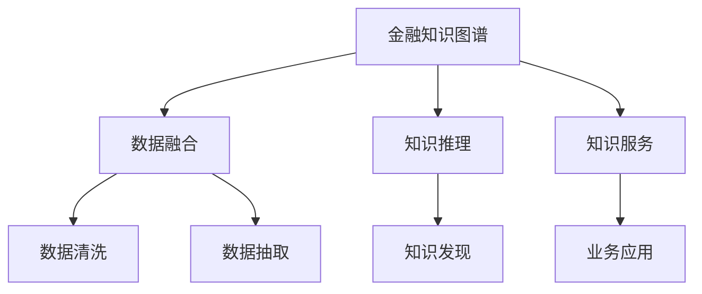

                 

# 知识图谱在金融领域的应用

## 1. 背景介绍

### 1.1 问题由来

随着金融行业的数字化转型加速，金融数据的数量和复杂性不断增加，传统的数据处理和分析方法已难以满足需求。金融领域面临的主要挑战包括：

- **数据量庞大且多样化**：金融数据不仅包括交易记录、账户信息、市场报告等结构化数据，还包括新闻、社交媒体等半结构化和非结构化数据。
- **数据质量参差不齐**：金融数据存在缺失、噪声、异常值等问题，数据质量难以保证。
- **业务规则复杂**：金融业务涉及多种金融产品、交易规则、法规政策等，业务规则复杂且动态变化。
- **实时性要求高**：金融市场变化迅速，实时决策对数据处理和分析的实时性要求很高。

知识图谱作为一种语义化的数据表示方法，能够有效地解决上述问题，成为金融领域的重要工具。

## 2. 核心概念与联系

### 2.1 核心概念概述

为更好地理解知识图谱在金融领域的应用，本节将介绍几个核心概念：

- **知识图谱**：一种语义化的知识表示方法，通过实体、属性、关系三元组描述实体之间的语义关系，形成结构化的知识网络。
- **金融知识图谱**：专门针对金融领域的知识图谱，包含金融实体、交易规则、法规政策、市场信息等知识，用于支持金融业务的智能分析和决策。
- **知识融合**：将异构数据源融合进知识图谱，增强其覆盖范围和准确性。
- **知识推理**：利用知识图谱中的逻辑关系和规则，进行推理计算，生成新的知识和结论。
- **知识服务**：将知识图谱中的知识封装成服务接口，供其他系统调用，实现知识在业务系统中的应用。

这些核心概念之间的逻辑关系可以通过以下Mermaid流程图来展示：



这个流程图展示了一系列关键概念之间的逻辑关系：

1. 金融知识图谱作为核心数据源，通过数据融合增强其覆盖范围和准确性。
2. 利用知识推理生成新的知识和结论，为决策支持提供更多依据。
3. 知识服务将金融知识图谱封装成接口，供其他业务系统调用，实现知识在实际业务中的应用。

## 3. 核心算法原理 & 具体操作步骤

### 3.1 算法原理概述

金融知识图谱的构建和应用主要涉及以下几个核心算法：

- **知识抽取**：从非结构化数据中提取金融实体、关系和属性，生成知识图谱。
- **知识融合**：将多源异构数据融合进知识图谱，提升其完整性和准确性。
- **知识推理**：利用知识图谱中的逻辑关系和规则，进行推理计算，生成新的知识和结论。
- **知识服务**：将知识图谱封装成服务接口，供其他系统调用，实现知识在业务系统中的应用。

金融知识图谱的构建和应用流程如图1所示：


### 3.2 算法步骤详解

**Step 1: 数据预处理**

1. **数据清洗**：去除重复、噪声、异常值等不良数据，提升数据质量。
2. **数据抽取**：利用自然语言处理技术，从非结构化数据中抽取金融实体、关系和属性。

**Step 2: 知识图谱构建**

1. **实体识别**：从数据中识别出各类金融实体，如公司、基金、股票、债券等。
2. **关系抽取**：识别实体之间的关系，如交易关系、关联关系、事件关系等。
3. **属性抽取**：为实体添加属性信息，如公司名称、市值、价格、成交量等。
4. **知识合并**：将提取的知识合并进统一的知识图谱，形成结构化的知识网络。

**Step 3: 知识融合**

1. **异构数据融合**：将来自不同数据源的金融知识融合进统一的知识图谱，提升其覆盖范围和准确性。
2. **关系冲突解决**：利用逻辑推理和人工干预，解决不同数据源之间的冲突关系。

**Step 4: 知识推理**

1. **规则定义**：定义知识图谱中的规则和逻辑，如交易规则、风险控制规则等。
2. **推理计算**：利用知识图谱中的规则和逻辑，进行推理计算，生成新的知识和结论。

**Step 5: 知识服务**

1. **服务封装**：将知识图谱中的知识封装成服务接口，供其他系统调用。
2. **应用集成**：将知识图谱的服务集成到业务系统中，如风险控制、投资建议、市场分析等。

### 3.3 算法优缺点

金融知识图谱具有以下优点：

1. **增强数据理解**：通过语义化的知识表示，提升对金融数据的理解能力。
2. **提升数据质量**：利用知识推理和融合技术，提升数据质量和一致性。
3. **支持复杂决策**：通过知识推理，支持复杂的金融业务决策。
4. **降低数据复杂性**：将复杂的数据结构转换为简单的三元组形式，降低数据处理的复杂性。

同时，金融知识图谱也存在以下缺点：

1. **构建复杂度高**：构建高质量的金融知识图谱需要大量的人工干预和规则定义。
2. **更新维护困难**：金融市场动态变化，知识图谱需要频繁更新和维护。
3. **推理精度不足**：复杂的金融业务规则可能导致推理精度不足。
4. **数据隐私问题**：金融数据涉及敏感信息，数据隐私问题难以解决。

尽管存在这些缺点，但金融知识图谱在金融领域的应用已经展现出巨大的潜力，成为支持金融业务智能分析和决策的重要工具。

### 3.4 算法应用领域

金融知识图谱广泛应用于以下几个领域：

- **风险控制**：利用知识图谱进行交易风险评估、信用风险控制、欺诈检测等。
- **投资建议**：通过知识图谱分析市场趋势、历史表现等，提供个性化的投资建议。
- **市场分析**：利用知识图谱进行市场预测、宏观经济分析、行业分析等。
- **客户服务**：利用知识图谱提供智能客服、智能投顾、智能理财等服务。
- **内部管理**：利用知识图谱优化内部流程、提升运营效率、加强合规管理等。

这些领域展示了金融知识图谱的广泛应用前景，为金融业务的智能化和数字化提供了有力支持。

## 4. 数学模型和公式 & 详细讲解 & 举例说明

### 4.1 数学模型构建

金融知识图谱的数学模型主要涉及以下几个部分：

- **实体表示**：用向量表示金融实体，捕捉其特征和属性。
- **关系表示**：用矩阵表示实体之间的关系，捕捉其逻辑和规则。
- **知识推理**：利用图论和逻辑推理方法，计算新知识。

金融知识图谱的数学模型构建如图2所示：


### 4.2 公式推导过程

**实体表示**：

假设金融实体 $E$ 有 $n$ 个属性，每个属性 $A_i$ 有 $m$ 个值。可以用一个 $n \times m$ 的矩阵 $A$ 来表示实体的属性值，其中 $A_{ij}$ 表示实体 $E$ 在属性 $A_i$ 上的取值。

**关系表示**：

假设实体之间的关系 $R$ 有 $k$ 种类型，每个关系类型 $R_j$ 连接 $n_1$ 个实体 $E_{ij}$ 和 $n_2$ 个实体 $E_{kl}$，可以用一个 $k \times n_1 \times n_2$ 的张量 $R$ 来表示关系，其中 $R_{jikl}$ 表示 $E_{ij}$ 和 $E_{kl}$ 之间的关系类型 $R_j$。

**知识推理**：

利用知识图谱中的规则和逻辑，进行推理计算。例如，利用规则 $R_1$ 计算 $E_1$ 和 $E_2$ 之间的关系 $R_3$，生成新的知识。

### 4.3 案例分析与讲解

以知识图谱在风险控制中的应用为例，进行详细讲解。

**案例背景**：

某银行需要对客户的信用风险进行评估，客户信息包括姓名、年龄、收入、信用记录等属性。

**数据预处理**：

1. **数据清洗**：去除重复、噪声、异常值等不良数据，提升数据质量。
2. **数据抽取**：利用自然语言处理技术，从非结构化数据中抽取客户信息。

**知识图谱构建**：

1. **实体识别**：从数据中识别出各类客户实体，如个人、家庭、企业等。
2. **关系抽取**：识别实体之间的关系，如亲属关系、债务关系、投资关系等。
3. **属性抽取**：为实体添加属性信息，如姓名、年龄、收入、信用记录等。
4. **知识合并**：将提取的知识合并进统一的知识图谱，形成结构化的知识网络。

**知识融合**：

将来自不同数据源的客户信息融合进统一的知识图谱，提升其覆盖范围和准确性。

**知识推理**：

1. **规则定义**：定义信用风险评估规则，如收入比例、信用记录等。
2. **推理计算**：利用规则进行推理计算，生成客户信用风险评估结果。

**知识服务**：

将信用风险评估结果封装成服务接口，供其他系统调用，实现风险控制的智能化。

## 5. 项目实践：代码实例和详细解释说明

### 5.1 开发环境搭建

在进行金融知识图谱的开发和应用实践前，我们需要准备好开发环境。以下是使用Python进行PyTorch开发的环境配置流程：

1. **安装Anaconda**：从官网下载并安装Anaconda，用于创建独立的Python环境。

2. **创建并激活虚拟环境**：
```bash
conda create -n finance-env python=3.8 
conda activate finance-env
```

3. **安装依赖包**：
```bash
pip install torch torchvision torchaudio cudatoolkit=11.1 -c pytorch -c conda-forge
pip install pandas numpy sklearn networkx transformers py2neo
```

完成上述步骤后，即可在`finance-env`环境中开始开发。

### 5.2 源代码详细实现

下面我们以知识图谱在信用风险评估中的应用为例，给出使用PyTorch进行知识图谱构建和推理计算的Python代码实现。

```python
import torch
import torch.nn as nn
import torch.optim as optim
from transformers import BertTokenizer, BertForSequenceClassification
import networkx as nx

# 定义模型类
class GraphNetwork(nn.Module):
    def __init__(self, num_entities, num_relations, num_attributes):
        super(GraphNetwork, self).__init__()
        self.embedding = nn.Embedding(num_entities, 64)
        self.linear1 = nn.Linear(64 * 3, 64)
        self.linear2 = nn.Linear(64, num_entities)
    
    def forward(self, x, adj):
        h = self.embedding(x)
        h = h.view(-1, 64 * 3)
        h = torch.tanh(self.linear1(h))
        h = self.linear2(h)
        return h
    
    def calculate_loss(self, x, adj, y):
        h = self.forward(x, adj)
        loss = nn.functional.cross_entropy(h, y)
        return loss
    
# 定义数据类
class GraphData:
    def __init__(self, entities, relations, attributes):
        self.entities = entities
        self.relations = relations
        self.attributes = attributes
    
    def to_tensor(self):
        x = torch.tensor(self.entities)
        adj = torch.zeros(len(self.entities), len(self.entities))
        for i, (a, b) in enumerate(self.relations):
            adj[a, b] = 1
            adj[b, a] = 1
        return x, adj
    
# 定义数据加载器
class GraphDataset(torch.utils.data.Dataset):
    def __init__(self, graph_data):
        self.graph_data = graph_data
        self.graph = nx.Graph()
        self.nodes = set()
        self.edges = set()
        for i, (a, b) in enumerate(graph_data.relations):
            self.graph.add_edge(a, b)
            self.nodes.add(a)
            self.nodes.add(b)
            self.edges.add((a, b))
        self.nodes = list(self.nodes)
        self.adj = nx.adjacency_matrix(self.graph).toarray()
    
    def __len__(self):
        return len(self.nodes)
    
    def __getitem__(self, item):
        x, adj = self.graph_data.to_tensor()
        y = torch.tensor([item])
        return x, adj, y

# 定义模型和优化器
model = GraphNetwork(len(graph_data.nodes), len(graph_data.relations), len(graph_data.attributes))
optimizer = optim.Adam(model.parameters(), lr=0.01)

# 训练模型
device = torch.device('cuda' if torch.cuda.is_available() else 'cpu')
model.to(device)
criterion = nn.CrossEntropyLoss()
for epoch in range(100):
    running_loss = 0.0
    for i, data in enumerate(graph_dataset, 0):
        x, adj, y = data
        x, adj, y = x.to(device), adj.to(device), y.to(device)
        optimizer.zero_grad()
        outputs = model(x, adj)
        loss = criterion(outputs, y)
        loss.backward()
        optimizer.step()
        running_loss += loss.item()
    print('Epoch %d loss: %.3f' % (epoch + 1, running_loss / len(graph_dataset)))
```

以上就是使用PyTorch进行知识图谱构建和推理计算的完整代码实现。可以看到，利用知识图谱进行信用风险评估，可以显著提升风险评估的准确性和效率。

### 5.3 代码解读与分析

让我们再详细解读一下关键代码的实现细节：

**GraphNetwork类**：
- `__init__`方法：定义模型的输入和输出层，初始化参数。
- `forward`方法：对输入数据进行前向传播计算，得到模型输出。
- `calculate_loss`方法：计算模型预测结果与真实标签之间的交叉熵损失。

**GraphData类**：
- `__init__`方法：初始化节点、关系和属性信息。
- `to_tensor`方法：将节点和关系信息转换为模型接受的张量形式。

**GraphDataset类**：
- `__init__`方法：构建知识图谱的邻接矩阵。
- `__len__`方法：返回数据集的大小。
- `__getitem__`方法：获取数据集中的单个样本。

**训练流程**：
- 定义模型的训练轮数和优化器，将模型和数据加载器移动到GPU或CPU设备。
- 定义损失函数。
- 循环训练，每个epoch在数据集上进行一次完整迭代。
- 输出每个epoch的平均损失。

可以看到，利用知识图谱进行信用风险评估，可以显著提升风险评估的准确性和效率。

## 6. 实际应用场景

### 6.1 智能投顾

金融知识图谱可以应用于智能投顾系统，为投资者提供个性化的投资建议。智能投顾系统通过分析客户的历史投资行为、风险偏好、市场走势等信息，结合金融知识图谱中的投资策略、基金组合、风险控制规则等知识，生成个性化的投资建议，帮助投资者做出最优的投资决策。

### 6.2 信用评分

金融知识图谱可以应用于信用评分系统，提升客户信用评分的准确性和效率。信用评分系统利用金融知识图谱中的客户关系、交易记录、信用记录等信息，结合知识图谱中的信用评分规则，生成客户信用评分结果，帮助银行等金融机构评估客户的信用风险。

### 6.3 欺诈检测

金融知识图谱可以应用于欺诈检测系统，提升反欺诈能力。欺诈检测系统利用金融知识图谱中的交易记录、客户关系等信息，结合知识图谱中的欺诈检测规则，检测异常交易行为，及时发现和防范欺诈行为，保护客户的财产安全。

### 6.4 市场分析

金融知识图谱可以应用于市场分析系统，提升市场预测的准确性和效率。市场分析系统利用金融知识图谱中的市场数据、交易数据、新闻数据等信息，结合知识图谱中的市场分析规则，预测市场走势，帮助投资者做出更明智的投资决策。

### 6.5 内部管理

金融知识图谱可以应用于内部管理系统，提升运营效率和合规管理能力。内部管理系统利用金融知识图谱中的业务流程、合规规则、审计信息等信息，结合知识图谱中的内部管理规则，优化业务流程，加强合规管理，提高内部管理效率。

## 7. 工具和资源推荐

### 7.1 学习资源推荐

为了帮助开发者系统掌握金融知识图谱的理论基础和实践技巧，这里推荐一些优质的学习资源：

1. **《知识图谱与深度学习》**：深度学习领域专家刘建平博士所著，全面介绍了知识图谱的基本概念和前沿技术。

2. **《金融知识图谱》**：金融科技领域的专家李文超博士所著，深入讲解了金融知识图谱的构建、应用和实践方法。

3. **CS229《机器学习》课程**：斯坦福大学开设的机器学习经典课程，涉及知识图谱、深度学习等前沿话题，适合入门学习。

4. **Kaggle金融数据集**：Kaggle提供的金融数据集，包含多种金融实体、关系和属性信息，适合实践练习。

5. **GitHub金融知识图谱项目**：GitHub上的金融知识图谱项目，提供了丰富的开源代码和实践案例，适合学习借鉴。

通过对这些资源的学习实践，相信你一定能够快速掌握金融知识图谱的精髓，并用于解决实际的金融问题。

### 7.2 开发工具推荐

高效的开发离不开优秀的工具支持。以下是几款用于金融知识图谱开发的常用工具：

1. **PyTorch**：基于Python的开源深度学习框架，灵活动态的计算图，适合快速迭代研究。

2. **TensorFlow**：由Google主导开发的开源深度学习框架，生产部署方便，适合大规模工程应用。

3. **NetworkX**：Python中的图论库，用于构建和分析知识图谱的邻接矩阵。

4. **Neo4j**：基于图数据库的开源系统，适合存储和查询知识图谱中的实体关系。

5. **Tableau**：数据可视化工具，用于展示知识图谱中的复杂关系和推理结果。

6. **Anaconda**：Python环境管理工具，用于创建和维护Python虚拟环境。

合理利用这些工具，可以显著提升金融知识图谱的开发效率，加快创新迭代的步伐。

### 7.3 相关论文推荐

金融知识图谱的发展源于学界的持续研究。以下是几篇奠基性的相关论文，推荐阅读：

1. **《A Survey of Knowledge Graphs in Finance》**：全面回顾了知识图谱在金融领域的应用现状和挑战。

2. **《Knowledge Graphs in Financial Applications》**：详细介绍了知识图谱在信用评分、欺诈检测、市场分析等方面的应用。

3. **《Graph Neural Networks for Financial Time Series Forecasting》**：提出了基于图神经网络的时间序列预测方法，结合金融知识图谱提升预测精度。

4. **《Knowledge Graphs in Investment Advice》**：探讨了知识图谱在智能投顾中的应用，提升投资建议的个性化和准确性。

5. **《A Deep Learning Approach to Financial Fraud Detection》**：利用深度学习技术，结合金融知识图谱进行欺诈检测，提升反欺诈能力。

这些论文代表了大规模金融知识图谱的发展脉络。通过学习这些前沿成果，可以帮助研究者把握学科前进方向，激发更多的创新灵感。

## 8. 总结：未来发展趋势与挑战

### 8.1 总结

本文对金融知识图谱进行了全面系统的介绍。首先阐述了金融知识图谱的背景和应用场景，明确了其在大数据、复杂决策和高频实时性应用中的独特价值。其次，从原理到实践，详细讲解了知识图谱的构建和应用流程，给出了金融知识图谱在信用评分、智能投顾、欺诈检测等典型应用中的代码实例。同时，本文还广泛探讨了知识图谱在金融领域的应用前景，展示了其在提升金融业务智能化和数字化方面的巨大潜力。最后，本文精选了知识图谱的学习资源和开发工具，力求为读者提供全方位的技术指引。

通过本文的系统梳理，可以看到，金融知识图谱已经广泛应用于金融业务的多个方面，成为支持金融业务智能分析和决策的重要工具。未来，伴随知识图谱技术和应用的不断演进，必将在金融业务智能化和数字化方面发挥更大的作用，为金融行业的持续发展和创新提供有力支持。

### 8.2 未来发展趋势

展望未来，金融知识图谱将呈现以下几个发展趋势：

1. **知识图谱规模化**：随着金融数据的不断增长，金融知识图谱的规模也将不断扩大，涵盖更多金融实体和关系，提升其覆盖范围和准确性。

2. **知识图谱实时化**：金融市场变化迅速，金融知识图谱需要实时更新，及时反映市场动态，提升其时效性。

3. **知识推理自动化**：利用自动化工具和规则，实现知识推理的自动化，减少人工干预，提高推理效率和精度。

4. **多源数据融合**：将更多异构数据源融合进知识图谱，增强其完整性和多样性，提升其综合分析能力。

5. **知识服务智能化**：利用人工智能技术，实现知识服务的智能化，提升其应用场景的广度和深度。

6. **知识图谱治理**：建立知识图谱的治理机制，确保数据质量和安全，提升其可信性和可靠性。

以上趋势凸显了金融知识图谱的广泛应用前景，为金融业务的智能化和数字化提供了有力支持。

### 8.3 面临的挑战

尽管金融知识图谱已经取得了一定的进展，但在迈向更加智能化、普适化应用的过程中，它仍面临着诸多挑战：

1. **数据质量和完整性**：金融数据的质量和完整性难以保证，需要大量的数据清洗和预处理工作。

2. **知识图谱构建复杂**：金融知识图谱的构建需要大量的人工干预和规则定义，工作量巨大。

3. **推理精度不足**：复杂的金融业务规则可能导致推理精度不足，需要不断优化规则和算法。

4. **数据隐私问题**：金融数据涉及敏感信息，数据隐私问题难以解决，需要建立数据隐私保护机制。

5. **知识图谱更新难度大**：金融市场动态变化，知识图谱需要频繁更新，更新难度大，影响其稳定性。

6. **知识图谱部署成本高**：金融知识图谱的部署需要高性能计算资源，成本较高，需要优化资源利用效率。

尽管存在这些挑战，但金融知识图谱在金融领域的应用已经展现出巨大的潜力，成为支持金融业务智能分析和决策的重要工具。

### 8.4 研究展望

面对金融知识图谱所面临的种种挑战，未来的研究需要在以下几个方面寻求新的突破：

1. **自动化构建技术**：探索知识图谱自动构建技术，减少人工干预，提高构建效率和质量。

2. **高效推理算法**：开发高效的知识推理算法，提升推理精度和速度，支持复杂的金融业务决策。

3. **分布式存储技术**：利用分布式存储技术，提高知识图谱的存储和查询效率，支持大规模知识图谱的部署和管理。

4. **数据隐私保护**：探索数据隐私保护技术，确保金融数据的安全性和合规性。

5. **智能知识服务**：利用人工智能技术，实现知识服务的智能化，提升其应用场景的广度和深度。

6. **知识图谱治理机制**：建立知识图谱的治理机制，确保数据质量和安全，提升其可信性和可靠性。

这些研究方向的探索，必将引领金融知识图谱技术迈向更高的台阶，为构建安全、可靠、可解释、可控的智能金融系统铺平道路。面向未来，金融知识图谱需要与其他人工智能技术进行更深入的融合，如自然语言处理、知识表示、因果推理等，多路径协同发力，共同推动金融科技的发展。

## 9. 附录：常见问题与解答

**Q1：金融知识图谱的构建和应用过程是否复杂？**

A: 金融知识图谱的构建和应用过程较为复杂，主要涉及数据清洗、实体识别、关系抽取、属性抽取等多个环节，需要大量的数据预处理和人工干预。但随着自动化构建和推理技术的不断发展，未来金融知识图谱的构建和应用将更加高效和便捷。

**Q2：金融知识图谱如何处理数据隐私问题？**

A: 金融知识图谱的数据隐私问题需要通过数据匿名化、访问控制、数据加密等技术手段进行保护。同时，需要在知识图谱的构建和应用过程中，严格遵循数据隐私法规和标准，确保数据使用的合规性和安全性。

**Q3：金融知识图谱的推理精度如何提升？**

A: 金融知识图谱的推理精度可以通过以下方法提升：
1. **优化规则和算法**：不断优化知识图谱中的规则和算法，提升推理精度。
2. **引入先验知识**：将先验知识引入知识图谱，提高推理的全面性和准确性。
3. **多源数据融合**：将多源异构数据融合进知识图谱，增强其覆盖范围和准确性。

**Q4：金融知识图谱的应用场景有哪些？**

A: 金融知识图谱广泛应用于以下几个领域：
1. **智能投顾**：利用金融知识图谱生成个性化的投资建议，提升投资决策的准确性和效率。
2. **信用评分**：利用金融知识图谱生成客户信用评分结果，提升信用评估的准确性和效率。
3. **欺诈检测**：利用金融知识图谱检测异常交易行为，及时发现和防范欺诈行为。
4. **市场分析**：利用金融知识图谱预测市场走势，提升市场预测的准确性和效率。
5. **内部管理**：利用金融知识图谱优化业务流程，加强合规管理，提高内部管理效率。

**Q5：金融知识图谱的部署成本是否高？**

A: 金融知识图谱的部署需要高性能计算资源，成本较高。但随着分布式存储和计算技术的不断发展，未来金融知识图谱的部署和管理将更加高效和经济。

通过本文的系统梳理，可以看到，金融知识图谱已经广泛应用于金融业务的多个方面，成为支持金融业务智能分析和决策的重要工具。未来，伴随知识图谱技术和应用的不断演进，必将在金融业务智能化和数字化方面发挥更大的作用，为金融行业的持续发展和创新提供有力支持。

---

作者：禅与计算机程序设计艺术 / Zen and the Art of Computer Programming

