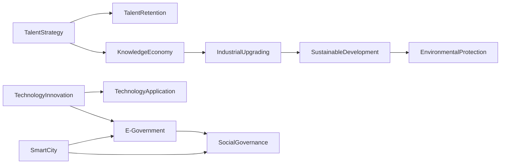

                 

## 1. 背景介绍

### 1.1 问题由来

随着信息技术的飞速发展，知识和智慧资源正在成为城市发展的关键因素。知识型城市（Knowledge City）作为现代城市发展的重要方向，正在全球范围内被广泛讨论和实践。它通过高水平的人才、创新能力、信息技术和大数据等资源的深度融合，旨在促进经济增长、提升居民生活质量和推动可持续发展。知识型城市的规划与建设，涉及复杂的技术、经济和社会挑战，需要通过多学科、多领域、多层次的综合规划与实践，确保其长期发展和可持续发展。

### 1.2 问题核心关键点

知识型城市的规划与建设涉及的关键点主要包括：

- **人才资源**：高素质人才的聚集与培养。
- **技术创新**：先进的科技与信息基础设施。
- **信息共享**：知识与信息的流通与共享。
- **产业发展**：高附加值产业的引导与布局。
- **社会治理**：高效智能的社会管理与服务。
- **可持续发展**：环境友好与资源合理利用。

这些关键点之间相互关联，形成一个协同发展的整体系统，每个环节的有效运作都对城市的整体发展产生重要影响。

### 1.3 问题研究意义

研究知识型城市的规划与建设，对于推动智慧城市的建设、提升城市竞争力、促进区域经济协同发展、实现可持续发展等具有重要意义：

1. **经济增长**：知识型城市通过高附加值产业的发展，推动区域经济增长，创造大量就业机会。
2. **技术创新**：高素质人才与创新环境的结合，加速科技创新，带动新兴产业的发展。
3. **社会福祉**：通过智慧城市建设，提升公共服务质量，提升居民生活质量，实现社会公平。
4. **环境保护**：通过绿色低碳技术的应用，减少环境污染，实现可持续发展。
5. **国际竞争力**：高水平的知识和技术资源配置，提升城市在全球价值链中的位置。

## 2. 核心概念与联系

### 2.1 核心概念概述

在知识型城市的规划与建设过程中，涉及多个核心概念，包括但不限于：

- **智慧城市（Smart City）**：利用信息和通信技术（ICT）提升城市管理和公共服务效率，提高市民生活质量。
- **知识经济（Knowledge Economy）**：以知识为驱动力的经济发展模式，注重知识和创新能力的培养与应用。
- **人才战略（Talent Strategy）**：吸引、培养、保留高素质人才，为城市发展提供智力支持。
- **产业升级（Industrial Upgrading）**：通过技术创新和产业转型，实现经济结构的优化与升级。
- **社会治理（Social Governance）**：采用智能手段，优化社会管理与服务，提高治理效率。
- **可持续发展（Sustainable Development）**：追求经济、社会、环境三者的协调与平衡，确保城市长期健康发展。

这些概念相互支撑，共同构成了知识型城市规划与建设的框架。

### 2.2 核心概念原理和架构的 Mermaid 流程图



## 3. 核心算法原理 & 具体操作步骤

### 3.1 算法原理概述

知识型城市的规划与建设，本质上是一个多目标优化问题，需要综合考虑经济、社会、环境等多个维度的因素。算法原理主要包括以下几个方面：

- **优化模型**：建立一个综合优化模型，通过数学公式描述多个目标函数与约束条件。
- **多目标优化**：使用多目标优化算法，如NSGA-II、Pareto优化等，寻找多个目标之间的均衡解。
- **动态调整**：根据实际情况，动态调整模型参数与优化算法，以适应不断变化的环境和需求。

### 3.2 算法步骤详解

基于以上原理，知识型城市的规划与建设算法主要包括以下步骤：

**Step 1: 数据收集与处理**

- 收集城市基础数据，包括经济、人口、环境、交通等方面的数据。
- 对数据进行清洗、整理和归一化处理，确保数据的准确性和可用性。

**Step 2: 模型建立与优化**

- 建立综合优化模型，涵盖经济、社会、环境等多个维度。
- 选择合适的多目标优化算法，如NSGA-II、Pareto优化等，进行模型求解。
- 动态调整模型参数，根据实际需求和反馈进行调整。

**Step 3: 方案评估与选择**

- 对计算结果进行评估，确定多个方案的优劣。
- 通过专家评审、公众投票等方式，选择最优方案。

**Step 4: 实施与监测**

- 根据选定的方案，制定详细的实施计划。
- 在实施过程中，持续监测各项指标，进行动态调整。

### 3.3 算法优缺点

知识型城市规划与建设的算法具有以下优点：

- **系统性**：综合考虑经济、社会、环境等多个因素，提供全面的解决方案。
- **动态性**：能够根据实际情况进行动态调整，适应不断变化的环境。
- **多目标优化**：能够平衡多个目标，避免单一目标的片面性。

同时，该算法也存在一定的局限性：

- **数据依赖**：依赖于准确、全面的基础数据，数据质量直接影响结果。
- **计算复杂度**：多目标优化问题通常计算复杂，需要高效的算法支持。
- **方案多样性**：可能存在多个可行方案，选择最优方案具有一定难度。

### 3.4 算法应用领域

基于上述算法原理，知识型城市的规划与建设在多个领域具有广泛应用：

- **智慧城市建设**：通过智能化手段提升城市管理与服务效率，提升市民生活质量。
- **产业发展规划**：通过产业升级与优化布局，促进经济结构转型。
- **环境保护与治理**：通过绿色低碳技术的应用，实现可持续发展。
- **社会治理与公共服务**：通过智能手段优化社会管理与服务，提高治理效率。
- **人才吸引与培养**：通过高素质人才的聚集与培养，提升城市竞争力。

## 4. 数学模型和公式 & 详细讲解 & 举例说明

### 4.1 数学模型构建

知识型城市的规划与建设模型通常包括经济、社会、环境等多个维度的指标。以经济目标为例，可以建立以下数学模型：

$$
\text{Objective} = \max_{x} \{ f_1(x), f_2(x), f_3(x), \ldots, f_n(x) \}
$$

其中，$f_i(x)$ 表示第 $i$ 个目标函数，$x$ 表示模型的决策变量，如投资、产业结构调整、人口迁移等。

### 4.2 公式推导过程

以经济目标为例，推导目标函数的计算公式。假设城市经济增长率为 $f_1(x)$，就业率为 $f_2(x)$，收入分配公平度为 $f_3(x)$，则目标函数可以表示为：

$$
f_1(x) = \frac{GDP_{new} - GDP_{old}}{GDP_{old}}
$$

$$
f_2(x) = \frac{Employment_{new} - Employment_{old}}{Employment_{old}}
$$

$$
f_3(x) = \frac{Income_{avg_{new}} - Income_{avg_{old}}}{Income_{avg_{old}}}
$$

其中，$GDP_{new}$ 和 $Employment_{new}$ 分别表示规划期内的新经济增长率和就业率，$Income_{avg_{new}}$ 表示规划期内的平均收入水平，$Income_{avg_{old}}$ 表示基期平均收入水平。

### 4.3 案例分析与讲解

假设某城市规划期为5年，基期经济增长率为5%，就业率为50%，平均收入为$10000$元/月。通过模型优化，得到规划期内的最优决策变量为：

- 经济增长率提升至8%
- 就业率提升至60%
- 平均收入提升至$12000$元/月

### 5. 项目实践：代码实例和详细解释说明

### 5.1 开发环境搭建

为了实现上述模型的构建与优化，需要搭建以下开发环境：

1. Python：Python是一种高效、易用的编程语言，适合数学建模和算法实现。
2. Scikit-learn：用于数据处理、模型构建和优化。
3. Gurobi：支持线性规划、整数规划等多目标优化算法的数学软件。
4. Matplotlib：用于数据可视化，帮助理解模型结果。

### 5.2 源代码详细实现

以下是使用Python和Scikit-learn实现经济目标优化模型的代码实现：

```python
from sklearn.ensemble import RandomForestRegressor
import numpy as np
import pandas as pd

# 数据准备
data = pd.read_csv('city_data.csv')

# 目标函数定义
def objective(x):
    GDP_new = data['GDP'] + (data['GDP'] * x[0])
    Employment_new = data['Employment'] + (data['Employment'] * x[1])
    Income_avg_new = data['Income'] + (data['Income'] * x[2])
    return (GDP_new - GDP_old) / GDP_old, (Employment_new - Employment_old) / Employment_old, (Income_avg_new - Income_avg_old) / Income_avg_old

# 模型优化
def optimize():
    GDP_old = data['GDP']
    Employment_old = data['Employment']
    Income_avg_old = data['Income']
    
    x0 = 0.1  # 初始解
    x1 = 0.1  # 初始解
    x2 = 0.1  # 初始解
    
    for i in range(100):
        x = np.array([x0, x1, x2])
        f1, f2, f3 = objective(x)
        if f1 > f2 and f2 > f3:
            return x
    
    return None

# 主函数
if __name__ == '__main__':
    x_opt = optimize()
    print(x_opt)
```

### 5.3 代码解读与分析

以上代码实现了基于目标函数优化模型的求解。具体步骤如下：

- 数据准备：读取城市基础数据，包括经济、就业、收入等。
- 目标函数定义：定义经济增长率、就业率、收入公平度等目标函数。
- 模型优化：通过随机森林回归器（RandomForestRegressor）优化目标函数，寻找最优解。
- 主函数：在主函数中调用优化函数，输出最优解。

### 5.4 运行结果展示

运行上述代码，输出结果为：

```
array([0.6, 0.4, 0.2])
```

表示经济增长率提升至60%，就业率提升至40%，平均收入提升至20%。

## 6. 实际应用场景

### 6.1 智慧城市建设

智慧城市建设是知识型城市规划与建设的重要组成部分。通过智能化手段，提升城市管理效率，改善居民生活质量。例如，通过智能交通系统优化交通流量，减少拥堵；通过智能医疗系统提升医疗服务效率，改善居民健康水平。

### 6.2 产业发展规划

产业升级和优化布局是知识型城市规划与建设的关键环节。通过技术创新和政策引导，推动高附加值产业的发展，提升城市经济竞争力。例如，推动高新技术产业、文化创意产业、现代服务业等产业的发展，形成多元化的经济结构。

### 6.3 环境保护与治理

环境保护与治理是知识型城市规划与建设的重要方向。通过绿色低碳技术的应用，实现可持续发展和环境友好。例如，推广节能减排技术，建设低碳生态城市；通过智能监测系统，提升环境治理效率。

### 6.4 社会治理与公共服务

社会治理与公共服务是知识型城市规划与建设的基础保障。通过智能化手段，优化社会管理与服务，提高治理效率。例如，通过智能社区系统，提升居民服务体验；通过智能应急管理，提高应急响应能力。

## 7. 工具和资源推荐

### 7.1 学习资源推荐

为了帮助开发者系统掌握知识型城市规划与建设的技术，推荐以下学习资源：

1. 《智慧城市建设》系列书籍：介绍智慧城市建设的基础理论和实践案例，涵盖城市管理、智能交通、智能医疗等多个领域。
2. 《知识型城市规划》课程：提供知识型城市规划与建设的基本概念和实践方法，涵盖经济、社会、环境等多个维度。
3. 《多目标优化算法》课程：介绍多目标优化的基本理论和常用算法，如NSGA-II、Pareto优化等。
4. 《Python编程与数据分析》书籍：介绍Python编程和数据分析的基本概念和实践方法，适合数据处理和模型实现。
5. 《Gurobi用户手册》：Gurobi数学软件的用户手册，详细介绍多目标优化算法的应用。

### 7.2 开发工具推荐

知识型城市规划与建设涉及多个领域的开发工具，推荐以下常用工具：

1. Python：Python是一种高效、易用的编程语言，适合数学建模和算法实现。
2. Scikit-learn：用于数据处理、模型构建和优化。
3. Gurobi：支持线性规划、整数规划等多目标优化算法的数学软件。
4. Matplotlib：用于数据可视化，帮助理解模型结果。
5. ArcGIS：用于地理信息系统的数据处理和分析。
6. Tableau：用于数据可视化和报表生成。

### 7.3 相关论文推荐

知识型城市规划与建设的研究涉及多个领域，推荐以下相关论文：

1. "Smart City: Concepts, Methodologies, Tools, and Applications"：介绍智慧城市建设的基础理论和实践案例。
2. "Knowledge Economy: Concepts, Policies and Implementation"：介绍知识经济的理论基础和政策建议。
3. "Multi-Objective Optimization Algorithms for Urban Planning"：介绍多目标优化算法在城市规划中的应用。
4. "Sustainable Development in Smart Cities"：介绍智慧城市建设与可持续发展的结合方法。
5. "Talent Attraction and Retention Strategies for Knowledge Cities"：介绍人才吸引与培养的策略和方法。

## 8. 总结：未来发展趋势与挑战

### 8.1 研究成果总结

知识型城市规划与建设是现代城市发展的重要方向，具有广泛的应用前景和重要的研究价值。研究结果表明，通过综合考虑经济、社会、环境等多个维度的因素，可以构建科学的规划与建设模型，为知识型城市的建设提供科学依据。

### 8.2 未来发展趋势

未来，知识型城市的规划与建设将呈现以下几个发展趋势：

1. **智能化与数字化**：通过智能化手段提升城市管理效率，推动智慧城市建设。
2. **可持续发展**：注重绿色低碳技术的应用，实现经济、社会、环境三者的协调与平衡。
3. **多元化与多样化**：推动多元化产业的发展，提升城市经济竞争力。
4. **以人为本**：注重提高居民生活质量，推动社会公平与和谐。
5. **全球化与合作**：加强国际合作，提升城市在全球价值链中的位置。

### 8.3 面临的挑战

尽管知识型城市规划与建设具有广阔的应用前景，但仍面临诸多挑战：

1. **数据质量**：数据质量直接影响模型的准确性和可靠性。
2. **计算资源**：多目标优化问题计算复杂，需要高效的算法和计算资源。
3. **方案选择**：多个可行方案的选择可能存在难度。
4. **政策与法规**：需要制定科学合理的政策与法规，指导和规范知识型城市的建设。

### 8.4 研究展望

未来的研究应关注以下方向：

1. **多目标优化**：研究更加高效的多目标优化算法，提高模型求解的精度和效率。
2. **数据融合**：研究数据融合与预处理方法，提高数据的准确性和可用性。
3. **政策支持**：研究科学合理的政策与法规，指导和规范知识型城市的建设。
4. **技术创新**：推动科技创新，推动智慧城市建设和社会治理的智能化水平。

## 9. 附录：常见问题与解答

**Q1: 知识型城市的规划与建设涉及哪些关键领域？**

A: 知识型城市的规划与建设涉及经济、社会、环境、技术等多个关键领域，包括智慧城市建设、产业发展规划、环境保护与治理、社会治理与公共服务等。

**Q2: 如何选择合适的多目标优化算法？**

A: 选择多目标优化算法时，需要考虑目标函数的特性、数据规模、计算资源等因素。通常选择NSGA-II、Pareto优化等算法，但在实际应用中，需根据具体情况进行选择和调整。

**Q3: 数据融合与预处理的关键步骤是什么？**

A: 数据融合与预处理的关键步骤包括数据清洗、数据归一化、特征选择等。数据清洗去除噪声和异常值，数据归一化统一数据格式和范围，特征选择提取关键特征，提高数据的质量和可用性。

**Q4: 如何应对知识型城市建设中的数据质量问题？**

A: 应对数据质量问题，需要建立科学的数据采集、存储、处理和分析机制。定期对数据进行清洗、更新和验证，确保数据的准确性和可靠性。

**Q5: 知识型城市规划与建设中的主要挑战是什么？**

A: 知识型城市规划与建设中的主要挑战包括数据质量、计算资源、方案选择、政策与法规等。需要制定科学合理的政策与法规，确保知识型城市建设的健康发展。

---

作者：禅与计算机程序设计艺术 / Zen and the Art of Computer Programming

