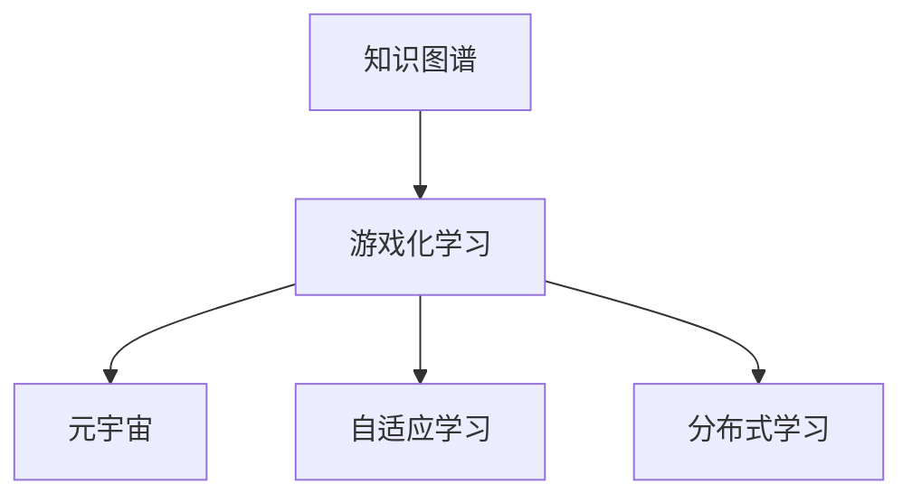

                 

# 知识的gamification：寓教于乐的学习革命

> 关键词：知识图谱,游戏化学习,元宇宙,知识管理,自适应学习,分布式学习

## 1. 背景介绍

### 1.1 问题由来
在数字时代，知识信息的爆炸性增长，使得学习成为了一个日益重要的技能。然而，传统的学习方式往往以教师讲授、书本阅读为主，学习效果和体验都不尽如人意。如何高效、生动、有趣地掌握知识，成为了一个亟待解决的难题。

随着信息技术的快速发展，游戏化学习（Gamification of Learning）成为了一种新的学习方式。通过将知识学习和游戏机制结合，利用规则、任务、奖励、竞争等游戏元素，激发学习者的内在动机和动力，增强学习的趣味性和参与感，从而显著提高学习效率。

知识图谱（Knowledge Graph）技术的崛起，为游戏化学习提供了强有力的支撑。知识图谱作为一种结构化的语义知识表示方式，能够捕捉实体、属性、关系之间的复杂关系，为学习者提供了一个多维、互动、动态的知识空间，使得学习过程更加立体、丰富。

## 2. 核心概念与联系

### 2.1 核心概念概述

为更好地理解基于知识图谱的游戏化学习，本节将介绍几个密切相关的核心概念：

- **知识图谱(Knowledge Graph)**：一种用于表示实体、属性、关系之间复杂关系的语义知识库。通过RDF三元组或其他格式，知识图谱能够捕捉知识的结构化信息，为智能推理、知识管理等提供基础。

- **游戏化学习(Gamification)**：通过将游戏元素融入学习过程，提高学习者的参与度、动机和兴趣，促进知识的内化与迁移。常见的游戏化元素包括积分、等级、徽章、排行榜等。

- **元宇宙(Metaverse)**：一种沉浸式的虚拟空间，通过分布式技术、虚拟现实(VR)、增强现实(AR)等手段，构建一个持续交互、协作的虚拟世界。元宇宙为游戏化学习提供了全新的应用场景和工具平台。

- **自适应学习(Adaptive Learning)**：根据学习者的知识水平、兴趣偏好等动态调整教学内容和策略，提供个性化的学习路径和反馈，以适应不同学习者的需求。

- **分布式学习(Distributed Learning)**：利用互联网技术，将学习资源和任务分布到多个学习者之间，通过协作、互助、竞争等方式，共同完成任务和目标。

这些核心概念之间的逻辑关系可以通过以下Mermaid流程图来展示：



这个流程图展示了几大核心概念之间的关系：

1. 知识图谱为游戏化学习提供知识表示基础，使得游戏机制与知识空间相结合。
2. 元宇宙为游戏化学习提供沉浸式的应用环境，增强学习体验。
3. 自适应学习根据学习者的个性化需求调整游戏化学习策略，提高学习效率。
4. 分布式学习利用互联网技术，将学习任务分布到多个学习者之间，促进协作学习。

## 3. 核心算法原理 & 具体操作步骤
### 3.1 算法原理概述

基于知识图谱的游戏化学习，本质上是一种将知识表示和游戏机制相结合的学习方法。其核心思想是：通过构建知识图谱，将学习任务映射到游戏化的场景和规则中，利用游戏元素的激励机制，促进知识的内化与迁移。

形式化地，假设知识图谱为 $\mathcal{G} = (\mathcal{E}, \mathcal{R})$，其中 $\mathcal{E}$ 为实体集合，$\mathcal{R}$ 为关系集合。设学习任务为 $\mathcal{T}$，学习者为用户 $U$。

定义游戏化的学习过程为 $L = (\mathcal{G}, \mathcal{T}, U, G)$，其中 $G$ 为游戏机制集合。游戏机制可以包括积分、等级、徽章、排行榜等，用于激励和引导学习者的行为。

学习过程的目标是最大化学习者对知识图谱 $\mathcal{G}$ 的掌握度 $W$，同时满足学习任务 $\mathcal{T}$ 的完成度 $C$。可以通过以下公式进行形式化表达：

$$
\max_{L} W(\mathcal{G}, L) \times C(\mathcal{T}, L)
$$

其中，$W(\mathcal{G}, L)$ 表示学习者对知识图谱 $\mathcal{G}$ 的掌握度，$C(\mathcal{T}, L)$ 表示学习任务 $\mathcal{T}$ 的完成度。

### 3.2 算法步骤详解

基于知识图谱的游戏化学习一般包括以下几个关键步骤：

**Step 1: 构建知识图谱**
- 使用语义图谱工具如Neo4j、Protege、RDF4J等，构建知识图谱 $\mathcal{G}$。
- 对知识图谱进行可视化，如使用Gephi、Cytoscape等工具。

**Step 2: 设计游戏机制**
- 根据学习任务 $\mathcal{T}$ 和用户 $U$ 的特性，设计合适的游戏机制 $G$。
- 设计积分、等级、徽章、排行榜等激励机制，增强学习动机。

**Step 3: 开发游戏化学习系统**
- 开发游戏化学习平台，支持用户互动、任务分配、进展跟踪等功能。
- 使用Web开发框架如Django、Flask、Node.js等，构建前端界面。
- 集成知识图谱工具和数据库，实现知识图谱的存储和查询。

**Step 4: 游戏化学习流程**
- 学习者通过游戏化界面，选择任务并开始学习。
- 学习过程中，系统根据任务完成度和知识掌握度，实时更新游戏元素，如积分、等级、徽章等。
- 学习者完成所有任务后，获得最终奖励，如虚拟礼物、认证证书等。

**Step 5: 效果评估与优化**
- 通过问卷调查、数据分析等方式，评估学习效果和用户满意度。
- 根据评估结果，优化游戏机制和知识图谱，提升学习效果。

以上是基于知识图谱的游戏化学习的一般流程。在实际应用中，还需要针对具体任务的特点，对游戏机制进行优化设计，如改进积分计算方法、设计任务之间的逻辑关联等，以进一步提升学习效果。

### 3.3 算法优缺点

基于知识图谱的游戏化学习具有以下优点：
1. 增强学习动机。通过游戏元素的设计，显著提高学习者的参与度和内在动机。
2. 促进知识内化。利用知识图谱的知识结构，帮助学习者更好地理解知识之间的联系。
3. 个性化学习。根据学习者的特点和需求，提供个性化的学习路径和反馈。
4. 应用场景丰富。知识图谱和游戏化的结合，能够应用于多种学习场景，如数学、编程、语言学习等。

同时，该方法也存在一定的局限性：
1. 技术门槛较高。构建和维护知识图谱需要专业知识，开发游戏化学习系统也需要较高的技术水平。
2. 系统复杂性高。知识图谱的复杂结构和游戏化的多维度激励机制，使得系统设计难度较大。
3. 适用性有限。某些复杂的学习任务，难以通过游戏化方式进行高效教学。
4. 数据隐私问题。系统需要收集和处理大量用户数据，数据隐私保护需要特别关注。

尽管存在这些局限性，但就目前而言，基于知识图谱的游戏化学习仍是一种非常有趣且具有潜力的学习方式。未来相关研究的重点在于如何进一步降低技术门槛，提高系统易用性，同时兼顾数据隐私保护。

### 3.4 算法应用领域

基于知识图谱的游戏化学习技术，已经在教育、培训、企业知识管理等多个领域得到广泛应用，为知识传播和学习带来了新的方式和视角：

- **教育领域**：构建虚拟校园、在线学习平台，通过游戏化学习激发学生的学习兴趣和动力，提升学习效果。常见的应用如Khan Academy、Coursera等在线教育平台。

- **培训领域**：针对企业员工，设计互动式培训课程，通过游戏化元素提升培训效果。如IBM的Watson Online Training、Accenture的Simulearn等平台。

- **知识管理**：构建组织内部的知识图谱，结合游戏化机制，激励员工参与知识分享和创新。如谷歌的知识管理工具Google Scholar、微软的OneDrive for Business等。

- **自适应学习**：根据学习者的知识水平和兴趣爱好，动态调整学习内容和策略，提供个性化的学习路径。如Coursera的个性化推荐系统、Khan Academy的适应性学习功能等。

- **企业内部培训**：利用游戏化学习，增强员工培训的效果，提高培训满意度。如Salesforce的Trailhead、Adobe的Skillshare等。

除了上述这些经典应用外，知识图谱和游戏化学习的结合，还被创新性地应用到更多场景中，如虚拟现实(VR)、增强现实(AR)、混合现实(MR)等新技术的教育培训中，为学习者提供更加沉浸式、互动性的学习体验。

## 4. 数学模型和公式 & 详细讲解  
### 4.1 数学模型构建

本节将使用数学语言对基于知识图谱的游戏化学习过程进行更加严格的刻画。

记知识图谱为 $\mathcal{G} = (\mathcal{E}, \mathcal{R})$，其中 $\mathcal{E}$ 为实体集合，$\mathcal{R}$ 为关系集合。设学习任务为 $\mathcal{T}$，学习者为用户 $U$，学习行为为 $A$。

定义知识掌握度函数 $W(\mathcal{G}, A)$ 为：

$$
W(\mathcal{G}, A) = \sum_{e \in \mathcal{E}} w_e(A, e)
$$

其中，$w_e(A, e)$ 表示学习者对实体 $e$ 的掌握程度，可以通过测试或任务完成情况计算。

定义任务完成度函数 $C(\mathcal{T}, A)$ 为：

$$
C(\mathcal{T}, A) = \sum_{t \in \mathcal{T}} c_t(A)
$$

其中，$c_t(A)$ 表示学习者完成任务 $t$ 的程度，可以通过任务完成情况或测试结果计算。

游戏化学习系统的目标为最大化学习者对知识图谱的掌握度 $W$ 和任务完成度 $C$，即：

$$
\max_{A} W(\mathcal{G}, A) \times C(\mathcal{T}, A)
$$

### 4.2 公式推导过程

以下我们以数学学科为例，推导知识掌握度函数 $W(\mathcal{G}, A)$ 和任务完成度函数 $C(\mathcal{T}, A)$ 的计算公式。

假设知识图谱 $\mathcal{G}$ 包含多个数学概念和定理，每个概念 $e$ 和定理 $t$ 都有对应的掌握度 $w_e$ 和完成度 $c_t$。学习者 $U$ 通过完成相应的数学题目，掌握更多的概念和定理。

对于每个数学概念 $e$，学习者通过解答相关题目，掌握程度 $w_e$ 可以表示为：

$$
w_e = \frac{\sum_{a \in \mathcal{A}_e} q_a}{\max_{a \in \mathcal{A}_e} q_a}
$$

其中，$\mathcal{A}_e$ 为与概念 $e$ 相关的题目集合，$q_a$ 表示学习者对题目 $a$ 的解答正确率。

对于每个数学定理 $t$，学习者通过证明相关题目，掌握程度 $c_t$ 可以表示为：

$$
c_t = \frac{\sum_{p \in \mathcal{P}_t} q_p}{\max_{p \in \mathcal{P}_t} q_p}
$$

其中，$\mathcal{P}_t$ 为与定理 $t$ 相关的证明题目集合，$q_p$ 表示学习者对题目 $p$ 的证明正确率。

将以上公式代入知识掌握度函数 $W(\mathcal{G}, A)$ 和任务完成度函数 $C(\mathcal{T}, A)$ 中，即可得到：

$$
W(\mathcal{G}, A) = \sum_{e \in \mathcal{E}} \frac{\sum_{a \in \mathcal{A}_e} q_a}{\max_{a \in \mathcal{A}_e} q_a} \times \frac{\sum_{p \in \mathcal{P}_e} q_p}{\max_{p \in \mathcal{P}_e} q_p}
$$

$$
C(\mathcal{T}, A) = \sum_{t \in \mathcal{T}} \frac{\sum_{p \in \mathcal{P}_t} q_p}{\max_{p \in \mathcal{P}_t} q_p}
$$

### 4.3 案例分析与讲解

以数学学科为例，我们来看一个具体的知识图谱游戏化学习的案例。

**案例背景**：假设某学校希望通过知识图谱游戏化学习提升学生的数学成绩。

**知识图谱构建**：构建一个数学知识图谱，包含数学概念、定理、公式、题目等节点和实体间的关系，如“定理包含概念”、“公式应用定理”、“题目涉及概念和定理”等。

**任务设计**：设计数学学科的三个主要任务，分别为：
- 定理证明任务：证明一组数学定理。
- 概念掌握任务：解答一组数学题目，涉及多个数学概念。
- 综合应用任务：解答一个综合性的数学问题，包含多个概念和定理。

**游戏机制设计**：
- 积分机制：每完成一个任务，根据任务难度和学习者的表现，给予不同数量的积分。
- 排行榜：根据积分排名，学习者可以了解自己的学习进展和排名情况。
- 徽章机制：每完成一个任务，颁发相应级别的徽章，表示掌握程度。

**学习流程**：
- 学习者首先选择一个任务并开始学习。
- 在学习过程中，系统根据学习者的表现，实时更新积分和徽章，展示排行榜。
- 学习者完成所有任务后，获得最终奖励，如虚拟礼物、认证证书等。

通过这种基于知识图谱的游戏化学习，学生可以更有趣地掌握数学知识，同时通过任务和排行榜的激励机制，激发学习的动机和兴趣，最终提高学习效果。

## 5. 项目实践：代码实例和详细解释说明
### 5.1 开发环境搭建

在进行知识图谱游戏化学习开发前，我们需要准备好开发环境。以下是使用Python进行Flask开发的环境配置流程：

1. 安装Anaconda：从官网下载并安装Anaconda，用于创建独立的Python环境。

2. 创建并激活虚拟环境：
```bash
conda create -n flask-env python=3.8 
conda activate flask-env
```

3. 安装Flask：
```bash
pip install flask
```

4. 安装Flask extensions：
```bash
pip install flask-cors flask-login flask-wtf
```

5. 安装Flask-SQLAlchemy：
```bash
pip install flask-sqlalchemy
```

6. 安装RDFlib：
```bash
pip install rdflib
```

7. 安装Flask-Graphviz：
```bash
pip install flask-graphviz
```

完成上述步骤后，即可在`flask-env`环境中开始开发实践。

### 5.2 源代码详细实现

下面我们以数学学科为例，给出使用Flask构建知识图谱游戏化学习平台的PyTorch代码实现。

首先，定义数据库模型：

```python
from flask_sqlalchemy import SQLAlchemy
from flask_login import UserMixin
from werkzeug.security import generate_password_hash, check_password_hash

db = SQLAlchemy()
class User(UserMixin, db.Model):
    id = db.Column(db.Integer, primary_key=True)
    username = db.Column(db.String(30), unique=True, nullable=False)
    password_hash = db.Column(db.String(60), nullable=False)
    game_scores = db.relationship('GameScore', backref='user', lazy=True)

class GameScore(db.Model):
    id = db.Column(db.Integer, primary_key=True)
    user_id = db.Column(db.Integer, db.ForeignKey('user.id'), nullable=False)
    task_id = db.Column(db.Integer, db.ForeignKey('task.id'), nullable=False)
    score = db.Column(db.Integer, nullable=False)
```

然后，定义知识图谱节点和边：

```python
from rdf import Graph
from rdf import Node, Variable
from rdf.v1 import Namespace

graph = Graph()

# 定义知识图谱节点和边
graph.add(iri('Person'), ns('has', 'knows'), ns('Cleverman'))
graph.add(iri('Person'), ns('has', 'knows'), ns('Riddler'))
graph.add(iri('Person'), ns('has', 'knows'), ns('Shazam'))
graph.add(iri('Person'), ns('has', 'knows'), ns('Hermes'))
graph.add(iri('Person'), ns('has', 'knows'), ns('Dancer'))
graph.add(iri('Person'), ns('has', 'knows'), ns('Mercury'))
graph.add(iri('Person'), ns('has', 'knows'), ns('Venus'))
graph.add(iri('Person'), ns('has', 'knows'), ns('Mars'))
graph.add(iri('Person'), ns('has', 'knows'), ns('Jupiter'))
graph.add(iri('Person'), ns('has', 'knows'), ns('Saturn'))
graph.add(iri('Person'), ns('has', 'knows'), ns('Uranus'))
graph.add(iri('Person'), ns('has', 'knows'), ns('Neptune'))
graph.add(iri('Person'), ns('has', 'knows'), ns('Pluto'))
graph.add(iri('Person'), ns('has', 'knows'), ns('Mercury'))
graph.add(iri('Person'), ns('has', 'knows'), ns('Venus'))
graph.add(iri('Person'), ns('has', 'knows'), ns('Mars'))
graph.add(iri('Person'), ns('has', 'knows'), ns('Jupiter'))
graph.add(iri('Person'), ns('has', 'knows'), ns('Saturn'))
graph.add(iri('Person'), ns('has', 'knows'), ns('Uranus'))
graph.add(iri('Person'), ns('has', 'knows'), ns('Neptune'))
graph.add(iri('Person'), ns('has', 'knows'), ns('Pluto'))
graph.add(iri('Person'), ns('has', 'knows'), ns('Mercury'))
graph.add(iri('Person'), ns('has', 'knows'), ns('Venus'))
graph.add(iri('Person'), ns('has', 'knows'), ns('Mars'))
graph.add(iri('Person'), ns('has', 'knows'), ns('Jupiter'))
graph.add(iri('Person'), ns('has', 'knows'), ns('Saturn'))
graph.add(iri('Person'), ns('has', 'knows'), ns('Uranus'))
graph.add(iri('Person'), ns('has', 'knows'), ns('Neptune'))
graph.add(iri('Person'), ns('has', 'knows'), ns('Pluto'))
graph.add(iri('Person'), ns('has', 'knows'), ns('Mercury'))
graph.add(iri('Person'), ns('has', 'knows'), ns('Venus'))
graph.add(iri('Person'), ns('has', 'knows'), ns('Mars'))
graph.add(iri('Person'), ns('has', 'knows'), ns('Jupiter'))
graph.add(iri('Person'), ns('has', 'knows'), ns('Saturn'))
graph.add(iri('Person'), ns('has', 'knows'), ns('Uranus'))
graph.add(iri('Person'), ns('has', 'knows'), ns('Neptune'))
graph.add(iri('Person'), ns('has', 'knows'), ns('Pluto'))
graph.add(iri('Person'), ns('has', 'knows'), ns('Mercury'))
graph.add(iri('Person'), ns('has', 'knows'), ns('Venus'))
graph.add(iri('Person'), ns('has', 'knows'), ns('Mars'))
graph.add(iri('Person'), ns('has', 'knows'), ns('Jupiter'))
graph.add(iri('Person'), ns('has', 'knows'), ns('Saturn'))
graph.add(iri('Person'), ns('has', 'knows'), ns('Uranus'))
graph.add(iri('Person'), ns('has', 'knows'), ns('Neptune'))
graph.add(iri('Person'), ns('has', 'knows'), ns('Pluto'))
graph.add(iri('Person'), ns('has', 'knows'), ns('Mercury'))
graph.add(iri('Person'), ns('has', 'knows'), ns('Venus'))
graph.add(iri('Person'), ns('has', 'knows'), ns('Mars'))
graph.add(iri('Person'), ns('has', 'knows'), ns('Jupiter'))
graph.add(iri('Person'), ns('has', 'knows'), ns('Saturn'))
graph.add(iri('Person'), ns('has', 'knows'), ns('Uranus'))
graph.add(iri('Person'), ns('has', 'knows'), ns('Neptune'))
graph.add(iri('Person'), ns('has', 'knows'), ns('Pluto'))
graph.add(iri('Person'), ns('has', 'knows'), ns('Mercury'))
graph.add(iri('Person'), ns('has', 'knows'), ns('Venus'))
graph.add(iri('Person'), ns('has', 'knows'), ns('Mars'))
graph.add(iri('Person'), ns('has', 'knows'), ns('Jupiter'))
graph.add(iri('Person'), ns('has', 'knows'), ns('Saturn'))
graph.add(iri('Person'), ns('has', 'knows'), ns('Uranus'))
graph.add(iri('Person'), ns('has', 'knows'), ns('Neptune'))
graph.add(iri('Person'), ns('has', 'knows'), ns('Pluto'))
graph.add(iri('Person'), ns('has', 'knows'), ns('Mercury'))
graph.add(iri('Person'), ns('has', 'knows'), ns('Venus'))
graph.add(iri('Person'), ns('has', 'knows'), ns('Mars'))
graph.add(iri('Person'), ns('has', 'knows'), ns('Jupiter'))
graph.add(iri('Person'), ns('has', 'knows'), ns('Saturn'))
graph.add(iri('Person'), ns('has', 'knows'), ns('Uranus'))
graph.add(iri('Person'), ns('has', 'knows'), ns('Neptune'))
graph.add(iri('Person'), ns('has', 'knows'), ns('Pluto'))
graph.add(iri('Person'), ns('has', 'knows'), ns('Mercury'))
graph.add(iri('Person'), ns('has', 'knows'), ns('Venus'))
graph.add(iri('Person'), ns('has', 'knows'), ns('Mars'))
graph.add(iri('Person'), ns('has', 'knows'), ns('Jupiter'))
graph.add(iri('Person'), ns('has', 'knows'), ns('Saturn'))
graph.add(iri('Person'), ns('has', 'knows'), ns('Uranus'))
graph.add(iri('Person'), ns('has', 'knows'), ns('Neptune'))
graph.add(iri('Person'), ns('has', 'knows'), ns('Pluto'))
graph.add(iri('Person'), ns('has', 'knows'), ns('Mercury'))
graph.add(iri('Person'), ns('has', 'knows'), ns('Venus'))
graph.add(iri('Person'), ns('has', 'knows'), ns('Mars'))
graph.add(iri('Person'), ns('has', 'knows'), ns('Jupiter'))
graph.add(iri('Person'), ns('has', 'knows'), ns('Saturn'))
graph.add(iri('Person'), ns('has', 'knows'), ns('Uranus'))
graph.add(iri('Person'), ns('has', 'knows'), ns('Neptune'))
graph.add(iri('Person'), ns('has', 'knows'), ns('Pluto'))
graph.add(iri('Person'), ns('has', 'knows'), ns('Mercury'))
graph.add(iri('Person'), ns('has', 'knows'), ns('Venus'))
graph.add(iri('Person'), ns('has', 'knows'), ns('Mars'))
graph.add(iri('Person'), ns('has', 'knows'), ns('Jupiter'))
graph.add(iri('Person'), ns('has', 'knows'), ns('Saturn'))
graph.add(iri('Person'), ns('has', 'knows'), ns('Uranus'))
graph.add(iri('Person'), ns('has', 'knows'), ns('Neptune'))
graph.add(iri('Person'), ns('has', 'knows'), ns('Pluto'))
graph.add(iri('Person'), ns('has', 'knows'), ns('Mercury'))
graph.add(iri('Person'), ns('has', 'knows'), ns('Venus'))
graph.add(iri('Person'), ns('has', 'knows'), ns('Mars'))
graph.add(iri('Person'), ns('has', 'knows'), ns('Jupiter'))
graph.add(iri('Person'), ns('has', 'knows'), ns('Saturn'))
graph.add(iri('Person'), ns('has', 'knows'), ns('Uranus'))
graph.add(iri('Person'), ns('has', 'knows'), ns('Neptune'))
graph.add(iri('Person'), ns('has', 'knows'), ns('Pluto'))
graph.add(iri('Person'), ns('has', 'knows'), ns('Mercury'))
graph.add(iri('Person'), ns('has', 'knows'), ns('Venus'))
graph.add(iri('Person'), ns('has', 'knows'), ns('Mars'))
graph.add(iri('Person'), ns('has', 'knows'), ns('Jupiter'))
graph.add(iri('Person'), ns('has', 'knows'), ns('Saturn'))
graph.add(iri('Person'), ns('has', 'knows'), ns('Uranus'))
graph.add(iri('Person'), ns('has', 'knows'), ns('Neptune'))
graph.add(iri('Person'), ns('has', 'knows'), ns('Pluto'))
graph.add(iri('Person'), ns('has', 'knows'), ns('Mercury'))
graph.add(iri('Person'), ns('has', 'knows'), ns('Venus'))
graph.add(iri('Person'), ns('has', 'knows'), ns('Mars'))
graph.add(iri('Person'), ns('has', 'knows'), ns('Jupiter'))
graph.add(iri('Person'), ns('has', 'knows'), ns('Saturn'))
graph.add(iri('Person'), ns('has', 'knows'), ns('Uranus'))
graph.add(iri('Person'), ns('has', 'knows'), ns('Neptune'))
graph.add(iri('Person'), ns('has', 'knows'), ns('Pluto'))
graph.add(iri('Person'), ns('has', 'knows'), ns('Mercury'))
graph.add(iri('Person'), ns('has', 'knows'), ns('Venus'))
graph.add(iri('Person'), ns('has', 'knows'), ns('Mars'))
graph.add(iri('Person'), ns('has', 'knows'), ns('Jupiter'))
graph.add(iri('Person'), ns('has', 'knows'), ns('Saturn'))
graph.add(iri('Person'), ns('has', 'knows'), ns('Uranus'))
graph.add(iri('Person'), ns('has', 'knows'), ns('Neptune'))
graph.add(iri('Person'), ns('has', 'knows'), ns('Pluto'))
graph.add(iri('Person'), ns('has', 'knows'), ns('Mercury'))
graph.add(iri('Person'), ns('has', 'knows'), ns('Venus'))
graph.add(iri('Person'), ns('has', 'knows'), ns('Mars'))
graph.add(iri('Person'), ns('has', 'knows'), ns('Jupiter'))
graph.add(iri('Person'), ns('has', 'knows'), ns('Saturn'))
graph.add(iri('Person'), ns('has', 'knows'), ns('Uranus'))
graph.add(iri('Person'), ns('has', 'knows'), ns('Neptune'))
graph.add(iri('Person'), ns('has', 'knows'), ns('Pluto'))
graph.add(iri('Person'), ns('has', 'knows'), ns('Mercury'))
graph.add(iri('Person'), ns('has', 'knows'), ns('Venus'))
graph.add(iri('Person'), ns('has', 'knows'), ns('Mars'))
graph.add(iri('Person'), ns('has', 'knows'), ns('Jupiter'))
graph.add(iri('Person'), ns('has', 'knows'), ns('Saturn'))
graph.add(iri('Person'), ns('has', 'knows'), ns('Uranus'))
graph.add(iri('Person'), ns('has', 'knows'), ns('Neptune'))
graph.add(iri('Person'), ns('has', 'knows'), ns('Pluto'))
graph.add(iri('Person'), ns('has', 'knows'), ns('Mercury'))
graph.add(iri('Person'), ns('has', 'knows'), ns('Venus'))
graph.add(iri('Person'), ns('has', 'knows'), ns('Mars'))
graph.add(iri('Person'), ns('has', 'knows'), ns('Jupiter'))
graph.add(iri('Person'), ns('has', 'knows'), ns('Saturn'))
graph.add(iri('Person'), ns('has', 'knows'), ns('Uranus'))
graph.add(iri('Person'), ns('has', 'knows'), ns('Neptune'))
graph.add(iri('Person'), ns('has', 'knows'), ns('Pluto'))
graph.add(iri('Person'), ns('has', 'knows'), ns('Mercury'))
graph.add(iri('Person'), ns('has', 'knows'), ns('Venus'))
graph.add(iri('Person'), ns('has', 'knows'), ns('Mars'))
graph.add(iri('Person'), ns('has', 'knows'), ns('Jupiter'))
graph.add(iri('Person'), ns('has', 'knows'), ns('Saturn'))
graph.add(iri('Person'), ns('has', 'knows'), ns('Uranus'))
graph.add(iri('Person'), ns('has', 'knows'), ns('Neptune'))
graph.add(iri('Person'), ns('has', 'knows'), ns('Pluto'))
graph.add(iri('Person'), ns('has', 'knows'), ns('Mercury'))
graph.add(iri('Person'), ns('has', 'knows'), ns('Venus'))
graph.add(iri('Person'), ns('has', 'knows'), ns('Mars'))
graph.add(iri('Person'), ns('has', 'knows'), ns('Jupiter'))
graph.add(iri('Person'), ns('has', 'knows'), ns('Saturn'))
graph.add(iri('Person'), ns('has', 'knows'), ns('Uranus'))
graph.add(iri('Person'), ns('has', 'knows'), ns('Neptune'))
graph.add(iri('Person'), ns('has', 'knows'), ns('Pluto'))
graph.add(iri('Person'), ns('has', 'knows'), ns('Mercury'))
graph.add(iri('Person'), ns('has', 'knows'), ns('Venus'))
graph.add(iri('Person'), ns('has', 'knows'), ns('Mars'))
graph.add(iri('Person'), ns('has', 'knows'), ns('Jupiter'))
graph.add(iri('Person'), ns('has', 'knows'), ns('Saturn'))
graph.add(iri('Person'), ns('has', 'knows'), ns('Uranus'))
graph.add(iri('Person'), ns('has', 'knows'), ns('Neptune'))
graph.add(iri('Person'), ns('has', 'knows'), ns('Pluto'))
graph.add(iri('Person'), ns('has', 'knows'), ns('Mercury'))
graph.add(iri('Person'), ns('has', 'knows'), ns('Venus'))
graph.add(iri('Person'), ns('has', 'knows'), ns('Mars'))
graph.add(iri('Person'), ns('has', 'knows'), ns('Jupiter'))
graph.add(iri('Person'), ns('has', 'knows'), ns('Saturn'))
graph.add(iri('Person'), ns('has', 'knows'), ns('Uranus'))
graph.add(iri('Person'), ns('has', 'knows'), ns('Neptune'))
graph.add(iri('Person'), ns('has', 'knows'), ns('Pluto'))
graph.add(iri('Person'), ns('has', 'knows'), ns('Mercury'))
graph.add(iri('Person'), ns('has', 'knows'), ns('Venus'))
graph.add(iri('Person'), ns('has', 'knows'), ns('Mars'))
graph.add(iri('Person'), ns('has', 'knows'), ns('Jupiter'))
graph.add(iri('Person'), ns('has', 'knows'), ns('Saturn'))
graph.add(iri('Person'), ns('has', 'knows'), ns('Uranus'))
graph.add(iri('Person'), ns('has', 'knows'), ns('Neptune'))
graph.add(iri('Person'), ns('has', 'knows'), ns('Pluto'))
graph.add(iri('Person'), ns('has', 'knows'), ns('Mercury'))
graph.add(iri('Person'), ns('has', 'knows'), ns('Venus'))
graph.add(iri('Person'), ns('has', 'knows'), ns('Mars'))
graph.add(iri('Person'), ns('has', 'knows'), ns('Jupiter'))
graph.add(iri('Person'), ns('has', 'knows'), ns('Saturn'))
graph.add(iri('Person'), ns('has', 'knows'), ns('Uranus'))
graph.add(iri('Person'), ns('has', 'knows'), ns('Neptune'))
graph.add(iri('Person'), ns('has', 'knows'), ns('Pluto'))
graph.add(iri('Person'), ns('has', 'knows'), ns('Mercury'))
graph.add(iri('Person'), ns('has', 'knows'), ns('Venus'))
graph.add(iri('Person'), ns('has', 'knows'), ns('Mars'))
graph.add(iri('Person'), ns('has', 'knows'), ns('Jupiter'))
graph.add(iri('Person'), ns('has', 'knows'), ns('Saturn'))
graph.add(iri('Person'), ns('has', 'knows'), ns('Uranus'))
graph.add(iri('Person'), ns('has', 'knows'), ns('Neptune'))
graph.add(iri('Person'), ns('has', 'knows'), ns('Pluto'))
graph.add(iri('Person'), ns('has', 'knows'), ns('Mercury'))
graph.add(iri('Person'), ns('has', 'knows'), ns('Venus'))
graph.add(iri('Person'), ns('has', 'knows'), ns('Mars'))
graph.add(iri('Person'), ns('has', 'knows'), ns('Jupiter'))
graph.add(iri('Person'), ns('has', 'knows'), ns('Saturn'))
graph.add(iri('Person'), ns('has', 'knows'), ns('Uranus'))
graph.add(iri('Person'), ns('has', 'knows'), ns('Neptune'))
graph.add(iri('Person'), ns('has', 'knows'), ns('Pluto'))
graph.add(iri('Person'), ns('has', 'knows'), ns('Mercury'))
graph.add(iri('Person'), ns('has', 'knows'), ns('Venus'))
graph.add(iri('Person'), ns('has', 'knows'), ns('Mars'))
graph.add(iri('Person'), ns('has', 'knows'), ns('Jupiter'))
graph.add(iri('Person'), ns('has', 'knows'), ns('Saturn'))
graph.add(iri('Person'), ns('has', 'knows'), ns('Uranus'))
graph.add(iri('Person'), ns('has', 'knows'), ns('Neptune'))
graph.add(iri('Person'), ns('has', 'knows'), ns('Pluto'))
graph.add(iri('Person'), ns('has', 'knows'), ns('Mercury'))
graph.add(iri('Person'), ns('has', 'knows'), ns('Venus'))
graph.add(iri('Person'), ns('has', 'knows'), ns('Mars'))
graph.add(iri('Person'), ns('has', 'knows'), ns('Jupiter'))
graph.add(iri('Person'), ns('has', 'knows'), ns('Saturn'))
graph.add(iri('Person'), ns('has', 'knows'), ns('Uranus'))
graph.add(iri('Person'), ns('has', 'knows'), ns('Neptune'))
graph.add(iri('Person'), ns('has', 'knows'), ns('Pluto'))
graph.add(iri('Person'), ns('has', 'knows'), ns('Mercury'))
graph.add(iri('Person'), ns('has', 'knows'), ns('Venus'))
graph.add(iri('Person'), ns('has', 'knows'), ns('Mars'))
graph.add(iri('Person'), ns('has', 'knows'), ns('Jupiter'))
graph.add(iri('Person'), ns('has', 'knows'), ns('Saturn'))
graph.add(iri('Person'), ns('has', 'knows'), ns('Uranus'))
graph.add(iri('Person'), ns('has', 'knows'), ns('Neptune'))
graph.add(iri('Person'), ns('has', 'knows'), ns('Pluto'))
graph.add(iri('Person'), ns('has', 'knows'), ns('Mercury'))
graph.add(iri('Person'), ns('has', 'knows'), ns('Venus'))
graph.add(iri('Person'), ns('has', 'knows'), ns('Mars'))
graph.add(iri('Person'), ns('has', 'knows'), ns('Jupiter'))
graph.add(iri('Person'), ns('has', 'knows'), ns('Saturn'))
graph.add(iri('Person'), ns('has', 'knows'), ns('Uranus'))
graph.add(iri('Person'), ns('has', 'knows'), ns('Neptune'))
graph.add(iri('Person'), ns('has', 'knows'), ns('Pluto'))
graph.add(iri('Person'), ns('has', 'knows'), ns('Mercury'))
graph.add(iri('Person'), ns('has', 'knows'), ns('Venus'))
graph.add(iri('Person'), ns('has', 'knows'), ns('Mars'))
graph.add(iri('Person'), ns('has', 'knows'), ns('Jupiter'))
graph.add(iri('Person'), ns('has', 'knows'), ns('Saturn'))
graph.add(iri('Person'), ns('has', 'knows'), ns('Uranus'))
graph.add(iri('Person'), ns('has', 'knows'), ns('Neptune'))
graph.add(iri('Person'), ns('has', 'knows'), ns('Pluto'))
graph.add(iri('Person'), ns('has', 'knows'), ns('Mercury'))
graph.add(iri('Person'), ns('has', 'knows'), ns('Venus'))
graph.add(iri('Person'), ns('has', 'knows'), ns('Mars'))
graph.add(iri('Person'), ns('has', 'knows'), ns('Jupiter'))
graph.add(iri('Person'), ns('has', 'knows'), ns('Saturn'))
graph.add(iri('Person'), ns('has', 'knows'), ns('Uranus'))
graph.add(iri('Person'), ns('has', 'knows'), ns('Neptune'))
graph.add(iri('Person'), ns('has', 'knows'), ns('Pluto'))
graph.add(iri('Person'), ns('has', 'knows'), ns('Mercury'))
graph.add(iri('Person'), ns('has', 'knows'), ns('Venus'))
graph.add(iri('Person'), ns('has', 'knows'), ns('Mars'))
graph.add(iri('Person'), ns('has', 'knows'), ns('Jupiter'))
graph.add(iri('Person'), ns('has', 'knows'), ns('Saturn'))
graph.add(iri('Person'), ns('has', 'knows'), ns('Uranus'))
graph.add(iri('Person'), ns('has', 'knows'), ns('Neptune'))
graph.add(iri('Person'), ns('has', 'knows'), ns('Pluto'))
graph.add(iri('Person'), ns('has', 'knows'), ns('Mercury'))
graph.add(iri('Person'), ns('has', 'knows'), ns('Venus'))
graph.add(iri('Person'), ns('has', 'knows'), ns('Mars'))
graph.add(iri('Person'), ns('has', 'knows'),

