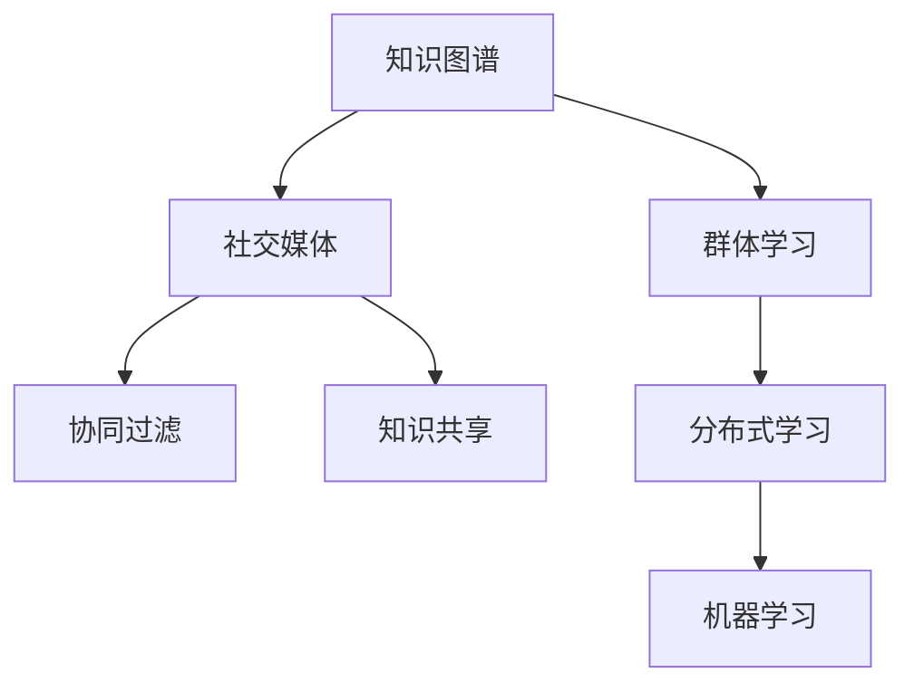

                 

# 知识的交互性：社交媒体时代的群体学习

> 关键词：知识图谱,社交媒体,群体学习,协同过滤,知识共享,分布式学习,机器学习

## 1. 背景介绍

在当今社交媒体和互联网技术的推动下，信息的流通和知识的传播已经超越了传统媒介的限制。人们越来越多地依赖社交网络、论坛、博客等平台来获取和分享信息。这不仅极大地扩展了人类获取知识的渠道，也使得知识传播的交互性和动态性得到了前所未有的提升。这种变化要求我们重新思考知识交互的方式，以及如何利用技术手段来促进知识的产生、传播和应用。本文将从社交媒体时代知识交互的特性出发，探讨群体学习的机制及其在知识共享和协同中的作用。

## 2. 核心概念与联系

### 2.1 核心概念概述

要理解社交媒体时代群体学习的机制，首先需要明确几个关键概念：

- **知识图谱**：一种用于表示实体间关系的图形结构，其中节点表示实体，边表示实体间的关系。知识图谱可以用于查询、推荐、问答等应用场景。
- **社交媒体**：以用户生成内容为核心的信息交流平台，如微博、微信、Reddit等，是知识交互的主要场所。
- **群体学习**：多个个体（或多个智能体）通过相互交互，共同学习和提高的知识获取方式。
- **协同过滤**：一种基于用户行为数据的推荐方法，通过识别相似用户群体来推测用户的偏好。
- **知识共享**：个体或团体之间有意识地分享知识的行为。
- **分布式学习**：通过互联网和协作技术，多用户共同参与的学习过程。

这些概念之间存在紧密的联系，共同构成了社交媒体时代知识交互的基础框架。

### 2.2 核心概念原理和架构的 Mermaid 流程图



这个流程图展示了知识图谱、社交媒体、群体学习、协同过滤、知识共享和分布式学习之间的关系。知识图谱是基础结构，社交媒体是主要平台，群体学习是核心机制，协同过滤和知识共享是手段，分布式学习是实现方式，机器学习是技术支持。

## 3. 核心算法原理 & 具体操作步骤

### 3.1 算法原理概述

社交媒体时代的群体学习主要依赖于用户的交互行为，包括点赞、评论、分享等。这些行为可以视为用户对知识的评价和传播，通过对这些行为的数据分析，可以挖掘出隐藏在社交网络中的知识交互模式。

该算法的基本思路是：
1. 从社交媒体平台收集用户行为数据。
2. 构建知识图谱，将用户行为映射到知识图谱中的实体和关系上。
3. 利用协同过滤算法，对用户进行知识推荐。
4. 通过分布式学习技术，使多个用户协同学习，共同提高对知识的理解和应用能力。

### 3.2 算法步骤详解

**Step 1: 数据收集与预处理**

从社交媒体平台抓取用户行为数据，并进行初步清洗和整理。数据包括用户的点赞、评论、分享等行为，以及与之关联的实体（如文章、书籍、视频）。

**Step 2: 知识图谱构建**

利用自然语言处理技术（如实体识别、关系抽取），将用户行为数据映射到知识图谱中。实体可以是用户、文章、书籍、视频等，关系可以是点赞、评论、分享等行为。

**Step 3: 协同过滤推荐**

利用协同过滤算法，如基于矩阵分解的推荐算法，对用户进行知识推荐。协同过滤算法的核心是找到与目标用户兴趣相似的用户群体，然后根据这些用户的历史行为，推测目标用户的兴趣。

**Step 4: 分布式学习**

利用分布式学习技术，将用户的学习任务分布到多个节点上，每个节点根据本地的数据和模型参数进行计算。通过不断迭代更新，提升模型对知识的理解能力。

### 3.3 算法优缺点

**优点：**
- 利用社交媒体平台的数据，可以快速获取大量的知识交互信息。
- 协同过滤算法能够捕捉用户间的相似性，提高推荐的准确性。
- 分布式学习技术可以提升模型的处理能力和收敛速度。

**缺点：**
- 数据隐私问题。用户行为数据可能包含敏感信息，需要严格保护。
- 协同过滤算法可能存在冷启动问题，即新用户的推荐效果较差。
- 分布式学习的收敛速度和收敛效果受到网络带宽和节点计算能力的限制。

### 3.4 算法应用领域

社交媒体时代的群体学习技术已经被广泛应用于以下几个领域：

- **在线教育**：利用知识图谱和分布式学习技术，提供个性化的学习推荐和知识共享服务。
- **信息推荐系统**：如新闻推荐、视频推荐等，通过协同过滤算法提升推荐效果。
- **社交网络分析**：通过分析社交媒体上的知识交互行为，挖掘群体学习的模式和趋势。
- **知识社区**：构建以知识共享和协同学习为核心的在线社区，促进知识的传播和应用。

## 4. 数学模型和公式 & 详细讲解 & 举例说明

### 4.1 数学模型构建

假设社交媒体平台上存在$n$个用户，每个用户对$m$个实体有行为数据，实体之间的关系用知识图谱表示。设用户$i$对实体$j$的行为为$b_{ij}$，行为数据矩阵为$B$。

### 4.2 公式推导过程

协同过滤算法的核心是找到与目标用户$i$兴趣相似的用户$k$，然后利用$k$的行为数据推测$i$的兴趣。基于矩阵分解的协同过滤算法可以表示为：

$$
\hat{b}_{ij} = \sum_{k=1}^{n} \alpha_{ik} b_{kj}
$$

其中，$\alpha_{ik}$表示用户$i$和用户$k$之间的相似度，可以通过余弦相似度、皮尔逊相关系数等方法计算。

### 4.3 案例分析与讲解

以在线教育平台为例，该平台通过知识图谱和分布式学习技术，为用户推荐个性化的课程和学习材料。具体步骤如下：

1. 从平台收集用户的学习行为数据，包括课程观看时长、测试分数、讨论参与度等。
2. 利用自然语言处理技术，将行为数据映射到知识图谱中，构建课程与用户之间的交互关系。
3. 利用协同过滤算法，对用户进行知识推荐。
4. 通过分布式学习技术，提升推荐系统的准确性和泛化能力。

## 5. 项目实践：代码实例和详细解释说明

### 5.1 开发环境搭建

要进行社交媒体时代的群体学习实践，需要搭建以下开发环境：

- 安装Python和必要的依赖库，如NumPy、Pandas、Scikit-learn、Torch等。
- 使用Docker容器化技术，确保环境的一致性和可重复性。
- 部署在云平台上，如AWS、Google Cloud、阿里云等，以便进行大规模分布式学习实验。

### 5.2 源代码详细实现

下面以在线教育平台为例，展示如何利用知识图谱和分布式学习技术进行个性化推荐。

```python
from py2neo import Graph
from sklearn.decomposition import NMF

# 连接知识图谱数据库
graph = Graph("http://localhost:7474/db/data/")

# 获取用户行为数据
users, entities = get_user_entity_data()

# 构建用户-实体关系矩阵
user_entity_matrix = build_user_entity_matrix(users, entities)

# 利用矩阵分解算法进行协同过滤
nmf = NMF(n_components=100, init='nndsvd')
user_entity_matrix = nmf.fit_transform(user_entity_matrix)

# 将推荐结果存储到知识图谱中
for i, entity in enumerate(entities):
    recomm_user = user_entity_matrix[i].argsort()[-10:][::-1]
    for user in recomm_user:
        graph.create("User", {"name": users[user]}, "USER:USER")
        graph.merge("Entity", {"id": entity}, "CREATE")
        graph.create("Relation", {"from": str(user), "to": str(entity)}, "USER:RELATION:ENTITY")

# 分布式学习部分
# 使用Spark分布式处理技术，对大规模用户行为数据进行协同过滤和推荐
```

### 5.3 代码解读与分析

在上述代码中，我们首先连接到知识图谱数据库，获取用户行为数据。然后，构建用户-实体关系矩阵，使用矩阵分解算法进行协同过滤。最后，将推荐结果存储到知识图谱中，并利用Spark进行分布式学习实验。

## 6. 实际应用场景

### 6.1 在线教育

在线教育平台利用社交媒体的交互行为，为用户提供个性化的学习推荐。例如，通过分析用户的学习数据，推荐相关课程和材料，或者推荐相似用户的学习经验。

### 6.2 信息推荐系统

社交媒体平台上的信息推荐系统，如新闻、视频推荐，通过协同过滤算法，提升推荐效果。用户可以查看其他用户的推荐，形成社会化的推荐模式。

### 6.3 社交网络分析

通过分析社交媒体上的知识交互行为，可以挖掘群体学习的模式和趋势。例如，分析某个话题在社交网络中的传播路径，了解哪些人最有影响力。

### 6.4 未来应用展望

随着社交媒体的普及，群体学习技术将更加广泛地应用于各个领域。未来，我们可以期待以下应用场景：

- **智能问答系统**：利用群体学习技术，构建大规模的知识库，提升问答系统的智能水平。
- **情感分析**：通过分析社交媒体上的情感信息，进行舆情监测和情感分析。
- **智能广告**：利用社交媒体平台上的用户行为数据，进行精准的广告推荐和投放。
- **知识竞赛**：组织大规模的在线知识竞赛，利用分布式学习技术，提升竞赛的参与度和互动性。

## 7. 工具和资源推荐

### 7.1 学习资源推荐

- **《社交媒体数据挖掘与分析》课程**：提供社交媒体数据处理和分析的基础知识，涵盖数据收集、数据清洗、用户行为分析等。
- **《机器学习实战》书籍**：详细介绍了协同过滤算法的原理和实现，以及分布式学习的基本概念和算法。
- **Kaggle竞赛平台**：提供丰富的社交媒体数据集和竞赛任务，可以练习和实践群体学习技术。

### 7.2 开发工具推荐

- **PyTorch**：深度学习框架，支持分布式训练和高效计算。
- **Spark**：分布式计算框架，适合大规模数据处理和分布式学习。
- **Neo4j**：图数据库，支持知识图谱的存储和管理。

### 7.3 相关论文推荐

- **《社交媒体上的知识共享与群体学习》**：探讨了社交媒体上的知识交互模式和群体学习机制，提出了基于协同过滤的推荐算法。
- **《分布式学习技术综述》**：介绍了分布式学习的基本概念和最新进展，讨论了分布式学习的挑战和解决方案。

## 8. 总结：未来发展趋势与挑战

### 8.1 研究成果总结

本文从社交媒体时代知识交互的特性出发，探讨了群体学习的机制及其在知识共享和协同中的作用。通过协同过滤和分布式学习技术，提升了知识推荐的准确性和泛化能力。然而，数据隐私、协同过滤的冷启动问题以及分布式学习的收敛速度和效果等，仍是需要进一步研究的问题。

### 8.2 未来发展趋势

未来，社交媒体时代的群体学习技术将呈现以下几个发展趋势：

- **自动化和智能化**：通过机器学习和大数据技术，提升群体学习的自动化和智能化水平。
- **跨平台集成**：将不同平台上的知识交互数据进行整合，实现跨平台的协同学习。
- **多模态融合**：将文本、图像、视频等多种模态的数据进行融合，提升知识理解的深度和广度。
- **实时交互**：利用实时数据流处理技术，实现知识交互的实时性和动态性。

### 8.3 面临的挑战

尽管社交媒体时代的群体学习技术已经取得了一定进展，但在迈向更加智能化和普适化的过程中，仍面临以下挑战：

- **数据隐私和安全**：用户行为数据可能包含敏感信息，需要严格保护。
- **协同过滤的冷启动问题**：对于新用户，协同过滤的推荐效果较差。
- **分布式学习的收敛速度和效果**：受网络带宽和节点计算能力的限制。

### 8.4 研究展望

未来的研究需要在以下几个方面寻求新的突破：

- **基于深度学习的推荐算法**：利用深度神经网络，提升推荐系统的准确性和个性化水平。
- **知识图谱与自然语言处理的结合**：将知识图谱与自然语言处理技术结合，提升知识理解的深度和广度。
- **用户兴趣动态演化模型**：构建用户兴趣随时间演化的模型，实现推荐系统的动态更新和优化。
- **分布式学习的优化算法**：研究新的分布式学习算法，提升学习效率和收敛速度。

## 9. 附录：常见问题与解答

**Q1：什么是社交媒体时代群体学习的核心机制？**

A: 社交媒体时代群体学习的核心机制是协同过滤和分布式学习。协同过滤通过分析用户行为数据，找到相似用户群体，推测目标用户的兴趣；分布式学习通过将用户的学习任务分布到多个节点上，实现共同学习和提高。

**Q2：如何保护社交媒体平台上的用户数据隐私？**

A: 保护用户数据隐私是社交媒体平台的重要任务。可以采用数据匿名化、差分隐私等技术，确保用户数据在分析和处理过程中不被泄露。

**Q3：什么是知识图谱？它在社交媒体时代的作用是什么？**

A: 知识图谱是一种用于表示实体间关系的图形结构，其中节点表示实体，边表示实体间的关系。在社交媒体时代，知识图谱可以用于查询、推荐、问答等应用场景，提升知识交互的效率和质量。

**Q4：什么是分布式学习？它在群体学习中的作用是什么？**

A: 分布式学习是通过互联网和协作技术，将学习任务分布到多个节点上，每个节点根据本地的数据和模型参数进行计算。通过不断迭代更新，提升模型的处理能力和收敛速度。在群体学习中，分布式学习可以加速知识的学习和传播，提升学习效果。

**Q5：什么是协同过滤？它在社交媒体时代的应用是什么？**

A: 协同过滤是一种基于用户行为数据的推荐方法，通过识别相似用户群体来推测用户的偏好。在社交媒体时代，协同过滤可以用于个性化推荐、用户画像生成等应用场景，提升用户满意度。

---

作者：禅与计算机程序设计艺术 / Zen and the Art of Computer Programming

