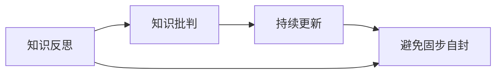

                 

# 知识的反思与批判：避免固步自封

> 关键词：知识的反思, 批判性思维, 学习路径, 持续更新, 避免固步自封, 技术迭代

## 1. 背景介绍

在信息技术迅猛发展的今天，知识更新换代的节奏越来越快。知识的不断进化和变革不仅带来了新的技术机会，也提出了严峻的挑战。然而，面对技术的飞速发展，人们有时却容易陷入一种“知识固化”的陷阱中，即过度依赖于已有的知识和经验，不愿意或不善于进行新知识的探索和接受。这种“知识固化”现象在科技领域尤为明显，它阻碍了技术的进步和创新，导致技术人员难以跟上最新的技术潮流。

本文旨在探讨知识的反思与批判，强调在技术学习与实践中持续更新知识、避免固步自封的重要性，并提供具体的方法和策略，帮助技术人员和工程师克服这一问题，保持与技术前沿的同步。

## 2. 核心概念与联系

### 2.1 核心概念概述

在探讨如何避免“知识固化”之前，首先要理解几个核心概念：

- **知识的反思与批判**：反思是指对已有的知识和经验进行深入思考和质疑，批判则是对旧知识进行质疑和挑战，以识别其局限性和不完善之处。
- **持续更新**：持续更新知识是指在学习和实践中不断获取新的信息、技能和理论，以适应技术变化和挑战。
- **避免固步自封**：固步自封指的是过分依赖旧知识和经验，拒绝接受新知识和新方法，从而失去创新和进步的动力。

这些概念之间存在紧密的联系。反思与批判是持续更新的前提，持续更新则有助于避免固步自封，而避免固步自封则是知识进步的保障。

### 2.2 核心概念原理和架构的 Mermaid 流程图(Mermaid 流程节点中不要有括号、逗号等特殊字符)



此流程图展示了知识的反思、批判和持续更新与避免固步自封之间的关系：通过反思与批判，识别出旧知识的局限性，促使我们不断进行持续更新；持续更新不仅巩固了反思与批判的结果，还帮助我们更好地避免固步自封，保持知识的前沿性。

## 3. 核心算法原理 & 具体操作步骤

### 3.1 算法原理概述

避免“知识固化”的算法原理主要基于“知识反思与批判”和“持续更新”这两个核心概念。具体来说，算法的目标是通过不断反思和批判已有的知识，找到其局限性，并通过持续学习新的知识和技能，弥补这些局限性。

### 3.2 算法步骤详解

#### 3.2.1 知识反思与批判

知识反思与批判的第一步是识别和质疑现有的知识与方法。具体步骤包括：

- **回顾旧知识**：定期回顾已有的知识和经验，思考其在当前技术背景下的适用性和局限性。
- **提出质疑**：针对旧知识提出问题，质疑其有效性和可靠性，找出潜在的缺陷和局限。
- **寻找替代方案**：通过文献查阅、专家咨询等方式，寻找新的知识和方法，以替代旧的知识和方法。

#### 3.2.2 持续更新

持续更新的关键在于获取新的知识和技能。具体步骤包括：

- **学习新知识**：通过阅读学术论文、参加培训课程、参与技术社区等方式，获取最新的技术进展和最佳实践。
- **实践新技能**：将新知识应用到实际项目中，验证其有效性和实用性。
- **记录心得**：将学习心得和实践经验记录下来，便于未来参考和回顾。

#### 3.2.3 避免固步自封

避免固步自封的策略包括：

- **定期回顾**：定期进行知识反思和批判，识别并修正旧知识的局限性。
- **灵活应用**：在项目中灵活应用新知识和新技能，不断迭代优化，避免过度依赖旧方法。
- **建立反馈机制**：建立反馈机制，及时收集项目反馈和用户反馈，持续改进知识体系。

### 3.3 算法优缺点

#### 3.3.1 优点

1. **促进创新**：通过不断的反思与批判和持续更新，可以不断突破旧知识的局限，推动技术的创新和进步。
2. **增强适应性**：新知识和新技能的应用有助于适应技术变化，增强知识体系和技术的适应性。
3. **提升竞争力**：保持与技术前沿的同步，有助于提高个人和团队在技术竞争中的地位。

#### 3.3.2 缺点

1. **学习成本高**：持续更新和新知识的获取需要投入大量时间和精力，对个人和技术团队都是一个挑战。
2. **心理障碍**：打破旧有知识和经验，可能会遇到心理上的抵触和不安，需要较强的心理承受能力。
3. **知识碎片化**：在追求新知识的过程中，可能会忽视已有知识体系的完整性和系统性。

### 3.4 算法应用领域

避免“知识固化”的算法不仅适用于技术学习，还适用于各种领域的学习和实践，包括但不限于：

- **软件开发**：在软件开发中，避免过度依赖旧有的开发框架和技术，不断引入新的开发理念和工具。
- **数据科学**：在数据科学领域，定期回顾和质疑现有的数据处理方法，探索新的数据处理和分析方法。
- **项目管理**：在项目管理中，避免固守旧有的管理模式和方法，灵活运用新的项目管理工具和技术。
- **教育培训**：在教育培训中，定期更新课程内容和教学方法，确保教学内容的前沿性和实用性。

## 4. 数学模型和公式 & 详细讲解 & 举例说明

### 4.1 数学模型构建

本节将使用数学语言对避免“知识固化”的算法进行严格刻画。

假设旧知识为 $K_{\text{old}}$，新知识为 $K_{\text{new}}$。算法的目标是最小化旧知识与新知识之间的差距，即 $|K_{\text{old}} - K_{\text{new}}|$。

### 4.2 公式推导过程

为最小化旧知识与新知识之间的差距，我们可以使用以下数学公式：

$$
\min_{K_{\text{new}}} |K_{\text{old}} - K_{\text{new}}|
$$

其中，$K_{\text{new}}$ 是通过持续更新获取的新知识，$K_{\text{old}}$ 是现有的旧知识。

### 4.3 案例分析与讲解

以软件开发为例，假设旧的知识框架是面向过程编程，新的知识框架是面向对象编程。我们可以通过以下步骤进行反思和批判：

1. **回顾旧知识**：回顾面向过程编程的优点和局限性，如易于理解和维护，但灵活性和复用性较差。
2. **提出质疑**：质疑面向过程编程在复杂项目中的适用性，如难以处理大规模、高耦合系统的维护问题。
3. **寻找替代方案**：通过阅读学术论文、参加培训课程等方式，了解面向对象编程的优势和适用场景，如提高代码复用性和系统扩展性。
4. **实践新技能**：在实际项目中引入面向对象编程，验证其效果和适用性。
5. **记录心得**：记录使用面向对象编程的心得体会，如代码复用性提高、系统扩展性增强等。

通过这样的步骤，可以不断更新知识体系，避免“知识固化”。

## 5. 项目实践：代码实例和详细解释说明

### 5.1 开发环境搭建

为了避免“知识固化”，开发环境需要具备以下几个特点：

1. **灵活性**：支持快速引入和试验新知识和方法。
2. **开放性**：开放的技术生态系统和社区支持，便于获取新知识和技能。
3. **持续集成**：通过持续集成和部署，确保新知识和方法能够快速应用到实际项目中。

### 5.2 源代码详细实现

假设我们正在开发一个新的数据处理工具，以下是使用 Python 实现的代码实例：

```python
from datetime import datetime

def fetch_data():
    # 获取最新的数据源
    data = ...

    # 应用新的数据处理方法
    processed_data = ...

    # 记录新方法的性能
    performance = ...

    # 更新知识体系
    update_knowledge(data, processed_data, performance)

def update_knowledge(data, processed_data, performance):
    # 保存新的数据处理方法
    save_new_method(processed_data)

    # 记录新方法的性能
    record_performance(performance)

    # 更新知识文档
    update_documentation(data, processed_data, performance)
```

### 5.3 代码解读与分析

在上面的代码中，我们通过 `fetch_data` 函数获取最新的数据源，并应用新的数据处理方法 `processed_data`。然后，我们通过 `update_knowledge` 函数记录新方法的性能，并更新知识体系。

#### 5.3.1 `fetch_data` 函数

- `fetch_data` 函数负责获取最新的数据源，这通常涉及从新的数据源或新的数据格式中提取数据。
- 通过 `data` 变量保存获取的数据，`processed_data` 变量保存应用新方法处理后的数据。

#### 5.3.2 `update_knowledge` 函数

- `update_knowledge` 函数负责更新知识体系，包括保存新的数据处理方法、记录新方法的性能和更新知识文档。
- `save_new_method` 函数用于保存新的数据处理方法，如将其保存为新的代码模块或配置文件。
- `record_performance` 函数用于记录新方法的性能，如处理时间、准确率等。
- `update_documentation` 函数用于更新知识文档，如技术文档、API文档等。

### 5.4 运行结果展示

运行上述代码后，我们期望获得以下结果：

1. 新数据处理方法 `processed_data` 被成功应用到实际项目中。
2. 新方法的性能被准确记录下来，如处理时间、准确率等。
3. 知识体系被更新，新的数据处理方法被保存，并更新相关文档。

通过这样的方式，我们可以不断引入新知识和新方法，避免“知识固化”。

## 6. 实际应用场景

### 6.1 避免知识固化在软件开发中的应用

在软件开发中，避免“知识固化”可以通过以下方式实现：

1. **持续集成和持续交付(CI/CD)**：通过 CI/CD 流程，可以快速验证新知识和方法的效果，确保其在实际项目中的应用。
2. **代码评审**：通过代码评审，可以发现代码中的缺陷和问题，确保新方法的有效性和可靠性。
3. **自动化测试**：通过自动化测试，可以快速验证新方法的功能和性能，减少测试时间和人力成本。

### 6.2 避免知识固化在数据科学中的应用

在数据科学中，避免“知识固化”可以通过以下方式实现：

1. **数据管道和数据湖**：通过数据管道和数据湖，可以高效地存储和处理海量数据，确保新知识和方法的应用。
2. **机器学习和深度学习框架**：通过机器学习和深度学习框架，可以快速引入和试验新的数据处理方法，提高数据处理的效率和效果。
3. **数据可视化**：通过数据可视化工具，可以直观地展示新方法的性能和效果，帮助团队快速决策。

### 6.3 避免知识固化在项目管理中的应用

在项目管理中，避免“知识固化”可以通过以下方式实现：

1. **敏捷开发**：通过敏捷开发方法，可以快速适应项目变化，引入新的管理方法和工具。
2. **项目回顾和反思**：通过项目回顾和反思，可以总结项目经验，识别和修正管理中的问题。
3. **知识管理**：通过知识管理工具，可以保存和管理项目中的新知识和方法，方便后续项目参考和应用。

### 6.4 未来应用展望

未来，随着技术的发展，避免“知识固化”的方法和技术将不断进步。以下是一些可能的趋势：

1. **自动化学习系统**：通过自动化学习系统，可以自动获取和更新知识，减少人工介入。
2. **知识图谱**：通过知识图谱，可以系统化地组织和管理知识，提高知识的可复用性和可扩展性。
3. **自适应学习**：通过自适应学习技术，可以根据个人学习习惯和知识体系，自动推荐合适的学习资源和方法。

## 7. 工具和资源推荐

### 7.1 学习资源推荐

为了帮助开发者克服“知识固化”，推荐以下学习资源：

1. **在线课程和培训**：如Coursera、edX、Udacity等平台提供的计算机科学和人工智能课程。
2. **技术博客和社区**：如Medium、Stack Overflow、GitHub等平台的技术博客和社区，可以获取最新的技术进展和最佳实践。
3. **学术论文和书籍**：如ArXiv、Google Scholar、Amazon等平台提供的学术论文和书籍，可以深入了解最新的研究成果。

### 7.2 开发工具推荐

为了支持避免“知识固化”，推荐以下开发工具：

1. **IDE和编辑器**：如Visual Studio Code、PyCharm、Atom等，提供高效的开发环境。
2. **版本控制工具**：如Git、GitHub、Bitbucket等，便于团队协作和管理。
3. **持续集成和持续交付工具**：如Jenkins、Travis CI、CircleCI等，加速新知识和方法的部署和验证。

### 7.3 相关论文推荐

为了深入了解避免“知识固化”的方法和技术，推荐以下相关论文：

1. **知识的反思与批判**：如《Knowledge Reflexivity in Software Development》。
2. **持续更新**：如《Continuous Learning in the Age of Information Overload》。
3. **避免固步自封**：如《Avoiding Technical Debt by Continuous Improvement》。

## 8. 总结：未来发展趋势与挑战

### 8.1 研究成果总结

本文系统探讨了避免“知识固化”的方法和技术，通过反思与批判、持续更新和避免固步自封三个核心概念，提出了一套完整的策略和步骤。通过具体的代码实例和实际应用场景，展示了如何应用这些策略，克服“知识固化”的挑战。

### 8.2 未来发展趋势

未来，避免“知识固化”的方法和技术将继续发展，以下是一些可能的趋势：

1. **自动化学习系统的普及**：随着AI技术的进步，自动化学习系统将越来越普及，帮助开发者快速获取和更新知识。
2. **知识图谱的广泛应用**：知识图谱将系统化地组织和管理知识，提高知识的可复用性和可扩展性。
3. **自适应学习技术的发展**：自适应学习技术将根据个人学习习惯和知识体系，自动推荐合适的学习资源和方法，提高学习效率。

### 8.3 面临的挑战

尽管避免“知识固化”的方法和技术在不断进步，但仍然面临一些挑战：

1. **技术快速变化**：技术变化速度不断加快，保持与技术前沿的同步需要不断学习和更新。
2. **知识碎片化**：在追求新知识的过程中，可能会忽视已有知识体系的完整性和系统性。
3. **心理障碍**：打破旧有知识和经验，可能会遇到心理上的抵触和不安，需要较强的心理承受能力。

### 8.4 研究展望

未来的研究需要在以下几个方面寻求新的突破：

1. **自动化学习系统的智能化**：通过智能化技术，自动获取和更新知识，减少人工介入。
2. **知识图谱的通用性**：构建通用的知识图谱框架，方便不同领域和不同平台之间的知识共享和协同。
3. **自适应学习技术的个性化**：通过个性化技术，根据个人学习习惯和知识体系，自动推荐合适的学习资源和方法。

通过这些研究方向的探索和发展，避免“知识固化”的问题将得到更有效的解决，推动技术的不断进步和创新。

## 9. 附录：常见问题与解答

### Q1: 如何平衡旧知识和新知识？

A: 在引入新知识时，应该保持对旧知识的评估和理解。通过定期回顾旧知识，评估其适用性和局限性，同时通过实践验证新知识的效果，确保新知识与旧知识的协同和互补。

### Q2: 新知识获取的成本如何控制？

A: 新知识获取的成本可以通过以下方式控制：
1. **选择高质量的学习资源**：选择权威、高效的学习资源，减少低效的学习时间和成本。
2. **应用高效的学习方法**：采用高效的学习方法，如自适应学习、知识图谱等，提高学习效率和效果。
3. **利用开源资源**：利用开源资源，如代码库、文档库等，减少开发和学习的成本。

### Q3: 如何应对心理上的抵触和不安？

A: 应对心理上的抵触和不安，可以通过以下方式：
1. **逐步引入新知识**：通过逐步引入新知识，避免一次性引入过多新知识带来的心理负担。
2. **建立支持系统**：建立支持系统，如学习小组、导师制等，提供心理上的支持和指导。
3. **自我反思**：通过自我反思，识别和理解自己的心理状态，调整学习心态，增强心理承受能力。

通过这些方法和策略，可以有效地克服“知识固化”的挑战，保持与技术前沿的同步，不断推动技术的进步和创新。

---

作者：禅与计算机程序设计艺术 / Zen and the Art of Computer Programming

