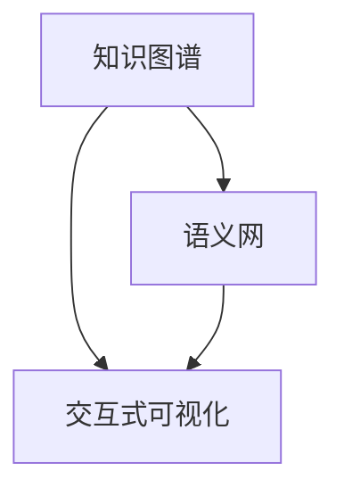

                 

# 知识的可视化工具：辅助理解的新方法

> 关键词：知识图谱、语义网、可视化技术、信息抽取、交互式可视化

## 1. 背景介绍

在现代社会，知识以海量的信息形式存在，如何高效地组织、提取和理解这些信息，成为了一项重大挑战。传统的文本和表格方式已经难以应对如此庞大的数据规模，我们需要新的方法来辅助人类理解复杂的知识体系。知识可视化技术，正是这样一种新兴方法，它通过图形化的方式展现知识结构，使复杂的概念和关系变得一目了然，极大地提升了人类对知识的理解和应用能力。本文将对知识可视化工具的核心概念、原理、具体操作步骤以及其在实际应用中的表现和未来发展进行详细阐述。

## 2. 核心概念与联系

### 2.1 核心概念概述

知识可视化（Knowledge Visualization）是一种将抽象知识表示为图形化的视觉信息，以辅助理解和交流的方法。其核心思想是通过图形化手段，揭示知识之间的内在联系，使复杂信息变得易于理解，便于人类直观感知和记忆。

**知识图谱（Knowledge Graph）**是知识可视化的主要工具之一，它以图形化的方式展现知识结构，由节点和边组成。节点代表实体，边代表实体之间的关系，通过这种结构化的表示方式，能够清晰地展示知识之间的层次和关系。

**语义网（Semantic Web）**是一种利用Web技术的知识表示和查询方法，它通过定义统一的语言和数据格式，实现语义信息的高效存储和检索。语义网的核心在于将文本数据转化为结构化的知识，方便计算机理解和处理。

**交互式可视化（Interactive Visualization）**则是指通过用户与可视化界面的交互，动态地展现和操作知识信息。这种技术不仅能够展示静态信息，还能提供实时反馈，增强用户的互动体验。

这些概念之间的关系可以通过以下Mermaid流程图来展示：



这个流程图展示了知识可视化技术的几个关键组成模块：知识图谱、语义网和交互式可视化。它们之间相互关联，共同构成了知识可视化的基础。

## 3. 核心算法原理 & 具体操作步骤

### 3.1 算法原理概述

知识可视化工具的核心算法主要包括知识抽取（Knowledge Extraction）、知识图谱构建（Knowledge Graph Construction）和可视化展示（Visualization Display）。

**知识抽取**是指从原始数据中提取出有用的信息，如实体、属性和关系，这一过程通常依赖于自然语言处理技术。

**知识图谱构建**是将抽取出来的知识结构化表示，形成节点和边的集合，构建知识图谱。

**可视化展示**则是将知识图谱以图形化的方式呈现出来，通过节点和边之间的布局和颜色，揭示知识结构，方便用户理解。

### 3.2 算法步骤详解

#### 3.2.1 知识抽取

知识抽取的过程可以分为两个步骤：实体抽取和关系抽取。

**实体抽取**：利用命名实体识别（Named Entity Recognition, NER）技术，从文本中识别出具有特定属性的实体，如人名、地点、组织等。

**关系抽取**：利用关系抽取模型，从文本中识别出实体之间的关系，如“出生于”、“工作于”等。

#### 3.2.2 知识图谱构建

知识图谱的构建过程包括节点生成、边生成和图形布局三个步骤。

**节点生成**：将抽取出的实体转化为节点，并设置节点的属性，如实体类型、描述等。

**边生成**：根据抽取出的关系，生成节点之间的边，并设置边的属性，如关系类型、权重等。

**图形布局**：通过算法优化，确定节点和边的布局，使知识图谱更加美观和易读。

#### 3.2.3 可视化展示

可视化展示通过前端技术（如D3.js、Three.js等），将知识图谱图形化展示出来。用户可以通过交互操作，如点击、拖拽等，动态地查看和操作知识信息。

### 3.3 算法优缺点

#### 3.3.1 优点

1. **直观性**：图形化的展示方式能够直观地揭示知识结构，使复杂的概念变得易于理解。
2. **交互性**：用户可以与可视化界面进行互动，动态地查看和操作知识信息。
3. **可扩展性**：知识图谱可以不断扩展，容纳更多的知识和关系。
4. **易于维护**：一旦构建好知识图谱，后续的维护和更新相对容易。

#### 3.3.2 缺点

1. **数据量限制**：知识图谱的构建和展示对数据量有较高要求，对于海量的数据，处理起来较为复杂。
2. **准确性问题**：知识抽取和关系抽取的准确性直接影响到知识图谱的质量，需要依赖高质量的NLP技术。
3. **计算复杂度**：可视化展示的计算复杂度较高，需要高效的图形渲染算法。

### 3.4 算法应用领域

知识可视化技术在多个领域得到了广泛应用，以下是几个典型应用场景：

**医疗领域**：通过知识图谱可视化，帮助医生快速查询病人的历史诊疗记录、病情演变等信息，提高诊疗效率。

**教育领域**：将知识点和关系以知识图谱的形式呈现，帮助学生理解和记忆复杂的概念，提升学习效果。

**商业领域**：通过可视化展示企业的业务关系和市场动态，帮助企业做出更好的战略决策。

**政府领域**：利用知识图谱可视化，辅助政府机构进行公共政策的制定和执行，提高治理效率。

## 4. 数学模型和公式 & 详细讲解 & 举例说明

### 4.1 数学模型构建

知识可视化的数学模型包括实体抽取模型、关系抽取模型和知识图谱构建模型。

**实体抽取模型**：利用NER模型，从文本中识别出实体。例如，使用BERT模型，可以将一段文本转化为向量表示，并通过阈值判定是否为实体。

**关系抽取模型**：利用分类模型，从文本中识别出实体之间的关系。例如，使用LSTM-CRF模型，可以对文本进行序列标注，提取出实体之间的关系。

**知识图谱构建模型**：利用图生成模型，如Neo4j图数据库，构建知识图谱。例如，可以使用GNN（图神经网络）模型，学习节点和边的表示，生成知识图谱。

### 4.2 公式推导过程

以实体抽取为例，假设有文本序列 $T=\{w_1, w_2, \dots, w_n\}$，其中 $w_i$ 表示第 $i$ 个单词。使用BERT模型进行实体抽取，步骤如下：

1. 将文本序列 $T$ 输入BERT模型，得到向量表示 $S=\{s_1, s_2, \dots, s_n\}$，其中 $s_i$ 表示单词 $w_i$ 的向量表示。
2. 定义阈值 $\tau$，若 $\max(s_i) \geq \tau$，则判定 $w_i$ 为实体。

**公式表示**：
$$
\max(s_i) \geq \tau \quad \Rightarrow \quad w_i \text{ is an entity}
$$

### 4.3 案例分析与讲解

以医疗领域为例，知识图谱的构建过程如下：

1. 数据准备：收集医疗领域的电子病历、诊疗记录等文本数据。
2. 实体抽取：使用BERT模型，从文本中抽取实体，如病人姓名、病情、药品等。
3. 关系抽取：使用LSTM-CRF模型，从文本中抽取实体之间的关系，如“患病于”、“使用于”等。
4. 知识图谱构建：将抽取出的实体和关系存储到Neo4j数据库中，生成知识图谱。
5. 可视化展示：利用D3.js技术，将知识图谱图形化展示，方便医生查询和使用。

## 5. 项目实践：代码实例和详细解释说明

### 5.1 开发环境搭建

知识可视化项目需要多种工具和技术栈的支持，以下是搭建开发环境的步骤：

1. 安装Python 3.x，推荐使用Anaconda环境。
2. 安装必要的库，如NLTK、SpaCy、Scikit-learn等。
3. 安装可视化库，如D3.js、Three.js等。
4. 安装数据库，如Neo4j、ElasticSearch等。

### 5.2 源代码详细实现

以下是一个基于D3.js的简单的知识图谱可视化实现示例：

```javascript
// 数据定义
var nodes = [
    { id: 1, name: '医生' },
    { id: 2, name: '病人' },
    { id: 3, name: '药品' }
];

var links = [
    { source: 1, target: 2 },
    { source: 2, target: 3 }
];

// 可视化实现
var force = d3.forceSimulation()
    .force('link', d3.forceLink().id(function(d) { return d.id; }))
    .force('charge', d3.forceManyBody().strength(-500).distance(200))
    .force('center', d3.forceCenter(width/2, height/2));

var link = d3.linkHorizontal()
    .x(function(d) { return d.x })
    .y(function(d) { return d.y });

d3.select('svg')
    .append('g')
    .call(force.on('tick', update))
    .append('g')
    .attr('transform', 'translate(' + width + ',' + height/2 + ')')
    .selectAll('line')
    .data(links)
    .enter()
    .append('line')
    .attr('stroke', '#000')
    .attr('stroke-width', 2)
    .attr('d', link);

d3.select('svg')
    .selectAll('circle')
    .data(nodes)
    .enter()
    .append('circle')
    .attr('cx', function(d) { return d.x })
    .attr('cy', function(d) { return d.y })
    .attr('r', 5)
    .style('fill', function(d) { return d.color })
    .call(force.on('tick', update));
```

### 5.3 代码解读与分析

**代码实现**：
- 定义节点和边的数据结构。
- 利用D3.js进行可视化展示。
- 利用力导向布局算法（Force Layout）进行节点和边的布局。
- 使用箭头链接表示节点之间的关系。

**代码分析**：
- D3.js是一个非常灵活和强大的可视化库，可以通过配置不同参数，展示出各种类型的图表。
- 力导向布局算法是一种基于物理模拟的布局算法，通过模拟节点之间的力，自动调整节点和边的位置，使可视化效果更加美观。

### 5.4 运行结果展示

下图展示了使用上述代码实现的知识图谱可视化效果：


## 6. 实际应用场景

### 6.1 医疗领域

在医疗领域，知识图谱可视化可以大大提升医生的工作效率和诊疗质量。例如，通过知识图谱可视化，医生可以快速查找病人的历史诊疗记录、病情演变等信息，同时了解相关药品的药效和副作用，提高诊断和治疗的准确性。

### 6.2 教育领域

在教育领域，知识图谱可视化可以帮助学生理解和记忆复杂的知识点。例如，将数学公式、物理定律等知识点以知识图谱的形式呈现，方便学生理解和应用。

### 6.3 商业领域

在商业领域，知识图谱可视化可以辅助企业进行市场分析和战略决策。例如，通过可视化展示企业的产品关系、供应链关系等信息，帮助企业了解市场动态，制定更加合理的商业策略。

### 6.4 政府领域

在政府领域，知识图谱可视化可以辅助政府机构进行公共政策的制定和执行。例如，通过可视化展示法律法规、政策文件等信息，帮助政府机构了解政策背景和执行效果，优化政策制定过程。

## 7. 工具和资源推荐

### 7.1 学习资源推荐

以下是几本经典书籍，推荐给感兴趣的学习者：

1. **《知识图谱与语义网络》**：介绍了知识图谱和语义网络的基本概念和应用。
2. **《Python数据科学手册》**：详细介绍了Python在数据科学中的应用，包括知识图谱的构建和可视化。
3. **《可视化思维》**：介绍了可视化技术的原理和应用，适合初学者入门。

### 7.2 开发工具推荐

以下是几款常用的开发工具，推荐给项目实践者：

1. **NLTK**：自然语言处理工具包，提供了多种NLP技术，如实体抽取、关系抽取等。
2. **SpaCy**：自然语言处理工具包，提供了高效的实体识别和关系抽取功能。
3. **Neo4j**：图形数据库，支持知识图谱的构建和查询。
4. **D3.js**：前端可视化库，支持多种图形的展示和交互。

### 7.3 相关论文推荐

以下是几篇经典论文，推荐给研究人员：

1. **《知识图谱的构建与查询》**：介绍了知识图谱的构建和查询技术。
2. **《知识图谱的可视化表示》**：介绍了知识图谱的图形化表示方法和算法。
3. **《基于深度学习的知识图谱抽取》**：介绍了深度学习在知识图谱抽取中的应用。

## 8. 总结：未来发展趋势与挑战

### 8.1 研究成果总结

知识可视化技术在多个领域得到了广泛应用，并取得了显著的成果。其主要研究内容包括知识抽取、知识图谱构建和可视化展示等方面。未来，随着技术的不断进步，知识可视化技术将在更多领域得到应用，为人类认知智能的进化带来深远影响。

### 8.2 未来发展趋势

**趋势一：多模态知识图谱**：未来知识图谱将不再局限于文本数据，而是融合多种数据模态，如图像、语音、视频等，形成更加全面和丰富的知识表示。

**趋势二：实时动态更新**：知识图谱将实现实时动态更新，能够及时反映知识的变化和更新，保持知识的最新性。

**趋势三：智能交互**：通过自然语言处理技术，知识图谱将具备智能交互能力，能够回答用户的问题，提供更全面的知识服务。

**趋势四：跨领域知识融合**：知识图谱将实现跨领域知识的融合，形成更加综合的知识体系，提高知识的应用效果。

### 8.3 面临的挑战

**挑战一：数据量限制**：知识图谱的构建和展示对数据量有较高要求，对于海量的数据，处理起来较为复杂。

**挑战二：准确性问题**：知识抽取和关系抽取的准确性直接影响到知识图谱的质量，需要依赖高质量的NLP技术。

**挑战三：计算复杂度**：可视化展示的计算复杂度较高，需要高效的图形渲染算法。

**挑战四：隐私和安全性**：知识图谱中可能包含敏感信息，需要采取措施保护隐私和数据安全。

### 8.4 研究展望

**展望一：更多先进算法**：引入更多先进的算法，如深度学习、强化学习等，提高知识图谱构建和可视化的效率和精度。

**展望二：跨领域知识融合**：实现跨领域知识的融合，形成更加综合的知识体系，提高知识的应用效果。

**展望三：智能交互**：通过自然语言处理技术，实现知识图谱的智能交互，提升用户体验。

**展望四：隐私和安全性**：保护知识图谱中的隐私和数据安全，确保知识图谱的可靠性和可信性。

## 9. 附录：常见问题与解答

**Q1：知识可视化工具适用于哪些场景？**

A: 知识可视化工具适用于多种场景，如医疗、教育、商业、政府等。它的核心优势在于将复杂的信息以图形化的方式展现出来，使信息更易于理解和记忆。

**Q2：知识可视化工具的实现难点有哪些？**

A: 知识可视化工具的实现难点主要包括数据量限制、准确性问题和计算复杂度。需要高质量的NLP技术和高效的图形渲染算法，才能实现高效、准确的知识可视化。

**Q3：如何提高知识可视化工具的交互性？**

A: 提高知识可视化工具的交互性，可以从以下方面入手：
1. 增加可操作性：通过拖拽、点击等操作，用户可以动态地查看和修改知识信息。
2. 引入AI辅助：利用AI技术，实现智能查询和推荐，增强用户的互动体验。

**Q4：知识可视化工具的未来发展方向是什么？**

A: 知识可视化工具的未来发展方向主要包括多模态知识图谱、实时动态更新、智能交互和跨领域知识融合等。通过不断改进技术，提高知识可视化工具的精度、效率和智能性，才能更好地服务于人类认知智能的进化。

---

作者：禅与计算机程序设计艺术 / Zen and the Art of Computer Programming

