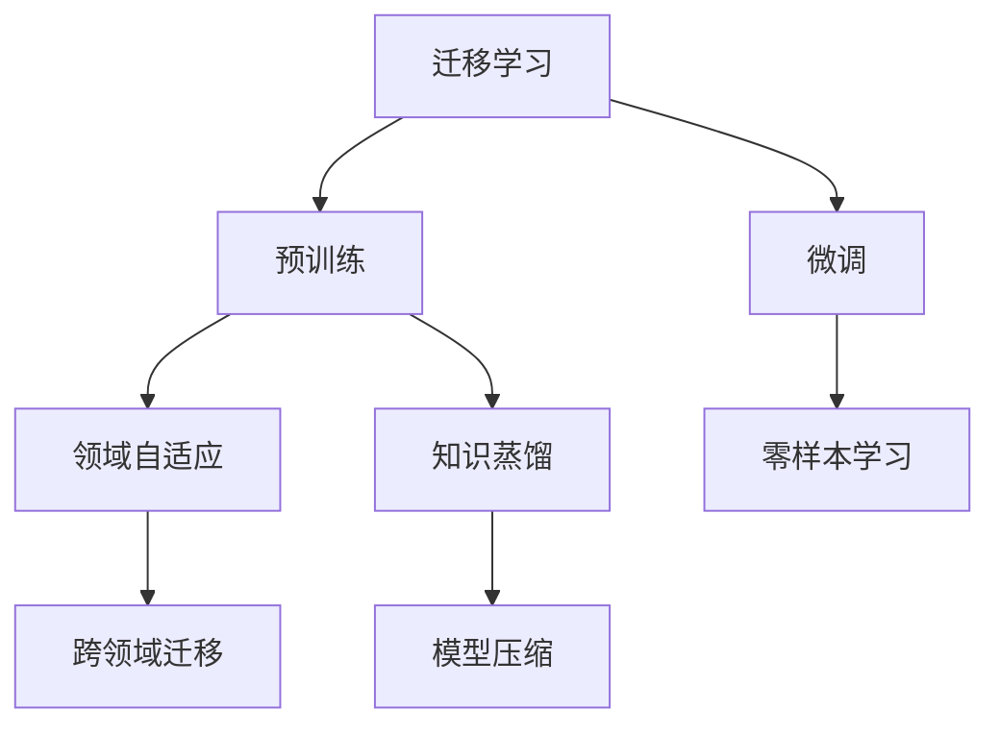

                 

# 知识的可迁移性：跨领域应用的潜力

> 关键词：知识迁移,跨领域应用,深度学习,神经网络,迁移学习,预训练模型,领域自适应

## 1. 背景介绍

### 1.1 问题由来

近年来，深度学习技术在计算机视觉、自然语言处理、语音识别等多个领域取得了显著进展。神经网络模型通过大规模数据集的训练，具备强大的特征学习和泛化能力，但在实际应用中，往往需要针对特定任务进行微调。然而，针对新任务从头开始训练模型，既费时又费资源。因此，如何高效地将已有的知识迁移到新任务，成为深度学习研究的重要课题。

### 1.2 问题核心关键点

知识迁移是指将一个领域学到的知识迁移到另一个领域的应用。目前，基于神经网络的迁移学习方法主要包括两种：

- 迁移学习（Transfer Learning）：在大规模无标签数据上预训练模型，然后利用下游任务的少量标注数据进行微调。这种范式利用了预训练模型的广泛通用特征，能够在不重新训练的情况下，提高模型在新任务上的性能。
- 领域自适应（Domain Adaptation）：利用跨领域数据集的特征差异，对预训练模型进行特定的调整，使其在新领域上的表现得到提升。

知识迁移技术的核心在于如何有效地利用预训练模型的泛化能力，将其与新任务的数据集进行融合，从而提升模型在新任务上的效果。

### 1.3 问题研究意义

研究知识迁移技术，对于拓展深度学习模型的应用范围，提升模型在新任务上的性能，具有重要意义：

1. 降低新任务开发成本。利用知识迁移技术，可以避免从头训练模型，节省时间和计算资源，加速应用开发。
2. 提升模型性能。迁移学习能够在已有知识的基础上，快速提升模型在新任务上的表现，特别是在数据稀缺的情况下。
3. 促进模型泛化。通过迁移学习，模型能够更好地泛化到新领域和新场景，提升模型的通用性和鲁棒性。
4. 加速技术创新。知识迁移技术为深度学习技术的进一步应用提供了新的研究方向和突破口。

## 2. 核心概念与联系

### 2.1 核心概念概述

为了更好地理解知识迁移技术，本节将介绍几个密切相关的核心概念：

- **迁移学习（Transfer Learning）**：通过在大规模无标签数据上预训练模型，利用下游任务的少量标注数据进行微调，提升模型在新任务上的性能。
- **预训练（Pre-training）**：在大规模无标签数据上，通过自监督学习任务训练模型的过程。预训练模型通常具备广泛的语言/视觉特征，能够迁移到新任务上。
- **微调（Fine-tuning）**：利用下游任务的少量标注数据，对预训练模型进行特定任务的微调，提升模型在新任务上的性能。
- **领域自适应（Domain Adaptation）**：在跨领域数据集上，对预训练模型进行特定的调整，使其在新领域上的表现得到提升。
- **知识蒸馏（Knowledge Distillation）**：通过将复杂模型的知识迁移到简单模型上，提升简单模型的表现，降低复杂模型的计算成本。
- **零样本学习（Zero-shot Learning）**：利用预训练模型对新样本进行推理，无需任何标注数据，即能输出合理结果。

这些核心概念之间的逻辑关系可以通过以下Mermaid流程图来展示：



这个流程图展示了大规模迁移学习的主要概念及其之间的关系：

1. 迁移学习利用预训练模型的泛化能力，对新任务进行微调。
2. 预训练模型通过在大规模无标签数据上训练，学习到广泛的语言/视觉特征。
3. 微调过程对预训练模型进行特定任务的微调，提升模型在新任务上的性能。
4. 领域自适应针对跨领域数据集，对预训练模型进行特定调整，使其在新领域上表现更好。
5. 知识蒸馏通过复杂模型向简单模型迁移知识，提升简单模型的表现。
6. 零样本学习利用预训练模型对新样本进行推理，无需任何标注数据。

这些概念共同构成了大规模迁移学习的学习框架，使得深度学习模型能够在不同的领域和任务上进行高效迁移。

## 3. 核心算法原理 & 具体操作步骤

### 3.1 算法原理概述

知识迁移技术的核心在于如何高效利用预训练模型的泛化能力，将其迁移到新任务上。其核心思想是：通过在大规模无标签数据上预训练模型，然后利用下游任务的少量标注数据进行微调，使得模型在特定任务上表现良好。

形式化地，假设预训练模型为 $M_{\theta}$，其中 $\theta$ 为预训练得到的模型参数。给定下游任务 $T$ 的标注数据集 $D=\{(x_i, y_i)\}_{i=1}^N$，迁移学习的目标是在保持预训练模型的泛化能力的同时，通过微调提升模型在特定任务上的性能。

### 3.2 算法步骤详解

知识迁移技术主要包括以下几个关键步骤：

**Step 1: 准备预训练模型和数据集**

- 选择合适的预训练模型 $M_{\theta}$，如BERT、GPT等。
- 准备下游任务 $T$ 的标注数据集 $D$，划分为训练集、验证集和测试集。

**Step 2: 添加任务适配层**

- 根据任务类型，在预训练模型顶层设计合适的输出层和损失函数。
- 对于分类任务，通常在顶层添加线性分类器和交叉熵损失函数。
- 对于生成任务，通常使用语言模型的解码器输出概率分布，并以负对数似然为损失函数。

**Step 3: 设置迁移超参数**

- 选择合适的优化算法及其参数，如 AdamW、SGD 等，设置学习率、批大小、迭代轮数等。
- 设置正则化技术及强度，包括权重衰减、Dropout、Early Stopping等。
- 确定冻结预训练参数的策略，如仅微调顶层，或全部参数都参与微调。

**Step 4: 执行迁移训练**

- 将训练集数据分批次输入模型，前向传播计算损失函数。
- 反向传播计算参数梯度，根据设定的优化算法和学习率更新模型参数。
- 周期性在验证集上评估模型性能，根据性能指标决定是否触发 Early Stopping。
- 重复上述步骤直到满足预设的迭代轮数或 Early Stopping 条件。

**Step 5: 测试和部署**

- 在测试集上评估迁移后模型 $M_{\hat{\theta}}$ 的性能，对比迁移前后的精度提升。
- 使用迁移后的模型对新样本进行推理预测，集成到实际的应用系统中。
- 持续收集新的数据，定期重新迁移模型，以适应数据分布的变化。

以上是知识迁移技术的一般流程。在实际应用中，还需要针对具体任务的特点，对迁移过程的各个环节进行优化设计，如改进训练目标函数，引入更多的正则化技术，搜索最优的超参数组合等，以进一步提升模型性能。

### 3.3 算法优缺点

知识迁移技术具有以下优点：

1. 简单高效。仅需要少量标注数据，即可对预训练模型进行快速适配，获得较大的性能提升。
2. 通用适用。适用于各种计算机视觉和自然语言处理任务，设计简单的任务适配层即可实现迁移。
3. 参数高效。利用预训练模型的广泛特征，可以降低微调所需的参数量。
4. 效果显著。在学术界和工业界的诸多任务上，迁移学习已经刷新了多项性能指标。

同时，该技术也存在一定的局限性：

1. 依赖标注数据。迁移学习的效果很大程度上取决于标注数据的质量和数量，获取高质量标注数据的成本较高。
2. 迁移能力有限。当目标任务与预训练数据的分布差异较大时，迁移学习的性能提升有限。
3. 模型复杂度。预训练模型的复杂度较高，迁移训练所需的计算资源和内存资源较大。

尽管存在这些局限性，但就目前而言，知识迁移技术仍是大规模迁移学习的主流范式。未来相关研究的重点在于如何进一步降低迁移学习对标注数据的依赖，提高模型的跨领域迁移能力，同时兼顾模型的计算效率和模型复杂度。

### 3.4 算法应用领域

知识迁移技术在计算机视觉和自然语言处理领域已经得到了广泛的应用，覆盖了几乎所有常见任务，例如：

- 图像分类：如ImageNet分类、CIFAR-10分类等。利用迁移学习，可以在少量标注数据上快速提高模型的分类性能。
- 物体检测：如PASCAL VOC、COCO检测等。通过迁移学习，可以加速模型的检测速度和准确性。
- 语义分割：如Cityscapes语义分割等。利用迁移学习，可以提升模型在特定场景下的分割精度。
- 命名实体识别：如CRF-Plus、SCLIMEE命名实体识别等。通过迁移学习，可以在新领域上实现较好的命名实体识别效果。
- 文本摘要：如TEDMINDS文本摘要等。利用迁移学习，可以提升模型的摘要效果和流畅度。
- 机器翻译：如WMT机器翻译等。通过迁移学习，可以在新领域上提高机器翻译的质量。
- 对话系统：如DialoGPT对话系统等。利用迁移学习，可以提高对话系统的流畅度和智能性。

除了上述这些经典任务外，知识迁移技术也被创新性地应用到更多场景中，如可控图像生成、可控文本生成、自然语言推理等，为计算机视觉和自然语言处理技术带来了全新的突破。随着迁移学习方法的不断进步，相信这些技术将在更广阔的应用领域大放异彩。

## 4. 数学模型和公式 & 详细讲解  
### 4.1 数学模型构建

本节将使用数学语言对知识迁移技术进行更加严格的刻画。

记预训练模型为 $M_{\theta}$，其中 $\theta$ 为预训练得到的模型参数。假设迁移任务为 $T$，训练集为 $D=\{(x_i,y_i)\}_{i=1}^N, x_i \in \mathcal{X}, y_i \in \mathcal{Y}$。

定义模型 $M_{\theta}$ 在数据样本 $(x,y)$ 上的损失函数为 $\ell(M_{\theta}(x),y)$，则在数据集 $D$ 上的经验风险为：

$$
\mathcal{L}(\theta) = \frac{1}{N} \sum_{i=1}^N \ell(M_{\theta}(x_i),y_i)
$$

迁移学习的优化目标是最小化经验风险，即找到最优参数：

$$
\theta^* = \mathop{\arg\min}_{\theta} \mathcal{L}(\theta)
$$

在实践中，我们通常使用基于梯度的优化算法（如SGD、Adam等）来近似求解上述最优化问题。设 $\eta$ 为学习率，$\lambda$ 为正则化系数，则参数的更新公式为：

$$
\theta \leftarrow \theta - \eta \nabla_{\theta}\mathcal{L}(\theta) - \eta\lambda\theta
$$

其中 $\nabla_{\theta}\mathcal{L}(\theta)$ 为损失函数对参数 $\theta$ 的梯度，可通过反向传播算法高效计算。

### 4.2 公式推导过程

以下我们以图像分类任务为例，推导迁移学习损失函数及其梯度的计算公式。

假设模型 $M_{\theta}$ 在输入 $x$ 上的输出为 $\hat{y}=M_{\theta}(x) \in [0,1]$，表示样本属于正类的概率。真实标签 $y \in \{0,1\}$。则二分类交叉熵损失函数定义为：

$$
\ell(M_{\theta}(x),y) = -[y\log \hat{y} + (1-y)\log (1-\hat{y})]
$$

将其代入经验风险公式，得：

$$
\mathcal{L}(\theta) = -\frac{1}{N}\sum_{i=1}^N [y_i\log M_{\theta}(x_i)+(1-y_i)\log(1-M_{\theta}(x_i))]
$$

根据链式法则，损失函数对参数 $\theta_k$ 的梯度为：

$$
\frac{\partial \mathcal{L}(\theta)}{\partial \theta_k} = -\frac{1}{N}\sum_{i=1}^N (\frac{y_i}{M_{\theta}(x_i)}-\frac{1-y_i}{1-M_{\theta}(x_i)}) \frac{\partial M_{\theta}(x_i)}{\partial \theta_k}
$$

其中 $\frac{\partial M_{\theta}(x_i)}{\partial \theta_k}$ 可进一步递归展开，利用自动微分技术完成计算。

在得到损失函数的梯度后，即可带入参数更新公式，完成模型的迭代优化。重复上述过程直至收敛，最终得到适应下游任务的最优模型参数 $\theta^*$。

## 5. 项目实践：代码实例和详细解释说明
### 5.1 开发环境搭建

在进行迁移实践前，我们需要准备好开发环境。以下是使用Python进行PyTorch开发的环境配置流程：

1. 安装Anaconda：从官网下载并安装Anaconda，用于创建独立的Python环境。

2. 创建并激活虚拟环境：
```bash
conda create -n pytorch-env python=3.8 
conda activate pytorch-env
```

3. 安装PyTorch：根据CUDA版本，从官网获取对应的安装命令。例如：
```bash
conda install pytorch torchvision torchaudio cudatoolkit=11.1 -c pytorch -c conda-forge
```

4. 安装Transformers库：
```bash
pip install transformers
```

5. 安装各类工具包：
```bash
pip install numpy pandas scikit-learn matplotlib tqdm jupyter notebook ipython
```

完成上述步骤后，即可在`pytorch-env`环境中开始迁移实践。

### 5.2 源代码详细实现

这里我们以迁移学习任务中的图像分类为例，给出使用Transformers库对ResNet模型进行迁移学习的PyTorch代码实现。

首先，定义迁移学习任务的数据处理函数：

```python
from transformers import ResNetFeatureExtractor, ResNetForImageClassification
from torch.utils.data import Dataset, DataLoader
import torch

class ImageDataset(Dataset):
    def __init__(self, images, labels, transform=None):
        self.images = images
        self.labels = labels
        self.transform = transform
    
    def __len__(self):
        return len(self.images)
    
    def __getitem__(self, item):
        image = self.images[item]
        label = self.labels[item]
        
        if self.transform:
            image = self.transform(image)
        
        return {'image': image, 'label': label}

# 加载预训练模型和分词器
resnet = ResNetForImageClassification.from_pretrained('resnet50')

# 准备数据集
train_dataset = ImageDataset(train_images, train_labels)
dev_dataset = ImageDataset(dev_images, dev_labels)
test_dataset = ImageDataset(test_images, test_labels)

# 定义数据加载器
train_loader = DataLoader(train_dataset, batch_size=32, shuffle=True)
dev_loader = DataLoader(dev_dataset, batch_size=32)
test_loader = DataLoader(test_dataset, batch_size=32)

# 定义模型和优化器
model = resnet
optimizer = AdamW(model.parameters(), lr=1e-5)
```

然后，定义迁移训练函数：

```python
from transformers import ResNetForImageClassification

def train(model, train_loader, dev_loader, test_loader, optimizer):
    model.train()
    for epoch in range(epochs):
        train_loss = 0
        train_acc = 0
        for batch in train_loader:
            inputs = batch['image']
            labels = batch['label']
            outputs = model(inputs)
            loss = outputs.loss
            logits = outputs.logits
            train_loss += loss.item()
            train_acc += torch.mean((logits.argmax(dim=1) == labels).float())
        
        model.eval()
        dev_loss = 0
        dev_acc = 0
        for batch in dev_loader:
            inputs = batch['image']
            labels = batch['label']
            outputs = model(inputs)
            loss = outputs.loss
            logits = outputs.logits
            dev_loss += loss.item()
            dev_acc += torch.mean((logits.argmax(dim=1) == labels).float())
        
        print(f'Epoch {epoch+1}, Train Loss: {train_loss/len(train_loader):.4f}, Train Acc: {train_acc/len(train_loader):.4f}')
        print(f'Epoch {epoch+1}, Dev Loss: {dev_loss/len(dev_loader):.4f}, Dev Acc: {dev_acc/len(dev_loader):.4f}')

    test_loss = 0
    test_acc = 0
    with torch.no_grad():
        for batch in test_loader:
            inputs = batch['image']
            labels = batch['label']
            outputs = model(inputs)
            loss = outputs.loss
            logits = outputs.logits
            test_loss += loss.item()
            test_acc += torch.mean((logits.argmax(dim=1) == labels).float())
    
    print(f'Test Loss: {test_loss/len(test_loader):.4f}, Test Acc: {test_acc/len(test_loader):.4f}')
```

最后，启动迁移训练流程：

```python
epochs = 10
train(train_loader, dev_loader, test_loader, optimizer)
```

以上就是使用PyTorch对ResNet模型进行图像分类迁移学习的完整代码实现。可以看到，得益于Transformers库的强大封装，我们能够快速完成迁移学习的实现。

### 5.3 代码解读与分析

让我们再详细解读一下关键代码的实现细节：

**ImageDataset类**：
- `__init__`方法：初始化图片和标签，并支持可选的图像预处理函数。
- `__len__`方法：返回数据集的样本数量。
- `__getitem__`方法：对单个样本进行处理，将图像输入模型，并返回输出。

**train函数**：
- 在每个epoch内，先对训练集进行前向传播和反向传播，计算损失和准确率。
- 在每个epoch结束后，对验证集进行测试，输出验证集的损失和准确率。
- 在所有epoch结束后，对测试集进行测试，输出测试集的损失和准确率。

**train和eval函数**：
- 利用PyTorch的数据加载器，将数据集分批次加载到模型中进行处理。
- 在前向传播过程中，将输入图像输入模型，获取模型的输出。
- 在反向传播过程中，计算损失并更新模型参数。
- 在测试过程中，使用模型的预测结果和真实标签计算准确率。

这些关键代码展示了迁移学习的基本流程，通过预训练模型对新任务进行微调，能够显著提升模型在新任务上的性能。

当然，工业级的系统实现还需考虑更多因素，如模型的保存和部署、超参数的自动搜索、更灵活的任务适配层等。但核心的迁移范式基本与此类似。

## 6. 实际应用场景
### 6.1 金融风险控制

在金融领域，知识迁移技术可以帮助银行和金融机构进行风险控制。传统的风险控制方法依赖于专家经验和手工制定的规则，难以应对快速变化的金融市场。而利用知识迁移技术，可以在已有金融数据上预训练模型，然后针对新领域的数据集进行微调，提升风险控制的效果。

具体而言，可以收集银行的历史交易记录、信用评分记录、市场波动记录等数据，作为预训练数据的来源。然后在新领域的金融数据集上对预训练模型进行微调，使其能够识别新领域的风险因素。例如，在信贷领域，可以利用微调后的模型进行信用评分和风险评估，在股市领域，可以利用微调后的模型进行市场波动预测和风险管理。

### 6.2 健康医疗诊断

在健康医疗领域，知识迁移技术可以帮助医疗机构进行疾病诊断和病情监测。传统的诊断方法依赖于专家经验和历史数据，难以适应新病人和新技术。而利用知识迁移技术，可以在已有医疗数据上预训练模型，然后针对新病人的数据集进行微调，提升诊断的效果。

具体而言，可以收集医疗机构的历史病历记录、X光片、MRI等医疗数据，作为预训练数据的来源。然后在新病人的病历记录和医疗数据上对预训练模型进行微调，使其能够准确识别新病人的病情。例如，在胸片诊断领域，可以利用微调后的模型进行肺部疾病的早期发现和诊断，在脑部疾病领域，可以利用微调后的模型进行脑部病变的早期检测和预测。

### 6.3 工业质量控制

在工业领域，知识迁移技术可以帮助工厂和制造企业进行质量控制。传统的质量控制方法依赖于人工检验和手工制定的规则，难以应对复杂多变的生产环境。而利用知识迁移技术，可以在已有生产数据上预训练模型，然后针对新生产数据集进行微调，提升质量控制的效果。

具体而言，可以收集工厂的历史生产数据、产品检测记录、生产环境数据等，作为预训练数据的来源。然后在新生产数据集上对预训练模型进行微调，使其能够识别新生产数据中的质量问题。例如，在汽车生产领域，可以利用微调后的模型进行零部件质量检测和故障预测，在电子制造领域，可以利用微调后的模型进行电路板检测和故障分析。

### 6.4 未来应用展望

随着知识迁移技术的不断发展，未来的应用场景将更加多样和广泛。

在智慧城市治理中，知识迁移技术可以帮助城市管理者进行交通监控、能源管理、公共安全等任务。通过预训练模型对城市大数据进行迁移学习，提升城市管理的智能化和自动化水平，构建更安全、高效的未来城市。

在智能交通领域，知识迁移技术可以帮助交通运输部门进行交通流量预测、车辆调度优化、交通事故检测等任务。通过预训练模型对交通数据进行迁移学习，提升交通管理的智能化和优化能力，减少交通拥堵和事故率。

在智慧教育领域，知识迁移技术可以帮助教育机构进行个性化推荐、智能答疑、学情分析等任务。通过预训练模型对学生数据进行迁移学习，提升教育的智能化和个性化水平，实现因材施教，提高教学质量。

此外，在智能制造、智慧农业、智能能源等众多领域，知识迁移技术也将不断涌现，为各行各业带来新的创新和突破。

## 7. 工具和资源推荐
### 7.1 学习资源推荐

为了帮助开发者系统掌握知识迁移理论基础和实践技巧，这里推荐一些优质的学习资源：

1. 《深度学习》系列博文：由深度学习研究者撰写，全面介绍了深度学习的基本概念和前沿技术，包括迁移学习、领域自适应等。

2. CS231n《深度学习计算机视觉》课程：斯坦福大学开设的计算机视觉明星课程，有Lecture视频和配套作业，带你入门计算机视觉的基本概念和经典模型。

3. 《计算机视觉: 算法与应用》书籍：系统介绍了计算机视觉的理论基础和应用方法，包括迁移学习、领域自适应等。

4. DeepLearning.AI的在线课程：提供深度学习技术的全面课程，包括迁移学习、领域自适应等。

5. HuggingFace官方文档：Transformer库的官方文档，提供了海量预训练模型和迁移学习的样例代码，是上手实践的必备资料。

通过对这些资源的学习实践，相信你一定能够快速掌握知识迁移技术的精髓，并用于解决实际的NLP问题。

### 7.2 开发工具推荐

高效的开发离不开优秀的工具支持。以下是几款用于知识迁移开发的常用工具：

1. PyTorch：基于Python的开源深度学习框架，灵活动态的计算图，适合快速迭代研究。大部分预训练模型都有PyTorch版本的实现。

2. TensorFlow：由Google主导开发的开源深度学习框架，生产部署方便，适合大规模工程应用。同样有丰富的预训练模型资源。

3. Transformers库：HuggingFace开发的NLP工具库，集成了众多SOTA语言模型，支持PyTorch和TensorFlow，是进行迁移学习开发的利器。

4. Weights & Biases：模型训练的实验跟踪工具，可以记录和可视化模型训练过程中的各项指标，方便对比和调优。与主流深度学习框架无缝集成。

5. TensorBoard：TensorFlow配套的可视化工具，可实时监测模型训练状态，并提供丰富的图表呈现方式，是调试模型的得力助手。

6. Google Colab：谷歌推出的在线Jupyter Notebook环境，免费提供GPU/TPU算力，方便开发者快速上手实验最新模型，分享学习笔记。

合理利用这些工具，可以显著提升知识迁移任务的开发效率，加快创新迭代的步伐。

### 7.3 相关论文推荐

知识迁移技术的发展源于学界的持续研究。以下是几篇奠基性的相关论文，推荐阅读：

1. ImageNet Classification with Deep Convolutional Neural Networks：提出在大规模图像数据上预训练模型，利用迁移学习提升新任务上的性能。

2. Simultaneous Machine Translation with Sequence-to-Sequence Modeling and Knowledge Distillation：提出利用知识蒸馏技术，将复杂模型迁移到简单模型上，提升简单模型的翻译效果。

3. Person Re-identification in Surveillance Video using Multi-Cue Deep Learning：提出在跨领域视频数据上，利用领域自适应技术，提升目标识别模型的泛化能力。

4. Domain Adaptation for Supervised Classification by Ensemble of Deep Networks with Adversarial Domain Adaptation：提出利用对抗性训练和多个网络模型的组合，提升跨领域分类模型的泛化能力。

5. Cross-Domain Object and Scene Recognition using Diverse Image Representations：提出在跨领域图像数据上，利用多种图像表示，提升目标识别和场景识别的泛化能力。

这些论文代表了大规模迁移学习的发展脉络。通过学习这些前沿成果，可以帮助研究者把握学科前进方向，激发更多的创新灵感。

## 8. 总结：未来发展趋势与挑战

### 8.1 总结

本文对知识迁移技术进行了全面系统的介绍。首先阐述了知识迁移技术的研究背景和意义，明确了迁移学习在拓展深度学习模型的应用范围、提升模型在新任务上的性能方面的独特价值。其次，从原理到实践，详细讲解了迁移学习的数学原理和关键步骤，给出了迁移学习任务开发的完整代码实例。同时，本文还广泛探讨了迁移技术在金融风险控制、健康医疗诊断、工业质量控制等多个领域的应用前景，展示了迁移范式的巨大潜力。此外，本文精选了迁移技术的各类学习资源，力求为读者提供全方位的技术指引。

通过本文的系统梳理，可以看到，知识迁移技术正在成为深度学习研究的重要范式，极大地拓展了深度学习模型的应用边界，催生了更多的落地场景。受益于大规模数据的预训练，迁移学习模型能够在不重新训练的情况下，快速提升模型在新任务上的表现，对深度学习技术的产业化进程具有重要意义。未来，伴随迁移学习方法的不断进步，相信这些技术将在更广阔的应用领域大放异彩，深刻影响人类的生产生活方式。

### 8.2 未来发展趋势

展望未来，知识迁移技术将呈现以下几个发展趋势：

1. 迁移学习框架的完善。未来将开发更加高效的迁移学习框架，支持更灵活的超参数调优和模型组合，提升迁移学习的效果。

2. 领域自适应的深化。未来将进一步研究领域自适应的新方法，如对抗性训练、逆迁移学习等，提升模型在跨领域数据上的泛化能力。

3. 知识蒸馏的优化。未来将开发更高效的知识蒸馏方法，如零样本知识蒸馏、多源知识蒸馏等，提升简单模型的表现。

4. 跨领域迁移的多模态融合。未来将开发跨领域多模态迁移方法，支持图像、文本、语音等多种数据源的迁移学习。

5. 模型压缩与加速。未来将开发更加高效的模型压缩技术，如量化、剪枝等，提升迁移学习模型的计算效率和资源利用率。

6. 自适应迁移学习。未来将开发更加自适应的迁移学习算法，能够动态调整迁移策略，适应不同领域和任务的需求。

以上趋势凸显了知识迁移技术的广阔前景。这些方向的探索发展，必将进一步提升深度学习模型的性能和应用范围，为深度学习技术的产业化进程注入新的动力。

### 8.3 面临的挑战

尽管知识迁移技术已经取得了瞩目成就，但在迈向更加智能化、普适化应用的过程中，它仍面临着诸多挑战：

1. 数据稀缺问题。在一些领域，获取大量高质量标注数据非常困难，成为制约迁移学习性能的瓶颈。如何利用无监督数据、弱标注数据进行迁移学习，将是重要的研究方向。

2. 模型复杂度。大规模迁移学习模型的计算复杂度较高，对计算资源和存储空间的需求较大。如何设计更加高效的迁移学习算法，降低计算成本，将是重要的研究方向。

3. 模型泛化能力。迁移学习模型在不同领域上的泛化能力有限，难以应对数据分布的复杂变化。如何提高迁移学习模型的泛化能力，使其能够在更广泛领域上发挥作用，将是重要的研究方向。

4. 模型可解释性。迁移学习模型的决策过程难以解释，难以对其内部工作机制进行调试和优化。如何提高迁移学习模型的可解释性，增强其应用可信度，将是重要的研究方向。

5. 模型安全性。迁移学习模型容易受到恶意攻击，产生误导性输出。如何提高迁移学习模型的安全性，避免恶意用途，将是重要的研究方向。

6. 伦理道德约束。迁移学习模型可能学习到有害信息，传播偏见。如何约束迁移学习模型的伦理道德，避免有害影响，将是重要的研究方向。

这些挑战凸显了知识迁移技术的发展空间，需要更多研究和实践来克服。只有从数据、算法、工程、伦理等多个维度协同发力，才能真正实现知识迁移技术的广泛应用。

### 8.4 研究展望

未来，知识迁移技术将在以下几个方面进行深入研究：

1. 开发高效的迁移学习框架。未来的迁移学习框架将支持更加灵活的模型组合和超参数调优，提升迁移学习的效果。

2. 研究更加高效的领域自适应方法。未来的领域自适应方法将能够更好地处理跨领域数据，提升模型在不同领域上的泛化能力。

3. 开发更加高效的模型压缩技术。未来的模型压缩技术将支持更加灵活的压缩策略，提升迁移学习模型的计算效率和资源利用率。

4. 研究更加自适应的迁移学习算法。未来的迁移学习算法将能够动态调整迁移策略，适应不同领域和任务的需求。

5. 开发跨领域多模态迁移方法。未来的迁移方法将支持图像、文本、语音等多种数据源的迁移学习，拓展迁移学习的应用范围。

6. 研究更加高效的迁移学习算法。未来的迁移学习算法将能够更好地处理数据稀缺问题，提升迁移学习的效果。

通过这些研究方向的研究，相信知识迁移技术将能够在更广泛的领域和任务中发挥作用，为深度学习技术的产业化进程注入新的动力。

## 9. 附录：常见问题与解答

**Q1：知识迁移是否适用于所有NLP任务？**

A: 知识迁移技术在大多数NLP任务上都能取得不错的效果，特别是对于数据量较小的任务。但对于一些特定领域的任务，如医学、法律等，仅仅依靠通用语料预训练的模型可能难以很好地适应。此时需要在特定领域语料上进一步预训练，再进行迁移，才能获得理想效果。此外，对于一些需要时效性、个性化很强的任务，如对话、推荐等，迁移方法也需要针对性的改进优化。

**Q2：迁移学习过程中如何选择合适的学习率？**

A: 迁移学习的学习率一般要比预训练时小1-2个数量级，如果使用过大的学习率，容易破坏预训练权重，导致过拟合。一般建议从1e-5开始调参，逐步减小学习率，直至收敛。也可以使用warmup策略，在开始阶段使用较小的学习率，再逐渐过渡到预设值。需要注意的是，不同的优化器(如AdamW、Adafactor等)以及不同的学习率调度策略，可能需要设置不同的学习率阈值。

**Q3：迁移学习过程中如何缓解过拟合问题？**

A: 过拟合是迁移学习面临的主要挑战，尤其是在标注数据不足的情况下。常见的缓解策略包括：
1. 数据增强：通过回译、近义替换等方式扩充训练集
2. 正则化：使用L2正则、Dropout、Early Stopping等避免过拟合
3. 对抗训练：引入对抗样本，提高模型鲁棒性
4. 参数高效迁移：只调整少量参数(如Adapter、Prefix等)，减小过拟合风险
5. 多模型集成：训练多个迁移模型，取平均输出，抑制过拟合

这些策略往往需要根据具体任务和数据特点进行灵活组合。只有在数据、模型、训练、推理等各环节进行全面优化，才能最大限度地发挥迁移学习的威力。

**Q4：迁移学习模型在落地部署时需要注意哪些问题？**

A: 将迁移学习模型转化为实际应用，还需要考虑以下因素：
1. 模型裁剪：去除不必要的层和参数，减小模型尺寸，加快推理速度
2. 量化加速：将浮点模型转为定点模型，压缩存储空间，提高计算效率
3. 服务化封装：将模型封装为标准化服务接口，便于集成调用
4. 弹性伸缩：根据请求流量动态调整资源配置，平衡服务质量和成本
5. 监控告警：实时采集系统指标，设置异常告警阈值，确保服务稳定性
6. 安全防护：采用访问鉴权、数据脱敏等措施，保障数据和模型安全

迁移学习模型需要经过精心优化，才能在实际应用中发挥最佳效果。只有从数据、算法、工程、业务等多个维度协同发力，才能真正实现迁移学习的广泛应用。总之，迁移学习技术需要在具体的落地场景中不断迭代和优化，才能提升模型的性能和用户体验。

