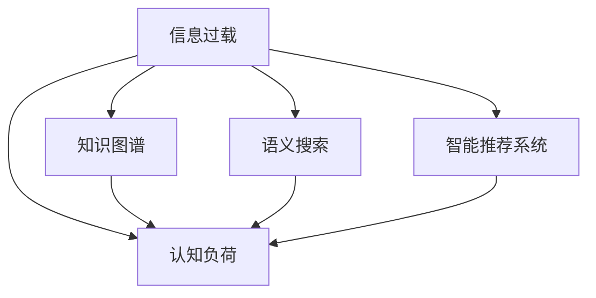

                 

# 知识的复杂性：应对信息过载的策略

## 1. 背景介绍

### 1.1 问题由来

在现代社会，知识量的爆炸式增长给人们带来了前所未有的挑战。面对海量的信息，人们往往感到不堪重负。如何在信息过载的背景下，有效地获取、组织、应用知识，成为当下面临的重大问题。这不仅仅是一个技术问题，更是涉及到认知心理学、信息科学、人机交互等多个学科的交叉问题。

### 1.2 问题核心关键点

信息过载的核心问题是人类认知能力与信息量之间的矛盾。人们的大脑容量和处理速度是有限的，而可获取的信息量却远远超出了人类认知能力的极限。这导致了知识的复杂性问题，即知识量的增大不仅未带来认知能力的提升，反而带来了处理信息能力的下降。本文旨在探讨如何通过技术手段，应对这一问题，提升知识的可获取性、可理解性和可应用性。

## 2. 核心概念与联系

### 2.1 核心概念概述

为更好地理解信息过载及应对策略，我们首先介绍几个关键概念：

- 信息过载(Information Overload)：指人类接收到的信息量超过其处理能力的现象，导致认知负担加重，决策效率下降。
- 认知负荷(Cognitive Load)：指在信息处理过程中，认知资源（如注意力、记忆等）的消耗情况。
- 知识图谱(Knowledge Graph)：通过节点和边的方式，构建知识实体及其关系，帮助人更好地理解复杂的知识体系。
- 语义搜索(Semantic Search)：通过理解和解释查询语句和文档内容，实现更精准的搜索结果。
- 智能推荐系统(Recommendation System)：根据用户行为和偏好，推荐相关知识内容，提升知识获取的个性化和效率。

这些概念之间的逻辑关系可以通过以下Mermaid流程图来展示：



这个流程图展示了一些关键概念之间的相互关系：

1. 信息过载导致认知负荷增大。
2. 知识图谱、语义搜索、智能推荐系统等技术手段，都可以帮助降低认知负荷，提升知识获取的效率和质量。
3. 这些技术手段可以相互结合，进一步优化知识获取和应用的效率。

## 3. 核心算法原理 & 具体操作步骤

### 3.1 算法原理概述

应对信息过载的策略主要涉及三个方面：降低认知负荷、优化知识结构、提升知识获取和应用的效率。

### 3.2 算法步骤详解

**Step 1: 数据预处理**
- 收集大规模的文本、图像、视频等数据，进行清洗、分词、标注等预处理。
- 构建语料库、知识库等基础数据结构，为后续的语义理解和智能推荐提供支撑。

**Step 2: 知识表示与存储**
- 使用知识图谱技术，将知识以节点和边的形式存储，形成知识图谱模型。
- 通过自然语言处理技术，将文本数据转化为知识图谱中的节点和边，丰富知识库内容。

**Step 3: 语义搜索与匹配**
- 通过深度学习模型，对查询语句进行语义解析，理解用户意图。
- 在知识图谱中进行节点匹配，找到最相关的知识实体和关系。

**Step 4: 智能推荐**
- 使用协同过滤、内容推荐、混合推荐等方法，结合用户的历史行为和偏好，推荐相关知识内容。
- 引入动态调整机制，根据用户反馈和互动数据，实时更新推荐模型。

**Step 5: 知识应用与反馈**
- 在应用场景中，通过交互式界面和智能助手，向用户呈现知识内容。
- 收集用户反馈和互动数据，持续改进推荐模型和知识表示方法。

### 3.3 算法优缺点

#### 优点

1. **提升知识获取效率**：通过智能推荐系统和语义搜索，可以快速找到所需知识，降低信息检索的时间成本。
2. **优化知识结构**：知识图谱将知识以结构化的形式呈现，方便用户理解和记忆。
3. **提升知识应用能力**：智能推荐系统可以根据用户需求，动态调整知识推荐，提高知识应用的个性化和适应性。

#### 缺点

1. **数据依赖性高**：智能推荐系统和语义搜索依赖于大规模的标注数据和知识库，获取这些数据可能存在困难。
2. **算法复杂度较高**：深度学习和知识图谱技术需要较强的计算能力和时间成本。
3. **模型可解释性不足**：部分算法和模型（如深度学习模型）缺乏可解释性，难以理解其内部决策过程。

### 3.4 算法应用领域

智能推荐系统、语义搜索、知识图谱等技术在多个领域都有广泛应用，例如：

- 电商：个性化推荐商品、购物助手、智能客服等。
- 教育：智能推荐学习内容、知识图谱辅助学习等。
- 医疗：智能推荐诊疗方案、知识图谱辅助诊疗等。
- 金融：智能推荐投资策略、智能客服等。

这些领域的应用不仅提升了知识获取和应用的效率，还改善了用户体验和决策质量。未来，这些技术还将进一步渗透到更多领域，提升各行各业的智能化水平。

## 4. 数学模型和公式 & 详细讲解  
### 4.1 数学模型构建

在本节中，我们主要介绍语义搜索和智能推荐系统的数学模型构建。

#### 4.1.1 语义搜索模型

语义搜索模型通常包括文本向量化、语义匹配和排序三个步骤。

1. **文本向量化**：将查询和文档转化为向量形式，以便进行相似度计算。
   - 使用词袋模型(Bag of Words)或TF-IDF模型对文本进行向量化。
   - 将查询和文档分别表示为词向量，如Word2Vec、GloVe等。

2. **语义匹配**：通过相似度计算，找到与查询最相关的文档。
   - 使用余弦相似度(Cosine Similarity)、Jaccard相似度(Jaccard Similarity)等度量文本向量之间的相似度。
   - 在知识图谱中，通过节点匹配和路径计算，找到与查询相关的知识实体和关系。

3. **排序**：根据相似度得分对文档进行排序，选择最相关的前几条结果返回给用户。
   - 使用排序算法（如PageRank、DenseRank等）对搜索结果进行排序。

#### 4.1.2 智能推荐模型

智能推荐模型主要包括协同过滤、内容推荐和混合推荐等方法。

1. **协同过滤**：通过用户行为数据，推荐用户可能感兴趣的知识内容。
   - 用户-物品协同矩阵表示用户和物品之间的相似度关系。
   - 基于用户行为数据，计算用户对物品的评分，推荐相似物品。

2. **内容推荐**：通过物品特征（如标签、描述等），推荐与用户兴趣相关的物品。
   - 使用TF-IDF、Word2Vec等技术提取物品特征。
   - 根据用户的历史行为，匹配相似物品的特征向量。

3. **混合推荐**：结合协同过滤和内容推荐，提升推荐效果。
   - 使用加权、拼接、融合等方法，整合不同推荐方法的结果。
   - 引入动态调整机制，实时更新推荐模型参数。

### 4.2 公式推导过程

#### 4.2.1 语义搜索中的余弦相似度

余弦相似度是文本向量化和语义匹配中常用的一种度量方法。设查询向量为 $q$，文档向量为 $d$，余弦相似度公式为：

$$
\cos(\theta) = \frac{q \cdot d}{||q||_2 \cdot ||d||_2}
$$

其中 $\cdot$ 表示向量点积，$||q||_2$ 和 $||d||_2$ 分别为向量 $q$ 和 $d$ 的欧几里得范数。

#### 4.2.2 协同过滤中的矩阵分解

协同过滤可以通过矩阵分解的方法，将用户-物品协同矩阵分解为两个低秩矩阵，得到用户和物品的潜在评分。
设用户-物品协同矩阵为 $R$，用户矩阵为 $U$，物品矩阵为 $V$，用户-物品潜在评分矩阵为 $P$，矩阵分解公式为：

$$
R = UV^T
$$

通过矩阵分解，可以获取用户和物品的潜在评分 $p_{ui}$，用于推荐相似物品。

### 4.3 案例分析与讲解

以电商推荐系统为例，分析智能推荐模型的具体实现和效果：

#### 4.3.1 数据准备
- 收集用户的浏览、点击、购买等行为数据，构建用户行为矩阵 $R$。
- 提取物品的标签、描述、图片等特征，构建物品特征矩阵 $V$。

#### 4.3.2 用户嵌入和物品嵌入
- 使用矩阵分解方法，将用户行为矩阵 $R$ 分解为 $U$ 和 $V$。
- 通过 $U$ 和 $V$ 得到用户嵌入 $u_i$ 和物品嵌入 $v_j$。

#### 4.3.3 协同过滤推荐
- 计算用户 $u_i$ 对物品 $v_j$ 的潜在评分 $p_{ij}$。
- 根据潜在评分排序，选择最相关的物品进行推荐。

## 5. 项目实践：代码实例和详细解释说明

### 5.1 开发环境搭建

在进行项目实践前，我们需要准备好开发环境。以下是使用Python进行TensorFlow和PyTorch开发的流程：

1. 安装Anaconda：从官网下载并安装Anaconda，用于创建独立的Python环境。

2. 创建并激活虚拟环境：
```bash
conda create -n tf_env python=3.8 
conda activate tf_env
```

3. 安装TensorFlow和PyTorch：
```bash
pip install tensorflow==2.8.0
pip install torch==1.9.0
```

4. 安装相关依赖库：
```bash
pip install numpy pandas sklearn jupyter notebook scipy
```

5. 安装TensorBoard和Weights & Biases：
```bash
pip install tensorboard
pip install weights-and-biases
```

完成上述步骤后，即可在`tf_env`环境中开始项目实践。

### 5.2 源代码详细实现

以下是一个使用TensorFlow实现智能推荐系统的示例代码：

```python
import tensorflow as tf
import numpy as np
import pandas as pd

# 构建用户-物品协同矩阵
R = np.array([[1, 0, 1, 0],
              [0, 0, 1, 1],
              [1, 1, 0, 0],
              [0, 1, 0, 0]])

# 构建物品特征矩阵
V = np.array([[0.5, 0.5, 0.5],
              [0.5, 0.5, 0.5],
              [0.5, 0.5, 0.5]])

# 构建用户嵌入矩阵
U = np.array([[0.5, 0.5],
              [0.5, 0.5],
              [0.5, 0.5]])

# 矩阵分解
Q, H = tf.linalg.qr(tf.convert_to_tensor(R))
P = tf.matmul(Q, H)

# 计算用户嵌入和物品嵌入
u = tf.matmul(P, U)
v = tf.matmul(P, V)

# 计算协同过滤推荐结果
p = tf.matmul(u, v, transpose_b=True)
topk = tf.argsort(p, axis=1)[:, -5:]

# 输出推荐结果
for user, items in topk:
    print(f"User {user + 1}: {items.numpy().tolist()}")
```

### 5.3 代码解读与分析

让我们再详细解读一下关键代码的实现细节：

- **数据准备**：
  - 使用NumPy创建用户行为矩阵 $R$ 和物品特征矩阵 $V$。
  - 创建用户嵌入矩阵 $U$，表示用户对物品的潜在评分。

- **矩阵分解**：
  - 使用TensorFlow的QR分解方法，计算用户行为矩阵 $R$ 的分解结果 $Q$ 和 $H$。
  - 通过 $Q$ 和 $H$ 计算用户嵌入矩阵 $u$ 和物品嵌入矩阵 $v$。

- **协同过滤推荐**：
  - 通过矩阵乘法计算用户嵌入和物品嵌入的点积，得到潜在评分矩阵 $p$。
  - 使用TensorFlow的排序函数 `argsort` 获取推荐结果的索引。

- **输出推荐结果**：
  - 遍历推荐结果，输出每个用户的前5个推荐物品。

## 6. 实际应用场景

### 6.1 电商推荐系统

电商推荐系统是智能推荐技术的典型应用之一。通过分析用户的历史行为和兴趣偏好，推荐符合用户需求的商品，提升用户购买决策的效率和质量。

在实践中，可以使用协同过滤、内容推荐等方法，结合用户行为数据和物品特征，生成个性化推荐结果。同时，利用动态调整机制，根据用户反馈实时更新推荐模型，进一步提升推荐效果。

### 6.2 智能搜索系统

智能搜索系统可以通过语义搜索技术，帮助用户快速找到所需信息。在实际应用中，可以通过知识图谱等技术手段，丰富搜索内容的层次和结构，提升搜索结果的相关性和准确性。

以搜索引擎为例，当用户输入查询语句时，通过语义解析和知识图谱匹配，快速找到最相关的网页和知识实体，提高搜索效率。同时，利用智能推荐系统，根据用户浏览历史和点击行为，进一步优化搜索结果，提升用户体验。

### 6.3 个性化学习系统

个性化学习系统通过智能推荐技术，帮助用户找到适合的课程、教材和学习资源，提升学习效果。在实践中，可以使用协同过滤和内容推荐方法，结合用户学习行为数据和课程特征，生成个性化推荐列表。

通过智能推荐系统，用户可以找到自己感兴趣的知识内容，提升学习动力和效果。同时，利用动态调整机制，根据用户反馈实时更新推荐模型，确保推荐内容的准确性和相关性。

## 7. 工具和资源推荐

### 7.1 学习资源推荐

为了帮助开发者系统掌握信息过载及应对策略的理论基础和实践技巧，这里推荐一些优质的学习资源：

1. 《深度学习》系列书籍：由多位深度学习专家合著，涵盖深度学习理论、算法、应用等多个方面，适合深入学习。

2. 《信息检索》课程：由斯坦福大学开设的课程，讲解信息检索和语义搜索的基本原理和方法。

3. 《推荐系统》书籍：详细介绍了推荐系统的理论基础、算法和应用，适合全面了解推荐技术。

4. 《认知负荷与人类信息加工》书籍：探讨认知负荷的基本原理和处理策略，为信息过载问题提供理论支撑。

5. Kaggle数据集：提供大量真实世界的数据集，供开发者实践语义搜索和智能推荐系统。

通过对这些资源的学习实践，相信你一定能够快速掌握信息过载及应对策略的精髓，并用于解决实际的信息过载问题。

### 7.2 开发工具推荐

高效的开发离不开优秀的工具支持。以下是几款用于信息过载应对技术的开发工具：

1. TensorFlow和PyTorch：广泛使用的深度学习框架，支持高效计算和分布式训练。

2. TensorBoard和Weights & Biases：模型训练和实验跟踪工具，提供丰富的可视化图表和实验报告。

3. Scikit-learn和scipy：用于数据预处理和特征工程的常用库。

4. Jupyter Notebook：交互式开发环境，适合快速原型开发和实验验证。

5. ELKI：用于聚类和数据挖掘的工具，支持高效的相似度计算和特征提取。

合理利用这些工具，可以显著提升信息过载应对技术的开发效率，加快创新迭代的步伐。

### 7.3 相关论文推荐

信息过载及应对技术的发展源于学界的持续研究。以下是几篇奠基性的相关论文，推荐阅读：

1. "Information Overload" by S. J. Loewenstein and T. E. Basar：系统阐述了信息过载的基本原理和应对策略。

2. "Knowledge Graphs: A Comprehensive Survey" by M. T. Riedel et al.：全面介绍了知识图谱的基本概念和应用。

3. "Semantic Search in the Age of Deep Learning" by R. G. Movshovitz-Attias：讨论了语义搜索技术在深度学习背景下的发展趋势。

4. "Recommendation Systems: A Textbook" by I. Toope and J. W. Houghton：介绍了推荐系统的理论基础和算法实现。

5. "Cognitive Load Theory: Past, Present, and Future" by J. Sweller：探讨了认知负荷的基本原理和处理策略。

这些论文代表了大数据和智能推荐技术的发展脉络。通过学习这些前沿成果，可以帮助研究者把握学科前进方向，激发更多的创新灵感。

## 8. 总结：未来发展趋势与挑战

### 8.1 总结

本文对信息过载及应对策略进行了全面系统的介绍。首先阐述了信息过载问题的背景和核心关键点，明确了知识图谱、语义搜索、智能推荐等技术手段的作用和优势。其次，从原理到实践，详细讲解了这些技术的数学模型和实现方法，给出了具体的代码实例和详细解释。同时，本文还探讨了这些技术在电商、搜索、教育等多个领域的应用场景，展示了技术应用的广泛前景。最后，本文精选了相关学习资源和开发工具，力求为读者提供全方位的技术指引。

通过本文的系统梳理，可以看到，信息过载及应对技术正在成为信息科学和人工智能领域的重要研究方向，极大地提升了知识获取和应用的能力。未来，伴随大数据和深度学习技术的发展，这些技术将进一步渗透到更多领域，为各行各业带来智能化和效率的提升。

### 8.2 未来发展趋势

展望未来，信息过载及应对技术将呈现以下几个发展趋势：

1. **技术融合**：知识图谱、语义搜索、智能推荐等技术将进一步融合，形成更加综合的知识服务系统。
2. **动态调整**：引入动态调整机制，根据用户行为和环境变化实时更新推荐模型和搜索策略。
3. **跨领域应用**：技术将进一步渗透到医疗、教育、金融等多个领域，提升各行各业的智能化水平。
4. **多模态融合**：结合文本、图像、视频等多种数据类型，实现跨模态知识表示和推荐。
5. **自动化和智能化**：通过自动化学习（如强化学习）和智能算法（如深度学习），提升推荐系统的个性化和智能化程度。

这些趋势将推动信息过载及应对技术向更高层次发展，为人类社会的智能化进程提供更多技术支撑。

### 8.3 面临的挑战

尽管信息过载及应对技术已经取得了显著进展，但在迈向更加智能化和普适化应用的过程中，它仍面临诸多挑战：

1. **数据隐私和安全**：智能推荐和语义搜索技术依赖大量用户数据，数据隐私和安全问题成为重要挑战。
2. **模型复杂性**：深度学习模型和大规模知识库增加了系统的复杂性，带来了算法实现和维护的困难。
3. **用户接受度**：用户对推荐系统和服务信任度不高，需要更多的技术透明性和可解释性。
4. **跨领域应用难度**：不同领域的知识表示和应用场景差异较大，难以实现统一的推荐策略。
5. **资源消耗**：大规模知识图谱和深度学习模型的训练和推理需要大量计算资源。

这些挑战需要在未来的研究和实践中不断攻克，才能推动技术更好地服务于实际应用。

### 8.4 研究展望

面对信息过载及应对技术所面临的挑战，未来的研究需要在以下几个方面寻求新的突破：

1. **隐私保护和可解释性**：开发更加安全、透明、可解释的推荐系统，提升用户对技术的信任度。
2. **跨领域知识整合**：通过知识图谱和语义搜索技术，实现不同领域知识的整合和协同。
3. **多模态知识表示**：结合文本、图像、视频等多种数据类型，实现多模态知识表示和推荐。
4. **动态调整和学习**：引入动态调整机制，结合强化学习等技术，实现推荐系统的实时优化和学习。
5. **智能化和自动化**：通过自动化学习和智能算法，提升推荐系统的个性化和智能化程度。

这些研究方向的探索，必将引领信息过载及应对技术迈向更高的台阶，为构建更加智能、普适的知识服务系统提供更多的技术支撑。

## 9. 附录：常见问题与解答

**Q1：如何构建知识图谱？**

A: 构建知识图谱需要以下几个步骤：
1. 数据采集：从各种来源收集知识数据，如文献、网页、百科等。
2. 数据清洗：清洗数据，去除噪声和冗余信息。
3. 实体识别：识别数据中的实体，如人名、地名、组织名等。
4. 关系抽取：抽取实体之间的关系，如父子关系、雇佣关系等。
5. 知识融合：将不同来源的数据融合到一个统一的图谱中，保持知识的一致性和准确性。

**Q2：如何提高语义搜索的准确性？**

A: 提高语义搜索准确性的方法包括：
1. 使用深度学习模型对查询进行语义解析，理解用户意图。
2. 使用知识图谱匹配技术，找到最相关的知识实体和关系。
3. 引入动态调整机制，根据用户反馈和互动数据，实时更新搜索模型。

**Q3：如何评估智能推荐系统的效果？**

A: 评估智能推荐系统的效果通常使用以下几个指标：
1. 准确率（Precision）：推荐结果中相关物品的比例。
2. 召回率（Recall）：相关物品被推荐的比例。
3. F1分数：准确率和召回率的调和平均。
4. NDCG（Normalized Discounted Cumulative Gain）：评估推荐结果的相关性和排名。

通过这些指标，可以全面评估推荐系统的性能和效果。

**Q4：如何优化推荐模型的计算效率？**

A: 优化推荐模型的计算效率可以从以下几个方面入手：
1. 数据压缩和稀疏化：对数据进行压缩和稀疏化，减少存储和计算开销。
2. 分布式计算：使用分布式计算框架，如Spark、Hadoop等，提高计算效率。
3. 模型压缩和剪枝：使用模型压缩和剪枝技术，去除冗余参数，提高推理速度。
4. 硬件优化：使用GPU、TPU等高性能硬件，加速模型训练和推理。

这些方法可以显著提升推荐模型的计算效率，提升系统的响应速度和用户满意度。

**Q5：如何处理推荐系统中的数据隐私问题？**

A: 处理推荐系统中的数据隐私问题可以采取以下措施：
1. 数据匿名化：对用户数据进行匿名化处理，保护用户隐私。
2. 差分隐私：在推荐过程中加入噪声，保护用户数据的隐私性。
3. 联邦学习：在多个设备或服务器之间分布式学习，减少数据集中存储的风险。

这些措施可以有效保护用户隐私，增强用户对推荐系统的信任度。

---

作者：禅与计算机程序设计艺术 / Zen and the Art of Computer Programming

