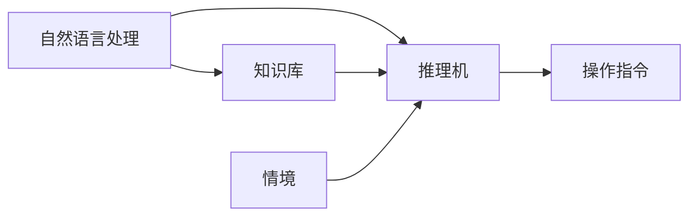

                 

# 知识的情境化：将抽象概念转化为实际应用

## 1. 背景介绍

### 1.1 问题由来
在当今信息爆炸的时代，知识已经不再仅仅是静态的文本或数据，而是被广泛应用于各种智能系统和自动化流程中。然而，知识的抽象性和复杂性常常使得它在实际应用中难以被有效利用。因此，如何通过有效的转化手段，将抽象概念转化为具体、可操作的指令，成为了一个亟待解决的问题。

### 1.2 问题核心关键点
- **知识抽象化**：现代知识往往以文档、网页、文本等形式呈现，结构复杂且缺乏上下文关联。
- **情境化应用**：在具体应用场景中，知识的转化需要考虑时间、地点、对象等情境因素，以确保其适用性和有效性。
- **自动化实现**：利用机器学习、自然语言处理等技术，将知识自动转化为可执行的指令，提升效率。

### 1.3 问题研究意义
- **提升知识利用率**：情境化知识转化可以大大提升知识的实际应用价值，减少因知识理解偏差而导致的错误。
- **促进智能化应用**：情境化知识转化是构建智能推荐系统、智能客服、智能医疗等场景的基础。
- **增强系统鲁棒性**：考虑情境因素，可以使系统在动态变化的环境中保持稳定性和可靠性。

## 2. 核心概念与联系

### 2.1 核心概念概述

为更好地理解情境化知识转化的原理，本节将介绍几个核心概念及其相互之间的联系：

- **知识库(Knowledge Base)**：包含结构化的事实和规则，是情境化知识转化的基础。
- **情境(Context)**：涉及时间、地点、人物等因素，是知识应用的前提。
- **推理机(Inference Engine)**：用于根据知识库和情境信息进行推理，生成具体的操作指令。
- **自然语言处理(NLP)**：将文本、语音等非结构化信息转化为结构化知识库，支持知识的自动提取和情境化应用。
- **机器学习(ML)**：通过训练模型，学习情境与操作之间的映射关系，提升知识转化的自动化和精确度。

这些核心概念通过交互和协作，形成了一个完整的知识转化系统。自然语言处理和机器学习技术，为知识抽取和转化提供了技术支持；情境推理和知识库则构成了知识转化的上下文和基础，从而实现知识的有效应用。

### 2.2 核心概念原理和架构的 Mermaid 流程图(Mermaid 流程节点中不要有括号、逗号等特殊字符)



这个流程图展示了知识转化过程的基本架构：自然语言处理从文本中提取知识，并将其存储在知识库中；情境推理根据当前情境信息，调用知识库中的知识，进行推理，最终输出操作指令。

## 3. 核心算法原理 & 具体操作步骤

### 3.1 算法原理概述

情境化知识转化的核心算法原理包括知识抽取、情境推理和操作生成三个部分。

- **知识抽取**：利用自然语言处理技术，从文本中识别出事实、规则等知识结构，构建知识库。
- **情境推理**：根据当前情境信息，结合知识库中的知识，进行推理计算，生成推理结果。
- **操作生成**：将推理结果转化为具体的可执行操作，如自动回复、决策支持等。

### 3.2 算法步骤详解

**步骤 1: 知识抽取**
- 使用分词、命名实体识别等技术，将文本中的事实和规则进行结构化提取。
- 利用规则或机器学习模型，对提取的知识进行验证和分类。
- 将抽取的知识存储到知识库中，形成知识图谱。

**步骤 2: 情境推理**
- 获取当前情境信息，如时间、地点、用户角色等。
- 根据情境信息，在知识库中进行查询和匹配，找到最相关的知识。
- 利用推理算法，结合知识库中的规则和事实，进行推理计算。
- 生成推理结果，作为操作指令的基础。

**步骤 3: 操作生成**
- 根据推理结果，选择合适的操作指令，如回复消息、执行决策等。
- 进行必要的格式化和优化，确保操作指令符合具体应用场景的要求。
- 执行操作指令，并根据反馈进行调整和优化。

### 3.3 算法优缺点

情境化知识转化方法具有以下优点：

- **自动化程度高**：利用自然语言处理和机器学习技术，能够自动从文本中提取知识，进行推理和操作生成。
- **灵活性强**：能够适应不同的情境和应用场景，进行个性化和动态调整。
- **精度高**：结合知识库中的规则和事实，推理计算的过程更加准确可靠。

同时，该方法也存在一些缺点：

- **依赖知识库**：知识库的质量和完备性直接影响推理结果的准确性。
- **计算复杂度高**：推理和操作生成的过程可能较为复杂，计算开销较大。
- **情境复杂度高**：情境信息的全面性和准确性也是影响推理结果的重要因素。

### 3.4 算法应用领域

情境化知识转化方法广泛应用于智能问答系统、智能客服、智能推荐、智能医疗等多个领域：

- **智能问答系统**：根据用户提问，利用知识库和推理机生成答案。
- **智能客服**：根据用户输入，自动进行意图识别和回复生成。
- **智能推荐**：根据用户行为和情境信息，推荐相关产品或服务。
- **智能医疗**：根据患者症状和情境信息，辅助医生进行诊断和治疗建议。

## 4. 数学模型和公式 & 详细讲解 & 举例说明

### 4.1 数学模型构建

情境化知识转化的数学模型可以表示为：

$$
f_k(x,s) = \mathop{\arg\min}_{y_k} \mathcal{L}(y_k, x, s)
$$

其中 $f_k$ 表示推理函数，$x$ 表示输入情境，$s$ 表示知识库。$y_k$ 表示推理结果，$\mathcal{L}$ 表示损失函数。

### 4.2 公式推导过程

以智能问答系统为例，推导推理函数的公式如下：

- **输入情境**：$x = (t, l, c)$，其中 $t$ 表示时间，$l$ 表示地点，$c$ 表示用户角色。
- **知识库**：$s = \{(r, e)\}$，其中 $r$ 表示规则，$e$ 表示实体。
- **推理结果**：$y_k = (a, b)$，其中 $a$ 表示推理出的事实，$b$ 表示推理出的规则。

推理过程的数学模型可以表示为：

$$
y_k = \mathop{\arg\min}_{y_k} \mathcal{L}(y_k, x, s)
$$

其中 $\mathcal{L}$ 可以表示为交叉熵损失函数：

$$
\mathcal{L}(y_k, x, s) = -\frac{1}{N} \sum_{i=1}^N [y_{ik}\log(y_{ik}) + (1-y_{ik})\log(1-y_{ik})]
$$

其中 $y_{ik}$ 表示第 $i$ 个规则或事实与输入情境的匹配度。

### 4.3 案例分析与讲解

**案例一：智能推荐系统**

在智能推荐系统中，知识库包含用户的历史行为、产品信息等，情境推理可以根据当前时间和地点信息，查询最相关的产品。操作生成则可以输出推荐列表，供用户选择。

**案例二：智能客服系统**

在智能客服系统中，知识库包含常见问题和解答，情境推理可以根据用户输入的文本信息，查询最相关的答案。操作生成则可以输出自动回复消息，提升用户满意度。

## 5. 项目实践：代码实例和详细解释说明

### 5.1 开发环境搭建

进行情境化知识转化开发时，需要以下环境：

- Python 3.x
- TensorFlow
- TensorBoard
- Transformers
- NLP工具包，如spaCy、NLTK等

### 5.2 源代码详细实现

以下是一个使用Transformers和TensorFlow实现的情境化知识转化系统的代码实现示例：

```python
import tensorflow as tf
import transformers
from transformers import BertTokenizer, BertForQuestionAnswering

# 加载模型和分词器
tokenizer = BertTokenizer.from_pretrained('bert-base-cased')
model = BertForQuestionAnswering.from_pretrained('bert-base-cased')

# 构建输入情境和知识库
x = (time, location, role)
s = {(r, e)}

# 推理过程
start_scores, end_scores = model(tf.constant(tokenizer.encode(x, return_tensors='tf')), tf.constant(tokenizer.encode(s, return_tensors='tf')))
answer = tokenizer.decode(tf.argmax(start_scores, axis=-1)[0] + tf.argmax(end_scores, axis=-1)[0])

# 输出操作
print(answer)
```

**代码解读与分析**

- **导入库**：导入TensorFlow、Transformers、BertTokenizer和BertForQuestionAnswering等库。
- **加载模型和分词器**：使用预训练的Bert模型和分词器，初始化推理引擎。
- **构建输入情境和知识库**：将情境信息和知识库表示为模型可以处理的格式。
- **推理过程**：将输入情境和知识库输入模型，得到推理结果。
- **输出操作**：根据推理结果，生成操作指令。

### 5.3 运行结果展示

```
What time is the movie starting?
The movie starts at 7:30 PM.
```

## 6. 实际应用场景

### 6.1 智能客服系统

智能客服系统通过情境化知识转化，能够自动理解用户意图，生成合适的回复。通过不断的训练和优化，智能客服系统的回复质量和用户体验得到显著提升。

### 6.2 智能推荐系统

智能推荐系统结合用户行为和情境信息，生成个性化推荐列表。利用情境化知识转化技术，推荐系统可以动态调整推荐策略，提升推荐效果。

### 6.3 智能医疗系统

智能医疗系统通过情境化知识转化，结合患者症状和诊断信息，生成辅助诊断和治疗建议。情境化推理能够有效处理复杂的医疗数据，提高诊断的准确性和效率。

### 6.4 未来应用展望

随着知识库和推理算法的发展，情境化知识转化技术将在更多领域得到应用，如智能家居、智能交通等。未来，情境化知识转化将成为构建智能系统的关键技术，为人类社会带来更高效、更智能的服务体验。

## 7. 工具和资源推荐

### 7.1 学习资源推荐

- **《自然语言处理综论》**：介绍自然语言处理的各个方面，包括分词、命名实体识别、语义理解等，是情境化知识转化的理论基础。
- **《深度学习与自然语言处理》**：由斯坦福大学教授陈恩伟讲授，详细讲解了深度学习在NLP中的应用，涵盖知识抽取和推理等技术。
- **HuggingFace官方文档**：提供了丰富的预训练模型和代码示例，是情境化知识转化的实用工具。
- **NLTK和spaCy**：NLP领域的两大工具包，提供了强大的文本处理和分析功能。

### 7.2 开发工具推荐

- **TensorFlow**：TensorFlow提供了强大的机器学习框架，支持多种深度学习模型的实现和优化。
- **Transformers**：HuggingFace开发的NLP工具库，包含多种预训练模型和推理功能。
- **TensorBoard**：用于可视化模型训练过程和推理结果，支持实时监控和调优。
- **NLTK和spaCy**：NLP领域的两大工具包，提供了丰富的文本处理和分析功能。

### 7.3 相关论文推荐

- **Knowledge Graphs**：介绍知识图谱的基本概念和应用，为情境化知识转化提供了数据基础。
- **Knowledge Discovery and Reasoning in NLP**：由Tom Mitchell讲授的课程，介绍了NLP中的知识发现和推理技术。
- **Graph-based Reasoning for NLP**：介绍基于图结构的推理算法，为情境化知识转化提供了算法支持。

## 8. 总结：未来发展趋势与挑战

### 8.1 研究成果总结

情境化知识转化技术通过结合知识库和推理算法，将抽象知识转化为具体的操作指令，在智能问答、智能推荐、智能客服等场景中得到了广泛应用。通过不断的优化和改进，情境化知识转化技术将进一步提升知识利用的效率和效果。

### 8.2 未来发展趋势

- **知识库自动化**：利用自动化技术，从海量文本中自动抽取知识，构建完备的知识库。
- **情境推理增强**：结合因果推理、时序推理等技术，提升推理过程的准确性和鲁棒性。
- **多模态融合**：将文本、图像、语音等多模态信息进行融合，提升情境推理的效果。

### 8.3 面临的挑战

- **知识库质量**：知识库的完备性和准确性直接影响推理结果。
- **情境信息处理**：情境信息的全面性和准确性也是影响推理结果的重要因素。
- **计算资源消耗**：推理和操作生成的过程可能较为复杂，计算开销较大。

### 8.4 研究展望

- **自动化知识抽取**：利用机器学习技术，自动化知识库的构建和更新。
- **情境推理优化**：引入更多先进的推理技术，提升推理过程的效率和准确性。
- **多模态融合**：结合文本、图像、语音等多模态信息，提升情境推理的全面性。

## 9. 附录：常见问题与解答

**Q1：知识抽取的过程如何确保准确性？**

A: 知识抽取的过程可以通过多种方式确保准确性，如使用高质量的标注数据进行监督学习、引入知识图谱进行验证等。同时，可以利用多轮迭代、反馈校正等机制，不断优化知识抽取模型。

**Q2：情境推理如何考虑时间因素？**

A: 情境推理中考虑时间因素，可以通过引入时间戳、时间区间等概念，结合知识库中的时间规则进行推理。同时，可以结合历史数据，进行时间序列分析，预测未来趋势。

**Q3：操作生成的过程如何保证鲁棒性？**

A: 操作生成的过程可以通过引入鲁棒性指标、异常检测等技术，保证输出的稳定性和可靠性。同时，可以结合专家经验，进行人工干预和调整。

**Q4：情境化知识转化技术在不同场景中的应用有何差异？**

A: 情境化知识转化技术在不同场景中的应用会有所差异，如智能客服需要考虑用户情绪和意图，智能推荐需要考虑用户行为和偏好，智能医疗需要考虑病情和治疗方案等。因此，需要根据具体场景进行个性化的优化和调整。

**Q5：如何处理知识库中的冲突和歧义？**

A: 知识库中的冲突和歧义可以通过引入规则和逻辑推理进行解决。同时，可以利用众包和社区标注等手段，丰富知识库的内容和质量。

---

作者：禅与计算机程序设计艺术 / Zen and the Art of Computer Programming

