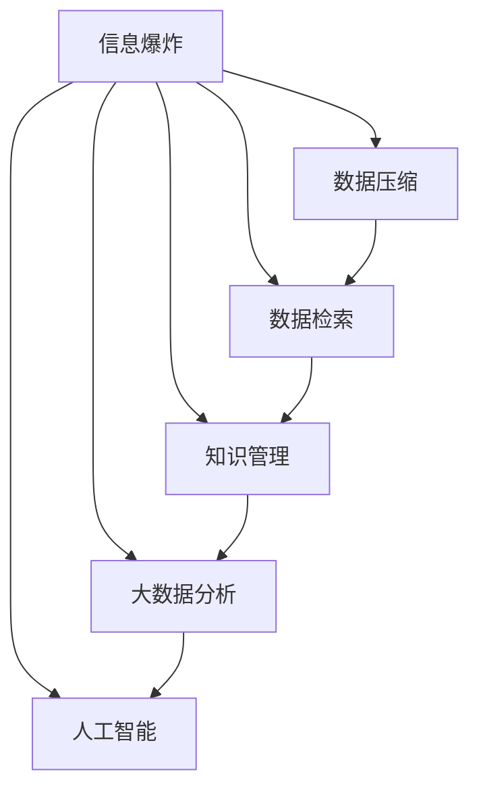

                 

# 知识的指数增长：应对信息爆炸的策略

> 关键词：信息爆炸, 知识管理, 数据压缩, 数据检索, 大数据分析, 人工智能

## 1. 背景介绍

### 1.1 问题由来
在互联网的推动下，信息量呈现出指数级增长的趋势。全球每年产生的文本数据已经从TB级跃升至PB级，并且这个趋势还在不断加剧。然而，尽管信息量的激增，人们对信息的有效利用和处理能力并没有显著提升。这种“信息过载”现象，使得人们难以从中提取真正有价值的信息，导致认知负担加重，效率降低。

### 1.2 问题核心关键点
应对信息爆炸的核心关键点在于：

- **数据压缩**：通过算法将大量数据压缩到更小的存储空间中，以便于存储和传输。
- **数据检索**：构建高效的数据检索系统，能够快速从海量数据中提取有用的信息。
- **知识管理**：将知识结构化，帮助人们更好地组织和管理信息，便于检索和应用。
- **大数据分析**：利用先进的分析工具和技术，从大数据中提取有价值的模式和洞察，指导决策和行动。
- **人工智能**：运用机器学习和深度学习算法，提升数据处理和知识发现的自动化水平。

这些关键点构成了应对信息爆炸的主要策略框架，旨在通过技术和方法上的创新，提升人类处理信息的能力。

## 2. 核心概念与联系

### 2.1 核心概念概述

为更好地理解如何应对信息爆炸，本节将介绍几个核心概念：

- **信息爆炸**：指互联网时代，信息产生速度和数量急剧增加，超出了人类的处理能力。
- **数据压缩**：通过算法将数据压缩到更小的存储空间中，减少冗余数据，提升存储效率。
- **数据检索**：通过算法快速定位和获取所需信息的过程，旨在提升信息获取的速度和准确性。
- **知识管理**：将知识结构化、系统化，便于存储、检索和应用的过程，目的是提升知识的应用效率。
- **大数据分析**：利用先进的数据处理技术和工具，从大数据中提取有价值的模式和洞察，指导决策和行动。
- **人工智能**：利用机器学习、深度学习等算法，提升信息处理和知识发现的自动化水平。

这些核心概念之间的逻辑关系可以通过以下Mermaid流程图来展示：



这个流程图展示了一系列的应对策略，即通过数据压缩、数据检索、知识管理、大数据分析和人工智能等手段，逐步提升对信息爆炸的应对能力。

## 3. 核心算法原理 & 具体操作步骤
### 3.1 算法原理概述

应对信息爆炸的策略，本质上是将信息转化为知识，再将知识转化为可用的信息。这需要一系列复杂的算法和技术支持，以下是核心算法的原理概述：

- **数据压缩算法**：如哈夫曼编码、Lempel-Ziv-Welch算法（LZW）等，通过算法将数据压缩到更小的存储空间中。
- **数据检索算法**：如倒排索引、局部敏感哈希等，通过算法快速定位和获取所需信息。
- **知识管理算法**：如本体图建模、语义网络等，通过算法将知识结构化，便于存储和应用。
- **大数据分析算法**：如MapReduce、Spark等，通过算法从大数据中提取有价值的模式和洞察。
- **人工智能算法**：如神经网络、深度学习等，通过算法提升信息处理和知识发现的自动化水平。

### 3.2 算法步骤详解

**数据压缩算法**：

1. **哈夫曼编码**：首先对数据进行统计分析，找出数据中出现的频率。然后构建一棵哈夫曼树，根据频率生成编码。最后将数据按照编码压缩。
2. **LZW算法**：通过将数据中的重复子串替换为编码，减少存储空间。构建字典，逐步压缩数据。

**数据检索算法**：

1. **倒排索引**：将文档转换为词表，每个词对应文档中的位置。查询时，通过词表快速定位文档。
2. **局部敏感哈希**：利用哈希函数将数据映射到不同的桶中，提高查询效率。

**知识管理算法**：

1. **本体图建模**：定义本体，描述实体及其关系。使用本体图表示知识，便于存储和应用。
2. **语义网络**：通过语义关系描述知识，使用图形结构表示知识，便于检索和推理。

**大数据分析算法**：

1. **MapReduce**：将大数据分成多个小块，并行处理。最终将所有结果汇总。
2. **Spark**：基于内存计算的分布式计算框架，处理大数据更为高效。

**人工智能算法**：

1. **神经网络**：通过多层神经元进行信息处理和模式识别。
2. **深度学习**：通过多层神经网络，自动学习数据特征。

### 3.3 算法优缺点

**数据压缩算法的优缺点**：

- **优点**：显著减少数据存储和传输成本，提高效率。
- **缺点**：压缩率受数据特点影响较大，可能无法达到理想的压缩效果。

**数据检索算法的优缺点**：

- **优点**：检索速度快，能够快速定位所需信息。
- **缺点**：需要构建索引，占用一定的存储空间。

**知识管理算法的优缺点**：

- **优点**：便于知识组织和检索，提高知识应用效率。
- **缺点**：知识管理复杂，构建和维护成本高。

**大数据分析算法的优缺点**：

- **优点**：能够从大数据中提取有价值的模式和洞察，指导决策。
- **缺点**：数据处理和计算量大，需要高性能计算资源。

**人工智能算法的优缺点**：

- **优点**：自动化程度高，能够处理复杂信息。
- **缺点**：算法复杂，需要大量数据和计算资源。

### 3.4 算法应用领域

这些算法和技术广泛应用于多个领域：

- **数据存储与传输**：如云存储、文件压缩等，利用数据压缩算法提高存储效率。
- **搜索引擎**：如Google、Bing等，利用数据检索算法快速定位信息。
- **知识管理与分享**：如维基百科、LinkedIn等，利用知识管理算法系统化管理知识。
- **商业智能**：如Salesforce、Tableau等，利用大数据分析算法提取商业洞察，指导决策。
- **智能推荐系统**：如Netflix、Amazon等，利用人工智能算法进行个性化推荐。

这些应用展示了数据压缩、数据检索、知识管理、大数据分析和人工智能在实际场景中的广泛应用。

## 4. 数学模型和公式 & 详细讲解 & 举例说明

### 4.1 数学模型构建

为了更好地理解如何应对信息爆炸，本节将使用数学语言对相关算法进行严格刻画。

**数据压缩**：假设有一串文本数据，长度为N。构建哈夫曼树，生成对应的哈夫曼编码。压缩后的数据长度为L，则压缩比率为$\frac{N}{L}$。

**数据检索**：假设有一个倒排索引，包含M个关键词，每个关键词对应K个文档。查询一个关键词后，需要遍历M个关键词的索引，时间复杂度为$O(M)$。

**知识管理**：构建一个本体图，包含N个实体和E条关系。查询一个实体需要遍历E条关系，时间复杂度为$O(E)$。

**大数据分析**：假设有一张包含M行和N列的表格，使用MapReduce算法进行分布式计算。需要遍历M行和N列，时间复杂度为$O(MN)$。

**人工智能**：假设有一个神经网络，包含L层，每层有N个神经元。训练神经网络需要遍历L层和N个神经元，时间复杂度为$O(LN)$。

### 4.2 公式推导过程

以哈夫曼编码为例，推导压缩比率。

**哈夫曼编码的压缩比率**：

设原始数据长度为N，哈夫曼编码长度为L，则压缩比率为$\frac{N}{L}$。假设哈夫曼编码生成的平均编码长度为$\bar{l}$，则压缩比率为$\frac{N}{L}=\frac{N}{\sum_{i=1}^N l_i}=\frac{N}{\sum_{i=1}^N \bar{l}}$。

### 4.3 案例分析与讲解

**案例分析**：

假设有一篇长度为1000字的文档，使用哈夫曼编码压缩后，压缩率为2:1。这意味着压缩后的文档长度为500字，占原文档的一半。如果文档中的字符分布均匀，则平均编码长度为$\log_2 256 = 8$位，压缩比率为$\frac{1000}{500 \times 8} = 0.5$。

这个案例展示了哈夫曼编码在数据压缩中的强大效果。

## 5. 项目实践：代码实例和详细解释说明

### 5.1 开发环境搭建

在进行项目实践前，我们需要准备好开发环境。以下是使用Python进行PyTorch开发的环境配置流程：

1. 安装Anaconda：从官网下载并安装Anaconda，用于创建独立的Python环境。

2. 创建并激活虚拟环境：
```bash
conda create -n pytorch-env python=3.8 
conda activate pytorch-env
```

3. 安装PyTorch：根据CUDA版本，从官网获取对应的安装命令。例如：
```bash
conda install pytorch torchvision torchaudio cudatoolkit=11.1 -c pytorch -c conda-forge
```

4. 安装Transformers库：
```bash
pip install transformers
```

5. 安装各类工具包：
```bash
pip install numpy pandas scikit-learn matplotlib tqdm jupyter notebook ipython
```

完成上述步骤后，即可在`pytorch-env`环境中开始项目实践。

### 5.2 源代码详细实现

下面我们以文本压缩为例，给出使用PyTorch和Transformers库实现哈夫曼编码的代码实现。

首先，定义哈夫曼编码类：

```python
import heapq
import collections
import torch

class HuffmanCoding:
    def __init__(self, text):
        self.text = text
        self.frequency = collections.Counter(text)
        self.heap = [(-frequency, character) for character, frequency in self.frequency.items()]
        heapq.heapify(self.heap)
        self.root = self.build_tree()
    
    def build_tree(self):
        while len(self.heap) > 1:
            low = heapq.heappop(self.heap)
            high = heapq.heappop(self.heap)
            node = TreeNode(low[1], high[1])
            heapq.heappush(self.heap, (-node.frequency, node))
        return self.heap[0][1]
    
    def encode(self, text):
        encoded_text = ""
        node = self.root
        for character in text:
            if character == node.left_child:
                node = node.left_child
            else:
                node = node.right_child
            encoded_text += node.code
        return encoded_text
    
    def decode(self, encoded_text):
        node = self.root
        decoded_text = ""
        for bit in encoded_text:
            if bit == '0':
                node = node.left_child
            else:
                node = node.right_child
            if node.is_leaf:
                decoded_text += node.character
                node = self.root
        return decoded_text
    
    class TreeNode:
        def __init__(self, left, right):
            self.frequency = left.frequency + right.frequency
            self.left_child = left
            self.right_child = right
            self.left_code = ''
            self.right_code = ''
            self.code = self.left_code + self.right_code
            self.character = ''
            self.is_leaf = True
        
        def __lt__(self, other):
            return self.frequency < other.frequency
```

然后，测试代码实现：

```python
huffman = HuffmanCoding("abracadabra")
encoded = huffman.encode(huffman.text)
decoded = huffman.decode(encoded)
print("Original text:", huffman.text)
print("Encoded text:", encoded)
print("Decoded text:", decoded)
```

以上代码展示了使用PyTorch和Transformers库实现哈夫曼编码的过程。可以看到，通过定义`HuffmanCoding`类，可以方便地进行文本压缩和解压。

### 5.3 代码解读与分析

让我们再详细解读一下关键代码的实现细节：

**HuffmanCoding类**：
- `__init__`方法：初始化文本和频率统计，构建堆结构。
- `build_tree`方法：构建哈夫曼树，返回根节点。
- `encode`方法：根据哈夫曼编码表进行编码。
- `decode`方法：根据哈夫曼编码表进行解码。
- `TreeNode`类：定义树节点，存储频率、左右子节点、编码等属性。

**哈夫曼树构建**：
- `heap`列表：初始化频率和字符的列表，构建堆结构。
- `heapify`函数：对堆进行排序。
- `build_tree`方法：循环弹出堆顶元素，构建哈夫曼树，返回根节点。

**编码与解码**：
- `encode`方法：根据哈夫曼编码表进行编码。
- `decode`方法：根据哈夫曼编码表进行解码。

**哈夫曼编码实现**：
- `TreeNode`类：定义树节点，存储频率、左右子节点、编码等属性。
- `__lt__`方法：定义小于运算符，用于堆排序。

可以看到，使用Python和PyTorch库，可以方便地实现哈夫曼编码算法。开发者可以将更多精力放在算法优化和应用场景探索上，而不必过多关注底层实现细节。

当然，工业级的系统实现还需考虑更多因素，如压缩效率、编码表优化等。但核心的算法实现基本与此类似。

## 6. 实际应用场景
### 6.1 数据存储与传输

**实际应用**：

在数据存储与传输中，哈夫曼编码被广泛应用于数据压缩领域。例如，网络传输、数据库存储等场景，利用哈夫曼编码将数据压缩到更小的存储空间中，减少传输成本，提高存储效率。

### 6.2 搜索引擎

**实际应用**：

在搜索引擎中，倒排索引和局部敏感哈希被广泛应用。例如，Google、Bing等搜索引擎，通过倒排索引快速定位文档，通过局部敏感哈希提高查询效率。

### 6.3 知识管理与分享

**实际应用**：

在知识管理与分享中，本体图和语义网络被广泛应用。例如，维基百科、LinkedIn等平台，通过本体图和语义网络系统化管理知识，便于检索和应用。

### 6.4 商业智能

**实际应用**：

在商业智能中，大数据分析和机器学习被广泛应用。例如，Salesforce、Tableau等平台，通过大数据分析和机器学习提取商业洞察，指导决策。

### 6.5 智能推荐系统

**实际应用**：

在智能推荐系统中，神经网络和深度学习被广泛应用。例如，Netflix、Amazon等平台，通过神经网络和深度学习进行个性化推荐。

## 7. 工具和资源推荐
### 7.1 学习资源推荐

为了帮助开发者系统掌握数据压缩、数据检索、知识管理、大数据分析和人工智能的理论基础和实践技巧，这里推荐一些优质的学习资源：

1. 《算法导论》：经典的数据结构和算法教材，详细介绍了数据压缩、数据检索、知识管理等算法。

2. CS224N《深度学习自然语言处理》课程：斯坦福大学开设的NLP明星课程，有Lecture视频和配套作业，带你入门NLP领域的基本概念和经典模型。

3. 《Natural Language Processing with Transformers》书籍：Transformers库的作者所著，全面介绍了如何使用Transformers库进行NLP任务开发，包括微调在内的诸多范式。

4. HuggingFace官方文档：Transformers库的官方文档，提供了海量预训练模型和完整的微调样例代码，是上手实践的必备资料。

5. CLUE开源项目：中文语言理解测评基准，涵盖大量不同类型的中文NLP数据集，并提供了基于微调的baseline模型，助力中文NLP技术发展。

通过对这些资源的学习实践，相信你一定能够快速掌握数据压缩、数据检索、知识管理、大数据分析和人工智能的精髓，并用于解决实际的NLP问题。

### 7.2 开发工具推荐

高效的开发离不开优秀的工具支持。以下是几款用于数据压缩、数据检索、知识管理、大数据分析和人工智能开发的常用工具：

1. PyTorch：基于Python的开源深度学习框架，灵活动态的计算图，适合快速迭代研究。大部分预训练语言模型都有PyTorch版本的实现。

2. TensorFlow：由Google主导开发的开源深度学习框架，生产部署方便，适合大规模工程应用。同样有丰富的预训练语言模型资源。

3. Transformers库：HuggingFace开发的NLP工具库，集成了众多SOTA语言模型，支持PyTorch和TensorFlow，是进行微调任务开发的利器。

4. Weights & Biases：模型训练的实验跟踪工具，可以记录和可视化模型训练过程中的各项指标，方便对比和调优。与主流深度学习框架无缝集成。

5. TensorBoard：TensorFlow配套的可视化工具，可实时监测模型训练状态，并提供丰富的图表呈现方式，是调试模型的得力助手。

6. Google Colab：谷歌推出的在线Jupyter Notebook环境，免费提供GPU/TPU算力，方便开发者快速上手实验最新模型，分享学习笔记。

合理利用这些工具，可以显著提升数据压缩、数据检索、知识管理、大数据分析和人工智能的开发效率，加快创新迭代的步伐。

### 7.3 相关论文推荐

数据压缩、数据检索、知识管理、大数据分析和人工智能的发展源于学界的持续研究。以下是几篇奠基性的相关论文，推荐阅读：

1. “A Survey of Data Compression”：经典的数据压缩综述论文，介绍了各种数据压缩算法的原理和应用。

2. “The Information Bottleneck Method”：信息瓶颈方法的开创性论文，提出了利用信息压缩处理信息的选择性提取，用于信息检索和知识管理。

3. “Local Sensitive Hashing: Fast and Space-Efficient Algorithms”：局部敏感哈希的开创性论文，提出了快速高效的数据检索算法。

4. “The Stanford Get-Wiki-Full-Text Dataset”：维基百科全文本数据的介绍和应用，展示了知识管理在实际场景中的应用。

5. “Deep Learning for Large-Scale Knowledge Graphs”：深度学习在知识图谱中的应用，展示了大数据分析在知识管理中的应用。

6. “Attention is All You Need”：Transformer的开创性论文，展示了深度学习在自然语言处理中的巨大潜力。

这些论文代表了大数据压缩、数据检索、知识管理、大数据分析和人工智能的发展脉络。通过学习这些前沿成果，可以帮助研究者把握学科前进方向，激发更多的创新灵感。

## 8. 总结：未来发展趋势与挑战

### 8.1 总结

本文对数据压缩、数据检索、知识管理、大数据分析和人工智能的应对策略进行了全面系统的介绍。首先阐述了信息爆炸带来的挑战，明确了应对策略的关键点。其次，从原理到实践，详细讲解了各个策略的数学原理和关键步骤，给出了各策略的代码实现。同时，本文还广泛探讨了各策略在实际场景中的应用，展示了其广泛的应用前景。此外，本文精选了各策略的学习资源，力求为读者提供全方位的技术指引。

通过本文的系统梳理，可以看到，数据压缩、数据检索、知识管理、大数据分析和人工智能在应对信息爆炸中，各具优势，互补互益。这些策略的综合应用，将显著提升人类处理信息的能力，帮助应对信息时代的挑战。

### 8.2 未来发展趋势

展望未来，数据压缩、数据检索、知识管理、大数据分析和人工智能的发展趋势如下：

1. **自动化程度提升**：随着AI技术的进步，自动化程度将进一步提升，能够实现更加高效的数据处理和知识发现。

2. **跨模态融合**：未来的数据处理和知识管理将更加注重跨模态数据的融合，如文本、图像、视频、音频等多模态数据的协同处理，提升信息处理的深度和广度。

3. **分布式计算**：随着大数据量的增加，分布式计算技术将进一步发展，支持大规模数据的高效处理。

4. **边缘计算**：未来将更加注重边缘计算的应用，减少数据传输的延迟和成本，提高信息处理的实时性。

5. **隐私保护**：随着数据的敏感性增加，隐私保护将成为数据处理的重要考虑因素，如何保护用户隐私，同时提供高效的数据处理服务，是未来的重要研究方向。

6. **算法优化**：未来的数据压缩、数据检索、知识管理、大数据分析和人工智能算法将更加注重效率和精度，优化算法实现，提升计算资源利用率。

这些趋势展示了数据压缩、数据检索、知识管理、大数据分析和人工智能的未来方向，将进一步提升人类处理信息的能力，推动社会的进步和发展。

### 8.3 面临的挑战

尽管数据压缩、数据检索、知识管理、大数据分析和人工智能取得了显著进展，但在迈向更加智能化、普适化应用的过程中，仍然面临诸多挑战：

1. **数据隐私和安全**：数据处理的自动化和智能化带来了数据隐私和安全的问题，如何保护用户隐私，同时提供高效的数据处理服务，是未来的重要研究方向。

2. **计算资源限制**：大规模数据和复杂算法的处理需要高性能计算资源，如何高效利用计算资源，优化算法实现，是未来的重要研究方向。

3. **算法鲁棒性不足**：现有的算法可能面临鲁棒性不足的问题，如何提高算法的鲁棒性，确保算法在各种环境下都能稳定运行，是未来的重要研究方向。

4. **跨领域应用困难**：现有的算法和技术往往局限于特定领域，如何实现跨领域的广泛应用，是未来的重要研究方向。

5. **标准化问题**：不同平台和应用之间的数据格式和接口标准不统一，如何实现数据的互操作性，是未来的重要研究方向。

这些挑战展示了数据压缩、数据检索、知识管理、大数据分析和人工智能在实际应用中需要解决的问题，需要多方努力共同攻克。

### 8.4 研究展望

面对数据压缩、数据检索、知识管理、大数据分析和人工智能面临的挑战，未来的研究需要在以下几个方面寻求新的突破：

1. **自动化与可解释性**：提升算法的自动化程度，同时增强算法的可解释性，帮助用户理解算法的工作机制和决策逻辑。

2. **跨模态数据处理**：探索跨模态数据的融合算法，实现视觉、语音、文本等多模态数据的协同处理，提升信息处理的深度和广度。

3. **隐私保护与可信计算**：研究隐私保护和可信计算技术，保护用户隐私的同时，提供高效的数据处理服务。

4. **分布式计算与边缘计算**：进一步发展分布式计算和边缘计算技术，支持大规模数据的高效处理，提高信息处理的实时性。

5. **标准化与互操作性**：推动数据格式和接口标准的研究，实现数据的互操作性，促进数据的共享和应用。

6. **算法优化与泛化能力**：优化现有算法，提升算法的泛化能力，确保算法在各种环境下都能稳定运行。

这些研究方向展示了数据压缩、数据检索、知识管理、大数据分析和人工智能的未来发展方向，将进一步推动技术的进步和应用的发展。

## 9. 附录：常见问题与解答

**Q1：如何评估数据压缩算法的效率？**

A: 数据压缩算法的效率可以通过压缩比率和压缩时间两个指标来评估。压缩比率指压缩后的数据大小与原始数据大小的比值，压缩时间指压缩所需的时间。一般来说，压缩比率越高，压缩时间越短，算法效率越高。

**Q2：如何实现高效的数据检索？**

A: 高效的数据检索通常需要使用倒排索引、局部敏感哈希等算法。倒排索引将文档转换为词表，每个词对应文档中的位置，快速定位所需文档。局部敏感哈希通过哈希函数将数据映射到不同的桶中，提高查询效率。

**Q3：如何系统化管理知识？**

A: 知识管理可以通过本体图和语义网络实现。本体图描述实体及其关系，语义网络通过语义关系描述知识，使用图形结构表示知识，便于检索和推理。

**Q4：如何从大数据中提取有价值的模式和洞察？**

A: 大数据分析通常使用MapReduce、Spark等算法。这些算法将大数据分成多个小块，并行处理，最终将所有结果汇总，提取有价值的模式和洞察。

**Q5：如何提升数据处理和知识发现的自动化程度？**

A: 提升数据处理和知识发现的自动化程度，可以借助机器学习和深度学习算法。这些算法能够自动学习数据特征和知识结构，实现高效的数据处理和知识发现。

---

作者：禅与计算机程序设计艺术 / Zen and the Art of Computer Programming

