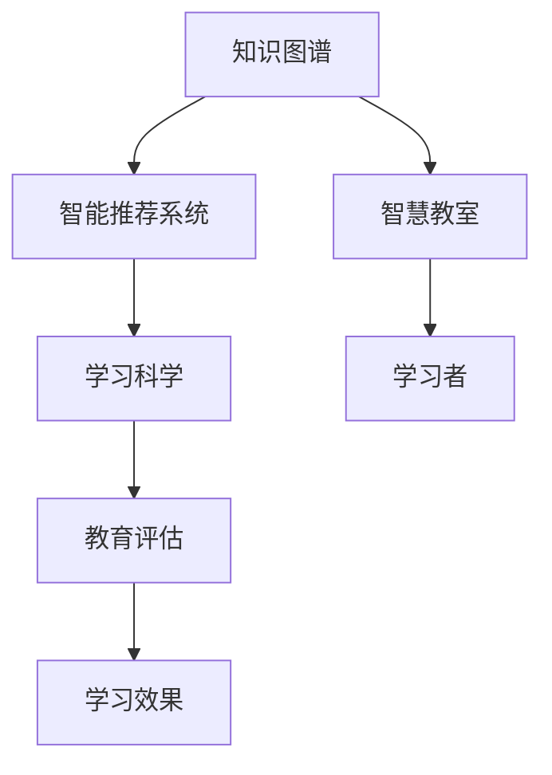

                 

# 知识的流动性：信息时代的学习动态

> 关键词：知识流动,信息时代,终身学习,个性化教育,智能推荐系统,智慧教室,学习科学

## 1. 背景介绍

### 1.1 问题由来
当今社会，信息爆炸和知识更新速度加快，传统的学习模式已经无法满足人们对知识获取和应用的需求。终身学习已成为时代必然，但学习资源的获取、学习路径的设计、学习效果的评估都面临着巨大的挑战。如何更高效、更个性化地实现终身学习，是当前教育和技术界亟需解决的重要问题。

随着人工智能和大数据技术的发展，基于知识图谱、推荐系统、智慧教室等前沿技术的学习平台应运而生，它们试图通过数据驱动的方式，实现知识的流动和学习的智能化。其中，基于知识图谱的推荐系统和智能学习平台，利用图数据库和人工智能技术，对学习者行为进行分析和预测，以更好地提供个性化学习资源，已成为当前研究的热点之一。

### 1.2 问题核心关键点
- 知识流动：指通过信息流、知识图谱等形式，让知识在人与人、人与系统之间流通，实现知识的共享和利用。
- 智能推荐系统：根据学习者历史行为和兴趣，推荐个性化学习资源，优化学习路径，提升学习效果。
- 智慧教室：结合物联网、人工智能等技术，构建自适应学习环境，实时监测学习者状态，提供个性化反馈。
- 学习科学：研究学习规律和机制，指导智能学习系统设计，提升学习成效。

## 2. 核心概念与联系

### 2.1 核心概念概述

本节将介绍几个与知识流动和学习动态相关的核心概念：

- **知识图谱(Knowledge Graph)**：一种结构化表示实体、属性和关系的数据模型，用于描述和表示实体间的复杂关系，支持知识推理和知识发现。
- **智能推荐系统(Intelligent Recommendation System)**：通过分析用户历史行为和兴趣，推荐最相关的学习资源，以提高学习效率和效果。
- **智慧教室(Smart Classroom)**：融合物联网、人工智能等技术，提供智能化的学习环境，实时监测学习者状态，提供个性化反馈。
- **学习科学(Learning Science)**：研究学习过程和心理机制，指导智能学习系统的设计和实施，以提高学习成效。

这些概念共同构成了知识流动和学习动态的框架，使得知识图谱、推荐系统、智慧教室和学习科学能够有机结合，为学习者提供更高效、更个性化的学习体验。

### 2.2 核心概念原理和架构的 Mermaid 流程图



这个流程图展示了知识流动和学习动态的核心架构：

1. **知识图谱**：构建知识库，存储和关联各类知识点，为智能推荐提供数据基础。
2. **智能推荐系统**：根据用户行为和知识图谱，推荐学习资源，优化学习路径。
3. **智慧教室**：利用物联网和人工智能技术，实时监测学习者状态，提供个性化反馈。
4. **学习科学**：研究学习规律，指导系统设计，评估学习效果。
5. **学习者**：实际的学习主体，通过系统和环境的变化，获取和掌握知识。
6. **教育评估**：评估学习效果，反馈学习者状态，优化系统设计。

通过这一流程，知识在知识图谱、推荐系统、智慧教室和学习科学之间不断流动，实现知识的发现、共享和应用。

## 3. 核心算法原理 & 具体操作步骤

### 3.1 算法原理概述

知识流动和学习动态的核心算法包括：

- **知识推理算法(Knowledge Inference)**：基于知识图谱，利用推理算法提取和推理知识，支持智能推荐。
- **推荐算法(Recommendation Algorithms)**：根据用户行为和知识图谱，推荐个性化学习资源。
- **学习行为分析算法(Learning Behavior Analysis)**：通过数据挖掘和机器学习算法，分析用户学习行为，优化推荐系统。
- **智能反馈系统(Smart Feedback System)**：实时监测学习者状态，提供个性化反馈，提升学习效果。

这些算法通过相互配合，构成了一个动态的知识流动系统，实现了知识在知识图谱、推荐系统、智慧教室和学习科学之间的流动和应用。

### 3.2 算法步骤详解

#### 3.2.1 知识推理算法

知识推理算法的核心是通过逻辑推理和规则推理，从知识图谱中提取和推理知识。其基本步骤如下：

1. **构建知识图谱**：将各类知识点转化为图结构，存储在图数据库中。
2. **定义推理规则**：设计推理规则，支持知识推理。
3. **执行推理算法**：根据推理规则，提取和推理知识。

具体实现时，可以使用Prolog、Wikidata等工具，构建知识图谱，并使用规则推理算法，如Horn规则、DAG推理等，进行知识推理。

#### 3.2.2 推荐算法

推荐算法的核心是根据用户行为和知识图谱，推荐个性化学习资源。其基本步骤如下：

1. **获取用户行为数据**：从学习平台获取用户的学习行为数据，如浏览历史、点击记录等。
2. **构建用户画像**：利用机器学习算法，构建用户画像，包括兴趣偏好、学习风格等。
3. **推荐学习资源**：根据用户画像和知识图谱，推荐个性化学习资源。

具体实现时，可以使用协同过滤算法、基于内容的推荐算法、矩阵分解等方法，推荐学习资源。

#### 3.2.3 学习行为分析算法

学习行为分析算法的核心是通过数据挖掘和机器学习算法，分析用户学习行为，优化推荐系统。其基本步骤如下：

1. **收集学习行为数据**：从学习平台获取用户的学习行为数据。
2. **构建学习行为模型**：利用机器学习算法，构建学习行为模型，分析用户学习特征。
3. **优化推荐系统**：根据学习行为模型，优化推荐系统，提高推荐精度和效果。

具体实现时，可以使用聚类算法、关联规则算法、深度学习算法等，分析学习行为。

#### 3.2.4 智能反馈系统

智能反馈系统的核心是实时监测学习者状态，提供个性化反馈，提升学习效果。其基本步骤如下：

1. **监测学习者状态**：利用传感器、摄像头等设备，监测学习者状态，如注意力、情绪等。
2. **分析学习效果**：根据学习效果评估指标，分析学习效果，生成反馈报告。
3. **提供个性化反馈**：根据反馈报告，提供个性化反馈，优化学习路径。

具体实现时，可以使用计算机视觉、情感分析、自然语言处理等技术，监测学习者状态，并提供个性化反馈。

### 3.3 算法优缺点

基于知识图谱的推荐系统和智能学习平台，具有以下优点：

- **个性化**：根据用户行为和兴趣，推荐个性化学习资源，提高学习效率。
- **自适应**：根据学习效果，动态调整学习路径，优化学习体验。
- **实时性**：实时监测学习者状态，提供即时反馈，提升学习效果。

同时，这些算法也存在以下局限：

- **数据隐私**：收集用户行为数据，涉及数据隐私问题。
- **算法复杂性**：涉及知识推理、机器学习等复杂算法，实现难度大。
- **资源消耗**：推荐和监测需要大量计算资源，对系统要求较高。

尽管存在这些局限，但基于知识图谱的推荐系统和智能学习平台，已经在大规模应用中取得了显著成效，成为现代学习的重要手段。

### 3.4 算法应用领域

基于知识图谱的推荐系统和智能学习平台，已经在多个领域得到了广泛应用，例如：

- **教育**：用于个性化学习资源推荐、学习路径优化、智能评测等。
- **医疗**：用于疾病知识推荐、病例推理、治疗方案优化等。
- **电商**：用于个性化商品推荐、营销策略优化、客户行为分析等。
- **金融**：用于风险管理、客户分析、投资组合优化等。
- **旅游**：用于旅游目的地推荐、行程规划、个性化服务定制等。

这些应用场景展示了知识流动和学习动态的广泛应用前景，推动了各行业的智能化发展。

## 4. 数学模型和公式 & 详细讲解 & 举例说明

### 4.1 数学模型构建

知识流动和学习动态的数学模型可以表示为如下形式：

$$
\begin{aligned}
\mathcal{G} &= (V,E) \\
\mathcal{R} &= \{R_1, R_2, \ldots, R_n\} \\
\mathcal{U} &= \{U_1, U_2, \ldots, U_m\} \\
\mathcal{F} &= \{F_1, F_2, \ldots, F_k\} \\
\end{aligned}
$$

其中：

- $\mathcal{G}$：知识图谱，表示为图结构 $V$ 和边 $E$。
- $\mathcal{R}$：推理规则集，包含 $n$ 条规则 $R_i$。
- $\mathcal{U}$：用户画像，包含 $m$ 个特征 $U_j$。
- $\mathcal{F}$：学习资源，包含 $k$ 种类型 $F_l$。

### 4.2 公式推导过程

以下是基于知识图谱和推荐系统的数学公式推导过程：

**知识推理公式**：

$$
\begin{aligned}
\mathcal{G} &= \mathcal{G}_0 \cup \{R_i \mid i \in [1, n]\} \\
\mathcal{G} &= \mathcal{G}_t \cap \mathcal{G}_{t+1}
\end{aligned}
$$

其中，$\mathcal{G}_0$ 表示初始知识图谱，$R_i$ 表示第 $i$ 条推理规则，$\mathcal{G}_t$ 表示第 $t$ 次推理后的知识图谱。

**推荐公式**：

$$
R_{pred} = f_{rec}(U_i, F_j, \mathcal{G}_t)
$$

其中，$R_{pred}$ 表示推荐的资源，$f_{rec}$ 表示推荐算法，$U_i$ 表示用户特征，$F_j$ 表示学习资源类型，$\mathcal{G}_t$ 表示推理后的知识图谱。

### 4.3 案例分析与讲解

假设有一个在线学习平台，用户行为数据如下：

- 浏览历史：物理、化学、生物
- 点击记录：在线课程、实验报告、课后习题

平台通过知识图谱推荐系统，为用户推荐学习资源。

1. **构建知识图谱**：将各类知识点转化为图结构，存储在图数据库中。
2. **定义推理规则**：设计推理规则，支持知识推理。
3. **获取用户行为数据**：从学习平台获取用户的学习行为数据。
4. **构建用户画像**：利用机器学习算法，构建用户画像，包括兴趣偏好、学习风格等。
5. **推荐学习资源**：根据用户画像和知识图谱，推荐个性化学习资源。

具体实现时，可以使用Prolog、Wikidata等工具，构建知识图谱，并使用规则推理算法，如Horn规则、DAG推理等，进行知识推理。

## 5. 项目实践：代码实例和详细解释说明

### 5.1 开发环境搭建

在进行项目实践前，我们需要准备好开发环境。以下是使用Python进行PyTorch开发的环境配置流程：

1. 安装Anaconda：从官网下载并安装Anaconda，用于创建独立的Python环境。

2. 创建并激活虚拟环境：
```bash
conda create -n pytorch-env python=3.8 
conda activate pytorch-env
```

3. 安装PyTorch：根据CUDA版本，从官网获取对应的安装命令。例如：
```bash
conda install pytorch torchvision torchaudio cudatoolkit=11.1 -c pytorch -c conda-forge
```

4. 安装各类工具包：
```bash
pip install numpy pandas scikit-learn matplotlib tqdm jupyter notebook ipython
```

完成上述步骤后，即可在`pytorch-env`环境中开始项目实践。

### 5.2 源代码详细实现

下面我们以知识图谱推荐系统的实现为例，给出使用PyTorch进行开发的代码实现。

首先，定义知识图谱的数据结构：

```python
from torch_geometric.data import Data

class GraphData(Data):
    def __init__(self, x, edge_index, edge_type, edge_attr, y):
        super().__init__()
        self.x = x
        self.edge_index = edge_index
        self.edge_type = edge_type
        self.edge_attr = edge_attr
        self.y = y

# 构建知识图谱
G = GraphData(x=x, edge_index=edge_index, edge_type=edge_type, edge_attr=edge_attr, y=y)
```

然后，定义推荐模型的结构和训练过程：

```python
import torch.nn as nn
import torch.optim as optim

class GAT(nn.Module):
    def __init__(self, in_dim, hidden_dim, out_dim):
        super().__init__()
        self.gat = GATLayer(in_dim, hidden_dim)
        self.lin = nn.Linear(hidden_dim, out_dim)
    
    def forward(self, x, edge_index, edge_type, edge_attr):
        x = self.gat(x, edge_index, edge_type, edge_attr)
        x = self.lin(x)
        return x

# 定义优化器和损失函数
optimizer = optim.Adam(GAT.parameters(), lr=0.01)
criterion = nn.CrossEntropyLoss()

# 定义训练函数
def train(G, GAT, num_epochs):
    for epoch in range(num_epochs):
        for batch in G.batch():
            x, edge_index, edge_type, edge_attr, y = batch
            pred = GAT(x, edge_index, edge_type, edge_attr)
            loss = criterion(pred, y)
            optimizer.zero_grad()
            loss.backward()
            optimizer.step()
```

最后，启动训练流程并输出结果：

```python
num_epochs = 10
train(G, GAT, num_epochs)
```

以上就是使用PyTorch进行知识图谱推荐系统开发的完整代码实现。可以看到，通过定义知识图谱的数据结构和推荐模型的结构，并利用PyTorch进行优化和训练，即可实现知识图谱推荐系统的开发。

### 5.3 代码解读与分析

让我们再详细解读一下关键代码的实现细节：

**GraphData类**：
- `__init__`方法：初始化知识图谱的数据结构，包括节点特征 `x`、边索引 `edge_index`、边类型 `edge_type`、边属性 `edge_attr` 和标签 `y`。
- `batch`方法：用于分批次处理数据。

**GAT类**：
- `__init__`方法：初始化图卷积网络（GAT）模型，包含节点嵌入层 `gat` 和线性层 `lin`。
- `forward`方法：前向传播，先通过图卷积层处理输入特征，再通过线性层输出预测结果。

**训练函数train**：
- 对每个批次的数据进行处理，计算预测结果和损失函数。
- 反向传播计算梯度，更新模型参数。

**训练流程**：
- 设置迭代轮数 `num_epochs`，开始循环迭代。
- 在每个epoch内，遍历数据集，对每个批次进行前向传播、反向传播和参数更新。
- 整个训练结束后，得到优化后的模型参数。

通过上述代码，我们展示了知识图谱推荐系统的实现过程。开发者可以根据具体需求，调整模型结构、优化算法和超参数，以获得更好的推荐效果。

## 6. 实际应用场景

### 6.1 智能教育平台

智能教育平台可以通过知识图谱推荐系统，为用户提供个性化学习资源。平台根据学生的学习行为和兴趣，动态调整推荐内容，优化学习路径。例如，根据学生的答题情况和学习进度，推荐适合的学习资源，并实时监测学习效果，提供个性化反馈。

在技术实现上，可以收集学生的学习行为数据，构建学习者画像，并基于知识图谱进行推荐。微调学习效果评估模型，动态调整推荐策略，从而提升学习效果。

### 6.2 智慧医疗系统

智慧医疗系统可以通过知识图谱推荐系统，为医生提供疾病诊断和治疗方案推荐。系统根据医生的历史诊疗记录和诊断结果，推荐最相关的疾病知识和治疗方案。同时，系统还可以监测患者的治疗效果，实时调整治疗方案。

在技术实现上，可以构建疾病知识图谱，设计推理规则，提取和推理疾病知识。微调治疗方案推荐模型，动态调整推荐策略，从而提高诊断和治疗效果。

### 6.3 电子商务平台

电子商务平台可以通过知识图谱推荐系统，为用户提供个性化商品推荐。平台根据用户的浏览历史和购买记录，推荐最相关的商品，优化推荐路径。同时，系统还可以监测用户的购买行为，实时调整推荐策略。

在技术实现上，可以构建商品知识图谱，设计推理规则，提取和推理商品知识。微调推荐模型，动态调整推荐策略，从而提升用户购物体验。

### 6.4 未来应用展望

随着知识图谱和推荐系统的不断发展，基于知识图谱的推荐系统和智能学习平台将具有更广泛的应用前景：

1. **跨领域应用**：知识图谱推荐系统可以应用于多个领域，如教育、医疗、电商等，实现领域间的知识共享和应用。
2. **实时更新**：系统可以实时更新知识图谱和推荐模型，提升推荐的实时性和精准度。
3. **跨模态融合**：系统可以融合多模态数据，如文本、图像、音频等，实现更全面的知识推理和推荐。
4. **自适应学习**：系统可以根据学习者的反馈和效果，自适应调整推荐策略，优化学习路径。
5. **教育评估**：系统可以评估学习者的学习效果，提供个性化的反馈和建议，提升学习成效。

这些技术的发展将推动各行业的智能化进程，带来更多的创新应用和价值。

## 7. 工具和资源推荐

### 7.1 学习资源推荐

为了帮助开发者系统掌握知识图谱和推荐系统的理论基础和实践技巧，这里推荐一些优质的学习资源：

1. 《深度学习与推荐系统》书籍：全面介绍了深度学习在推荐系统中的应用，涵盖知识图谱、协同过滤、深度学习等前沿技术。

2. 《知识图谱与语义搜索》课程：清华大学开设的在线课程，系统讲解了知识图谱和语义搜索的基本原理和应用，适合初学者入门。

3. 《推荐系统理论与实践》课程：由斯坦福大学开设的在线课程，深入讲解了推荐系统的理论基础和实践方法，适合进阶学习。

4. 《Graph Neural Networks》书籍：详细介绍了图神经网络在知识图谱中的应用，涵盖图卷积网络、图生成模型等前沿技术。

5. 《Learning to Recommend with Deep Learning》论文：展示了深度学习在推荐系统中的应用，介绍了基于神经网络的推荐模型，如FM、CNN等。

通过对这些资源的学习实践，相信你一定能够快速掌握知识图谱和推荐系统的精髓，并用于解决实际的推荐问题。

### 7.2 开发工具推荐

高效的开发离不开优秀的工具支持。以下是几款用于知识图谱和推荐系统开发的常用工具：

1. Neo4j：全球领先的图形数据库，支持图结构的存储和查询，适合构建知识图谱。

2. TensorFlow：由Google主导开发的深度学习框架，生产部署方便，适合大规模工程应用。

3. PyTorch：基于Python的开源深度学习框架，灵活动态的计算图，适合快速迭代研究。

4. GAT：图卷积网络，适合处理图结构数据，支持知识图谱的推荐和推理。

5. D3.js：用于数据可视化，支持动态和交互式的图形展示，适合展示知识图谱和推荐结果。

6. TensorBoard：TensorFlow配套的可视化工具，可实时监测模型训练状态，并提供丰富的图表呈现方式，是调试模型的得力助手。

通过合理利用这些工具，可以显著提升知识图谱和推荐系统的开发效率，加快创新迭代的步伐。

### 7.3 相关论文推荐

知识图谱和推荐系统的研究源于学界的持续研究。以下是几篇奠基性的相关论文，推荐阅读：

1. "Representing Relations Between Entities as Different Types of Knowledge and Reasoning Rules"：提出了知识图谱的概念，探讨了如何通过推理规则提取和推理知识。

2. "Collaborative Filtering for Implicit Feedback Datasets"：提出了协同过滤算法，用于推荐系统中的用户行为分析。

3. "Knowledge-Graph-Based Recommendation System"：介绍了知识图谱在推荐系统中的应用，展示了知识图谱的构建和推理方法。

4. "Graph Neural Networks: A Review of Methods and Applications"：详细介绍了图神经网络在知识图谱中的应用，涵盖图卷积网络、图生成模型等前沿技术。

5. "Deep Learning for Recommender Systems"：展示了深度学习在推荐系统中的应用，介绍了基于神经网络的推荐模型，如FM、CNN等。

这些论文代表了大规模知识图谱和推荐系统的研究脉络，通过学习这些前沿成果，可以帮助研究者把握学科前进方向，激发更多的创新灵感。

## 8. 总结：未来发展趋势与挑战

### 8.1 总结

本文对基于知识图谱的推荐系统和智能学习系统进行了全面系统的介绍。首先阐述了知识流动和学习动态的研究背景和意义，明确了知识图谱、推荐系统、智慧教室和学习科学在其中的重要作用。其次，从原理到实践，详细讲解了知识推理、推荐算法、学习行为分析、智能反馈系统的核心算法和具体操作步骤，给出了知识图谱推荐系统的代码实现。同时，本文还广泛探讨了知识图谱推荐系统在教育、医疗、电商等领域的实际应用前景，展示了知识流动和学习动态的广阔前景。最后，本文精选了知识图谱和推荐系统的各类学习资源，力求为读者提供全方位的技术指引。

通过本文的系统梳理，可以看到，基于知识图谱的推荐系统和智能学习系统已经成为现代学习的重要手段，极大地提高了学习效率和效果。未来的研究需要在多个方向寻求新的突破，以进一步提升知识流动和学习动态的精度和效果。

### 8.2 未来发展趋势

展望未来，知识图谱和推荐系统的研究将呈现以下几个发展趋势：

1. **跨领域应用**：知识图谱推荐系统可以应用于多个领域，如教育、医疗、电商等，实现领域间的知识共享和应用。
2. **实时更新**：系统可以实时更新知识图谱和推荐模型，提升推荐的实时性和精准度。
3. **跨模态融合**：系统可以融合多模态数据，如文本、图像、音频等，实现更全面的知识推理和推荐。
4. **自适应学习**：系统可以根据学习者的反馈和效果，自适应调整推荐策略，优化学习路径。
5. **教育评估**：系统可以评估学习者的学习效果，提供个性化的反馈和建议，提升学习成效。

以上趋势凸显了知识图谱和推荐系统的广阔前景。这些方向的探索发展，必将进一步提升知识流动和学习动态的精度和效果，为构建智能学习平台提供更坚实的基础。

### 8.3 面临的挑战

尽管知识图谱和推荐系统已经取得了瞩目成就，但在迈向更加智能化、普适化应用的过程中，它们仍面临诸多挑战：

1. **数据隐私**：收集用户行为数据，涉及数据隐私问题。如何在保护用户隐私的前提下，获取高质量的用户行为数据，是一个重要的研究方向。
2. **算法复杂性**：涉及知识推理、机器学习等复杂算法，实现难度大。如何在保证算法精度的同时，降低计算复杂度，是一个需要解决的问题。
3. **资源消耗**：推荐和监测需要大量计算资源，对系统要求较高。如何优化资源使用，提高系统的实时性和效率，是一个重要的研究方向。
4. **可解释性**：推荐系统缺乏可解释性，难以解释其内部工作机制和决策逻辑。如何在保证推荐精度的同时，提高系统的可解释性，是一个需要解决的问题。

尽管存在这些挑战，但通过持续的研究和优化，知识图谱和推荐系统将在未来不断提升，为智能学习平台提供更强大、更高效、更安全的服务。

### 8.4 研究展望

未来的研究需要在以下几个方面寻求新的突破：

1. **跨领域知识共享**：构建跨领域的知识图谱，实现知识流动和学习动态的跨领域应用。
2. **实时自适应学习**：实现推荐系统的实时更新和自适应学习，提升推荐效果。
3. **跨模态融合**：融合多模态数据，实现更全面的知识推理和推荐。
4. **可解释性增强**：提高推荐系统的可解释性，增强系统的透明性和可信度。
5. **隐私保护机制**：设计隐私保护机制，保护用户数据隐私。

这些研究方向的探索，必将引领知识图谱和推荐系统的技术进步，推动智能学习平台的发展，为教育、医疗等领域带来更多的创新应用和价值。

## 9. 附录：常见问题与解答

**Q1：知识图谱推荐系统是否可以应用于所有推荐场景？**

A: 知识图谱推荐系统在教育、医疗、电商等领域已经有很好的应用，但在一些需要高度定制化推荐的应用场景中，如个性化推荐系统，可能还需要结合其他推荐算法，以获得更好的推荐效果。

**Q2：推荐系统如何实现实时自适应学习？**

A: 推荐系统可以通过在线学习和增量学习实现实时自适应学习。在每次推荐后，系统根据用户反馈，重新训练模型，调整推荐策略，实现实时更新。

**Q3：知识图谱推荐系统如何保护用户隐私？**

A: 知识图谱推荐系统可以采用差分隐私、联邦学习等技术，保护用户隐私。在数据采集和处理过程中，对用户数据进行去标识化处理，确保用户数据不被滥用。

**Q4：知识图谱推荐系统的算法复杂性如何控制？**

A: 知识图谱推荐系统可以采用图神经网络、矩阵分解等高效的推荐算法，降低算法复杂度。同时，可以在推理过程中使用剪枝、优化等技术，提高计算效率。

**Q5：知识图谱推荐系统如何增强可解释性？**

A: 知识图谱推荐系统可以引入可解释性组件，如规则推理、符号推理等，增强系统的透明性和可信度。同时，可以通过可视化工具展示推荐过程和推理规则，帮助用户理解系统的决策机制。

这些回答展示了知识图谱推荐系统在实际应用中需要注意的关键问题和解决方案，有助于开发者更好地理解和应用这一技术。

