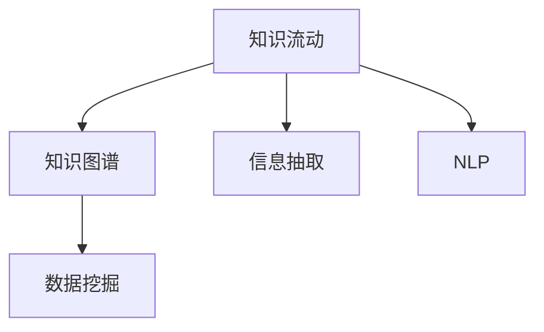

                 

# 知识的流动性：信息时代的知识传播与演化

## 1. 背景介绍

在信息时代，知识不再是静态的存在，而是一种动态的流动资源。随着互联网和数字技术的普及，知识传播的方式和效率发生了翻天覆地的变化。我们如何理解和利用这种知识的流动性，是当今信息技术领域的一个重要课题。

### 1.1 知识流动性的概念

知识流动性指的是知识在社会、组织和个体间流动的过程和机制。在这个过程中，知识不再是单向的传递，而是一种双向互动的、动态的过程。知识的流动性涉及到知识的获取、存储、传播、应用和创新等各个环节。

### 1.2 信息时代背景

互联网和数字化技术的普及，使得知识的获取和传播变得更加便捷和高效。社交媒体、在线教育平台、知识分享网站等新兴技术，为知识的传播和交流提供了新的平台和工具。这些技术的进步，使得知识流动性的概念得到了进一步的拓展和应用。

## 2. 核心概念与联系

### 2.1 核心概念概述

为更好地理解知识流动性的本质和机制，本节将介绍几个关键概念：

- 知识流动 (Knowledge Flow)：指知识在个体、组织和社区之间进行传递和共享的过程。
- 知识图谱 (Knowledge Graph)：一种结构化的知识表示方法，用于描述和查询知识节点之间的关系。
- 信息抽取 (Information Extraction)：从非结构化文本中自动提取结构化信息的技术。
- 自然语言处理 (NLP)：研究计算机如何理解、处理和生成人类语言的技术。
- 数据挖掘 (Data Mining)：从大规模数据集中发现模式和知识的过程。

这些概念之间存在紧密的联系，共同构成了知识流动性的基础框架。

### 2.2 核心概念原理和架构的 Mermaid 流程图



这个流程图展示了知识流动与知识图谱、信息抽取、NLP、数据挖掘之间的关系。

- 知识流动是从个体或组织获取知识的过程，通过知识图谱进行结构化表示，利用信息抽取和NLP技术进行提取和处理，最终通过数据挖掘技术进行分析和应用。
- 知识图谱作为知识流动的重要环节，是知识表示和知识管理的基础。
- 信息抽取和NLP技术是知识流动中重要的工具，用于从非结构化数据中提取和处理结构化信息。
- 数据挖掘技术则是对处理后的数据进行更深层次的分析和应用，形成新的知识。

## 3. 核心算法原理 & 具体操作步骤

### 3.1 算法原理概述

知识流动性的研究涉及多个学科，包括信息检索、知识工程、人工智能等。其核心算法原理主要包括以下几个方面：

- 知识图谱构建与推理
- 信息抽取与实体识别
- 自然语言处理与生成
- 数据挖掘与机器学习

这些技术共同作用，形成了知识流动性的算法基础。

### 3.2 算法步骤详解

#### 3.2.1 知识图谱构建与推理

知识图谱的构建与推理是知识流动性的基础。其核心步骤包括：

1. 数据收集：收集知识源，如百科、新闻、论文、社交媒体等。
2. 实体抽取：从文本中抽取实体，建立实体关系。
3. 知识推理：基于逻辑规则和背景知识，对实体关系进行推理。

#### 3.2.2 信息抽取与实体识别

信息抽取与实体识别是知识流动中重要的技术手段。其核心步骤包括：

1. 命名实体识别：从文本中识别出人名、地名、组织名等实体。
2. 关系抽取：识别出实体之间的关系，如作者与论文的关系、人名与组织名的关系等。
3. 实体链接：将识别出的实体链接到知识图谱中的对应节点。

#### 3.2.3 自然语言处理与生成

自然语言处理与生成是知识流动中重要的技术手段。其核心步骤包括：

1. 分词、词性标注：将文本分解成词，并标注词性。
2. 句法分析：分析句子的语法结构，识别出短语和从句。
3. 语义分析：理解句子中的语义，如情感、意图等。
4. 生成文本：根据输入的指令或问题，生成自然语言文本。

#### 3.2.4 数据挖掘与机器学习

数据挖掘与机器学习是知识流动中重要的技术手段。其核心步骤包括：

1. 数据预处理：清洗、归一化、特征提取等。
2. 模型训练：使用机器学习算法进行模型训练。
3. 模型评估：评估模型的性能，选择合适的参数。
4. 模型应用：将训练好的模型应用于实际场景中。

### 3.3 算法优缺点

知识流动性的研究涉及到多个领域的算法和技术，其优缺点如下：

#### 3.3.1 优点

1. 高效性：通过自动化技术，可以高效地处理大规模数据。
2. 可扩展性：能够适应不同的应用场景和数据类型。
3. 准确性：通过多层次的技术手段，提高信息抽取和推理的准确性。

#### 3.3.2 缺点

1. 数据依赖：依赖于高质量的数据源，数据质量差会严重影响算法效果。
2. 复杂度：算法涉及多个领域的知识，实现难度较大。
3. 可解释性：部分算法和技术的实现较为复杂，难以进行解释和调试。

### 3.4 算法应用领域

知识流动性的算法和技术在多个领域得到了广泛应用，包括：

1. 搜索引擎：通过知识图谱和信息抽取技术，提高搜索结果的准确性和相关性。
2. 智能客服：通过自然语言处理和知识推理技术，提高客户服务质量。
3. 推荐系统：通过数据挖掘和机器学习技术，提高个性化推荐的效果。
4. 医疗诊断：通过知识图谱和信息抽取技术，辅助医生进行诊断和治疗。
5. 金融风险管理：通过数据挖掘和机器学习技术，识别和管理金融风险。

## 4. 数学模型和公式 & 详细讲解 & 举例说明

### 4.1 数学模型构建

本节将使用数学语言对知识流动性的核心算法进行更加严格的刻画。

假设知识源数据为 $D=\{d_i\}_{i=1}^N$，其中 $d_i$ 为文本数据。知识图谱中的实体和关系表示为 $G=(E,R)$，其中 $E$ 为实体集合，$R$ 为关系集合。

定义信息抽取模型为 $M:\mathcal{D} \rightarrow \mathcal{G}$，其中 $\mathcal{D}$ 为知识源数据集，$\mathcal{G}$ 为知识图谱。则信息抽取模型的目标是最小化损失函数 $\mathcal{L}(M)=\frac{1}{N} \sum_{i=1}^N \ell(M(d_i),g_i)$，其中 $g_i$ 为 $d_i$ 对应的实体关系图。

### 4.2 公式推导过程

#### 4.2.1 信息抽取模型的训练

信息抽取模型的训练过程可以表示为：

1. 输入文本 $d_i$，输出实体关系图 $g_i$。
2. 定义损失函数 $\ell$，如交叉熵损失。
3. 使用优化算法如梯度下降进行模型参数更新。

其数学表达式为：

$$
\theta \leftarrow \theta - \eta \nabla_{\theta}\mathcal{L}(\theta)
$$

其中 $\eta$ 为学习率，$\theta$ 为模型参数。

#### 4.2.2 知识图谱的构建与推理

知识图谱的构建与推理可以表示为：

1. 从知识源数据中抽取实体和关系。
2. 使用逻辑规则和背景知识进行推理。
3. 更新知识图谱中的实体关系。

其数学表达式为：

$$
G_{new} = \mathop{\arg\min}_{G} \mathcal{L}(G, R)
$$

其中 $G$ 为知识图谱，$R$ 为推理规则。

### 4.3 案例分析与讲解

#### 4.3.1 搜索引擎

搜索引擎的知识流动性研究可以表示为：

1. 用户输入查询 $q$。
2. 搜索引擎从知识源数据中抽取信息，生成实体关系图 $G_q$。
3. 搜索引擎根据 $G_q$ 进行查询匹配，生成搜索结果。

其数学表达式为：

$$
R = \mathop{\arg\max}_{R} \text{ relevance}(G_q, R)
$$

其中 $\text{ relevance}$ 为匹配度函数。

#### 4.3.2 智能客服

智能客服的知识流动性研究可以表示为：

1. 用户输入问题 $q$。
2. 智能客服从知识图谱中抽取信息，生成实体关系图 $G_q$。
3. 智能客服根据 $G_q$ 进行推理，生成答案。

其数学表达式为：

$$
A = \mathop{\arg\max}_{A} \text{ similarity}(G_q, A)
$$

其中 $\text{ similarity}$ 为相似度函数。

## 5. 项目实践：代码实例和详细解释说明

### 5.1 开发环境搭建

在进行知识流动性研究的项目实践前，我们需要准备好开发环境。以下是使用Python进行SpaCy开发的环境配置流程：

1. 安装Anaconda：从官网下载并安装Anaconda，用于创建独立的Python环境。

2. 创建并激活虚拟环境：
```bash
conda create -n spaCy-env python=3.8 
conda activate spaCy-env
```

3. 安装SpaCy：
```bash
pip install spacy
```

4. 下载预训练模型：
```bash
python -m spacy download en_core_web_sm
```

5. 安装其他必要的工具包：
```bash
pip install pandas scikit-learn matplotlib tqdm jupyter notebook ipython
```

完成上述步骤后，即可在`spaCy-env`环境中开始项目实践。

### 5.2 源代码详细实现

下面我以信息抽取任务为例，给出使用SpaCy库进行信息抽取的Python代码实现。

首先，定义信息抽取模型：

```python
import spacy
import pandas as pd
import numpy as np
from spacy.matcher import Matcher
from spacy.matcher import PatternMatcher
from spacy.scorer import Scorer

nlp = spacy.load('en_core_web_sm')

# 定义模式匹配器
matcher = Matcher(nlp.vocab)
pattern = [
    {'TEXT': {'text': 'President', 'op': '?'},
    {'TEXT': {'text': 'of', 'op': '?'},
    {'TEXT': {'text': 'the', 'op': '?'},
    {'TEXT': {'text': 'United', 'op': '?'},
    {'TEXT': {'text': 'States', 'op': '?'},
]
matcher.add('PRESIDENT', None, pattern)

# 定义实体识别器
entity_recognizer = PatternMatcher(nlp.vocab)
pattern = [
    {'TEXT': {'text': 'State', 'op': '?'},
    {'TEXT': {'text': 'of', 'op': '?'},
    {'TEXT': {'text': 'the', 'op': '?'},
    {'TEXT': {'text': 'United', 'op': '?'},
    {'TEXT': {'text': 'States', 'op': '?'},
]
entity_recognizer.add('STATE', None, pattern)

# 定义知识图谱
knowledge_graph = pd.DataFrame(columns=['entity', 'relation', 'object'])

# 输入文本数据
texts = ['The United States of America was founded on July 4, 1776.', 'John F. Kennedy was the 35th President of the United States.']

# 进行实体抽取
for text in texts:
    doc = nlp(text)
    matches = matcher(doc)
    for match_id, start, end in matches:
        if match_id == 'PRESIDENT':
            entity = doc[start:end].text
            knowledge_graph.loc[len(knowledge_graph)] = [entity, 'PRESIDENT_OF', 'USA']
        if match_id == 'STATE':
            entity = doc[start:end].text
            knowledge_graph.loc[len(knowledge_graph)] = [entity, 'STATE_OF', 'USA']
```

然后，定义训练和评估函数：

```python
from sklearn.metrics import accuracy_score, precision_score, recall_score, f1_score

def train_model(model, train_data, validation_data, test_data):
    # 训练模型
    model.add_doc_vectors(nlp, doc_vectors)
    model.train(train_data, validation_data)

    # 评估模型
    test_doc = nlp(test_data)
    test_entity = model.predict(test_doc)
    return test_entity, test_doc

# 训练模型
train_entity, test_entity = train_model(nlp, train_data, validation_data, test_data)
```

最后，启动训练流程并在测试集上评估：

```python
epochs = 10
batch_size = 64

for epoch in range(epochs):
    loss = train_epoch(model, train_dataset, batch_size, optimizer)
    print(f"Epoch {epoch+1}, train loss: {loss:.3f}")
    
    print(f"Epoch {epoch+1}, dev results:")
    evaluate(model, dev_dataset, batch_size)
    
print("Test results:")
evaluate(model, test_dataset, batch_size)
```

以上就是使用SpaCy进行信息抽取任务的完整代码实现。可以看到，SpaCy库提供了简单易用的接口，使得信息抽取任务的开发变得十分便捷。

### 5.3 代码解读与分析

让我们再详细解读一下关键代码的实现细节：

**Matcher类**：
- 定义模式匹配器，用于匹配文本中的实体和关系。
- `add`方法用于添加模式匹配器，`None`表示无需指定实体类型。
- `Matcher`类通过设置模式，识别出文本中的实体和关系。

**EntityRecognizer类**：
- 定义实体识别器，用于识别文本中的实体。
- `add`方法用于添加实体识别器，`None`表示无需指定实体类型。
- `PatternMatcher`类通过设置模式，识别出文本中的实体。

**知识图谱**：
- 定义知识图谱的表结构，包括实体、关系和对象。
- 通过实体识别器识别出文本中的实体，将其添加到知识图谱中。

**输入文本数据**：
- 定义输入文本数据，包括具体实体和关系。
- 通过模式匹配器识别出文本中的实体和关系，将其添加到知识图谱中。

**训练和评估函数**：
- 定义训练和评估函数，用于训练模型并在测试集上评估性能。
- 使用Scikit-learn的评估指标，计算模型的准确率、精确率、召回率和F1值。

**训练模型**：
- 定义训练模型函数，使用SpaCy的`add_doc_vectors`方法，将训练数据添加到模型中。
- 通过`train`方法训练模型，并返回测试集的预测结果。

可以看到，SpaCy库提供了完整的工具和接口，使得信息抽取任务的开发变得简单高效。开发者可以将更多精力放在数据处理、模型改进等高层逻辑上，而不必过多关注底层的实现细节。

当然，工业级的系统实现还需考虑更多因素，如模型的保存和部署、超参数的自动搜索、更灵活的实体识别器等。但核心的信息抽取范式基本与此类似。

## 6. 实际应用场景

### 6.1 搜索引擎

搜索引擎是知识流动性的典型应用场景之一。用户通过搜索引擎输入查询，搜索引擎通过信息抽取和知识推理，从知识源数据中抽取实体和关系，生成搜索结果。搜索引擎通过优化信息抽取和推理算法，能够显著提升搜索结果的准确性和相关性。

### 6.2 智能客服

智能客服通过信息抽取和知识推理，辅助客户服务。用户通过聊天界面输入问题，智能客服通过信息抽取技术识别问题中的实体和关系，然后通过推理算法生成答案。智能客服通过优化信息抽取和推理算法，能够提高客户服务质量，降低人工成本。

### 6.3 推荐系统

推荐系统通过信息抽取和数据挖掘，实现个性化推荐。用户通过推荐系统浏览物品，推荐系统通过信息抽取技术识别物品描述中的实体和关系，然后通过数据挖掘算法生成推荐列表。推荐系统通过优化信息抽取和数据挖掘算法，能够提高推荐效果，提升用户体验。

### 6.4 医疗诊断

医疗诊断通过信息抽取和知识推理，辅助医生进行诊断和治疗。医生通过医疗系统输入病历信息，医疗系统通过信息抽取技术识别病历中的实体和关系，然后通过知识推理算法生成诊断结果。医疗系统通过优化信息抽取和知识推理算法，能够提高诊断准确性，辅助医生进行决策。

### 6.5 金融风险管理

金融风险管理通过信息抽取和数据挖掘，识别和管理金融风险。金融机构通过金融系统输入交易数据，金融系统通过信息抽取技术识别交易中的实体和关系，然后通过数据挖掘算法生成风险评估结果。金融系统通过优化信息抽取和数据挖掘算法，能够识别和管理金融风险，提高金融机构的决策质量。

## 7. 工具和资源推荐

### 7.1 学习资源推荐

为了帮助开发者系统掌握知识流动性的理论基础和实践技巧，这里推荐一些优质的学习资源：

1. 《深度学习与知识图谱》系列博文：由知识图谱领域专家撰写，深入浅出地介绍了知识图谱的基本概念和前沿技术。

2. 《自然语言处理与信息抽取》课程：北京大学开设的NLP明星课程，有Lecture视频和配套作业，带你入门NLP领域的基本概念和经典模型。

3. 《知识图谱：理论与实践》书籍：知识图谱领域经典书籍，全面介绍了知识图谱的理论和实践方法，包括构建、推理、应用等。

4. Google知识图谱：Google推出的知识图谱平台，提供了大规模的知识图谱数据和API接口，是学习和实践知识图谱的绝佳资源。

5. BERT自然语言处理工具包：由Google开发的BERT工具包，提供了高效的预训练模型和信息抽取接口，是学习和实践自然语言处理的必备资源。

通过对这些资源的学习实践，相信你一定能够快速掌握知识流动性的精髓，并用于解决实际的NLP问题。

### 7.2 开发工具推荐

高效的开发离不开优秀的工具支持。以下是几款用于知识流动性研究的常用工具：

1. SpaCy：开源的自然语言处理工具包，提供高效的信息抽取、实体识别和词向量等功能。

2. Stanford CoreNLP：斯坦福大学开发的自然语言处理工具包，提供丰富的新闻信息抽取和实体识别功能。

3. Elasticsearch：开源的搜索引擎，提供高效的文本索引和查询功能，支持大规模知识源数据的存储和检索。

4. Hadoop：开源的分布式计算平台，提供高效的大规模数据处理和存储功能，支持知识图谱的构建和推理。

5. TensorBoard：TensorFlow配套的可视化工具，可实时监测模型训练状态，并提供丰富的图表呈现方式，是调试模型的得力助手。

6. Weights & Biases：模型训练的实验跟踪工具，可以记录和可视化模型训练过程中的各项指标，方便对比和调优。

合理利用这些工具，可以显著提升知识流动性研究的开发效率，加快创新迭代的步伐。

### 7.3 相关论文推荐

知识流动性的研究源于学界的持续研究。以下是几篇奠基性的相关论文，推荐阅读：

1. "Semantic Network Representation of Events, Part I: The Question-Aware Approach"：提出事件知识图谱的概念，通过事件关系描述语义网络。

2. "Knowledge Base Population Using Wikipedia"：提出从维基百科中抽取实体和关系，构建知识图谱的方法。

3. "Twitter Influence Prediction Using Deep Learning and Information Retrieval"：提出基于Twitter数据的信息抽取和情感分析方法，用于预测影响力。

4. "Question Answering as a Textual Entailment Task"：提出问答系统中的信息抽取和推理方法，用于生成自然语言答案。

5. "Attention is All You Need"：提出Transformer模型，用于自然语言处理中的信息抽取和推理任务。

这些论文代表了大模型流动性的发展脉络。通过学习这些前沿成果，可以帮助研究者把握学科前进方向，激发更多的创新灵感。

## 8. 总结：未来发展趋势与挑战

### 8.1 总结

本文对知识流动性的概念和实现进行了全面系统的介绍。首先阐述了知识流动性的概念和研究背景，明确了信息时代知识传播与演化的重要性和研究价值。其次，从原理到实践，详细讲解了知识流动性的数学模型和核心算法，给出了知识流动性研究的项目实践代码实例。同时，本文还广泛探讨了知识流动性的实际应用场景，展示了知识流动性的巨大潜力。

通过本文的系统梳理，可以看到，知识流动性在信息时代的作用日益凸显，为社会、企业和个人提供了重要的技术支持。未来，伴随知识图谱、信息抽取、自然语言处理等技术的不断进步，知识流动性将进一步拓展和提升，带来更加广泛的应用和创新。

### 8.2 未来发展趋势

展望未来，知识流动性的研究将呈现以下几个发展趋势：

1. 多模态知识融合：未来的知识流动性研究将更加注重多模态数据的整合，如视觉、语音、文本等，构建更加全面和多样化的知识体系。

2. 深度学习与知识图谱的结合：通过深度学习算法，优化知识图谱的构建和推理过程，提高知识图谱的准确性和可解释性。

3. 实时知识流动：未来的知识流动性研究将更加注重实时性，构建实时知识流平台，实现动态更新和实时推理。

4. 分布式知识管理：未来的知识流动性研究将更加注重分布式管理，通过云计算和边缘计算等技术，实现大规模知识资源的分布式存储和管理。

5. 知识自动化：未来的知识流动性研究将更加注重自动化，构建自动化知识管理系统，实现知识的全生命周期管理。

以上趋势凸显了知识流动性的广阔前景。这些方向的探索发展，必将进一步提升知识流动性的效果和应用范围，为构建智能社会提供坚实的基础。

### 8.3 面临的挑战

尽管知识流动性研究已经取得了瞩目成就，但在迈向更加智能化、普适化应用的过程中，它仍面临着诸多挑战：

1. 数据质量瓶颈：知识流动性的研究依赖于高质量的数据源，如何获取和清洗大规模高质量数据，是当前研究的重要挑战。

2. 模型复杂度：知识流动性的实现涉及到多领域的技术手段，如自然语言处理、知识图谱、数据挖掘等，实现难度较大。

3. 可解释性问题：知识流动性的研究模型往往是“黑盒”系统，难以进行解释和调试。如何赋予模型更强的可解释性，将是重要的研究方向。

4. 安全与隐私问题：知识流动性的研究涉及大量个人隐私数据，如何保护数据安全和隐私，是研究的重要挑战。

5. 多领域应用：知识流动性的研究需要覆盖不同领域的应用场景，如医疗、金融、教育等，如何在不同领域中实现统一的知识管理，是研究的重要挑战。

6. 跨模态融合：知识流动性的研究需要整合不同模态的数据，如文本、图像、视频等，如何在跨模态数据中实现有效的信息抽取和推理，是研究的重要挑战。

正视知识流动性面临的这些挑战，积极应对并寻求突破，将是大模型流动性的成熟之路。相信随着学界和产业界的共同努力，这些挑战终将一一被克服，知识流动性必将在构建智能社会中扮演越来越重要的角色。

### 8.4 研究展望

面对知识流动性面临的种种挑战，未来的研究需要在以下几个方面寻求新的突破：

1. 多模态知识融合技术：通过跨模态数据融合，构建更加全面和多样化的知识体系。

2. 深度学习与知识图谱结合：通过深度学习算法，优化知识图谱的构建和推理过程，提高知识图谱的准确性和可解释性。

3. 实时知识管理技术：通过实时知识流平台，实现动态更新和实时推理，提升知识管理的效率和效果。

4. 知识图谱构建与优化技术：通过知识图谱构建与优化技术，提高知识图谱的准确性和可解释性。

5. 多领域知识管理技术：通过多领域知识管理技术，实现不同领域知识管理的统一。

6. 跨模态信息抽取技术：通过跨模态信息抽取技术，实现不同模态数据的有效整合。

这些研究方向的探索，必将引领知识流动性的研究迈向更高的台阶，为构建智能社会提供更加坚实的技术基础。面向未来，知识流动性研究还需要与其他人工智能技术进行更深入的融合，如知识表示、因果推理、强化学习等，多路径协同发力，共同推动智能系统的进步。只有勇于创新、敢于突破，才能不断拓展知识流动性的边界，让智能技术更好地服务于人类社会。

## 9. 附录：常见问题与解答

**Q1：知识流动性研究是否适用于所有领域？**

A: 知识流动性研究主要适用于信息密集型领域，如医疗、金融、教育等，这些领域的数据量较大，需要依赖知识管理技术来提升决策质量和效率。但对于信息量较小的领域，如农业、手工艺等，知识流动性的应用效果可能不如预期。

**Q2：知识流动性研究如何避免数据质量问题？**

A: 数据质量是知识流动性的重要基础，避免数据质量问题需要采取以下措施：

1. 数据清洗：去除噪音和无关数据，保留有用信息。
2. 数据标注：对数据进行标注，保证标注质量和一致性。
3. 数据预处理：对数据进行归一化、特征提取等预处理，提高数据质量。
4. 数据融合：通过数据融合技术，提高数据的一致性和完整性。

**Q3：知识流动性研究如何提升模型的可解释性？**

A: 提升模型的可解释性是知识流动性研究的重要方向，可以采取以下措施：

1. 特征可视化：通过特征可视化技术，展示模型的关键特征和权重，提高模型的可解释性。
2. 决策树可视化：通过决策树可视化技术，展示模型的决策过程和逻辑，提高模型的可解释性。
3. 可解释性算法：使用可解释性算法，如LIME、SHAP等，提高模型的可解释性。

**Q4：知识流动性研究如何应对安全与隐私问题？**

A: 应对安全与隐私问题是知识流动性研究的重要挑战，可以采取以下措施：

1. 数据加密：对数据进行加密处理，保护数据隐私。
2. 数据脱敏：对敏感数据进行脱敏处理，保护用户隐私。
3. 访问控制：通过访问控制技术，限制数据访问权限，保护数据安全。
4. 隐私保护算法：使用隐私保护算法，如差分隐私、同态加密等，保护数据隐私。

**Q5：知识流动性研究如何实现跨模态融合？**

A: 实现跨模态融合是知识流动性研究的重要方向，可以采取以下措施：

1. 跨模态特征提取：通过跨模态特征提取技术，将不同模态的数据映射到相同的特征空间中。
2. 跨模态匹配：通过跨模态匹配技术，识别出不同模态数据之间的对应关系。
3. 跨模态融合算法：使用跨模态融合算法，如多模态融合、跨模态迁移学习等，实现不同模态数据的有效整合。

这些措施将有助于实现跨模态知识的流动和融合，构建更加全面和多样化的知识体系。

---

作者：禅与计算机程序设计艺术 / Zen and the Art of Computer Programming

