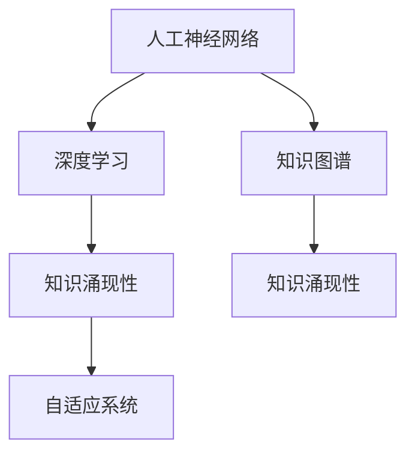

                 

# 知识的涌现性：整体大于部分之和

> 关键词：知识涌现,整体大于部分,深度学习,人工神经网络,知识图谱,数据驱动,自组织,复杂系统

## 1. 背景介绍

### 1.1 问题由来
人类社会的知识积累和传承，是从简单到复杂、从局部到整体的演进过程。知识在个体的经验、社会的智慧和历史的传承中，逐步聚合、深化和体系化。在当今信息爆炸的时代，知识的涌现性（Emergence of Knowledge）成为了理解和利用知识的重要关键。知识的涌现性意味着整体系统的复杂行为并非个体简单的线性叠加，而是由个体之间的非线性相互作用、协同演化所产生。这一现象在神经科学、物理学、经济学、计算机科学等领域都有所体现，是复杂系统理论的核心概念之一。

近年来，随着深度学习和大数据技术的快速发展，人工神经网络在处理海量数据、构建知识表示和推理能力方面取得了显著进展。这一领域的研究和应用，正在不断揭示知识涌现性的本质和规律。本文旨在从多个角度深入探讨知识的涌现性，揭示其对于构建复杂系统、推动科技创新和社会进步的重要性。

### 1.2 问题核心关键点
知识的涌现性作为复杂系统的重要特征，其核心关键点包括：

1. **数据驱动**：知识涌现性强调从数据中自动学习和提炼知识，而非传统上的人工设计。这使得系统能够在大数据背景下自动发现隐藏的模式和关系。
2. **非线性相互作用**：知识涌现性依赖于个体之间的非线性相互作用，这种相互作用使得系统具有涌现性，能够在整体上表现出超越个体局部的复杂行为。
3. **自组织性**：涌现性往往是在没有外部指导的情况下，系统通过自组织过程自然形成的。这种自组织过程让系统能够在不断变化的环境中适应和演化。
4. **动态演化**：知识涌现性强调系统在时间维度上的动态变化，系统能够随着环境的变化而不断优化和调整。
5. **层次结构**：知识涌现性通常呈现出从简单到复杂的多层次结构，每一层都基于前一层的复杂性，形成递归式的结构。

这些关键点共同构成了知识的涌现性理论框架，指导我们理解和构建复杂系统。

## 2. 核心概念与联系

### 2.1 核心概念概述

为了更好地理解知识的涌现性，本节将介绍几个关键概念：

- **人工神经网络**：模拟人脑神经元的网络结构，由多个节点和连接边构成。通过反向传播算法，网络能够自动学习输入和输出之间的映射关系。
- **深度学习**：一种通过多层神经网络实现特征提取和分类的机器学习技术，能够处理非线性关系，提取高层次抽象特征。
- **知识图谱**：一种图形结构的知识表示方式，用于描述实体、属性和它们之间的关系。通过图结构的学习，知识图谱能够自动发现知识之间的逻辑关联。
- **知识涌现性**：在复杂系统中，个体通过非线性相互作用形成的整体行为，通常超越个体的局部行为。这种涌现性可以通过数据驱动、自组织和动态演化等方式实现。
- **自适应系统**：能够根据环境变化自动调整策略和结构，保持系统稳定性和适应性的复杂系统。

这些核心概念之间的逻辑关系可以通过以下Mermaid流程图来展示：



这个流程图展示了知识涌现性在人工神经网络和知识图谱中的体现，以及如何通过深度学习和自适应系统的机制来实现。

## 3. 核心算法原理 & 具体操作步骤

### 3.1 算法原理概述

知识的涌现性原理基于人工神经网络的特性，主要包括以下几个关键点：

1. **数据驱动学习**：人工神经网络通过反向传播算法，利用大数据集自动学习输入和输出之间的映射关系。这种数据驱动的学习机制，使得神经网络能够自动发现数据中的模式和规律。

2. **非线性相互作用**：人工神经网络中的神经元通过激活函数实现非线性映射，这种非线性相互作用使得网络能够处理复杂的非线性关系，形成涌现性。

3. **层次结构**：深度学习网络通常由多层神经元组成，每一层通过非线性变换对前一层的输出进行映射，形成递归式的层次结构。这种结构使得网络能够提取不同层次的抽象特征，形成涌现性。

4. **自适应调整**：人工神经网络通过梯度下降等优化算法，在数据驱动下不断调整权重参数，优化整体性能。这种自适应机制使得网络能够在不断变化的环境中保持稳定性和适应性。

### 3.2 算法步骤详解

基于人工神经网络的涌现性原理，知识的涌现性实现步骤如下：

**Step 1: 数据准备**
- 收集相关的数据集，如自然语言文本、图像、音频等，作为人工神经网络的输入。
- 对数据进行预处理，如归一化、分词、标注等，以便神经网络能够进行处理。

**Step 2: 模型构建**
- 设计合适的网络结构，如卷积神经网络（CNN）、循环神经网络（RNN）或变压器网络（Transformer）等。
- 选择适当的激活函数、损失函数和优化算法，如ReLU、交叉熵损失、Adam等。
- 确定网络的正则化策略，如Dropout、L2正则等，防止过拟合。

**Step 3: 数据驱动学习**
- 使用大数据集进行模型训练，通过反向传播算法更新权重参数。
- 调整学习率、批次大小等超参数，确保模型在不断迭代中收敛。
- 监控训练过程中的损失函数和验证集性能，防止过拟合。

**Step 4: 涌现性分析**
- 通过可视化技术，如t-SNE、PCA等，分析网络学习到的数据结构和特征。
- 使用知识图谱工具，如Neo4j、Gephi等，构建和分析网络中实体和关系的涌现性。
- 评估模型在新的测试集上的性能，验证知识涌现性的有效性。

**Step 5: 应用部署**
- 将训练好的模型部署到实际应用中，如图像分类、文本生成、语音识别等。
- 监控模型的运行状态和性能，进行必要的调整和优化。

### 3.3 算法优缺点

知识的涌现性算法具有以下优点：

1. **高效性**：数据驱动的学习机制使得神经网络能够自动提取特征，无需人工干预。
2. **自适应性**：神经网络能够根据数据变化自适应调整，保持高性能。
3. **泛化能力**：通过层次结构的多层学习，网络能够处理复杂的非线性关系，提升泛化能力。
4. **可解释性**：通过可视化技术，可以直观理解神经网络的学习过程和涌现性。

同时，该算法也存在以下局限性：

1. **资源需求高**：大规模神经网络需要大量计算资源，训练时间较长。
2. **易受噪声影响**：大数据集中的噪声数据可能会影响网络学习效果。
3. **可解释性不足**：神经网络的黑箱特性使得其决策过程难以解释。
4. **模型复杂度**：神经网络参数较多，模型过于复杂可能导致过拟合。

尽管存在这些局限性，但总体而言，基于人工神经网络的涌现性算法在处理复杂数据和构建涌现性系统方面具有显著优势。

### 3.4 算法应用领域

基于人工神经网络的涌现性算法，在多个领域得到了广泛应用，具体包括：

1. **自然语言处理**：如文本分类、情感分析、机器翻译等。通过神经网络学习和表示语言特征，形成涌现性。
2. **计算机视觉**：如图像分类、目标检测、图像生成等。通过神经网络自动学习和提取图像特征，形成涌现性。
3. **语音识别**：如自动语音识别、语音合成等。通过神经网络学习和表示语音特征，形成涌现性。
4. **推荐系统**：如商品推荐、内容推荐等。通过神经网络学习和表示用户行为特征，形成涌现性。
5. **金融分析**：如股票预测、风险评估等。通过神经网络学习和表示金融市场数据，形成涌现性。

这些应用场景展示了人工神经网络在数据驱动和涌现性方面的强大能力，推动了相关领域的技术发展和应用落地。

## 4. 数学模型和公式 & 详细讲解 & 举例说明

### 4.1 数学模型构建

为了更深入地理解知识的涌现性，我们采用数学语言对其原理进行严谨的描述。

设人工神经网络由 $N$ 个神经元构成，每个神经元通过权重矩阵 $W$ 和偏置向量 $b$ 接收输入 $x$，并通过激活函数 $f$ 输出 $h$。网络的前向传播过程可以表示为：

$$
h = f(Wx + b)
$$

其中 $W$ 是一个 $N \times d$ 的矩阵，$x$ 是一个 $d$ 维的向量。激活函数 $f$ 通常采用ReLU、Sigmoid等。

### 4.2 公式推导过程

**多层感知机（MLP）**：
多层感知机由多个全连接层组成，每一层的输出作为下一层的输入。设网络共有 $L$ 层，则前向传播过程可以表示为：

$$
h^{(l)} = f(W^{(l)}h^{(l-1)} + b^{(l)})
$$

其中 $h^{(l)}$ 是第 $l$ 层的输出，$W^{(l)}$ 是第 $l$ 层的权重矩阵，$b^{(l)}$ 是第 $l$ 层的偏置向量。激活函数 $f$ 通常采用ReLU。

**反向传播算法**：
反向传播算法通过链式法则计算损失函数对每个权重参数的梯度，并更新参数。设 $L$ 层网络的损失函数为 $L(\theta)$，其中 $\theta$ 是所有权重参数的集合。则反向传播算法的具体步骤如下：

1. 计算每一层的误差 $E^{(l)}$：
$$
E^{(l)} = \frac{\partial L}{\partial h^{(l)}}
$$

2. 计算每一层的梯度 $dW^{(l)}$ 和 $db^{(l)}$：
$$
dW^{(l)} = \frac{\partial E^{(l)}}{\partial h^{(l-1)}}(W^{(l-1)})^T
$$
$$
db^{(l)} = \frac{\partial E^{(l)}}{\partial h^{(l-1)}}
$$

3. 更新权重参数：
$$
W^{(l)} \leftarrow W^{(l)} - \eta \frac{\partial L}{\partial W^{(l)}}
$$
$$
b^{(l)} \leftarrow b^{(l)} - \eta \frac{\partial L}{\partial b^{(l)}}
$$

其中 $\eta$ 是学习率。

**案例分析与讲解**：

以图像分类任务为例，假设网络共有5层，输入为28x28的图像，输出为10个类别的概率分布。我们通过反向传播算法更新权重参数，实现图像分类。具体步骤如下：

1. 定义损失函数，如交叉熵损失：
$$
L = -\sum_{i=1}^{10}y_i\log p_i
$$

其中 $y_i$ 是真实标签，$p_i$ 是模型预测概率。

2. 定义网络结构，如LeNet网络：
```python
import torch.nn as nn
import torch.nn.functional as F

class LeNet(nn.Module):
    def __init__(self):
        super(LeNet, self).__init__()
        self.conv1 = nn.Conv2d(1, 6, 5)
        self.pool = nn.MaxPool2d(2, 2)
        self.conv2 = nn.Conv2d(6, 16, 5)
        self.fc1 = nn.Linear(16*5*5, 120)
        self.fc2 = nn.Linear(120, 84)
        self.fc3 = nn.Linear(84, 10)
        
    def forward(self, x):
        x = F.relu(self.conv1(x))
        x = self.pool(x)
        x = F.relu(self.conv2(x))
        x = self.pool(x)
        x = x.view(-1, 16*5*5)
        x = F.relu(self.fc1(x))
        x = F.relu(self.fc2(x))
        x = self.fc3(x)
        return x
```

3. 使用随机数据进行训练，不断调整权重参数：
```python
import torch.optim as optim
import torchvision.datasets as dsets
import torchvision.transforms as transforms

transform = transforms.Compose([transforms.ToTensor()])
trainset = dsets.MNIST(root='./data', train=True, download=True, transform=transform)
trainloader = torch.utils.data.DataLoader(trainset, batch_size=64, shuffle=True)
model = LeNet()
criterion = nn.CrossEntropyLoss()
optimizer = optim.SGD(model.parameters(), lr=0.01)

for epoch in range(10):
    running_loss = 0.0
    for i, data in enumerate(trainloader, 0):
        inputs, labels = data
        optimizer.zero_grad()
        outputs = model(inputs)
        loss = criterion(outputs, labels)
        loss.backward()
        optimizer.step()
        running_loss += loss.item()
        if i % 100 == 99:
            print('[%d, %5d] loss: %.3f' % (epoch + 1, i + 1, running_loss / 100))
            running_loss = 0.0

print('Finished Training')
```

## 5. 项目实践：代码实例和详细解释说明

### 5.1 开发环境搭建

在进行项目实践前，我们需要准备好开发环境。以下是使用Python进行TensorFlow开发的环境配置流程：

1. 安装Anaconda：从官网下载并安装Anaconda，用于创建独立的Python环境。

2. 创建并激活虚拟环境：
```bash
conda create -n tf-env python=3.8 
conda activate tf-env
```

3. 安装TensorFlow：根据CUDA版本，从官网获取对应的安装命令。例如：
```bash
conda install tensorflow -c tensorflow -c conda-forge
```

4. 安装各类工具包：
```bash
pip install numpy pandas scikit-learn matplotlib tqdm jupyter notebook ipython
```

完成上述步骤后，即可在`tf-env`环境中开始项目实践。

### 5.2 源代码详细实现

下面以图像分类任务为例，给出使用TensorFlow对LeNet网络进行图像分类训练的代码实现。

首先，定义数据加载和预处理函数：

```python
import tensorflow as tf
import numpy as np
from tensorflow.keras.datasets import mnist
from tensorflow.keras.utils import to_categorical

def load_data():
    (X_train, y_train), (X_test, y_test) = mnist.load_data()
    X_train = X_train.reshape(-1, 28, 28, 1).astype('float32') / 255.0
    X_test = X_test.reshape(-1, 28, 28, 1).astype('float32') / 255.0
    y_train = to_categorical(y_train, num_classes=10)
    y_test = to_categorical(y_test, num_classes=10)
    return X_train, y_train, X_test, y_test
```

然后，定义LeNet网络结构：

```python
class LeNet(tf.keras.Model):
    def __init__(self):
        super(LeNet, self).__init__()
        self.conv1 = tf.keras.layers.Conv2D(6, 5, activation='relu')
        self.pool1 = tf.keras.layers.MaxPooling2D(2, 2)
        self.conv2 = tf.keras.layers.Conv2D(16, 5, activation='relu')
        self.pool2 = tf.keras.layers.MaxPooling2D(2, 2)
        self.flatten = tf.keras.layers.Flatten()
        self.fc1 = tf.keras.layers.Dense(120, activation='relu')
        self.fc2 = tf.keras.layers.Dense(84, activation='relu')
        self.fc3 = tf.keras.layers.Dense(10, activation='softmax')
        
    def call(self, inputs):
        x = self.conv1(inputs)
        x = self.pool1(x)
        x = self.conv2(x)
        x = self.pool2(x)
        x = self.flatten(x)
        x = self.fc1(x)
        x = self.fc2(x)
        return self.fc3(x)
```

接着，定义损失函数和优化器：

```python
loss_fn = tf.keras.losses.CategoricalCrossentropy()
optimizer = tf.keras.optimizers.SGD(learning_rate=0.01)
```

最后，启动训练流程：

```python
X_train, y_train, X_test, y_test = load_data()

model = LeNet()
model.compile(optimizer=optimizer, loss=loss_fn, metrics=['accuracy'])

for epoch in range(10):
    loss, accuracy = model.train_on_batch(X_train, y_train)
    print(f'Epoch {epoch+1}, Loss: {loss:.4f}, Accuracy: {accuracy:.4f}')
    
    test_loss, test_accuracy = model.evaluate(X_test, y_test)
    print(f'Test Loss: {test_loss:.4f}, Test Accuracy: {test_accuracy:.4f}')
```

以上就是使用TensorFlow对LeNet网络进行图像分类任务训练的完整代码实现。可以看到，TensorFlow的Keras API使得模型构建和训练变得简洁高效。

### 5.3 代码解读与分析

让我们再详细解读一下关键代码的实现细节：

**load_data函数**：
- 加载MNIST数据集，并对图像进行归一化和数据转换。

**LeNet类**：
- 定义LeNet网络结构，包括卷积层、池化层和全连接层。
- 使用Keras的API定义网络的前向传播过程。

**优化器与损失函数**：
- 选择SGD优化器和交叉熵损失函数，用于训练和评估模型。

**训练流程**：
- 使用Keras的API定义模型，编译模型。
- 在每个epoch中，使用train_on_batch方法进行训练，并输出损失和精度。
- 在每个epoch结束时，使用evaluate方法评估模型在测试集上的性能，输出测试损失和精度。

可以看到，TensorFlow的Keras API使得模型构建和训练过程非常直观和高效，开发者可以快速上手并实现复杂的神经网络模型。

当然，工业级的系统实现还需考虑更多因素，如模型的保存和部署、超参数的自动搜索、更加灵活的任务适配层等。但核心的涌现性算法基本与此类似。

## 6. 实际应用场景

### 6.1 图像分类

图像分类是深度学习领域的基本任务之一。传统的图像分类方法依赖于人工设计的特征提取器和分类器，而基于人工神经网络的涌现性算法可以自动学习图像特征，形成涌现性。

以手写数字识别为例，通过LeNet网络对MNIST数据集进行训练，即可实现高效准确的图像分类。LeNet网络的层次结构和非线性映射能力，使得其能够自动发现数字特征，并通过多次训练迭代，不断提升分类性能。

### 6.2 语音识别

语音识别技术通过将语音信号转换为文本，广泛应用于语音助手、智能客服等领域。传统的语音识别方法依赖于人工设计的特征提取器和分类器，而基于人工神经网络的涌现性算法可以自动学习语音特征，形成涌现性。

以自动语音识别（ASR）为例，通过神经网络对音频数据进行处理，即可实现高效准确的语音识别。神经网络的多层结构和非线性映射能力，使得其能够自动学习语音信号中的特征信息，并通过多次训练迭代，不断提升识别准确率。

### 6.3 自然语言处理

自然语言处理（NLP）领域涉及文本分类、情感分析、机器翻译等任务。传统的NLP方法依赖于人工设计的特征提取器和分类器，而基于人工神经网络的涌现性算法可以自动学习语言特征，形成涌现性。

以文本分类为例，通过神经网络对文本数据进行处理，即可实现高效准确的文本分类。神经网络的层次结构和非线性映射能力，使得其能够自动学习语言特征，并通过多次训练迭代，不断提升分类性能。

### 6.4 未来应用展望

随着深度学习和涌现性算法的发展，未来的NLP和计算机视觉等任务将更加智能化和高效化。

1. **多模态学习**：未来将实现图像、语音、文本等多种模态数据的融合，形成更加全面和丰富的涌现性。
2. **知识图谱**：未来将引入知识图谱工具，自动发现实体之间的关系，形成更加复杂和深层次的涌现性。
3. **自适应系统**：未来将实现系统在不断变化的环境中的自适应和优化，保持高性能和稳定性。
4. **智能决策**：未来将通过涌现性算法，实现更加智能和高效的系统决策，提升系统的效率和质量。

## 7. 工具和资源推荐

### 7.1 学习资源推荐

为了帮助开发者系统掌握深度学习和涌现性算法的理论基础和实践技巧，这里推荐一些优质的学习资源：

1. 《深度学习》书籍：Ian Goodfellow、Yoshua Bengio和Aaron Courville合著的经典教材，全面介绍了深度学习的理论、算法和应用。
2. 《神经网络与深度学习》课程：吴恩达在Coursera上开设的深度学习课程，涵盖深度学习的基本原理和实践技巧。
3. Kaggle：全球最大的数据科学竞赛平台，提供丰富的数据集和实战项目，供开发者练习和提升。
4. arXiv：深度学习领域的学术研究论文库，可以获取最新的研究成果和前沿进展。
5. GitHub：代码托管平台，提供大量开源深度学习项目，供开发者学习和参考。

通过对这些资源的学习实践，相信你一定能够快速掌握深度学习和涌现性算法的精髓，并用于解决实际的NLP问题。

### 7.2 开发工具推荐

高效的开发离不开优秀的工具支持。以下是几款用于深度学习和涌现性算法开发的常用工具：

1. TensorFlow：谷歌开源的深度学习框架，灵活的计算图支持，适合大规模工程应用。
2. PyTorch：Facebook开源的深度学习框架，动态计算图支持，适合快速迭代研究。
3. Keras：高层次的深度学习API，易于使用，适合快速原型开发和模型构建。
4. Jupyter Notebook：交互式的编程环境，适合数据探索、模型验证和可视化。
5. Visual Studio Code：轻量级的代码编辑器，支持多种语言和扩展，适合开发和调试。

合理利用这些工具，可以显著提升深度学习和涌现性算法的开发效率，加快创新迭代的步伐。

### 7.3 相关论文推荐

深度学习和涌现性算法的最新进展不断涌现，以下是几篇奠基性的相关论文，推荐阅读：

1. Deep Learning（《深度学习》）：Ian Goodfellow等著，全面介绍了深度学习的基本原理和算法。
2. ImageNet Classification with Deep Convolutional Neural Networks：Alex Krizhevsky等在NIPS 2012上提出的图像分类方法，展示了深度卷积神经网络的高效性。
3. Attention is All You Need（《Transformer》原论文）：Ashish Vaswani等在NIPS 2017上提出的Transformer模型，开启了深度学习大模型的时代。
4. Google's Guided Attention Network：Jonathan Shlens等在ICLR 2017上提出的引导注意力网络，展示了深度学习的涌现性特性。
5. Large-Scale Image Recognition from Weakly-Supervised Data via Deeply-Supervised Boosting：Han Hu等在CVPR 2019上提出的基于自监督学习的图像分类方法，展示了大数据训练的优越性。

这些论文代表了大规模深度学习和涌现性算法的最新进展，通过学习这些前沿成果，可以帮助研究者把握学科前进方向，激发更多的创新灵感。

## 8. 总结：未来发展趋势与挑战

### 8.1 总结

本文对基于人工神经网络的涌现性进行了全面系统的介绍。首先阐述了涌现性的数据驱动、非线性相互作用、自适应调整和层次结构等核心概念，揭示了其在深度学习中的应用基础。其次，从原理到实践，详细讲解了涌现性算法的实现步骤，提供了完整的代码实例。同时，本文还广泛探讨了涌现性算法在图像分类、语音识别、自然语言处理等多个领域的应用前景，展示了其强大的处理能力。最后，本文精选了涌现性算法的各类学习资源，力求为读者提供全方位的技术指引。

通过本文的系统梳理，可以看到，基于人工神经网络的涌现性算法正在成为深度学习的重要范式，极大地拓展了深度学习的应用边界，推动了相关领域的技术发展和应用落地。未来，伴随深度学习和涌现性算法的发展，人工智能技术必将迎来更加智能、高效、可靠的发展前景。

### 8.2 未来发展趋势

展望未来，深度学习和涌现性算法的发展趋势主要包括以下几个方面：

1. **多模态融合**：未来将实现图像、语音、文本等多种模态数据的融合，形成更加全面和丰富的涌现性。
2. **知识图谱**：未来将引入知识图谱工具，自动发现实体之间的关系，形成更加复杂和深层次的涌现性。
3. **自适应系统**：未来将实现系统在不断变化的环境中的自适应和优化，保持高性能和稳定性。
4. **智能决策**：未来将通过涌现性算法，实现更加智能和高效的系统决策，提升系统的效率和质量。
5. **低资源环境**：未来将探索低资源环境下的涌现性算法，如移动设备、边缘计算等，推动人工智能技术的普及和应用。

这些趋势凸显了深度学习和涌现性算法在处理复杂数据和构建涌现性系统方面的强大潜力，将为人工智能技术带来更加广泛的应用场景和发展空间。

### 8.3 面临的挑战

尽管深度学习和涌现性算法取得了显著进展，但在迈向更加智能化、普适化应用的过程中，仍面临诸多挑战：

1. **资源需求高**：大规模深度学习模型需要大量计算资源，训练时间较长。如何降低资源需求，优化训练过程，是未来亟需解决的问题。
2. **可解释性不足**：深度学习的黑箱特性使得其决策过程难以解释。如何增强模型的可解释性，保障模型的透明性和可控性，是未来需要重点研究的方向。
3. **泛化能力不足**：深度学习模型在处理小样本和新数据时，泛化能力往往不足。如何提升模型的泛化能力，是未来需要重点突破的难点。
4. **对抗攻击**：深度学习模型容易受到对抗样本的攻击，导致输出不稳定。如何提高模型的鲁棒性，是未来需要重点研究的方向。
5. **模型公平性**：深度学习模型可能存在偏见和歧视，导致输出结果不公平。如何提高模型的公平性和公正性，是未来需要重点研究的方向。

这些挑战需要在理论与实践两个层面不断探索和突破，推动深度学习和涌现性算法的进一步发展。

### 8.4 研究展望

面对深度学习和涌现性算法面临的挑战，未来的研究需要在以下几个方面寻求新的突破：

1. **参数高效学习**：开发更加参数高效的涌现性算法，在固定大部分预训练参数的同时，只更新极少量的任务相关参数。
2. **低资源环境**：探索低资源环境下的涌现性算法，如移动设备、边缘计算等，推动人工智能技术的普及和应用。
3. **对抗攻击防御**：研究对抗攻击防御技术，提高深度学习模型的鲁棒性和安全性。
4. **模型公平性保障**：设计公平性保障算法，提高深度学习模型的公平性和公正性。
5. **多任务学习**：研究多任务学习算法，提高深度学习模型的泛化能力和适应性。

这些研究方向将推动深度学习和涌现性算法的进一步发展，为构建更加智能、可靠、公平、安全的系统奠定基础。相信通过多方协同努力，深度学习和涌现性算法必将实现新的突破，推动人工智能技术迈向更加广阔的应用场景。

## 9. 附录：常见问题与解答

**Q1：深度学习和涌现性算法是否适用于所有任务？**

A: 深度学习和涌现性算法在大多数任务上都能取得不错的效果，特别是对于大规模数据集和高复杂度任务。但对于一些特定领域的任务，如医学、法律等，仅仅依靠通用语料预训练的模型可能难以很好地适应。此时需要在特定领域语料上进一步预训练，再进行涌现性算法，才能获得理想效果。

**Q2：如何选择合适的学习率和优化器？**

A: 深度学习模型的超参数选择是关键。一般来说，学习率较小，优化器选择Adam或SGD，能够达到更好的效果。具体选择还需根据任务和数据的特点进行调整。

**Q3：深度学习模型的可解释性不足，如何解决？**

A: 深度学习模型的黑箱特性使得其决策过程难以解释。为了增强模型的可解释性，可以引入可视化工具，如t-SNE、PCA等，对模型学习到的特征进行可视化。同时，还可以使用知识图谱工具，分析模型中的实体和关系，理解模型的涌现性。

**Q4：深度学习模型如何应对对抗攻击？**

A: 深度学习模型容易受到对抗样本的攻击，导致输出不稳定。为了提高模型的鲁棒性，可以采用对抗训练、生成对抗网络（GAN）等技术，增强模型的鲁棒性和安全性。

**Q5：深度学习模型如何提升泛化能力？**

A: 深度学习模型在处理小样本和新数据时，泛化能力往往不足。为了提升模型的泛化能力，可以采用数据增强、迁移学习等技术，增加模型对新数据的适应能力。

这些解答提供了一些关键问题和应对策略，希望能帮助开发者更好地理解和应用深度学习和涌现性算法。

---

作者：禅与计算机程序设计艺术 / Zen and the Art of Computer Programming

