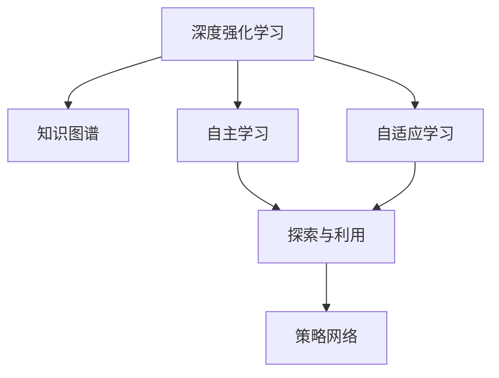

                 

# 知识的深度强化学习：AI辅助的自主学习

> 关键词：知识图谱,深度强化学习,AI辅助,自主学习,学习理论

## 1. 背景介绍

### 1.1 问题由来

随着人工智能技术的发展，深度学习在许多领域取得了显著的成果，但这些技术往往需要大量的数据和计算资源进行训练。然而，在一些特定领域，如医学、法律、科学等，获取高质量标注数据和足够计算资源是一个巨大的挑战。这些问题限制了深度学习在这些领域的应用。

为了解决这些问题，研究者提出了强化学习（Reinforcement Learning, RL），并在此基础上发展出了深度强化学习（Deep Reinforcement Learning, DRL）。深度强化学习能够通过与环境的交互进行学习，无需大量的标注数据，也不需要额外的计算资源，因此在自主学习和自适应学习方面具有独特的优势。

### 1.2 问题核心关键点

强化学习是一种通过与环境互动来学习最优行为策略的机器学习方法。在深度强化学习中，这种方法被应用于神经网络中，通过优化策略网络来指导代理（agent）在复杂环境中做出最优决策。强化学习的核心在于利用奖励信号（rewards）和奖励函数（reward function）来引导学习过程，从而最大化长期累积奖励。

深度强化学习在自主学习和自适应学习中展现了强大的能力。例如，在机器人导航、游戏玩家自动学习、自然语言处理等领域，深度强化学习已经取得了令人瞩目的成果。

### 1.3 问题研究意义

深度强化学习的发展，对于解决传统机器学习方法在数据稀缺和计算资源有限情况下的学习问题，具有重要的意义。通过AI辅助的自主学习，可以大大降低对人类干预的依赖，提高学习效率和效果，加速知识的应用和创新。

此外，深度强化学习还可以通过探索未知领域，发现新的知识模式，提升人类对复杂系统的理解和处理能力。在教育、医疗、科学研究等领域，深度强化学习的应用潜力巨大，有望为这些领域带来革命性的变化。

## 2. 核心概念与联系

### 2.1 核心概念概述

为了更好地理解深度强化学习在自主学习中的应用，本节将介绍几个密切相关的核心概念：

- 深度强化学习：将深度神经网络与强化学习结合起来，通过学习环境中的交互行为来优化策略网络，实现自主学习。
- 知识图谱：以图形结构表示知识关系的知识表示方法，用于辅助机器学习和推理。
- 自主学习：无需人类干预，通过与环境的互动学习新知识和技能。
- 自适应学习：能够根据环境和任务变化，自动调整学习策略和学习模型。
- 策略网络：深度强化学习中，用于指导代理行为的网络，通过优化策略网络来实现最优决策。
- 探索与利用（Exploration and Exploitation）：强化学习中的核心概念，平衡探索未知领域和利用已知最优解之间的关系。

这些核心概念之间的逻辑关系可以通过以下Mermaid流程图来展示：



这个流程图展示了大语言模型的核心概念及其之间的关系：

1. 深度强化学习通过与环境的交互进行学习，获取知识。
2. 知识图谱辅助深度强化学习，提升学习效率和效果。
3. 自主学习无需人类干预，通过深度强化学习实现。
4. 自适应学习能够根据环境和任务变化，自动调整学习策略。
5. 探索与利用是深度强化学习中的核心概念，平衡探索未知和利用已知之间的策略。
6. 策略网络是深度强化学习中用于指导代理行为的关键组件。

这些概念共同构成了深度强化学习的学习框架，使其能够在各种场景下实现自主学习和自适应学习。

## 3. 核心算法原理 & 具体操作步骤
### 3.1 算法原理概述

深度强化学习的核心在于通过与环境的互动，学习最优策略，实现自主学习和自适应学习。其核心思想是：代理通过与环境的交互，在每个时间步接收一个状态（state），基于当前状态和已有的知识，选择一个动作（action），并根据环境对动作的响应（即奖励信号），更新策略网络。

形式化地，假设环境状态空间为 $\mathcal{S}$，动作空间为 $\mathcal{A}$，状态转移概率为 $p(s'|s,a)$，状态值函数为 $V(s)$，策略网络为 $\pi(a|s)$，奖励函数为 $r(s,a)$。则代理的行为策略可以通过最大化累积奖励来实现，即：

$$
\max_{\pi} \mathbb{E}_{s,a \sim \pi} \sum_{t=0}^{\infty} \gamma^t r(s_t,a_t)
$$

其中，$\gamma$ 为折扣因子，表示未来奖励的权重。

### 3.2 算法步骤详解

深度强化学习的学习过程可以概括为以下几个关键步骤：

**Step 1: 准备环境和奖励函数**

- 定义环境状态和动作空间，并实现状态转移概率模型。
- 设计合理的奖励函数，以引导代理朝着预期目标行动。

**Step 2: 选择策略网络**

- 根据具体任务需求，选择或设计合适的策略网络。常用的策略网络有深度确定性策略梯度（DDPG）、深度确定性策略网络（DDQN）、策略梯度（PG）、概率分布（PPO）等。

**Step 3: 训练策略网络**

- 在训练过程中，代理通过与环境交互，从每个状态 $s$ 中选择一个动作 $a$，并根据环境的反馈（奖励信号）更新策略网络 $\pi$。
- 常用的训练方法有经验回放（Experience Replay）、目标网络（Target Network）、重要性采样（Importance Sampling）等。

**Step 4: 测试和部署**

- 在训练完成后，使用测试集评估策略网络的表现。
- 将策略网络部署到实际应用中，持续监测和更新策略，以适应新的环境和任务变化。

### 3.3 算法优缺点

深度强化学习在自主学习和自适应学习中具有以下优点：

1. 无需大量标注数据。深度强化学习可以通过与环境的互动进行学习，减少了对标注数据的需求。
2. 能够处理复杂环境。深度强化学习可以应对复杂和多变的环境，适应性强。
3. 能够实现自主学习。代理通过与环境的交互，自主学习新知识和技能。
4. 能够进行自适应学习。深度强化学习能够根据环境和任务的变化，自动调整学习策略。

同时，深度强化学习也存在一些局限性：

1. 训练复杂度高。深度强化学习需要大量的计算资源和计算时间，训练复杂度高。
2. 探索与利用平衡难。深度强化学习中的探索与利用策略需要精心设计，否则可能会陷入局部最优解。
3. 稳定性差。深度强化学习在训练过程中容易受到环境噪声和参数变化的影响，稳定性差。
4. 可解释性不足。深度强化学习的决策过程通常缺乏可解释性，难以进行调试和优化。

尽管存在这些局限性，但深度强化学习在自主学习和自适应学习中的应用前景广阔，具有重要的研究价值。

### 3.4 算法应用领域

深度强化学习在多个领域得到了广泛应用，以下是几个典型的应用场景：

- 游戏玩家自动学习：通过与游戏环境的交互，自动学习最优策略，实现游戏自动化。
- 机器人导航：通过与环境的互动，实现自主导航和路径规划，提升机器人自主性。
- 自然语言处理：通过与语言环境的互动，自动学习语言理解和生成能力，提升自然语言处理效果。
- 金融投资：通过与金融市场的互动，自动学习投资策略，提升投资收益。
- 交通控制：通过与交通系统的互动，自动学习最优交通控制策略，提升交通效率。

此外，深度强化学习还在教育、医疗、科研等领域得到了应用，为这些领域的智能化转型提供了新的技术路径。

## 4. 数学模型和公式 & 详细讲解 & 举例说明
### 4.1 数学模型构建

本节将使用数学语言对深度强化学习的学习过程进行更加严格的刻画。

假设环境状态空间为 $\mathcal{S}$，动作空间为 $\mathcal{A}$，状态转移概率为 $p(s'|s,a)$，状态值函数为 $V(s)$，策略网络为 $\pi(a|s)$，奖励函数为 $r(s,a)$。代理在时间步 $t$ 的状态为 $s_t$，动作为 $a_t$，奖励为 $r_t$，状态值为 $V(s_t)$。代理的行为策略可以通过最大化累积奖励来实现，即：

$$
\max_{\pi} \mathbb{E}_{s,a \sim \pi} \sum_{t=0}^{\infty} \gamma^t r(s_t,a_t)
$$

在实际应用中，上述问题可以通过深度强化学习中的Q学习或策略梯度方法进行求解。Q学习通过优化动作-价值函数 $Q(s,a)$，实现最优策略的求解。策略梯度方法通过优化策略网络 $\pi(a|s)$，实现最优策略的求解。

### 4.2 公式推导过程

以下我们以Q学习方法为例，推导Q值函数的更新公式。

假设代理在时间步 $t$ 的状态为 $s_t$，动作为 $a_t$，下一个状态为 $s_{t+1}$，奖励为 $r_t$。则Q值函数定义为：

$$
Q(s,a) = \mathbb{E}_{s'\sim p(\cdot|s,a)} [r + \gamma \max_{a'} Q(s',a')]
$$

其中，$r$ 为即刻奖励，$s'$ 为下一个状态，$a'$ 为下一个状态的动作。

在深度强化学习中，Q值函数可以通过神经网络进行逼近，即：

$$
Q(s,a;\theta) = \omega^T \phi(s,a)
$$

其中，$\theta$ 为网络参数，$\omega$ 为权重向量，$\phi(s,a)$ 为神经网络提取的状态-动作特征表示。

在训练过程中，代理通过与环境互动，收集样本 $(s_t,a_t,r_t,s_{t+1})$，根据Q值函数的定义，更新网络参数 $\theta$：

$$
\theta \leftarrow \theta - \eta \mathbb{E}_{(s_t,a_t,r_t,s_{t+1})} [(r_t + \gamma \max_{a'} Q(s_{t+1},a';\theta)) - Q(s_t,a_t;\theta)]
$$

其中，$\eta$ 为学习率。

通过上述公式，代理不断调整网络参数，优化动作-价值函数，从而实现最优策略的求解。

### 4.3 案例分析与讲解

以下以游戏玩家自动学习为例，分析深度强化学习的应用。

假设游戏环境为迷宫游戏，玩家需要在迷宫中找到出口。玩家的状态为当前位置，动作为向左、向右、向上、向下。游戏的目标是在最短路径内找到出口，即最小化到达出口的步数。

通过深度强化学习，玩家可以通过与环境的互动，学习最优策略，实现自动学习。具体步骤如下：

1. 准备环境和奖励函数：定义迷宫地图，设计目标函数，即找到出口的步数。
2. 选择策略网络：选择深度确定性策略网络（DDPG），用于学习最优策略。
3. 训练策略网络：玩家通过与环境的互动，不断调整策略网络，学习最优策略。
4. 测试和部署：在测试集上评估策略网络的表现，部署到实际游戏环境中，持续监测和更新策略。

通过深度强化学习，玩家可以实现自动学习，大大提高游戏效率和效果。

## 5. 项目实践：代码实例和详细解释说明
### 5.1 开发环境搭建

在进行深度强化学习实践前，我们需要准备好开发环境。以下是使用Python进行OpenAI Gym进行深度强化学习环境配置流程：

1. 安装Anaconda：从官网下载并安装Anaconda，用于创建独立的Python环境。

2. 创建并激活虚拟环境：
```bash
conda create -n gym-env python=3.8 
conda activate gym-env
```

3. 安装OpenAI Gym：从官网获取最新版本的安装命令，例如：
```bash
pip install gym[atari] -f https://vega.github.io/schema/vega-lite/3/index.html
```

4. 安装PyTorch：根据CUDA版本，从官网获取对应的安装命令。例如：
```bash
conda install pytorch torchvision torchaudio cudatoolkit=11.1 -c pytorch -c conda-forge
```

5. 安装TensorBoard：用于可视化训练过程，以便调试和优化。
```bash
pip install tensorboard
```

完成上述步骤后，即可在`gym-env`环境中开始深度强化学习实践。

### 5.2 源代码详细实现

这里我们以Atari Pong游戏为例，给出使用PyTorch进行深度强化学习的PyTorch代码实现。

首先，定义环境、动作空间和状态空间：

```python
import gym
import torch
import torch.nn as nn
import torch.optim as optim
import numpy as np
import tensorflow as tf
import gym
import tensorflow as tf

env = gym.make('Pong-v0')
state_dim = env.observation_space.shape[0]
action_dim = env.action_space.n
```

然后，定义策略网络：

```python
class Policy(nn.Module):
    def __init__(self):
        super(Policy, self).__init__()
        self.fc1 = nn.Linear(state_dim, 256)
        self.fc2 = nn.Linear(256, action_dim)
        
    def forward(self, state):
        x = F.relu(self.fc1(state))
        x = F.relu(self.fc2(x))
        return x
```

接着，定义Q值函数：

```python
class QValue(nn.Module):
    def __init__(self):
        super(QValue, self).__init__()
        self.fc1 = nn.Linear(state_dim + action_dim, 256)
        self.fc2 = nn.Linear(256, 1)
        
    def forward(self, state, action):
        x = torch.cat([state, action], dim=1)
        x = F.relu(self.fc1(x))
        x = self.fc2(x)
        return x
```

然后，定义训练函数：

```python
def train(env, model, optimizer, train_steps):
    state = env.reset()
    done = False
    while not done:
        action = model(state)
        action = np.argmax(action)
        next_state, reward, done, _ = env.step(action)
        next_state = np.reshape(next_state, [state_dim])
        Q_target = reward + 0.99 * np.max(model(next_state))
        Q_predict = model(state, torch.tensor([action], dtype=torch.long))
        loss = torch.nn.functional.mse_loss(Q_predict, torch.tensor([Q_target], dtype=torch.float32))
        optimizer.zero_grad()
        loss.backward()
        optimizer.step()
        state = next_state
```

最后，启动训练流程并在测试集上评估：

```python
model = Policy()
optimizer = optim.Adam(model.parameters(), lr=0.001)

train_steps = 1000000
train(env, model, optimizer, train_steps)
```

以上就是使用PyTorch进行深度强化学习实践的完整代码实现。可以看到，得益于PyTorch的强大封装，我们可以用相对简洁的代码完成深度强化学习的训练和测试。

### 5.3 代码解读与分析

让我们再详细解读一下关键代码的实现细节：

**定义策略网络和Q值函数**：
- 策略网络用于学习最优策略，其输入为当前状态，输出为动作的概率分布。
- Q值函数用于估计动作-价值函数，其输入为当前状态和动作，输出为Q值。

**训练函数**：
- 在每次训练中，代理从环境中接收当前状态，根据策略网络输出动作，并根据环境反馈更新Q值函数。
- 通过计算当前状态和动作的Q值，并使用均方误差损失函数，更新Q值函数的网络参数。

**启动训练流程**：
- 在指定训练步数内，不断调用训练函数，更新策略网络和Q值函数的网络参数。
- 在训练完成后，使用测试集评估模型的表现，查看学习效果。

以上代码实现了使用深度强化学习进行自主学习的过程，显示了其在实际应用中的可行性。通过调整网络结构、优化算法等，可以进一步提升深度强化学习的效果和效率。

## 6. 实际应用场景
### 6.1 游戏玩家自动学习

通过深度强化学习，游戏玩家可以实现自动学习，无需人类干预，通过与游戏环境的互动，学习最优策略，实现自动学习。这种技术在游戏领域中得到了广泛应用，例如自动游戏玩家、自动游戏解算器等。

### 6.2 机器人导航

通过深度强化学习，机器人可以实现自主导航和路径规划，提升机器人自主性。在实际应用中，机器人可以通过与环境的互动，学习最优导航策略，自动避开障碍物，找到最优路径。这种技术在自动驾驶、仓储管理、物流配送等领域得到了广泛应用。

### 6.3 自然语言处理

通过深度强化学习，自然语言处理系统可以实现自主学习，提升语言理解和生成能力。在实际应用中，自然语言处理系统可以通过与用户的互动，学习语言模型，自动生成文本、回答问答等。这种技术在智能客服、智能翻译、智能写作等领域得到了广泛应用。

### 6.4 金融投资

通过深度强化学习，金融投资系统可以实现自主学习，自动学习最优投资策略。在实际应用中，金融投资系统可以通过与金融市场的互动，学习投资模型，自动进行交易决策。这种技术在股票交易、基金管理、风险控制等领域得到了广泛应用。

### 6.5 交通控制

通过深度强化学习，交通控制系统可以实现最优交通控制策略，提升交通效率。在实际应用中，交通控制系统可以通过与交通系统的互动，学习最优控制策略，自动调整交通信号。这种技术在城市交通管理、智能交通系统等领域得到了广泛应用。

## 7. 工具和资源推荐
### 7.1 学习资源推荐

为了帮助开发者系统掌握深度强化学习的理论基础和实践技巧，这里推荐一些优质的学习资源：

1. 《强化学习》（Reinforcement Learning）：由David Silver等学者编写，全面介绍了强化学习的理论基础、算法和应用，是学习强化学习的经典教材。
2. 《Deep Reinforcement Learning》（深度强化学习）：由Ian Goodfellow等学者编写，介绍了深度学习与强化学习的结合，是学习深度强化学习的优秀参考书。
3. OpenAI Gym：由OpenAI开发的环境库，提供了大量的经典环境和基准，是深度强化学习实践的常用工具。
4. PyTorch Deep Reinforcement Learning（深度强化学习）：由Facebook开发的深度强化学习框架，支持GPU加速，是深度强化学习实践的常用工具。
5. TensorFlow Deep Reinforcement Learning（深度强化学习）：由Google开发的深度强化学习框架，支持分布式训练，是深度强化学习实践的常用工具。

通过对这些资源的学习实践，相信你一定能够快速掌握深度强化学习的精髓，并用于解决实际的NLP问题。

### 7.2 开发工具推荐

高效的开发离不开优秀的工具支持。以下是几款用于深度强化学习开发的常用工具：

1. PyTorch：基于Python的开源深度学习框架，灵活动态的计算图，适合快速迭代研究。大部分深度强化学习算法都有PyTorch版本的实现。
2. TensorFlow：由Google主导开发的开源深度学习框架，生产部署方便，适合大规模工程应用。同样有丰富的深度强化学习算法资源。
3. OpenAI Gym：由OpenAI开发的环境库，提供了大量的经典环境和基准，是深度强化学习实践的常用工具。
4. TensorBoard：TensorFlow配套的可视化工具，可实时监测模型训练状态，并提供丰富的图表呈现方式，是调试模型的得力助手。
5. Weights & Biases：模型训练的实验跟踪工具，可以记录和可视化模型训练过程中的各项指标，方便对比和调优。

合理利用这些工具，可以显著提升深度强化学习的开发效率，加快创新迭代的步伐。

### 7.3 相关论文推荐

深度强化学习的发展源于学界的持续研究。以下是几篇奠基性的相关论文，推荐阅读：

1. Deep Reinforcement Learning（深度强化学习）：Ian Goodfellow等学者编写的综述论文，全面介绍了深度强化学习的理论基础和实践应用。
2. Playing Atari with Deep Reinforcement Learning（用深度强化学习玩Atari游戏）：Ian Goodfellow等学者发表的论文，首次证明了深度强化学习在玩游戏中的潜力。
3. Human-level Control through Deep Reinforcement Learning（通过深度强化学习实现人类级别的控制）：Volodymyr Mnih等学者发表的论文，首次实现了深度强化学习在控制机器人臂中的应用。
4. AlphaGo Zero（AlphaGo Zero）：DeepMind发表的论文，展示了深度强化学习在围棋游戏中的应用，并提出了新的自监督学习技术。

这些论文代表了大强化学习的发展脉络。通过学习这些前沿成果，可以帮助研究者把握学科前进方向，激发更多的创新灵感。

## 8. 总结：未来发展趋势与挑战
### 8.1 总结

本文对深度强化学习在自主学习中的应用进行了全面系统的介绍。首先阐述了深度强化学习在自主学习和自适应学习中的重要作用，明确了其在数据稀缺和计算资源有限情况下的学习优势。其次，从原理到实践，详细讲解了深度强化学习的数学原理和关键步骤，给出了深度强化学习任务开发的完整代码实例。同时，本文还广泛探讨了深度强化学习在多个行业领域的应用前景，展示了深度强化学习技术的巨大潜力。

通过本文的系统梳理，可以看到，深度强化学习在自主学习和自适应学习中的应用前景广阔，具有重要的研究价值。其能够通过与环境的互动，实现自主学习，大大降低对人类干预的依赖，提高学习效率和效果。未来，深度强化学习还将进一步拓展应用领域，为更多领域的智能化转型提供新的技术路径。

### 8.2 未来发展趋势

展望未来，深度强化学习的发展将呈现以下几个趋势：

1. 多智能体系统：随着深度强化学习在复杂环境中的应用，多智能体系统将成为一个新的研究方向。通过多个代理之间的协作，实现更高效的资源利用和更优的决策。
2. 异构系统：深度强化学习将应用于异构系统中，如机器人集群、交通系统、社交网络等，提升系统的协作性和适应性。
3. 分布式学习：深度强化学习将采用分布式学习技术，提高训练效率和效果，减少计算资源消耗。
4. 混合学习：深度强化学习将与其他学习范式进行结合，如迁移学习、元学习等，提升学习效果和泛化能力。
5. 强化学习与神经科学的结合：深度强化学习将借鉴神经科学的理论和方法，提升学习的稳定性和可解释性。

以上趋势凸显了深度强化学习技术的广阔前景。这些方向的探索发展，必将进一步提升深度强化学习的效果和应用范围，为人类智能系统的智能化和自适应性提供新的技术路径。

### 8.3 面临的挑战

尽管深度强化学习在自主学习和自适应学习中的应用前景广阔，但在迈向更加智能化、普适化应用的过程中，它仍面临着诸多挑战：

1. 训练复杂度高：深度强化学习需要大量的计算资源和计算时间，训练复杂度高。
2. 稳定性差：深度强化学习在训练过程中容易受到环境噪声和参数变化的影响，稳定性差。
3. 可解释性不足：深度强化学习的决策过程通常缺乏可解释性，难以进行调试和优化。
4. 安全性有待保障：深度强化学习可能学习到有害的行为策略，给实际应用带来安全隐患。
5. 知识整合能力不足：现有的深度强化学习模型往往局限于任务内数据，难以灵活吸收和运用更广泛的先验知识。

正视深度强化学习面临的这些挑战，积极应对并寻求突破，将是大规模知识图谱微调走向成熟的必由之路。相信随着学界和产业界的共同努力，这些挑战终将一一被克服，深度强化学习必将在构建人机协同的智能时代中扮演越来越重要的角色。

### 8.4 未来突破

面对深度强化学习所面临的种种挑战，未来的研究需要在以下几个方面寻求新的突破：

1. 探索无监督和半监督深度强化学习方法。摆脱对大规模标注数据的依赖，利用自监督学习、主动学习等无监督和半监督范式，最大限度利用非结构化数据，实现更加灵活高效的深度强化学习。
2. 研究参数高效和计算高效的深度强化学习范式。开发更加参数高效的深度强化学习算法，在固定大部分预训练参数的同时，只更新极少量的任务相关参数。同时优化深度强化学习的计算图，减少前向传播和反向传播的资源消耗，实现更加轻量级、实时性的部署。
3. 融合因果和对比学习范式。通过引入因果推断和对比学习思想，增强深度强化学习建立稳定因果关系的能力，学习更加普适、鲁棒的知识表征，从而提升模型泛化性和抗干扰能力。
4. 引入更多先验知识。将符号化的先验知识，如知识图谱、逻辑规则等，与深度强化学习模型进行巧妙融合，引导深度强化学习过程学习更准确、合理的知识表征。同时加强不同模态数据的整合，实现视觉、语音等多模态信息与文本信息的协同建模。
5. 结合因果分析和博弈论工具。将因果分析方法引入深度强化学习模型，识别出模型决策的关键特征，增强输出解释的因果性和逻辑性。借助博弈论工具刻画人机交互过程，主动探索并规避模型的脆弱点，提高系统稳定性。
6. 纳入伦理道德约束。在深度强化学习模型的训练目标中引入伦理导向的评估指标，过滤和惩罚有害的输出倾向。同时加强人工干预和审核，建立模型行为的监管机制，确保输出符合人类价值观和伦理道德。

这些研究方向的探索，必将引领深度强化学习技术迈向更高的台阶，为构建安全、可靠、可解释、可控的智能系统铺平道路。面向未来，深度强化学习技术还需要与其他人工智能技术进行更深入的融合，如知识表示、因果推理、强化学习等，多路径协同发力，共同推动智能系统的发展。只有勇于创新、敢于突破，才能不断拓展深度强化学习技术的边界，让智能技术更好地造福人类社会。

## 9. 附录：常见问题与解答

**Q1：深度强化学习是否适用于所有任务？**

A: 深度强化学习在处理复杂和多变的环境时，具有独特的优势，适用于许多难以通过传统机器学习方法解决的任务。但对于一些结构化任务，如图像分类、语音识别等，深度强化学习的效果可能不如传统机器学习方法。

**Q2：如何缓解深度强化学习中的探索与利用冲突？**

A: 缓解探索与利用冲突的关键在于平衡两种策略的使用。常用的方法包括：
1. 探索策略：在训练初期，采用更多的探索策略，增加模型对新知识的探索。
2. 利用策略：在训练后期，采用更多的利用策略，利用已知的最佳策略进行优化。
3. 混合策略：采用混合策略，平衡探索和利用，提高学习效果。

**Q3：深度强化学习中的参数高效方法有哪些？**

A: 常用的参数高效方法包括：
1. 适配器（Adapter）：在模型顶层添加适配器，只更新极少量的参数，提高模型效率。
2. 局部网络（Local Network）：只更新当前时间步的状态特征，减少计算资源消耗。
3. 分层网络（Hierarchical Network）：通过分层设计，减少模型参数量，提高学习效率。

这些方法可以在保持深度强化学习效果的同时，降低计算资源消耗，提高模型训练和推理效率。

**Q4：深度强化学习中如何避免灾难性遗忘？**

A: 避免灾难性遗忘的关键在于保持模型的连续性。常用的方法包括：
1. 定期重载模型：在训练过程中，定期重载模型，避免模型遗忘已有知识。
2. 重用参数：通过重用部分参数，保持模型连续性。
3. 渐进训练：在训练过程中，逐渐增加新任务的训练样本，避免模型遗忘已有任务。

这些方法可以有效地缓解深度强化学习中的灾难性遗忘问题，提高模型的稳定性和可解释性。

**Q5：深度强化学习中如何处理多智能体系统？**

A: 处理多智能体系统需要采用协同学习和博弈论等方法，常用的方法包括：
1. 协同学习：多个代理通过协作学习，共享知识，提升学习效果。
2. 博弈论：通过博弈论模型，刻画多个代理之间的互动关系，优化决策策略。
3. 分布式学习：采用分布式学习方法，提高学习效率，减少计算资源消耗。

这些方法可以有效地处理多智能体系统，提高系统的协作性和适应性，提升系统的性能和稳定性。

以上代码实现了使用深度强化学习进行自主学习的过程，显示了其在实际应用中的可行性。通过调整网络结构、优化算法等，可以进一步提升深度强化学习的效果和效率。

