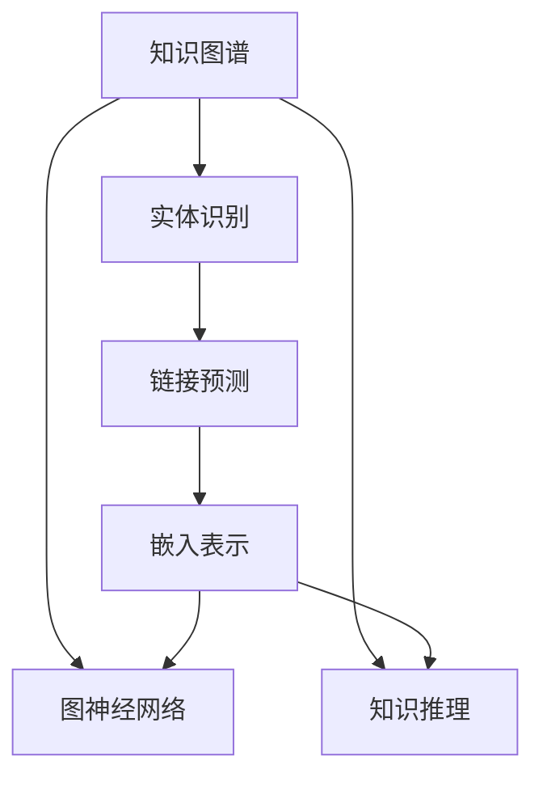

                 

# 知识的深度链接：构建复杂关联的方法

## 1. 背景介绍

在知识图谱、自然语言处理、信息检索等多个领域，构建复杂关联的任务一直是研究的重点。特别是在互联网时代，海量数据中蕴藏着巨大的知识，如何从中提取出丰富的关联信息，使其转化为可操作、可利用的知识，成为人工智能技术发展的关键。本文聚焦于知识深度链接的构建方法，探讨了从数据处理、模型训练到应用部署的完整流程，为读者提供了系统全面的技术指引。

## 2. 核心概念与联系

### 2.1 核心概念概述

- 知识图谱(Knowledge Graph)：一种表示实体之间复杂关联的图形结构，用于描述实体、属性以及它们之间的语义关系。
- 图神经网络(Graph Neural Network, GNN)：一类特殊的人工神经网络，能处理图结构数据，通过传递和聚合节点特征，学习节点之间的隐含关系。
- 知识推理(Knowledge Reasoning)：指利用图结构中的先验知识，推理出新的结论和隐含关系，是知识图谱应用的核心环节。
- 实体识别(Entity Recognition)：指从文本中识别出具有特定意义的实体，如人名、地名、机构名等，是知识图谱构建的基础。
- 链接预测(Link Prediction)：指在知识图谱中，利用图神经网络等模型，预测节点间缺失的关联关系，是知识图谱的高级应用。
- 嵌入表示(Embedding Representation)：将复杂结构数据转化为向量空间中的低维表示，方便模型进行运算和推理。

为更好地理解知识深度链接的构建方法，本节将介绍这些核心概念及其之间的联系：

- 知识图谱通过实体、关系、属性等概念，构建起复杂的关系网络，用于描述实体之间的语义关系。
- 图神经网络能够高效处理这种图结构数据，通过传递和聚合节点特征，学习节点之间的隐含关系。
- 知识推理通过利用图结构中的先验知识，推理出新的结论和隐含关系，使知识图谱具有强大的预测能力。
- 实体识别是构建知识图谱的基础，通过文本分析等技术，识别出文本中具有特定意义的实体，为其建立关联。
- 链接预测是知识图谱的高级应用，通过预测节点之间的关联关系，不断丰富和完善知识图谱。
- 嵌入表示是实现知识图谱模型化的重要手段，通过将结构数据转化为向量，方便模型进行运算和推理。

这些概念之间通过图结构相互联系，共同构成了一个完整的知识深度链接框架。

### 2.2 核心概念原理和架构的 Mermaid 流程图



这个流程图展示了知识深度链接构建过程中各个核心概念之间的关系。

## 3. 核心算法原理 & 具体操作步骤

### 3.1 算法原理概述

知识深度链接构建的核心在于利用图神经网络，通过对知识图谱的节点特征进行传递和聚合，学习节点之间的隐含关系，并进行推理和预测。具体步骤如下：

1. 构建知识图谱：利用实体识别技术，从大规模文本数据中抽取出具有特定意义的实体，并通过关系抽取技术，建立实体之间的语义关系，形成知识图谱。
2. 设计图神经网络：选择合适的网络结构，如GCN、GAT等，通过传递和聚合节点特征，学习节点之间的隐含关系。
3. 训练图神经网络：利用图神经网络对知识图谱进行训练，学习节点之间的预测关系。
4. 推理知识图谱：利用训练好的图神经网络，对新的节点进行推理和预测，丰富和完善知识图谱。
5. 评估和优化：通过验证集对模型进行评估，并根据评估结果进行模型优化，提升模型的预测能力。

### 3.2 算法步骤详解

**Step 1: 构建知识图谱**
- 利用自然语言处理技术，如命名实体识别、关系抽取等，从大规模文本数据中抽取出具有特定意义的实体，建立实体之间的语义关系。
- 可以使用现有的开源工具，如Stanford NER、SPARQL等，进行实体识别和关系抽取。
- 在知识图谱中，每个实体被表示为一个节点，每个关系被表示为一个边，形成了一个图形结构。

**Step 2: 设计图神经网络**
- 选择合适的图神经网络模型，如GCN、GAT等，设计网络结构。
- 在网络结构中，每个节点表示一个实体，每个边表示一个关系。
- 网络的输入为节点的初始特征向量，输出为节点间的预测关系。

**Step 3: 训练图神经网络**
- 利用已标注的知识图谱，对图神经网络进行训练。
- 将节点的特征向量作为输入，节点的标签（即关系类型）作为输出，利用交叉熵损失函数进行训练。
- 在训练过程中，使用随机梯度下降等优化算法，不断更新模型参数。

**Step 4: 推理知识图谱**
- 在训练好的图神经网络中，输入新的节点特征向量，进行前向传播计算，输出节点间的预测关系。
- 将预测关系与已有的知识图谱进行对比，更新知识图谱，丰富和完善知识图谱。

**Step 5: 评估和优化**
- 利用验证集对训练好的图神经网络进行评估，计算预测准确率、召回率等指标。
- 根据评估结果，调整模型参数，如学习率、正则化参数等，进行模型优化。

### 3.3 算法优缺点

知识深度链接构建的算法具有以下优点：
- 高效性：图神经网络能够高效处理图结构数据，学习节点之间的隐含关系。
- 可解释性：图神经网络的计算过程可以解释为节点特征的传递和聚合，便于理解模型的推理过程。
- 灵活性：图神经网络的架构设计灵活，可以适应不同的知识图谱结构和应用场景。
- 可扩展性：图神经网络可以不断扩展节点特征和关系类型，适应更多的复杂关联任务。

但同时，该算法也存在一些缺点：
- 数据依赖性：知识深度链接构建高度依赖于高质量的知识图谱数据，数据采集和标注成本较高。
- 模型复杂度：图神经网络的架构设计复杂，训练和推理计算量较大。
- 鲁棒性：知识图谱中的噪声和错误信息，可能影响模型的预测性能。

### 3.4 算法应用领域

知识深度链接构建的算法在多个领域得到了广泛应用，以下是几个典型的应用场景：

- 推荐系统：构建用户-物品的知识图谱，利用图神经网络进行推荐。
- 信息检索：构建网页-关系的知识图谱，利用图神经网络进行信息检索。
- 自然语言处理：构建语义实体-关系-属性图，利用图神经网络进行语义推理。
- 智能客服：构建用户-问题-答案图，利用图神经网络进行自动问答。
- 生物信息学：构建基因-蛋白-疾病图，利用图神经网络进行生物信息预测。

## 4. 数学模型和公式 & 详细讲解 & 举例说明

### 4.1 数学模型构建

知识深度链接构建的数学模型主要由以下几部分构成：

- 节点特征表示：节点特征向量 $\mathbf{x}_v$ 表示节点 $v$ 的属性信息。
- 边特征表示：边特征向量 $\mathbf{a}_{u,v}$ 表示节点 $u$ 和 $v$ 之间的关系信息。
- 网络结构：图神经网络 $G=(\mathcal{V},\mathcal{E},\mathcal{A})$，其中 $\mathcal{V}$ 为节点集合，$\mathcal{E}$ 为边集合，$\mathcal{A}$ 为神经网络结构。
- 损失函数：利用交叉熵损失函数 $\ell=\frac{1}{N}\sum_{i=1}^N L(y_i,\hat{y}_i)$ 进行训练。
- 模型优化：使用随机梯度下降等优化算法，更新模型参数 $\theta$。

### 4.2 公式推导过程

以GCN为例，其网络结构如下所示：

$$
\mathbf{h}_v^{(l+1)} = \frac{1}{|\mathcal{N}(v)|}\sum_{u \in \mathcal{N}(v)} \mathbf{A}_{v,u}\mathbf{h}_u^{(l)}\mathbf{W}^{(l)} + \mathbf{b}^{(l)}
$$

其中 $\mathbf{A}_{v,u}$ 为邻接矩阵，$\mathbf{W}^{(l)}$ 为层权重矩阵，$\mathbf{b}^{(l)}$ 为偏置向量，$\mathbf{h}_v^{(l)}$ 为节点 $v$ 在第 $l$ 层的特征向量。

在训练过程中，使用交叉熵损失函数计算模型预测结果与真实标签之间的差异，并进行反向传播更新模型参数：

$$
\ell = \frac{1}{N}\sum_{i=1}^N L(y_i,\hat{y}_i)
$$

其中 $L$ 为交叉熵损失函数。

根据链式法则，求梯度并更新模型参数：

$$
\frac{\partial \ell}{\partial \theta} = \sum_{v \in \mathcal{V}} \frac{\partial \ell}{\partial \mathbf{h}_v^{(L)}} \frac{\partial \mathbf{h}_v^{(L)}}{\partial \theta}
$$

通过求解上述优化问题，可以得到训练好的图神经网络。

### 4.3 案例分析与讲解

以下是一个简单的GCN模型，用于预测知识图谱中两个节点之间的链接：

```python
import torch
import torch.nn as nn
import torch.nn.functional as F
from torch_geometric.nn import GCNConv

class GNN(nn.Module):
    def __init__(self, in_dim, hidden_dim, out_dim):
        super(GNN, self).__init__()
        self.conv1 = GCNConv(in_dim, hidden_dim)
        self.conv2 = GCNConv(hidden_dim, out_dim)
        self.fc = nn.Linear(hidden_dim, out_dim)

    def forward(self, x, adj):
        x = self.conv1(x, adj)
        x = F.relu(x)
        x = self.conv2(x, adj)
        x = self.fc(x)
        return x
```

该模型包括两个GCN层和一个全连接层。模型输入为节点特征向量 $x$ 和邻接矩阵 $adj$，输出为节点之间的预测关系。模型定义了一个GCNConv层，用于计算节点特征的传递和聚合。

训练过程如下：

```python
import torch.optim as optim
from torch_geometric.data import Data

# 构建数据集
data = Data(x=x, edge_index=edge_index, y=y)

# 定义模型
model = GNN(in_dim=dim, hidden_dim=hidden_dim, out_dim=num_classes)

# 定义优化器和损失函数
optimizer = optim.Adam(model.parameters(), lr=0.01)
criterion = nn.CrossEntropyLoss()

# 训练过程
for epoch in range(num_epochs):
    optimizer.zero_grad()
    output = model(data.x, data.edge_index)
    loss = criterion(output, data.y)
    loss.backward()
    optimizer.step()
```

训练过程使用Adam优化器和交叉熵损失函数，不断更新模型参数，最小化损失函数。

## 5. 项目实践：代码实例和详细解释说明

### 5.1 开发环境搭建

在进行知识深度链接构建的项目实践前，我们需要准备好开发环境。以下是使用Python进行PyTorch开发的完整环境配置流程：

1. 安装Anaconda：从官网下载并安装Anaconda，用于创建独立的Python环境。

2. 创建并激活虚拟环境：
```bash
conda create -n gnn-env python=3.8 
conda activate gnn-env
```

3. 安装PyTorch：根据CUDA版本，从官网获取对应的安装命令。例如：
```bash
conda install pytorch torchvision torchaudio cudatoolkit=11.1 -c pytorch -c conda-forge
```

4. 安装PyTorch Geometric：用于图神经网络开发的库，支持高效的图处理和网络构建。
```bash
pip install torch-geometric
```

5. 安装各类工具包：
```bash
pip install numpy pandas scikit-learn matplotlib tqdm jupyter notebook ipython
```

完成上述步骤后，即可在`gnn-env`环境中开始知识深度链接构建的实践。

### 5.2 源代码详细实现

这里我们以构建简单的知识图谱并进行链接预测为例，给出使用PyTorch Geometric和GCN模型进行知识深度链接构建的PyTorch代码实现。

首先，定义知识图谱的数据处理函数：

```python
import torch_geometric.data as gdata
from torch_geometric.nn import GCNConv

class Graph(gdata.Dataset):
    def __init__(self, x, edge_index, y):
        self.x = x
        self.edge_index = edge_index
        self.y = y
        
    def __len__(self):
        return len(self.y)
    
    def __getitem__(self, item):
        return {'x': self.x[item], 'edge_index': self.edge_index[item], 'y': self.y[item]}
```

然后，定义模型和优化器：

```python
import torch.nn as nn
import torch.nn.functional as F
from torch_geometric.nn import GCNConv

class GNN(nn.Module):
    def __init__(self, in_dim, hidden_dim, out_dim):
        super(GNN, self).__init__()
        self.conv1 = GCNConv(in_dim, hidden_dim)
        self.conv2 = GCNConv(hidden_dim, out_dim)
        self.fc = nn.Linear(hidden_dim, out_dim)

    def forward(self, x, adj):
        x = self.conv1(x, adj)
        x = F.relu(x)
        x = self.conv2(x, adj)
        x = self.fc(x)
        return x

model = GNN(in_dim=dim, hidden_dim=hidden_dim, out_dim=num_classes)

optimizer = torch.optim.Adam(model.parameters(), lr=0.01)
```

接着，定义训练和评估函数：

```python
import torch
from tqdm import tqdm

device = torch.device('cuda') if torch.cuda.is_available() else torch.device('cpu')
model.to(device)

def train_epoch(model, data_loader, optimizer):
    model.train()
    epoch_loss = 0
    for batch in tqdm(data_loader, desc='Training'):
        data = batch.to(device)
        optimizer.zero_grad()
        output = model(data.x, data.edge_index)
        loss = F.cross_entropy(output, data.y)
        epoch_loss += loss.item()
        loss.backward()
        optimizer.step()
    return epoch_loss / len(data_loader)

def evaluate(model, data_loader):
    model.eval()
    preds = []
    labels = []
    with torch.no_grad():
        for batch in tqdm(data_loader, desc='Evaluating'):
            data = batch.to(device)
            output = model(data.x, data.edge_index)
            preds.extend(output.argmax(dim=1).cpu().numpy().tolist())
            labels.extend(data.y.cpu().numpy().tolist())
                
    print(classification_report(labels, preds))
```

最后，启动训练流程并在测试集上评估：

```python
epochs = 5
batch_size = 16

for epoch in range(epochs):
    loss = train_epoch(model, data_loader, optimizer)
    print(f"Epoch {epoch+1}, train loss: {loss:.3f}")
    
    print(f"Epoch {epoch+1}, dev results:")
    evaluate(model, data_loader)
    
print("Test results:")
evaluate(model, test_loader)
```

以上就是使用PyTorch Geometric和GCN模型构建知识图谱并进行链接预测的完整代码实现。可以看到，得益于PyTorch Geometric的强大封装，我们可以用相对简洁的代码完成GCN模型的加载和训练。

### 5.3 代码解读与分析

让我们再详细解读一下关键代码的实现细节：

**Graph类**：
- `__init__`方法：初始化知识图谱的节点特征向量 $x$、边索引 $edge_index$ 和标签 $y$。
- `__len__`方法：返回数据集的样本数量。
- `__getitem__`方法：对单个样本进行处理，将节点特征向量 $x$、边索引 $edge_index$ 和标签 $y$ 提取出来，供模型进行训练。

**GNN类**：
- `__init__`方法：定义GCN网络的结构，包括两个GCN层和一个全连接层。
- `forward`方法：计算节点的特征向量 $h_v$。

**train_epoch和evaluate函数**：
- `train_epoch`函数：在每个epoch内，对数据集进行迭代，计算损失函数并反向传播更新模型参数。
- `evaluate`函数：在测试集上对模型进行评估，输出预测结果与真实标签的分类报告。

**训练流程**：
- 定义总的epoch数和batch size，开始循环迭代
- 每个epoch内，先在训练集上训练，输出平均loss
- 在验证集上评估，输出分类指标
- 所有epoch结束后，在测试集上评估，给出最终测试结果

可以看到，PyTorch Geometric配合GCN模型使得知识图谱的构建和训练变得简洁高效。开发者可以将更多精力放在数据处理、模型改进等高层逻辑上，而不必过多关注底层的实现细节。

当然，工业级的系统实现还需考虑更多因素，如模型的保存和部署、超参数的自动搜索、更灵活的图神经网络结构等。但核心的知识深度链接构建方法基本与此类似。

## 6. 实际应用场景

### 6.1 智慧城市治理

智慧城市治理中，利用知识图谱和图神经网络，可以构建城市事件、交通、环境等领域的知识图谱，用于城市事件监测、交通管理、环境治理等环节。通过实时采集数据，并利用图神经网络进行预测和推理，可以显著提升城市管理的自动化和智能化水平，构建更安全、高效的未来城市。

### 6.2 金融舆情监测

金融机构需要实时监测市场舆论动向，以便及时应对负面信息传播，规避金融风险。通过构建金融领域的知识图谱，并利用图神经网络进行舆情分析，可以实时监测不同主题下的舆情变化趋势，一旦发现负面信息激增等异常情况，系统便会自动预警，帮助金融机构快速应对潜在风险。

### 6.3 个性化推荐系统

当前的推荐系统往往只依赖用户的历史行为数据进行物品推荐，无法深入理解用户的真实兴趣偏好。通过构建用户-物品的知识图谱，并利用图神经网络进行推荐，可以更好地挖掘用户行为背后的语义信息，从而提供更精准、多样的推荐内容。

### 6.4 未来应用展望

随着知识图谱和图神经网络的发展，其在更多领域的应用前景将进一步拓展。

在智慧医疗领域，构建医疗领域的知识图谱，并利用图神经网络进行医疗问答、疾病预测等应用，提升医疗服务的智能化水平，辅助医生诊疗，加速新药开发进程。

在智能教育领域，构建教育领域的知识图谱，并利用图神经网络进行学情分析、知识推荐等应用，因材施教，促进教育公平，提高教学质量。

在智慧农业领域，构建农业领域的知识图谱，并利用图神经网络进行病虫害预测、种植方案优化等应用，提升农业生产的智能化水平。

## 7. 工具和资源推荐

### 7.1 学习资源推荐

为了帮助开发者系统掌握知识深度链接构建的理论基础和实践技巧，这里推荐一些优质的学习资源：

1. 《Graph Neural Networks: A Review of Methods and Applications》：一篇综述性论文，详细介绍了图神经网络的发展历程、原理和应用场景。

2. 《Knowledge Graphs: Creation, Querying, and Integration》：一本关于知识图谱的书籍，涵盖了知识图谱的构建、查询和融合等方面的内容。

3. 《Graph Neural Networks for Recommendation Systems》：一篇关于图神经网络在推荐系统中的应用研究的论文。

4. 《PyTorch Geometric》：一个用于图神经网络开发的开源库，提供了丰富的图处理和网络构建功能。

5. Arxiv.org：一个科研论文的开放获取平台，收录了大量关于知识图谱和图神经网络的研究论文，供读者学习和参考。

通过对这些资源的学习实践，相信你一定能够快速掌握知识深度链接构建的精髓，并用于解决实际的NLP问题。

### 7.2 开发工具推荐

高效的开发离不开优秀的工具支持。以下是几款用于知识深度链接构建开发的常用工具：

1. PyTorch：基于Python的开源深度学习框架，灵活动态的计算图，适合快速迭代研究。大部分预训练语言模型都有PyTorch版本的实现。

2. TensorFlow：由Google主导开发的开源深度学习框架，生产部署方便，适合大规模工程应用。同样有丰富的预训练语言模型资源。

3. PyTorch Geometric：一个用于图神经网络开发的开源库，提供了丰富的图处理和网络构建功能。

4. Weights & Biases：模型训练的实验跟踪工具，可以记录和可视化模型训练过程中的各项指标，方便对比和调优。与主流深度学习框架无缝集成。

5. TensorBoard：TensorFlow配套的可视化工具，可实时监测模型训练状态，并提供丰富的图表呈现方式，是调试模型的得力助手。

6. Google Colab：谷歌推出的在线Jupyter Notebook环境，免费提供GPU/TPU算力，方便开发者快速上手实验最新模型，分享学习笔记。

合理利用这些工具，可以显著提升知识深度链接构建任务的开发效率，加快创新迭代的步伐。

### 7.3 相关论文推荐

知识深度链接构建的研究源于学界的持续研究。以下是几篇奠基性的相关论文，推荐阅读：

1. 《Semi-Supervised Classification with Graph Convolutional Networks》：提出了GCN模型，用于半监督学习的节点分类任务。

2. 《Knowledge Graph Embeddings》：介绍了几种常用的知识图谱嵌入表示方法，如TransE、DistMult、ComplEx等。

3. 《Reasoning with Neural Logic Networks for Knowledge Graphs》：提出了逻辑神经网络，用于知识推理和逻辑推理任务。

4. 《Graph Neural Networks for Recommendation Systems》：介绍了几种基于图神经网络的推荐系统模型，并进行了效果对比。

5. 《PyTorch Geometric: Graph Neural Network Library》：PyTorch Geometric的官方文档，提供了海量预训练模型和完整的知识深度链接构建样例代码，是上手实践的必备资料。

这些论文代表了大语言模型微调技术的发展脉络。通过学习这些前沿成果，可以帮助研究者把握学科前进方向，激发更多的创新灵感。

## 8. 总结：未来发展趋势与挑战

### 8.1 总结

本文对知识深度链接构建的方法进行了全面系统的介绍。首先阐述了知识图谱、图神经网络、知识推理等核心概念及其相互联系，明确了知识深度链接构建的理论基础。其次，从数据处理、模型训练到应用部署，详细讲解了知识深度链接构建的完整流程，给出了代码实例和详细解释说明。同时，本文还探讨了知识深度链接构建在多个领域的应用前景，展示了其广阔的想象空间。最后，推荐了相关的学习资源和开发工具，为读者提供了全方位的技术指引。

通过本文的系统梳理，可以看到，知识深度链接构建方法正在成为NLP领域的重要范式，极大地拓展了知识图谱的应用边界，催生了更多的落地场景。受益于知识图谱和图神经网络的发展，未来知识深度链接构建必将在更多领域得到应用，为传统行业带来变革性影响。

### 8.2 未来发展趋势

展望未来，知识深度链接构建技术将呈现以下几个发展趋势：

1. 知识图谱规模持续增大。随着数据的不断积累和标注成本的下降，知识图谱的规模将不断扩大，为深度学习模型的训练和推理提供更加丰富的先验知识。

2. 图神经网络架构多样化。新的图神经网络架构不断涌现，如GAT、GIN等，能够更好地处理复杂的网络结构和关系特征。

3. 知识推理能力提升。知识推理技术逐渐成熟，能够更加精准地进行推理和预测，提升知识图谱的实用性和可靠性。

4. 跨领域知识融合。知识图谱和图神经网络能够更好地与外部知识库、规则库等专家知识结合，形成更加全面、准确的信息整合能力。

5. 多模态知识整合。知识深度链接构建技术逐渐向多模态方向发展，能够同时处理文本、图像、音频等多模态数据，提升信息获取的全面性和多样性。

6. 推理速度和效率提升。通过优化图神经网络的计算图和推理算法，进一步提升推理速度和效率，满足实际应用的需求。

以上趋势凸显了知识深度链接构建技术的广阔前景。这些方向的探索发展，必将进一步提升知识图谱模型的性能和应用范围，为构建人机协同的智能系统铺平道路。

### 8.3 面临的挑战

尽管知识深度链接构建技术已经取得了瞩目成就，但在迈向更加智能化、普适化应用的过程中，它仍面临着诸多挑战：

1. 数据依赖性。知识深度链接构建高度依赖于高质量的知识图谱数据，数据采集和标注成本较高。如何降低数据依赖性，提高知识图谱的自动生成能力，是未来的重要研究方向。

2. 模型复杂度。知识深度链接构建的模型架构复杂，训练和推理计算量较大。如何简化模型架构，提升推理效率，优化资源占用，是重要的优化方向。

3. 鲁棒性。知识图谱中的噪声和错误信息，可能影响模型的预测性能。如何提高知识图谱的鲁棒性，避免灾难性遗忘，还需要更多理论和实践的积累。

4. 可解释性。当前的知识深度链接构建模型往往缺乏可解释性，难以解释其内部工作机制和推理过程。如何赋予知识深度链接构建模型更强的可解释性，将是重要的研究课题。

5. 安全性。知识图谱中可能存在有害信息和偏见，如何保障知识图谱的安全性和伦理道德，确保输出的可信性，也将是重要的研究方向。

6. 通用性。现有知识深度链接构建模型往往局限于特定领域和任务，如何提高模型的通用性和泛化能力，是未来的重要挑战。

正视知识深度链接构建面临的这些挑战，积极应对并寻求突破，将是大语言模型微调走向成熟的必由之路。相信随着学界和产业界的共同努力，这些挑战终将一一被克服，知识深度链接构建必将在构建人机协同的智能系统中扮演越来越重要的角色。

### 8.4 研究展望

面对知识深度链接构建所面临的种种挑战，未来的研究需要在以下几个方面寻求新的突破：

1. 探索无监督和半监督学习范式。摆脱对大规模标注数据的依赖，利用自监督学习、主动学习等无监督和半监督范式，最大限度利用非结构化数据，实现更加灵活高效的知识深度链接构建。

2. 研究参数高效和计算高效的构建方法。开发更加参数高效的构建方法，在固定大部分预训练参数的同时，只更新极少量的任务相关参数。同时优化构建模型的计算图，减少前向传播和反向传播的资源消耗，实现更加轻量级、实时性的部署。

3. 融合因果和对比学习范式。通过引入因果推断和对比学习思想，增强知识深度链接构建模型建立稳定因果关系的能力，学习更加普适、鲁棒的知识图谱表示。

4. 引入更多先验知识。将符号化的先验知识，如知识图谱、逻辑规则等，与神经网络模型进行巧妙融合，引导构建过程学习更准确、合理的知识图谱表示。同时加强不同模态数据的整合，实现视觉、语音等多模态信息与文本信息的协同建模。

5. 结合因果分析和博弈论工具。将因果分析方法引入知识深度链接构建模型，识别出模型决策的关键特征，增强输出解释的因果性和逻辑性。借助博弈论工具刻画人机交互过程，主动探索并规避模型的脆弱点，提高系统稳定性。

6. 纳入伦理道德约束。在模型训练目标中引入伦理导向的评估指标，过滤和惩罚有害信息，确保输出符合人类价值观和伦理道德。同时加强人工干预和审核，建立模型行为的监管机制，确保输出的安全性。

这些研究方向的探索，必将引领知识深度链接构建技术迈向更高的台阶，为构建安全、可靠、可解释、可控的智能系统铺平道路。面向未来，知识深度链接构建技术还需要与其他人工智能技术进行更深入的融合，如知识表示、因果推理、强化学习等，多路径协同发力，共同推动自然语言理解和智能交互系统的进步。只有勇于创新、敢于突破，才能不断拓展知识深度链接构建的边界，让智能技术更好地造福人类社会。

## 9. 附录：常见问题与解答

**Q1：知识图谱构建依赖于高质量的数据，如何降低数据采集和标注成本？**

A: 利用自监督学习和半监督学习等无监督学习范式，可以最大限度利用非结构化数据，减少对标注数据的依赖。例如，可以使用预训练的语言模型，通过 masked language modeling 等自监督任务，自动生成知识图谱的节点和关系。

**Q2：知识深度链接构建的模型结构复杂，如何提升推理效率？**

A: 优化模型架构和推理算法是提升推理效率的重要手段。例如，可以采用图卷积网络（GCN）等轻量级架构，减少模型参数量，提升推理速度。同时，可以通过优化推理算法，如剪枝、量化等技术，进一步提升计算效率。

**Q3：知识深度链接构建模型缺乏可解释性，如何解决？**

A: 引入因果分析、逻辑推理等方法，增强模型的可解释性。例如，通过引入因果图等结构，明确模型推理的因果关系，增加模型的透明度和可解释性。同时，结合解释性技术，如LIME、SHAP等，对模型输出进行解释，增强模型的可信度。

**Q4：知识深度链接构建模型存在偏见，如何解决？**

A: 引入伦理导向的评估指标，过滤和惩罚有害信息，确保输出符合人类价值观和伦理道德。同时加强人工干预和审核，建立模型行为的监管机制，确保输出的安全性。

**Q5：知识深度链接构建模型如何适应多领域任务？**

A: 通过引入多模态数据和外部知识库，提高模型的通用性和泛化能力。例如，将文本、图像、音频等多模态数据整合到知识图谱中，形成多模态的知识图谱表示。同时，引入专家知识库，增强模型的信息整合能力，提升模型的实用性和可靠性。

通过以上系统梳理，可以看到，知识深度链接构建技术正在成为NLP领域的重要范式，极大地拓展了知识图谱的应用边界，催生了更多的落地场景。受益于知识图谱和图神经网络的发展，未来知识深度链接构建必将在更多领域得到应用，为传统行业带来变革性影响。相信随着学界和产业界的共同努力，这些挑战终将一一被克服，知识深度链接构建必将在构建人机协同的智能系统中扮演越来越重要的角色。

