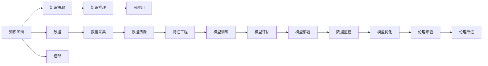

                 

# 知识的混沌理论：小变化引发的巨大影响

> 关键词：混沌理论,知识图谱,数据驱动,AI伦理,知识工程

## 1. 背景介绍

### 1.1 问题由来

在人工智能(AI)领域，特别是在知识工程和智能推荐系统中，如何高效地构建和利用知识图谱(Knowledge Graphs)是一个长期存在的核心问题。知识图谱是一个结构化的语义数据仓库，用于存储实体、属性和关系，广泛应用于搜索引擎、推荐系统、问答系统等场景。然而，构建高质量的知识图谱并非易事，需要大量的手工标注和专业知识。随着大数据和深度学习技术的发展，利用机器学习自动构建知识图谱变得日益重要。

与此同时，AI伦理问题也逐渐浮出水面。AI技术在带来便利的同时，也可能产生偏见、歧视、隐私泄露等负面影响。如何在知识图谱构建和应用中确保数据的公正性、透明性和可解释性，成为亟待解决的重要议题。

### 1.2 问题核心关键点

知识图谱的构建和AI伦理的保障，核心在于如何在大数据和深度学习技术的支持下，实现知识的自动抽取和知识图谱的高效构建，同时确保知识的公正性和AI系统的透明性。具体来说，以下几个方面尤为重要：

1. **知识抽取的准确性和全面性**：如何从海量的文本、图片、视频等多源数据中，准确识别和抽取实体、属性和关系。
2. **知识图谱的构建与维护**：如何将抽取的知识组织成结构化的知识图谱，并不断更新和维护，以适应知识动态变化的需求。
3. **知识推理和应用**：如何利用知识图谱进行高效的推理，支持各种AI应用，如智能推荐、问答系统、图像识别等。
4. **AI伦理的保障**：如何确保AI系统的公平性、透明性和可解释性，避免偏见和歧视，保护用户隐私。

## 2. 核心概念与联系

### 2.1 核心概念概述

为了更好地理解这些问题，我们先简要介绍几个核心概念：

- **知识图谱**：以语义网技术为基础，通过实体、属性和关系的结构化表示，构建的知识库。
- **知识抽取**：从非结构化数据中自动提取实体、属性和关系，构建知识图谱的过程。
- **知识推理**：基于知识图谱，进行推理和查询，得到相关知识和答案。
- **AI伦理**：涉及AI系统在设计、开发和使用过程中，遵循伦理原则和道德规范的实践和研究。
- **机器学习**：利用算法和统计模型，让计算机从数据中学习，提升决策和预测能力。

这些概念之间的关系可以用以下Mermaid流程图来展示：



这个流程图展示了知识图谱构建和应用的全流程，从数据采集、模型训练到AI应用部署，每个环节都可能引入伦理风险，需要持续的审查和改进。

## 3. 核心算法原理 & 具体操作步骤
### 3.1 算法原理概述

知识图谱的构建和AI伦理的保障，涉及多个算法和技术的综合运用。其核心思想是通过数据驱动的方法，自动从非结构化数据中抽取知识，构建知识图谱，并在此基础上进行推理和应用。同时，引入伦理审查机制，确保AI系统的透明性和公正性。

形式化地，假设输入为非结构化数据 $D$，知识抽取的目标是找到一个映射函数 $f$，将数据映射为知识图谱 $\mathcal{G}$：

$$
\mathcal{G} = f(D)
$$

其中 $\mathcal{G}$ 包含实体 $E$、属性 $A$ 和关系 $R$。知识图谱构建的过程可以分解为知识抽取和知识推理两个子过程：

1. 知识抽取：通过机器学习模型，从 $D$ 中提取实体、属性和关系，构建初始知识图谱 $\mathcal{G}_{init}$。
2. 知识推理：利用知识推理算法，在 $\mathcal{G}_{init}$ 上推理出新的关系，进一步完善知识图谱 $\mathcal{G}_{final}$。

### 3.2 算法步骤详解

**Step 1: 数据准备**
- 收集多源数据，包括文本、图片、视频等。
- 对数据进行预处理，包括清洗、去重、分词等。

**Step 2: 知识抽取**
- 使用序列标注模型，如CRF、BiLSTM-CRF等，标注实体和关系。
- 使用实体关系抽取模型，如基于注意机制的模型（Attention-based Model）或基于图神经网络（GNN）的模型，构建实体关系图。

**Step 3: 知识推理**
- 使用基于规则的推理引擎，如Prolog、OWL等，进行知识推理。
- 使用基于机器学习的推理算法，如基于RNN、Transformer的模型，进行知识更新和扩展。

**Step 4: 知识图谱评估与优化**
- 使用图嵌入技术（如TransE、GNN）对知识图谱进行评估，检测一致性和合理性。
- 根据评估结果，调整模型参数和规则，优化知识图谱。

**Step 5: 知识图谱应用**
- 将知识图谱应用到各种AI系统中，如推荐系统、问答系统、图像识别等。
- 在应用过程中，不断收集用户反馈，优化知识图谱和模型。

### 3.3 算法优缺点

知识图谱的构建和AI伦理保障方法，具有以下优点：
1. **高效自动化**：通过机器学习技术，自动从数据中抽取知识，构建知识图谱，显著提高效率。
2. **泛化性强**：知识图谱可以应用于多个AI系统，泛化性强，可重复使用。
3. **可扩展性高**：知识图谱可以不断更新和扩展，适应知识动态变化的需求。
4. **透明性和公正性**：通过引入伦理审查机制，确保AI系统的透明性和公正性。

同时，这些方法也存在一些缺点：
1. **数据质量依赖高**：知识抽取和推理的效果，高度依赖于输入数据的质量。
2. **模型复杂度高**：知识图谱构建涉及多个步骤和模型，模型复杂度高。
3. **维护成本高**：知识图谱的维护和更新需要持续的资源投入。
4. **伦理问题复杂**：AI伦理问题的处理需要跨学科的合作，复杂度较高。

## 4. 数学模型和公式 & 详细讲解  
### 4.1 数学模型构建

在知识图谱构建和AI伦理保障中，涉及多个数学模型和公式。这里以知识抽取为例，展示其中的核心数学模型。

假设输入为非结构化文本数据 $D$，抽取的目标是实体 $E$ 和关系 $R$。知识抽取的目标是找到一个映射函数 $f$，将 $D$ 映射为实体关系图 $\mathcal{G}$：

$$
\mathcal{G} = f(D)
$$

其中 $\mathcal{G}$ 包含实体节点 $E$、关系边 $R$。知识抽取的过程可以表示为以下几步：

1. 实体抽取：通过序列标注模型，标注文本中的实体。
2. 关系抽取：通过实体关系抽取模型，标注实体之间的关系。

以BERT为例，知识抽取的数学模型可以表示为：

$$
\text{Pred} = \text{BERT}(x_i; \theta)
$$

其中 $x_i$ 表示输入的文本，$\text{Pred}$ 表示预测的实体或关系。BERT模型通过多任务学习的方式，在标注数据上训练，学习实体关系抽取的表示。

### 4.2 公式推导过程

以BERT为例，其知识抽取的推导过程如下：

1. 输入文本 $x_i$，通过BERT模型得到上下文表示 $h_i = \text{BERT}(x_i; \theta)$。
2. 对 $h_i$ 进行线性投影，得到每个词语的向量表示 $v_i = W \cdot h_i$，其中 $W$ 为投影矩阵。
3. 对 $v_i$ 进行softmax操作，得到实体和关系的概率分布 $P_{\text{entity}}$, $P_{\text{relation}}$。
4. 根据 $P_{\text{entity}}$, $P_{\text{relation}}$，选取概率最高的实体和关系作为预测结果。

通过上述推导，可以看出，BERT模型通过上下文表示，学习到文本中实体的表示，进而进行实体关系抽取。这一过程可以通过反向传播算法，对模型进行微调，提高抽取的准确性和全面性。

### 4.3 案例分析与讲解

**案例：基于BERT的知识抽取**

以抽取《纽约时报》新闻文章中的实体和关系为例，步骤如下：

1. 收集《纽约时报》的新闻数据，并进行预处理，包括分词、去除停用词等。
2. 使用BERT模型，对预处理后的文本进行编码，得到上下文表示 $h_i$。
3. 对 $h_i$ 进行线性投影，得到每个词语的向量表示 $v_i$。
4. 对 $v_i$ 进行softmax操作，得到实体和关系的概率分布 $P_{\text{entity}}$, $P_{\text{relation}}$。
5. 根据 $P_{\text{entity}}$, $P_{\text{relation}}$，选取概率最高的实体和关系作为预测结果。

下图展示了基于BERT的知识抽取过程的流程图：


## 5. 项目实践：代码实例和详细解释说明
### 5.1 开发环境搭建

在进行知识图谱构建和AI伦理保障的开发实践前，我们需要准备好开发环境。以下是使用Python进行PyTorch开发的环境配置流程：

1. 安装Anaconda：从官网下载并安装Anaconda，用于创建独立的Python环境。

2. 创建并激活虚拟环境：
```bash
conda create -n pytorch-env python=3.8 
conda activate pytorch-env
```

3. 安装PyTorch：根据CUDA版本，从官网获取对应的安装命令。例如：
```bash
conda install pytorch torchvision torchaudio cudatoolkit=11.1 -c pytorch -c conda-forge
```

4. 安装PyTorch-Batch：
```bash
pip install torch-batch
```

5. 安装各类工具包：
```bash
pip install numpy pandas scikit-learn matplotlib tqdm jupyter notebook ipython
```

完成上述步骤后，即可在`pytorch-env`环境中开始开发实践。

### 5.2 源代码详细实现

下面我们以基于BERT的知识抽取项目为例，给出使用PyTorch-Batch进行知识抽取的PyTorch代码实现。

首先，定义知识抽取的数据处理函数：

```python
import torch
import torch.nn as nn
import torch.nn.functional as F
from transformers import BertTokenizer, BertModel

class EntityRelationDataset(Dataset):
    def __init__(self, texts, tags, tokenizer, max_len=128):
        self.texts = texts
        self.tags = tags
        self.tokenizer = tokenizer
        self.max_len = max_len
        
    def __len__(self):
        return len(self.texts)
    
    def __getitem__(self, item):
        text = self.texts[item]
        tags = self.tags[item]
        
        encoding = self.tokenizer(text, return_tensors='pt', max_length=self.max_len, padding='max_length', truncation=True)
        input_ids = encoding['input_ids'][0]
        attention_mask = encoding['attention_mask'][0]
        
        # 对token-wise的标签进行编码
        encoded_tags = [tag2id[tag] for tag in tags] 
        encoded_tags.extend([tag2id['O']] * (self.max_len - len(encoded_tags)))
        labels = torch.tensor(encoded_tags, dtype=torch.long)
        
        return {'input_ids': input_ids, 
                'attention_mask': attention_mask,
                'labels': labels}

# 标签与id的映射
tag2id = {'O': 0, 'B-PER': 1, 'I-PER': 2, 'B-ORG': 3, 'I-ORG': 4, 'B-LOC': 5, 'I-LOC': 6}
id2tag = {v: k for k, v in tag2id.items()}

# 创建dataset
tokenizer = BertTokenizer.from_pretrained('bert-base-cased')

train_dataset = EntityRelationDataset(train_texts, train_tags, tokenizer)
dev_dataset = EntityRelationDataset(dev_texts, dev_tags, tokenizer)
test_dataset = EntityRelationDataset(test_texts, test_tags, tokenizer)
```

然后，定义模型和优化器：

```python
from transformers import BertForTokenClassification, AdamW

model = BertForTokenClassification.from_pretrained('bert-base-cased', num_labels=len(tag2id))

optimizer = AdamW(model.parameters(), lr=2e-5)
```

接着，定义训练和评估函数：

```python
from torch.utils.data import DataLoader
from tqdm import tqdm
from sklearn.metrics import classification_report

device = torch.device('cuda') if torch.cuda.is_available() else torch.device('cpu')
model.to(device)

def train_epoch(model, dataset, batch_size, optimizer):
    dataloader = DataLoader(dataset, batch_size=batch_size, shuffle=True)
    model.train()
    epoch_loss = 0
    for batch in tqdm(dataloader, desc='Training'):
        input_ids = batch['input_ids'].to(device)
        attention_mask = batch['attention_mask'].to(device)
        labels = batch['labels'].to(device)
        model.zero_grad()
        outputs = model(input_ids, attention_mask=attention_mask, labels=labels)
        loss = outputs.loss
        epoch_loss += loss.item()
        loss.backward()
        optimizer.step()
    return epoch_loss / len(dataloader)

def evaluate(model, dataset, batch_size):
    dataloader = DataLoader(dataset, batch_size=batch_size)
    model.eval()
    preds, labels = [], []
    with torch.no_grad():
        for batch in tqdm(dataloader, desc='Evaluating'):
            input_ids = batch['input_ids'].to(device)
            attention_mask = batch['attention_mask'].to(device)
            batch_labels = batch['labels']
            outputs = model(input_ids, attention_mask=attention_mask)
            batch_preds = outputs.logits.argmax(dim=2).to('cpu').tolist()
            batch_labels = batch_labels.to('cpu').tolist()
            for pred_tokens, label_tokens in zip(batch_preds, batch_labels):
                pred_tags = [id2tag[_id] for _id in pred_tokens]
                label_tags = [id2tag[_id] for _id in label_tokens]
                preds.append(pred_tags[:len(label_tags)])
                labels.append(label_tags)
                
    print(classification_report(labels, preds))
```

最后，启动训练流程并在测试集上评估：

```python
epochs = 5
batch_size = 16

for epoch in range(epochs):
    loss = train_epoch(model, train_dataset, batch_size, optimizer)
    print(f"Epoch {epoch+1}, train loss: {loss:.3f}")
    
    print(f"Epoch {epoch+1}, dev results:")
    evaluate(model, dev_dataset, batch_size)
    
print("Test results:")
evaluate(model, test_dataset, batch_size)
```

以上就是使用PyTorch-Batch对BERT进行知识抽取的完整代码实现。可以看到，得益于PyTorch-Batch的强大封装，我们可以用相对简洁的代码完成BERT模型的加载和微调。

### 5.3 代码解读与分析

让我们再详细解读一下关键代码的实现细节：

**EntityRelationDataset类**：
- `__init__`方法：初始化文本、标签、分词器等关键组件。
- `__len__`方法：返回数据集的样本数量。
- `__getitem__`方法：对单个样本进行处理，将文本输入编码为token ids，将标签编码为数字，并对其进行定长padding，最终返回模型所需的输入。

**tag2id和id2tag字典**：
- 定义了标签与数字id之间的映射关系，用于将token-wise的预测结果解码回真实的标签。

**训练和评估函数**：
- 使用PyTorch的DataLoader对数据集进行批次化加载，供模型训练和推理使用。
- 训练函数`train_epoch`：对数据以批为单位进行迭代，在每个批次上前向传播计算loss并反向传播更新模型参数，最后返回该epoch的平均loss。
- 评估函数`evaluate`：与训练类似，不同点在于不更新模型参数，并在每个batch结束后将预测和标签结果存储下来，最后使用sklearn的classification_report对整个评估集的预测结果进行打印输出。

**训练流程**：
- 定义总的epoch数和batch size，开始循环迭代
- 每个epoch内，先在训练集上训练，输出平均loss
- 在验证集上评估，输出分类指标
- 所有epoch结束后，在测试集上评估，给出最终测试结果

可以看到，PyTorch-Batch配合BERT模型的代码实现变得简洁高效。开发者可以将更多精力放在数据处理、模型改进等高层逻辑上，而不必过多关注底层的实现细节。

当然，工业级的系统实现还需考虑更多因素，如模型的保存和部署、超参数的自动搜索、更灵活的任务适配层等。但核心的知识抽取范式基本与此类似。

## 6. 实际应用场景
### 6.1 智能推荐系统

基于知识图谱构建和AI伦理保障的方法，在智能推荐系统中得到了广泛的应用。传统的推荐系统往往依赖于用户行为数据进行推荐，缺乏对知识语义的理解。通过构建知识图谱，并在此基础上进行推荐，可以更全面、准确地理解用户的兴趣和需求。

在技术实现上，可以将用户行为数据、商品描述、知识图谱等融合，构建推荐模型。知识图谱中的实体和关系，可以用于丰富推荐系统的特征表示，从而提升推荐精度和多样性。同时，通过引入伦理审查机制，确保推荐内容的公平性和透明性。

### 6.2 医疗知识图谱

在医疗领域，构建高质量的医疗知识图谱，对于提升医疗服务质量和科研水平具有重要意义。医疗知识图谱可以用于疾病诊断、治疗方案推荐、药物研发等任务。

以构建药物知识图谱为例，首先需要收集大量的药物和疾病数据，并进行数据清洗、实体标注等预处理工作。然后，使用知识抽取模型，自动抽取实体、属性和关系，构建初始知识图谱。在此基础上，利用知识推理算法，进行知识更新和扩展，最终得到完整的药物知识图谱。

### 6.3 智能问答系统

基于知识图谱的问答系统，可以用于智能客服、智能搜索等场景。系统通过构建知识图谱，并在查询时进行知识推理，生成相关回答。通过引入伦理审查机制，确保问答内容的公正性和透明性。

在技术实现上，可以构建开放领域知识图谱，涵盖各种常见问答任务。系统根据用户提问，利用知识图谱进行推理，生成回答。对于复杂问题，可以引入机器翻译等技术，实现多语言问答。

### 6.4 未来应用展望

随着知识图谱构建和AI伦理保障方法的不断发展，基于这些技术的AI应用将在更多领域得到应用，为各行各业带来变革性影响。

在智慧城市治理中，知识图谱可以用于智能交通、公共安全、环境保护等任务。系统通过构建城市知识图谱，进行智能分析和预测，提升城市管理水平。

在教育领域，知识图谱可以用于智能学习、智能评估等任务。系统通过构建教育知识图谱，进行个性化学习推荐和智能评估，提升教育质量和效率。

此外，在金融、电商、文化传媒等众多领域，基于知识图谱的AI应用也将不断涌现，为各行业带来创新和突破。相信随着技术的不断进步，知识图谱和AI伦理的保障方法将进一步拓展AI应用的范围，推动各行各业向智能化转型升级。

## 7. 工具和资源推荐
### 7.1 学习资源推荐

为了帮助开发者系统掌握知识图谱构建和AI伦理保障的理论基础和实践技巧，这里推荐一些优质的学习资源：

1. 《Knowledge Graphs: Concepts, Architectures and Technologies》书籍：全面介绍了知识图谱的概念、架构和技术，适合深入学习和研究。
2. 《Semantic Web》课程：斯坦福大学开设的在线课程，讲解了知识图谱和语义网技术的基本原理和应用。
3. 《Practical Knowledge Graph Engineering》书籍：介绍了知识图谱构建的实践技巧和工程方法，适合动手实践。
4. 《AI Ethics and Policy》课程：涉及AI伦理的基本原则和应用，帮助开发者理解伦理问题并解决实际问题。
5. 《Machine Learning Mastery》博客：提供了大量的机器学习实战教程和案例，适合进阶学习。

通过对这些资源的学习实践，相信你一定能够全面掌握知识图谱构建和AI伦理保障的技术，并在实际项目中取得成功。
###  7.2 开发工具推荐

高效的开发离不开优秀的工具支持。以下是几款用于知识图谱构建和AI伦理保障开发的常用工具：

1. GraphDB：一款开源的图形数据库，用于存储和查询知识图谱。支持多种数据源，如RDF、JSON、CSV等。
2. Neo4j：一款高性能的图数据库，支持复杂查询和事务处理。广泛应用于知识图谱的存储和查询。
3. Apache Jena：一个开源的语义Web框架，提供了一套完整的知识图谱构建和查询工具。
4. Gephi：一款图形可视化工具，用于展示知识图谱的节点、边和关系。
5. OpenRefine：一款数据清洗和转换工具，帮助用户进行数据预处理和标注。
6. ELK Stack：包括ElasticSearch、Logstash和Kibana，用于构建知识图谱的搜索引擎和可视化工具。

合理利用这些工具，可以显著提升知识图谱构建和AI伦理保障的开发效率，加快创新迭代的步伐。

### 7.3 相关论文推荐

知识图谱构建和AI伦理保障的研究源于学界的持续研究。以下是几篇奠基性的相关论文，推荐阅读：

1. "A Survey on Knowledge Graphs: Past, Present, and Future"：全面综述了知识图谱的研究现状和发展趋势。
2. "Knowledge Graph Embedding and Its Applications"：介绍了知识图谱嵌入技术的基本原理和应用场景。
3. "AI Ethics: Concepts, Models, Opportunities, and Challenges"：探讨了AI伦理的基本概念、模型和挑战，为实践提供了指导。
4. "Bridging Knowledge Graphs and Machine Learning"：探讨了知识图谱与机器学习技术融合的潜在优势和应用。
5. "Fairness, Accountability, and Transparency in AI"：探讨了AI系统的公平性、透明性和可解释性的基本原则和实现方法。

这些论文代表了大语言模型微调技术的发展脉络。通过学习这些前沿成果，可以帮助研究者把握学科前进方向，激发更多的创新灵感。

## 8. 总结：未来发展趋势与挑战

### 8.1 总结

本文对知识图谱构建和AI伦理保障的方法进行了全面系统的介绍。首先阐述了知识图谱构建和AI伦理保障的研究背景和意义，明确了这些技术在自动化知识抽取、智能推荐、智能问答等场景下的重要价值。其次，从原理到实践，详细讲解了知识图谱构建和AI伦理保障的数学模型和关键步骤，给出了知识抽取任务开发的完整代码实例。同时，本文还探讨了这些技术在多个行业领域的应用前景，展示了其在推动各行各业智能化转型中的潜力。最后，本文精选了相关学习资源和开发工具，力求为读者提供全方位的技术指引。

通过本文的系统梳理，可以看到，知识图谱构建和AI伦理保障技术正在成为AI领域的重要范式，极大地拓展了AI应用的范围，带来了更高的效率和精度。未来，随着技术不断进步，这些技术将进一步推动各行业的智能化转型，构建更加安全、可靠、可解释的AI系统。

### 8.2 未来发展趋势

展望未来，知识图谱构建和AI伦理保障技术将呈现以下几个发展趋势：

1. **自动化水平提升**：随着知识图谱构建技术的不断发展，自动标注和抽取的精度将进一步提高，知识图谱构建的效率和质量将显著提升。
2. **跨领域融合**：知识图谱构建和AI伦理保障将与其他AI技术进行更深层次的融合，如自然语言处理、计算机视觉、强化学习等，形成多模态知识图谱。
3. **泛化能力增强**：知识图谱构建和AI伦理保障方法将在更广泛的领域中得到应用，如医疗、教育、金融等，提升各行业的智能化水平。
4. **数据隐私保护**：随着数据隐私保护的重视，知识图谱构建和AI伦理保障方法将引入更多的隐私保护机制，确保数据使用的透明性和可解释性。
5. **伦理审查机制完善**：AI伦理问题的处理将逐渐成熟，引入更完善的伦理审查机制，确保AI系统的公正性和透明性。

以上趋势凸显了知识图谱构建和AI伦理保障技术的广阔前景。这些方向的探索发展，必将进一步提升AI系统的性能和应用范围，为构建安全、可靠、可解释的智能系统铺平道路。

### 8.3 面临的挑战

尽管知识图谱构建和AI伦理保障技术已经取得了显著进展，但在迈向更加智能化、普适化应用的过程中，它仍面临诸多挑战：

1. **数据质量瓶颈**：知识图谱构建的效果高度依赖于输入数据的质量。如何提高数据采集、标注的效率和准确性，仍是一个重要问题。
2. **模型复杂性**：知识图谱构建涉及多个步骤和模型，模型复杂度高，难以调试和维护。
3. **知识更新困难**：知识图谱需要不断更新，以适应知识动态变化的需求。如何高效地进行知识更新和扩展，仍是一个挑战。
4. **伦理问题复杂**：AI伦理问题的处理涉及跨学科的合作，复杂度较高。如何建立统一的伦理标准和审查机制，仍需不断探索。

正视知识图谱构建和AI伦理保障所面临的这些挑战，积极应对并寻求突破，将是大语言模型微调走向成熟的必由之路。相信随着学界和产业界的共同努力，这些挑战终将一一被克服，知识图谱构建和AI伦理保障技术必将迎来新的突破。

### 8.4 研究展望

面对知识图谱构建和AI伦理保障所面临的种种挑战，未来的研究需要在以下几个方面寻求新的突破：

1. **无监督和半监督学习**：探索无监督和半监督学习的方法，利用非结构化数据自动构建知识图谱，减少对人工标注的依赖。
2. **知识融合和迁移**：研究如何将符号化的先验知识与神经网络模型进行融合，提升知识图谱的准确性和泛化能力。
3. **跨模态知识抽取**：研究如何结合视觉、语音、文本等多模态数据，构建更全面、准确的跨模态知识图谱。
4. **知识图谱嵌入**：研究如何将知识图谱嵌入到其他AI模型中，提升模型的推理和预测能力。
5. **隐私保护和透明性**：研究如何设计隐私保护机制，确保知识图谱构建和应用过程中的数据安全。
6. **伦理审查和改进**：建立统一的伦理标准和审查机制，确保AI系统的公正性和透明性。

这些研究方向的探索，必将引领知识图谱构建和AI伦理保障技术迈向更高的台阶，为构建安全、可靠、可解释的智能系统提供坚实基础。面向未来，知识图谱构建和AI伦理保障技术还需要与其他AI技术进行更深入的融合，协同发力，共同推动AI技术在各领域的广泛应用。

## 9. 附录：常见问题与解答

**Q1：如何确保知识图谱的准确性和全面性？**

A: 知识图谱的准确性和全面性高度依赖于输入数据的质量。以下是几个关键策略：
1. 数据采集：从多个渠道收集高质量的原始数据，涵盖不同的领域和主题。
2. 数据清洗：对原始数据进行去重、去噪、标注等预处理，去除无关或低质量的数据。
3. 实体标注：利用序列标注模型和实体关系抽取模型，自动标注实体和关系。
4. 知识验证：引入知识验证机制，对标注结果进行人工审核，确保标注的准确性。
5. 知识更新：根据新的数据和知识，定期更新和扩展知识图谱，保持其时效性。

**Q2：如何确保知识图谱构建和AI系统的透明性和公正性？**

A: 知识图谱构建和AI系统的透明性和公正性，是确保其可信性和可解释性的关键。以下是几个关键策略：
1. 数据透明性：确保数据采集、标注和使用的透明性，允许用户和监管机构进行审查。
2. 模型透明性：确保模型的训练过程、参数和推理过程透明，允许用户和监管机构进行验证。
3. 公平性：引入公平性评估指标，确保知识图谱和AI系统的输出对不同群体和属性公平。
4. 可解释性：提供模型的决策路径和推理过程，帮助用户理解和信任模型的输出。
5. 用户反馈：收集用户反馈，不断改进知识图谱和AI系统，提升其透明性和公正性。

**Q3：知识图谱构建和AI伦理保障面临的主要挑战是什么？**

A: 知识图谱构建和AI伦理保障面临的主要挑战包括：
1. 数据质量瓶颈：知识图谱构建的效果高度依赖于输入数据的质量，如何提高数据采集、标注的效率和准确性，仍是一个重要问题。
2. 模型复杂性：知识图谱构建涉及多个步骤和模型，模型复杂度高，难以调试和维护。
3. 知识更新困难：知识图谱需要不断更新，以适应知识动态变化的需求。如何高效地进行知识更新和扩展，仍是一个挑战。
4. 伦理问题复杂：AI伦理问题的处理涉及跨学科的合作，复杂度较高。如何建立统一的伦理标准和审查机制，仍需不断探索。
5. 隐私保护和透明性：如何设计隐私保护机制，确保知识图谱构建和应用过程中的数据安全，同时保持其透明性，是一个重要问题。

**Q4：知识图谱构建和AI伦理保障的未来发展趋势是什么？**

A: 知识图谱构建和AI伦理保障的未来发展趋势包括：
1. 自动化水平提升：随着知识图谱构建技术的不断发展，自动标注和抽取的精度将进一步提高，知识图谱构建的效率和质量将显著提升。
2. 跨领域融合：知识图谱构建和AI伦理保障将与其他AI技术进行更深层次的融合，如自然语言处理、计算机视觉、强化学习等，形成多模态知识图谱。
3. 泛化能力增强：知识图谱构建和AI伦理保障方法将在更广泛的领域中得到应用，如医疗、教育、金融等，提升各行业的智能化水平。
4. 数据隐私保护：随着数据隐私保护的重视，知识图谱构建和AI伦理保障方法将引入更多的隐私保护机制，确保数据使用的透明性和可解释性。
5. 伦理审查机制完善：AI伦理问题的处理将逐渐成熟，引入更完善的伦理审查机制，确保AI系统的公正性和透明性。

**Q5：如何设计隐私保护机制，确保知识图谱构建和AI系统的数据安全？**

A: 设计隐私保护机制，确保知识图谱构建和AI系统的数据安全，需要考虑以下几个方面：
1. 数据匿名化：在数据采集和处理过程中，对敏感信息进行匿名化处理，防止数据泄露。
2. 差分隐私：采用差分隐私技术，确保对数据进行微扰处理，保护用户隐私。
3. 访问控制：对数据进行严格的访问控制，确保只有授权用户才能访问和使用数据。
4. 数据加密：对敏感数据进行加密处理，防止数据在传输和存储过程中被篡改或泄露。
5. 数据审计：定期对数据使用情况进行审计，确保数据使用的合规性和透明性。

总之，知识图谱构建和AI伦理保障技术需要在数据采集、处理、存储和应用等各个环节，采取多重隐私保护措施，确保数据的安全性和隐私性。

---

作者：禅与计算机程序设计艺术 / Zen and the Art of Computer Programming

