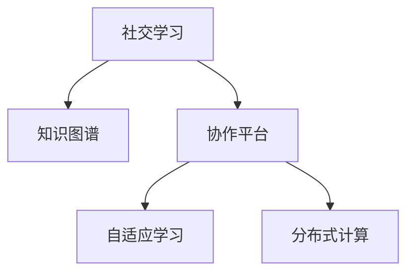

                 

# 知识的社交化学习：协作平台的兴起

> 关键词：知识共享,协作平台,社交网络,社交学习,自适应学习,分布式计算

## 1. 背景介绍

### 1.1 问题由来
随着信息技术的飞速发展，知识的获取与共享变得前所未有地便捷。传统以单向传授为主的教学模式逐渐向以学习者为中心、强调自主探究、协作互动的社交学习模式转变。社交学习不仅关注个体知识的内化，更重视在互动中构建新知识，提升社会化技能。

然而，尽管社交学习被广泛认可，但缺乏有效的平台支撑，其实现效果常常不尽如人意。当前社交学习系统往往功能单一，难以支持跨学科、跨领域的多样化学习需求，也难以实现知识的广泛传播与深度交流。因此，构建一个集知识分享、互动交流、协作探究于一体的社交学习平台，成为当前教育技术领域的重要研究课题。

### 1.2 问题核心关键点
协作平台的核心目标是构建一个以学习者为中心、强调互动交流、支持跨领域协作的学习环境。其关键点包括：

- **知识共享**：构建知识分享机制，让学习者能够自由上传、下载、注释、评价各种学习资源。
- **互动交流**：提供丰富的交流工具，如论坛、讨论区、即时通讯等，支持学习者之间的互动。
- **协作探究**：支持学习者分组协作完成任务、项目，利用学习者间的差异性进行互动探究，促进知识的深度理解。
- **个性化推荐**：根据学习者的兴趣、历史学习记录，推荐合适的学习资源和任务。
- **自适应学习**：通过数据分析，调整学习路径和难度，使学习者的学习过程更具适应性。

## 2. 核心概念与联系

### 2.1 核心概念概述

为更好地理解协作平台的构建，本节将介绍几个核心概念及其之间的关系：

- **社交学习(Social Learning)**：指学习者在互动交流中，通过协作、讨论、分享等方式，共同构建和深化知识的认知过程。社交学习强调学习者间的互动和协作，以及知识在互动中的创造和扩散。

- **知识图谱(Knowledge Graph)**：以图的形式表示知识之间的关联，包含实体、属性、关系等元素，支持基于语义的深度搜索和知识推理。

- **协作平台(Collaboration Platform)**：指支持学习者互动交流、协作探究、知识共享的一类平台，通常集成了多种社交和学习工具，提供丰富的功能和应用场景。

- **自适应学习(Adaptive Learning)**：指根据学习者的个体差异，自动调整学习内容、方式和进度，以促进其高效学习。自适应学习依赖于大量的学习数据分析和智能算法支持。

- **分布式计算(Distributed Computing)**：指利用多台计算机协作处理任务，提升计算效率和资源利用率。协作平台往往涉及大量数据的分布式存储和计算，适合采用分布式计算架构。

这些核心概念之间的逻辑关系可以通过以下Mermaid流程图来展示：



这个流程图展示了几大核心概念之间的关系：

1. 社交学习通过协作平台提供丰富的互动交流机制，促进知识共享和传播。
2. 知识图谱为协作平台提供语义搜索和知识推理的能力，支持知识的深度理解和传播。
3. 自适应学习依赖协作平台和知识图谱进行数据分析，调整学习路径，提升学习效果。
4. 分布式计算支撑协作平台处理大规模数据，提升平台的可扩展性和计算效率。

这些概念共同构成了协作平台的核心架构，为学习者提供了多样化的学习体验和高效的知识管理能力。通过理解这些核心概念，我们可以更好地把握协作平台的构建原则和关键技术。

## 3. 核心算法原理 & 具体操作步骤
### 3.1 算法原理概述

协作平台的构建涉及多个算法和技术，以下将详细介绍其中的关键算法原理：

- **知识图谱构建与语义检索**：
  - 知识图谱是通过结构化数据建模，将知识关系抽象为图结构的过程。常用的知识图谱构建算法包括关系抽取、实体识别、关系推理等。
  - 语义检索则是指在知识图谱上，通过自然语言查询，快速找到相关知识实体和关系的过程。基于知识图谱的语义检索通常结合图神经网络、关系网络等技术实现。

- **自适应学习算法**：
  - 自适应学习算法包括个性化推荐、学习路径规划等。通过数据分析，动态调整学习内容和难度，提升学习效率和体验。
  - 常见的推荐算法包括协同过滤、基于内容的推荐、深度学习推荐等。

- **分布式计算与存储**：
  - 分布式计算框架如Hadoop、Spark等，支持协作平台处理大规模数据，提升计算效率和系统可扩展性。
  - 分布式存储系统如HDFS、HBase等，保障数据的可靠性和可扩展性，支持大数据量的存储和检索。

### 3.2 算法步骤详解

协作平台的构建主要包括以下几个关键步骤：

**Step 1: 数据收集与预处理**
- 收集学习者的历史学习记录、参与讨论的语料、上传的资源等，进行数据清洗和预处理。
- 构建知识图谱，提取实体、属性、关系等知识元素，生成知识图谱的数据库。

**Step 2: 知识图谱构建与语义检索**
- 应用知识图谱构建算法，生成知识图谱的数据结构。
- 结合语义检索算法，实现基于知识图谱的深度搜索和知识推理，提供学习者便捷的知识获取路径。

**Step 3: 个性化推荐与自适应学习**
- 根据学习者的历史行为、兴趣偏好等，应用个性化推荐算法，推荐合适的学习资源和任务。
- 通过数据分析，利用自适应学习算法，调整学习路径和难度，提升学习效果。

**Step 4: 分布式计算与存储**
- 使用分布式计算框架处理大规模数据，提升平台的计算能力和可扩展性。
- 使用分布式存储系统保证数据的可靠性和高效检索。

**Step 5: 用户界面与互动交流**
- 设计用户界面，提供学习资源上传、下载、注释、评价等操作。
- 开发互动交流工具，支持学习者之间的讨论、协作、即时通讯等。

**Step 6: 测试与优化**
- 在平台上进行小规模测试，评估功能实现的正确性和性能表现。
- 根据用户反馈和数据分析，优化平台功能，提升用户体验。

以上是协作平台构建的一般流程。在实际应用中，还需要根据具体需求，对各个环节进行细化和优化，以满足用户的多样化需求。

### 3.3 算法优缺点

协作平台的构建涉及多种算法和技术，以下总结了其主要优缺点：

**优点**：
- 支持大规模知识共享与传播，提升知识的可获取性和可利用性。
- 通过互动交流和协作探究，促进知识的深度理解和创造。
- 利用自适应学习算法，提供个性化、高效的学习体验。
- 采用分布式计算架构，提升平台的可扩展性和计算效率。

**缺点**：
- 数据收集与预处理需要大量人力和资源投入。
- 知识图谱的构建和维护复杂，需要专业知识支持。
- 个性化推荐和自适应学习的实现涉及复杂的算法和数据分析。
- 分布式计算和存储系统的复杂性要求较高，需要高水平的技术实现。

尽管存在这些局限性，协作平台的构建仍是大势所趋，具有广阔的发展前景。未来相关研究将集中在如何降低算法复杂度、提升数据处理效率、增强用户体验等方面。

### 3.4 算法应用领域

协作平台在多个领域具有广泛的应用潜力，以下列举几个典型应用场景：

- **教育领域**：构建基于协作平台的混合学习环境，支持远程教育、翻转课堂、合作学习等模式。
- **企业培训**：提供跨部门、跨行业的知识共享和协作平台，提升员工的学习效率和组织知识创新能力。
- **科研合作**：构建科研协作平台，支持论文共享、数据开放、研究项目协作等功能。
- **医疗教育**：搭建医疗教育协作平台，支持医学知识的共享、病例讨论、在线课程等。
- **社区学习**：构建社区知识共享和交流平台，支持兴趣小组、学习社团、知识竞赛等功能。

## 4. 数学模型和公式 & 详细讲解 & 举例说明
### 4.1 数学模型构建

协作平台的构建涉及多个数学模型和技术，以下详细介绍其中的核心模型：

- **知识图谱的构建**：
  - 知识图谱通常表示为三元组 $(e, r, o)$，其中 $e$ 为实体，$r$ 为关系，$o$ 为对象。
  - 常见的知识图谱构建模型包括关系抽取模型、实体识别模型、关系推理模型等。

- **个性化推荐算法**：
  - 协同过滤算法通过分析用户的历史行为，构建用户-物品的相似性矩阵，推荐相似物品。
  - 基于内容的推荐算法通过提取物品的属性特征，结合用户偏好，推荐相关物品。
  - 深度学习推荐算法使用神经网络模型，通过大量数据训练，实现高精度的个性化推荐。

- **自适应学习算法**：
  - 自适应学习算法包括学习路径规划、学习进度调整等。通过数据分析，动态调整学习内容、难度和进度，提升学习效果。
  - 常见的自适应学习模型包括自适应响应模型、自适应推荐模型、自适应学习模型等。

### 4.2 公式推导过程

以知识图谱构建为例，介绍知识图谱的构建算法：

知识图谱的构建通常涉及以下几个步骤：
1. **实体识别**：从文本中识别出实体，如人名、地名、组织名等。
2. **关系抽取**：从文本中抽取实体之间的关系，如“来自”、“属于”等。
3. **关系推理**：通过逻辑推理，扩展已有的知识图谱，生成新的关系和实体。

以关系抽取为例，常用的关系抽取算法包括基于规则的方法、基于统计的方法和基于深度学习的方法。

- **基于规则的方法**：
  - 使用规则模板对文本进行模式匹配，抽取实体之间的关系。
  - 示例公式：
  $$
  r = \text{extractRelation}(text, rule)
  $$

- **基于统计的方法**：
  - 利用统计模型（如LDA、LSTM等）对文本进行建模，识别实体之间的关系。
  - 示例公式：
  $$
  r = \text{predictRelation}(text, model)
  $$

- **基于深度学习的方法**：
  - 使用神经网络模型（如CNN、RNN、Transformer等）对文本进行编码，提取实体之间的关系。
  - 示例公式：
  $$
  r = \text{predictRelation}(text, model)
  $$

### 4.3 案例分析与讲解

以下以教育领域的协作平台为例，说明如何应用知识图谱、个性化推荐、自适应学习等技术：

**案例背景**：
某教育平台希望构建一个支持远程教育的协作平台，旨在提升学习者的自主学习能力和团队协作能力。

**知识图谱构建**：
- 收集在线课程、教材、讨论记录等数据，进行实体识别和关系抽取，生成知识图谱。
- 通过关系推理，扩展知识图谱，增加新的知识点和关系，如图书馆、实验器材、实验室等。

**个性化推荐**：
- 根据学习者的历史学习记录和兴趣偏好，应用协同过滤、基于内容的推荐算法，推荐合适的在线课程和学习材料。
- 使用深度学习推荐算法，根据学习者的行为数据，动态调整推荐结果，提升推荐精度。

**自适应学习**：
- 根据学习者的学习进度、学习效果等，应用自适应学习算法，调整学习路径和难度。
- 结合学习者之间的互动反馈，实时调整学习路径，支持学习者之间的协作探究。

**用户界面与互动交流**：
- 设计友好的用户界面，提供在线课程上传、下载、评论等功能。
- 开发讨论区、即时通讯等功能，支持学习者之间的交流和协作。

通过以上技术的应用，协作平台能够提供丰富的学习资源和高效的学习体验，支持学习者的自主学习、团队协作和知识创新。

## 5. 项目实践：代码实例和详细解释说明
### 5.1 开发环境搭建

在进行协作平台开发前，我们需要准备好开发环境。以下是使用Python进行Django开发的环境配置流程：

1. 安装Anaconda：从官网下载并安装Anaconda，用于创建独立的Python环境。

2. 创建并激活虚拟环境：
```bash
conda create -n pytorch-env python=3.8 
conda activate pytorch-env
```

3. 安装Django：
```bash
pip install django
```

4. 安装相关库：
```bash
pip install django-crispy-forms django-allauth redis
```

5. 安装MySQL：
```bash
sudo apt-get install mysql-server
```

完成上述步骤后，即可在`pytorch-env`环境中开始协作平台开发。

### 5.2 源代码详细实现

这里我们以教育领域的协作平台为例，给出使用Django框架构建协作平台的Python代码实现。

首先，定义协作平台的用户模型和权限：

```python
from django.contrib.auth.models import AbstractUser, Group
from django.db import models
from django.contrib.auth import get_user_model

User = get_user_model()

class Role(models.Model):
    name = models.CharField(max_length=50)
    permissions = models.ManyToManyField('Permission')

class Permission(models.Model):
    name = models.CharField(max_length=50)

def create_role(name, permissions):
    if not Role.objects.filter(name=name).exists():
        Role.objects.create(name=name)
    role = Role.objects.get(name=name)
    for perm in permissions:
        if not Permission.objects.filter(name=perm).exists():
            Permission.objects.create(name=perm)
        role.permissions.add(Permission.objects.get(name=perm))
```

然后，定义协作平台的核心功能模块：

```python
from django.urls import path
from django.shortcuts import render, redirect
from django.http import HttpResponse

from .models import User, Role, Permission

def user_profile(request, username):
    user = User.objects.get(username=username)
    return render(request, 'user_profile.html', {'user': user})

def user_settings(request, username):
    user = User.objects.get(username=username)
    return render(request, 'user_settings.html', {'user': user})

def create_course(request):
    if request.method == 'POST':
        # 获取课程信息
        course_name = request.POST.get('course_name')
        course_content = request.POST.get('course_content')
        # 创建课程
        Course.objects.create(name=course_name, content=course_content)
        return redirect('home')
    return render(request, 'create_course.html')

def enroll_course(request, course_id):
    if request.method == 'POST':
        # 获取用户和课程信息
        user = User.objects.get(username=request.user.username)
        course = Course.objects.get(id=course_id)
        # 判断用户是否已选该课程
        if course.is_enrolled(user):
            return HttpResponse("You are already enrolled in this course.")
        # 选课
        course.enroll(user)
        return redirect('home')
    return redirect('course_list')
```

接着，定义协作平台的权限控制逻辑：

```python
from django.contrib.auth.decorators import login_required, user_passes_test

@login_required
def profile(request):
    user = User.objects.get(username=request.user.username)
    return render(request, 'profile.html', {'user': user})

@login_required
def settings(request):
    user = User.objects.get(username=request.user.username)
    return render(request, 'settings.html', {'user': user})

@login_required
def course_list(request):
    courses = Course.objects.all()
    return render(request, 'course_list.html', {'courses': courses})

@login_required
def course_detail(request, course_id):
    course = Course.objects.get(id=course_id)
    return render(request, 'course_detail.html', {'course': course})

@login_required
def enroll_course(request, course_id):
    if request.method == 'POST':
        # 获取用户和课程信息
        user = User.objects.get(username=request.user.username)
        course = Course.objects.get(id=course_id)
        # 判断用户是否已选该课程
        if course.is_enrolled(user):
            return HttpResponse("You are already enrolled in this course.")
        # 选课
        course.enroll(user)
        return redirect('course_detail', course_id=course_id)
    return redirect('course_detail', course_id=course_id)

@login_required
def chat(request, course_id):
    # 获取课程和用户信息
    course = Course.objects.get(id=course_id)
    user = User.objects.get(username=request.user.username)
    # 获取聊天记录
    chat_records = ChatRecord.objects.filter(course=course, user=user).order_by('-time')
    # 显示聊天记录
    return render(request, 'chat.html', {'course': course, 'chat_records': chat_records})
```

最后，启动协作平台服务并在前端界面展示：

```python
from django.contrib import admin
from django.urls import include, path

urlpatterns = [
    path('admin/', admin.site.urls),
    path('', include('home.urls')),
    path('accounts/', include('allauth.urls')),
]
```

### 5.3 代码解读与分析

让我们再详细解读一下关键代码的实现细节：

**用户模型和权限**：
- 定义用户角色和权限模型，方便用户管理。
- 通过`create_role`函数，可以创建角色和权限，指定角色的可用权限。

**核心功能模块**：
- 定义用户信息查看、设置修改、选课、课程列表等功能。
- 通过`@login_required`装饰器，实现用户登录状态的检查。
- 在视图函数中，根据用户权限，动态展示相关功能。

**权限控制逻辑**：
- 通过`@login_required`装饰器，确保用户登录才能访问相关功能。
- 在视图函数中，根据用户权限，动态展示相关功能。
- 使用`user_passes_test`装饰器，实现更细粒度的权限控制。

通过以上代码的实现，我们可以看到Django框架的强大封装能力，可以快速开发协作平台的核心功能，并实现细粒度的权限控制。在实际应用中，还需要结合具体的业务需求，进行进一步的功能拓展和优化。

## 6. 实际应用场景
### 6.1 智能教育平台

协作平台在教育领域的应用前景广阔，以下是几个典型场景：

**远程教育**：
- 支持在线课程的上传、下载、评论等功能。
- 提供个性化的学习资源推荐，帮助学习者找到合适的课程。
- 通过讨论区、即时通讯等工具，促进学习者之间的交流和协作。

**混合学习**：
- 支持线上线下混合学习模式，提供虚拟教室、虚拟实验室等功能。
- 通过协作平台，支持学习者在线上和线下之间的无缝切换。

**知识竞赛**：
- 通过协作平台，组织线上知识竞赛，激发学习者的学习兴趣。
- 提供详细的竞赛题目、讨论区、排行榜等功能，提升竞赛体验。

**个性化学习**：
- 通过协作平台，收集学习者的历史学习数据，应用自适应学习算法，调整学习路径和难度。
- 通过数据分析，发现学习者的学习规律，提供个性化的学习建议。

**企业培训**：

协作平台在企业培训中的应用场景包括：

**知识共享**：
- 提供文档上传、分享、注释等功能，方便企业内部知识的传递和共享。
- 通过知识图谱，构建企业知识库，实现知识的高效检索和传播。

**培训管理**：
- 支持课程的创建、管理、发布等功能，方便企业内部的培训组织。
- 提供个性化的学习资源推荐，提升培训效果。

**互动交流**：
- 通过讨论区、即时通讯等工具，促进企业员工之间的交流和协作。
- 支持企业内部分工合作，实现高效的项目管理。

**持续学习**：
- 通过协作平台，记录员工的学习路径和效果，提供持续学习的支持。
- 应用自适应学习算法，动态调整学习路径，提升学习效果。

## 7. 工具和资源推荐
### 7.1 学习资源推荐

为了帮助开发者系统掌握协作平台的构建技术，以下是几组优质的学习资源推荐：

1. **Django官方文档**：Django作为最流行的Web框架之一，拥有丰富的文档和教程，适合初学者入门。
2. **GitHub**：GitHub上开源了大量的协作平台项目，是学习和借鉴的好地方。
3. **Coursera**：Coursera提供了一系列Django和Web开发相关的课程，适合进阶学习。
4. **Kaggle**：Kaggle是一个数据科学竞赛平台，适合学习者通过实践提升数据分析和机器学习能力。
5. **GitHub社区**：GitHub社区有大量的协作平台相关的讨论和项目，适合学习者交流和合作。

通过对这些资源的学习实践，相信你一定能够快速掌握协作平台的构建技术，并用于解决实际的问题。

### 7.2 开发工具推荐

高效的开发离不开优秀的工具支持。以下是几款用于协作平台开发的常用工具：

1. **Django**：Python Web框架，支持高效的Web开发，适合协作平台的核心功能开发。
2. **React**：前端框架，支持构建友好的用户界面，提升用户体验。
3. **MySQL**：关系型数据库，支持协作平台的数据存储和管理。
4. **Redis**：内存数据库，支持协作平台的高性能缓存和数据存储。
5. **AWS**：云计算平台，提供强大的计算和存储资源，支持协作平台的云部署。

合理利用这些工具，可以显著提升协作平台开发的效率，缩短开发周期。

### 7.3 相关论文推荐

协作平台的研究涉及多个学科，以下是几篇具有代表性的相关论文，推荐阅读：

1. **Social Learning Analytics for Massive Online Courses**：研究在线教育平台的用户行为数据，构建社交学习网络，分析学习者的互动和协作模式。
2. **Knowledge Discovery in Mobile Social Networks**：研究移动社交网络中的知识发现和传播，提出基于图谱的知识推理方法。
3. **Collaborative Filtering Recommendation Algorithms**：介绍协同过滤算法的原理和实现，讨论其在推荐系统中的应用。
4. **Adaptive Learning Frameworks**：研究自适应学习框架的设计和应用，探讨如何在学习过程中动态调整学习路径和难度。
5. **Distributed Computing in Social Networks**：研究社交网络中的分布式计算问题，提出基于图谱的分布式算法。

这些论文代表了协作平台技术的研究前沿，通过学习这些前沿成果，可以帮助研究者把握学科前进方向，激发更多的创新灵感。

## 8. 总结：未来发展趋势与挑战
### 8.1 总结

本文对协作平台的构建技术进行了全面系统的介绍。首先阐述了协作平台在社交学习中的重要性和构建的必要性，明确了平台的核心功能和关键技术。其次，从原理到实践，详细讲解了知识图谱构建、个性化推荐、自适应学习等核心算法，给出了协作平台开发的完整代码实例。同时，本文还探讨了协作平台在教育、企业培训等多个领域的应用前景，展示了平台技术的广阔应用空间。此外，本文精选了协作平台的各类学习资源，力求为读者提供全方位的技术指引。

通过本文的系统梳理，可以看到，协作平台技术正在成为教育技术领域的重要研究课题，极大地拓展了社交学习的实现方式，提升了学习者的互动和协作能力。未来，随着技术的不断进步，协作平台必将在更多领域得到应用，为学习者的自主探究和知识创新提供更好的支持。

### 8.2 未来发展趋势

展望未来，协作平台的构建技术将呈现以下几个发展趋势：

1. **智能化学习**：结合人工智能技术，应用自然语言处理、机器学习等技术，实现智能化的个性化推荐和自适应学习。
2. **跨平台协作**：支持多种设备和平台之间的无缝协作，提升学习者在不同环境下的互动体验。
3. **大规模数据处理**：应用分布式计算和大数据技术，处理大规模的学习数据，提升平台的计算效率和存储能力。
4. **多模态融合**：结合文本、图像、视频等多种模态的信息，提供更加全面的学习体验和互动方式。
5. **区块链技术**：应用区块链技术，确保学习数据的安全和透明，提升平台的可信度和可靠性。
6. **智能教学助手**：结合自然语言理解、情感分析等技术，提供智能化的教学助手，辅助教师和学生。

以上趋势凸显了协作平台技术的广阔前景，这些方向的探索发展，必将进一步提升学习者的自主探究和协作能力，为构建更高效、更智能的学习环境提供新的技术支持。

### 8.3 面临的挑战

尽管协作平台技术在多个领域具有广泛的应用潜力，但在迈向更加智能化、普适化应用的过程中，它仍面临着诸多挑战：

1. **数据隐私和安全**：协作平台需要收集大量的学习者数据，如何确保数据的安全和隐私保护，是一个亟待解决的问题。
2. **算法复杂度**：知识图谱构建、个性化推荐、自适应学习等算法涉及复杂的计算和数据分析，如何降低算法复杂度，提高计算效率，是一个重要的研究方向。
3. **用户界面和体验**：协作平台的用户界面设计需要考虑不同用户的体验需求，如何提升用户界面的用户友好性和交互性，是一个关键的优化方向。
4. **跨平台兼容性**：协作平台需要支持多种设备和平台，如何实现跨平台兼容性和稳定性，是一个重要的技术挑战。
5. **知识图谱的构建和维护**：知识图谱的构建和维护复杂，需要专业知识和技术支持，如何提高知识图谱的构建效率和可维护性，是一个亟待解决的问题。

正视协作平台面临的这些挑战，积极应对并寻求突破，将是大势所趋。相信随着学界和产业界的共同努力，这些挑战终将一一被克服，协作平台必将在构建智能化的学习环境中扮演越来越重要的角色。

### 8.4 研究展望

面对协作平台面临的种种挑战，未来的研究需要在以下几个方面寻求新的突破：

1. **数据隐私保护**：研究隐私保护技术，确保学习数据的安全和隐私保护。
2. **算法优化**：研究高效的数据处理和算法优化技术，提高协作平台的计算效率和性能表现。
3. **用户界面设计**：研究用户界面设计理论，提升协作平台的用户友好性和交互性。
4. **跨平台技术**：研究跨平台兼容性和稳定性技术，确保协作平台在不同设备和平台上的稳定运行。
5. **知识图谱构建**：研究高效的知识图谱构建和维护技术，提升知识图谱的构建效率和可维护性。

这些研究方向的探索，必将引领协作平台技术迈向更高的台阶，为构建高效、智能、普适的学习环境提供新的技术支持。面向未来，协作平台技术还需要与其他人工智能技术进行更深入的融合，如自然语言处理、机器学习、分布式计算等，多路径协同发力，共同推动学习环境的智能化和高效化。只有勇于创新、敢于突破，才能不断拓展协作平台的边界，让智能技术更好地服务于学习者的自主探究和知识创新。

## 9. 附录：常见问题与解答
**Q1：协作平台如何实现个性化推荐？**

A: 个性化推荐通常基于协同过滤、基于内容的推荐和深度学习推荐等算法。通过分析学习者的历史行为和兴趣偏好，生成个性化的推荐结果。以协同过滤为例，其基本原理是构建用户-物品的相似性矩阵，推荐相似的物品。具体实现步骤如下：
1. 收集学习者的历史行为数据，如浏览记录、评分数据等。
2. 构建用户-物品的相似性矩阵，计算用户和物品之间的相似度。
3. 根据相似度矩阵，生成个性化的推荐结果。

**Q2：协作平台如何实现自适应学习？**

A: 自适应学习通常应用机器学习算法，根据学习者的历史学习数据和行为，动态调整学习路径和难度。以自适应推荐为例，其基本原理是利用学习者的历史数据，生成个性化的学习路径。具体实现步骤如下：
1. 收集学习者的历史学习数据，如学习进度、测试成绩等。
2. 利用机器学习算法，生成个性化的学习路径。
3. 根据学习路径，动态调整学习内容和难度。

**Q3：协作平台如何实现跨平台兼容性？**

A: 实现跨平台兼容性需要考虑以下几个方面：
1. 前端技术的选择：选择支持多种设备和平台的前端技术，如React、Vue等。
2. 数据格式的标准化：采用统一的数据格式，如JSON、XML等，确保数据在不同平台之间的兼容。
3. 网络技术的支持：选择支持多种网络协议和通信方式的技术，如HTTP、WebSocket等。
4. 平台架构的设计：采用微服务架构，支持不同服务之间的无缝协作。

通过以上措施，可以提升协作平台的跨平台兼容性和稳定性，提升用户的使用体验。

**Q4：协作平台如何确保数据的安全和隐私保护？**

A: 数据安全和隐私保护是协作平台的重要问题，可以采取以下措施：
1. 数据加密：对敏感数据进行加密，防止数据泄露。
2. 访问控制：通过访问控制技术，限制数据的访问权限。
3. 匿名化处理：对用户数据进行匿名化处理，保护用户隐私。
4. 区块链技术：应用区块链技术，确保数据的不可篡改性和透明性。

通过以上措施，可以确保协作平台的数据安全和隐私保护，增强用户的信任感。

**Q5：协作平台如何实现知识图谱的构建？**

A: 知识图谱的构建通常涉及实体识别、关系抽取、关系推理等步骤。以实体识别为例，其基本原理是使用NLP技术，从文本中识别出实体，如人名、地名、组织名等。具体实现步骤如下：
1. 收集文本数据，如课程描述、讨论记录等。
2. 使用NLP技术，从文本中识别出实体。
3. 对实体进行归类和存储，构建知识图谱。

通过以上措施，可以构建高效的、可扩展的知识图谱，支持协作平台的知识检索和传播。

---
作者：禅与计算机程序设计艺术 / Zen and the Art of Computer Programming

