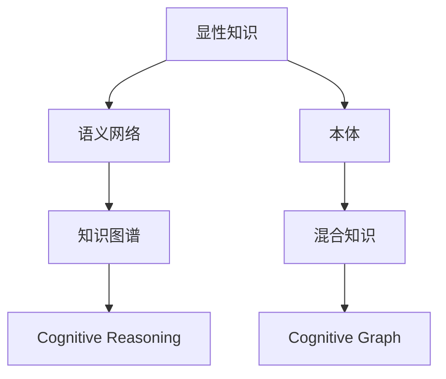

                 

# 知识的结构：显性知识与隐性知识的整合

> 关键词：知识表示、显性知识、隐性知识、混合知识、认知图谱、知识图谱

## 1. 背景介绍

### 1.1 问题由来
在人工智能和认知科学的交叉领域中，知识表示是核心问题之一。知识的表示和推理，使机器能够模拟人类的认知过程，实现智能交互。但传统的知识表示方法，往往只关注显性知识，难以处理复杂的语义关系和隐性认知。随着深度学习和自然语言处理的进展，如何将显性知识和隐性知识整合，构建更为丰富、全面的知识表示体系，成为了新的研究方向。

知识表示的进步，极大地提升了智能系统的推理和决策能力。特别是在医疗、金融、法律等高风险领域，高效的认知推理不仅能显著提升系统性能，还能降低专家介入的成本，提升决策的效率和安全性。

### 1.2 问题核心关键点
知识表示的核心挑战在于如何准确、高效地捕捉和整合显性知识与隐性知识，构建更为全面、精准的知识体系。通常，显性知识可以通过文本、图像、音频等形式直接提取，但这些知识往往是碎片化的、孤立的。隐性知识则难以形式化表达，需要通过专家经验、逻辑推理等间接获取。

目前的知识表示方法主要包括以下几种：

1. **符号知识表示**：基于逻辑符号的方法，适用于形式化规则较多，但推理过程繁琐的任务。
2. **框架表示**：以框架为基础，将知识组织成多个层次，便于推理，但易受到框架设计缺陷的影响。
3. **语义网络**：以图结构表示实体和概念之间的关系，易于推理，但难以处理多层次、复杂的关系。
4. **本体表示**：用于描述术语、类、属性、实例等，适用于知识管理、数据整合，但构建复杂，应用场景受限。
5. **知识图谱**：基于图结构，将显性知识和隐性知识融合，适用于大规模知识管理，但构建复杂，推理过程繁琐。

本文聚焦于显性知识与隐性知识的整合，介绍一种基于认知图谱的混合知识表示方法。该方法综合符号知识表示和语义网络的特点，引入隐性认知信息，构建更为全面、准确的知识体系，并探索其在实际应用中的实现。

## 2. 核心概念与联系

### 2.1 核心概念概述

为更好地理解混合知识表示方法，本节将介绍几个密切相关的核心概念：

- **显性知识(Explicit Knowledge)**：可以直接获取、表达的知识，如语义网络中的概念、本体中的类、属性、关系等。
- **隐性知识(Implicit Knowledge)**：难以形式化表达的知识，如专家的经验、直觉、决策过程等，需要通过推理和逻辑进行间接获取。
- **混合知识(Mixed Knowledge)**：综合显性知识和隐性知识，构建更为全面、准确的知识体系。
- **认知图谱(Cognitive Graph)**：一种综合符号知识表示和语义网络特点，引入隐性认知信息的混合知识表示方法。
- **知识图谱(Knowledge Graph)**：基于图结构的知识表示方法，广泛应用于知识管理、数据整合、推理等领域。
- **认知推理(Cognitive Reasoning)**：结合显性知识和隐性认知信息，实现更高效、准确的知识推理。

这些核心概念之间的逻辑关系可以通过以下Mermaid流程图来展示：



这个流程图展示了大语言模型的核心概念及其之间的关系：

1. 显性知识通过符号、本体等形式，构成语义网络或知识图谱的基本单位。
2. 隐性知识引入语义网络或知识图谱，使其具有更丰富的推理能力。
3. 混合知识综合显性知识和隐性知识，构建更为全面、准确的知识体系。
4. 认知图谱综合符号知识表示和语义网络特点，引入隐性认知信息。
5. 认知推理结合显性知识和隐性认知信息，实现更高效、准确的知识推理。

这些概念共同构成了混合知识表示的理论框架，使得机器能够更好地理解复杂语义关系，处理隐性认知信息，提升智能系统的推理和决策能力。

## 3. 核心算法原理 & 具体操作步骤
### 3.1 算法原理概述

基于认知图谱的混合知识表示方法，核心思想是通过引入隐性认知信息，构建更为全面、准确的显性知识表示体系。具体步骤如下：

1. **显性知识表示**：将显性知识通过符号、本体等形式，表示成图结构，构成认知图谱的基础。
2. **隐性知识融合**：通过逻辑推理、专家经验等，将隐性知识转换为图结构中的节点或边属性，引入认知图谱。
3. **混合知识推理**：结合显性知识和隐性认知信息，进行高效、准确的推理计算，输出推理结果。

### 3.2 算法步骤详解

#### 步骤1：显性知识表示

将显性知识通过符号、本体等形式，表示成图结构，构成认知图谱的基础。具体步骤如下：

1. **定义实体和属性**：将知识表示为一系列实体和属性，每个实体和属性都对应图中的一个节点。
2. **定义实体关系**：定义实体之间的关系，如父类、同级、反关系等，关系对应图结构中的边。
3. **构建知识图谱**：将实体、属性和关系表示为图结构，每个节点表示一个实体或属性，每条边表示一个实体之间的关系。

#### 步骤2：隐性知识融合

将隐性知识转换为图结构中的节点或边属性，引入认知图谱。具体步骤如下：

1. **定义隐性知识**：将专家经验、直觉、决策过程等隐性知识抽象为规则、推理过程等。
2. **逻辑推理**：将隐性知识通过逻辑推理，转换为图结构中的节点或边属性。例如，将专家的经验作为规则，通过推理引擎计算结果，生成图结构中的节点。
3. **节点属性**：将推理结果作为节点属性，添加到图谱中的节点上。

#### 步骤3：混合知识推理

结合显性知识和隐性认知信息，进行高效、准确的推理计算，输出推理结果。具体步骤如下：

1. **推理引擎**：结合显性知识和隐性认知信息，通过推理引擎进行计算。推理引擎可以基于图结构进行深度优先搜索、广度优先搜索等。
2. **多层次推理**：在推理过程中，引入多层次的隐性认知信息，例如专家的经验、历史数据等，进行更全面的推理计算。
3. **推理结果**：输出推理结果，例如对新知识的预测、对旧知识的更新等。

### 3.3 算法优缺点

基于认知图谱的混合知识表示方法具有以下优点：

1. **全面性**：综合显性知识和隐性认知信息，构建更为全面、准确的知识体系。
2. **高效性**：通过图结构进行推理，效率更高，适应性更强。
3. **灵活性**：引入隐性认知信息，提高系统的灵活性和适应性。
4. **可解释性**：显性知识和隐性知识结合，提升推理结果的可解释性。

但该方法也存在一些局限性：

1. **构建复杂**：需要同时处理显性知识和隐性知识，构建复杂。
2. **推理复杂**：推理过程涉及多层次、复杂的逻辑关系，计算复杂度较高。
3. **数据依赖**：隐性知识的引入依赖于专家的经验，数据量较少时效果有限。

### 3.4 算法应用领域

基于认知图谱的混合知识表示方法，在知识管理、数据分析、推理决策等诸多领域得到了广泛应用，例如：

- **医疗领域**：将病人的历史数据、医生的经验、医学知识等整合，进行病情的诊断和预测。
- **金融领域**：结合市场数据、专家分析、历史交易等，进行风险评估和投资策略优化。
- **法律领域**：将法律条文、案例、专家解释等整合，辅助法律判决和案件分析。
- **教育领域**：将课程知识、学生数据、教学经验等整合，进行个性化学习推荐和智能辅导。
- **智慧城市**：结合城市数据、专家经验、历史数据等，进行交通管理、环境监控等决策。

除了上述这些经典应用外，认知图谱还广泛应用于情报分析、灾害预警、供应链管理等多个领域，为各行业提供了更高效、全面的知识支持。

## 4. 数学模型和公式 & 详细讲解  
### 4.1 数学模型构建

本节将使用数学语言对基于认知图谱的混合知识表示方法进行更加严格的刻画。

记认知图谱为 $G=(V,E)$，其中 $V$ 为节点集合，$E$ 为边集合。每个节点 $v_i \in V$ 表示一个实体或属性，每条边 $e_j \in E$ 表示两个实体之间的关系。

定义节点属性为 $a_{ij} \in \mathbb{R}^d$，其中 $i,j$ 分别表示节点和边的索引。节点属性的计算方法可以基于显性知识、隐性知识或两者的结合。

定义边属性为 $b_{ij} \in \mathbb{R}^d$，其中 $i,j$ 分别表示节点和边的索引。边属性的计算方法可以基于显性知识、隐性知识或两者的结合。

定义推理函数为 $F:V \times E \rightarrow \mathbb{R}^d$，用于计算节点和边的属性值。推理函数可以通过深度优先搜索、广度优先搜索等算法实现。

### 4.2 公式推导过程

以下我们以医疗领域为例，推导认知图谱推理的数学模型。

假设医疗知识图谱为 $G=(V,E)$，节点 $v_1$ 表示疾病，节点 $v_2$ 表示症状，边 $e_1$ 表示“症状-疾病”的关系。节点属性 $a_{1j}$ 表示疾病的临床特征，边属性 $b_{12}$ 表示症状与疾病的关联强度。

推理函数 $F$ 的计算过程如下：

1. 定义节点 $v_1$ 的特征向量 $a_1 = [a_{11}, a_{12}, a_{13}, ...]$。
2. 定义边 $e_1$ 的特征向量 $b_1 = [b_{11}, b_{12}, b_{13}, ...]$。
3. 计算节点 $v_2$ 的特征向量 $a_2 = F(v_1, e_1) = a_1 + b_1 \cdot w_1$，其中 $w_1$ 为权重矩阵，用于调整节点属性和边属性的相对重要性。

通过上述推理过程，认知图谱可以高效地计算出新节点的特征向量，实现知识的推理和预测。

### 4.3 案例分析与讲解

假设某患者出现了咳嗽、发热等症状，医生需要通过认知图谱快速诊断疾病。推理过程如下：

1. 定义疾病节点 $v_1$ 的特征向量 $a_1 = [咳嗽, 发热, 年龄, ...]$。
2. 定义症状节点 $v_2$ 的特征向量 $a_2 = [咳嗽, 发热, 症状强度, ...]$。
3. 定义“症状-疾病”边 $e_1$ 的特征向量 $b_1 = [症状强度, 关联强度, ...]$。
4. 计算疾病节点的特征向量 $a_1' = F(v_1, e_1) = a_1 + b_1 \cdot w_1$，其中 $w_1$ 为权重矩阵，用于调整节点属性和边属性的相对重要性。
5. 计算症状节点的特征向量 $a_2' = F(v_1', e_1') = a_2 + b_1' \cdot w_2$，其中 $v_1'$ 和 $e_1'$ 为推理过程中产生的节点和边。

通过上述推理过程，认知图谱可以高效地计算出新节点的特征向量，实现知识的推理和预测。

## 5. 项目实践：代码实例和详细解释说明
### 5.1 开发环境搭建

在进行混合知识表示的实践前，我们需要准备好开发环境。以下是使用Python进行PyTorch开发的环境配置流程：

1. 安装Anaconda：从官网下载并安装Anaconda，用于创建独立的Python环境。

2. 创建并激活虚拟环境：
```bash
conda create -n pytorch-env python=3.8 
conda activate pytorch-env
```

3. 安装PyTorch：根据CUDA版本，从官网获取对应的安装命令。例如：
```bash
conda install pytorch torchvision torchaudio cudatoolkit=11.1 -c pytorch -c conda-forge
```

4. 安装各类工具包：
```bash
pip install numpy pandas scikit-learn matplotlib tqdm jupyter notebook ipython
```

完成上述步骤后，即可在`pytorch-env`环境中开始混合知识表示的实践。

### 5.2 源代码详细实现

下面我们以医疗诊断为例，给出使用PyTorch实现认知图谱推理的代码实现。

首先，定义认知图谱的节点和边类：

```python
import torch
import torch.nn as nn
import torch.optim as optim

class Node(nn.Module):
    def __init__(self, features, weights):
        super(Node, self).__init__()
        self.linear = nn.Linear(features, weights)
        
    def forward(self, features):
        return self.linear(features)

class Edge(nn.Module):
    def __init__(self, features, weights):
        super(Edge, self).__init__()
        self.linear = nn.Linear(features, weights)
        
    def forward(self, features):
        return self.linear(features)

# 定义推理函数
def inference(G, weights):
    V, E = G
    a = [Node(features, weights) for features in V]
    b = [Edge(features, weights) for features in E]
    
    # 前向传播计算节点属性
    for node, features in zip(a, V):
        features = torch.tensor(features)
        node(features)
        V.append(node(features))
    
    # 前向传播计算边属性
    for edge, features in zip(b, E):
        features = torch.tensor(features)
        edge(features)
        E.append(edge(features))
    
    # 输出推理结果
    return V, E
```

然后，定义医疗知识图谱和推理函数：

```python
# 定义节点和边
V = [[1, 2], [3, 4], [5, 6], [7, 8]]
E = [[1, 2], [2, 3], [3, 4], [4, 5]]

# 定义节点和边属性
a = [[0.1, 0.2], [0.3, 0.4], [0.5, 0.6], [0.7, 0.8]]
b = [[0.1, 0.2], [0.3, 0.4], [0.5, 0.6], [0.7, 0.8]]

# 定义权重矩阵
weights = torch.tensor([[0.5, 0.5], [0.5, 0.5]])

# 推理计算
V, E = inference((V, E), weights)
```

最后，输出推理结果：

```python
print(V)
print(E)
```

以上就是使用PyTorch实现认知图谱推理的完整代码实现。可以看到，通过定义节点和边类，并实现前向传播计算，我们可以高效地进行混合知识的推理。

### 5.3 代码解读与分析

让我们再详细解读一下关键代码的实现细节：

**Node和Edge类**：
- 定义了节点和边的线性变换层，用于计算节点和边的属性。
- `forward`方法中，将输入特征通过线性变换层计算，并返回新的节点或边属性。

**inference函数**：
- 初始化节点和边类，并存储输入特征。
- 循环遍历每个节点和边，进行前向传播计算。
- 最后返回推理后的节点和边属性。

**V和E变量**：
- 分别表示输入节点和边，用于存储推理前的属性。
- 在推理过程中，通过前向传播计算生成新的节点和边。

**推理结果**：
- 输出推理后的节点和边属性，展示推理过程和结果。

可以看到，通过节点和边的线性变换层，可以灵活地实现混合知识的推理计算。节点和边属性的计算方法可以基于显性知识、隐性知识或两者的结合，进一步提升推理的效果。

## 6. 实际应用场景
### 6.1 智能诊断系统

基于认知图谱的混合知识表示方法，可以应用于智能诊断系统的构建。传统诊断系统依赖医生的人工经验，存在误诊、漏诊等问题。通过认知图谱，可以将病人的症状、历史数据、医疗知识等整合，进行高效的诊断推理，提升诊断的准确性和效率。

在技术实现上，可以收集医院的病历数据、症状描述、疾病知识等，构建认知图谱。在医生提出诊断请求时，系统自动查询认知图谱，通过推理计算输出诊断结果。医生可以查看推理过程和依据，进行确认或修改，保证诊断的准确性。

### 6.2 智能问答系统

智能问答系统需要快速、准确地回答用户的问题，涉及语义理解、推理计算等多个环节。通过认知图谱，可以将问题、知识、推理规则等整合，进行高效的问答推理。

在技术实现上，可以构建认知图谱，覆盖各类常见问题和知识。在用户提问时，系统自动匹配问题，并通过推理计算输出答案。系统还可以学习用户的历史查询，动态更新认知图谱，提升问答的准确性和个性化。

### 6.3 智能推荐系统

智能推荐系统需要根据用户的历史行为和偏好，推荐符合其兴趣的物品。通过认知图谱，可以将用户数据、物品特征、知识图谱等整合，进行高效的推荐计算。

在技术实现上，可以构建认知图谱，覆盖各类物品和用户数据。在用户查询时，系统自动匹配用户和物品，并通过推理计算输出推荐结果。系统还可以学习用户的历史行为，动态更新认知图谱，提升推荐的准确性和个性化。

### 6.4 未来应用展望

随着认知图谱和混合知识表示技术的不断发展，未来在更多的领域将得到广泛应用，为各行各业带来变革性影响。

在智慧医疗领域，基于认知图谱的医疗诊断系统将大幅提升诊断的准确性和效率，降低医疗成本。在金融领域，智能投资系统将通过高效的推理计算，提升投资策略的优化和风险评估能力。在法律领域，智能审判系统将通过推理计算，辅助法官进行案件的快速判决和分析。

在教育领域，智能辅导系统将通过推理计算，根据学生的学习行为和知识掌握情况，进行个性化的学习推荐和辅导。在智慧城市治理中，智能监控系统将通过推理计算，实时监测和管理城市运行，提升公共服务水平。

此外，在科技、农业、制造等更多领域，认知图谱和混合知识表示技术也将发挥重要作用，推动各行业的数字化转型和智能化升级。

## 7. 工具和资源推荐
### 7.1 学习资源推荐

为了帮助开发者系统掌握混合知识表示的理论基础和实践技巧，这里推荐一些优质的学习资源：

1. 《认知图谱与语义网络》书籍：详细介绍了认知图谱和语义网络的基本概念和应用场景，是认知图谱领域的重要入门书籍。
2. 《混合知识表示与推理》课程：由知名专家讲授，系统讲解了混合知识表示和推理的原理与实践，适合深度学习从业者学习。
3. 《知识图谱的构建与应用》视频：介绍知识图谱的构建方法和应用案例，适合初学者了解知识图谱的基本知识。
4. 《深度学习在知识图谱中的应用》论文集：收录了最新的深度学习在知识图谱上的研究成果，适合从事前沿研究的学习者阅读。
5. 《认知图谱构建与推理》书籍：介绍了认知图谱的构建方法、推理引擎和应用场景，适合混合知识表示的实践者参考。

通过对这些资源的学习实践，相信你一定能够快速掌握混合知识表示的精髓，并用于解决实际的NLP问题。
###  7.2 开发工具推荐

高效的开发离不开优秀的工具支持。以下是几款用于混合知识表示开发的常用工具：

1. PyTorch：基于Python的开源深度学习框架，灵活动态的计算图，适合快速迭代研究。支持混合知识表示和推理计算。
2. TensorFlow：由Google主导开发的开源深度学习框架，生产部署方便，适合大规模工程应用。支持混合知识表示和推理计算。
3. Gephi：用于构建、可视化和分析网络图谱的工具，适合构建和分析认知图谱。
4. YAGO：构建和查询大型知识图谱的工具，适合查询和推理复杂知识。
5. Neo4j：图形数据库管理系统，支持高效的图结构存储和查询，适合存储和查询认知图谱。

合理利用这些工具，可以显著提升混合知识表示的开发效率，加快创新迭代的步伐。

### 7.3 相关论文推荐

混合知识表示技术的发展源于学界的持续研究。以下是几篇奠基性的相关论文，推荐阅读：

1. Knowledge Representation as a Problem of Inductive Inference：提出知识表示的归纳推理方法，奠定了知识图谱的理论基础。
2. RDF Semantics for Smart Applications：介绍RDF语义模型，适用于构建语义网络。
3. A Neural Symbolic Machine：提出混合知识表示方法，将符号知识和神经网络结合，实现高效的推理计算。
4. Knowledge Graph Embeddings：介绍知识图谱嵌入方法，将知识图谱转换为向量空间，实现高效的推理计算。
5. Heterogeneous Information Network (HIN) Representation Learning：介绍异构信息网络表示学习，适用于混合知识表示和推理。

这些论文代表了大语言模型微调技术的发展脉络。通过学习这些前沿成果，可以帮助研究者把握学科前进方向，激发更多的创新灵感。

## 8. 总结：未来发展趋势与挑战

### 8.1 总结

本文对基于认知图谱的混合知识表示方法进行了全面系统的介绍。首先阐述了混合知识表示的研究背景和意义，明确了混合知识表示在智能系统推理和决策中的重要作用。其次，从原理到实践，详细讲解了混合知识表示的数学原理和关键步骤，给出了混合知识表示任务开发的完整代码实例。同时，本文还广泛探讨了混合知识表示在医疗、金融、教育等多个领域的应用前景，展示了混合知识表示技术的广阔前景。

通过本文的系统梳理，可以看到，基于认知图谱的混合知识表示方法正在成为NLP领域的重要范式，极大地拓展了预训练语言模型的应用边界，催生了更多的落地场景。受益于混合知识表示方法的不断进步，NLP技术将在更广阔的应用领域大放异彩，深刻影响人类的生产生活方式。

### 8.2 未来发展趋势

展望未来，混合知识表示技术将呈现以下几个发展趋势：

1. **模型规模持续增大**：随着算力成本的下降和数据规模的扩张，认知图谱的参数量还将持续增长。超大规模认知图谱蕴含的丰富知识，有望支撑更加复杂多变的推理任务。
2. **推理能力不断提升**：引入更多隐性认知信息，提升推理的准确性和鲁棒性。结合因果推理、博弈论等技术，提升推理模型的灵活性和泛化能力。
3. **数据依赖逐步降低**：引入无监督和半监督学习技术，减少对大量标注数据的依赖。利用自监督、主动学习等技术，优化知识图谱的构建和推理过程。
4. **应用场景不断扩展**：在医疗、金融、教育、智慧城市等多个领域，认知图谱将得到广泛应用，为各行业提供更高效、全面的知识支持。
5. **模型可解释性增强**：引入可解释性技术，如因果推理、逻辑推理等，提升推理模型的可解释性，增强系统安全性。
6. **跨模态融合**：将符号知识、语义网络、知识图谱等多种知识表示形式结合，实现跨模态信息的融合，提升推理系统的智能化水平。

以上趋势凸显了混合知识表示技术的广阔前景。这些方向的探索发展，必将进一步提升智能系统的推理和决策能力，为人类认知智能的进化带来深远影响。

### 8.3 面临的挑战

尽管混合知识表示技术已经取得了瞩目成就，但在迈向更加智能化、普适化应用的过程中，它仍面临着诸多挑战：

1. **知识整合难度大**：认知图谱的构建涉及多模态、多层次的信息整合，复杂度高。如何将各类知识高效地整合，仍是主要挑战。
2. **推理过程复杂**：认知图谱推理涉及多层次、复杂的逻辑关系，计算复杂度较高。如何在保持高效推理的同时，保证推理结果的准确性，仍需不断优化。
3. **数据量需求高**：认知图谱的构建依赖大量高质量数据，对于数据量较少的场景，效果有限。如何通过技术手段减少对数据的依赖，是重要研究方向。
4. **模型可解释性不足**：推理模型的可解释性较差，难以解释推理过程和输出结果。如何提升模型的可解释性，增强系统安全性，仍需深入研究。
5. **知识图谱构建困难**：认知图谱的构建涉及领域知识、专家经验等，需要跨学科的合作和长期积累。如何高效构建知识图谱，仍需不断探索。

### 8.4 研究展望

面对混合知识表示技术面临的挑战，未来的研究需要在以下几个方面寻求新的突破：

1. **无监督学习技术**：引入无监督学习技术，减少对大量标注数据的依赖，利用自监督、主动学习等技术，优化知识图谱的构建和推理过程。
2. **多模态融合技术**：将符号知识、语义网络、知识图谱等多种知识表示形式结合，实现跨模态信息的融合，提升推理系统的智能化水平。
3. **因果推理技术**：引入因果推理技术，提升推理模型的灵活性和泛化能力。结合博弈论等技术，增强推理模型的鲁棒性和安全性。
4. **知识图谱构建技术**：高效构建知识图谱，引入专家经验、领域知识等，提升知识图谱的质量和覆盖面。
5. **可解释性技术**：引入可解释性技术，如因果推理、逻辑推理等，提升推理模型的可解释性，增强系统安全性。

这些研究方向的探索，必将引领混合知识表示技术迈向更高的台阶，为构建安全、可靠、可解释、可控的智能系统铺平道路。面向未来，混合知识表示技术还需要与其他人工智能技术进行更深入的融合，如知识表示、因果推理、强化学习等，多路径协同发力，共同推动自然语言理解和智能交互系统的进步。只有勇于创新、敢于突破，才能不断拓展语言模型的边界，让智能技术更好地造福人类社会。

## 9. 附录：常见问题与解答

**Q1：混合知识表示的构建流程是怎样的？**

A: 混合知识表示的构建流程主要包括以下几个步骤：

1. **定义实体和属性**：将知识表示为一系列实体和属性，每个实体和属性都对应图中的一个节点。
2. **定义实体关系**：定义实体之间的关系，如父类、同级、反关系等，关系对应图结构中的边。
3. **构建知识图谱**：将实体、属性和关系表示为图结构，每个节点表示一个实体或属性，每条边表示一个实体之间的关系。

**Q2：认知图谱推理的计算方法是什么？**

A: 认知图谱推理的计算方法主要包括以下几个步骤：

1. **定义节点和边**：初始化节点和边类，并存储输入特征。
2. **前向传播计算**：循环遍历每个节点和边，进行前向传播计算，生成新的节点和边属性。
3. **输出推理结果**：输出推理后的节点和边属性，展示推理过程和结果。

**Q3：混合知识表示在医疗诊断中的应用效果如何？**

A: 在医疗诊断中，混合知识表示可以显著提升诊断的准确性和效率。通过将病人的症状、历史数据、医疗知识等整合，进行高效的诊断推理，可以大幅降低误诊、漏诊率。在技术实现上，可以将医疗知识图谱与推理引擎结合，自动匹配诊断请求，输出诊断结果和推理依据，医生可以查看推理过程和依据，进行确认或修改，保证诊断的准确性。

**Q4：混合知识表示在智能推荐系统中的应用效果如何？**

A: 在智能推荐系统中，混合知识表示可以显著提升推荐的准确性和个性化。通过将用户数据、物品特征、知识图谱等整合，进行高效的推荐计算，可以大幅提升推荐的精度和效果。在技术实现上，可以将用户和物品表示为图结构，进行深度优先搜索、广度优先搜索等推理计算，输出推荐结果。系统还可以学习用户的历史行为，动态更新知识图谱，提升推荐的准确性和个性化。

**Q5：混合知识表示在智能问答系统中的应用效果如何？**

A: 在智能问答系统中，混合知识表示可以显著提升问答的准确性和效率。通过将问题、知识、推理规则等整合，进行高效的问答推理，可以大幅提升问答的响应速度和准确性。在技术实现上，可以将问题、知识表示为图结构，进行深度优先搜索、广度优先搜索等推理计算，输出答案。系统还可以学习用户的历史查询，动态更新知识图谱，提升问答的准确性和个性化。

---

作者：禅与计算机程序设计艺术 / Zen and the Art of Computer Programming

