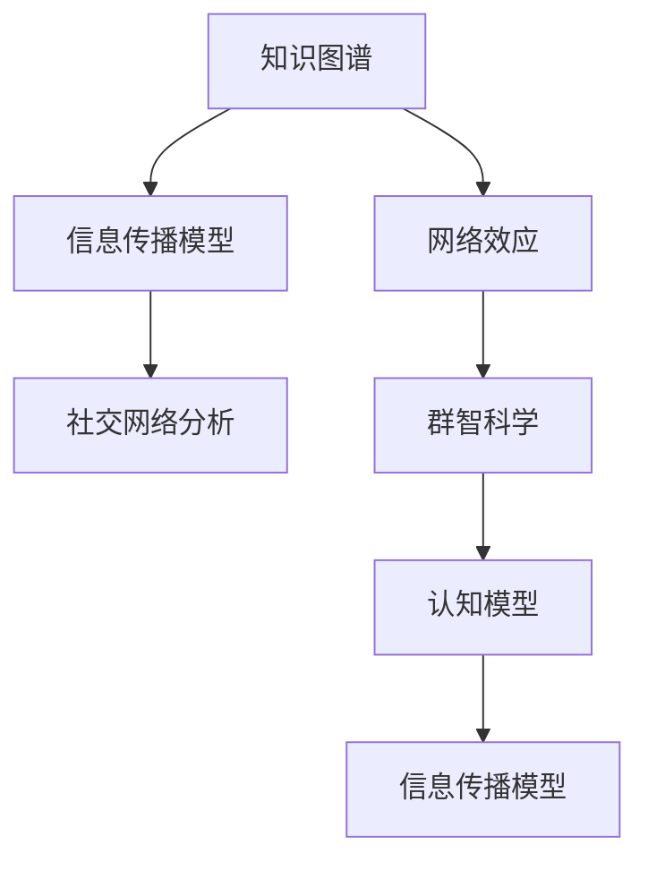

                 

# 知识的网络效应：信息传播与群体行为

> 关键词：知识图谱、信息传播模型、网络效应、社交网络分析、群智科学、认知模型

## 1. 背景介绍

### 1.1 问题由来
在互联网和信息技术飞速发展的今天，人类获取、处理和应用信息的方式发生了根本性的变化。信息传播不再局限于传统的媒体渠道，而是通过社交网络、搜索引擎、推荐系统等新兴方式广泛展开。伴随信息的爆炸式增长，知识管理变得愈发复杂，如何高效、准确地组织和传播知识，成为科研、教育、企业等各个领域亟待解决的问题。

在众多知识管理工具中，知识图谱（Knowledge Graph）以其直观、全面的信息组织方式，逐渐成为研究热点。知识图谱通过将现实世界中的实体及其关系映射为结构化的图模型，实现了对复杂信息的有序存储和快速检索。但知识图谱的构建和应用也面临着诸多挑战，如信息孤岛、数据噪声、知识冲突等。

### 1.2 问题核心关键点
本文聚焦于知识图谱在信息传播与群体行为中的应用。通过构建基于知识图谱的信息传播模型，我们旨在探讨信息如何在网络中传播，并分析群体的知识获取、共享与协作行为，以期找到增强知识传播网络效应的方法，促进知识在群体中的高效共享和创新应用。

## 2. 核心概念与联系

### 2.1 核心概念概述

为更好地理解基于知识图谱的信息传播与群体行为研究，本节将介绍几个核心概念：

- **知识图谱(Knowledge Graph)**：通过实体-关系-属性三元组表示的语义网络，用于描述实体之间的复杂关系和属性信息，支持自然语言查询和实体链接。
- **信息传播模型(Information Diffusion Model)**：基于图结构理论的模型，模拟信息如何在网络中传播和扩散的过程，通常用于描述病毒传播、消息扩散、舆论形成等现象。
- **网络效应(Network Effect)**：网络中节点（实体）数量的增加会导致网络价值（知识传播效果）的显著提升，即“网络效应”。
- **社交网络分析(Social Network Analysis)**：分析社交网络的结构和行为，通常用于研究群体互动、传播动态、群体行为等。
- **群智科学(Crowdsourcing Science)**：利用大众智慧进行科学研究和知识生产的创新方法，强调集体协作与信息共享。
- **认知模型(Cognitive Model)**：模拟人类认知过程的模型，用于分析和预测人类对信息的获取、处理和应用行为。

这些核心概念之间的逻辑关系可以通过以下Mermaid流程图来展示：



这个流程图展示了一系列核心概念及其之间的关系：

1. 知识图谱为信息传播提供了结构化的知识基础。
2. 信息传播模型用于描述信息如何在网络中传播和扩散。
3. 网络效应揭示了网络中节点数量与网络价值之间的关系。
4. 社交网络分析提供了研究信息传播行为的工具。
5. 群智科学强调了群体协作在知识生产中的重要性。
6. 认知模型模拟了人类对信息的认知过程。

这些概念共同构成了知识传播网络效应的研究框架，帮助理解信息如何在群体中传播和扩散，并探索如何增强这种网络效应。

## 3. 核心算法原理 & 具体操作步骤
### 3.1 算法原理概述

基于知识图谱的信息传播模型，通常基于社会网络理论、传播动力学等原理，构建节点-关系图结构，并引入相关算法模型，描述信息如何在网络中传播。其核心思想是：信息传播是一个动态过程，涉及到传播者、接受者、传播媒介和传播环境等要素，这些要素相互作用，共同决定了信息传播的路径、速度和效果。

形式化地，假设知识图谱中的实体为 $N$，实体的关系为 $R$，实体的属性为 $A$。定义信息传播过程 $I$，从信息源实体 $s$ 传播到接受实体 $r$ 的过程可以表示为：

$$
I = \sum_{r \in N} A_r \cdot W_{s,r} \cdot \text{Propagate}(I)
$$

其中 $A_r$ 表示实体 $r$ 的属性权重，$W_{s,r}$ 表示实体 $s$ 与 $r$ 的关系权重，$\text{Propagate}(I)$ 表示信息在 $s$ 和 $r$ 之间的传播函数。

传播函数通常包含节点激活函数 $f(x)$ 和传播函数 $g(x)$，分别表示信息在节点 $x$ 的激活状态和传播状态。信息的传播过程可以通过递归公式表示为：

$$
f(I) = \sum_{s \in N} A_s \cdot W_{s,r} \cdot \text{Propagate}(I)
$$

$$
g(I) = f(I) \cdot g(I) + \text{Noise}
$$

其中 $\text{Noise}$ 表示传播过程中引入的噪声。

### 3.2 算法步骤详解

基于知识图谱的信息传播模型的构建和应用，一般包括以下几个关键步骤：

**Step 1: 构建知识图谱**

- 收集并整合各类结构化数据，如文献、网页、知识库等，生成实体-关系图。
- 标注实体属性和关系属性，形成完整的知识图谱模型。

**Step 2: 设计传播模型**

- 根据信息传播的具体场景，选择合适的传播模型，如SIR模型、SEIR模型、SIRI模型等。
- 确定信息传播的关键参数，如传播速率、恢复速率、节点激活概率等。
- 将知识图谱映射到模型中，确定节点和边。

**Step 3: 模拟信息传播**

- 设定信息源实体，从其出发开始信息传播。
- 利用递归公式或蒙特卡洛模拟，模拟信息在知识图中的传播过程。
- 记录信息传播到每个实体的状态和路径。

**Step 4: 评估传播效果**

- 根据预定义的评价指标，如覆盖率、感染率、传播速度等，评估信息传播效果。
- 分析传播过程中节点间的交互和冲突情况，识别信息传播的瓶颈。
- 优化传播模型和参数，提升信息传播效果。

### 3.3 算法优缺点

基于知识图谱的信息传播模型具有以下优点：

- **全面性**：知识图谱提供了全面的实体和关系信息，能够准确地描述信息的传播路径和传播机制。
- **可扩展性**：知识图谱能够动态更新，适应信息传播的不断变化。
- **准确性**：通过整合大量结构化数据，能够减少噪声干扰，提高信息传播的准确性。

同时，该方法也存在一定的局限性：

- **复杂性**：知识图谱的构建和更新较为复杂，需要大量的时间和资源。
- **噪声问题**：数据中存在的不完整、不准确信息，可能对信息传播产生负面影响。
- **计算复杂度**：递归计算和蒙特卡洛模拟可能会面临计算复杂度高的挑战，尤其是在大规模网络中。

尽管存在这些局限性，但基于知识图谱的信息传播模型在理论上是可行的，为知识传播网络效应的研究提供了强有力的工具。

### 3.4 算法应用领域

基于知识图谱的信息传播模型在多个领域中具有广泛的应用前景，如：

- **科学研究**：通过构建学术知识图谱，模拟科学信息的传播，分析科学发现的扩散路径和影响因素。
- **企业创新**：利用知识图谱分析市场信息和产品创新，指导企业研发和市场布局。
- **政府决策**：构建政策、法规和舆情知识图谱，监测政策效果和舆论动态，辅助决策制定。
- **社交媒体分析**：分析社交媒体上的信息传播，预测热门话题和舆论趋势，优化社交平台内容推荐。

## 4. 数学模型和公式 & 详细讲解  
### 4.1 数学模型构建

本节将使用数学语言对基于知识图谱的信息传播过程进行更加严格的刻画。

假设知识图谱中的实体集合为 $N$，关系集合为 $R$，属性集合为 $A$。信息传播过程 $I$ 从信息源实体 $s$ 传播到接受实体 $r$ 的传播函数可以表示为：

$$
I = \sum_{r \in N} A_r \cdot W_{s,r} \cdot \text{Propagate}(I)
$$

其中 $A_r$ 表示实体 $r$ 的属性权重，$W_{s,r}$ 表示实体 $s$ 与 $r$ 的关系权重，$\text{Propagate}(I)$ 表示信息在 $s$ 和 $r$ 之间的传播函数。

传播函数通常包含节点激活函数 $f(x)$ 和传播函数 $g(x)$，分别表示信息在节点 $x$ 的激活状态和传播状态。信息的传播过程可以通过递归公式表示为：

$$
f(I) = \sum_{s \in N} A_s \cdot W_{s,r} \cdot \text{Propagate}(I)
$$

$$
g(I) = f(I) \cdot g(I) + \text{Noise}
$$

其中 $\text{Noise}$ 表示传播过程中引入的噪声。

### 4.2 公式推导过程

以下我们以SIR传播模型为例，推导信息传播过程中的关键参数。

SIR传播模型描述了疾病在人群中的传播过程，其中 $S$ 表示易感者，$I$ 表示感染者，$R$ 表示康复者。假设疾病传播速率 $\alpha$，康复速率 $\beta$，节点激活概率 $p$，传播函数为：

$$
f(I) = (1 - p)I + p\sum_{s \in N} W_{s,r} \cdot I_s
$$

$$
g(I) = I - \alpha I + \beta f(I)
$$

其中 $I_s$ 表示节点 $s$ 的信息状态。

将 $f(I)$ 和 $g(I)$ 代入传播函数，得：

$$
I = \sum_{r \in N} A_r \cdot W_{s,r} \cdot [(1 - p)I + p\sum_{s \in N} W_{s,r} \cdot I_s] \cdot [I - \alpha I + \beta [(1 - p)I + p\sum_{s \in N} W_{s,r} \cdot I_s]]
$$

这是一个复杂的递归方程，难以直接求解。可以使用蒙特卡洛模拟等方法，对信息传播过程进行数值模拟。

## 5. 项目实践：代码实例和详细解释说明
### 5.1 开发环境搭建

在进行信息传播模拟实践前，我们需要准备好开发环境。以下是使用Python进行PyTorch开发的环境配置流程：

1. 安装Anaconda：从官网下载并安装Anaconda，用于创建独立的Python环境。

2. 创建并激活虚拟环境：
```bash
conda create -n knowledge-graph python=3.8 
conda activate knowledge-graph
```

3. 安装PyTorch：根据CUDA版本，从官网获取对应的安装命令。例如：
```bash
conda install pytorch torchvision torchaudio cudatoolkit=11.1 -c pytorch -c conda-forge
```

4. 安装各类工具包：
```bash
pip install numpy pandas scikit-learn matplotlib tqdm jupyter notebook ipython
```

完成上述步骤后，即可在`knowledge-graph`环境中开始信息传播模拟实践。

### 5.2 源代码详细实现

下面我们以基于知识图谱的SIR传播模型为例，给出使用PyTorch进行信息传播模拟的PyTorch代码实现。

首先，定义SIR传播模型的基本参数和函数：

```python
import torch
import torch.nn as nn

class SIRModel(nn.Module):
    def __init__(self, alpha, beta, p):
        super(SIRModel, self).__init__()
        self.alpha = alpha
        self.beta = beta
        self.p = p
        
    def forward(self, I):
        S = 1 - I
        I = I - self.alpha * I + self.beta * S
        I = (1 - self.p) * I + self.p * (I * self.alpha)
        return I
```

然后，定义模拟信息传播的函数：

```python
def simulate_spread(G, I0, n_iterations=100):
    SIR = SIRModel(alpha, beta, p)
    I = I0
    
    for _ in range(n_iterations):
        I = SIR(I)
        G.edges(data=True)
        
    return I
```

最后，调用模拟函数并输出结果：

```python
G = nx.Graph()
G.add_edges_from([(1, 2), (2, 3), (3, 4), (4, 5)])
I0 = 0.1

I = simulate_spread(G, I0)
print("Final state of I:", I)
```

以上就是使用PyTorch进行基于知识图谱的信息传播模拟的完整代码实现。可以看到，利用PyTorch和网络x（NetworkX）库，我们可以快速构建和模拟信息传播模型。

### 5.3 代码解读与分析

让我们再详细解读一下关键代码的实现细节：

**SIRModel类**：
- `__init__`方法：初始化传播模型的关键参数。
- `forward`方法：计算信息在每个时间步的传播状态。

**simulate_spread函数**：
- 根据知识图谱构建传播模型。
- 从信息源节点开始传播信息，不断迭代计算传播状态。
- 输出最终的信息传播结果。

**知识图谱构建**：
- 使用networkx库构建简单的知识图谱。
- 通过add_edges_from方法，将实体间的关系表示为边。

这个代码实现了简单的SIR传播模型，用于模拟信息在知识图中的传播。知识图谱和传播模型的结合，为分析信息传播行为提供了强有力的工具。

当然，工业级的系统实现还需考虑更多因素，如模型的保存和部署、超参数的自动搜索、更灵活的传播模型等。但核心的传播范式基本与此类似。

## 6. 实际应用场景
### 6.1 科学研究

基于知识图谱的信息传播模型，在科学研究中具有广泛的应用前景。研究人员可以构建学术知识图谱，模拟科学信息的传播，分析科学发现的扩散路径和影响因素。例如，通过研究引用网络，分析科学论文的传播速度和覆盖范围，可以发现具有广泛影响力的研究成果，为科学研究提供重要参考。

### 6.2 企业创新

在企业创新过程中，信息传播模型可以用于分析技术创新和市场动态。企业可以利用知识图谱分析市场信息和产品创新，指导研发和市场布局。例如，通过模拟技术趋势的传播，预测未来热点技术和市场机会，帮助企业制定战略决策。

### 6.3 政府决策

政府部门可以利用信息传播模型，构建政策、法规和舆情知识图谱，监测政策效果和舆论动态，辅助决策制定。例如，通过分析政策扩散路径和舆情变化趋势，识别政策实施中的瓶颈和风险，优化政策设计和执行。

### 6.4 社交媒体分析

社交媒体平台可以利用信息传播模型，分析平台上的信息传播行为，预测热门话题和舆论趋势，优化内容推荐。例如，通过分析用户互动和信息传播路径，发现用户兴趣和行为模式，提升推荐系统的准确性和个性化。

## 7. 工具和资源推荐
### 7.1 学习资源推荐

为了帮助开发者系统掌握基于知识图谱的信息传播理论基础和实践技巧，这里推荐一些优质的学习资源：

1. 《知识图谱原理与技术》系列博文：由知识图谱领域的专家撰写，深入浅出地介绍了知识图谱的构建、应用和评估方法。

2. CS224N《自然语言处理》课程：斯坦福大学开设的自然语言处理课程，涵盖知识图谱、信息检索等基本概念和经典模型。

3. 《知识图谱：方法、算法与系统》书籍：知识图谱领域的经典著作，全面介绍了知识图谱的构建、应用和系统实现方法。

4. Google Scholar：学术搜索引擎，可以免费获取大量的知识图谱研究论文和相关资源。

5. Semantic Scholar：语义搜索平台，能够快速检索和浏览知识图谱和相关研究。

通过对这些资源的学习实践，相信你一定能够快速掌握基于知识图谱的信息传播模型，并用于解决实际的科学信息传播问题。

### 7.2 开发工具推荐

高效的开发离不开优秀的工具支持。以下是几款用于知识图谱信息传播开发的常用工具：

1. PyTorch：基于Python的开源深度学习框架，灵活的计算图，适合快速迭代研究。知识图谱的节点和关系表示，都可以通过PyTorch的张量来处理。

2. TensorFlow：由Google主导开发的开源深度学习框架，生产部署方便，适合大规模工程应用。支持TensorBoard等可视化工具，方便调试和监控模型。

3. NetworkX：Python的社交网络分析库，提供丰富的图结构处理功能，可用于构建和分析知识图谱。

4. Jupyter Notebook：交互式开发环境，支持Python和R等多种语言，方便数据探索和模型验证。

5. Git和GitHub：版本控制和代码托管平台，方便团队协作和知识共享。

合理利用这些工具，可以显著提升知识图谱信息传播模型的开发效率，加快创新迭代的步伐。

### 7.3 相关论文推荐

知识图谱和信息传播模型的发展源于学界的持续研究。以下是几篇奠基性的相关论文，推荐阅读：

1. Knowledge Graphs: Concepts, Approaches, Challenges and Trends：综述性论文，介绍了知识图谱的基本概念、技术和应用。

2. SIR Model：经典的流行病学传播模型，描述了疾病在人群中的传播过程。

3. Web Knowledge Graph：Web领域知识图谱的构建方法和应用案例，展示了知识图谱在互联网信息传播中的作用。

4. Social Media Analytics with Semantic Web Technologies：利用语义网技术分析社交媒体信息的论文，展示了知识图谱在社交网络分析中的应用。

5. Crowdsourcing Semantic Web Construction：利用众包技术构建知识图谱的论文，展示了知识图谱在群智科学中的应用。

这些论文代表了大规模信息传播模型的发展脉络。通过学习这些前沿成果，可以帮助研究者把握学科前进方向，激发更多的创新灵感。

## 8. 总结：未来发展趋势与挑战

### 8.1 总结

本文对基于知识图谱的信息传播模型进行了全面系统的介绍。首先阐述了信息传播和知识图谱的研究背景和意义，明确了信息传播模型在增强知识网络效应方面的独特价值。其次，从原理到实践，详细讲解了信息传播模型的数学原理和关键步骤，给出了信息传播任务开发的完整代码实例。同时，本文还广泛探讨了信息传播模型在科学研究、企业创新、政府决策、社交媒体分析等多个领域的应用前景，展示了信息传播模型的巨大潜力。此外，本文精选了信息传播模型的各类学习资源，力求为读者提供全方位的技术指引。

通过本文的系统梳理，可以看到，基于知识图谱的信息传播模型正在成为信息传播网络效应的重要范式，极大地拓展了知识图谱的应用边界，催生了更多的落地场景。受益于知识图谱的构建和传播模型的计算，信息传播模型能够高效、准确地描述信息在网络中的传播行为，从而提升知识共享和创新的效率。未来，伴随知识图谱和传播模型的不断演进，相信信息传播模型必将在构建知识传播网络效应中扮演越来越重要的角色。

### 8.2 未来发展趋势

展望未来，信息传播模型将呈现以下几个发展趋势：

1. **知识图谱的动态更新**：随着数据和模型的不断迭代，知识图谱将更加动态和实时，更好地反映信息传播的真实情况。

2. **传播模型的多样化**：除了经典的SIR模型，未来将涌现更多复杂的信息传播模型，如SEIR模型、SIRI模型、ISIR模型等，以适应不同场景的需求。

3. **分布式计算的引入**：随着数据量和计算任务的增加，分布式计算和并行计算将变得必不可少，提升信息传播模型的计算效率。

4. **多模态信息的整合**：知识图谱不仅包含文本信息，还应整合图像、视频、音频等多模态数据，提升信息传播模型的感知能力和应用范围。

5. **元知识的应用**：引入元知识（如元信息、元关系）到知识图谱中，增强信息传播模型的知识推理和应用能力。

6. **模型的可解释性**：为满足应用需求，信息传播模型的决策过程应具备可解释性，便于用户理解和调试。

以上趋势凸显了信息传播模型的广阔前景。这些方向的探索发展，必将进一步提升信息传播模型的性能和应用范围，为构建高效、智能的知识传播网络效应提供新的工具和方法。

### 8.3 面临的挑战

尽管信息传播模型已经取得了瞩目成就，但在迈向更加智能化、普适化应用的过程中，它仍面临着诸多挑战：

1. **数据质量和规模**：信息传播模型的精度和效果高度依赖于高质量、大规模的数据。如何获取和处理这些数据，将是未来的重要课题。

2. **模型复杂度**：随着模型的复杂度增加，模型的训练和推理效率可能下降，甚至出现计算资源不足的问题。如何优化模型结构和计算流程，提升效率，是关键难题。

3. **模型的鲁棒性**：在实际应用中，信息传播模型可能会面临噪声、异常数据等问题，模型的鲁棒性和稳健性需进一步提高。

4. **模型的可解释性**：信息传播模型的决策过程较为复杂，如何赋予模型更强的可解释性，使其决策逻辑透明、可理解，是提升模型信任度的重要方向。

5. **用户隐私和数据安全**：信息传播模型涉及大量用户数据，如何保护用户隐私和数据安全，避免数据泄露和滥用，是应用推广中的重要问题。

6. **跨领域应用的技术门槛**：信息传播模型在应用过程中，需要针对不同领域的特定需求进行定制，技术门槛较高，推广难度较大。

正视信息传播模型面临的这些挑战，积极应对并寻求突破，将是大规模信息传播模型走向成熟的必由之路。相信随着学界和产业界的共同努力，这些挑战终将一一被克服，信息传播模型必将在构建高效、智能的知识传播网络效应中扮演越来越重要的角色。

### 8.4 未来突破

面对信息传播模型所面临的种种挑战，未来的研究需要在以下几个方面寻求新的突破：

1. **多模态信息融合**：通过融合文本、图像、视频等多模态信息，提升信息传播模型的感知能力和应用范围。

2. **分布式计算优化**：引入分布式计算和并行计算，提升信息传播模型的计算效率和资源利用率。

3. **元知识的应用**：引入元知识（如元信息、元关系）到知识图谱中，增强信息传播模型的知识推理和应用能力。

4. **模型的可解释性**：为满足应用需求，信息传播模型的决策过程应具备可解释性，便于用户理解和调试。

5. **用户隐私保护**：引入隐私保护技术，如差分隐私、联邦学习等，保护用户隐私和数据安全。

6. **跨领域应用的通用性**：开发通用性强、适应性广的信息传播模型，降低跨领域应用的技术门槛。

这些研究方向的探索，必将引领信息传播模型迈向更高的台阶，为构建高效、智能的知识传播网络效应提供新的工具和方法。面向未来，信息传播模型需要在技术、应用、伦理等多个方面进行全面的优化和改进，才能真正实现信息传播的全面智能化和普适化。

## 9. 附录：常见问题与解答

**Q1：知识图谱的构建需要哪些步骤？**

A: 知识图谱的构建通常包括以下几个关键步骤：

1. 数据收集：从各种数据源（如文献、网页、知识库等）收集结构化数据，形成初步的数据集。

2. 实体识别和标注：对数据集中的实体进行识别和标注，确定实体的类型和属性。

3. 关系抽取和建模：从数据集中抽取实体之间的关系，建立实体-关系图模型。

4. 关系建模：确定关系属性的类型和约束条件，建立完整的知识图谱。

5. 知识验证和更新：通过人工审核和机器学习技术，验证和更新知识图谱，确保其准确性和完整性。

6. 存储和查询：将知识图谱存储在分布式数据库中，提供高效的查询和检索功能。

以上步骤通过人工和自动化技术相结合，能够构建一个全面、准确的知识图谱，为信息传播模型的应用提供坚实的基础。

**Q2：信息传播模型的参数如何选择？**

A: 信息传播模型的参数通常包括传播速率、恢复速率、节点激活概率等。这些参数的选择需要根据具体应用场景进行优化。例如，在科学研究领域，传播速率应相对较慢，以模拟科学发现的过程；在社交网络中，传播速率应较快，以模拟信息在网络中的快速传播。节点激活概率和关系权重也应根据实际数据进行设定，以确保模型的准确性和鲁棒性。

**Q3：信息传播模型如何处理噪声数据？**

A: 信息传播模型通常通过引入噪声项（如$\text{Noise}$）来处理噪声数据。例如，在SIR模型中，噪声项可以表示为$\epsilon$，表示信息传播过程中引入的随机误差。通过调整噪声项的大小，可以控制模型的鲁棒性和传播效果。此外，还可以通过数据预处理和异常值检测等方法，减少噪声数据对模型的影响。

**Q4：如何评估信息传播模型的效果？**

A: 信息传播模型的效果通常通过以下指标进行评估：

1. 覆盖率（Coverage）：信息传播到网络中所有节点的比例。

2. 感染率（Infection Rate）：信息传播到节点并激活的比例。

3. 传播速度（Propagation Speed）：信息从源节点传播到目标节点所需的时间。

4. 传播路径（Propagation Path）：信息传播的路径和节点序列。

5. 收敛性（Convergence）：信息传播的最终状态是否收敛到稳定值。

以上指标可以综合反映信息传播模型的效果，通过调整模型参数和优化算法，可以提升模型的性能和应用效果。

**Q5：信息传播模型在实际应用中需要注意哪些问题？**

A: 在实际应用中，信息传播模型需要注意以下问题：

1. 模型裁剪和优化：通过去除不必要的层和参数，减小模型尺寸，加快推理速度，提升计算效率。

2. 多模态信息的整合：将文本、图像、视频等多模态信息融合到知识图谱中，提升信息传播模型的感知能力和应用范围。

3. 分布式计算的引入：引入分布式计算和并行计算，提升信息传播模型的计算效率和资源利用率。

4. 用户隐私保护：引入隐私保护技术，如差分隐私、联邦学习等，保护用户隐私和数据安全。

5. 模型的可解释性：通过引入可解释性技术，如特征重要性分析、模型可视化等，增强信息传播模型的决策透明性和可信度。

这些问题的解决，将有助于信息传播模型在实际应用中的推广和普及。

---

作者：禅与计算机程序设计艺术 / Zen and the Art of Computer Programming

