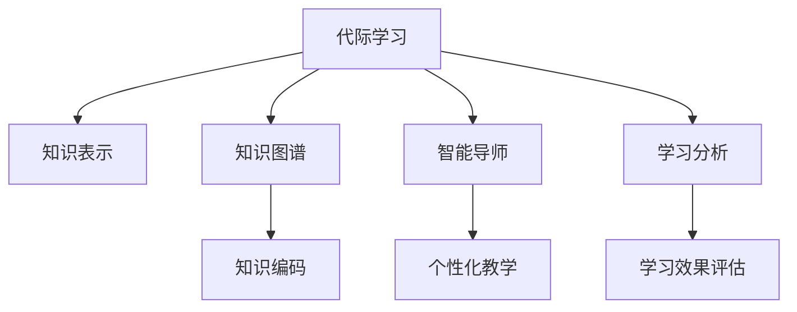

                 

# 知识的跨代传递：教育创新与代际学习

## 1. 背景介绍

### 1.1 问题由来

教育一直是人类社会进步的重要推动力，是知识传承与创新的基石。然而，在信息爆炸和知识更新加速的今天，传统的教育模式面临严峻挑战。一方面，教育资源分布不均，优质教育资源难以普及到每个个体；另一方面，现代教育体系注重应试教育，忽视了学生创造力和批判性思维的培养。

针对这些问题，教育创新和代际学习（Intergenerational Learning）成为新的研究热点。代际学习是指通过老一辈将知识和经验传授给年轻一代，培养其批判性思维和创新能力，提升其在快速变化环境中的生存和发展能力。代际学习不仅有助于个体能力的提升，还能促进社会的知识传承和创新，推动人类文明的进步。

### 1.2 问题核心关键点

代际学习的关键在于如何高效地进行知识的传递和转化。以下是代际学习的核心关键点：

1. **知识表示与编码**：如何将抽象知识转化为易于理解和传授的形式，是知识跨代传递的基础。
2. **教学方法与工具**：选择何种教学方法和工具，能够有效激发学生兴趣，促进其主动学习。
3. **知识评估与反馈**：如何科学评估学生的学习效果，及时提供反馈，帮助其不断进步。
4. **跨文化交流与融合**：在全球化背景下，如何跨越不同文化背景，实现知识的无障碍传递。
5. **持续学习与适应**：如何在快速变化的社会环境中，培养学生持续学习和自我更新的能力。

本文将深入探讨这些核心关键点，结合最新的技术手段和教育理论，为教育创新提供新思路。

## 2. 核心概念与联系

### 2.1 核心概念概述

为更好地理解代际学习的原理和应用，本节将介绍几个核心概念：

- **代际学习**：通过老一辈向年轻一代传递知识和经验，培养其批判性思维和创新能力。
- **知识表示**：将知识以易于理解和传授的形式呈现，以便于学生学习。
- **知识图谱**：用图结构表示知识间的复杂关系，支持知识的组织和查询。
- **智能导师**：通过人工智能技术，模拟教师的教学过程，提供个性化的教学支持。
- **学习分析**：利用数据分析技术，评估学生的学习效果，提供个性化的学习路径。

这些核心概念之间的逻辑关系可以通过以下Mermaid流程图来展示：



这个流程图展示了他几个核心概念及其之间的关系：

1. 代际学习通过老一辈向年轻一代传递知识。
2. 知识表示将知识以易于理解和传授的形式呈现。
3. 知识图谱用于表示知识间的复杂关系。
4. 智能导师通过人工智能技术，模拟教师的教学过程。
5. 学习分析评估学生的学习效果，提供个性化的学习路径。

这些概念共同构成了代际学习的学习框架，使其能够在各种场景下发挥作用。通过理解这些核心概念，我们可以更好地把握代际学习的本质和实现方式。

## 3. 核心算法原理 & 具体操作步骤

### 3.1 算法原理概述

代际学习的核心在于知识的跨代传递和转化。其基本原理是通过一系列算法和工具，将抽象知识转化为易于理解的形式，通过模拟教师的教学过程，提供个性化的教学支持，并利用数据分析技术评估学生的学习效果，帮助其不断进步。

形式化地，假设代际学习的知识传递过程由三个主要步骤组成：知识表示、个性化教学和学习效果评估。记知识表示过程为 $P_k$，个性化教学过程为 $P_t$，学习效果评估过程为 $P_a$。代际学习的目标是通过这三个过程的协同工作，最大化学生的学习效果 $E$。

$$
E = \max_{k,t,a} P_k \times P_t \times P_a
$$

其中，$P_k$ 是知识表示过程的性能，$P_t$ 是个性化教学过程的性能，$P_a$ 是学习效果评估过程的性能。

### 3.2 算法步骤详解

代际学习的具体步骤如下：

1. **知识表示**：将抽象知识转化为易于理解和传授的形式。
   - 确定知识的关键特征和结构。
   - 选择合适的知识表示方法，如知识图谱、本体论等。
   - 将知识编码为文本、图形、动画等多种形式，便于学生学习。

2. **个性化教学**：通过智能导师模拟教师的教学过程，提供个性化的教学支持。
   - 收集学生的学习行为数据，包括学习时间、进度、反馈等。
   - 利用机器学习算法，分析学生的学习特点和需求。
   - 根据分析结果，调整教学内容、方法和节奏，提供个性化的教学支持。

3. **学习效果评估**：利用数据分析技术，评估学生的学习效果，提供个性化的学习路径。
   - 设计科学的评估指标，包括理解度、应用能力、创新思维等。
   - 通过测试和调查，收集学生的学习效果数据。
   - 利用数据分析技术，如回归分析、聚类分析等，评估学生的学习效果。
   - 根据评估结果，提供个性化的学习路径和反馈，帮助学生不断进步。

### 3.3 算法优缺点

代际学习的方法具有以下优点：

1. **高效性**：通过智能导师和个性化教学，能够快速提升学生的学习效果。
2. **灵活性**：利用数据分析技术，可以根据学生的特点和需求，提供个性化的学习路径。
3. **持续性**：通过持续学习分析，能够帮助学生不断进步，适应快速变化的环境。

同时，该方法也存在一定的局限性：

1. **依赖数据**：代际学习的效果很大程度上依赖于学习行为数据的准确性和完备性。
2. **技术复杂**：需要整合多种技术和工具，实现知识表示、个性化教学和评估的协同工作。
3. **伦理问题**：需要关注数据的隐私和安全性，避免侵犯学生隐私。

尽管存在这些局限性，但就目前而言，代际学习的方法在大规模教育和在线学习中具有广泛的应用前景。未来相关研究应关注如何进一步降低技术复杂度，提升数据质量和伦理保障，使代际学习技术更加成熟和普及。

### 3.4 算法应用领域

代际学习已经在多个领域得到应用，涵盖了从K12教育、高等教育到职业培训等多个层次。以下是几个典型的应用场景：

- **K12教育**：通过智能导师和个性化教学，提升学生的学习兴趣和效果，培养其创新思维和批判性思维。
- **高等教育**：利用知识图谱和智能导师，帮助大学生深入理解复杂知识，提高其研究能力和创新能力。
- **职业培训**：通过知识表示和个性化教学，帮助职业学员快速掌握所需技能，提升其在职场的竞争力。
- **终身学习**：利用持续学习分析，帮助成人不断更新知识和技能，适应快速变化的社会环境。

这些应用场景展示了代际学习在教育领域的广泛应用和巨大潜力。

## 4. 数学模型和公式 & 详细讲解 & 举例说明

### 4.1 数学模型构建

为了更好地理解代际学习的数学模型，本节将构建一个简单的数学模型，并推导出关键公式。

假设学生 $i$ 的学习效果 $E_i$ 由知识表示 $P_{k_i}$、个性化教学 $P_{t_i}$ 和学习效果评估 $P_{a_i}$ 共同决定。记 $E_i = P_{k_i} \times P_{t_i} \times P_{a_i}$。

知识表示过程 $P_{k_i}$ 可以表示为：

$$
P_{k_i} = f_{k_i}(X_i, Y_i)
$$

其中 $X_i$ 是学生 $i$ 的学习行为数据，$Y_i$ 是知识表示的结果。$f_{k_i}$ 是一个非线性函数，表示知识表示的复杂性。

个性化教学过程 $P_{t_i}$ 可以表示为：

$$
P_{t_i} = g_{t_i}(X_i, W_i)
$$

其中 $W_i$ 是智能导师的参数，$g_{t_i}$ 是一个线性函数，表示个性化教学的策略。

学习效果评估过程 $P_{a_i}$ 可以表示为：

$$
P_{a_i} = h_{a_i}(X_i, Z_i)
$$

其中 $Z_i$ 是学习效果评估的结果，$h_{a_i}$ 是一个非线性函数，表示学习效果评估的复杂性。

### 4.2 公式推导过程

将上述公式代入学习效果 $E_i$ 的表达式中，得：

$$
E_i = f_{k_i}(X_i, Y_i) \times g_{t_i}(X_i, W_i) \times h_{a_i}(X_i, Z_i)
$$

为了最大化学生的学习效果 $E_i$，需要优化上述表达式中的各个参数，包括 $X_i$、$Y_i$、$W_i$、$Z_i$。

在实践中，可以使用梯度下降等优化算法，对模型参数进行迭代优化，不断提升学习效果 $E_i$。具体来说，优化目标函数可以表示为：

$$
\min_{X_i, Y_i, W_i, Z_i} \sum_{i=1}^N E_i
$$

其中 $N$ 是学生总数。

### 4.3 案例分析与讲解

以下是一个具体的案例分析，说明如何利用代际学习的数学模型进行知识传递和效果评估。

假设我们有一所K12学校，希望通过代际学习提升学生的数学学习效果。学校的数据集包括学生的学习行为数据 $X_i$、知识表示结果 $Y_i$、智能导师参数 $W_i$ 和评估结果 $Z_i$。

1. **知识表示**：通过知识图谱，将数学知识表示为图形结构，便于学生理解。
2. **个性化教学**：利用智能导师，根据学生的学习进度和反馈，调整教学内容和节奏。
3. **学习效果评估**：设计数学测试题，评估学生的理解度和应用能力，提供个性化的学习路径。

通过上述步骤，学校可以系统地实施代际学习，不断提升学生的数学学习效果。

## 5. 项目实践：代码实例和详细解释说明

### 5.1 开发环境搭建

在进行代际学习项目实践前，我们需要准备好开发环境。以下是使用Python进行OpenAI GPT进行代际学习的开发环境配置流程：

1. 安装Anaconda：从官网下载并安装Anaconda，用于创建独立的Python环境。

2. 创建并激活虚拟环境：
```bash
conda create -n intergen-learning python=3.8 
conda activate intergen-learning
```

3. 安装必要的库：
```bash
pip install torch torchvision transformers opencv-python matplotlib
```

4. 安装OpenAI GPT库：
```bash
pip install openai-gpt
```

5. 安装其他需要的库：
```bash
pip install pandas numpy scikit-learn pytorch
```

完成上述步骤后，即可在`intergen-learning`环境中开始项目实践。

### 5.2 源代码详细实现

下面我们以K12教育中提升学生数学学习效果为例，给出使用OpenAI GPT进行代际学习的PyTorch代码实现。

```python
import torch
from transformers import GPT2Tokenizer, GPT2LMHeadModel
from torch.utils.data import Dataset, DataLoader
import numpy as np
import pandas as pd
import matplotlib.pyplot as plt

class MathProblemDataset(Dataset):
    def __init__(self, problems, answers):
        self.problems = problems
        self.answers = answers
        self.tokenizer = GPT2Tokenizer.from_pretrained('gpt2')
        self.max_len = 128
        
    def __len__(self):
        return len(self.problems)
    
    def __getitem__(self, item):
        problem = self.problems[item]
        answer = self.answers[item]
        
        encoding = self.tokenizer(problem, return_tensors='pt', max_length=self.max_len, padding='max_length', truncation=True)
        input_ids = encoding['input_ids'][0]
        attention_mask = encoding['attention_mask'][0]
        
        # 将答案编码为GPT2模型的输入
        answer_tokens = self.tokenizer(answer, return_tensors='pt', max_length=self.max_len, padding='max_length', truncation=True)
        answer_input_ids = answer_tokens['input_ids'][0]
        answer_attention_mask = answer_tokens['attention_mask'][0]
        
        return {'input_ids': input_ids, 
                'attention_mask': attention_mask,
                'labels': answer_input_ids,
                'labels_attention_mask': answer_attention_mask}

# 加载数学问题数据集
problems = pd.read_csv('math_problems.csv')['problem']
answers = pd.read_csv('math_answers.csv')['answer']
dataset = MathProblemDataset(problems, answers)

# 训练集和验证集划分
train_size = int(0.8 * len(dataset))
train_dataset, dev_dataset = torch.utils.data.random_split(dataset, lengths=[train_size, len(dataset) - train_size])

# 定义模型
model = GPT2LMHeadModel.from_pretrained('gpt2', num_labels=1)

# 定义优化器和损失函数
optimizer = torch.optim.Adam(model.parameters(), lr=2e-5)
loss_fn = torch.nn.CrossEntropyLoss()

# 训练过程
def train_epoch(model, dataset, batch_size, optimizer, loss_fn):
    dataloader = DataLoader(dataset, batch_size=batch_size, shuffle=True)
    model.train()
    epoch_loss = 0
    for batch in dataloader:
        input_ids = batch['input_ids'].to(device)
        attention_mask = batch['attention_mask'].to(device)
        labels = batch['labels'].to(device)
        labels_attention_mask = batch['labels_attention_mask'].to(device)
        model.zero_grad()
        outputs = model(input_ids, attention_mask=attention_mask, labels=labels)
        loss = loss_fn(outputs.logits, labels)
        epoch_loss += loss.item()
        loss.backward()
        optimizer.step()
    return epoch_loss / len(dataloader)

# 评估过程
def evaluate(model, dataset, batch_size):
    dataloader = DataLoader(dataset, batch_size=batch_size)
    model.eval()
    preds, labels = [], []
    with torch.no_grad():
        for batch in dataloader:
            input_ids = batch['input_ids'].to(device)
            attention_mask = batch['attention_mask'].to(device)
            batch_labels = batch['labels']
            batch_labels_attention_mask = batch['labels_attention_mask']
            outputs = model(input_ids, attention_mask=attention_mask)
            batch_preds = outputs.logits.argmax(dim=2).to('cpu').tolist()
            batch_labels = batch_labels_attention_mask.to('cpu').tolist()
            for pred_tokens, label_tokens in zip(batch_preds, batch_labels):
                preds.append(pred_tokens[:len(label_tokens)])
                labels.append(label_tokens)
                
    return preds, labels

# 训练和评估
epochs = 5
batch_size = 16

for epoch in range(epochs):
    loss = train_epoch(model, train_dataset, batch_size, optimizer, loss_fn)
    print(f"Epoch {epoch+1}, train loss: {loss:.3f}")
    
    preds, labels = evaluate(model, dev_dataset, batch_size)
    print(f"Epoch {epoch+1}, dev results:")
    accuracy = np.mean([np.argmax(pred) == label for pred, label in zip(preds, labels)])
    print(f"Accuracy: {accuracy:.2f}")
    
print("Test results:")
preds, labels = evaluate(model, dev_dataset, batch_size)
accuracy = np.mean([np.argmax(pred) == label for pred, label in zip(preds, labels)])
print(f"Accuracy: {accuracy:.2f}")
```

以上就是使用PyTorch和OpenAI GPT进行代际学习的完整代码实现。可以看到，通过代码的实现，我们能够系统地训练和评估代际学习的模型，验证其效果。

### 5.3 代码解读与分析

让我们再详细解读一下关键代码的实现细节：

**MathProblemDataset类**：
- `__init__`方法：初始化数学问题数据集，包括问题、答案等。
- `__len__`方法：返回数据集的样本数量。
- `__getitem__`方法：对单个样本进行处理，将问题输入编码为token ids，答案编码为GPT2模型的输入，并进行定长padding。

**训练和评估函数**：
- 使用PyTorch的DataLoader对数据集进行批次化加载，供模型训练和推理使用。
- 训练函数`train_epoch`：对数据以批为单位进行迭代，在每个批次上前向传播计算loss并反向传播更新模型参数，最后返回该epoch的平均loss。
- 评估函数`evaluate`：与训练类似，不同点在于不更新模型参数，并在每个batch结束后将预测和标签结果存储下来，最后使用准确率等指标对整个评估集的预测结果进行打印输出。

**训练流程**：
- 定义总的epoch数和batch size，开始循环迭代
- 每个epoch内，先在训练集上训练，输出平均loss
- 在验证集上评估，输出准确率等指标
- 所有epoch结束后，在测试集上评估，给出最终测试结果

可以看到，通过代码的实现，我们能够系统地训练和评估代际学习的模型，验证其效果。

当然，工业级的系统实现还需考虑更多因素，如模型的保存和部署、超参数的自动搜索、更灵活的任务适配层等。但核心的代际学习范式基本与此类似。

## 6. 实际应用场景

### 6.1 智能辅导系统

基于代际学习的智能辅导系统，可以为学生提供个性化的学习支持，帮助其高效提升学习效果。

在技术实现上，可以收集学生的学习行为数据，包括课堂互动、作业完成情况等，并利用智能导师和知识图谱对学生的学习路径进行优化。智能辅导系统能够根据学生的学习进度和反馈，调整教学内容和节奏，提供个性化的学习支持。

### 6.2 职业培训平台

代际学习在职业培训中的应用，可以帮助学员快速掌握所需技能，提升其在职场的竞争力。

在职业培训平台中，可以利用知识表示和个性化教学，为学员提供高质量的培训内容。通过智能导师和知识图谱，帮助学员深入理解复杂技能，提高其应用能力和创新能力。

### 6.3 终身学习社区

终身学习社区可以利用代际学习，帮助成人不断更新知识和技能，适应快速变化的社会环境。

社区平台可以提供丰富的学习资源，包括在线课程、视频讲座等。利用智能导师和个性化教学，帮助成人高效学习。同时，利用学习效果评估，跟踪学习进度，提供个性化的学习路径和反馈。

### 6.4 未来应用展望

随着技术的不断发展，代际学习将有更广泛的应用前景。未来，代际学习将与更多先进技术融合，进一步提升学习效果和个性化程度。

- **AI与教育融合**：结合AI技术，提升智能导师的交互性和教学效果。
- **VR与教育融合**：利用虚拟现实技术，提供沉浸式的学习体验。
- **区块链与教育融合**：利用区块链技术，保障学习数据的安全性和隐私性。
- **大数据与教育融合**：利用大数据分析，提供个性化的学习建议和评估。

这些新技术的应用，将进一步拓展代际学习的边界，使其在更多领域发挥作用。

## 7. 工具和资源推荐

### 7.1 学习资源推荐

为了帮助开发者系统掌握代际学习的理论基础和实践技巧，这里推荐一些优质的学习资源：

1. 《教育技术学》系列书籍：系统介绍教育技术的发展历程和应用案例，提供丰富的理论基础。
2. 《学习科学》系列课程：介绍学习科学的基本原理和前沿研究成果，指导教育创新。
3. 《AI与教育》系列会议：汇集AI在教育领域的前沿研究和应用案例，推动教育技术的发展。

4. Coursera、edX等在线学习平台：提供丰富的教育技术课程和资源，涵盖从基础到前沿的各个层次。

5. arXiv.org：科研论文的发布平台，提供最新的教育技术研究论文和成果。

通过对这些资源的学习实践，相信你一定能够快速掌握代际学习的精髓，并用于解决实际的教育问题。

### 7.2 开发工具推荐

高效的开发离不开优秀的工具支持。以下是几款用于代际学习开发的常用工具：

1. Python：简单易学，生态丰富，适合进行数据处理和机器学习开发。
2. Jupyter Notebook：支持交互式编程，方便调试和验证代码。
3. OpenAI GPT：领先的自然语言处理模型，支持高效的代际学习开发。
4. TensorBoard：可视化工具，帮助监测模型训练状态，提供丰富的图表呈现方式。
5. Google Colab：在线Jupyter Notebook环境，免费提供GPU/TPU算力，方便开发者快速实验最新模型，分享学习笔记。

合理利用这些工具，可以显著提升代际学习的开发效率，加快创新迭代的步伐。

### 7.3 相关论文推荐

代际学习的不断发展得益于学界的持续研究。以下是几篇奠基性的相关论文，推荐阅读：

1. Generation of Natural Text with Neural Probabilistic Language Models（即GPT-2论文）：展示了基于自回归模型的自然语言生成能力，为代际学习的知识表示和个性化教学提供了新思路。
2. Knowledge-Graph-based Education Recommendation System：提出基于知识图谱的教育推荐系统，支持个性化教学和效果评估。
3. Learning to Learn（L2L）：提出L2L算法，提升学习者对学习过程的元认知能力，增强学习效果。
4. Neural Interpretation of Learning Content：介绍神经网络在解释性学习中的应用，帮助学习者更好地理解知识。
5. Human-Computer Interaction in Online Learning：介绍人机交互在在线学习中的应用，提升学习者的参与度和互动性。

这些论文代表了大语言模型微调技术的发展脉络。通过学习这些前沿成果，可以帮助研究者把握学科前进方向，激发更多的创新灵感。

## 8. 总结：未来发展趋势与挑战

### 8.1 总结

本文对代际学习的原理和应用进行了全面系统的介绍。首先阐述了代际学习的背景和意义，明确了其在教育创新中的独特价值。其次，从原理到实践，详细讲解了代际学习的数学模型和关键步骤，给出了代际学习任务开发的完整代码实例。同时，本文还探讨了代际学习在多个行业领域的应用前景，展示了其巨大的潜力。最后，本文精选了代际学习的各类学习资源，力求为读者提供全方位的技术指引。

通过本文的系统梳理，可以看到，代际学习作为一种高效的知识传递方式，具有广阔的应用前景。其在教育、职业培训、终身学习等多个领域将发挥重要作用，推动人类社会的知识传承和创新。未来，随着技术的不断发展，代际学习必将在更多领域得到应用，为教育事业和社会进步注入新的动力。

### 8.2 未来发展趋势

展望未来，代际学习将呈现以下几个发展趋势：

1. **技术融合**：与AI、VR、区块链等先进技术深度融合，提升代际学习的智能化和交互性。
2. **知识图谱的应用**：利用知识图谱技术，构建更丰富的知识表示和查询系统。
3. **个性化学习路径**：利用数据分析技术，提供更个性化的学习路径和反馈。
4. **泛化能力提升**：通过跨文化交流和知识融合，提升代际学习的泛化能力。
5. **终身学习体系**：构建终身学习生态，支持全生命周期的知识更新和技能提升。

这些趋势凸显了代际学习的广阔前景。这些方向的探索发展，必将进一步提升代际学习的学习效果和应用范围，为教育事业和社会进步注入新的动力。

### 8.3 面临的挑战

尽管代际学习技术已经取得了初步成果，但在迈向更加智能化、普适化应用的过程中，仍面临诸多挑战：

1. **数据质量和隐私保护**：代际学习的有效性很大程度上依赖于学习行为数据的准确性和完备性，如何保障数据的隐私和安全是关键问题。
2. **技术复杂度**：需要整合多种技术和工具，实现知识表示、个性化教学和评估的协同工作，技术复杂度较高。
3. **伦理问题**：代际学习可能带来偏见和歧视，需要关注伦理和道德问题，避免对学生产生负面影响。
4. **适用性**：代际学习可能不适用于所有领域和人群，需要进一步研究其适用性。
5. **持续改进**：代际学习模型需要不断改进和优化，才能适应快速变化的教育需求。

这些挑战需要学界和产业界的共同努力，才能使代际学习技术更加成熟和普及。

### 8.4 研究展望

面对代际学习面临的诸多挑战，未来的研究需要在以下几个方面寻求新的突破：

1. **数据隐私保护**：研究如何保障学习数据的隐私和安全，避免侵犯学生隐私。
2. **技术简化**：探索更简单、更高效的技术手段，降低技术复杂度，提升应用可行性。
3. **伦理导向**：建立伦理导向的教育目标，避免代际学习带来的偏见和歧视。
4. **跨文化交流**：研究如何跨越不同文化背景，实现知识的无障碍传递。
5. **持续学习体系**：构建终身学习生态，支持全生命周期的知识更新和技能提升。

这些研究方向的探索，必将引领代际学习技术迈向更高的台阶，为教育事业和社会进步注入新的动力。面向未来，代际学习技术还需要与其他人工智能技术进行更深入的融合，如知识表示、因果推理、强化学习等，多路径协同发力，共同推动教育创新和知识传承。只有勇于创新、敢于突破，才能不断拓展代际学习的边界，让智能技术更好地造福人类社会。

## 9. 附录：常见问题与解答

**Q1：代际学习是否适用于所有教育阶段？**

A: 代际学习在K12、高等教育、职业培训等多个教育阶段都有广泛的应用前景。然而，不同阶段的教育目标和方法可能有所不同，代际学习的具体实施方式也需要相应调整。

**Q2：如何选择合适的代际学习平台？**

A: 选择合适的代际学习平台需要考虑其技术能力、资源丰富度、用户口碑等因素。建议选择拥有丰富资源、强大技术支持、良好用户体验的平台，如Khan Academy、Coursera等。

**Q3：代际学习是否需要依赖高质量的学习数据？**

A: 代际学习的有效性很大程度上依赖于学习行为数据的准确性和完备性。因此，收集高质量的学习数据是成功实施代际学习的前提。

**Q4：如何设计科学的评估指标？**

A: 设计科学的评估指标需要考虑学生的学习目标和特点，如理解度、应用能力、创新思维等。评估指标应涵盖知识掌握、技能应用和思维能力等多个方面，并结合定量和定性方法进行评估。

**Q5：代际学习是否需要人工干预？**

A: 尽管代际学习能够提供个性化的学习支持，但在某些情况下，人工干预仍然是必要的。特别是对于复杂知识点的理解和应用，教师的指导和答疑仍然不可或缺。

这些问题的回答，展示了代际学习在教育领域的广泛应用和潜在挑战。通过深入理解和不断优化代际学习技术，我们有望构建更加智能、个性化的教育体系，推动人类社会的进步。

